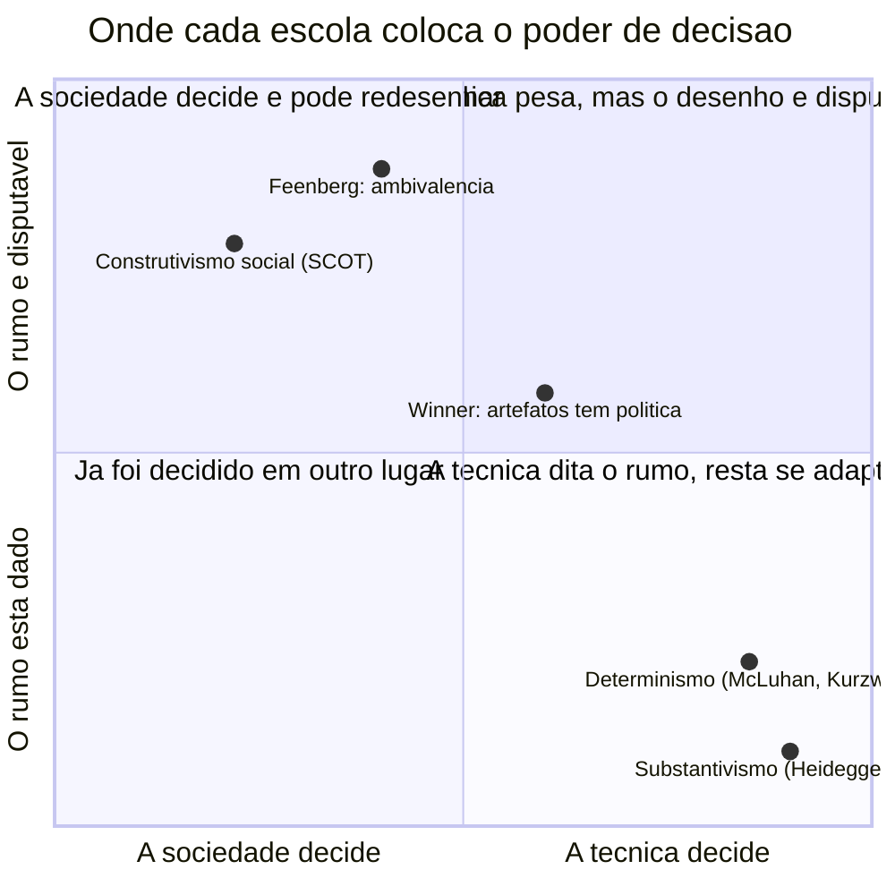
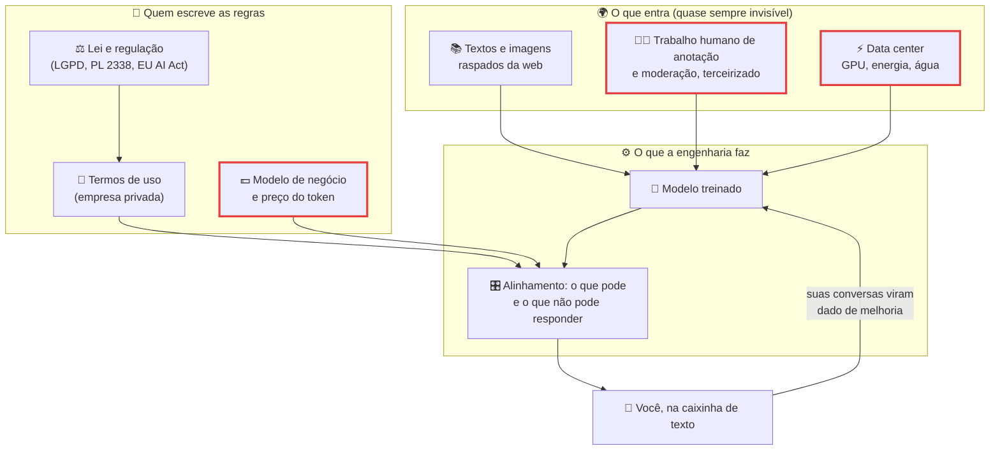
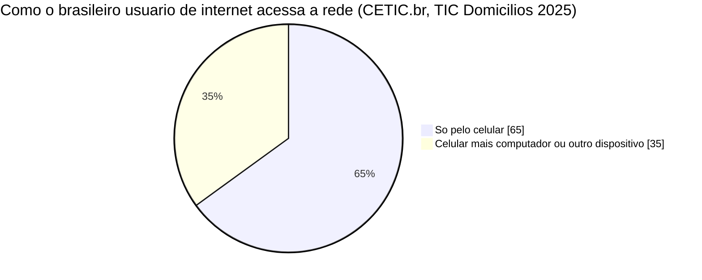
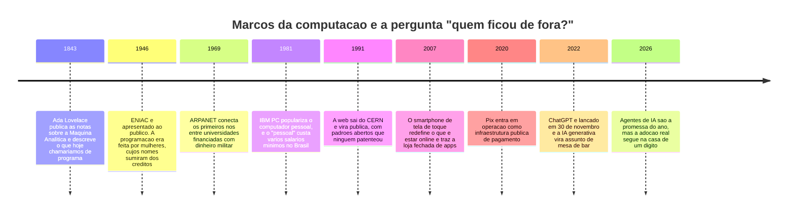

# A tecnologia não é neutra: Computação e Sociedade

> [!quote] Antes de você acordar, alguém já tinha decidido
> *Você desbloqueou o celular hoje de manhã e a primeira coisa que apareceu não foi escolhida por você. Foi escolhida por um time de engenheiros, por uma métrica de negócio e por uma linha de código que alguém escreveu num sprint. Nesta disciplina a gente vai ler essa linha de código como se fosse um documento político. Porque é.*

Quase todo engenheiro já disse a frase confortável: *"a tecnologia é neutra, o problema é o uso"*. Ela parece equilibrada e é, na maioria das vezes, falsa. Toda escolha de projeto (o que vem ligado por padrão, o que é opt-out, quem cabe no formulário, qual conexão o app supõe que existe) distribui vantagem e desvantagem entre pessoas reais **antes** de qualquer uso.

Esta primeira aula de **Computação, Sociedade e Inclusão** não traz respostas prontas: traz um **método** e um **vocabulário**. No fim do semestre você continua livre para achar que a tecnologia é neutra. Só não vai mais conseguir achar isso sem argumento.

---

## 1. 🎯 Um app, quatro lentes

Pegue o aplicativo em que você passou mais tempo esta semana. Provavelmente é um feed. No Brasil, **92% dos usuários de internet trocaram mensagens instantâneas** e **cerca de 80% usaram redes sociais** nos últimos três meses (CETIC.br, TIC Domicílios 2025). É o cotidiano de quase todo mundo que você conhece.

Um feed parece uma coisa só. Não é. A ementa da disciplina (PPC, Res. CONSUP 130/2023) começa aí: a crítica dos aspectos **sociais, econômicos, culturais e políticos** da computação. São as quatro lentes, e elas voltam em toda aula, todo trabalho e na prova.

| Lente | Pergunta-guia | O que ela revela no feed |
|---|---|---|
| 🧑‍🤝‍🧑 **Social** | Quem usa, quem fica de fora, que relações isso cria? | Quem tem só celular vê um recorte diferente de quem tem computador. Quem fica sem dados no dia 20 some do grupo. |
| 💰 **Econômica** | Quem paga, quem lucra, que trabalho isso cria e destrói? | Você paga em atenção e em dado. O trabalho de moderação e anotação existe, é mal pago e é invisível. |
| 🎭 **Cultural** | Que valores e hábitos isso produz? | O formato premia o que prende: vídeo curto, corte rápido, indignação. Muda o que você acha bonito e verdadeiro. |
| 🏛️ **Política** | Quem decide as regras e que poder isso concentra? | A regra de moderação é escrita por uma empresa privada e vale para milhões de brasileiros. O Congresso corre atrás. |

Nenhuma das quatro perguntas é "isso é bom ou ruim?". A pergunta moral vem depois. Primeiro vem a descrição honesta.

> [!info] 🇧🇷 Segunda passada: o app de entrega
> Rode as mesmas lentes no iFood ou no 99Food e a lente econômica sai do abstrato. Segundo o IBGE (PNAD Contínua, trabalho em plataformas digitais), o Brasil tinha **1,7 milhão de pessoas trabalhando por plataformas digitais no 3º trimestre de 2024**, alta de **25,4% sobre 2022**, e cerca de **29% delas (485 mil) em apps de entrega**. O algoritmo que distribui as corridas é, para essas pessoas, o chefe: um chefe que não conversa, não explica e não assina carteira. Não é "uso indevido de ferramenta neutra": é decisão de arquitetura de software com efeito trabalhista.

> [!example] 🧪 Atividade 1: medir o próprio consumo e passar pelas quatro lentes
> **Ferramenta:** o painel de tempo de tela do seu celular (**Android:** Configurações → *Bem-estar digital* → *Painel*; **iPhone:** Ajustes → *Tempo de Uso*).
>
> 1. Anote os **3 apps com mais tempo** nos últimos 7 dias (horas e minutos) e os **desbloqueios por dia**.
> 2. Pegue o app nº 1 e preencha a tabela das quatro lentes com **evidência do seu aparelho**, não com opinião. Evidência aceitável na lente econômica: "contei 14 anúncios em 10 minutos de rolagem".
>
> **Resultado esperado:** print do painel (pode borrar nomes de contatos) e a tabela de 4 linhas, cada uma com uma evidência observável e nenhuma frase que comece com "eu acho". Sem o painel, use o consumo de dados por app e registre em MB.

---

## 2. 🧭 Três jeitos de pensar a tecnologia

Quando alguém explica por que o mundo mudou com a internet, quase sempre está usando (sem saber) uma de três teorias. Saber o nome delas evita discussão de bar.

| Escola | Tese | Quem sustenta | Onde falha |
|---|---|---|---|
| **Determinismo tecnológico** | A técnica dirige a sociedade; o resto se adapta | McLuhan, da fórmula "o meio é a mensagem" (*Understanding Media*, 1964); Kurzweil na versão otimista | Vira escolha humana em destino. Se é inevitável, ninguém é responsável |
| **Construtivismo social (SCOT)** | O artefato que venceu foi o que ganhou a disputa social, não o "melhor" (o caso clássico é a bicicleta de rodas iguais, que venceu a de roda gigante por exigência de grupos diversos, não por superioridade técnica) | Pinch e Bijker, *Social Studies of Science*, v. 14, 1984, pp. 399 a 441 | Se tudo é negociação social, o artefato some da análise |
| **Via crítica** | O artefato carrega política, e essa política pode ser redesenhada | Winner (1980); Feenberg (*Questioning Technology*, 1999) | Dá trabalho: exige olhar o objeto concreto, caso a caso |

![[Recursos/Computação, Sociedade e Inclusão/A tecnologia não é neutra - Computação e Sociedade/langdon-winner.png|Langdon Winner, autor de "Do Artifacts Have Politics?" (1980). Foto: Kandinski, Wikimedia Commons, CC BY-SA 2.0]]

### O teste de Winner

Em 1980, o cientista político **Langdon Winner** publicou na *Daedalus* um artigo de 16 páginas com título em forma de pergunta: *"Do Artifacts Have Politics?"*. A resposta é sim, de duas maneiras.

> [!abstract] 🧠 Lente filosófica: Langdon Winner, "Do Artifacts Have Politics?" (*Daedalus*, v. 109, n. 1, 1980, pp. 121 a 136)
> Winner recusa os dois extremos: nem a técnica decide tudo, nem ela é folha em branco. Ele manda olhar para as coisas mesmas e separa dois casos, na p. 123: *"two ways in which artifacts can contain political properties"*. **Primeira:** o projeto de um dispositivo vira o modo de resolver uma disputa política numa comunidade. **Segunda:** há tecnologias *inerentemente políticas*, que exigem certo arranjo de poder para funcionar (a bomba atômica, cujo sistema social interno, p. 131, teria de ser autoritário). Sobre a colheitadeira, p. 127: ela *"is not merely the symbol of a social order that rewards some while punishing others; it is in a true sense an embodiment of that order"* (não é só o símbolo de uma ordem que premia alguns e pune outros: é a materialização dela).
>
> **A pergunta que fica:** dos sistemas que você já ajudou a construir, qual resolveu uma disputa sem que ninguém precisasse votar?

**Caso 1: as pontes baixas de Long Island.** Winner conta que as cerca de duzentas passarelas sobre as *parkways* de Long Island, erguidas sob o comando do urbanista Robert Moses, teriam sido feitas baixas demais para ônibus passarem, barrando das praias de Jones Beach quem dependia de ônibus, em geral mais pobre e negro. Na p. 123 ele afirma que elas *"were deliberately designed to achieve a particular social effect"*.

![[Recursos/Computação, Sociedade e Inclusão/A tecnologia não é neutra - Computação e Sociedade/pontes-southern-state-parkway.png|Passarela baixa sobre a Southern State Parkway, em Long Island, uma das vias do sistema de Robert Moses. Foto: Dougtone, Wikimedia Commons, CC BY-SA 2.0]]

> [!warning] Honestidade histórica: este caso é disputado
> O exemplo mais citado da filosofia da tecnologia é o mais contestado. Em 1999, o sociólogo **Bernward Joerges** publicou "Do Politics Have Artefacts?" (*Social Studies of Science*, v. 29, n. 3, pp. 411 a 431) argumentando que passarelas baixas eram o **padrão construtivo de parkway** na época e que ônibus tinham permissão em algumas dessas vias. Woolgar e Cooper responderam na mesma edição (pp. 433 a 449).
>
> Guarde isso, porque é a lição de método mais importante da aula: **o argumento de Winner sobrevive mesmo que a história de Moses caia.** A crítica atinge a *intenção*, não o *efeito*. E na engenharia, efeito é o que sobra depois que a intenção vai embora.

**Caso 2: a colheitadeira de tomate.** Nos anos 1960, a Universidade da Califórnia desenvolveu com dinheiro público uma colheitadeira mecânica de tomate. Para a máquina funcionar, o tomate foi modificado: mais duro e mais uniforme. E como era cara, só fazia sentido para grandes produtores. Resultado descrito por Winner: produção concentrada em menos fazendas e milhares de postos de trabalho rural a menos. Ninguém conspirou. A política estava no aço, e o tomate mudou de gosto junto.

![[Recursos/Computação, Sociedade e Inclusão/A tecnologia não é neutra - Computação e Sociedade/colheitadeira-tomate.png|Colheitadeira mecânica de tomate da FMC, no museu The Henry Ford: a máquina que reorganizou uma agricultura inteira. Foto: Ellen, Wikimedia Commons, CC BY 2.0]]

O **teste de Winner**, versão de bolso para um code review: (1) que disputa este artefato resolve sem que ninguém precise votar? (2) quem é beneficiado e quem é excluído pelo desenho, antes de qualquer uso? (3) que arranjo de poder ele **exige** para funcionar (quem tem a chave, o servidor, o banco)? (4) se o resultado for injusto, dá para redesenhar, ou a injustiça é condição de funcionamento?

> [!example] 🧪 Atividade 2: aplicar o teste de Winner nas configurações de um app
> **Ferramenta:** as configurações de privacidade e anúncios de um app que você já tem (Instagram, TikTok, WhatsApp, Uber, iFood).
>
> 1. Encontre **3 evidências observáveis de escolha embutida**, com o caminho de menu de cada uma: o que vem **ligado por padrão**, o que é **opt-out**, quantos **toques** para desligar contra quantos para ligar, qual opção está em cinza claro.
> 2. Cronometre quanto tempo levou para achar a opção de desligar personalização de anúncios.
> 3. Responda as 4 perguntas do teste de Winner para esse app, em uma linha cada.
>
> **Resultado esperado:** tabela de 3 linhas (evidência · caminho de menu · quem ganha com esse padrão), o tempo cronometrado e as 4 respostas.

> [!example] 🧪 Atividade 3: interrogar um LLM e conferir a fonte
> **Ferramenta:** qualquer assistente de IA ([ChatGPT](https://chatgpt.com/), [Gemini](https://gemini.google.com/), [Claude](https://claude.ai/), [DeepSeek](https://chat.deepseek.com/)).
>
> 1. Pergunte, exatamente assim: **"A tecnologia é neutra?"**. Salve a resposta. Em seguida, no mesmo chat: **"Cite a fonte de cada afirmação que você fez, com autor, obra e ano."**
> 2. Escolha **uma** fonte citada e confira se existe, no [Google Acadêmico](https://scholar.google.com.br/) ou no site da revista. Anote se (a) existe e diz aquilo, (b) existe mas diz outra coisa, ou (c) não existe.
> 3. Classifique a resposta do passo 1 em uma das três escolas da tabela acima.
>
> **Resultado esperado:** print das duas respostas, o veredito sobre a fonte (a, b ou c) e a classificação justificada em uma frase. Vamos contar em sala quantos caíram no caso (c).

---

## 3. 🧩 Sistemas sociotécnicos: nada é só código

Um sistema de computação nunca é só o código. É o código **mais** as pessoas que operam, **mais** as regras que autorizam, **mais** os incentivos de quem paga, **mais** a infraestrutura que ninguém vê. Isso é um **sistema sociotécnico**. Quem só enxerga o repositório está enxergando um terço do sistema que ele mesmo construiu.

| Sistema | O código | As pessoas | As regras | A infraestrutura |
|---|---|---|---|---|
| **Urna eletrônica** | votação e totalização | mesários, técnicos, fiscais de partido | Código Eleitoral, resoluções do TSE, testes públicos de segurança | transporte e guarda das urnas |
| **Pix** | mensageria e chaves | atendente de banco, quem faz Pix na lotérica para outra pessoa | regulamento do Banco Central, limites, devolução | data centers do BC e dos bancos, celular do usuário |
| **ChatGPT** | modelo, treino, inferência | anotadores, moderadores, revisores terceirizados | termos de uso, LGPD, EU AI Act | GPUs, energia, água de refrigeração, cabos submarinos |

![[Recursos/Computação, Sociedade e Inclusão/A tecnologia não é neutra - Computação e Sociedade/urna-eletronica.png|Urna eletrônica UE2020 com o terminal do mesário: a parte visível de um sistema que inclui lei, procedimento, fiscalização e logística. Foto: Antonio Augusto/Secom/TSE, Wikimedia Commons, domínio público]]

As três caixas com borda vermelha são as que o usuário nunca vê. O **Data Workers' Inquiry**, conduzido pelos próprios trabalhadores de dados em nove países, **com o Brasil entre eles**, documenta jornadas irregulares, pagamento em vale-presente em vez de salário no Amazon Mechanical Turk e trauma psicológico entre moderadores. Existe trabalho brasileiro por trás dos modelos que a sua turma usa na faculdade.

Dois conceitos nomeiam isso. **Caixa preta** (Bruno Latour, paráfrase): quando uma tecnologia funciona bem, deixa de ser discutida e vira caixa fechada; a engenharia é o trabalho de fechar caixas pretas, a crítica o de reabri-las. Latour chama de **actante** qualquer coisa que modifica um curso de ação, humana ou não: uma lombada é um "policial deitado", moralidade delegada ao asfalto. **Infraestrutura invisível** (Susan Leigh Star, *American Behavioral Scientist*, v. 43, n. 3, 1999, pp. 377 a 391, paráfrase): infraestrutura é o que só aparece **quando quebra**, como o encanamento, o DNS ou o Pix.

> [!abstract] 🧠 Lente filosófica: Andrew Feenberg, *Questioning Technology* (Routledge, 1999)
> Feenberg é o meio-termo desta disciplina e o antídoto contra o pessimismo. Contra o **substantivismo** (Heidegger, Ellul), que trata a técnica como destino, e contra o **instrumentalismo**, que a trata como ferramenta neutra, ele sustenta que a tecnologia é **ambivalente**: carrega valores, mas esses valores resultam de disputa e podem ser redesenhados (paráfrase). A **instrumentalização primária** transforma um objeto em matéria-prima técnica; a **secundária** o reinsere em contextos sociais e éticos, e é aí que os valores entram no projeto. Daí a **racionalização democrática**: usuários e grupos afetados intervêm e mudam o desenho técnico (os casos dele são o Minitel francês, apropriado como ferramenta de conversa contra o projeto oficial, e a ação de pacientes de aids sobre ensaios clínicos).
>
> **A pergunta que fica:** se os valores entram na instrumentalização secundária, e você escreve o código, em que reunião exatamente você deveria ter aberto a boca?

> [!example] 🧪 Atividade 4: quem escreveu a caixa preta?
> **Ferramenta:** [Wikipédia em português](https://pt.wikipedia.org/) (não exige conta).
>
> 1. No verbete **Pix**, clique em **Ver histórico** e anote total de edições, editores distintos na primeira página e data da última edição.
> 2. No artigo, classifique cada seção do índice em **técnica** (protocolo, chaves, arquitetura) ou **institucional** (Banco Central, regulamento, adoção, fraude) e conte quantas de cada. Repita com **Urna eletrônica brasileira**.
>
> **Resultado esperado:** os três números e a contagem técnica × institucional dos dois verbetes, mais duas linhas: se o sistema fosse "só código", por que a maior parte do texto não é sobre código?

---

## 4. 🇧🇷 O computador na sociedade brasileira em números

Todos os números abaixo vêm da mesma fonte: **CETIC.br/NIC.br, TIC Domicílios 2025**, coleta presencial de março a agosto de 2025 em 27.177 domicílios, divulgação em **09/12/2025**. É a estatística oficial brasileira sobre acesso e uso de tecnologia, e deveria estar em qualquer apresentação de produto feita no Brasil.

| Indicador (Brasil, 2025) | Total | O recorte que muda tudo |
|---|---|---|
| Domicílios com acesso à internet | **86%** | Classe A 100% · Classe DE **73%** |
| Domicílios **com computador** | **32%** | Classe A 97% · C 34% · **DE 10%**. Urbano 34% · Rural 15% |
| Pessoas usuárias de internet | 85% (157 milhões) | 28 milhões **não** usam: 16 mi com 60+ anos, 23 mi em área **urbana** |
| Acessa **só pelo celular** | **65%** | Classe A **5%** · Classe DE **87%**. Brancos 54% · Pretos **73%** · Pardos 69% |
| Ficou **sem pacote de dados** em 3 meses | **39%** (≈ 64 milhões) | Pré-pago 68%. Classe DE 49% · Norte 54%. Na DE, **22% não usaram nenhum app** |
| Conectividade significativa na faixa **alta** | **20%** | Era 16% em 2021; a faixa mais baixa caiu de 40% para 30% |
| Fez pagamento ou transferência por **Pix** | **75%** dos usuários | Indicador inédito em 2025 |
| Acessou o **gov.br** para algum serviço | **56%** | Superior 82% · Fundamental **26%**; **12% pediram a outra pessoa** que acessasse |
| Usou **IA generativa** | **32%** (≈ 50 milhões) | Classe A 69% · **DE 16%**. Superior 59% · Fundamental 17%. 16 a 24 anos 55% · **60+ anos 6%** |

Três leituras que valem a aula inteira:

1. **A inclusão digital brasileira aconteceu por celular, não por computador.** Você está no 7º período de Engenharia de Computação num país onde a chance de haver um PC em casa é de cerca de uma em três (uma em dez na classe DE). Isso separa quem **consome** de quem **produz** software, e a separação não é de talento: é de equipamento.
2. **O gradiente de 5% para 87% é o gráfico mais eloquente da desigualdade digital brasileira.** A tela pequena não é preferência estética: é limite estrutural, e decide o que dá para fazer (formulário longo, planilha, código, edital em PDF).
3. **"Estar conectado" e "conseguir usar" são coisas diferentes.** Aí está o contra-argumento empírico ao "todo mundo tem internet no bolso".

> [!abstract] 🧠 Lente filosófica: Álvaro Vieira Pinto, *O Conceito de Tecnologia* (Contraponto, 2005, escrito entre 1973 e 1974)
> Vieira Pinto (1909 a 1987) foi catedrático de filosofia na então Universidade do Brasil (hoje UFRJ) e chefiou o Departamento de Filosofia do ISEB. Ele distingue **quatro acepções** de "tecnologia": ciência da técnica (o sentido etimológico); sinônimo impreciso de técnica (o uso coloquial); o conjunto das técnicas de que uma sociedade dispõe numa fase histórica; e tecnologia como **ideologização da técnica**. É a quarta que sustenta a crítica: a "era tecnológica" não é fato neutro, é ideologia fabricada pelos países centrais para naturalizar a própria vanguarda e reduzir a periferia a um maravilhamento ingênuo diante da máquina. Daí o par **ingenuidade** e **criticidade**. A frase mais citada, "**toda tecnologia é uma ideologia**" (PINTO, 2005, v. 1, p. 322), tem página conferida em PIRES, L. F. R., *Iniciação & Formação Docente*, v. 8, n. 3, 2021.
>
> **A pergunta que fica:** a quem serve chamar 2026 de "a era da IA"? Quem ganha quando a adoção de uma tecnologia é descrita como inevitável em vez de escolhida?

> [!example] 🧪 Atividade 5: extrair três números do painel do CETIC.br
> **Ferramenta:** [painel de indicadores da TIC Domicílios](https://cetic.br/pt/pesquisa/domicilios/indicadores/) (série de 2005 a 2025 e, desde 2025, o módulo **M, Inteligência Artificial**).
>
> 1. Na tabela de **domicílios com acesso à internet**, anote o percentual de 2025 e o de 2015, com o **número da tabela** de onde tirou.
> 2. No indicador de **acesso exclusivo pelo celular**, extraia o valor da **classe DE** e da **classe A**. No módulo **M**, extraia o uso de **IA generativa** por escolaridade.
> 3. Monte um gráfico simples (serve app de planilha no celular) com os dois recortes extremos de um dos indicadores.
>
> **Resultado esperado:** os três números **com tabela e ano identificados**, o gráfico e uma frase no formato "o número da notícia é o da tabela X, coluna Y, coletado em Z". É o hábito que separa quem cita dado de quem repete manchete.

---

## 5. 🗓️ Uma história curta: quem decidiu e quem ficou de fora

A história da computação pode ser contada como sequência de decisões técnicas brilhantes, ou como sequência de decisões sobre **quem entra**. As duas versões são verdadeiras; a segunda quase nunca é contada. A linha do tempo técnica detalhada está em [[História da Computação]].

![[Recursos/Computação, Sociedade e Inclusão/A tecnologia não é neutra - Computação e Sociedade/ada-lovelace.png|Ada Lovelace, retrato de Alfred Edward Chalon. As notas dela de 1843 são o primeiro texto a tratar a máquina como algo que executa um procedimento descrito por um humano. Imagem: Science Museum Group, Wikimedia Commons, domínio público]]

O padrão se repete: a tecnologia chega primeiro a quem já tinha recurso, e a discussão sobre acesso vem depois, com o desenho já congelado. Por isso esta disciplina pergunta "quem fica de fora?" **durante** o projeto, e não no relatório de impacto.

> [!example] 🧪 Atividade 6: a mesma página, com dezesseis anos de diferença
> **Ferramenta:** [Wayback Machine](https://web.archive.org/), o arquivo histórico da web.
>
> 1. Cole a URL de um serviço público brasileiro (`gov.br`, `inss.gov.br`, `iff.edu.br`) ou de um jornal grande e abra uma captura de **2010** e outra de **2026**.
> 2. Anote **3 diferenças concretas**: o que a página pedia do usuário (login? CPF? nada?), quantas coisas competiam por atenção na primeira dobra, se havia versão para celular, se havia acessibilidade declarada, o que sumiu.
> 3. Responda em duas linhas: qual das 4 lentes explica melhor a mudança?
>
> **Resultado esperado:** duas capturas datadas, lado a lado, e a lista de 3 diferenças com a data de cada captura.
>
> ⚠️ **Plano B:** a Wayback Machine já ficou fora do ar em 2026. Se acontecer, use o [Arquivo.pt](https://arquivo.pt/), que arquiva desde 1996 e tem busca por data. Anote a ironia na entrega: a memória da web depende de duas ou três organizações sem fins lucrativos. É a **infraestrutura invisível** da seção 3 aparecendo porque quebrou.

---

## 6. 🤖 E a IA? · 🔮 E em 2036?

A IA generativa é o caso-limite de tudo que foi dito até aqui, porque nela **cada camada é uma escolha de alguém**:

- **Dados de treino:** alguém decidiu quais textos entram. O que não foi digitalizado (e as línguas com pouca presença na web) não existe para o modelo.
- **Alinhamento:** alguém decidiu o que o modelo recusa responder, e com qual régua cultural. Não existe "sem valores": existe "com os valores de quem escreveu a política de conteúdo".
- **Infraestrutura:** alguém decidiu onde ficam as GPUs, de onde vem a energia e quem paga a conta de água da refrigeração.
- **Concentração:** o investimento corporativo global em IA foi de **US\$ 581,7 bilhões em 2025**, com os EUA em **US\$ 285,9 bilhões**, **23,1 vezes** o valor da China (Stanford HAI, AI Index 2026, 13/04/2026).

E o **Foundation Model Transparency Index caiu de 58 para 40** no AI Index 2026: os modelos mais capazes frequentemente divulgam menos informação. Quanto mais a tecnologia importa, menos dá para auditá-la. Isso não é detalhe técnico: é questão política, e é o assunto de [[Poder, plataformas e vigilância - o público, o privado e o sujeito]].

> [!quote] 🇧🇷 Milton Santos e a geografia do poder computacional
> O geógrafo Milton Santos (1926 a 2001) leu a globalização em três chaves: o mundo como **fábula** (a narrativa vendida de aldeia global harmônica), como **perversidade** (concentração de renda e poder disfarçada de inevitabilidade técnica) e como **possibilidade** (*Por uma outra globalização*, Record, 2000). O conceito operacional é o **meio técnico-científico-informacional**: "o meio técnico-científico-informacional é a cara geográfica da globalização" (SANTOS, 1997, p. 191, citado com página por MAIA, L., *Ateliê Geográfico*, v. 6, n. 4, 2012). Todo data center, cabo submarino e cluster de GPU que sustenta a IA de 2026 se instala em pontos específicos do planeta, nunca em toda parte por igual. Infraestrutura de IA é geografia de poder, não só engenharia.

### Dois cenários sérios, publicados com doze dias de diferença

| Cenário | Tese | O que projeta para 2030-2036 |
|---|---|---|
| **IA como tecnologia normal** (Narayanan e Kapoor, Knight First Amendment Institute, 15/04/2025) | Difusão é lenta mesmo com invenção rápida; capacidade não é poder | Empregos migram para supervisionar, especificar e controlar IA. O risco sério não é a máquina rebelde: é **concentração de poder, desigualdade e erosão democrática** |
| **AI 2027** (Kokotajlo, Alexander, Larsen, Lifland e Dean, 03/04/2025) | A automação da própria pesquisa de IA acelera o ciclo de melhoria | Dois finais com as mesmas premissas: "Race" (competição geopolítica, capacidades rápidas apesar do risco) e "Slowdown" (governança e desenvolvimento responsável) |

O placar parcial de 2026: o AI 2027 previa **deslocamento de engenheiros juniores no fim de 2026**, e o AI Index registra que o **emprego de desenvolvedores de 22 a 25 anos caiu quase 20% desde 2024**. Ponto para o cenário acelerado. Mas a adoção de **agentes** ficou na **casa de um dígito** em quase todas as funções, e os ganhos de produtividade medidos são reais e modestos (26% em desenvolvimento de software, 14% a 15% em suporte). Ponto para a tecnologia normal. A resposta honesta é "os dois em parte", e conviver com isso sem escolher um time é parte do que esta disciplina cobra.

**E você, engenheiro de computação formado por volta de 2027?** Sobrevivem aos dois cenários: saber **especificar** o que o sistema deve e não deve fazer, saber **auditar** o que ele fez e saber **explicar** a decisão a quem foi afetado. Nenhuma é sobre sintaxe. As páginas [[Automação, trabalho e o futuro das profissões]] e [[O engenheiro de computação em 2036 - trabalho, carreira e responsabilidade]] vão fundo nisso.

> [!example] 🧪 Atividade 7: medir a ansiedade coletiva no Google Trends
> **Ferramenta:** [Google Trends](https://trends.google.com/trends/), que mostra o interesse relativo de busca ao longo do tempo.
>
> 1. Escolha **Brasil** e o período **últimos 5 anos**, e compare **"inteligência artificial"** com **"emprego"**. Atalho: `trends.google.com/trends/explore?date=today 5-y&geo=BR&q=inteligência artificial,emprego`.
> 2. Anote **o mês de pico** de cada termo e o valor (0 a 100). Confronte o pico de "inteligência artificial" com o lançamento do ChatGPT (30/11/2022).
> 3. Troque um dos termos por **"concurso público"** ou **"fazer bico"**, depois restrinja a região ao **Rio de Janeiro** e compare com o Brasil.
>
> **Resultado esperado:** print do gráfico, os dois meses de pico com valor e duas linhas respondendo: interesse de busca mede realidade ou cobertura de imprensa? Que evidência você tem?

---

## 7. 🧰 Como esta disciplina funciona

**Computação, Sociedade e Inclusão** (CSECBJ.54) tem 60 horas: **20 de teoria, 20 de prática e 20 de extensão**. A extensão não é enfeite curricular: parte do que a gente faz aqui precisa sair do prédio e encontrar gente que não é da turma. Todas as aulas em ordem ficam no índice da disciplina: [[Tópicos/Computação, Sociedade e Inclusão/index|Computação, Sociedade e Inclusão]].

| Onde | O que tem lá |
|---|---|
| [[Cronograma de Computação, Sociedade e Inclusão]] | datas, conteúdo de cada aula, prazos de entrega |
| [[Kit de ferramentas de Computação e Sociedade]] | as ferramentas das atividades, com tutorial e conta |
| [[Trabalhos e Projetos de Computação, Sociedade e Inclusão]] | enunciados, rubrica e critérios de avaliação |
| [[Projeto de Extensão - IA para Todos]] | a extensão: oficina de letramento em IA com a comunidade |
| [[Glossário de Computação, Sociedade e Inclusão]] | os termos, com a definição que vale nas provas |
| [[Materiais, leituras, filmes e podcasts de Computação e Sociedade]] | o que ler, ver e ouvir por fora |

**As regras de uso de IA aqui** são três palavras. **Pedir:** use o modelo à vontade para começar, resumir, traduzir, criticar o próprio texto e gerar contra-argumento. **Verificar na fonte:** todo número, data, lei e citação tem que ser conferido na fonte primária; um LLM que inventa referência não está mentindo, está fazendo aquilo para que foi treinado, produzir texto plausível ([[O que a IA sabe - Informação, verdade e alucinação]]). **Registrar:** no trabalho, diga em uma linha o que a IA fez e o que você conferiu. Isso vale nota; omitir e ser pego vale zero.

> [!example] 🧪 Atividade 8: criar as contas e fazer a primeira anotação pública
> **Ferramentas:** [Wikipédia](https://pt.wikipedia.org/wiki/Wikipédia:Tutorial), [Hypothes.is](https://web.hypothes.is/start/), [Kialo Edu](https://www.kialo-edu.com/) e [GitHub](https://github.com/). Todas gratuitas.
>
> 1. Crie conta nas quatro, com um nome de usuário que você aceite ver em público por muitos anos (o que você fizer na Wikipédia e no GitHub fica no histórico com o seu nome). Ative verificação em duas etapas no GitHub.
> 2. Instale a extensão do Hypothes.is no navegador (ou o bookmarklet, no Firefox e no Safari).
> 3. Abra `https://faculty.cc.gatech.edu/~beki/cs4001/Winner.pdf` (16 páginas, texto selecionável). Na **página 123**, ache a passagem sobre as "duas maneiras" e **anote publicamente** um comentário de 3 a 5 linhas conectando o trecho a **um app que você usa**. Marque com a tag `csi-iff`.
> 4. Leia a anotação de um colega com a mesma tag e responda discordando de alguma coisa.
>
> **Resultado esperado:** o link permanente da sua anotação, o link do seu perfil no GitHub e o print da resposta a um colega.
>
> 📱 **Só com celular:** o Hypothes.is depende de extensão, então esta parte pede computador. Sem acesso a um, use o laboratório do campus ou combine com um colega, e registre isso na entrega: essa dificuldade também é dado desta disciplina.

---

## 🗣️ Para debater em sala

Três perguntas sem resposta pronta (formato no [[Kit de ferramentas de Computação e Sociedade]]). Não vale ficar em cima do muro: escolha um lado, defenda com fonte e mude de ideia se o outro for melhor.

**1. As pontes de Long Island provam que artefatos têm política?**

- **Sim.** Winner sustenta na p. 123 que as passarelas *"were deliberately designed to achieve a particular social effect"* e, na p. 124, reproduz a fala do planejador Lee Koppleman (colhida por Robert Caro) de que Moses garantiu que ônibus jamais usassem as vias dele. (WINNER, 1980.)
- **Não assim.** Joerges argumenta que passarelas baixas eram o padrão das parkways da época e que ônibus tinham permissão em algumas delas: o caso seria parábola moral, não prova. (JOERGES, *Social Studies of Science*, v. 29, n. 3, 1999.)
- **Desempate:** se a intenção de Moses nunca for provada, o argumento de Winner morre ou sobrevive? Por quê?

**2. O celular como única porta de entrada: inclusão conquistada ou teto de vidro?**

- **Inclusão conquistada.** 86% dos domicílios têm internet, 85% usam a rede, 75% fazem Pix e 56% acessaram o gov.br. O celular resolveu o que trinta anos de política de PC não resolveram, e o que importa é adoção real. (CETIC.br, 2025; "AI as Normal Technology", 2025.)
- **Teto de vidro.** Só 20% estão na faixa alta de conectividade significativa, 87% da classe DE acessa só pelo celular e 12% pedem a outra pessoa para acessar o gov.br. Acesso não é uso, e uso não é autonomia; Milton Santos chamaria a versão otimista de **fábula**. (CETIC.br, 2025; SANTOS, 2000.)
- **Desempate:** que evidência te faria mudar de lado? Se não consegue responder, sua posição não é tese, é torcida.

**3. A IA generativa é "só mais uma tecnologia" ou uma ruptura de natureza diferente?**

- **Só mais uma.** A difusão leva décadas, os ganhos de produtividade são modestos e a adoção de agentes em 2026 está na casa de um dígito. Tratar IA como tecnologia normal permite regular por setor em vez de por pânico. (NARAYANAN e KAPOOR, 15/04/2025.)
- **É ruptura.** O "AI 2027" descreve a automação da pesquisa de IA como ciclo que se realimenta; e o AI Index 2026 registra queda de quase 20% no emprego de desenvolvedores de 22 a 25 anos desde 2024, com adoção de IA generativa por 53% da população em três anos, mais rápido que PC ou internet. (KOKOTAJLO et al., 03/04/2025; Stanford HAI, 13/04/2026.)
- **Desempate:** os dois textos são de abril de 2025 e discordam. O que aconteceu desde então que favorece um deles?

---

## ❓ Quiz rápido

> [!question]- 1. Quais são as duas maneiras pelas quais, segundo Winner, artefatos podem conter propriedades políticas?
> **Resposta:** (a) quando o projeto de um dispositivo específico vira o modo de resolver uma questão política numa comunidade (pontes e colheitadeira) e (b) quando a tecnologia é **inerentemente política**, exigindo certo arranjo de poder para funcionar (a bomba atômica, cujo sistema social interno, na p. 131, teria de ser autoritário). WINNER, 1980, p. 123.

> [!question]- 2. Segundo a TIC Domicílios 2025, qual percentual dos domicílios brasileiros tem computador? (a) 86% (b) 65% (c) 32% (d) 10%
> **Resposta:** **(c) 32%.** O 86% é domicílios com acesso à internet, o 65% é a fatia de usuários que acessa **só pelo celular** e o 10% é domicílios com computador **na classe DE**.

> [!question]- 3. Verdadeiro ou falso: "como 85% da população brasileira usa internet, a inclusão digital está praticamente resolvida".
> **Resposta:** **Falso.** Só **20%** está na faixa alta de conectividade significativa, **39%** ficaram sem pacote de dados nos últimos três meses e **87%** da classe DE acessa exclusivamente pelo celular. Estar conectado, conseguir usar e ter autonomia são três coisas diferentes.

> [!question]- 4. "O algoritmo de recomendação inevitavelmente vai polarizar a sociedade, não há o que fazer." Que escola essa frase expressa, e qual a objeção mais forte?
> **Resposta:** É **determinismo tecnológico**: trata o efeito como propriedade inevitável da técnica. A objeção mais forte vem de Feenberg: a tecnologia é **ambivalente**, e os valores entram na instrumentalização secundária, podendo ser redesenhados por quem é afetado. Se fosse inevitável, ninguém seria responsável por nada.

> [!question]- 5. Se a crítica de Joerges (1999) estiver certa e as pontes de Moses não tiverem sido projetadas com intenção racista, o argumento de Winner desmorona?
> **Resposta:** **Não.** A crítica atinge a **intenção**, não o **efeito**: a altura de um viaduto continua definindo quem chega à praia. E a colheitadeira é um caso **sem conspiração**: ninguém planejou destruir empregos rurais, e eles foram destruídos assim mesmo.

---

## 🔗 Veja também

- [[Ética da IA - Poder, Vigilância e Automação]]: a versão digital do argumento de Winner, com Lessig ("o código é lei") e Zuboff.
- [[História da Computação]]: a linha do tempo técnica completa.
- [[Anatomia de um Argumento]]: tese, premissa e falácia. Você vai precisar na seção de debate.
- [[Vieses, discriminação algorítmica e inclusão]]: quando a política embutida no artefato é discriminação.
- [[Tecnologia social e tecnologia convencional]]: o que fazer depois de aprender a criticar.
- ➡️ **Próxima aula:** [[Filosofia da Tecnologia - as grandes perguntas da era da IA]]

---

> [!note] 📚 Fontes (2026)
> - [TIC Domicílios 2025, principais resultados (CETIC.br/NIC.br, 09/12/2025)](https://cetic.br/media/analises/tic_domicilios_2025_principais_resultados.pdf) · [release sobre uso de IA](https://cetic.br/pt/noticia/50-milhoes-de-brasileiros-ja-usam-ia-mas-potenciais-beneficios-continuam-limitados-as-camadas-de-maior-renda-e-escolaridade/) · [painel de indicadores 2005-2025](https://cetic.br/pt/pesquisa/domicilios/indicadores/)
> - [Trabalhadores por aplicativos cresceram 25,4% entre 2022 e 2024 (IBGE, PNAD Contínua)](https://agenciadenoticias.ibge.gov.br/agencia-noticias/2012-agencia-de-noticias/noticias/44806-numero-de-trabalhadores-por-aplicativos-cresceu-25-4-entre-2022-e-2024)
> - [Inside the AI Index: 12 takeaways from the 2026 report (Stanford HAI, 13/04/2026)](https://hai.stanford.edu/news/inside-the-ai-index-12-takeaways-from-the-2026-report)
> - [WINNER, Langdon. "Do Artifacts Have Politics?" (Daedalus, 1980), PDF aberto](https://faculty.cc.gatech.edu/~beki/cs4001/Winner.pdf)
> - [NARAYANAN e KAPOOR, "AI as Normal Technology" (Knight First Amendment Institute, 15/04/2025)](https://knightcolumbia.org/content/ai-as-normal-technology) · [KOKOTAJLO et al., "AI 2027" (03/04/2025)](https://ai-2027.com/)
> - [Data Workers' Inquiry](https://data-workers.org/) · [PIRES, "Os quatro significados de tecnologia em Álvaro Vieira Pinto" (2021)](https://seer.uftm.edu.br/revistaeletronica/index.php/revistagepadle/article/view/6091) · [MAIA, "O meio técnico-científico-informacional em Milton Santos" (2012)](https://revistas.ufg.br/atelie/article/download/15642/13076/0)
> - Ferramentas: [Hypothes.is](https://web.hypothes.is/start/) · [Kialo Edu](https://www.kialo-edu.com/) · [Wikipédia, tutorial](https://pt.wikipedia.org/wiki/Wikipédia:Tutorial) · [GitHub](https://github.com/) · [Google Trends](https://trends.google.com/trends/) · [Wayback Machine](https://web.archive.org/) · [Arquivo.pt](https://arquivo.pt/)
> - Imagens (Wikimedia Commons): [Langdon Winner, Kandinski, CC BY-SA 2.0](https://commons.wikimedia.org/wiki/File:LangdonWinner.jpg) · [Southern State Parkway, Dougtone, CC BY-SA 2.0](https://commons.wikimedia.org/wiki/File:Southern_State_Parkway_-_New_York_-_6822419781.jpg) · [Colheitadeira FMC, Ellen, CC BY 2.0](https://commons.wikimedia.org/wiki/File:FMC_tomato_harvester_at_THF_2.jpg) · [Urna UE2020, Antonio Augusto/Secom/TSE, domínio público](https://commons.wikimedia.org/wiki/File:Urna_eletr%C3%B4nica_brasileira_UE2020.jpg) · [Ada Lovelace por A. E. Chalon, Science Museum Group, domínio público](https://commons.wikimedia.org/wiki/File:Ada_Lovelace_portrait.jpg)

> [!note] 📖 Leituras
> - WINNER, Langdon. "Do Artifacts Have Politics?". *Daedalus*, v. 109, n. 1, 1980, pp. 121 a 136. 🔓 [PDF aberto](https://faculty.cc.gatech.edu/~beki/cs4001/Winner.pdf). Dezesseis páginas que dão o método da disciplina.
> - JOERGES, Bernward. "Do Politics Have Artefacts?". *Social Studies of Science*, v. 29, n. 3, 1999, pp. 411 a 431. A melhor objeção ao texto acima.
> - PINCH, Trevor; BIJKER, Wiebe. "The Social Construction of Facts and Artefacts". *Social Studies of Science*, v. 14, 1984, pp. 399 a 441.
> - FEENBERG, Andrew. *Questioning Technology*. London: Routledge, 1999. A técnica como ambivalente e redesenhável.
> - PINTO, Álvaro Vieira. *O Conceito de Tecnologia*. Rio de Janeiro: Contraponto, 2005, 2 v. As quatro acepções e a ideologia da "era tecnológica".
> - SANTOS, Milton. *Por uma outra globalização*. Rio de Janeiro: Record, 2000. 🔓 [Introdução Geral em acesso aberto](https://arquivos.ufrrj.br/arquivos/202320605769723791143dbac634808fe/Texto_6_Milton_Santos__Introduo_Geral_-_Livro_Por_uma_outra_globalizacao.pdf).
> - STAR, Susan Leigh. "The Ethnography of Infrastructure". *American Behavioral Scientist*, v. 43, n. 3, 1999, pp. 377 a 391.
> - 📗 CASTELLS, Manuel. *A sociedade em rede*. São Paulo: Paz e Terra. PPC: a sociedade informacional e a lógica das redes.
> - 📗 CAZELOTO, Edilson. *Inclusão digital: uma visão crítica*. São Paulo: Senac SP, 2008. PPC: por que "incluir digitalmente" não é conceito neutro.
