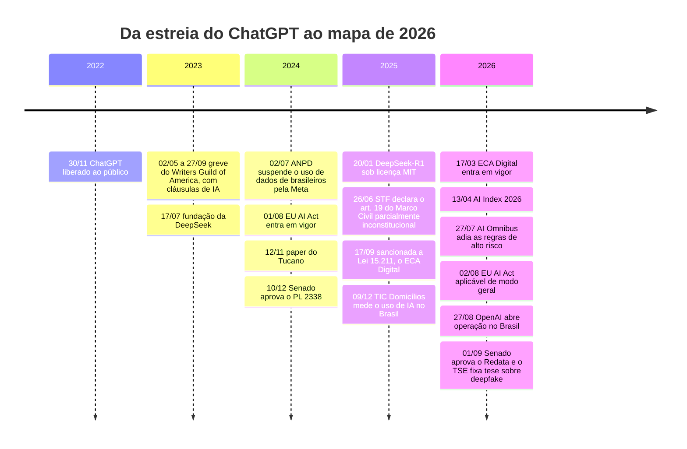
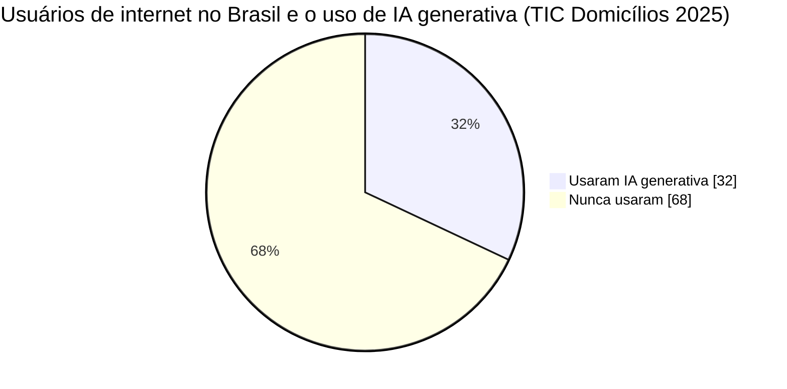
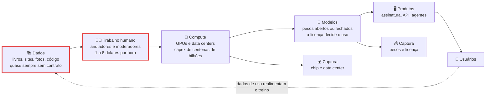
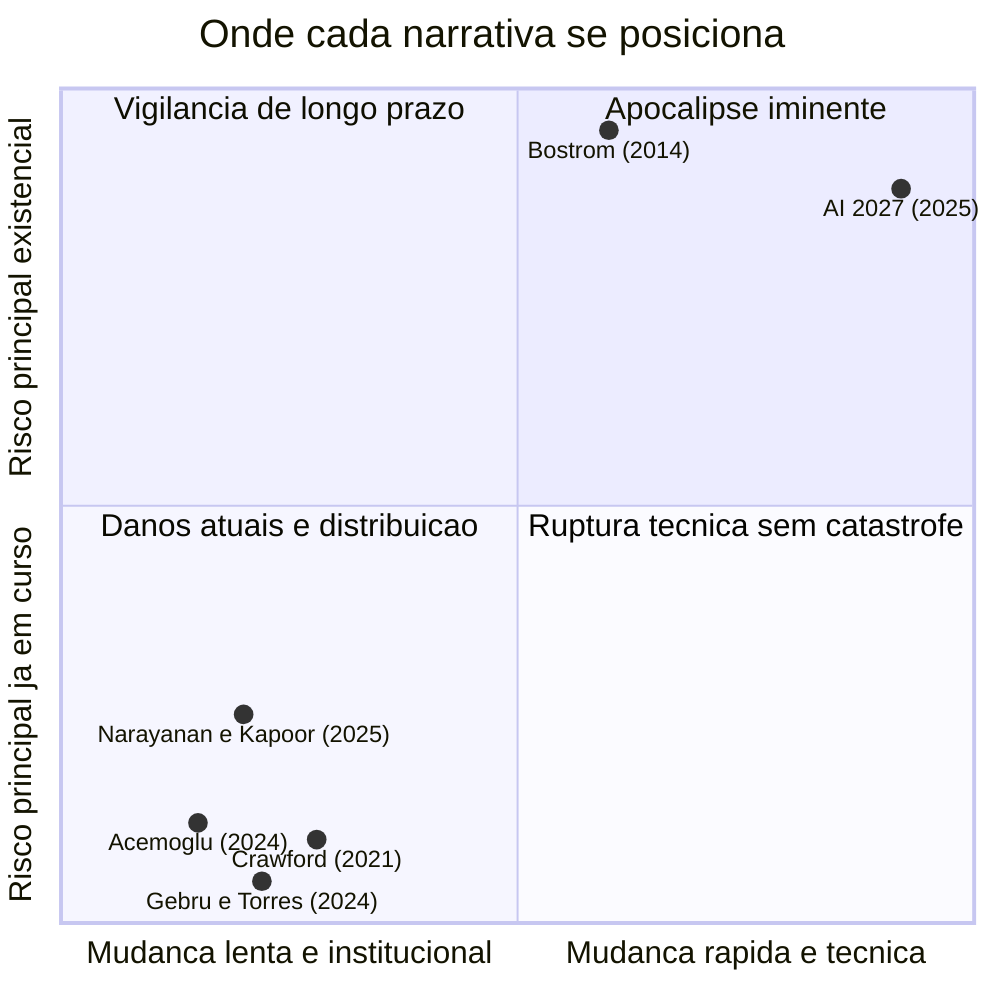

# A virada da IA - o que mudou no mundo desde 2022

> [!quote] Duas frases verdadeiras ao mesmo tempo
> *O Brasil é o terceiro maior mercado do ChatGPT do mundo. E, no mesmo país e no mesmo ano, 68% dos usuários de internet nunca usaram IA generativa, entre eles 94% das pessoas de 60 anos ou mais. Esta aula é sobre a distância entre essas duas frases, e sobre quem ganha dinheiro dentro dela.*

---

## 1. 🗓️ O que aconteceu desde 30 de novembro de 2022

Em 30/11/2022 a OpenAI liberou o ChatGPT ao público. Não era o primeiro modelo de linguagem grande, nem o melhor: era o primeiro com uma caixa de texto na frente. Em menos de quatro anos essa caixa virou disputa judicial em três continentes, lei na Europa, renúncia fiscal de bilhões no Brasil e linha no orçamento de energia elétrica dos Estados Unidos.

O **AI Index 2026** (Stanford HAI, 13/04/2026) registra que a adoção de IA generativa chegou a **53% da população em três anos**, mais rápido que a do computador pessoal ou a da internet, e que o **custo de inferência** de um modelo classe GPT-3.5 caiu **280 vezes**. No mesmo relatório está a parte que quase ninguém repete: a adoção de **agentes** ficou na **casa de um dígito** em quase todas as funções de negócio, e o Foundation Model Transparency Index **caiu de 58 para 40**, ou seja, "os modelos mais capazes frequentemente divulgam menos informação".

A virada tem três fases: **demonstração** (2022-2023, "isso é inteligência?"), **disputa** (2024-2025, "isso é legal, de quem são os dados?") e **infraestrutura e conta** (2026, "quem paga, quem lucra, onde fica a máquina?"). Você entra na profissão na terceira, em que as decisões deixam de ser sobre prompt e passam a ser sobre contrato, licença, watt e lei.

---

## 2. 📈 Quem usa IA de verdade (e quem não usa)

A **TIC Domicílios 2025** (CETIC.br/NIC.br), com 27.177 domicílios entrevistados presencialmente entre março e agosto de 2025 e divulgada em 09/12/2025, mediu pela primeira vez o uso de IA generativa no Brasil: **32% dos usuários de internet**, cerca de **50 milhões de pessoas**. O total é o menos interessante.

| Recorte | Usou IA generativa |
|---|---|
| **Total dos usuários de internet** | **32%** |
| Classe A / B / C / **DE** | 69% / 52% / 32% / **16%** |
| Superior / Médio / **Fundamental** | 59% / 29% / **17%** |
| 16 a 24 anos / **60 anos ou mais** | 55% / **6%** |
| Ocupação formal / informal | 43% / 33% |

O paradoxo: segundo relatório da própria OpenAI noticiado no Brasil, o país é o **3º maior mercado do ChatGPT do mundo**, com cerca de **215 milhões de mensagens por dia**, e o **2º em desenvolvedores usando a API**; em **27/08/2026** a empresa abriu escritório em São Paulo. "O Brasil usa muito IA" e "a maioria dos brasileiros não usa IA" são as duas verdadeiras. E o motivo de quem não usa desmonta a adoção "inevitável": **falta de interesse 76%**, **segurança ou privacidade 63%**, **falta de habilidade 58%**, **desconhecimento de que a ferramenta existe 52%**. A barreira nº 2 do país não é preço nem banda: é **privacidade**.

> [!info] 🇧🇷 O chão material disso
> Na mesma pesquisa: **86% dos domicílios têm internet**, mas **só 32% têm computador** (classe A 97%, classe DE 10%). **65% dos usuários acessam exclusivamente pelo celular**, sendo **5% na classe A e 87% na classe DE**. E **39% dos donos de celular**, cerca de 64 milhões de pessoas, ficaram sem pacote de dados ao menos uma vez nos últimos três meses. A tela pequena não é preferência estética, é limite estrutural.

O **Anthropic Economic Index**, único índice público construído sobre uso real, mostrou em **junho de 2026** que as saídas mais comuns eram explicações (**17%**), documentos (**15%**) e orientação (**11%**). Dois achados incomodam o discurso fácil: quem usa há **6 meses ou mais** tem **10% mais taxa de sucesso** controlando por complexidade, e os **20 países do topo concentram 48%** do uso per capita, com **+0,7%** de uso para cada **+1%** de PIB per capita. **A adoção reproduz a desigualdade existente, ela não a corrige.**

---

## 3. 🏭 A cadeia de valor da IA: quem entrega e quem fica com o dinheiro

Um modelo de linguagem parece artefato de software. É o produto final de uma cadeia industrial de seis elos, e em cada elo alguém entrega alguma coisa e alguém captura o valor.

**Elo 1, dados.** A disputa jurídica mais importante da década ainda não tem resposta. Em **junho de 2025**, em **Kadrey x Meta**, o juiz Vince Chhabria decidiu que usar livros para treinar modelos foi **fair use**. No mesmo ano, em **Bartz x Anthropic**, o acordo de **US\$ 1,5 bilhão** foi rejeitado em setembro de 2025 e **aprovado em julho de 2026**: é o maior da área. Dois tribunais americanos, direções opostas, e ainda correm **Thomson Reuters x Ross**, **NYT x OpenAI**, **Getty x Stability** e **GEMA x OpenAI**. A pergunta de engenharia não é "isso é legal?", é: **como projetar um sistema cuja base legal ainda está em recurso?**

**Elo 2, trabalho humano.** Todo modelo alinhado passou por gente lendo o pior conteúdo da internet e marcando o que é aceitável. Em janeiro de 2023 a **TIME** documentou trabalhadores no **Quênia**, via Sama, revisando de 150 a 250 trechos de texto gráfico por turno de 9 horas por **menos de US\$ 2 por hora**, enquanto a OpenAI pagava à Sama cerca de US\$ 12 por hora. A faixa do setor é **US\$ 1 a 8 por hora** sem vínculo, e nos EUA mais de **11 mil moderadores** fecharam acordo de **US\$ 52 milhões** com o Facebook em 2020 por estresse pós-traumático. O **Data Workers' Inquiry** cobre nove países e **o Brasil é um deles**.

> [!warning] A pergunta que separa o engenheiro do entusiasta
> Diante de um sistema "totalmente automatizado", pergunte: **onde está o humano, e quanto ele ganha?** O **Amazon Just Walk Out** foi revelado em abril de 2024 como apoiado por mais de mil trabalhadores na Índia revisando compras remotamente; a **Builder.ai**, unicórnio de US\$ 1,5 bilhão que vendia a "Natasha" como IA que montava aplicativos sozinha, roteava os pedidos a engenheiros humanos e quebrou em maio de 2025.

**Elos 3 e 4, compute e modelos.** O capex projetado de Google, Amazon, Microsoft e Meta para 2026 é da ordem de **US\$ 725 bilhões** (projeção de mercado; o AI Index confirma **US\$ 150 bilhões do Google em 2025**), e a NVIDIA teve **US\$ 75,2 bilhões de receita de data center em um trimestre**. Do outro lado, a **DeepSeek** publica pesos sob **licença MIT** desde janeiro de 2025, com treino do V3 declarado em **US\$ 5,576 milhões**. O investimento corporativo global em IA foi de **US\$ 581,7 bilhões em 2025**, sendo **US\$ 285,9 bi nos EUA**, **23,1 vezes** o da China.

![[Recursos/Computação, Sociedade e Inclusão/A virada da IA - o que mudou no mundo desde 2022/nvidia-h100-chip.png|NVIDIA H100, o acelerador que sustentou boa parte do treino de modelos grandes entre 2023 e 2025 (Geekerwan, Wikimedia Commons, CC BY 3.0)]]

> [!abstract] 🧠 Lente filosófica: Kate Crawford (*Atlas of AI*, 2021)
> Kate Crawford, pesquisadora australiana de IA e poder, percorre a inteligência artificial como quem percorre uma cadeia de minas: lítio em Nevada, cobalto no Congo, água e energia dos data centers, rotulagem mal paga, dados extraídos sem consentimento e, no fim, a classificação, a decisão sobre quem é o quê. A tese dela, em paráfrase: a IA **não é nem artificial nem inteligente**, é material, intensiva em recursos, e é tecnologia de poder que naturaliza classificações contingentes.
> Um curso de computação mede a complexidade de um treino em FLOPs; Crawford mede em **litros de água, quilos de cobalto e horas de trabalho precário**. **Se o seu diagrama de arquitetura parasse no data center, o que estaria escondendo à esquerda dele?**

> [!example] 🧪 Atividade 1: Auditar a licença e os dados de 3 modelos
> **Ferramenta:** [Hugging Face](https://huggingface.co). Abra [`TucanoBR/Tucano-2b4-Instruct`](https://huggingface.co/TucanoBR/Tucano-2b4-Instruct), [`deepseek-ai/DeepSeek-R1`](https://huggingface.co/deepseek-ai/DeepSeek-R1) e um modelo Llama ou Gemma.
>
> 1. Anote para cada um: **licença exata**, **idiomas declarados**, **datasets de treino declarados** e **número de parâmetros**.
> 2. Responda sim ou não: permite uso comercial? permite redistribuição? tem cláusula de uso aceitável? os dados de treino são baixáveis?
> 3. Abra o dataset de um deles: o Tucano declara o [`GigaVerbo`](https://huggingface.co/datasets/TucanoBR/GigaVerbo), 145,3 milhões de linhas e mais de 200 bilhões de tokens em português, de Common Crawl, Wikipédia, textos jurídicos e blogs.
>
> **Resultado esperado:** tabela 3x7 e conclusão de duas linhas sobre **quais são "abertos" de fato**. Conferido em 03/09/2026: o Tucano-2b4-Instruct declara **apache-2.0**, **português** e 2.444.618.240 parâmetros.

> [!example] 🧪 Atividade 2: Quem autorizou o seu texto a virar treino
> **Ferramenta:** o `robots.txt` de qualquer site, aberto no navegador: é o mecanismo real (e voluntário) pelo qual um site diz aos rastreadores de IA se pode ou não ser lido.
>
> 1. Abra `https://www.nytimes.com/robots.txt`, `https://www.folha.uol.com.br/robots.txt` e `https://www.iff.edu.br/robots.txt` e busque por `GPTBot`, `CCBot`, `ClaudeBot`, `anthropic-ai`, `Google-Extended`, `PerplexityBot` e `Applebot-Extended`.
> 2. Monte uma matriz de sites x rastreadores com `Disallow`, `Allow` ou "não menciona". Repita para 2 sites que você use.
>
> **Resultado esperado:** a matriz com print de duas linhas do arquivo. Conferido em 03/09/2026: o NYT tem `Disallow: /` para os sete; a Folha tem `Disallow: /` para `anthropic-ai` e `CCBot`, mas `Allow: /` para `GPTBot` e `Google-Extended`; o IFF não menciona nenhum. Escreva duas linhas sobre **quem tem departamento jurídico e quem não tem**. O [Have I Been Trained](https://haveibeentrained.com/), que buscava a sua imagem nos datasets LAION, estava **fora do ar em 03/09/2026**: a principal ferramenta pública de verificação de dados de treino é um produto privado que pode sumir.

---

## 4. ⚡ O custo físico: energia, água e a conta que ninguém assina

Modelo de linguagem não roda em nuvem. Roda em prédio, com transformador, gerador e torre de resfriamento. O **AI Index 2026** traz três números duros: a capacidade instalada de data centers de IA chegou a **29,6 GW**; o treino do **Grok 4** emitiu **72.816 toneladas de CO₂ equivalente**; e o uso de água na **inferência do GPT-4o** pode exceder a necessidade de água potável de **1,2 milhão de pessoas por ano**.

![[Recursos/Computação, Sociedade e Inclusão/A virada da IA - o que mudou no mundo desde 2022/grafico-demanda-energia-data-centers-eua.png|Demanda de energia de data centers nos EUA, em gigawatts; a parte clara estava em construção (RCraig09, Wikimedia Commons, CC BY-SA 4.0, dados do Washington Post e da MSCI)]]

Mais importante que os números é **como lê-los**. Circula muito a frase "cada pergunta ao ChatGPT gasta X litros de água", quase sempre sem dizer se X é **consumo direto** de resfriamento, **consumo indireto** embutido na geração elétrica, ou uma **média global** aplicada a um caso local. Clima frio com resfriamento a ar e clima quente com resfriamento evaporativo dão contas completamente diferentes: sem denominador e sem fronteira do sistema, o número não significa nada. A mesma exigência vale para quem afirma que "o consumo é irrelevante".

> [!example] 🧪 Atividade 3: A conta de energia da IA, em planilha, com análise de sensibilidade
> **Ferramenta:** uma planilha (LibreOffice Calc, Google Planilhas ou Excel) e a **sua conta de luz**.
>
> 1. Anote o **consumo do mês em kWh** e a **tarifa em R\$ por kWh**. Calcule o consumo anual de **29,6 GW** operando continuamente (29,6 GW x 8.760 h) e divida pelo consumo anual da sua casa.
> 2. Monte três cenários por consulta (**0,3 Wh**, **3 Wh**, **30 Wh**), calcule o custo em R\$ de **1 milhão** de consultas com a **sua** tarifa e compare com um chuveiro elétrico (cerca de 5.500 W).
> 3. Ache **uma** fonte que declare Wh ou litros por consulta e anote: quem publicou, a data, se é consumo direto ou indireto, e qual data center foi medido.
> 4. O Redata exige **eficiência hídrica de até 0,05 L/kWh**: escolha 3 empresas que operam data center no Brasil e procure no site oficial o **WUE** e o **PUE**, anotando valor e ano ou "não publica".
>
> **Resultado esperado:** planilha com os 3 cenários, o **fator entre o menor e o maior**, a ficha da fonte com a ressalva escrita por você e a tabela das 3 empresas. Se poucas publicarem o WUE, esse é o achado: contrapartida que ninguém audita de fora é contrapartida no papel.
>
> 📱 **Só com celular:** o Google Planilhas faz tudo no app.

---

## 5. 🌎 Soberania, concentração e a ordem de grandeza brasileira

O **Plano Brasileiro de Inteligência Artificial (PBIA 2024-2028)** prevê **R\$ 23 bilhões em quatro anos** em cinco eixos (infraestrutura, formação, IA para serviços públicos, IA para inovação empresarial e apoio regulatório), com objetivo declarado de desenvolver **modelos de IA em português com dados nacionais**. Das **54 iniciativas previstas, 25 entregaram resultados e 15 estavam em execução**, segundo o painel do governo; entre elas, a atualização do supercomputador **Santos Dumont**, no LNCC.

A comparação que dói: **R\$ 23 bilhões em quatro anos** são cerca de **US\$ 4 bilhões**, e o capex de **um único trimestre** da Amazon em 2026 é da ordem de **US\$ 50 bilhões**. O plano nacional inteiro é da ordem de **1% do gasto anual de um único player**. Isso não o torna inútil; torna urgente perguntar **o que exatamente se compra com esse dinheiro**, já que paridade de compute está fora de alcance.

E "soberania" significa coisas diferentes:

| | **Sabiá / Maritaca AI** | **Tucano** |
|---|---|---|
| Origem | Empresa brasileira | Projeto acadêmico (equipe de Nicholas Kluge Corrêa, projeto Polyglot, Univ. de Bonn) |
| Treino | Contínuo sobre corpora do português e do direito brasileiro, contexto de 128k tokens | **Nativo** em português, sobre o GigaVerbo |
| Tamanho | Não divulgado | 160 milhões a 2,4 bilhões de parâmetros |
| Pesos | **Fechados**, só via API | **Abertos**, baixáveis, apache-2.0 |

Empresa nacional com pesos fechados é soberania? Modelo aberto, pequeno e acadêmico é soberania? As duas coisas são desejáveis e podem entrar em conflito: uma protege mercado, a outra protege a autonomia técnica de quem usa.

![[Recursos/Computação, Sociedade e Inclusão/A virada da IA - o que mudou no mundo desde 2022/data-center-brasil-wikimedia.png|Servidores da Wikimedia Foundation em São Paulo. Infraestrutura em território nacional não é, por si só, soberania de dados (Wikimedia Commons)]]

> [!abstract] 🧠 Lente filosófica: Álvaro Vieira Pinto (*O Conceito de Tecnologia*, 2005)
> Álvaro Vieira Pinto (1909-1987), filósofo brasileiro e professor da então Universidade do Brasil, escreveu entre 1973 e 1974 um livro publicado só em 2005, 18 anos após a morte dele. Nele distingue quatro acepções de "tecnologia", e a quarta é a que interessa aqui: tecnologia como **ideologização da técnica**. "Era tecnológica" não descreve um fato neutro: é expressão fabricada pelos países centrais para naturalizar a própria vanguarda e reduzir a periferia a um "maravilhamento" ingênuo diante da máquina. A frase, citada com página por comentadores, é direta: **"toda tecnologia é uma ideologia"** (PINTO, 2005, v. 1, p. 322).
> Ele não é tecnófobo: o par que propõe é **ingenuidade** contra **criticidade**, entender a tecnologia a partir da posição real do país no sistema mundial. **A quem serve chamar 2026 de "a era da IA"?**

> [!example] 🧪 Atividade 4: Modelo local x modelo em nuvem sobre um tema brasileiro
> **Ferramenta:** [Ollama](https://ollama.com) (Windows, macOS e Linux) e qualquer LLM em nuvem que você use. Comandos em [[Ollama - gerenciamento de modelos de IA]].
>
> 1. Baixe um modelo pequeno da [biblioteca](https://ollama.com/search) (3B ou menos; em 03/09/2026 havia `granite4.2:3b`) e anote o download em GB.
> 2. Com o Gerenciador de Tarefas aberto (ou `htop`), rode `ollama run <modelo>` e anote o **pico de RAM** e se usou CPU ou GPU.
> 3. Faça **a mesma pergunta** ao modelo local e ao da nuvem, sobre tema brasileiro verificável ("o que é o Redata?", "o que diz o art. 9º da Lei 15.211/2025?"), e confira cada resposta na fonte oficial.
>
> **Resultado esperado:** tabela de quatro colunas (pergunta, resposta local, resposta nuvem, veredito na fonte oficial), mais RAM de pico e GB baixados. Responda em duas linhas: **por que o modelo pequeno erra mais em fatos brasileiros?**

---

## 6. ⚖️ O que a lei já diz (e o que ela ainda não diz)

Regular no papel e regular na prática são coisas distintas, e 2026 mostrou isso dos dois lados do Atlântico. A tabela descreve as normas, quem as defende e quem as critica; ela **não** endossa nenhuma posição, e a disciplina cobra que você reconstrua o melhor argumento dos dois lados antes de escolher o seu.

| Norma | O que diz | Apoio x crítica |
|---|---|---|
| **EU AI Act** (geral desde **02/08/2026**) | Classificação por risco; proibições desde fev/2025; obrigações de modelos de propósito geral desde ago/2025 | Apoio: previsibilidade e obrigação proporcional ao risco. Crítica: custo de conformidade para empresa pequena |
| **AI Omnibus** europeu (**27/07/2026**) | Simplifica o AI Act, amplia isenções para PMEs e **adia o alto risco** para **02/12/2027** e **02/08/2028** | Apoio: os padrões técnicos ainda não existem. Crítica: enfraquece o que protegia biometria, educação, emprego e migração |
| **PL 2338/2023** (Brasil) | Níveis de risco; direitos dos afetados (transparência, explicação, contestação); Sistema Nacional de Regulação e Governança de IA; multa de até **R\$ 50 milhões** | Apoio: direito de contestar decisão automatizada, com autoridade para fiscalizar. Crítica: texto amplo, insegurança jurídica, custo para startups |
| **ECA Digital, Lei 15.211/2025** (**17/03/2026**) | Verificação de idade confiável com **proibição da autodeclaração** (art. 9º); contas de menores de 16 vinculadas a responsáveis (art. 22); restrição a perfilamento publicitário (art. 20); fiscalização da **ANPD**, multa de até **10% do faturamento** | Apoio: protege quem não tem capacidade civil plena. Crítica: verificação confiável exige coletar **mais** dado de todo mundo, inclusive adulto |
| **ANPD x Meta** (**02/07/2024**) | Suspendeu a política que autorizava treinar IA com dados públicos de Facebook, Instagram e Messenger, com multa diária de **R\$ 50 mil**; em **30/08/2024** a medida foi suspensa após plano de conformidade | Apoio: a LGPD alcança treino de modelo sem lei nova. Crítica: desfecho por acordo, sem decisão de mérito |
| **STF, art. 19 do Marco Civil** (**26/06/2025**, 8 a 3; Temas 987 e 533) | Art. 19 **parcialmente inconstitucional**: plataformas podem responder por conteúdo de terceiros fora da regra da ordem judicial prévia | Apoio: a vítima não depende mais de processo judicial. Crítica: incentivo à remoção preventiva e excessiva |
| **TSE, deepfake** (Res. 23.610/2019, arts. 9º-B e 9º-C; tese de **01/09/2026**, 5 a 2) | Deepfake é conteúdo sintético com **grau de realismo ou verossimilhança** que altera imagem, voz ou manifestação de pessoa; a proibição só incide se for **propaganda eleitoral** | Apoio: evita punir sátira, ficção e uso não eleitoral. Crítica: deixa de fora o sintético em evento partidário e em canal fechado |
| **Redata, PL 278/2026** (**Senado 01/09/2026**) | Zera tributos federais na importação de componentes para data centers, com contrapartidas: energia renovável, **eficiência hídrica de até 0,05 L/kWh**, **2%** investido no país, **10%** dos serviços ao mercado interno. Renúncia estimada em **R\$ 5,2 bilhões** neste ano | Apoio: atrai investimento, infraestrutura e emprego qualificado. Crítica: manifesto de entidades diz que faltou debate e que "soberania não se resume a instalar servidores em território nacional" |

O caso que gerou a tese: em **25/07/2026** uma convenção partidária exibiu vídeo gerado por IA com a imagem e a voz de um ex-presidente apoiando a candidatura de um familiar. A maioria do TSE rejeitou a multa, por entender que exibição em evento interno de partido não equivale a propaganda antecipada; divergiram os ministros Villas Bôas Cueva, Floriano de Azevedo Marques e Estela Aranha. Em decisão paralela, o ministro André Mendonça mandou remover outro vídeo fotorrealista, por entender que o grau de realismo caracteriza deepfake **independentemente de intenção satírica**. Até julho de 2026 os tribunais eleitorais já haviam produzido **164 decisões altamente relevantes sobre deepfake**, alta de **356%** sobre 2024. A pergunta que nem eles fecharam: **rotular o conteúdo como sintético basta, ou o deepfake é proibido mesmo rotulado?**

> [!info] 🇧🇷 O contraste que resume 2026 no Congresso
> O **PL 2338**, que cria direitos e obrigações, foi aprovado no Senado em **10/12/2024** e, em **03/09/2026**, continua **aguardando parecer do relator** na Comissão Especial da Câmara, com **37 proposições apensadas**: **21 meses**. O **Redata**, que cria incentivo fiscal para data center, passou pelas duas casas em poucos meses. Não se trata de julgar intenção: sobre IA, **o que tramita rápido é o incentivo e o que tramita devagar é o direito**. É um dado sobre incentivos institucionais, e vale para qualquer governo.

> [!example] 🧪 Atividade 5: Rastrear o PL 2338 na Câmara em tempo real
> **Ferramenta:** [ficha de tramitação do PL 2338/2023](https://www.camara.leg.br/proposicoesWeb/fichadetramitacao?idProposicao=2487262) na Câmara dos Deputados.
>
> 1. Anote o **último despacho com a data exata**, transcreva o campo **Situação** entre aspas e conte as **proposições apensadas**.
> 2. Calcule os dias desde a aprovação no Senado (10/12/2024) e desde a designação do relator (20/05/2025).
> 3. Guarde o print e **repita no fim do semestre**, comparando os quatro números.
>
> **Resultado esperado:** print + os quatro números + uma frase sobre o que mudou entre as medições. Conferido em 03/09/2026: despacho de **02/09/2026**, situação "Aguardando Parecer do(a) Relator(a) na Comissão Especial", **37** apensadas, relator dep. Aguinaldo Ribeiro.

---

## 7. 🗣️ As narrativas em disputa e como avaliar previsão

Em abril de 2025, com **duas semanas de diferença**, saíram dois textos escritos por gente séria, olhando a mesma conjuntura e chegando a futuros incompatíveis.

**"AI 2027"** (Kokotajlo, Alexander, Larsen, Lifland e Dean, 03/04/2025) é um cenário mês a mês: pesquisa de IA automatizada acelerando o progresso algorítmico em 50% no início de 2026, deslocamento de engenheiros juniores no fim de 2026, codificação sobre-humana em março de 2027. Os autores escrevem **dois finais** a partir das mesmas premissas ("Race" e "Slowdown") e dizem que nenhum é a preferência deles.

**"AI as Normal Technology"** (Arvind Narayanan e Sayash Kapoor, Knight First Amendment Institute, 15/04/2025) argumenta o contrário. Citações verificadas: os impactos transformadores serão lentos, *"on the timescale of decades"*, separando **método**, **aplicação** e **adoção**; e *"we do not think that viewing AI as a humanlike intelligence is currently accurate or useful"*. A tese é que **capacidade não é poder**: humanos modernos não são mais inteligentes que os ancestrais, são mais poderosos por causa da tecnologia; controlar IA é impedir **concentração de poder**, não alcançar alinhamento perfeito.

No outro extremo, **Nick Bostrom** (*Superintelligence*, 2014): uma superinteligência com objetivo mal especificado otimizaria o objetivo, não a intenção. As críticas atacam em duas frentes: que a especulação sobre AGI desvia recursos dos danos **já em curso** (viés, trabalho precário, vigilância) e, em Gebru e Torres sobre o pacote TESCREAL (*First Monday*, 2024), que o longtermismo tem genealogia eugênica e concentra a decisão sobre o futuro num grupo pequeno. **"Risco de IA" significa coisas incompatíveis dependendo de quem fala.**

**Como um engenheiro avalia uma previsão.** Quatro perguntas: (1) **qual é a taxa-base?** A eletricidade levou cerca de **40 anos** para dar ganhos plenos de produtividade. (2) **É falsificável e datada?** "A IA vai mudar tudo" não é previsão; "no fim de 2026 haverá deslocamento de engenheiros juniores" é. (3) **Quem ganha se eu acreditar?** Quem prevê explosão de capacidade costuma vender capacidade. (4) **O que já foi medido?** O AI Index 2026 mediu queda de quase **20% no emprego de desenvolvedores de 22 a 25 anos desde 2024**, o que **favorece** o "AI 2027", e adoção de agentes em **um dígito** com ganhos concentrados (14% a 15% em suporte, 26% em software), o que **favorece** a tecnologia normal. A resposta honesta é "os dois em parte", e sustentar isso com dado é o objetivo desta seção.

> [!abstract] 🧠 Lente filosófica: Yuk Hui (*Tecnodiversidade*, Ubu, 2020)
> Yuk Hui, filósofo de Hong Kong, contesta uma premissa que Heidegger e o Vale do Silício compartilham sem perceber: a de que existe **uma** técnica universal e que todos os povos estão em pontos diferentes da mesma estrada. Ele propõe a **cosmotécnica**, a unificação entre cosmos e moral por meio de atividades técnicas, sempre situada numa cosmologia específica. Daí a tese: **"Não há uma única tecnologia, mas sim uma tecnodiversidade, uma multiplicidade de cosmotécnicas que diferem umas das outras em seus valores, epistemologias e formas de existência."** (edição brasileira, Ubu, 2020).
> Quando a discussão vira "acelerar ou frear a IA", os dois lados já concordaram que existe **uma só** IA possível, a de quem tem mais GPU. Hui abre a terceira opção, **bifurcar**. **Se você projetasse um sistema de IA a partir dos valores da sua cidade, e não dos de um data center na Virgínia, o que mudaria na arquitetura?**

> [!example] 🧪 Atividade 6: Votar às cegas e depois descobrir em quem votou
> **Ferramenta:** [arena.ai](https://arena.ai) (antigo LMArena). O **Battle Mode** mostra a resposta de dois modelos anônimos e você escolhe a melhor sem saber quem são.
>
> 1. Escreva **um único prompt** sobre um tema brasileiro difícil (um trecho de lei, um problema local) e rode **5 batalhas** com ele, votando antes de revelar os nomes.
> 2. Anote em tabela: batalha, modelo vencedor, organização e se os pesos são **abertos ou fechados** (confira no Hugging Face). Compare com o **leaderboard** do site.
>
> **Resultado esperado:** tabela das 5 batalhas, a proporção de vitórias de abertos contra fechados, e duas linhas sobre por que 5 votos **não** autorizam conclusão geral. O site avisa que as conversas podem ser divulgadas aos provedores e publicamente: **não escreva nada pessoal, de terceiros ou sigiloso.**

> [!example] 🧪 Atividade 7: Classificar incidentes reais pelas quatro lentes
> **Ferramenta:** [AI Incident Database](https://incidentdatabase.ai/apps/incidents/), da Responsible AI Collaborative.
>
> 1. Filtre incidentes de **2026** e escolha **cinco**.
> 2. Para cada um: **quem foi prejudicado**, **quem implantou o sistema**, **qual foi a falha** (técnica, de produto ou de governança) e **em que nível de risco** cairia sob o PL 2338 e sob o EU AI Act.
> 3. Classifique cada incidente pela lente que melhor o explica:
>
> | Lente | Pergunta que ela faz |
> |---|---|
> | **Crawford** (extração) | Quem entregou dado, trabalho ou recurso natural sem receber por isso? |
> | **Vieira Pinto** (ideologia) | Que narrativa de progresso serviu para não discutir a decisão? |
> | **Yuk Hui** (monocultura técnica) | Que alternativa técnica nem chegou a ser considerada? |
> | **Morozov** (solucionismo) | O problema estava mal resolvido ou mal **formulado**? Recastar situação social complexa como problema computável, tratando deliberação e conflito como ineficiência, é o que Evgeny Morozov chama de solucionismo (*To Save Everything, Click Here*, 2013, paráfrase). |
>
> **Resultado esperado:** cinco fichas com o número do incidente e o link. Calibragem: o incidente **#1667** registra um advogado de Minnesota multado em US\$ 5.000 e suspenso por 30 dias após apresentar em juízo citações jurídicas fabricadas por IA. Compare com o que diz [[O que a IA sabe - Informação, verdade e alucinação]].

---

## 8. 🇧🇷 No Brasil: o que a virada muda no Noroeste Fluminense

- **Quem vai usar.** Se o padrão nacional vale aqui, cerca de **um terço** dos usuários de internet da cidade usou IA generativa, com **mais de 50 pontos** de diferença entre classe A e classe DE e **6%** entre idosos. Um serviço público que assuma "todo mundo já usa" exclui a maioria por desenho.
- **Como vai usar.** Com **65% acessando só pelo celular** (87% na classe DE) e **39% dos donos de celular** ficando sem dados no mês, uma solução que exija upload pesado ou app dedicado falha na hora em que é mais necessária.
- **Quem vai atender.** **12% dos usuários pedem a outra pessoa que acesse o gov.br por eles**: um parente mais novo, um funcionário do CRAS ou um estudante de Engenharia de Computação fazendo extensão.
- **Onde ficará a máquina.** O Redata muda a economia dos data centers no país inteiro, e quem discutir atração de investimento no estado do Rio precisa ler as contrapartidas e cobrar a medição anual delas.

Esse é o terreno do [[Projeto de Extensão - IA para Todos]]: não é levar ChatGPT a quem não tem, é descobrir, com gente real, **onde a ferramenta quebra** quando sai do notebook do engenheiro.

![[Recursos/Computação, Sociedade e Inclusão/A virada da IA - o que mudou no mundo desde 2022/data-center-corredor-servidores.png|Cada rack aqui é, para o usuário final, apenas o ícone de um aplicativo (BalticServers, Wikimedia Commons)]]

---

## 9. 🤖 E a IA? · 🔮 E em 2036?

| Cenário | Tese, quem sustenta, o que a falsificaria e o que muda aqui |
|---|---|
| **Aceleração** | Automação da própria pesquisa de IA encurta ciclos e agentes assumem trabalho cognitivo inteiro: "AI 2027" (03/04/2025), capex projetado de **US\$ 725 bi** em 2026. Falsificaria: adoção de agentes seguir em um dígito. **Aqui:** vagas de entrada em TI somem primeiro; sobra quem sabe especificar, revisar e responder juridicamente pelo resultado |
| **Platô e difusão lenta** | Métodos avançam, adoção emperra em instituição, contrato e regulação: Narayanan e Kapoor (15/04/2025), *"on the timescale of decades"*; Acemoglu (NBER WP 32487, 2024), ganho de produtividade de cerca de **0,7% em 10 anos**. Falsificaria: salto simultâneo de produtividade medida em vários setores. **Aqui:** o gargalo vira infraestrutura básica (computador em casa, dado no celular), não modelo de ponta |
| **Regulação forte** | O gargalo deixa de ser técnico e vira jurídico e ambiental: EU AI Act desde 02/08/2026, STF sobre o art. 19 (26/06/2025), ECA Digital desde 17/03/2026. Falsificaria: novos adiamentos como o do AI Omnibus. **Aqui:** compliance vira competência de engenharia, e quem sabe documentar dado, licença e consumo tem vantagem |

Os três compartilham uma coisa: **em nenhum deles a habilidade decisiva é escrever prompt**. Em todos, o escasso é saber de onde veio o dado, quem responde pelo erro, quanto custa a operação e como provar isso a um auditor. Duas atitudes valem em qualquer cenário: **medir em vez de acreditar** (você fez sete medições nesta página) e **saber a cadeia inteira**.

---

## 🗣️ Para debater em sala

**1. "Soberania de IA" é ter empresa nacional ou ter pesos abertos?**
Um lado: soberania é capacidade produtiva doméstica, e para isso o país precisa de empresa nacional viável, ainda que de pesos fechados (Maritaca, com Sabiá 4 só via API; o PBIA declara o objetivo de modelos em português com dados nacionais). O outro: soberania é autonomia técnica de quem usa, e isso exige **pesos abertos e auditáveis**, como no Tucano (apache-2.0, GigaVerbo publicado).

**2. Rotular conteúdo sintético basta, ou deepfake deve ser proibido mesmo rotulado?**
Um lado: a tese do TSE de 01/09/2026 restringe a proibição ao que for propaganda eleitoral, preservando sátira e ficção, e a Res. 23.610/2019 já exige transparência (art. 9º-B). O outro: o ministro André Mendonça entendeu que o grau de realismo caracteriza deepfake **independentemente de intenção satírica**, e as 164 decisões até julho de 2026 sugerem que rotular não contém o problema.

**3. Incentivo fiscal a data center compra soberania ou terceiriza custo ambiental?**
Um lado: o Redata condiciona o benefício a energia renovável, 0,05 L/kWh, 2% de investimento no país e 10% de reserva de mercado interno. O outro: o manifesto de entidades da sociedade civil afirma que faltou debate e que "soberania não se resume a instalar servidores em território nacional", com renúncia de **R\$ 5,2 bilhões** só no primeiro ano contra os R\$ 23 bilhões do PBIA inteiro.

---

## ❓ Quiz rápido

> [!question]- 1. Qual foi a segunda barreira mais citada por quem NÃO usou IA generativa no Brasil (TIC Domicílios 2025)?
> **Resposta:** **segurança ou privacidade**, 63%. Antes dela, só falta de interesse ou necessidade (76%). A barreira não é preço nem banda.

> [!question]- 2. Verdadeiro ou falso: em 2026 as obrigações de alto risco do EU AI Act já estão em vigor.
> **Resposta:** **Falso.** O AI Act é aplicável de modo geral desde 02/08/2026, mas o "AI Omnibus" (vigor 27/07/2026) **adiou** o alto risco para **02/12/2027** e **02/08/2028**.

> [!question]- 3. Os casos Kadrey x Meta e Bartz x Anthropic apontam na mesma direção?
> **Resposta:** **Não.** Kadrey (jun/2025) reconheceu **fair use** no uso de livros para treino; Bartz fechou acordo de **US\$ 1,5 bilhão**, aprovado em jul/2026. Mesmo período, respostas opostas.

> [!question]- 4. Qual a ordem de grandeza do PBIA? (a) supera o capex anual de uma big tech; (b) é da ordem de 1% do gasto anual de um hyperscaler; (c) é comparável ao capex das big techs.
> **Resposta:** **(b).** R\$ 23 bi em 4 anos, cerca de US\$ 4 bi, contra capex projetado de US\$ 725 bi em 2026 para as quatro maiores.

> [!question]- 5. O que o Anthropic Economic Index mostrou sobre a geografia do uso de IA?
> **Resposta:** que a adoção **reproduz a desigualdade existente**: +1% de PIB per capita se associa a **+0,7%** de uso per capita, e os 20 países do topo concentravam 48% do uso.

---

## 🔗 Veja também

- [[Filosofia da Tecnologia - as grandes perguntas da era da IA]]: a aula anterior, com as perguntas que esta página aplica a fatos de 2026.
- [[Tópicos/Roadmap do futuro/Inteligência artificial|Inteligência artificial (Roadmap do Futuro)]]: como a IA funciona por dentro.
- [[Ollama - gerenciamento de modelos de IA]]: base da Atividade 4.
- [[Computação em nuvem]]: o que é "a nuvem" onde os modelos rodam.
- [[Desenvolvimento de Software com IA]]: como isso chega ao seu editor de código.
- [[O que a IA sabe - Informação, verdade e alucinação]]: por que o modelo inventa jurisprudência.
- [[Ética da IA - Poder, Vigilância e Automação]]: o poder e a vigilância, que esta aula só encosta.
- ➡️ **Próxima aula:** [[Automação, trabalho e o futuro das profissões]]

---

> [!note] 📚 Fontes (visitadas em 03/09/2026)
> - **Dados:** [AI Index 2026, Stanford HAI](https://hai.stanford.edu/news/inside-the-ai-index-12-takeaways-from-the-2026-report) · [TIC Domicílios 2025, CETIC.br](https://cetic.br/media/analises/tic_domicilios_2025_principais_resultados.pdf) e [painel](https://data.cetic.br) · [Anthropic Economic Index](https://www.anthropic.com/research/economic-index-june-2026-report) · [Brasil, 3º no ChatGPT](https://www.infomoney.com.br/consumo/brasil-e-o-terceiro-pais-com-maior-numero-de-usuarios-do-chatgpt-no-mundo/)
> - **Cadeia de valor:** [direitos autorais e IA](https://en.wikipedia.org/wiki/Artificial_intelligence_and_copyright) · [TIME, Quênia](https://time.com/6247678/openai-chatgpt-kenya-workers/) · [moderadores do Facebook](https://www.theverge.com/2020/5/12/21255870/facebook-content-moderator-settlement-scola-ptsd-mental-health) · [Data Workers' Inquiry](https://data-workers.org/) · [Builder.ai](https://restofworld.org/2025/builderai-ai-apps-downfall/) · [capex](https://valueaddvc.com/ai-spending) · [DeepSeek](https://en.wikipedia.org/wiki/DeepSeek)
> - **Brasil e regulação:** [PBIA](https://www.gov.br/mcti/pt-br/acompanhe-o-mcti/transformacaodigital/plano-brasileiro-de-inteligencia-artificial) · [Redata no Senado](https://agenciabrasil.ebc.com.br/politica/noticia/2026-09/senado-aprova-projeto-que-cria-incentivos-para-data-centers-no-brasil) e [manifesto crítico](https://sul21.com.br/noticias/geral/2026/09/organizacoes-criticam-incentivo-fiscal-para-data-centers-no-brasil/) · [Tucano](https://huggingface.co/TucanoBR/Tucano-2b4-Instruct) · [EU AI Act](https://digital-strategy.ec.europa.eu/en/policies/regulatory-framework-ai) · [PL 2338/2023](https://www.camara.leg.br/proposicoesWeb/fichadetramitacao?idProposicao=2487262) · [ECA Digital](https://www.dataprivacybr.org/eca-digital-entra-em-vigor-o-que-a-lei-preve-e-o-que-ainda-falta-regulamentar/) · [ANPD x Meta](https://www.gov.br/anpd/pt-br/assuntos/noticias/anpd-determina-suspensao-cautelar-do-tratamento-de-dados-pessoais-para-treinamento-da-ia-da-meta) · [STF, Tema 987](https://portal.stf.jus.br/jurisprudenciaRepercussao/verAndamentoProcesso.asp?incidente=5160549&numeroProcesso=1037396&classeProcesso=RE&numeroTema=987) · [TSE, deepfake](https://www.tse.jus.br/comunicacao/noticias/2026/Setembro/tse-fixa-tese-sobre-deepfake-e-delimita-regra-para-as-eleicoes-2026) e [as 164 decisões](https://www.metropoles.com/colunas/observatorio-das-eleicoes/eleicoes-2026-o-que-os-tribunais-estao-decidindo-sobre-deepfakes)
> - **Narrativas e ferramentas:** ["AI as Normal Technology"](https://knightcolumbia.org/content/ai-as-normal-technology) · ["AI 2027"](https://ai-2027.com/) · [TESCREAL](https://firstmonday.org/ojs/index.php/fm/article/view/13636) · [Acemoglu](https://www.nber.org/system/files/working_papers/w32487/w32487.pdf) · [AI Incident Database](https://incidentdatabase.ai/apps/incidents/) · [arena.ai](https://arena.ai) · [Ollama](https://ollama.com) · [Hugging Face](https://huggingface.co) · [Have I Been Trained](https://haveibeentrained.com/) (fora do ar)
> - **Imagens (Wikimedia Commons):** [data center](https://commons.wikimedia.org/wiki/File:BalticServers_data_center.jpg) · [NVIDIA H100, Geekerwan, CC BY 3.0](https://commons.wikimedia.org/wiki/File:NVIDIA_H100_(%E6%9E%81%E5%AE%A2%E6%B9%BEGeekerwan)_001.png) · [demanda de energia, RCraig09, CC BY-SA 4.0](https://commons.wikimedia.org/wiki/File:2015-_Data_center_power_demand_-_US.svg) · [Wikimedia no Brasil](https://commons.wikimedia.org/wiki/File:Brazil_data_center_of_the_Wikimedia_Foundation.png)

> [!note] 📖 Leituras
> - CRAWFORD, Kate. *Atlas of AI*. Yale University Press, 2021. A IA como cadeia extrativa, do lítio ao descarte. 🔓 [anatomyof.ai](https://anatomyof.ai/).
> - PINTO, Álvaro Vieira. *O Conceito de Tecnologia*. Rio de Janeiro: Contraponto, 2005, 2 v. 🔓 [resenha com as páginas](https://seer.uftm.edu.br/revistaeletronica/index.php/revistagepadle/article/view/6091).
> - HUI, Yuk. *Tecnodiversidade*. São Paulo: Ubu, 2020, 192 p. (não é tradução de *The Question Concerning Technology in China*).
> - NARAYANAN, A.; KAPOOR, S. *AI Snake Oil*. Princeton University Press, 2024, e 🔓 ["AI as Normal Technology"](https://knightcolumbia.org/content/ai-as-normal-technology), 2025.
> - BENDER, Emily M. et al. "On the Dangers of Stochastic Parrots". *FAccT '21*, ACM, 2021, pp. 610-623. 🔓 [PDF](https://s10251.pcdn.co/pdf/2021-bender-parrots.pdf), CC BY 4.0.
> - GRAY, M. L.; SURI, S. *Ghost Work*. Houghton Mifflin Harcourt, 2019. O trabalho fantasma por trás da automação.
> - 📗 CASTELLS, Manuel. *A sociedade em rede*. São Paulo: Paz e Terra. Por que a cadeia da IA é também cadeia de poder.
> - 📗 CAZELOTO, Edilson. *Inclusão digital: uma visão crítica*. São Paulo: Senac. Por que "dar acesso" não é incluir.
