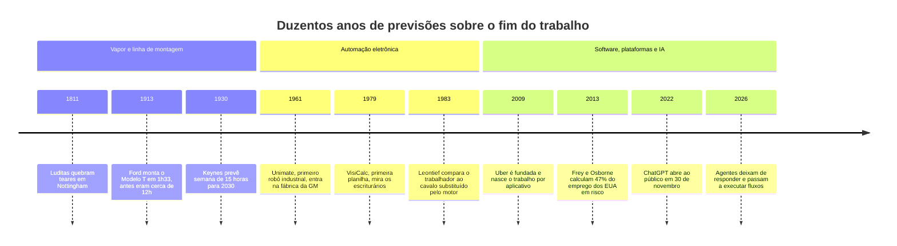
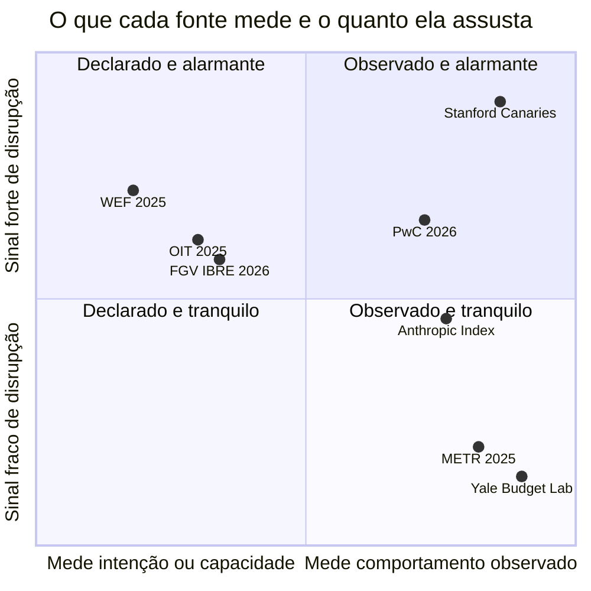
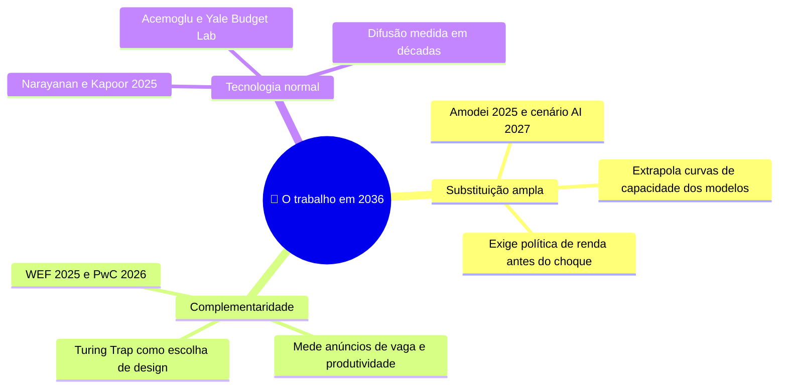

# Automação, trabalho e o futuro das profissões

> [!quote] Duas medições do mesmo assunto, dois mundos
> *Em 10/07/2025 a METR publicou um ensaio randomizado: 16 desenvolvedores experientes ficaram **19% mais lentos** usando IA, e depois **ainda achavam que tinham acelerado 20%**. Em 15/06/2026 a PwC varreu **1 bilhão** de anúncios de vaga e achou um **prêmio salarial de 62%** para quem tem habilidade de IA. Os dois estão certos. Esta aula é sobre por quê.*

A pergunta "a IA vai acabar com o meu emprego?" tem duzentos anos de tentativas de resposta, quase todas erradas. Esta página não entrega profecia: entrega o histórico das que falharam, a tabela dos números atuais com fonte e data, o mapa de quem ganha e quem paga a conta, e as ferramentas filosóficas para pensar nisso sem virar tecnófobo nem vendedor de hype.

---

## 1. 🧵 Duzentos anos em dez marcos

Entre 1811 e 1816, tecelões ingleses quebraram teares em Nottingham, Yorkshire e Lancashire. Ficaram conhecidos como **luditas**, e o governo respondeu com o *Frame Breaking Act* de 1812, que tornou quebrar máquina crime punível com a morte. A leitura preguiçosa diz que a história os desmentiu; a honesta é mais incômoda: **no curto prazo eles estavam certos**. Aquela geração perdeu renda, status e ofício, e o emprego têxtil só cresceu décadas depois, com **outras pessoas**. É o caso-modelo de tudo que vem a seguir: o agregado se recupera, o indivíduo não.

![[Recursos/Computação, Sociedade e Inclusão/Automação, trabalho e o futuro das profissões/luditas-1812.png|"The Leader of the Luddites", gravura colorida publicada em maio de 1812 em Londres. O ludismo não era contra a máquina em abstrato: era contra a máquina operada por mão de obra mais barata para derrubar o preço do ofício.]]

| Ano | Previsão | O que aconteceu |
|---|---|---|
| 1811-1816 | **Luditas**: ruína do ofício, queda dos salários | Certos no curto prazo, errados no longo |
| 1911-1913 | **Taylor e Ford**: prosperidade pela decomposição científica das tarefas | Acertaram (12h para 1h33; *five-dollar day*, jan/1914) e fabricaram o trabalho fragmentado que Marx e Arendt criticariam |
| 1930 | **Keynes**: semana de **15 horas** em 100 anos; cunhou "desemprego tecnológico" | Produtividade subiu, jornada não caiu na proporção. Subestimou a elasticidade do consumo |
| 1961 | **Unimate**: a fábrica sem gente | 65 anos depois a manufatura segue intensiva em pessoas. Paradoxo de Moravec: difícil é o que a criança de dois anos faz |
| 1979 | **VisiCalc**: fim dos escriturários contábeis | **Escriturários encolheram; contadores e auditores cresceram.** A planilha barateou a análise e criou demanda por mais análise |
| 1983 | **Leontief** (Nobel 1973): o computador tiraria o trabalhador como o motor tirou o cavalo | Não ocorreu em 40 anos. O argumento pessimista mais forte e o mais desmentido |
| 2009-2011 | **Uber e iFood**: empreendedorismo e renda extra | Virou ocupação principal, sem vínculo, com gestão algorítmica: a **uberização** (seção 3) |
| **17/09/2013** | **Frey e Osborne**: **47% do emprego dos EUA** em alto risco, em 702 ocupações | Mediram **ocupações inteiras**, não tarefas. O emprego dos EUA não caiu 47% |
| **30/11/2022** | **ChatGPT**: disrupção imediata do trabalho cognitivo | Aos 33 meses, nada no agregado (Yale), mas sinal forte nos jovens de 22 a 25 anos (seção 2) |
| 2025-2026 | **Agentes**: automação de fluxos inteiros | Contraditório: 75 a 77% de automação na API da Anthropic, augmentação maior no Claude.ai, devs 19% mais lentos na METR |

**A correção de rota.** Em 2015 o economista **David Autor** (MIT) deu o vocabulário que faltava: automação opera sobre **tarefas**, não sobre **ocupações**. Uma ocupação é um pacote de dezenas de tarefas; quando algumas saem, o pacote se reorganiza e a produtividade nas restantes costuma **aumentar** o valor de quem as executa. Ele apoia isso no **paradoxo de Polanyi**: sabemos mais do que conseguimos explicar (você reconhece um rosto, dirige na chuva, percebe que o cliente está irritado, e não escreve a regra disso), e o que não se explicava não se programava. A IA generativa mexeu em parte dessa fronteira, e por isso 2026 não é 2013.

> [!warning] O erro de leitura que você vai ver na imprensa
> "47% dos empregos vão acabar" nunca foi o que Frey e Osborne disseram, e o que eles disseram foi calculado por **ocupação inteira**. Quando a OIT refez por **tarefa**, em 2025, os números ficaram muito menores. Diante de qualquer percentual de "empregos ameaçados", pergunte: a unidade de medida é o emprego ou a tarefa?

> [!example] 🧪 Atividade 1: consulte o oráculo, depois audite o oráculo
> **Ferramenta:** [Will Robots Take My Job](https://willrobotstakemyjob.com/).
>
> 1. Consulte três ocupações: [Software Developers](https://willrobotstakemyjob.com/software-developers), a de alguém da sua família e uma que você jure ser imune. Anote *automation risk* e *job score* de cada.
> 2. Na página [About](https://willrobotstakemyjob.com/about), descubra em qual estudo o site baseia o cálculo e de que ano ele é.
>
> **Resultado esperado:** tabela com 3 ocupações e 2 números cada, mais um parágrafo respondendo por que um índice construído sobre Frey e Osborne (2013), por ocupação inteira, não decide sozinho a sua carreira em 2026.
>
> 📱 **Só com celular:** o site é responsivo; a tabela cabe no bloco de notas.

> [!example] 🧪 Atividade 2: abra a sua profissão e conte as tarefas
> **Ferramenta:** [O*NET OnLine](https://www.onetonline.org/), catálogo ocupacional do Departamento do Trabalho dos EUA.
>
> 1. Abra [Software Developers (15-1252.00)](https://www.onetonline.org/link/summary/15-1252.00), que traz **Tasks** (17 tarefas) e **Detailed Work Activities** (18).
> 2. Copie as **10 primeiras tarefas** para uma planilha e classifique cada uma: (A) um agente faz sozinho hoje, (B) faz com supervisão, (C) não faz.
> 3. Peça a um LLM que classifique as **mesmas** 10 e marque as divergências.
>
> **Resultado esperado:** planilha com os percentuais A/B/C, a tabela de divergências com a IA e a defesa escrita de **três** classificações polêmicas. Guarde: é a base do [[Trabalhos e Projetos de Computação, Sociedade e Inclusão|T2]].

---

## 2. 📊 O que os dados de 2025 e 2026 realmente dizem

![[Recursos/Computação, Sociedade e Inclusão/Automação, trabalho e o futuro das profissões/ford-linha-montagem-1913.png|Trabalhadores na primeira linha de montagem móvel da Ford, Highland Park, 1913, montando magnetos e volantes. Ganho real de produtividade e de salário, e ao mesmo tempo a invenção do trabalho fragmentado.]]

Existem hoje umas dez medições sérias sobre o efeito da IA no trabalho, e elas **não concordam**. Antes de escolher um lado, veja o que cada uma mede.

| Fonte | O que mede | Número | Data |
|---|---|---|---|
| **WEF, Future of Jobs 2025** | Intenção declarada de 1.000+ empregadores (14 milhões de trabalhadores, 55 economias) | +170 milhões criados, 92 milhões deslocados, saldo **+78 milhões** até 2030; **39%** das habilidades transformadas | 07/01/2025 |
| **WEF, ranking de habilidades** | Aumento líquido esperado de demanda | IA e big data 1º (87), cibersegurança 2º (70), pensamento sistêmico 11º (51), **programação 17º de 21 (27)** | 07/01/2025 |
| **OIT** (Gmyrek, Berg e outros) | Exposição à IA generativa **por tarefa** (ISCO-08) | **1 em cada 4** trabalhadores do mundo expostos em algum grau; 3,3% na faixa mais alta; mulheres **4,7%** contra homens **2,4%** | 20/05/2025 |
| **Stanford, "Canaries in the Coal Mine?"** | Folha de pagamento real (ADP) | Emprego de **22 a 25 anos** em ocupações expostas **19% abaixo** do contrafactual, por menos contratação. A 1ª versão, ago/2025, dizia 13% | rev. **12/08/2026** |
| **Yale Budget Lab** | Mix ocupacional agregado dos EUA | Cerca de **1 ponto percentual** acima da trajetória da internet (que chegou a 7 p.p.); exposição **não** se correlaciona com emprego | 01/10/2025 |
| **METR** | Ensaio randomizado: 16 devs experientes, 246 issues reais | **19% mais lentos** com IA; previam acelerar 24% e achavam ter acelerado 20% | 10/07/2025 |
| **PwC, Global AI Jobs Barometer** | 1 bilhão de anúncios de vaga, 27 países | Prêmio salarial de **62%**; vaga de entrada exposta **7x mais propensa** a exigir competência sênior; headcount **+52%** nas empresas mais expostas | 15/06/2026 |
| **Anthropic Economic Index** | Uso real de um LLM | Claude.ai: **45%** automação contra **52%** augmentação; API empresarial **75 a 77%** automação; 6+ meses de uso dão **10% mais** sucesso | mar e jun/2026 |
| **FGV IBRE** | Índice da OIT sobre a PNAD Contínua | **30 milhões** de brasileiros expostos, **29,6%** da população ocupada; 5,2 milhões no gradiente mais alto | 27/04/2026 |
| **ESPM, Observatório PRISMA** | Índice AIOE, 410 ocupações, 90+ milhões de trabalhadores | Mais expostos: matemáticos, contadores, economistas, juízes, publicitários e **professores universitários** | 12/02/2026 |
| **Stack Overflow Survey** | Autorrelato de cerca de 33 mil devs | **84%** usam ou pretendem usar IA, **46%** desconfiam da acurácia, só **3%** confiam muito | 2025 |

**A lição pedagógica: elas medem coisas diferentes.** Nenhuma mente. WEF mede **intenção** de empregador, e intenção não é ato. OIT, FGV e ESPM medem **exposição teórica** de tarefas, e exposto não é substituído. Stanford mede **contratação real** em folha de pagamento, e é ali que o dano aparece. Yale mede o **agregado**, e em 33 meses viu quase nada. METR mede **desempenho controlado** e desmentiu a percepção dos participantes. PwC mede o que o **mercado paga**, pelos anúncios. Anthropic mede **uso real** de um modelo, com viés declarado. Divergir é o esperado quando as perguntas são diferentes.

> [!warning] O achado mais desconfortável para esta turma
> No ranking do WEF 2025, **programação aparece em 17º entre 21**, com aumento líquido de 27, atrás de IA e big data (87), cibersegurança (70), pensamento criativo (66) e pensamento sistêmico (51). Não é que programar deixou de importar: é que a habilidade **escassa** deixou de ser escrever código e passou a ser **decidir o que construir e garantir que funciona**.

> [!info] 🇧🇷 A ironia que abre bem a aula
> Os dois estudos brasileiros colocam **professor universitário** e **analista de sistemas** entre as ocupações mais expostas. Quem dá esta aula e quem assiste estão os dois na lista, e isso não é retórica: é o que o AIOE da ESPM e o índice da OIT aplicado pela FGV dizem, com metodologia pública.

> [!example] 🧪 Atividade 3: ache a tabela no relatório e anote a página
> **Ferramenta:** [WEF, Future of Jobs Report 2025 (PDF)](https://reports.weforum.org/docs/WEF_Future_of_Jobs_Report_2025.pdf).
>
> 1. Busque no PDF (Ctrl+F) por *skills on the rise*, localize o gráfico de habilidades por aumento líquido e **anote o número da página**.
> 2. Copie as **5 primeiras** habilidades com os valores e localize a posição de *programming*.
> 3. Ache a Figura 2.7 (fronteira humano-máquina, p. 26) e anote os três percentuais de 2025 e os três de 2030.
>
> **Resultado esperado:** print da tabela com a página visível, as 5 habilidades com valores, a posição de *programming* e a comparação 2025 x 2030. Regra da disciplina: **número sem página não vale**.

> [!example] 🧪 Atividade 4: automação x augmentação, medida no uso real
> **Ferramenta:** [Anthropic Economic Index](https://www.anthropic.com/economic-index) e o [relatório de junho de 2026](https://www.anthropic.com/research/economic-index-june-2026-report).
>
> 1. Anote os percentuais de **automação** e **augmentação** no Claude.ai e na API empresarial, a data e o viés de amostra declarado pelos autores.
> 2. Meça você: por 7 dias registre cada uso de IA numa planilha (tarefa; automação ou augmentação; validei sim ou não).
>
> **Resultado esperado:** a planilha de 7 dias, o seu percentual e uma frase respondendo: você usa IA como quem **aprende** ou como quem **terceiriza**?
>
> 📱 **Só com celular:** qualquer app de notas serve; o cálculo é uma divisão.

---

## 3. ⚖️ Vantagens e desvantagens da automação

A ementa desta disciplina pede, literalmente, "vantagens e desvantagens da automação". A resposta séria não é uma lista equilibradinha: é notar que **vantagem e desvantagem chegam a pessoas diferentes, em prazos diferentes**.

| Vantagem (e para quem) | Desvantagem (e para quem) |
|---|---|
| Produtividade: +34% de 2018 a 2025 nas ocupações mais expostas contra +24% nas menos (PwC, 2026) | Deslocamento concentrado: caixas, escriturários, atendentes de banco e digitadores lideram as 15 ocupações que mais encolhem (WEF, 2025) |
| Preço: a análise cara fica barata, como a planilha fez com a contabilidade em 1979 | Polarização: cresce o topo (julgamento) e a base (manual não roteirizável), some o meio administrativo |
| Salário de quem tem a habilidade: prêmio de 62% (PwC, 2026) | Fim do degrau de entrada: vaga júnior exposta é 7x mais propensa a exigir competência sênior (PwC, 2026) |
| Saldo de +78 milhões de empregos até 2030 (WEF, 2025) | O saldo é **líquido**: os 92 milhões deslocados não são os mesmos 170 milhões contratados |
| Segurança: tarefa repetitiva, perigosa ou insalubre sai do colo humano | Trabalho invisível: o esforço migra para anotadores e moderadores mal pagos, fora do país que consome o produto |

### Quando a "automação" é gente escondida

Dois casos valem por uma aula. O **Amazon Just Walk Out**, loja sem caixa vendida como visão computacional pura, foi revelado em **abril de 2024** como apoiado por **mais de mil trabalhadores na Índia** revisando compras remotamente: em 2022, cerca de **700 de cada 1.000** vendas ainda exigiam revisão humana, contra meta interna de menos de 50. E a **Builder.ai**, cuja "Natasha" supostamente montava aplicativos sozinha, sustentou um unicórnio de **US\$ 1,5 bilhão** (com aporte da Microsoft e do Qatar Investment Authority) enquanto roteava prompts para **centenas de engenheiros humanos na Índia**, até a insolvência em **maio de 2025**.

Os elos em vermelho são o que **Mary Gray e Siddharth Suri** chamaram de *ghost work*, trabalho fantasma (2019): o trabalho humano que faz a automação funcionar e que o produto esconde. A tese deles é o **paradoxo do último quilômetro**, em que cada automação nova cria nova demanda de trabalho humano invisível.

Os números são duros. A **TIME**, em janeiro de 2023, documentou quenianos contratados via Sama revisando de 150 a 250 trechos de texto gráfico por turno de 9 horas para treinar os filtros do ChatGPT, recebendo **menos de US\$ 2 por hora** (a OpenAI pagava cerca de US\$ 12/hora à intermediária). O sociólogo **Antonio Casilli** documentou, em 2025, venezuelanos recebendo de **5 a 25 centavos de dólar por tarefa**. Em 2020, mais de 11 mil moderadores fecharam com o Facebook acordo de **US\$ 52 milhões** por transtorno de estresse pós-traumático. E há trabalho de dados **brasileiro** nessa cadeia: o Brasil é um dos nove países do [Data Workers' Inquiry](https://data-workers.org/).

> [!abstract] 🧠 Lente filosófica: Karl Marx, *Grundrisse* (1857-1858), "Fragmento sobre as máquinas"
> Marx descreve a passagem da **ferramenta** (prolongamento do corpo de quem trabalha) para o **sistema automático de máquinas**, em que o trabalhador deixa de ser agente e vira parte do mecanismo, "de modo que os próprios trabalhadores são lançados apenas como seus elos conscientes" (Caderno VI, tradução livre do texto no Marxists Internet Archive). No Caderno VII vem a frase que envelheceu melhor: "o desenvolvimento do capital fixo indica em que grau o **conhecimento social geral** se tornou força produtiva direta". Marx chamou isso de *general intellect*.
>
> Um LLM é, literalmente, conhecimento social geral objetivado em capital fixo: bilhões de textos escritos por milhões de pessoas, comprimidos em pesos que pertencem a uma empresa. A pergunta de Marx não é nostálgica, é jurídica e econômica: **a quem pertence o *general intellect* depois de treinado?** Hoje ela se chama licenciamento de dados, crédito autoral e repartição de renda. Quem escreveu o texto que treinou o modelo aparece em alguma linha do contrato?

### Uberização: o Brasil deu nome ao fenômeno

A promessa do trabalho por plataforma era autonomia, flexibilidade e renda extra. A socióloga **Ludmila Abílio** cunhou o conceito que descreve o que veio: **autogerenciamento subordinado**. O trabalhador assume riscos, custos e gestão do próprio tempo enquanto é gerido, avaliado e bloqueado por um algoritmo que não vê.

No plano legislativo (confira ao vivo, porque pode ter mudado): o **PLP 12/2024** foi apresentado pelo Executivo em março de 2024 e despachado a três comissões em 16/04/2024; em 01/07/2024 o relator deu parecer pela aprovação com substitutivo e em **02/07/2024** a matéria saiu de pauta por acordo. Desde então, **nenhuma movimentação substantiva**. O escopo cobre **apenas motoristas de passageiros** em veículos de quatro rodas, ou seja, **entregadores ficaram de fora**. E o texto **não cria vínculo**: mantém o motorista autônomo, garantindo inclusão no RGPS (auxílio-doença, aposentadoria, salário-maternidade). Mais de dois anos parados para regular uma parte do problema: a defasagem entre o ritmo da tecnologia e o da lei não é detalhe, é o tema.

> [!abstract] 🧠 Lente filosófica: Ricardo Antunes, *O privilégio da servidão* (Boitempo, 2018)
> O título vem de uma epígrafe de Albert Camus, em *O primeiro homem*: onde "o desemprego, que não era segurado, era o mais temido dos males", ser explorado no trabalho aparecia como "**o privilégio da servidão**".
>
> Antunes desloca isso para o novo proletariado de serviços digitais: as plataformas oferecem condições tão precárias que aceitá-las passa a ser vivido como privilégio diante do desemprego puro. A uberização não inventou um mercado livre de trabalho, apenas reformatou a velha relação entre **trabalho vivo e trabalho morto**, disfarçando subordinação de autonomia ("motorista parceiro", "empreendedor de si").
>
> Para você, que vai programar: quem escreve o *dispatch*, o *score* do motorista, o bônus por meta e a regra de bloqueio de conta está **implementando** essa subordinação em código. A pergunta chega à sua função como requisito: **quem decide o peso de cada variável nesse *score*, e quem responde quando ele erra?**

**O contraponto econômico.** **Daron Acemoglu e Simon Johnson**, em *Poder e progresso* (2023), revisam mil anos de tecnologia e concluem que ganho de produtividade **não vira** prosperidade compartilhada sozinho: vira quando existe **poder de barganha** capaz de forçar a distribuição. E boa parte da automação recente é o que Acemoglu chama de automação "so-so", que substitui o trabalhador sem gerar ganho relevante de produtividade. O caixa de autoatendimento é o exemplo canônico, em que o cliente vira o operador não remunerado.

> [!example] 🧪 Atividade 5: onde está o humano nesse sistema?
> **Ferramenta:** buscador, página de carreiras das empresas, [Wayback Machine](https://web.archive.org/) e a [ficha do PLP 12/2024](https://www.camara.leg.br/proposicoesWeb/fichadetramitacao?idProposicao=2419243).
>
> 1. Escolha **3 produtos** anunciados como "movidos a IA" que você usa (assistente do banco, atendimento da operadora, triagem de currículos, corretor de redação).
> 2. Procure evidência pública de intervenção humana: termos de uso (busque "revisão humana"), **vagas abertas** para "revisor", "moderador", "anotador" ou "analista de qualidade de dados", e reportagens.
> 3. Abra a ficha do PLP 12/2024 e responda: em que comissão está hoje, qual a última movimentação, quantos dias parado?
>
> **Resultado esperado:** meia página de dossiê por produto, no modelo Just Walk Out e Builder.ai, mais a linha do tempo atualizada do PLP. Pergunta-guia: **onde está o humano, e quanto ele ganha?**

---

## 4. 🏛️ Filosofias do trabalho

![[Recursos/Computação, Sociedade e Inclusão/Automação, trabalho e o futuro das profissões/aristoteles-busto.png|Busto de Aristóteles, cópia romana de um original grego em bronze de Lisipo (c. 330 a.C.), Museu Nacional Romano, Palazzo Altemps. Ele formulou a hipótese da automação total no século IV a.C. e já sabia que a resposta era política.]]

Antes de qualquer robô, Aristóteles imaginou a máquina que trabalha sozinha. Na *Política*, Livro I, capítulo 4, discutindo a economia doméstica e classificando o escravo como "instrumento animado", ele escreve:

> "se todo instrumento, sob comando ou por antecipar a vontade de seu senhor, pudesse realizar seu trabalho (como contam das estátuas de Dédalo, ou o que o poeta nos diz das trípodes de Vulcano, 'que se moviam por conta própria para a assembleia dos deuses'), **então a lançadeira teceria, e a lira tocaria sozinha; nem o arquiteto precisaria de servos, nem o senhor de escravos**."
> *(Política I.4, tradução livre a partir da tradução inglesa de William Ellis, Project Gutenberg #6762)*

A hipótese técnica leva **imediatamente** a uma pergunta sobre hierarquia social. Todo pitch de agente autônomo em 2026 repete esse experimento mental. A diferença é que Aristóteles já sabia que a automação não elimina a questão do domínio: apenas a **redistribui**.

| Pensador (obra, ano) | O que o trabalho é | O que a automação significa |
|---|---|---|
| **Aristóteles**, *Política* (séc. IV a.C.) | Atividade de quem não é livre | Se a lançadeira tece sozinha, quem é o escravo? |
| **Marx**, *Grundrisse* (1857-58) | Objetivação humana que, sob o capital, se aliena | A máquina absorve o saber social e faz do trabalhador um elo consciente |
| **Keynes** (1930) | Meio transitório para a abundância | "Desemprego tecnológico" é dor de ajuste; em 100 anos sobraria lazer (paráfrase) |
| **Russell** (1932) | Fetiche moral herdado da escravidão | Produtividade deveria ter virado jornada de quatro horas (paráfrase) |
| **Arendt** (1958) | Três coisas distintas: **labor**, **trabalho** e **ação** | Automatizar *labor* é bom; corroer o mundo durável é grave; substituir *ação* é impossível (paráfrase) |
| **Simondon** (1958) | Relação de mediação entre humano e máquina | O problema é a **ignorância** da máquina, que gera tecnofobia e tecnofilia (paráfrase) |
| **Graeber** (2013/2018) | Boa parte é vivida como sem sentido por quem a faz | Se a automação funcionasse teríamos lazer; multiplicamos burocracia (paráfrase) |
| **Antunes** (2018) | Relação de exploração mediada por app | O digital criou informalidade com aparência de empreendedorismo |
| **Susskind** (2020) | Fonte de renda, status e sentido | O problema não é escassez, é **distribuição, poder e sentido** (paráfrase) |
| **Srnicek e Williams** (2015) | Instituição histórica, não natureza humana | Pós-trabalho: automatizar tudo, reduzir jornada, renda básica (paráfrase) |

> [!abstract] 🧠 Lente filosófica: Hannah Arendt, *A condição humana* (1958)
> Arendt separa três atividades que o português junta na palavra "trabalho" (paráfrase da distinção central do livro): **labor** é o que atende ao ciclo biológico, é consumido e nunca termina (cozinhar, limpar, e hoje preencher formulário, responder e-mail padronizado, gerar relatório mensal); **trabalho** (*work*) fabrica um mundo durável que sobrevive a quem o fez (uma ponte, um livro, um sistema que roda 20 anos); **ação** acontece entre pessoas, sem mediação de coisas, e é onde cada um revela quem é.
>
> O diagnóstico dela sobre a modernidade é a inversão dessa hierarquia: a sociedade se organiza como *animal laborans*, tudo vira consumo, e a automação chega justamente quando a sociedade passou a se definir pelo emprego. O paradoxo do prólogo é o de uma sociedade de trabalhadores prestes a ser libertada do trabalho, sem saber o que fazer com essa liberdade.
>
> A régua serve para 2026: quando alguém disser "a IA vai acabar com o trabalho", pergunte **qual dos três**. Automatizou *labor* burocrático? Ótimo. Corrói a capacidade de fabricar mundo durável? É problema de engenharia e de cultura. Promete substituir a **ação**? Está vendendo o que não existe, porque ação não é tarefa. **Onde a sua semana se encaixa nessa divisão, e o que você automatizaria primeiro?**

> [!example] 🧪 Atividade 6: audite a previsão de Keynes com dados reais
> **Ferramenta:** [Our World in Data, Working Hours](https://ourworldindata.org/working-hours) e [IBGE SIDRA](https://sidra.ibge.gov.br/).
>
> 1. Abra o gráfico de **horas anuais trabalhadas por trabalhador**, selecione Brasil, EUA e Reino Unido e baixe o CSV.
> 2. Keynes previu, em 1930, uma semana de **15 horas** por volta de 2030: converta em horas anuais (aproxime 15 x 48 semanas) e trace essa linha por cima.
> 3. No SIDRA, anote a jornada média habitualmente trabalhada na PNAD Contínua, com a data do dado.
>
> **Resultado esperado:** gráfico de 1930 até hoje com a linha de Keynes projetada, mais três frases: de quanto ele errou e por quê? (Dica: pense em consumo, não só em produtividade. O [texto original está aberto em PDF](http://www.econ.yale.edu/smith/econ116a/keynes1.pdf).)

---

## 5. 🛠️ Respostas em teste

Se o problema é real, quais respostas estão em experimentação? Vale a regra da disciplina: **número sem fonte não entra**, nem para defender nem para atacar.

**Renda básica, a 200 km do campus.** Não é preciso ir à Escandinávia. **Maricá, no Rio de Janeiro**, opera uma Renda Básica de Cidadania paga na moeda social **mumbuca**, gerida por banco comunitário. Depois da expansão de 2023 o programa alcança cerca de **93 mil beneficiários**, aproximadamente **1 em cada 2 moradores**, com pagamento mensal de **R\$ 230** por pessoa do CadÚnico, aceito em cerca de **10 mil estabelecimentos**, e é reconhecido pela BIEN (Basic Income Earth Network). O ponto para engenheiros: a mumbuca é uma **decisão de design**. Uma moeda que só circula no município transforma transferência de renda em política de desenvolvimento local; trocá-la por PIX mudaria o efeito econômico sem mudar o valor transferido. Arquitetura é política, como em [[A tecnologia não é neutra - Computação e Sociedade]].

> [!warning] Dois experimentos que você vai ouvir citar (e que não entram aqui com número)
> **Finlândia (2017-2018, Kela)** e **Stockton/SEED (2019-2021, Califórnia)** são os pilotos de renda básica mais citados. Esta página **não traz percentuais** deles porque não foi possível fechar a fonte primária. Se for usá-los num trabalho, vá ao [relatório da Kela](https://www.kela.fi/basic-income-experiment) e ao [site do SEED](https://www.stocktondemonstration.org/) e cite página e data. Repetir número de segunda mão é o erro que esta aula tenta corrigir.

**Semana de quatro dias.** Mesma honestidade: existem pilotos no mundo e no Brasil (a [4 Day Week Global](https://www.4dayweek.com/) coordena boa parte deles, com piloto brasileiro em parceria com a FGV desde 2023). Esta página **não afirma resultados**, porque os relatórios primários não foram verificados. Se alguém em sala disser "o estudo mostrou que a produtividade subiu X%", a resposta correta é: **qual estudo, qual amostra, qual página?**

**Requalificação.** É a resposta favorita dos relatórios, e tem números: **39%** das habilidades atuais serão transformadas ou obsoletas até 2030 (era 44% em 2023 e 57% em 2020); **63%** dos empregadores apontam a lacuna de habilidades como barreira nº 1; no recorte Brasil, **quase 9 em cada 10** empresas planejam requalificar em cinco anos e **60%** citam empatia e escuta ativa entre as habilidades em ascensão (WEF, 2025). A crítica óbvia: requalificação transfere ao indivíduo o custo de uma transição decidida por outros. A crítica da crítica: sem ela, o indivíduo perde de qualquer jeito.

**Complementaridade e a armadilha de Turing.** **Erik Brynjolfsson** (Stanford), em *The Turing Trap* (*Daedalus*, 2022), faz o argumento mais útil para quem projeta sistemas: o Teste de Turing fixou uma meta ruim, a de fazer máquinas **parecidas** com humanos, e isso empurra pesquisa, investimento e política pública para a **substituição**, quando o retorno social maior está no **aumento** de capacidade humana (paráfrase). A armadilha é dupla: substituir concentra renda em quem detém o capital, enquanto complementar eleva salários; e o código tributário e os incentivos de pesquisa **já favorecem substituir**. O ponto que interessa a você é que isso é **escolha de design, não destino**. É aqui que "taxar robôs" entra sem virar slogan: a proposta não é punir a máquina, é corrigir a assimetria que torna artificialmente barato substituir e caro contratar.

> [!example] 🧪 Atividade 7: automatize uma tarefa real de 30 minutos e cronometre tudo
> **Ferramenta:** um agente ou LLM à sua escolha (ChatGPT, Claude, Gemini, Copilot ou modelo local via [Ollama](https://ollama.com/)) e um cronômetro.
>
> 1. Escolha uma tarefa **real e repetitiva** de cerca de 30 minutos: renomear arquivos em lote, extrair dados de 10 PDFs, montar uma planilha, escrever 5 e-mails padronizados, gerar relatório a partir de um log. **Estime** quanto vai levar antes de começar.
> 2. Faça **à mão** e cronometre (T1).
> 3. Faça de novo com o agente e cronometre **tudo**: escrever o prompt, esperar, corrigir e **verificar** se está certo (T2). Avalie o resultado de 0 a 5 em correção, completude e retrabalho.
>
> **Resultado esperado:** tabela com T1, T2, os 3 critérios e o veredito. **Só conta como sucesso se você verificou o resultado, não se ele "pareceu certo".** Confronte o resultado da turma com os 19% de lentidão da METR e com a divergência de 39 pontos entre percepção e medição. Esta atividade é o embrião do [[Trabalhos e Projetos de Computação, Sociedade e Inclusão|T2]].
>
> 📱 **Só com celular:** escolha uma tarefa de texto (padronizar mensagens, extrair dados de prints) e use o app do modelo.

---

## 6. 🇧🇷 No Brasil, e em Bom Jesus do Itabapoana

![[Recursos/Computação, Sociedade e Inclusão/Automação, trabalho e o futuro das profissões/unimate-robo-industrial-1967.png|O Unimate servindo café a uma visitante no Biltmore Hotel, 1967. A promessa da fábrica sem gente tem 65 anos: a robótica avançou onde a tarefa é repetível e travou onde ela exige o que uma criança de dois anos faz sem pensar.]]

| Estudo | Achado |
|---|---|
| **FGV IBRE** (27/04/2026, dados do 3T2025) | **30 milhões** de brasileiros expostos em algum grau, **29,6%** da população ocupada, com 5,2 milhões no gradiente mais alto. Exposição maior entre **mulheres, jovens, mais escolarizados, no Sudeste e em serviços** |
| **ESPM, Observatório PRISMA** (12/02/2026) | AIOE sobre **410 ocupações**. Mais expostos: matemáticos, contadores, economistas, juízes, diretores financeiros, publicitários e **professores universitários**. Menos expostos: construção, pedreiros, agricultores, trabalho manual. Estados mais impactados: SP, RJ e DF |
| **Brasscom, "TI sem fronteiras"** (11/12/2025) | Sudeste concentra **mais de 60%** dos empregos formais em TIC, com SP em cerca de 1/3 e média de **R\$ 7.462**. Analista de Desenvolvimento de Sistemas: 253.173 profissionais, média de **R\$ 8.260**; Suporte de TI: 252.808 empregos, média de **R\$ 3.041** |
| **Brasscom, "Escuta Jovem"** (29/04/2026) | **58%** dos jovens veem IA como aliada e **30%** temem substituição; **54%** apontam a dificuldade de conseguir entrevista como barreira principal; **45%** nunca tiveram emprego formal; **69%** vêm de famílias de até dois salários mínimos |

> [!info] 🇧🇷 O funil, visto de cima e de baixo
> A PwC mostra a vaga de entrada sendo "senioridada" (7x mais provável exigir competência sênior). A Brasscom mostra 54% dos jovens travando já na entrevista e 45% sem nenhum emprego formal. É o **mesmo funil fechando**, medido de dois lados. Se você está no 7º período, esse funil é o seu ano que vem.

**E numa cidade como Bom Jesus do Itabapoana?** A economia local se apoia em agropecuária, comércio e serviço público (o IFF incluído), e isso muda a conta:

- **Agropecuária e construção** estão nas faixas de **menor** exposição do AIOE da ESPM (73 a 85). A automação do campo é outra (maquinário, sensores, drones, satélite), com prazo e custo de capital diferentes, e depende de conectividade rural que ainda é gargalo na região.
- **Comércio**: exposição maior e antiga. Nas 15 ocupações que mais encolhem até 2030, o WEF lista **caixas e bilheteiros**, **atendentes de banco**, **auxiliares administrativos e secretárias executivas** e **auxiliares de contabilidade e folha de pagamento**. Toda cidade média tem essas funções em quantidade.
- **Serviço público e escritórios**: contadores, advogados, servidores administrativos e **professores universitários** estão entre os mais expostos nos dois estudos brasileiros. Exposto, lembre, não é substituído: é "boa parte das tarefas pode ser feita ou acelerada por um modelo".
- **Trabalho por aplicativo**: entregadores e motoristas existem aqui como em qualquer cidade média, e são exatamente quem o PLP 12/2024 **não** cobre.

A conclusão local é geográfica, não otimista nem pessimista: **a IA chega antes ao escritório do que à lavoura**, e a cidade sente primeiro no cartório, na contabilidade, no banco e na escola. Há um efeito compensatório real: se a média de TI em SP é de R\$ 7.462 e o trabalho remoto funciona, um engenheiro formado aqui alcança esse mercado sem sair. O mesmo cabo, porém, traz a concorrência global até a sua porta.

> [!example] 🧪 Atividade 8: quanto emprego de TI o Rio de Janeiro criou no último mês?
> **Ferramenta:** [Painel de Informações do Novo CAGED (MTE)](http://pdet.mte.gov.br/novo-caged). Se o painel estiver fora do ar, use os dados abertos da [Base dos Dados](https://basedosdados.org/search?q=caged).
>
> 1. Selecione o **último mês disponível** e anote mês e ano.
> 2. Filtre por **UF = Rio de Janeiro** e pelo setor de **Informação e Comunicação** (ou pelas CBOs de desenvolvimento de sistemas, se o painel permitir).
> 3. Anote **admissões, desligamentos e saldo**, e repita para os 12 meses anteriores se conseguir exportar a série. Cruze com a média da Brasscom (R\$ 8.260).
>
> **Resultado esperado:** gráfico do saldo mensal e uma resposta objetiva, com o mês de referência anotado, para: **o emprego formal de TI no RJ cresce ou encolhe?** Compare com a narrativa que circula nas redes.

> [!example] 🧪 Atividade 9: replique o estudo da PwC em miniatura (20 vagas)
> **Ferramenta:** [LinkedIn Vagas](https://www.linkedin.com/jobs/) e [Gupy](https://portal.gupy.io/) (conta gratuita, busca por palavra-chave).
>
> 1. Busque **10 vagas de "Desenvolvedor Júnior"** e **10 de "Desenvolvedor Sênior"** no Brasil, publicadas nos últimos 30 dias.
> 2. Tabule cada uma: exige IA no texto (sim/não); anos de experiência; 3 habilidades técnicas; 1 comportamental; faixa salarial se houver; modelo de trabalho.
> 3. Conte quantas vagas **júnior** pedem 2 anos ou mais e quantas pedem habilidade de IA; liste os **5 requisitos mais frequentes** por nível.
>
> **Resultado esperado:** a planilha das 20 vagas, os 5 requisitos mais frequentes por nível e um veredito de uma frase sobre a tese da "senioridação". Você acabou de fazer, com 20 anúncios, o mesmo tipo de estudo que a PwC fez com 1 bilhão.
>
> ⚠️ **Ética:** copie apenas o texto público do anúncio. Nada de nome de recrutador ou dado pessoal na planilha.

> [!example] 🧪 Atividade 10: entreviste quem já trabalha com IA no colo
> **Ferramenta:** roteiro de entrevista do [[Kit de ferramentas de Computação e Sociedade]] e o gravador do celular.
>
> 1. Escolha **uma pessoa real** cuja rotina mudou nos últimos 3 anos: contador, advogado, professor, jornalista, designer, atendente, motorista de app, técnico de suporte, dev. Pode ser da família.
> 2. Peça **consentimento explícito** antes de gravar, explique que é trabalho de disciplina e ofereça anonimato.
> 3. Faça 10 minutos com 6 perguntas: o que você fazia em 2022 e não faz mais? o que a IA fez você fazer **mais**? onde ela atrapalhou? quem decidiu adotar? mudou salário ou jornada? o que diria a quem se forma agora?
>
> **Resultado esperado:** **3 respostas transcritas na íntegra**, a ocupação (não o nome, se houve pedido de anonimato) e um parágrafo confrontando o depoimento com a tabela da seção 2: o relato se parece mais com o Stanford, com o Yale ou com a METR?
>
> 💡 **Ponte com a extensão:** o mesmo roteiro, aplicado a trabalhadores da cidade, vira insumo para o [[Projeto de Extensão - IA para Todos]]. Uma comunidade que entende como a IA mexe no trabalho dela negocia melhor do que uma que só ouve falar.

---

## 7. 🤖 E a IA? · 🔮 E em 2036?

| Cenário | Tese | Evidência que usa | Quem defende |
|---|---|---|---|
| **Substituição ampla** | A IA erode a premissa da superioridade humana tarefa a tarefa; o choque chega antes das instituições | Extrapolação de **curvas de capacidade** dos modelos | Dario Amodei (2025), o cenário *AI 2027* (abr/2025) e, em parte, Daniel Susskind |
| **Complementaridade** | Disrupção grande, saldo líquido positivo, gargalo em requalificação e em design | **Anúncios de vaga**, produtividade setorial, pesquisa com empregadores | WEF (2025), PwC (2026), Brynjolfsson (2022) |
| **Tecnologia normal** | IA é tecnologia de uso geral com **difusão lenta**; capacidade do modelo não é poder no mundo | **Adoção e emprego medidos**, história da eletricidade e da internet | Narayanan e Kapoor (15/04/2025), Acemoglu (2024), Yale Budget Lab (2025) |

O que separa os três lados não é honestidade, é **o que cada um aceita como evidência**. Quem extrapola capacidade vê aceleração; quem mede adoção vê inércia. Narayanan e Kapoor sustentam que os impactos econômicos transformadores serão lentos, "na escala de décadas", e que ver a IA como inteligência humanoide não ajuda a entender o efeito social. Acemoglu calcula ganho total de produtividade de cerca de **0,7% em 10 anos**, porque só uma fração das tarefas expostas é **lucrativamente** automatizável. A eletricidade levou cerca de 40 anos para render seus ganhos plenos.

### Os recuos dos CEOs, com data

As previsões mais alarmantes vieram de quem vende IA, e várias foram revistas em menos de um ano.

| Quem | O que disse | Quando |
|---|---|---|
| **Dario Amodei** (Anthropic) | A IA pode eliminar metade dos empregos de entrada de colarinho branco em 1 a 5 anos, com desemprego de 10 a 20% nos EUA | 28/05/2025, à Axios |
| **Dario Amodei** | Recua e passa a enquadrar pelo **paradoxo de Jevons**: automação pode expandir responsabilidades humanas | 05/05/2026 |
| **Jensen Huang** (NVIDIA) | "Se o mundo ficar sem ideias, ganho de produtividade vira perda de emprego" | 11/07/2025 |
| **Jensen Huang** | O medo está "exatamente ao contrário": a IA mata **tarefas**, não empregos | 28/07/2026 |
| **Sam Altman** (OpenAI) | "Fico feliz em estar errado; achei que já haveria mais impacto na eliminação de empregos de entrada do que de fato houve" | 2026 |

> [!warning] Como ler declaração de executivo
> Amodei e Altman comandam empresas de IA em fase pré-IPO, e reportagem da Fortune de **26/05/2026** relaciona os recuos ao calendário de abertura de capital. Isso não prova má-fé e não é o ponto. O ponto é metodológico: **declaração de CEO não é evidência científica, é posicionamento de mercado**. Coloque essas frases numa coluna e METR, Yale, Stanford e OIT em outra. A segunda mediu alguma coisa.

### O que isso muda para você, engenheiro de computação

Cruzando WEF 2025, PwC 2026 e o índice da Anthropic, o que os relatórios convergem em apontar como escasso é: **pensamento sistêmico e analítico** (51 e 55 no ranking do WEF), entender o sistema e não o trecho; **julgamento sob incerteza** (os papéis "profissionalizados" da PwC crescem 2x mais e pagam 42% mais rápido); **comunicação, empatia e escuta ativa** (60% dos empregadores brasileiros as citam em ascensão); **cibersegurança** (2º lugar, 70); e **saber usar IA bem**, que dá 10% mais taxa de sucesso a quem tem 6+ meses de uso. Isso é **competência aprendida**, não botão, e um currículo pode ensinar.

E aqui entra **Gilbert Simondon** (1958), que propôs que a alienação diante da máquina não é só econômica (quem é dono), mas **cultural**: tratamos o objeto técnico como escravo ou como ameaça e nunca o compreendemos, e tecnofobia e tecnofilia são duas faces da mesma ignorância. Contra isso ele propõe a **cultura técnica** e reserva um papel a quem entende o esquema de funcionamento: nem operador, nem proprietário, mas **mediador** (paráfrase). Traduzindo para 2026: quem sabe o que são tokens, atenção, amostragem e taxa de alucinação não trata o modelo nem como oráculo nem como demônio. Essa é, provavelmente, a descrição mais precisa da sua função profissional na próxima década, e o assunto continua em [[O engenheiro de computação em 2036 - trabalho, carreira e responsabilidade]] e em [[Vibe Coding e Engenharia Agêntica]].

---

## 🗣️ Para debater em sala

> [!question] 1. A IA já destruiu o degrau de entrada da nossa profissão?
> **Sim:** Stanford, "Canaries in the Coal Mine?" (rev. 12/08/2026): emprego de 22 a 25 anos em ocupações expostas **19% abaixo** do contrafactual, por **redução de contratação**. PwC (15/06/2026): vagas de entrada expostas são **7x mais propensas** a exigir competência sênior, e cresceram 35% em exigência desde 2019 enquanto as demais caíram 10%.
> **Não, ou não ainda:** Yale Budget Lab (01/10/2025): em 33 meses o mix ocupacional dos EUA mudou apenas cerca de 1 p.p. acima da trajetória da internet, e exposição **não** se correlaciona com emprego. A própria PwC mostra headcount **+52%** nas empresas mais expostas contra +36% nas menos: quem mais usa IA contratou **mais**.

> [!question] 2. Trabalho por aplicativo é autonomia conquistada ou subordinação disfarçada?
> **Subordinação:** Ludmila Abílio (2019) chama de **autogerenciamento subordinado**, em que o trabalhador assume risco, custo e gestão do tempo enquanto é gerido por um algoritmo opaco. Ricardo Antunes (2018) descreve informalidade com aparência de empreendedorismo.
> **Autonomia com proteção possível:** o **PLP 12/2024**, do Executivo, opta por **não criar vínculo**, mantendo o motorista autônomo e a flexibilidade, e garante inclusão no RGPS (auxílio-doença, aposentadoria, salário-maternidade), sob o argumento de que o vínculo formal reduziria o número de postos. Leia a [ficha e o parecer](https://www.camara.leg.br/proposicoesWeb/fichadetramitacao?idProposicao=2419243) antes de opinar.

> [!question] 3. Devemos projetar IA que substitui ou IA que aumenta o humano?
> **Substituir, porque é o que o mercado paga:** o Anthropic Economic Index mostra a API empresarial em **75 a 77%** de automação, e a PwC mede prêmio salarial de **62%** onde a IA entra. O incentivo é claro e imediato.
> **Aumentar, porque substituir é armadilha:** Brynjolfsson (*The Turing Trap*, 2022) argumenta que a obsessão em imitar humanos concentra renda e desperdiça o ganho maior, e que o código tributário já enviesa a decisão. Acemoglu e Johnson (*Poder e progresso*, 2023) acrescentam que produtividade só vira prosperidade compartilhada quando há poder de barganha para forçar a distribuição.

---

## ❓ Quiz rápido

> [!question]- 1. O estudo de Frey e Osborne (2013) concluiu que 47% dos empregos dos EUA seriam extintos. Verdadeiro ou falso?
> **Falso.** Eles estimaram que 47% do emprego total estava em **alto risco de computadorização**, medindo **702 ocupações inteiras**, não tarefas. Não afirmaram extinção, e a crítica central desde então é a unidade de medida: quando a OIT refez por tarefa, em 2025, os números ficaram muito menores.

> [!question]- 2. Qual destas fontes mede **comportamento observado**, e não intenção declarada?
> (a) WEF Future of Jobs 2025 · (b) Stanford "Canaries in the Coal Mine?" · (c) pesquisa da Brasscom com jovens · (d) declaração de Dario Amodei
> **(b).** O estudo de Stanford usa a folha de pagamento real da ADP, com dados até junho de 2026. O WEF pergunta a empregadores o que eles **planejam**; a Brasscom pergunta a jovens o que eles **acham**; Amodei fez uma previsão pública e depois a revisou.

> [!question]- 3. No ensaio randomizado da METR (10/07/2025), o que aconteceu com os desenvolvedores experientes que usaram IA?
> Ficaram **19% mais lentos**, e mesmo depois **ainda acreditavam ter acelerado 20%** (antes previam ganhar 24%). A divergência entre percepção e medição chegou a 39 pontos percentuais. Ressalva dos autores: amostra pequena, devs muito experientes em bases que já dominavam, e o resultado não se generaliza para todo desenvolvedor.

> [!question]- 4. Segundo a OIT (20/05/2025), a exposição à IA generativa é igual entre homens e mulheres?
> **Não.** Na faixa de exposição mais alta o índice aponta **4,7% do emprego feminino** contra **2,4% do masculino**, e nos países de alta renda a diferença aumenta (9,6% contra 3,5%). A razão é estrutural: a exposição incide sobre trabalho administrativo e de escritório, majoritariamente feminino no mundo inteiro.

> [!question]- 5. Na distinção de Hannah Arendt, o que a IA generativa automatiza com mais facilidade hoje?
> Sobretudo o **labor** cognitivo: tarefas cíclicas, consumidas e infinitamente repetidas (formulário, e-mail padronizado, relatório mensal, resumo). Ela toca também o **trabalho**, o mundo durável de artefatos, quando gera código ou textos que permanecem. Mas não substitui a **ação**, que por definição acontece entre pessoas. A pergunta útil diante de qualquer promessa de automação é: **qual dos três está em jogo?**

---

## 🔗 Veja também

- [[Carreira e mercado de trabalho]]: o lado prático da mesma discussão, com posicionamento profissional e portfólio.
- [[Tendências do futuro]]: para onde os setores estão indo, com foco em oportunidade.
- [[Habilidades atemporais]]: exatamente o que o ranking do WEF chama de escasso, visto por quem estuda.
- [[Vibe Coding e Engenharia Agêntica]]: o que muda no ofício quando o agente executa, e por que verificar virou a tarefa central.
- [[Ética da IA - Poder, Vigilância e Automação]]: a face de poder da mesma automação, com Winner, Lessig e Zuboff.
- ⬅️ **Aula anterior:** [[A virada da IA - o que mudou no mundo desde 2022]]
- ➡️ **Próxima aula:** [[Poder, plataformas e vigilância - o público, o privado e o sujeito]]

---

> [!note] 📚 Fontes (2025-2026)
> **Dados e relatórios:** [WEF, *Future of Jobs Report 2025*, 07/01/2025](https://reports.weforum.org/docs/WEF_Future_of_Jobs_Report_2025.pdf) · [OIT, *Generative AI and Jobs*, 20/05/2025](https://www.ilo.org/publications/generative-ai-and-jobs-refined-global-index-occupational-exposure) · [Stanford, *Canaries in the Coal Mine?*, rev. 12/08/2026](https://digitaleconomy.stanford.edu/publications/canaries-in-the-coal-mine/) · [Yale Budget Lab, 01/10/2025](https://budgetlab.yale.edu/research/evaluating-impact-ai-labor-market-current-state-affairs) · [METR, 10/07/2025](https://metr.org/blog/2025-07-10-early-2025-ai-experienced-os-dev-study/) · [PwC, *2026 Global AI Jobs Barometer*, 15/06/2026](https://www.pwc.com/gx/en/news-room/press-releases/2026/pwc-2026-ai-jobs-barometer.html) · [Anthropic Economic Index](https://www.anthropic.com/economic-index) e [relatório de jun/2026](https://www.anthropic.com/research/economic-index-june-2026-report) · [Microsoft Research, *Working with AI*](https://arxiv.org/abs/2507.07935) · [Stack Overflow Developer Survey 2025](https://survey.stackoverflow.co/2025/ai) · [Frey e Osborne, 17/09/2013](https://oxfordmartin.ox.ac.uk/publications/the-future-of-employment)
>
> **Brasil:** [FGV IBRE, 27/04/2026](https://blogdoibre.fgv.br/posts/inteligencia-artificial-generativa-e-mercado-de-trabalho-no-brasil-evidencias-iniciais-sobre) · [ESPM, Observatório PRISMA, 12/02/2026](https://www.espm.br/blog/espm-estudo-ia-ocupacoes-brasileiras/) · [Brasscom, *TI sem fronteiras*, 11/12/2025](https://brasscom.org.br/ti-sem-fronteiras-brasscom-lanca-relatorio-que-mostra-consolidacao-de-novos-polos-tecnologicos-no-brasil/) · [Brasscom, *Escuta Jovem*, 29/04/2026](https://brasscom.org.br/58-dos-jovens-veem-ia-como-aliada-para-o-ingresso-no-mercado-de-tecnologia-indica-pesquisa/) · [PLP 12/2024, ficha de tramitação](https://www.camara.leg.br/proposicoesWeb/fichadetramitacao?idProposicao=2419243) · [Renda Básica de Maricá, pesquisa](https://www.maricabasicincome.com/pt/sobre-a-pesquisa) e [Prefeitura de Maricá](https://www.marica.rj.gov.br/) · [Novo CAGED (MTE)](http://pdet.mte.gov.br/novo-caged) · [Base dos Dados](https://basedosdados.org/search?q=caged) · [IBGE SIDRA](https://sidra.ibge.gov.br/)
>
> **Trabalho por trás da IA:** [TIME, trabalhadores quenianos e o ChatGPT, jan/2023](https://time.com/6247678/openai-chatgpt-kenya-workers/) · [Antonio Casilli, reportagem da AFP, 16/10/2025](https://www.casilli.fr/2025/10/16/new-report-by-afp/) · [Business Standard, Just Walk Out, abr/2024](https://www.business-standard.com/companies/news/amazon-s-just-walk-out-checkout-tech-was-powered-by-1-000-indian-workers-124040400463_1.html) · [Rest of World, a queda da Builder.ai, 2025](https://restofworld.org/2025/builderai-ai-apps-downfall/) · [The Verge, acordo com moderadores, 12/05/2020](https://www.theverge.com/2020/5/12/21255870/facebook-content-moderator-settlement-scola-ptsd-mental-health) · [Data Workers' Inquiry](https://data-workers.org/) · [Ghost Work](https://ghostwork.info/)
>
> **Teoria e cenários:** [Autor, *Why Are There Still So Many Jobs?*, 2015](https://www.aeaweb.org/articles?id=10.1257/jep.29.3.3) · [Brynjolfsson, *The Turing Trap*, 2022](https://arxiv.org/abs/2201.04200) · [Narayanan e Kapoor, *AI as Normal Technology*, 15/04/2025](https://knightcolumbia.org/content/ai-as-normal-technology) · [Acemoglu, NBER WP 32487](https://www.nber.org/system/files/working_papers/w32487/w32487.pdf) · [*AI 2027*](https://ai-2027.com/) · [Keynes, 1930](http://www.econ.yale.edu/smith/econ116a/keynes1.pdf) · [Marx, *Grundrisse*, Caderno VII](https://www.marxists.org/archive/marx/works/1857/grundrisse/ch14.htm) · [Aristóteles, *Política* I.4](https://www.gutenberg.org/cache/epub/6762/pg6762.txt) · [Antunes, amostra da Boitempo](https://blogdaboitempo.com.br/wp-content/uploads/2022/05/privilegioservidao_antunes-1.pdf) · [Abílio, "Uberização", 2019](https://www.scielo.cl/scielo.php?script=sci_arttext&pid=S0718-69242019000300003) · [Fortune, os recuos de Altman e Amodei, 26/05/2026](https://fortune.com/2026/05/26/sam-altman-dario-amodei-walking-back-ai-jobs-apocalypse-prophecies-ipo/)
>
> **Imagens** (Wikimedia Commons, uso educacional): [The Leader of the Luddites, mai/1812](https://commons.wikimedia.org/wiki/File:Luddite.jpg) · [Ford assembly line, 1913](https://commons.wikimedia.org/wiki/File:Ford_assembly_line_-_1913.jpg) · [Busto de Aristóteles, foto de Jastrow](https://commons.wikimedia.org/wiki/File:Aristotle_Altemps_Inv8575.jpg) · [Unimate no Biltmore Hotel, 1967](https://commons.wikimedia.org/wiki/File:Unimate_pouring_coffee_for_a_woman_at_Biltmore_Hotel,_1967.jpg)

> [!note] 📖 Leituras
> - ARENDT, Hannah. *A condição humana*. Rio de Janeiro: Forense Universitária, 13. ed., 2020. A distinção labor, trabalho e ação.
> - ANTUNES, Ricardo. *O privilégio da servidão*. São Paulo: Boitempo, 2018. 🔓 [amostra em PDF](https://blogdaboitempo.com.br/wp-content/uploads/2022/05/privilegioservidao_antunes-1.pdf). O clássico brasileiro sobre uberização.
> - MARX, Karl. *Grundrisse*. São Paulo: Boitempo, 2011. 🔓 [texto aberto](https://www.marxists.org/archive/marx/works/1857/grundrisse/ch14.htm). O "Fragmento sobre as máquinas" e o *general intellect*.
> - CASTELLS, Manuel. *A sociedade em rede*. São Paulo: Paz e Terra. 📗 Bibliografia do PPC; o capítulo sobre trabalho na economia informacional embasa esta aula.
> - ACEMOGLU, Daron; JOHNSON, Simon. *Poder e progresso*. São Paulo: Companhia das Letras, 2023. Produtividade só vira prosperidade com poder de barganha.
> - SUSSKIND, Daniel. *Um mundo sem trabalho*. Rio de Janeiro: Companhia das Letras, 2021. Substituição x complementaridade, distribuição, poder e sentido.
> - GRAY, Mary L.; SURI, Siddharth. *Ghost Work*. Houghton Mifflin Harcourt, 2019. O paradoxo do último quilômetro.
> - SIMONDON, Gilbert. *Do modo de existência dos objetos técnicos*. Lisboa: Relógio d'Água, 2020 (orig. 1958). A alienação cultural diante da máquina.
> - AUTOR, David. "Why Are There Still So Many Jobs?". *JEP*, v. 29, n. 3, 2015. 🔓 [acesso aberto](https://www.aeaweb.org/articles?id=10.1257/jep.29.3.3). O texto que trocou "empregos" por "tarefas".
> - RUSSELL, Bertrand. "In Praise of Idleness". *Harper's Magazine*, out. 1932. 🔓 [arquivo](https://harpers.org/archive/1932/10/in-praise-of-idleness/). O argumento clássico pela redução de jornada.
