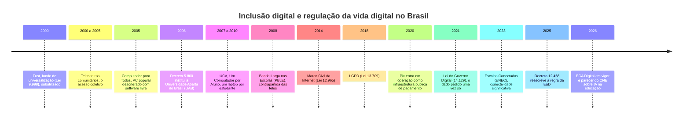
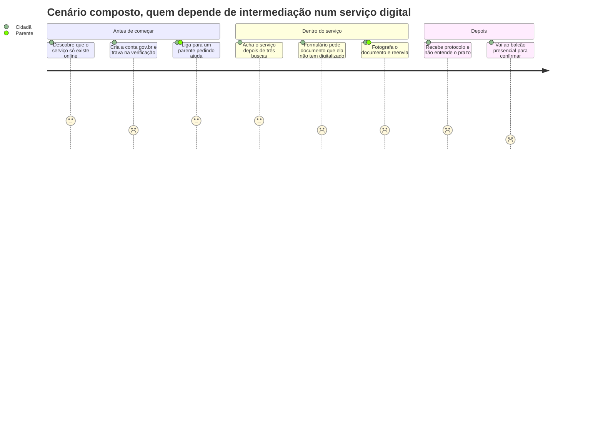

# Cidadania e educação na sociedade digital

> [!quote] Frase de abertura
> *Em 2025, 56% dos usuários de internet do Brasil acessaram o gov.br para resolver algum serviço público, e dentro desse número há um dado incômodo: **12% não acessaram, pediram a outra pessoa que acessasse por eles**. Existem no cadastro do Estado, têm celular na mão e não operam a própria cidadania. A pergunta desta aula é o que falta para elas, e o que isso tem a ver com você, que vai construir o próximo formulário.*

---

## 1. 🔌 Vinte e cinco anos tentando incluir

A inclusão digital brasileira não foi uma política, foram muitas: quase todas honestas, quase nenhuma avaliada até o fim.

![[Recursos/Computação, Sociedade e Inclusão/Cidadania e educação na sociedade digital/telecentro-comunitario.png|Telecentro comunitário em Aricanduva, o modelo de acesso coletivo dos anos 2000 (Kanzyo Oliveira, 2013, CC BY 3.0)]]

Repare no padrão: cada década apostou em um objeto. Os anos 2000, no *lugar* (o telecentro); 2005, no *equipamento*; 2007, no *aluno* (um laptop cada); 2008, no *link*. De 2014 em diante a aposta virou *regra*. E foi quando o Estado parou de distribuir máquina que a conexão chegou, por um caminho que nenhuma dessas políticas desenhou: o celular pré-pago comprado pela própria pessoa.

### 1.1 O retrato de 2025: quem está fora e como está dentro

| Indicador (CETIC.br, TIC Domicílios 2025) | Número | O que ele esconde |
|---|---|---|
| Domicílios com internet | **86%** | Classe A 100%, classe DE **73%** |
| Domicílios com **computador** | **32%** | Classe A 97%, C 34%, DE **10%**; rural 15% |
| Pessoas que usam internet | **85%** | **28 milhões não usam**: 16 mi com 60+ anos, 20 mi até o Fundamental, 23 mi em área urbana |
| Acesso **só pelo celular** | **65%** | Classe A **5%** contra classe DE **87%**; Superior 24% contra Fundamental 84% |
| Ficou **sem pacote de dados** em 3 meses | **39%** dos donos de celular | Pré-pago 68%; classe DE 49%; Norte 54%. Na DE, **22% não usaram nenhum app** |
| **Conectividade significativa** na faixa alta | **20%** | Índice de 9 indicadores: custo, dispositivo, qualidade da conexão, uso |
| Acessou o **gov.br** para um serviço | **56%** | Superior 82%, Fundamental **26%**; **12% pediram a alguém** |

Três leituras cabem aqui. **Deu certo:** 86% dos domicílios conectados é conquista histórica. **Pela metade:** só 32% têm computador e 20% estão na faixa alta de conectividade significativa. **Para o consumo:** o celular pré-pago resolve bem comprar, assistir e conversar, e mal produzir, estudar e reclamar de um serviço público. Guarde a terceira: ela tem nome e autor.

> [!example] 🧪 Atividade 1: a escola que os dados descrevem
> **Ferramenta:** [indicadores da TIC Educação (CETIC.br)](https://cetic.br/pt/pesquisa/educacao/indicadores/), por ano e respondente.
>
> 1. Abra os indicadores de **2025**, respondente **Escolas** ou **Gestores escolares**.
> 2. Extraia **dois números**, um de infraestrutura (escolas com internet para uso dos alunos) e um de IA ou educação digital (escolas com guia sobre IA), anotando **a tabela exata**, o **recorte** e o ano.
> 3. Compare com a **escola onde você fez o Ensino Médio**. Se não souber, ligue para a secretaria e pergunte.
>
> **Resultado esperado:** tabela de três colunas (indicador · média nacional com fonte · sua escola) e uma frase sobre qual dos dois números mudaria mais a sua vida escolar. 📱 No celular, use o [PDF da coletiva](https://cetic.br/media/pdf/analises/20260804094932_pt_br_tic_educacao_2025_coletiva_de_imprensa.pdf) se a tabela ficar ilegível.

---

## 2. 🧐 A crítica: incluir em quê, exatamente?

Em 2008, quando "inclusão digital" ainda era slogan de campanha, o pesquisador brasileiro **Edilson Cazeloto** publicou um livro chato de engolir: a inclusão feita não emancipava ninguém, apenas **incluía as pessoas no consumo**, e o sucesso era medido em máquinas distribuídas, nunca em autonomia. Dezoito anos depois a métrica continua sendo adesão (contas criadas, downloads, usuários ativos), não capacidade de decidir, produzir ou contestar.

> [!abstract] 🧠 Lente filosófica: Edilson Cazeloto (Inclusão digital: uma visão crítica, 2008) 📗
> A tese, em paráfrase: a "inclusão digital" tal como praticada incorpora as populações pobres ao **capitalismo informacional** como consumidoras, não como sujeitos com poder sobre a técnica. (paráfrase) Quando uma empresa comemora que "1 milhão de pessoas da classe DE entraram no app", comemora inclusão de quem, em quê, para quê? A pergunta que Cazeloto obriga a fazer sobre qualquer projeto, inclusive um de extensão bem-intencionado: **ele aumenta a autonomia de quem participa, ou a base de usuários de alguém?** Se a resposta é a segunda, é aquisição de clientes com dinheiro público.

**Magda Pischetola** chegou a conclusão parecida por caminho empírico: pesquisando escolas brasileiras, mostra que **a tecnologia sozinha não muda a prática pedagógica**, o que muda é a mediação do professor e a cultura da escola. É a explicação mais econômica para o destino do UCA, que esbarrou em falta de formação docente e de conectividade: o laptop chegou, a aula continuou igual, só que com laptop.

**bell hooks** ataca a questão pelo lado do sujeito. Em *Ensinando a transgredir* defende a **pedagogia engajada**: a sala como lugar de excitação intelectual e não de controle, em que o professor também se expõe e se transforma (paráfrase). Um tutor de IA que só entrega respostas corretas a um aluno silencioso reproduz, com mais eficiência, o modelo que ela critica: a pergunta não é se a máquina ensina, é **quem tem voz na sala depois que ela entra**.

E há **Paulo Freire**, que escreveu justamente sobre o gesto de "levar" conhecimento a alguém.

> [!abstract] 🧠 Lente filosófica: Paulo Freire (Extensão ou comunicação?, 1969) 📗
> Freire não é tecnófobo. O que ele ataca é o **modelo de transferência**: "extensão" carrega entrega, transmissão, mecanicismo, e descreve alguém que parte do próprio espaço histórico e cultural "para penetrar outro espaço histórico-cultural, superpondo aos indivíduos dêste seu sistema de valôres". Ele chama isso de **invasão cultural**; a alternativa é a **comunicação**, porque conhecer é ato entre sujeitos. Em *Pedagogia da Esperança* (1992) fecha a posição sobre técnica: o fundamental é "a assunção de uma posição crítica, vigilante, indagadora, em face da tecnologia. Nem, de um lado, demonologizá-la, nem, de outro, divinizá-la". **Pergunta aberta:** o seu projeto vai *estender* a IA à comunidade ou *comunicar* com ela? O teste: o que vocês vão aprender lá que não sabiam antes de chegar?

![[Recursos/Computação, Sociedade e Inclusão/Cidadania e educação na sociedade digital/paulo-freire-1963.png|Paulo Freire em 1963, nas campanhas de alfabetização (Arquivo Nacional, domínio público)]]

### 2.1 Quatro degraus de "estar incluído"

Juntando as críticas, "inclusão digital" vira algo mensurável: quatro degraus, e a política brasileira parou entre o segundo e o terceiro.

| Degrau | O que significa | Onde o Brasil está (2025) |
|---|---|---|
| **1. Acesso** | Existe dispositivo e link ao alcance | 86% dos domicílios; conquistado |
| **2. Conexão utilizável** | Funciona o mês inteiro, com velocidade e tela suficientes | 20% na faixa alta; **39%** ficaram sem dados |
| **3. Letramento** | A pessoa sabe usar, avaliar e desconfiar | Só **32%** dos alunos do Médio tiveram orientação sobre IA |
| **4. Autonomia e produção** | A pessoa produz, configura, contesta e decide | Só **18%** das escolas têm grupo de programação, robótica ou maker |

O degrau 4 é o que interessa a um curso de Engenharia de Computação: é o único em que você não é beneficiário, e sim quem constrói a escada.

> [!example] 🧪 Atividade 2: acompanhe alguém que não é você
> **Ferramenta:** um serviço digital real ([gov.br](https://www.gov.br/), [Meu INSS](https://meu.inss.gov.br/), site da prefeitura) e uma pessoa de verdade, com **consentimento explícito**.
>
> 1. Convide **uma pessoa com 60 anos ou mais** (ou alguém sem intimidade com tecnologia) e explique: é trabalho da faculdade, ela pode parar quando quiser, nada será fotografado nem anotado sobre ela.
> 2. Defina **uma tarefa** e o critério de sucesso antes de começar (consultar o extrato do CNIS no Meu INSS, por exemplo).
> 3. Sente-se **ao lado**, cronometre e **não ajude nos cinco primeiros minutos**; quando ela pedir ajuda, anote o **ponto exato**.
> 4. Classifique cada barreira: **linguagem**, **navegação**, **técnica** (deu erro), **física** (letra ou botão pequenos), **confiança** (medo de estragar). Feche com: "o que você faria se eu não estivesse aqui?".
>
> **Resultado esperado:** o tempo total, **três barreiras** classificadas, a resposta literal da última pergunta e uma proposta de correção como engenheiro escreve: qual tela, qual texto, qual campo. Protocolo no [[Kit de ferramentas de Computação e Sociedade|kit]], seção 5.
>
> ⚠️ **Ética:** nunca digite, peça ou fotografe senha, CPF, código de verificação ou dado bancário. Se ela pedir que você faça por ela, isso também é dado: anote e não faça.

---

## 3. 🏫 Presencial e a distância: a briga de 2025 e 2026

A EaD não nasceu com a pandemia. Nasceu por correspondência, passou pelos telecursos na TV aberta, virou política federal com a **UAB** (Decreto 5.800, de 08/06/2006), que levou curso superior público a municípios sem universidade, e explodiu nos anos 2010 com plataformas privadas. A pandemia só obrigou o país a fazer, às pressas, o que uma parte já fazia.

O que mudou foi a escala. Pelo **Mapa do Ensino Superior 2025 do Semesp** (ano-base 2023), **49,3% das matrículas de graduação já são a distância** contra 50,7% presenciais; a EaD cresceu 13,4% de 2022 para 2023 enquanto o presencial caiu 1,0%, e a rede privada concentra **95,9%** dos alunos de EaD.

### 3.1 O que o Decreto 12.456/2025 diz, artigo por artigo

O **Decreto 12.456, de 19/05/2025**, não proíbe EaD: cria **três formatos** e põe piso de presencialidade em cada um.

| Formato (art. 4º) | Piso presencial | Piso presencial ou síncrono mediado | Teto de EaD |
|---|---|---|---|
| **Presencial** (art. 10) | **70%** | (não se aplica) | 30% |
| **Semipresencial** (art. 11) | **30%** | **20%** | o restante |
| **A distância** (art. 12) | **10%** | **10%** | o restante |

Três detalhes que somem no debate: **"atividade síncrona mediada" tem definição técnica** (art. 3º, IV), grupo de **no máximo setenta estudantes** por docente, com controle de frequência; **cinco cursos ficam só no presencial** (art. 8º), Direito, Medicina, Enfermagem, Odontologia e Psicologia, e o art. 9º veda a oferta a distância na saúde e em **licenciaturas**, a parte mais contestada; e as instituições têm **dois anos** para se adequar (art. 41), até maio de 2027. Engenharia de Computação segue podendo ter até 30% a distância.

### 3.2 Quem apoia, quem critica e o que a evidência mostra

| A favor da nova regra | Contra |
|---|---|
| A expansão veio de oferta privada com mediação docente fraca; piso presencial é piso de qualidade | Presencialidade obrigatória não é qualidade: mediação e condição de trabalho docente explicam mais que o formato |
| Formar professor e profissional de saúde exige prática supervisionada | A EaD é o único acesso ao superior em municípios sem campus; encarecer atinge quem já tem menos |
| Sem regra, o mercado corre para o formato mais barato, não para o mais eficaz | O decreto trata formato como qualidade sem apresentar a evidência que sustentaria o corte |

A evidência não fecha com folga para nenhum lado. Um estudo descritivo na *Revista Brasileira de Aprendizagem Aberta e a Distância* (Ramos e Neves, 2025), com microdados do Inep de 2015 a 2024, encontra **taxas de conclusão convergentes** (cerca de 40% no presencial e 34% na EaD), crescimento de 162% no corpo docente da EaD e 39% na proporção de doutores, com **queda na dedicação integral**. Para os autores, a qualidade se associa mais à mediação pedagógica e às condições de trabalho do que à presencialidade. Registre de onde vem: a revista é da **ABED**, associação do setor, o que não invalida os microdados do Inep mas pede que você leia sabendo quem publica.

> [!example] 🧪 Atividade 3: ache o número que esta página não te deu
> **Ferramenta:** [Censo da Educação Superior, resultados (INEP)](https://www.gov.br/inep/pt-br/areas-de-atuacao/pesquisas-estatisticas-e-indicadores/censo-da-educacao-superior/resultados).
>
> 1. Esta aula deliberadamente **não** afirma quantas matrículas de graduação a distância o Brasil teve em 2024: o número não foi confirmado em fonte primária. Vá buscá-lo na edição **2024** (sinopse estatística ou resumo técnico) e extraia matrículas **a distância**, **presenciais** e o **percentual** da EaD.
> 2. Compare com os 49,3% do [Mapa do Semesp](https://www.semesp.org.br/mapa/edicao-15/brasil/), de ano-base 2023, e explique a diferença entre as fontes (ano-base, recorte, quem publica).
>
> **Resultado esperado:** os três números com **a tabela e a página exatas** (print) e duas linhas sobre por que dois números corretos podem discordar. Se não encontrar, registre o caminho e onde o site quebrou: isso também é resultado.

---

## 4. 🤖 IA na educação: a regra está sendo escrita agora

Enquanto se discutia presencialidade, a IA generativa entrou na escola sozinha, sem decreto nem projeto.

### 4.1 O que a TIC Educação 2025 encontrou

A **TIC Educação 2025** (CETIC.br e NIC.br) ouviu **2.404 escolas** por telefone entre agosto de 2025 e abril de 2026 e saiu em **04/08/2026**.

| Indicador (TIC Educação 2025) | Valor |
|---|---|
| Alunos do **Ensino Médio** usuários de internet que usam IA generativa em pesquisa escolar | **7 em 10** |
| Desses, os que dizem ter **recebido orientação da escola** | **32%** |
| Escolas que **permitem** o uso de IA pelos alunos em atividades | **37%** (52% nas que têm Ensino Médio) |
| Escolas com **guia de orientações** sobre uso de IA | **22%** |
| **Gestores escolares** que usam IA generativa na gestão | **53%** (Norte 39%, Sul 66%) |
| Escolas com projeto de educação digital e para a cidadania | **65%** (urbana 72%, **rural 52%**) |
| Escolas com grupo de programação, robótica ou maker | **18%** (municipal 11%, privada 32%) |

Leia a primeira linha junto com a segunda: **a tecnologia entrou por baixo**. Não foi decidida em reunião pedagógica, foi adotada pelo aluno e depois pelo gestor; quando a escola apareceu, apareceu regulando algo que já estava dentro. É o padrão de adoção em toda organização onde você vai trabalhar.

### 4.2 Avaliação, cola e a armadilha dos detectores

A reação mais comum ao ChatGPT foi comprar detector de texto gerado por IA. É tecnicamente ruim. O estudo mais citado, de **Liang e colegas (2023, revista *Patterns*)**, avaliou **sete detectores comerciais** com textos humanos: redações de estudantes americanos do 8º ano e do TOEFL escritas por **não nativos**. Resultado: **mais da metade das redações dos não nativos foi classificada como gerada por IA**, enquanto as dos nativos foram identificadas corretamente quase sempre. O detector confunde vocabulário simples com máquina e **pune quem escreve na segunda língua**; no Brasil puniria primeiro o aluno de escola pública com repertório menor.

A resposta honesta não é policiar, é **redesenhar a avaliação**: exigir processo (rascunhos, versões, registro de uso de IA), defesa presencial e produção sobre dado que o aluno coletou e o modelo não tem. É o que esta disciplina faz, e as regras estão no [[Kit de ferramentas de Computação e Sociedade|kit]].

### 4.3 O parecer do CNE e os quatro níveis de risco

Em **11/05/2026** o Conselho Nacional de Educação aprovou parecer com diretrizes para uso de IA na educação básica e superior, com **consulta pública** até 14/06/2026. O texto de referência classifica os sistemas em **quatro níveis de risco**, a tabela mais útil que existe hoje para quem vai construir um sistema educacional no Brasil.

| Nível | Exemplos | Exigências |
|---|---|---|
| **I. Baixo risco** | Material didático, apoio à acessibilidade, revisão textual não avaliativa, planejamento | Transparência mínima, segurança da informação, responsabilização institucional |
| **II. Risco moderado** | Tutoria, feedback formativo, **assistentes institucionais**, apoio à produção textual, recomendação sem efeito decisório | Transparência, **registro institucional**, **revisão humana obrigatória**, monitoramento, vedação de uso dos dados para treinar terceiros sem base legal |
| **III. Alto risco** | Correção automatizada com repercussão acadêmica, **proctoring biométrico**, perfilização individual, concessão de benefícios, dados sensíveis | **Avaliação prévia de impacto algorítmico**, relatório de impacto à proteção de dados, supervisão humana contínua, rastreabilidade e **direito de contestação** |
| **IV. Risco excessivo** | **Pontuação social**, **vigilância emocional**, perfilização psicológica ou biométrica para classificar ou disciplinar, **decisão exclusivamente automatizada** sobre promoção, retenção ou desligamento | Vedado |

O parecer coloca a **formação docente como condição** de implementação, não como consequência: é o ponto de Pischetola virando norma. A **UNESCO** publicou em 2024 o *AI Competency Framework for Students*, com **12 competências em 4 dimensões** (mentalidade centrada no ser humano, ética da IA, técnicas e aplicações, design de sistemas) e **3 níveis** (compreender, aplicar, criar), em **português** e com publicação irmã para professores. É base curricular pronta para a oficina: não invente competência, reuse.

### 4.4 Tutores de IA: dois casos com finais diferentes

O **Khanmigo**, da Khan Academy, é o tutor mais citado com política pedagógica explícita: foi desenhado para **não entregar a resposta pronta**, e sim conduzir por perguntas. A diferença entre otimizar a nota e otimizar o aprendizado está no *prompt*, não no modelo.

A **Duolingo** mostra o outro lado: a estratégia "AI-first" anunciada pelo CEO Luis von Ahn em abril de 2025, com corte de prestadores e IA na avaliação de desempenho, provocou reação imediata dos usuários e, em 2026, recuo público. Lição: **anunciar automação é ato de comunicação, não só de engenharia**.

> [!example] 🧪 Atividade 4: audite um assistente institucional contra o nível II do CNE
> **Ferramentas:** o **IFFBot**, assistente institucional do IFF que busca sobre documentos próprios (endereço passado em sala). Fora do ar, use um **assistente público** (ChatGPT, Gemini, Copilot) no papel de assistente institucional e confira contra o [portal do IFF](https://portal1.iff.edu.br/).
>
> 1. Escreva **5 perguntas institucionais verificáveis** antes de testar (trancamento; créditos do curso; horário da biblioteca; declaração de vínculo; aproveitamento de estudos).
> 2. Classifique cada resposta em **acerto**, **erro** ou **abstenção** ("não encontrei na base"). Abstenção **não** é erro: é o correto quando não há fonte. Confira cada uma contra a fonte oficial e registre o link.
> 3. Audite o sistema contra o **nível II do CNE**: há aviso de que é IA? Há responsável institucional identificável? Há revisão humana? Os dados vão para treinar terceiros? Onde está escrito?
>
> **Resultado esperado:** tabela de 5 linhas (pergunta · resposta · acerto/erro/abstenção · link da fonte) e um parágrafo de conformidade com as quatro exigências do nível II, dizendo o que **falta** e como corrigir. O responsável pelo sistema é o professor, e ele lê.

> [!example] 🧪 Atividade 5: Elements of AI, capítulo 1
> **Ferramenta:** [Elements of AI](https://www.elementsofai.com/), curso gratuito da Universidade de Helsinque, com **versão em português** em [elementsofai.pt](https://www.elementsofai.pt/).
>
> 1. Crie a conta (gratuita), comece a Parte 1, *Introdução à IA*, e complete **o capítulo 1 inteiro**, com os exercícios.
> 2. Anote **uma definição do curso com a qual você discorda** como estudante de Engenharia de Computação, e por quê.
>
> **Resultado esperado:** print da barra de progresso com o capítulo 1 concluído e a data, mais três linhas de discordância fundamentada. O material entra direto na oficina do [[Projeto de Extensão - IA para Todos]]: é aberto, em português e feito para leigos.

---

## 5. 🗳️ Cidadania digital: o Estado do outro lado da tela

Nos últimos dez anos o Estado brasileiro migrou para a tela. A **Lei 14.129, de 29/03/2021** (Governo Digital) consolidou princípios: serviços digitais por padrão, interoperabilidade entre bases e o direito de **não fornecer o mesmo dado duas vezes** ao poder público. A conta **gov.br** virou a identidade digital única, com níveis (bronze, prata, ouro) que determinam a que serviços você tem acesso, e documentos como o **e-Título** passaram a existir primariamente como registro em base pública, não como papel.

![[Recursos/Computação, Sociedade e Inclusão/Cidadania e educação na sociedade digital/pix-logo.png|Marca do Pix, em operação desde novembro de 2020 (Banco Central, domínio público)]]

O caso mais bem-sucedido é o **Pix**: em 2025, **75% dos usuários de internet** fizeram pagamento ou transferência por Pix (indicador inédito da TIC Domicílios). Um protocolo público, gratuito no varejo e obrigatório para os grandes bancos, alcançou em cinco anos o que trinta anos de política de bancarização não alcançaram.

O mais incompleto é a própria conta gov.br: **56%** acessaram, mas **12% pediram a outra pessoa que acessasse por eles**, e entre quem tem só o Fundamental o uso cai para **26%**. Isso tem nome: **intermediação digital**. A pessoa tem direito, cadastro e celular, e mesmo assim depende de um neto ou de um despachante para exercer a cidadania. Todo despachante informal é uma falha de design que virou profissão.

A sua tarefa não é acreditar nesse percurso: é testá-lo com uma pessoa real e trazer o verdadeiro.

### 5.1 A ferramenta de cidadania mais subutilizada do país

Pela **Lei de Acesso à Informação (Lei 12.527/2011)** qualquer pessoa pode pedir informação a qualquer órgão público, e o art. 10, §3º **veda que exijam o motivo** do pedido. O prazo é de **20 dias**, prorrogáveis por mais 10 com justificativa (art. 11, §§1º e 2º); negado o acesso, cabe recurso em 10 dias à autoridade superior, que responde em 5 (art. 15), e depois à CGU (art. 16). A plataforma federal é o **Fala.BR**, com login pela conta gov.br que você já tem.

O **silêncio administrativo não encerra o pedido**: é ele que abre o recurso, e vale como dado de pesquisa.

> [!example] 🧪 Atividade 6: faça um pedido de verdade pela LAI
> **Ferramenta:** [Fala.BR, ouvidoria e acesso à informação](https://falabr.cgu.gov.br/), login com a conta gov.br.
>
> 1. Escolha **uma pergunta objetiva, verificável e de interesse real**: quanto o IFF gastou com licenças de software em 2025; quantas escolas municipais de Bom Jesus têm internet para uso dos alunos (esta vai à prefeitura, não ao federal).
> 2. Escreva em **até cinco linhas**, sem justificar o motivo (a lei proíbe exigirem isso) e pedindo o dado em formato aberto quando fizer sentido.
> 3. Protocole, **anote o protocolo e a data** e marque no calendário o dia 20 e o dia 30.
>
> **Resultado esperado:** o **número de protocolo**, a data, o texto do pedido e, na aula de fechamento do bimestre, a resposta (ou a ausência dela) com a sua avaliação: respondeu o que foi perguntado? Veio em formato reutilizável? Se negou, com que fundamento legal? 📱 O Fala.BR funciona no navegador do celular, com o app gov.br para autenticar.

### 5.2 Participação: onde o cidadão fala e alguém é obrigado a ouvir

O **e-Cidadania** do Senado tem três canais: **Ideia Legislativa** (com **20.000 apoios** vira sugestão legislativa analisada por comissão), **Consulta Pública** (votar sim ou não em proposições em tramitação) e **Evento Interativo** (perguntar ao vivo em audiências). No Executivo federal as consultas ficam no **Brasil Participativo**. ⚠️ O antigo **Participa + Brasil foi encerrado** e a própria página redireciona para lá; material que cita o nome antigo está desatualizado.

> [!example] 🧪 Atividade 7: participe de uma consulta pública aberta
> **Ferramentas:** [e-Cidadania (Senado)](https://www12.senado.leg.br/ecidadania) ou [Brasil Participativo](https://brasilparticipativo.presidencia.gov.br/).
>
> 1. Localize **uma consulta ou proposição aberta** sobre tecnologia, dados, IA, telecomunicações ou educação e leia a proposta de verdade (ementa e pelo menos um artigo), não só o título.
> 2. **Registre a sua posição ou contribuição** e capture o print com data.
> 3. Escreva **10 linhas de justificativa técnica**: qual é o problema, o que a proposta faz, o que resolve ou quebra, com pelo menos um dado desta aula como apoio.
>
> **Resultado esperado:** o print da contribuição, o link da proposição e as 10 linhas. Sem partidarismo: a justificativa tem que ser técnica e sustentada por evidência.

### 5.3 Direitos digitais e desinformação

O tripé jurídico está montado: **Marco Civil da Internet (Lei 12.965/2014)**, **LGPD (Lei 13.709/2018)** e o **ECA Digital (Lei 15.211/2025, em vigor desde 17/03/2026)**, que trouxe deveres novos para plataformas: prevenir riscos desde a concepção (art. 6º), **privacidade por padrão no grau mais protetivo** (art. 7º), aferição de idade por lojas de aplicativos com medidas "proporcionais, auditáveis e tecnicamente seguras" (art. 12) e **proibição de perfilamento de crianças e adolescentes para publicidade** (art. 26). Quem construir produto com público jovem tem aí quatro requisitos, não sugestões.

**2026 é ano de eleições gerais no Brasil**, com primeiro turno em outubro. Duas coisas objetivas: a **Resolução TSE 23.732/2024** foi o primeiro marco eleitoral brasileiro sobre IA generativa, exigindo rótulo em conteúdo sintético e proibindo deepfake na propaganda, e o TSE mantém o canal [Fato ou Boato](https://www.tse.jus.br/comunicacao/fato-ou-boato). **Lupa**, **Aos Fatos** e **Comprova** assinam o código do **IFCN**, que exige metodologia pública e política de correção.

> [!warning] A regra desta disciplina sobre eleição
> Esta página descreve o que a norma diz e apresenta os argumentos de cada lado com fonte. Não indica candidato, partido nem voto. Checar é método, não posicionamento: **você checa com o mesmo rigor a alegação de que gosta e a que detesta**, e é assim que a atividade será avaliada.

> [!example] 🧪 Atividade 8: refaça a checagem, não só leia a checagem
> **Ferramentas:** [Lupa](https://lupa.uol.com.br/) · [Aos Fatos](https://www.aosfatos.org/) · [Comprova](https://projetocomprova.com.br/) · busca reversa no [Google Imagens](https://images.google.com/) · [Wayback Machine](https://web.archive.org/)
>
> 1. Escolha **uma alegação viral da semana** sobre tecnologia, IA, escola ou serviço público. De propósito, **uma que você tenha vontade de acreditar**.
> 2. Veja se já existe checagem publicada nas três agências e anote a conclusão de cada uma.
> 3. **Refaça a checagem sozinho**: busca reversa da imagem ou do frame do vídeo, procura da **fonte primária** (a lei, o relatório, o dado, a conta oficial) e verificação da data na Wayback Machine. Documente **o caminho**: cada busca, cada link, cada beco sem saída.
>
> **Resultado esperado:** ficha de método de uma página com a alegação, as conclusões das agências, o seu caminho passo a passo e a conclusão final com grau de certeza. Se divergir das agências, explique onde. 📱 No celular a busca reversa funciona pelo Google Lens.

### 5.4 E quem não tem celular?

Tudo acima pressupõe aparelho, conta gov.br e pacote de dados vivo. **28 milhões de brasileiros não usam internet** (16 milhões com 60 anos ou mais) e **39%** ficam sem dados no mês: para uma fatia grande da população, o serviço "100% digital" é um serviço fechado.

Quando um serviço migra para digital, o canal presencial não é redundância, é a acessibilidade do sistema. Quem projeta sem plano para quem não tem dispositivo, para conexão intermitente e sem caminho presencial não fez um serviço eficiente: **fez um serviço com critério de exclusão embutido**, o que [[A tecnologia não é neutra - Computação e Sociedade]] chama de política dentro do artefato.

> [!example] 🧪 Atividade 9: teste o gov.br na internet que o Brasil tem
> **Ferramenta:** DevTools (`F12`), aba **Network**, *throttling* em **Slow 3G**; alvo em [gov.br](https://www.gov.br/) ou [Meu INSS](https://meu.inss.gov.br/).
>
> 1. Escolha **uma tarefa completa** (abrir a emissão de um documento, ou chegar à tela de login de um serviço).
> 2. No DevTools, aba Network, marque **Disable cache** e selecione **Slow 3G**.
> 3. **Cronometre** do primeiro clique até a tela final; anote o tempo até o primeiro conteúdo visível e o **peso total transferido** (a barra de status mostra em KB ou MB). Repita sem *throttling*, compare e conte quantas requisições são de terceiros.
>
> **Resultado esperado:** tabela com tempo total, tempo até o primeiro conteúdo e peso transferido nas duas condições, mais **três recomendações de engenharia** para o serviço rodar em conexão ruim (o que cortar, o que adiar, o que servir primeiro). Junte com a atividade 2: barreira humana e técnica são o mesmo problema.

---

## 6. 🇧🇷 No Brasil: o Noroeste Fluminense e o que dá para fazer daqui

Os números nacionais escondem território. **Bom Jesus do Itabapoana** tinha **35.173 habitantes** no Censo 2022 (IBGE), estimados em **37.178** para 2026: aqui a distância até o serviço digital não se mede em cliques, e sim em quem tem quem para ajudar.

![[Recursos/Computação, Sociedade e Inclusão/Cidadania e educação na sociedade digital/mancio-lima-digital.png|Antena de satélite levando conexão a um telecentro em Mâncio Lima (AC), 2009 (Gleilson Miranda, Ag. de Notícias do Acre, CC BY 2.0)]]

Junte três dados desta aula e você tem um projeto: **48% das escolas rurais** não têm projeto de educação digital (contra 28% das urbanas); **só 22%** têm guia de uso de IA; e **12% dos usuários de internet** dependem de outra pessoa para acessar o gov.br. Os três são atacáveis por uma turma em um semestre, e é o que o [[Projeto de Extensão - IA para Todos]] faz: oficinas de letramento em IA e inclusão digital com públicos reais do município, com o material publicado como REA ([[Recursos Educacionais Abertos]]).

> [!abstract] 🧠 Lente filosófica: Milton Santos (Por uma outra globalização, 2000)
> Milton Santos, geógrafo baiano e um dos maiores pensadores brasileiros do século XX, lê a globalização em três chaves ao mesmo tempo: o mundo como **fábula** (a narrativa de aldeia global harmônica), como **perversidade** (a concentração de renda e poder disfarçada de inevitabilidade técnica) e como **possibilidade** (o que pode ser construído de baixo, a partir dos países pobres e das classes populares). O conceito operacional é o **meio técnico-científico-informacional**: "O meio técnico-científico-informacional é a cara geográfica da globalização" (SANTOS, 1997, p. 191, citado por MAIA, 2012). Ou seja: técnica, ciência e informação **não se distribuem igualmente pelo território**. Bom Jesus recebe uma densidade desse meio, São Paulo recebe outra, e a diferença não é acidente, é geografia do poder. **Pergunta aberta:** quando você escolhe onde instalar um serviço, uma antena ou um data center, está fazendo engenharia ou geografia política?

---

## 7. 🤖 E a IA? · 🔮 E em 2036?

A IA muda três coisas de uma vez neste tema, e nenhuma na direção óbvia.

- **Na escola**, derruba o custo marginal do tutor individual: pode virar tutoria de qualidade para quem nunca teve professor particular, ou escola rica com professor mais IA e escola pobre com IA sem professor. Os dados de 2026 sugerem a segunda na frente (7 em 10 alunos usam, 32% receberam orientação). O gargalo não é o modelo, é a **formação docente**.
- **No Estado**, entra pelo atendimento (assistentes, triagem, resumo de processo) e tenta subir para a decisão (fila, fraude, análise de benefício). A régua está nos níveis III e IV do CNE; o debate da próxima década é se a mesma vedação vale para benefício social, crédito e saúde.
- **Na cidadania**, é ao mesmo tempo a melhor ferramenta de intermediação já inventada para quem não domina a linguagem burocrática e a industrialização da desinformação.

| Cenário para 2036 | O que precisa acontecer | Quem sustenta essa leitura |
|---|---|---|
| **Tutor para todos** | Formação docente em escala, modelo aberto rodando local, letramento em IA no currículo | UNESCO (2024); parecer do CNE (2026) |
| **Tutor para poucos** | Nada: é a extrapolação do presente (22% com guia de IA, 18% com grupo maker) | TIC Educação 2025 |
| **Estado que atende melhor** | Serviços que rodam em 3G, balcão preservado, IA como tradutora e não decisora | Lei 14.129/2021; níveis I e II do CNE; o Pix |
| **Estado que decide sozinho** | Automação da decisão sem impacto algorítmico avaliado nem contestação | O que os níveis III e IV do CNE existem para impedir |

**O que isso significa para você.** Em 2036 você estará no meio da carreira e, se trabalhar com serviço público (a maior parte dos engenheiros de computação brasileiros trabalha, em algum momento, para um órgão, uma estatal ou uma empresa que os atende), vai escrever código que decide se alguém consegue exercer um direito. As perguntas desta aula viram requisitos: **funciona em Slow 3G? funciona para quem tem só celular? existe caminho presencial? existe revisão humana? existe como contestar?** Nenhuma é pergunta de humanas: são requisitos não funcionais, e vão para o mesmo documento onde você escreve latência e disponibilidade.

---

## 🗣️ Para debater em sala

1. **O piso de 70% de presencialidade do Decreto 12.456/2025 melhora a qualidade ou reduz o acesso?** *Melhora:* a expansão veio de oferta privada com mediação docente fraca, e presencialidade é o piso mais fácil de fiscalizar (Decreto 12.456/2025, arts. 8º a 12). *Reduz o acesso:* as taxas de conclusão são convergentes (40% e 34%) e a qualidade se associa mais à mediação pedagógica e às condições de trabalho do que ao formato (Ramos e Neves, RBAAD, 2025).
2. **Escola deve proibir, permitir ou ensinar IA generativa?** *Regular e ensinar:* 7 em 10 alunos do Médio já usam e só 32% receberam orientação; proibir desloca o uso para a clandestinidade (TIC Educação 2025; UNESCO, 2024). *Restringir:* com só 22% das escolas com guia e sem formação docente, liberar transfere ao aluno um risco que a instituição não sabe gerenciar (CNE, 11/05/2026).
3. **Serviço público 100% digital é inclusão ou exclusão?** *Inclusão:* o Pix chegou a 75% dos usuários de internet em cinco anos e o gov.br a 56%, alcance que o balcão nunca teve e com custo menor. *Exclusão:* 28 milhões não usam internet, 39% ficam sem dados no mês e 12% dependem de terceiros, então fechar o balcão retira direito de quem já tem menos (CETIC.br, 2025).

---

## ❓ Quiz rápido

> [!question]- 1. Em 2025, qual percentual dos domicílios brasileiros tinha computador?
> **Resposta:** **32%** (CETIC.br, TIC Domicílios 2025). 86% têm internet, mas só um terço tem computador, e na classe DE são 10%: a inclusão brasileira aconteceu por celular, não por PC.

> [!question]- 2. Pelo Decreto 12.456/2025, quanto de carga horária a distância pode ter um curso de graduação presencial?
> **Resposta:** no máximo **30%**. O art. 10 exige no mínimo 70% em atividades presenciais; para Medicina, o §3º prevê piso superior a 70%, fixado pelo Ministro.

> [!question]- 3. Verdadeiro ou falso: detectores de texto gerado por IA são solução técnica adequada contra a cola.
> **Resposta:** **Falso.** Em Liang e colegas (*Patterns*, 2023), sete detectores classificaram como geradas por IA mais da metade das redações do TOEFL de não nativos, acertando quase sempre nas de nativos: confundem vocabulário simples com máquina. A saída é redesenhar a avaliação, não policiar.

> [!question]- 4. Um assistente institucional de IA que responde dúvidas de alunos cai em que nível de risco do parecer do CNE de 2026?
> **Resposta:** **Nível II, risco moderado:** transparência, registro institucional, **revisão humana obrigatória**, monitoramento e vedação de uso dos dados para treinar terceiros sem base legal. Correção automatizada com efeito na nota seria nível III; decisão automatizada sobre reprovação, nível IV.

> [!question]- 5. Você protocolou um pedido pela LAI e passaram 25 dias sem resposta. O que a lei permite fazer?
> **Resposta:** Recorrer. O prazo é de **20 dias**, prorrogáveis por 10 com justificativa (art. 11, §§1º e 2º da Lei 12.527/2011). Sem resposta ou com negativa, cabe recurso em **10 dias** à autoridade superior, que responde em 5 (art. 15), e depois à CGU (art. 16). O silêncio abre o recurso e é dado por si só.

---

## 🔗 Veja também

- [[Projeto de Extensão - IA para Todos]]: a proposta da sua equipe é entregue na aula de hoje.
- [[Recursos Educacionais Abertos]]: o material da sua oficina é um REA, e a licença é escolha de projeto.
- [[Tecnologia social e tecnologia convencional]]: transforma esta crítica em critério de projeto.
- [[Kit de ferramentas de Computação e Sociedade]]: Fala.BR, consentimento e observação de uso.
- [[Minha metodologia de ensino]]: como o site e a avaliação são construídos.
- ➡️ **Próxima aula:** [[Tecnologia social e tecnologia convencional]]

---

> [!note] 📚 Fontes (2025 e 2026)
> - CETIC.br: [TIC Domicílios 2025 (09/12/2025)](https://cetic.br/media/analises/tic_domicilios_2025_principais_resultados.pdf) · [TIC Educação 2025, coletiva (04/08/2026)](https://cetic.br/media/pdf/analises/20260804094932_pt_br_tic_educacao_2025_coletiva_de_imprensa.pdf), [indicadores](https://cetic.br/pt/pesquisa/educacao/indicadores/) e [7 em 10 alunos do Médio usam IA](https://cetic.br/noticia/sete-em-cada-dez-alunos-do-ensino-medio-usam-ia-generativa-em-pesquisas-escolares-revela-tic-educacao/)
> - Leis: [Decreto 12.456/2025, EaD](https://www.planalto.gov.br/ccivil_03/_ato2023-2026/2025/decreto/d12456.htm) · [Decreto 5.800/2006, UAB](https://www.planalto.gov.br/ccivil_03/_ato2004-2006/2006/decreto/d5800.htm) · [Lei 14.129/2021, Governo Digital](https://www.planalto.gov.br/ccivil_03/_ato2019-2022/2021/lei/l14129.htm) · [Lei 12.527/2011, LAI](https://www.planalto.gov.br/ccivil_03/_ato2011-2014/2011/lei/l12527.htm) · [Lei 15.211/2025, ECA Digital](https://www.planalto.gov.br/ccivil_03/_ato2023-2026/2025/lei/l15211.htm) · [Res. TSE 23.732/2024](https://www.tse.jus.br/legislacao/compilada/res/2024/resolucao-no-23-732-de-27-de-fevereiro-de-2024)
> - Ensino superior: [Semesp, Mapa 2025](https://www.semesp.org.br/mapa/edicao-15/brasil/) · RAMOS e NEVES, [RBAAD 25(2), 2025](https://seer.abed.net.br/RBAAD/article/view/869)
> - IA na educação: [MEC/CNE, texto de referência (maio/2026)](https://www.gov.br/mec/pt-br/cne/2026/maio-2026/texto-referencia-inteligencia-artificial-consulta-publica.pdf) e [a aprovação em 11/05/2026](https://www.poder360.com.br/poder-educacao/cne-aprova-diretrizes-sobre-uso-de-ia-na-educacao/) · [UNESCO, quadro de competências (2024)](https://www.unesco.org/en/articles/ai-competency-framework-students), [em português](https://unesdoc.unesco.org/ark:/48223/pf0000394281_por) · LIANG, W. et al. [GPT detectors are biased against non-native English writers, *Patterns* 4(6), 2023](https://arxiv.org/abs/2304.02819) · [Khanmigo](https://www.khanmigo.ai) · Duolingo, [o memorando (Entrepreneur, 2025)](https://www.entrepreneur.com/business-news/duolingo-ceo-clarifies-ai-stance-after-backlash-read-memo/492141) e [o recuo (Fortune, 2026)](https://fortune.com/2026/04/13/duolingo-ceo-luis-von-ahn-ai-usage-requirement-employee-performance-evaluations/)
> - Cidadania (as ferramentas estão linkadas nas atividades): [e-Título](https://www.tse.jus.br/servicos-eleitorais/titulo-e-local-de-votacao/e-titulo) · [IFCN](https://www.poynter.org/ifcn/) · [IBGE Cidades, Bom Jesus do Itabapoana](https://cidades.ibge.gov.br/brasil/rj/bom-jesus-do-itabapoana/panorama)
> - Imagens (Wikimedia Commons): [telecentro em Aricanduva, Kanzyo Oliveira, CC BY 3.0](https://commons.wikimedia.org/wiki/File:Telecentro_Comunit%C3%A1rio_de_Arincandva_-_panoramio.jpg) · [Paulo Freire (1963), Arquivo Nacional, dom. público](https://commons.wikimedia.org/wiki/File:Paulo_Freire_(1963).tif) · [logotipo do Pix, Banco Central, dom. público](https://commons.wikimedia.org/wiki/File:Pix_(Brazil)_logo.svg) · [Mâncio Lima digital, Gleilson Miranda / Ag. de Notícias do Acre, CC BY 2.0](https://commons.wikimedia.org/wiki/File:M%C3%A2ncio_Lima_digital_(4292520777).jpg)

> [!note] 📖 Leituras
> - CAZELOTO, Edilson. *Inclusão digital: uma visão crítica*. São Paulo: Senac, 2008. 📗 Incluir no consumo não é incluir na cidadania.
> - PISCHETOLA, Magda. *Inclusão digital e educação*. Petrópolis: Vozes, 2016. 📗 O que muda a prática é a mediação docente.
> - FREIRE, Paulo. *Extensão ou comunicação?* Rio de Janeiro: Paz e Terra, 1971 (orig. 1969). 📗 🔓 [PDF integral](https://fasam.edu.br/wp-content/uploads/2020/07/Extensao-ou-Comunicacao-1.pdf). Leitura obrigatória antes da sua oficina. Do mesmo autor, *Pedagogia da Esperança* (1992), no 🔓 [Acervo Paulo Freire](https://acervo.paulofreire.org/items/3fbb996c-20ad-4be3-a658-499d2bb3494a): nem demonizar, nem divinizar a técnica.
> - HOOKS, bell. *Ensinando a transgredir*. São Paulo: WMF Martins Fontes, 2013 (orig. 1994). 📗 Quem tem voz na sala.
> - VALLEJO, Antonio Pantoja et al. *Sociedade da informação, educação digital e inclusão*. Florianópolis: Insular/UFSC, 2007. 📗
> - SANTOS, Milton. *Por uma outra globalização*. Rio de Janeiro: Record, 2000. 🔓 [Introdução em PDF](https://arquivos.ufrrj.br/arquivos/202320605769723791143dbac634808fe/Texto_6_Milton_Santos__Introduo_Geral_-_Livro_Por_uma_outra_globalizacao.pdf).
