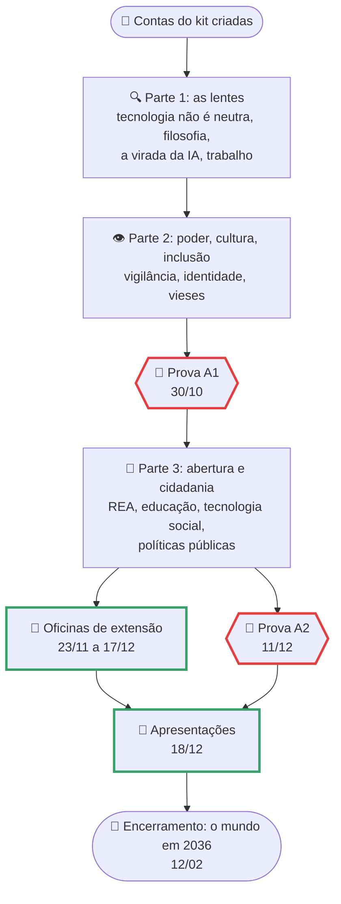

# Cronograma de Computação, Sociedade e Inclusão

> [!quote] Um semestre, um mundo em transformação
> *Cada sexta-feira você olha para um pedaço do mundo que a computação e a inteligência artificial estão mudando: o trabalho, o poder, a cultura, a cidadania. No fim do semestre você terá auditado um algoritmo, entrevistado profissionais sobre o futuro da profissão deles, feito um diário de campo numa comunidade online, escrito uma proposta de política pública e dado uma oficina de IA para pessoas de verdade.*

> [!info] Como usar esta página
> - **Antes da aula:** leia a página do encontro e deixe as contas do [[Kit de ferramentas de Computação e Sociedade|kit de ferramentas]] criadas (Wikipédia, Hypothes.is, Kialo, GitHub).
> - **Na aula:** fazemos as atividades 🧪 da página juntos e debatemos as perguntas da seção 🗣️. Traga o notebook ou, no mínimo, o celular: quase tudo roda no navegador.
> - **Depois da aula:** os trabalhos ficam em [[Trabalhos e Projetos de Computação, Sociedade e Inclusão]], o projeto de extensão em [[Projeto de Extensão - IA para Todos]] e as datas aqui. O que foi dado em cada aula fica registrado no [[Comp Sociedade 7Eng 2026-2|log da turma]].
> - Datas podem mudar por evento do campus ou feriado. A versão desta página é sempre a que vale.

---

## 📅 Encontros de 2026.2 (sextas, 12:50 às 15:40)

| # | Data | Aula | O que fazemos em sala | Entregas e avisos |
|---|------|------|-----------------------|-------------------|
| 1 | 28/08 | Apresentação da disciplina | Regras, site, metodologia, o projeto de extensão | Criar as contas do kit |
| 2 | 04/09 | [[A tecnologia não é neutra - Computação e Sociedade]] + [[Kit de ferramentas de Computação e Sociedade]] | As quatro lentes no app mais usado do seu celular; teste de Winner; painel do CETIC.br | Contas criadas; primeira anotação no Hypothes.is |
| 3 | 11/09 | [[Filosofia da Tecnologia - as grandes perguntas da era da IA]] | Leitura anotada de Winner (1980); Moral Machine; três modelos de IA respondem "a técnica é neutra?" | |
| 4 | 18/09 | [[A virada da IA - o que mudou no mundo desde 2022]] | Modelo local (Ollama) contra modelo em nuvem; tramitação do PL 2338; AI Incident Database | **T1 lançado** |
| 5 | 25/09 | [[Automação, trabalho e o futuro das profissões]] | O*NET e relatórios do WEF e da OIT; automatizar uma tarefa real e cronometrar | **T2 lançado** · Semana da Mostra do Conhecimento (21 a 26/09): confirmar a aula |
| 6 | 02/10 | [[Poder, plataformas e vigilância - o público, o privado e o sujeito]] | Takeout, preferências de anúncios, Cover Your Tracks, tosdr; exercer um direito da LGPD | **T3 lançado** (o diário de campo começa hoje) |
| 7 | 09/10 | [[Cultura, identidade e tecnologias digitais]] | Protocolo de etnografia digital; teste cultural de um modelo de IA; Wikipédia em duas línguas | **T1: entrega** |
| | 16/10 | Recesso (Dia do Servidor Público) | | |
| 8 | 23/10 | [[Vieses, discriminação algorítmica e inclusão]] | Auditoria de viés no Colab (Fairlearn); gerador de imagens; WAVE e leitor de tela | **T2: entrega** |
| 9 | 30/10 | **Prova objetiva A1** + debate de fechamento (formato Oxford) | | Prova A1 (páginas das partes 1 e 2) · **T3: entrega** |
| 10 | 06/11 | [[Recursos Educacionais Abertos]] | Editar a Wikipédia de verdade; licenciador Creative Commons; Zenodo | **Projeto de extensão lançado**: equipes e públicos definidos em sala |
| 11 | 13/11 | [[Cidadania e educação na sociedade digital]] | Pedido pela Lei de Acesso à Informação no Fala.BR; gov.br com rede lenta; IFFBot | **Extensão: proposta da equipe (entrega)** |
| | 20/11 | Feriado (Dia da Consciência Negra) | | |
| 12 | 27/11 | [[Tecnologia social e tecnologia convencional]] | Banco de tecnologias sociais da FBB; OpenStreetMap e uMap de Bom Jesus; computação cívica | **T4 lançado** · janela das oficinas de extensão aberta (23/11 a 17/12) |
| 13 | 04/12 | [[Relevância social, investimento e políticas públicas de tecnologia]] | Portal da Transparência; Lei do Bem; ODS; template de policy brief | Acompanhamento das oficinas (cada equipe reporta) |
| 14 | 11/12 | [[O engenheiro de computação em 2036 - trabalho, carreira e responsabilidade]] + **Prova objetiva A2** | Vagas de 2026 tabuladas; cenários para 2036 | Prova A2 (páginas das partes 3 e 4) · **T4: entrega** |
| 15 | 18/12 | **Apresentações do Projeto de Extensão** | Cada equipe apresenta a oficina executada, as evidências e o REA publicado | **Extensão: relatório e apresentação** |
| | 24/12 a 29/01 | Recesso e férias | | |
| | 01 a 05/02 | Semana de A3 (recuperação) | | Prova A3 só para quem não atingiu a média |
| 16 | 12/02 | Encerramento: roda de conversa "o mundo em 2036" e devolutiva | | Sem avaliação |
| | 15 a 19/02 | Segunda chamada de A3 | | |

> [!warning] Datas que dependem do campus
> - **25/09:** cai na semana da Mostra do Conhecimento (21 a 26/09). Se a aula for suspensa, tudo anda uma semana: Vieses passa para 06/11, REA para 13/11, o projeto de extensão é lançado em 13/11 com proposta em 27/11, e Tecnologia social e Políticas viram uma aula dupla em 04/12. A prova A1 continua em 30/10.
> - **11/12** é a data-limite de entrega de notas para a matrícula do semestre seguinte. Por isso a prova A2 e o T4 fecham nesse dia, e a apresentação do projeto de extensão fica em 18/12, ainda dentro da etapa A2 (que vai até 30/01/2027).

---

## 🗺️ A jornada do semestre

---

## 📊 Como a nota é composta

A disciplina segue a regra do curso superior: **A1 e A2** são avaliações regulares e **A3** é a recuperação. Cada etapa fecha pela **soma** dos pontos abaixo (nunca por média ponderada). Detalhes de cada trabalho em [[Trabalhos e Projetos de Computação, Sociedade e Inclusão]] e do projeto em [[Projeto de Extensão - IA para Todos]].

| Etapa | Item | Pontos |
|-------|------|--------|
| A1 | Prova objetiva (partes 1 e 2) | 3,0 |
| A1 | T1: Auditoria de um algoritmo do cotidiano | 2,0 |
| A1 | T2: Dossiê: o futuro da minha profissão | 2,5 |
| A1 | T3: Etnografia digital de uma comunidade | 2,5 |
| A2 | Prova objetiva (partes 3 e 4) | 3,0 |
| A2 | T4: Policy brief: uma política pública de tecnologia para o Noroeste Fluminense | 2,0 |
| A2 | Projeto de Extensão: IA para Todos (proposta, REA, oficina, relatório e apresentação) | 5,0 |

> [!tip] Pontos extras
> Existem pontos extras por contribuição pública (edição aceita na Wikipédia, mapa no OpenStreetMap, resposta a consulta pública, REA extra). Ver o fim da página de trabalhos. Eles entram na etapa em que foram conquistados.

---

## 🔗 Veja também

- [[Tópicos/Computação, Sociedade e Inclusão/index|Computação, Sociedade e Inclusão]]: página principal da disciplina.
- [[Regras e boas práticas]]: formato de entrega (PDF), prazos, apresentações.
- [[Minha metodologia de ensino]]: por que as aulas são assim.
