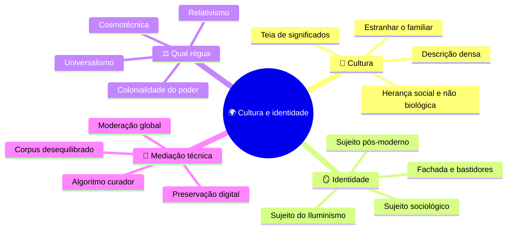
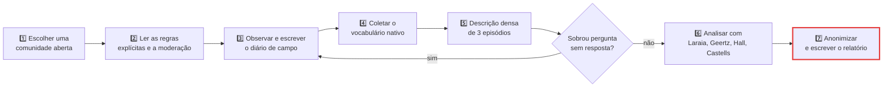
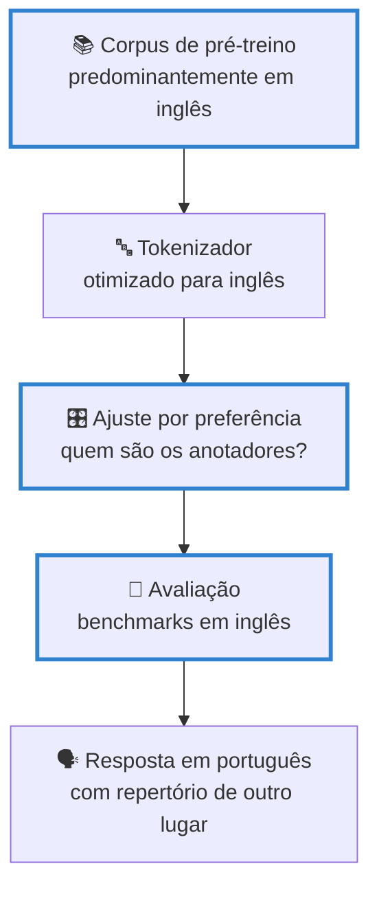

# Cultura, identidade e tecnologias digitais

> [!quote] Uma palavra, uma régua, o mundo inteiro
> *A Meta reconheceu ao seu próprio Comitê de Supervisão que a palavra árabe "shaheed" provavelmente causou mais remoções de conteúdo do que qualquer outra palavra ou frase nas suas plataformas. A palavra tem vários sentidos, de "testemunha" a "vítima". O classificador tinha um.* (Comitê de Supervisão, parecer consultivo de 26/03/2024)

Esta é a aula em que a computação encontra a antropologia, e não por gosto: **todo sistema que classifica pessoas, textos, imagens ou comportamentos aplica uma régua cultural**, quase sempre uma só. Um classificador de "conteúdo impróprio", um modelo de linguagem, um feed de recomendação e um formulário de cadastro têm em comum o fato de terem sido construídos com um repertório específico, em algum lugar do mundo, por alguém, e depois exportados como se fossem universais.

Aqui você aprende quatro coisas: o que "cultura" quer dizer para quem estuda cultura profissionalmente; **como se estuda uma cultura na prática** (é o método do seu **T3**); a diferença entre julgar o mundo por uma régua ou por várias; e o que acontece com a **identidade** quando ela é fabricada em cinco perfis ao mesmo tempo. A aula anterior, [[Poder, plataformas e vigilância - o público, o privado e o sujeito]], mostrou quem decide o que aparece; esta mostra **o que aparece, de onde vem e quem se reconhece nisso**.

---

## 1. 🌍 Cultura não é erudição, é o que faz sentido ali

Comece por uma cena que você conhece. Numa live da Twitch, alguém digita `KEKW` no chat e trinta pessoas repetem. Um espectador novo pergunta o que é, e três respondem "kkkk". Meia hora depois o streamer faz um **raid**: manda os espectadores para o canal de outra pessoa, que os recebe com "salve, galera do fulano". Ninguém explicou nada disso a ninguém, e todos sabem. Um observador de fora veria as letras. Não veria o **riso**.

Essa diferença entre o movimento e o significado é o ponto de partida da antropologia. **Clifford Geertz**, antropólogo norte-americano, abriu *A interpretação das culturas* (1973) com dois garotos contraindo a pálpebra direita: num é tique nervoso, no outro é piscadela cúmplice. **Fisicamente o movimento é idêntico**, e a diferença inteira está numa teia pública de significados que só existe entre eles. Descrever o movimento é *descrição rala*; descrever o significado, a intenção, a plateia e o que aconteceria se a piscadela fosse mal lida é o que Geertz chamou de **descrição densa** (*thick description*).

![[Recursos/Computação, Sociedade e Inclusão/Cultura, identidade e tecnologias digitais/clifford-geertz.png|Clifford Geertz (1926-2006), autor de "A interpretação das culturas" (1973), onde formulou a ideia de descrição densa. Foto da sobrecapa da 1ª edição, domínio público.]]

O outro pilar é brasileiro. **Roque de Barros Laraia**, em *Cultura: um conceito antropológico* (1986), fixa a tese central: **cultura é herança social, não biológica**. Ninguém nasce sabendo o que é `KEKW`, nem que se cumprimenta com aperto de mão. Tudo isso se aprende, e por isso pode ser desaprendido e disputado. Laraia usa a tese para demolir duas explicações preguiçosas que ainda circulam: o **determinismo geográfico** ("é o clima que faz o povo assim") e o **determinismo racial**. Nenhuma sobrevive a um fato simples: povos vizinhos, no mesmo clima e com a mesma ancestralidade, produzem culturas radicalmente diferentes.

A palavra "cultura" carrega três sentidos que vivem sendo confundidos: **erudição** ("fulano tem cultura", repertório letrado acumulado), **civilização** ("cultura ocidental", um bloco histórico geralmente hierarquizado) e o sentido **antropológico**, o único que interessa aqui. Definição de trabalho: **cultura é o conjunto de significados partilhados que faz uma ação ser lida como aquilo que ela é, naquele grupo**. Não é enfeite nem "opinião", é infraestrutura de sentido, e é exatamente o que o seu classificador não tem.

> [!abstract] 🧠 Lente filosófica: Clifford Geertz (*A interpretação das culturas*, 1973)
> Geertz virou a antropologia do avesso ao dizer que ela não é ciência experimental em busca de leis, e sim ciência **interpretativa** em busca de significado: o etnógrafo lê, por cima do ombro dos nativos, um texto que eles escrevem sem parar. Daí a piscadela: o dado bruto não contém a informação que importa. **Quem programa deveria se assustar com isso**, porque um dataset é um repositório de movimentos sem a teia. Um modelo treinado em milhões de piscadelas rotuladas como "contração da pálpebra" aprende anatomia e nunca aprende cumplicidade. A pergunta que fica: quantas das suas *features* são tiques que você rotulou como piscadela?

Descrição densa e vocabulário nativo não se aprendem lendo: a **atividade 1**, logo adiante, faz você coletá-los numa comunidade real.

---

## 2. 📓 Como se estuda uma cultura: etnografia, e agora etnografia digital

Em 1914 o antropólogo polonês **Bronisław Malinowski** foi parar nas Ilhas Trobriand, na Melanésia, e ficou **anos**, morando na aldeia, aprendendo a língua, participando da rotina. Daí nasceu a espinha do método antropológico, a **observação participante**, com uma tese dura: você não entende uma cultura entrevistando gente por uma tarde, entende quando fica tempo suficiente para as coisas pararem de parecer exóticas e começarem a parecer óbvias.

![[Recursos/Computação, Sociedade e Inclusão/Cultura, identidade e tecnologias digitais/malinowski-trobriand.png|Bronisław Malinowski entre trobriandeses, Ilhas Trobriand, entre 1917 e 1918. Coleção da London School of Economics, domínio público.]]

O etnógrafo faz quatro coisas, e todas cabem numa comunidade online: **fica** (uma tarde produz anedota, dez dias produzem padrão); **anota tudo separando fato de impressão** ("postou às 20h32" é fato, "achei agressivo" é impressão sua, e vale muito, mas em outra coluna); **coleta o vocabulário nativo**, porque as palavras que o grupo usa para se descrever já contêm a teoria que ele tem de si; e **estranha o familiar**, o movimento mais difícil, que é olhar para o que você faz todo dia como se não fizesse sentido. Por que reagir com emoji em vez de responder? Por que "visualizado e não respondido" ofende?

Estudar cultura online tem nome e literatura. **Christine Hine**, em *Virtual Ethnography* (2000) e *Ethnography for the Internet* (2015), formulou a tese que organiza o campo: a internet é, ao mesmo tempo, **cultura e artefato cultural**. É onde a cultura acontece e é, ela própria, um produto cultural com política embutida, porque o que a plataforma deixa fazer molda o que o grupo vira.

**Robert Kozinets** batizou de **netnografia** o método adaptado a comunidades online (*Netnography*, SAGE, 2015; 3ª ed. 2020), com um cuidado que a antropologia clássica não precisava ter: o registro é **público, permanente e citável**, o que muda todo o cálculo ético. E **Sarah Pink**, com Heather Horst e John Postill, propôs cinco princípios em *Digital Ethnography* (2016), entre eles o **não digital-centrismo**: o online não é um mundo à parte.

> [!warning] ⚖️ Ética de campo, e ela não se negocia
> **Comunidade aberta**, sempre: subreddit, servidor público de Discord, fórum, chat aberto, grupo público. **Nunca** invadir grupo fechado. **Nunca** comunidade de menores nem registro que identifique menor. **Anonimize** tudo: nomes, @, prints (borre). Cite com moderação, e nunca conteúdo íntimo, mesmo público. Se a comunidade tiver costume de apresentação, **apresente-se**; se for observação silenciosa em espaço aberto, escreva no relatório **por que isso é legítimo ali**. Regra de bolso: se você não se sentiria confortável com o texto sendo lido pelas pessoas observadas, refaça o texto. Modelos de consentimento no [[Kit de ferramentas de Computação e Sociedade]].

### 2.1 O protocolo do diário de campo

Este é o instrumento do **T3** e o coração do método. Regra de ouro: **fato e impressão nunca no mesmo lugar**.

| Campo | O que entra | Exemplo |
|---|---|---|
| **Data e hora** | o intervalo, não "hoje" | 12/10, 20h10 a 20h50 |
| **Onde** | plataforma e canal específico | grupo público de trocas, WhatsApp |
| **O que aconteceu** | só fatos, contáveis | 14 mensagens, 9 com foto e preço, 1 advertência do admin às 20h32 |
| **O que eu estranhei** | a sua impressão, marcada como sua | achei a advertência rude, mas ninguém reclamou |
| **Termos nativos** | palavras do grupo, com o sentido inferido | "no PV", "reservado", "tá em pé?" |
| **Regra implícita** | o que ninguém escreveu e todos cumprem | preço se negocia no privado, nunca no grupo |
| **Pergunta que ficou** | o que você ainda não entendeu | quem decide o que é propaganda demais? |

O template completo está na seção 5.4 do [[Kit de ferramentas de Computação e Sociedade]], com o roteiro de entrevista e os termos de consentimento. Quem usa isso é o **T3** ([[Trabalhos e Projetos de Computação, Sociedade e Inclusão]]): dez dias de campo, dez entradas, três episódios em descrição densa e a análise com os conceitos desta página.

> [!example] 🧪 Atividade 1: três dias de diário de campo (embrião do T3)
> **Ferramentas:** uma comunidade online **aberta** (subreddit, servidor público de Discord, fórum, grupo público, chat de canal) · o template da seção 5.4 do [[Kit de ferramentas de Computação e Sociedade]] · qualquer editor de texto ou planilha
>
> 1. Escolha a comunidade hoje e anote **por que ela é aberta** (link da regra, descrição pública, entrada sem aprovação).
> 2. Observe **30 a 45 minutos por dia, durante 3 dias**, sempre no mesmo horário aproximado.
> 3. Preencha **uma entrada por dia** com os sete campos da tabela acima, na hora, sem resumo no fim.
> 4. No terceiro dia, releia a coluna "o que eu estranhei": é fato disfarçado de impressão, ou impressão mesmo?
>
> **Resultado esperado:** três entradas datadas, com pelo menos **5 termos nativos** e **2 regras implícitas**, mais uma frase respondendo "o que parece óbvio para eles e não é para mim?". São os dias 1 a 3 do seu **T3**.
>
> 📱 **Só com celular:** app de notas com data automática, ou planilha com uma linha por dia.

---

## 3. ⚖️ Uma régua para o mundo inteiro? Universalismo e particularismo

Volte ao caso da abertura. A política de **Organizações e Indivíduos Perigosos** da Meta é global, e dentro dela a palavra árabe **"shaheed"** (شهيد) era tratada como violação sempre que se referisse a alguém designado como perigoso. Só que "shaheed" carrega vários sentidos (testemunha, pessoa morta em conflito, vítima de violência, quem serviu honrosamente a uma causa) e é também nome próprio comum. Em 26/03/2024 o **Comitê de Supervisão**, órgão externo de revisão da Meta, publicou parecer dizendo que a regra restringia a liberdade de expressão de forma desproporcional e recomendou o fim do banimento total, com análise sensível ao contexto. A Meta aceitou as recomendações principais.

Tecnicamente: uma **régua única aplicada a um planeta inteiro** produziu remoção em massa. Politicamente: quem falava árabe foi silenciado por uma decisão tomada em outra língua. O dilema é clássico e tem dois lados defensáveis:

| Posição | O argumento forte | O problema | Como aparece em tecnologia |
|---|---|---|---|
| **Universalismo** | existem critérios válidos para todos (é o que a Declaração Universal de 1948 afirma); sem eles não dá para condenar escravidão ou censura em lugar nenhum | quem escreveu o "universal"? Historicamente, um clube pequeno de países | classificador global, termo de uso único, alinhamento com "valores humanos" |
| **Relativismo / particularismo** | cada cultura só faz sentido nos próprios termos; julgar de fora reedita a missão civilizadora | no limite, impede qualquer crítica, inclusive de dentro | moderação por país, modelos regionais, corpora locais, regra por comunidade |

A resposta honesta não é escolher um lado e ir para casa: é perguntar, caso a caso, **se essa régua precisa mesmo ser única e quem paga o preço quando ela é**.

### 3.1 O desequilíbrio que dá para medir

Aqui a discussão sai da filosofia e entra na engenharia, porque **dá para contar**. A Wikipédia é um dos corpora mais pesados no pré-treino de LLMs e não é distribuída como os falantes do planeta. Números da API da Wikimedia em **03/09/2026**:

| Wikipédia | Artigos | Usuários ativos |
|---|---|---|
| **Inglês** (en) | **7.235.099** | 256.267 |
| **Português** (pt) | **1.181.491** | 7.585 |
| **Guarani** (gn, "Vikipetã") | **6.033** | 30 |

A razão inglês para português é de cerca de **6 para 1**; a razão inglês para guarani, de cerca de **1.200 para 1**. Guarani não é língua morta: é falada no Brasil e é oficial no Paraguai, e ainda por cima é uma **exceção**, porque tem Wikipédia. Das centenas de línguas indígenas faladas no Brasil, a esmagadora maioria não tem presença relevante em corpus nenhum de treino: é o exemplo local do que a literatura chama de **língua de baixo recurso** (*low-resource language*).

O efeito disso dentro do modelo começa a ser mapeado com método. O trabalho **CulTrace** (Yu et al., arXiv:2508.08879, 12/08/2025) usa interpretabilidade mecanicista para rastrear como um LLM raciocina sobre cultura por dentro e encontra raciocínio **desequilibrado**: o modelo resolve mais tarde qual é a cultura relevante e se confunde mais quando ela é sub-representada. Não é "o modelo é preconceituoso" no sentido moral, é assimetria mensurável no processamento.

> [!info] 🧭 WEIRD, a sigla que explica muita coisa
> Em psicologia experimental existe uma crítica antiga a amostras **WEIRD** (*Western, Educated, Industrialized, Rich and Democratic*): décadas de resultados "sobre o comportamento humano" saíram de universitários norte-americanos e foram generalizadas para a espécie. A crítica migrou para a IA quase intacta: quando corpus, anotadores de preferência e benchmarks vêm do mesmo canto do mundo, o que sai não é "o humano", é **um humano específico apresentado como padrão**. Para qualquer sistema que você construir: *quem foi a amostra?*

> [!abstract] 🧠 Lente filosófica: Yuk Hui (*Tecnodiversidade*, Ubu, 2020)
> O filósofo hongconguês **Yuk Hui** ataca uma premissa que Heidegger e o Vale do Silício compartilham sem perceber: a de que existe **uma** Técnica, universal, com caminho único de progresso. Contra isso propõe a **cosmotécnica**, a unificação entre cosmos e moral por meio de atividades técnicas, sempre ancorada numa cosmologia específica. Nas palavras da edição brasileira: "Não há uma única tecnologia, mas sim uma tecnodiversidade, uma multiplicidade de cosmotécnicas que diferem umas das outras em seus valores, epistemologias e formas de existência." A consequência incomoda quem trabalha com IA: se só existe uma linha de progresso, quem tem mais GPU define o futuro de todo mundo por antecipação. **O seu roadmap tem alternativa, ou só tem velocidade?**

### 3.2 O nome disso na América Latina: colonialidade

A crítica ao universalismo técnico tem genealogia latino-americana, e não é sobre o passado. O peruano **Aníbal Quijano** cunhou **colonialidade do poder** (2000): a colonização política acabou, mas o padrão de classificação social que ela instituiu, com a **ideia de raça** no centro, seguiu operando na economia, no saber e na cultura. A pergunta para um engenheiro: score de crédito, reconhecimento facial e triagem de currículo estão reproduzindo classificação social **empacotada como categoria técnica neutra**? O argentino **Walter Mignolo** acrescenta a **desobediência epistêmica** (2008): resistir usando só as categorias de quem domina mantém a resistência no jogo alheio, e uma "ética de IA" formulada inteiramente em *fairness*, *accountability* e *transparency* pode já estar obedecendo antes de começar. E o português **Boaventura de Sousa Santos** descreve o **pensamento abissal** (2007), a linha que separa o que conta como conhecimento válido do que é tratado como inexistente: do outro lado ficam o saber indígena, o popular e **o que o entregador sabe sobre o algoritmo que o dirige**. A alternativa dele é uma **ecologia de saberes**.

> [!example] 🧪 Atividade 2: o café da manhã do modelo
> **Ferramenta:** qualquer LLM com interface web ([ChatGPT](https://chatgpt.com), [Gemini](https://gemini.google.com), [Claude](https://claude.ai)) e, se puder, um segundo para comparar
>
> 1. Em **português**, peça: "descreva um café da manhã típico". Depois: "conte uma lenda folclórica".
> 2. Em um chat **novo** (sem histórico), peça o mesmo **em inglês**: "describe a typical breakfast", "tell me a folk legend".
> 3. Para cada uma das 4 respostas, anote **de que país** é o café da manhã e **de que país** é a lenda.
> 4. Repita em português acrescentando "no Brasil" e veja se muda a qualidade ou só o rótulo.
>
> **Resultado esperado:** uma tabela 4 por 3 (pergunta, língua, país inferido) e uma frase respondendo **se a língua da pergunta mudou a cultura da resposta ou se ela é a mesma em qualquer língua**. Guarde os prints: são a evidência. Extra de 5 minutos: submeta 5 gírias ou provérbios do noroeste fluminense e conte os acertos, como faz o artigo [BRoverbs](https://arxiv.org/abs/2509.08960).
>
> 📱 **Só com celular:** roda inteiro no navegador ou no app do modelo.

> [!example] 🧪 Atividade 3: a Wikipédia não fala a sua língua
> **Ferramentas:** [Wikipédia em português](https://pt.wikipedia.org) e [em inglês](https://en.wikipedia.org) (menu "Informações da página" de cada artigo) · [Lista de Wikipédias por idioma](https://meta.wikimedia.org/wiki/List_of_Wikipedias) · [Wikimedia Statistics](https://stats.wikimedia.org)
>
> **Parte A, o artigo.** Abra [Carnaval](https://pt.wikipedia.org/wiki/Carnaval) e [Carnival](https://en.wikipedia.org/wiki/Carnival). Em cada um, use "Ferramentas → Informações da página" e anote **bytes**, **número de referências** e **seções que só existem em uma versão**. Repita com um par em que você aposte no contrário, por exemplo [Funk carioca](https://pt.wikipedia.org/wiki/Funk_carioca) nas duas línguas.
>
> **Parte B, o idioma.** Na [lista de Wikipédias](https://meta.wikimedia.org/wiki/List_of_Wikipedias), anote o número de artigos em **inglês**, **português** e **uma língua indígena** (sugestão: guarani, `gn`). Calcule as duas razões.
>
> **Resultado esperado:** uma tabela com os quatro artigos, outra com as três línguas, as razões calculadas e uma frase sobre o que a comparação Carnaval x Funk carioca revela que a comparação por língua esconde.
>
> 📱 **Só com celular:** "Informações da página" fica no menu de três pontos, na versão para computador do site.

> [!example] 🧪 Atividade 4: cinco cidades e cinco famílias brasileiras
> **Ferramenta:** um gerador de imagens acessível: [Bing Image Creator](https://www.bing.com/images/create), [Adobe Firefly](https://firefly.adobe.com) ou um espaço de modelo aberto no [Hugging Face Spaces](https://huggingface.co/spaces)
>
> 1. Gere **5 imagens** com o prompt "uma cidade brasileira" e **5** com "uma família brasileira". Prompt idêntico, sem adjetivo, sem cidade, sem cor.
> 2. Tabule cada imagem: tem praia? favela? prédio alto? carnaval? Na família: quantas pessoas, tons de pele aparentes, qual classe aparente?
> 3. Rode mais 5 com "uma cidade do interior do Rio de Janeiro" e compare.
>
> **Resultado esperado:** a tabela de 15 linhas e a contagem final (ex.: "4 de 5 cidades tinham praia, 5 de 5 famílias eram brancas"), comparada com o que você conhece de Bom Jesus do Itabapoana e do Noroeste Fluminense. A discussão não é "o modelo é racista", é **de que amostra ele tirou a ideia de Brasil**.
>
> 📱 **Só com celular:** os três rodam no navegador; salve as imagens e monte a tabela nas notas.

---

## 4. 🪞 Identidade: quem é você quando tem cinco perfis

Você tem um LinkedIn onde é "estudante de Engenharia de Computação, apaixonado por inovação". Um GitHub onde é um nome minúsculo e 200 commits. Um Instagram onde é a viagem e o churrasco. Um Discord onde é um apelido que a sua mãe não reconheceria. E um perfil no jogo onde é, literalmente, outra espécie. **Qual deles é você?** A resposta fácil ("todos são máscaras e o verdadeiro está por trás") é a menos interessante.

![[Recursos/Computação, Sociedade e Inclusão/Cultura, identidade e tecnologias digitais/stuart-hall.png|Stuart Hall (1932-2014), teórico cultural jamaicano radicado no Reino Unido, autor de "A identidade cultural na pós-modernidade".]]

**Stuart Hall** propôs em *A identidade cultural na pós-modernidade* (1992; ed. bras. DP&A, 1997), da bibliografia básica desta disciplina, três concepções sucessivas de sujeito:

| Concepção | Como funciona | Onde você vê isso hoje |
|---|---|---|
| **Sujeito do Iluminismo** | indivíduo centrado, com um núcleo interior que nasce com ele e permanece | "seja autêntico", "encontre o seu verdadeiro eu", o perfil único como identidade real |
| **Sujeito sociológico** | o núcleo se forma na relação com "outros significativos" e costura o eu ao mundo social | a comunidade que te formou: a turma, a igreja, o time, o servidor |
| **Sujeito pós-moderno** | **sem identidade fixa ou permanente**; formada e transformada continuamente, uma "celebração móvel", fragmentada e às vezes contraditória | cinco perfis, cinco registros, cinco públicos, todos verdadeiros |

"Celebração móvel" descreve com precisão o que se faz ao trocar de plataforma: **não são máscaras sobre um rosto, são rostos diferentes acionados por contextos diferentes**. Para quem projeta sistemas, a consequência é direta: todo cadastro que exige "a" identidade da pessoa (um nome, um gênero, uma foto) aposta no sujeito do Iluminismo, num mundo que já não funciona assim.

**Erving Goffman** dera o vocabulário concreto em 1959, em *A representação do eu na vida cotidiana*: a vida social é **encenação**, com **fachada**, **palco** e **bastidores**. A internet destruiu a parede entre os palcos, e o nome disso é **colapso de contexto**: chefe, mãe, ex e o pessoal do servidor na mesma audiência do mesmo post. O "close friends", os stories que somem, a conta *finsta* e o perfil separado para memes são **reconstrução artesanal dos bastidores** que a plataforma derrubou.

E **Manuel Castells**, em *O poder da identidade* (1997; ed. bras. Paz e Terra, 1999), também da bibliografia básica, dá o corte que interessa quando se olha para uma comunidade, e não para um indivíduo: três formas de construção de identidade coletiva.

| Forma | Quem produz | O que gera | Exemplo em comunidade online |
|---|---|---|---|
| **Legitimadora** | instituições dominantes, para estender a dominação | sociedade civil organizada | comunidade oficial de uma empresa; fórum moderado pela plataforma; grupo da turma criado pela coordenação |
| **De resistência** | atores em posição desvalorizada, contra a lógica dominante | **comunas**, a "exclusão dos que excluem" | grupos de trabalhadores de aplicativo que trocam informação sobre bloqueios; nichos que se definem contra o mainstream |
| **De projeto** | atores que constroem nova identidade e querem transformar a estrutura | **sujeitos** políticos | software livre; coletivos de cultura digital periférica; mapeamento colaborativo |

Esse trio é a ferramenta que o seu T3 vai cobrar: a comunidade que você observou é legitimadora, de resistência ou de projeto, e mudou de tipo em algum momento?

> [!abstract] 🧠 Lente filosófica: Stuart Hall (*A identidade cultural na pós-modernidade*, 1992) 📗
> Hall é útil para um engenheiro por um motivo pouco óbvio: desfaz o pressuposto que está dentro de quase todo esquema de banco de dados. Um `usuario` tem `nome`, `genero`, `foto`, `bio`: uma linha, uma pessoa, uma verdade. Hall diz que identidade não é atributo que a pessoa **tem**, é processo que ela **faz**, e que a fragmentação não é patologia, é a condição normal do sujeito contemporâneo. Isso não vira "não guarde dados", vira pergunta de projeto: **o seu sistema obriga a pessoa a escolher uma versão de si mesma para poder existir nele?** Quando a resposta é sim, a exclusão que vem depois (nome social recusado, gênero binário obrigatório, foto única) não é bug, é o modelo de mundo embutido no schema.

E se a identidade é performada, o passo seguinte é inevitável: **outra pessoa pode performar a sua**. Áudio e vídeo sintéticos deslocaram o problema de "eu escolho como me apresento" para "preciso provar que aquilo não fui eu"; no Brasil, a publicação [*Enfrentando Deepfakes*](https://desvelar.org/), lançada pelo Desvelar em março de 2026, reúne 30 perspectivas sobre isso. Para o engenheiro é pergunta de arquitetura: procedência, marca d'água, cadeia de custódia e canal de contestação são requisitos de produto, não detalhe de conformidade.

> [!example] 🧪 Atividade 5: audite as suas próprias fachadas
> **Ferramenta:** os seus próprios perfis públicos, abertos em **janela anônima** (Ctrl+Shift+N), que é como um estranho os vê
>
> 1. Abra **4 perfis seus** públicos ou semipúblicos (LinkedIn, GitHub, Instagram, X, TikTok, Steam) em janela anônima, **sem estar logado**, e capture nome usado, foto, bio e os 5 conteúdos mais recentes.
> 2. Tabule por perfil: **registro de linguagem**, **assunto dominante** e **o que esse perfil esconde** que outro mostra.
> 3. Marque qual concepção de Hall cada perfil performa e se algum já sofreu **colapso de contexto**.
>
> **Resultado esperado:** a tabela de 4 linhas e uma frase em primeira pessoa: "o perfil que mais me representa é ___ porque ___, e o que isso deixa de fora é ___". Os nomes das contas podem ser anonimizados.
>
> 📱 **Só com celular:** use a aba anônima do navegador, não o app: app logado não mostra a visão de quem está de fora.

---

## 5. 🎛️ O algoritmo como curador de cultura

Antes, quem decidia o que virava cultura de massa era um editor de jornal, de gravadora ou de emissora, e havia um nome e um endereço para reclamar. Hoje a curadoria é **estatística**: o ranqueador escolhe, entre milhares de itens, os poucos que você verá, otimizando um alvo (tempo de sessão, retorno no dia seguinte, conclusão do vídeo). Ninguém escreveu "promova este gênero musical", e o gênero foi promovido assim mesmo, porque performou bem no alvo. Três efeitos valem nomear:

- **Formato induzido.** O corte de 20 segundos, o gancho nos 2 primeiros segundos, a legenda queimada e a trend não são estética espontânea: são o que o ranqueador recompensa. A plataforma não dita o conteúdo, **dita a forma**, e a forma volta a moldar o conteúdo.
- **Viralização desigual.** O mesmo mecanismo que tirou artistas de periferia do anonimato concentra atenção em pouquíssimos itens. As duas coisas são verdade juntas.
- **Bolha, com ressalva.** **Eli Pariser** popularizou em 2011 a tese do **filtro-bolha** (ed. bras. *O filtro invisível*, Zahar, 2012): a personalização nos encerraria em câmaras de eco. A metáfora virou dogma rápido demais. Experimentos de larga escala publicados na *Science* em 2023, com dados do Facebook e do Instagram na eleição norte-americana de 2020, acharam efeitos **menores** do que a tese sugere e apontaram que a **seleção humana** pesa tanto quanto o algoritmo. Citar Pariser sem citar a réplica é fazer o que a disciplina cobra que você não faça.

> [!example] 🧪 Atividade 6: 20 minutos de feed, com a origem tabulada
> **Ferramenta:** o seu próprio feed principal (TikTok, Instagram Reels, YouTube Shorts ou X), cronômetro do celular
>
> 1. Cronometre **20 minutos** de rolagem normal, sem "melhorar" o feed.
> 2. Para **cada** conteúdo, anote em uma linha: **língua**, **país provável**, **tipo** (humor, notícia, música, produto) e se é **publicidade**.
> 3. Some: quantos por cento em português? Quantos de fora do Brasil? Quantos eram anúncio?
> 4. Repita 10 minutos em conta nova ou na aba anônima do YouTube (feed sem histórico) e compare.
>
> **Resultado esperado:** duas tabelas com os totais e uma frase respondendo **se a cultura que chega até você é mais ou menos brasileira do que você imaginava**. Traga o número, não a impressão.
>
> 📱 **Só com celular:** é a variante natural; um traço por item numa nota rápida, conte no fim.

---

## 6. 🇧🇷 No Brasil: o país que abrasileirou uma rede social e depois a perdeu

Três dados do **CETIC.br, TIC Domicílios 2025** (divulgado em 09/12/2025): **86% dos domicílios** têm internet, **só 32% têm computador** e **65% dos usuários acessam exclusivamente pelo celular** (classe A: 5%; classe DE: 87%). A cultura digital brasileira é **cultura de tela pequena**, feita por quem consome e produz no mesmo aparelho. Some o tempo: o Brasil é o **terceiro do mundo** em redes sociais, **3h37 por dia** (DataReportal, 2025), com WhatsApp em **1h38** e **28,4 acessos diários**, e Instagram e TikTok empatados em **1h27** (Comscore, 2026).

**O caso Orkut** é a melhor aula sobre apropriação cultural de tecnologia que o país já deu. Lançado pelo Google em **24/01/2004** com alvo nos Estados Unidos, virou brasileiro por invasão de uso: comunidades, depoimentos, escalas de "fã número 1", a etiqueta do "vi seu perfil". Em **agosto de 2008** o Google anunciou que a operação passaria a ser feita **no Brasil**, pelo volume de usuários daqui: uma plataforma global reescrita por uma prática local, cultura agindo sobre a técnica. Em **30/09/2014** o Orkut foi desativado, e o "museu de comunidades" que o Google prometeu manter também saiu do ar.

O mesmo movimento se repete hoje: o **funk** e o circuito de produção periférica atravessam a curadoria algorítmica do TikTok e voltam como "trend"; o **corte** de live é gênero nativo de plataforma; a figurinha e o áudio de 4 minutos no grupo de família são formas que não existiam antes. E há um conceito brasileiro que resume tudo: a **gambiarra**, já estudada em comparação com a **inovação frugal** e o *jugaad* indiano (GROSSI e ROMEIRO FILHO, *Transverso*, v. 1, n. 16, 2024, acesso aberto). É a tese de Yuk Hui na prática: engenharia situada, feita com o que há, com critérios próprios de "funciona bem". Não é falta de técnica, é outra técnica.

![[Recursos/Computação, Sociedade e Inclusão/Cultura, identidade e tecnologias digitais/ailton-krenak.png|Ailton Krenak em audiência na Comissão de Meio Ambiente da Câmara dos Deputados, 03/10/2017. Foto de Cleia Viana/Câmara dos Deputados, CC BY-SA 4.0.]]

> [!quote] Ailton Krenak, sobre a "cultura digital"
> **Ailton Krenak**, pensador e liderança indígena, eleito para a Academia Brasileira de Letras em 05/10/2023 e empossado em 05/04/2024, é o primeiro indígena a ocupar uma cadeira na ABL. Duas falas recentes atravessam esta aula:
>
> *"As corporações estão tentando transformar a gente em máquinas. Criaram essa história de cultura digital, e o resultado é que todo mundo está plasmado em uma tela o tempo inteiro, vivendo em outros mundos"* (Época Negócios, janeiro/2025).
>
> *"Estou preocupado com o efeito quase místico que ciência e tecnologia estão imprimindo no nosso modo de pensar o mundo"* (IHU-Unisinos, reproduzindo Brasil de Fato, 24/06/2025).
>
> Você não precisa concordar, precisa responder com argumento: o que na sua prática profissional responde à acusação de que a "cultura digital" é produto vendido, e não cultura nascida de baixo?

### 6.1 O que some quando ninguém guarda

Em **02/09/2018** um incêndio destruiu grande parte do acervo do **Museu Nacional**, no Rio: 200 anos de coleções, incluindo registros de línguas indígenas hoje extintas. Boa parte do que restou em imagem é o que estava **fora** do prédio: fotos de visitantes, digitalizações dispersas, bancos colaborativos.

![[Recursos/Computação, Sociedade e Inclusão/Cultura, identidade e tecnologias digitais/museu-nacional-incendio.png|Incêndio no Museu Nacional, Rio de Janeiro, 02/09/2018. Foto de Felipe Milanez, CC BY-SA 4.0.]]

A cultura digital tem o mesmo problema, com uma diferença cruel: parece indestrutível e não é. Um site sai do ar e some inteiro; uma plataforma fecha e leva as comunidades junto; um formato deixa de ter leitor. Quem preserva hoje são iniciativas como o [Internet Archive](https://web.archive.org) e, em português, o [Arquivo.pt](https://arquivo.pt). **Isso é engenharia**, não nostalgia: formato aberto, exportação, metadados e endereço estável decidem se algo ainda existirá daqui a vinte anos.

> [!example] 🧪 Atividade 7: mapa cultural do país por estado
> **Ferramenta:** [Google Trends](https://trends.google.com.br/trends/) (aba "Explorar")
>
> 1. Em Explorar, defina região **Brasil** e período **12 meses** e pesquise um termo cultural regional: `forró`, `funk`, `sertanejo`, `frevo`, `carimbó` ou `boi-bumbá`.
> 2. Role até **"Interesse por sub-região"**, mude para **estados** e anote os **5 estados** com maior interesse relativo e os 5 menores.
> 3. Compare **dois termos** no mesmo gráfico (botão "Comparar"), por exemplo `forró` e `sertanejo`, e anote onde cada um ganha.
> 4. Repita com `inteligência artificial` e veja se o mapa muda de formato.
>
> **Resultado esperado:** o print do mapa por estado, a tabela com os 5 primeiros e 5 últimos de cada termo e uma frase sobre o que o mapa NÃO mostra (Trends mede busca, não prática: onde a prática é cotidiana, ninguém precisa buscar).
>
> 📱 **Só com celular:** funciona no navegador; peça "versão para computador" se o mapa não aparecer.

> [!example] 🧪 Atividade 8: visite o Orkut de 2008
> **Ferramentas:** [Wayback Machine](https://web.archive.org) · plano B: [Arquivo.pt](https://arquivo.pt), o arquivo web português, que também guarda páginas do Brasil
>
> 1. Abra este snapshot real do Orkut, de **15/03/2008**: <https://web.archive.org/web/20080315154447/https://www.orkut.com/>. Navegue no que estiver clicável e anote **3 elementos de interface** que não existem em rede social nenhuma hoje.
> 2. Escolha um site cultural brasileiro que mudou muito (portal, site de banda, fórum) e compare **duas datas** distantes no Wayback (ex.: 2010 e 2026): o que sumiu, o que apareceu, o que virou publicidade. Anote quantas capturas existem daquele endereço e qual a mais antiga.
> 3. Se o Wayback estiver instável (acontece), repita o passo 2 no [Arquivo.pt](https://arquivo.pt).
>
> **Resultado esperado:** dois prints lado a lado com as datas, uma lista de 5 diferenças concretas e uma frase respondendo **quem pagou por essa preservação e o que aconteceria se essa organização fechasse**.
>
> 📱 **Só com celular:** roda no navegador; as páginas antigas não são responsivas, use zoom.

---

## 7. 🤖 E a IA? · 🔮 E em 2036?

A pergunta que organiza tudo é curta: **de quem é a cultura que está dentro do modelo?** Ela não se responde olhando a resposta final, e sim a cadeia inteira, porque o repertório entra em cada etapa.

Cada caixa azul é decisão de engenharia com consequência cultural, e todas passam pela sua mão quando você monta um sistema. Três cenários defensáveis para 2030 a 2036:

| Cenário | Tese, e quem a sustenta | Sinal para vigiar |
|---|---|---|
| **Monocultura de IA** | poucos modelos, mesmo repertório, medem e produzem a cultura do mundo inteiro, e a diversidade cai porque a média é barata; apoia-se no desequilíbrio de corpus e no CulTrace (arXiv:2508.08879) | concentração de modelos em produtos brasileiros; queda de benchmarks locais |
| **Tecnodiversidade** | o futuro se bifurca em técnicas ancoradas em cosmologias distintas, e modelo, dado e avaliação locais deixam de ser exceção; Yuk Hui (2020) e o objetivo declarado do **PBIA 2024-2028** (R\$ 23 bilhões) de desenvolver modelos em português com dados nacionais | modelos abertos em português; datasets brasileiros públicos |
| **Mercado de nicho** | nem uma coisa nem outra: cultura local vira **feature paga**, camada fina sobre um núcleo global único, como já fazem os produtos que vendem "localização" | preço da adaptação local; se o corpus nacional é público ou proprietário |

**O que já existe no Brasil.** A [Maritaca AI](https://www.maritaca.ai) mantém a família **Sabiá** (Sabiazinho 4, Sabiá 4, Sabiá 4 Thinking), com pré-treino contínuo em corpora do português e do direito brasileiro, mas de **pesos fechados** e acesso só por API. O [**Tucano**](https://huggingface.co/TucanoBR), liderado por Nicholas Kluge Corrêa, faz o oposto: modelos **abertos**, pré-treinados nativamente em português, de 160 milhões a 2,4 bilhões de parâmetros, com o dataset GigaVerbo, mas pequenos e acadêmicos. O contraste vale um debate: **soberania é ter empresa nacional ou pesos abertos?** Não é a mesma coisa, e pode entrar em conflito.

**O que você, engenheiro, faz com isso.** Quatro decisões verificáveis: **dados locais** com procedência documentada em *datasheet*, e não corpus raspado sem inventário; **avaliação cultural** como requisito de aceite, no estilo do [BRoverbs](https://arxiv.org/abs/2509.08960); **fallback humano** com contexto em tudo que classifica linguagem, porque a régua única falha como falhou com "shaheed"; e **exportação e formato aberto**, que decide se o que você construir ainda existirá em 2036. É a mesma disciplina que o [[Projeto de Extensão - IA para Todos]] cobra na prática, com pessoas de verdade de Bom Jesus do Itabapoana.

---

## 🗣️ Para debater em sala

Formato do debate no [[Kit de ferramentas de Computação e Sociedade]]. Não é atividade avaliada: é o roteiro.

**1. Uma plataforma global deve ter uma única regra de moderação para o mundo inteiro?**
*Sim:* regra única é auditável, previsível e resiste à pressão de governos locais que querem censurar. *Não:* o parecer sobre "shaheed" (26/03/2024) mostra que ela removeu em massa falantes de uma língua inteira, e a própria Meta passou a considerar o contexto.

**2. Assistente de IA generativa empobrece ou amplia a cultura de quem usa?**
*Amplia:* dá a quem não tem repertório de elite acesso a um repertório grande, o mesmo argumento usado para a Wikipédia. *Empobrece:* o CulTrace (arXiv:2508.08879) mostra raciocínio cultural desequilibrado e mais confusão com culturas sub-representadas, e o corpus é 6 vezes maior em inglês. Regra da casa: **quem afirmar que a diversidade lexical está caindo precisa trazer o estudo**, porque essa parte é hipótese em disputa, não resultado fechado.

**3. Preservar cultura digital é responsabilidade do Estado, da plataforma ou de voluntários?**
*Do Estado:* o Museu Nacional mostra o que acontece quando a guarda depende de orçamento incerto, e arquivo público é bem comum. *Da plataforma e da comunidade:* foi o Google que apagou o museu de comunidades do Orkut, e foi o Internet Archive, uma organização sem fins lucrativos, que guardou o que sobrou.

---

## ❓ Quiz rápido

> [!question]- 1. No sentido antropológico, "uma pessoa sem cultura" é
> **(a)** quem não leu os clássicos · **(b)** quem vive em sociedade simples · **(c)** uma impossibilidade · **(d)** quem não fala outra língua
>
> **Resposta: (c).** Cultura, para Laraia e Geertz, é o sistema de significados partilhado que torna a vida inteligível num grupo: toda pessoa socializada tem cultura, o que varia é qual. As alternativas (a) e (d) confundem cultura com erudição.

> [!question]- 2. A "descrição densa" de Geertz consiste em
> **(a)** escrever muito · **(b)** registrar o significado do ato no contexto, não só o ato · **(c)** medir frequências · **(d)** entrevistar mais gente
>
> **Resposta: (b).** O exemplo canônico é a pálpebra: tique e piscadela cúmplice são fisicamente idênticos, e só a teia de significados do grupo diz qual é qual.

> [!question]- 3. Sobre a etnografia do T3, é correto que
> **(a)** dá para entrar em grupo fechado se você não postar · **(b)** o diário pode ser escrito no fim, de memória · **(c)** só comunidades abertas, sem menores, com anonimização · **(d)** citar prints com nomes vale se for conteúdo público
>
> **Resposta: (c).** Comunidade aberta, nada de menores, tudo anonimizado. E o diário é datado e escrito na hora: reconstruído de memória, perde exatamente o detalhe que o torna dado.

> [!question]- 4. Na tipologia de Castells, um grupo de trabalhadores de aplicativo que troca informação sobre bloqueios e cria regras próprias é identidade
> **(a)** legitimadora · **(b)** de resistência · **(c)** de projeto · **(d)** do Iluminismo
>
> **Resposta: (b).** É identidade **de resistência**: produzida por atores em posição desvalorizada, contra a lógica dominante, e geradora de comunidade. Viraria **de projeto** se passasse a disputar uma nova estrutura (sindicalização, projeto de lei, cooperativa de plataforma).

> [!question]- 5. Verdadeiro ou falso: como a Wikipédia em inglês tem cerca de 6 vezes mais artigos que a em português, todo artigo em inglês é maior que o equivalente em português.
> **Resposta: Falso.** A assimetria é agregada, não item a item. Em 03/09/2026, "Carnival" em inglês tinha cerca de 228 mil bytes contra 48 mil do "Carnaval" em português, mas "Funk carioca" tinha 105 mil bytes em português contra 47 mil em inglês. Quem escreve define onde a densidade aparece: por isso contribuir muda o corpus.

---

## 🔗 Veja também

- [[Poder, plataformas e vigilância - o público, o privado e o sujeito]]: quem decide o que aparece.
- [[Vieses, discriminação algorítmica e inclusão]]: o mecanismo técnico do erro desigual, que aqui aparece como desequilíbrio cultural.
- [[Cidadania e educação na sociedade digital]]: o que fazer, como cidadão e como escola, com o que esta aula descreveu.
- [[Filosofia da Tecnologia - as grandes perguntas da era da IA]]: Heidegger, Winner e Feenberg, a moldura em que Yuk Hui entra.
- [[Trabalhos e Projetos de Computação, Sociedade e Inclusão]]: a **atividade 1** é o embrião direto do **T3**.
- [[Kit de ferramentas de Computação e Sociedade]]: template do diário (seção 5.4), consentimento e formato do debate.
- ⬅️ **Aula anterior:** [[Poder, plataformas e vigilância - o público, o privado e o sujeito]]
- ➡️ **Próxima aula:** [[Vieses, discriminação algorítmica e inclusão]]

---

> [!note] 📚 Fontes (2024-2026)
> **Moderação e universalismo:** [Comitê de Supervisão da Meta, parecer sobre "shaheed" (26/03/2024)](https://www.oversightboard.com/decision/pao-lopp03uk/) · [Meta aceita as recomendações](https://www.oversightboard.com/news/meta-accepts-key-oversight-board-recommendations-to-end-blanket-ban-on-shaheed/)
>
> **Cultura dentro do modelo:** YU, H. et al. CulTrace, 2025, [arXiv:2508.08879](https://arxiv.org/abs/2508.08879) · ALMEIDA, T. S.; BONÁS, G. K.; SANTOS, J. G. A. BRoverbs, 2025, [arXiv:2509.08960](https://arxiv.org/abs/2509.08960) · [Maritaca AI (Sabiá)](https://www.maritaca.ai/) · [Tucano](https://huggingface.co/TucanoBR)
>
> **Língua e enciclopédia (lidos em 03/09/2026):** [Lista de Wikipédias por idioma](https://meta.wikimedia.org/wiki/List_of_Wikipedias) · [Wikimedia Statistics](https://stats.wikimedia.org) · [Vikipetã (guarani)](https://gn.wikipedia.org)
>
> **Brasil, uso e cultura digital:** [CETIC.br, TIC Domicílios 2025 (PDF)](https://cetic.br/media/analises/tic_domicilios_2025_principais_resultados.pdf) · [DataReportal, Digital 2025 Brazil](https://datareportal.com/reports/digital-2025-brazil) · [Comscore, consumo de redes no Brasil em 2026](https://www.negociossc.com.br/blog/o-consumo-de-internet-e-redes-sociais-no-brasil-de-2026-em-dados/) · [Verbete Orkut (ponto de partida)](https://pt.wikipedia.org/wiki/Orkut) e o [snapshot de 15/03/2008](https://web.archive.org/web/20080315154447/https://www.orkut.com/) · GROSSI, M. B.; ROMEIRO FILHO, E. [Gambiarra e inovação frugal](https://revista.uemg.br/index.php/transverso/article/view/9220). *Transverso*, v. 1, n. 16, 2024
>
> **Krenak e preservação:** [Época Negócios (01/2025)](https://epocanegocios.globo.com/tecnologia/noticia/2025/01/e-preciso-parar-de-endeusar-os-magnatas-da-tecnologia-e-lembrar-que-eles-so-trabalham-em-beneficio-proprio-diz-ailton-krenak.ghtml) · [IHU-Unisinos (24/06/2025)](https://www.ihu.unisinos.br/categorias/653699-nos-nao-podemos-ser-uma-maquina-de-fazer-coisas-entrevista-com-ailton-krenak) · [Agência Brasil, incêndio no Museu Nacional (02/09/2018)](https://agenciabrasil.ebc.com.br/geral/noticia/2018-09/incendio-atinge-museu-nacional-no-rio-de-janeiro) · [Internet Archive](https://web.archive.org) · [Arquivo.pt](https://arquivo.pt)
>
> **Filtro-bolha e réplica:** PARISER, E. *O filtro invisível*. Zahar, 2012 · GUESS, A. M. et al. *Science*, v. 381, n. 6656, p. 398-404, 2023, [doi 10.1126/science.abp9364](https://doi.org/10.1126/science.abp9364)
>
> **Decolonialidade (acesso aberto):** [QUIJANO, A. Colonialidad del poder](https://www.decolonialtranslation.com/espanol/quijano-colonialidad-del-poder.pdf) · [MIGNOLO, W. Desobediência epistêmica](https://www.professor.ufop.br/sites/default/files/tatiana/files/desobediencia_epistemica_mignolo.pdf) · [SANTOS, B. S. Pensamento abissal](https://journals.openedition.org/rccs/753) · [HUI, Y. *Tecnodiversidade*](https://www.ubueditora.com.br/tecnodiversidade.html) · [Desvelar, *Enfrentando Deepfakes* (03/2026)](https://desvelar.org/)
>
> **Imagens (Wikimedia Commons):** [Geertz, domínio público](https://commons.wikimedia.org/wiki/File:Photo_of_Clifford_Geertz_on_dust_jacket_of_The_Interpretation_of_Cultures.jpg) · [Malinowski nas Trobriand, LSE, domínio público](https://commons.wikimedia.org/wiki/File:W_Malinowski_Trobriand_Isles_1918.jpg) · [Stuart Hall](https://commons.wikimedia.org/wiki/File:Hall_Stuart.jpg) · [Krenak, Cleia Viana/Câmara dos Deputados, CC BY-SA 4.0](https://commons.wikimedia.org/wiki/File:Ailton_Krenak_03-10-2017_-_Comiss%C3%A3o_de_Meio_Ambiente_e_Desenvolvimento_Sustent%C3%A1vel.jpg) · [Museu Nacional, Felipe Milanez, CC BY-SA 4.0](https://commons.wikimedia.org/wiki/File:Fire_-_Museu_Nacional_01.jpg)

> [!note] 📖 Leituras
> - 📗 HALL, Stuart. *A identidade cultural na pós-modernidade*. Rio de Janeiro: DP&A, 1997 (orig. 1992). Bibliografia básica do PPC: os três sujeitos e a "celebração móvel". Livro curto.
> - 📗 CASTELLS, Manuel. *O poder da identidade*. São Paulo: Paz e Terra, 1999 (orig. 1997). Bibliografia básica do PPC: identidade legitimadora, de resistência e de projeto.
> - LARAIA, Roque de Barros. *Cultura: um conceito antropológico*. Zahar, 1986. A porta de entrada brasileira.
> - GEERTZ, Clifford. *A interpretação das culturas*. LTC, 1989 (orig. 1973). Leia o capítulo 1, "Uma descrição densa".
> - GOFFMAN, Erving. *A representação do eu na vida cotidiana*. Vozes, 1975 (orig. 1959). Escrito 45 anos antes do "close friends".
> - KOZINETS, Robert V. *Netnography*. 3. ed. SAGE, 2020. O manual do método do T3, ética inclusa. Ver também HINE, C. *Ethnography for the Internet* (2015) e PINK, S. et al. *Digital Ethnography* (2016).
> - HUI, Yuk. *Tecnodiversidade*. Ubu, 2020. Cosmotécnica contra a ideia de uma técnica universal.
> - KRENAK, Ailton. *Ideias para adiar o fim do mundo*. Companhia das Letras, 2019, e *Futuro ancestral* (2022).
