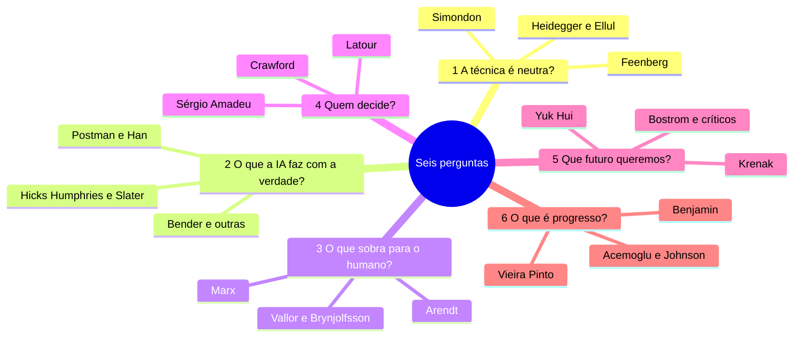
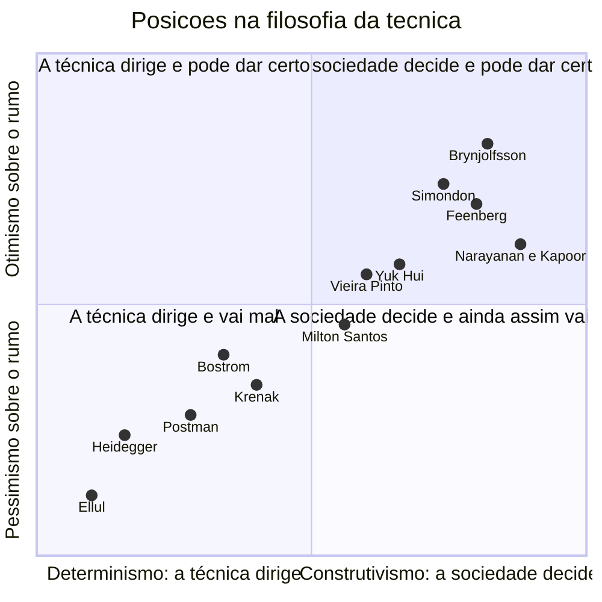

# Filosofia da Tecnologia - as grandes perguntas da era da IA

> [!quote] Frase de abertura
> *Em agosto de 2026 um advogado de Minnesota foi suspenso por levar a juízo citações de casos que nunca existiram, produzidas por IA (AI Incident Database, incidente #1667). Ninguém mentiu: o sistema não sabe o que é verdade e o humano achou que sabia.*

---

## 1. 🎯 Por que um engenheiro lê filosofia

Você não precisa de filosofia para escrever código. Precisa dela no instante em que abre a boca para justificar o código. Quatro frases de reunião:

| Frase de reunião | O que pressupõe sem avisar | Pergunta escondida |
|---|---|---|
| "O modelo **entende** o contexto" | que texto coerente é significado e intenção | o que é compreender? ([[O Teste de Turing e o Quarto Chinês]]) |
| "A ferramenta é **neutra**, depende do uso" | que o artefato não carrega valores | a técnica é neutra? (seção 2) |
| "Ele **alucinou** a referência" | que houve percepção defeituosa, logo o erro é patologia do modelo | o que a IA faz com a verdade? (seção 3) |
| "Isso é **progresso**, não dá para parar" | que a direção da mudança é única e boa | o que é progresso, e para quem? (seção 7) |

Nenhuma é boba. Todas são teses, e tese se defende ou se derruba com argumento. É isso que a filosofia faz: engenharia de conceitos, o mesmo trabalho de um code review aplicado às palavras que sustentam a decisão. Marilena Chaui define a coisa por uma **atitude**, não por um conteúdo: não aceitar como óbvio nada do cotidiano antes de investigar. Citação verificada, em *Convite à Filosofia* (1994): "**O que é? Por que é? Como é? Essas são as indagações fundamentais da atitude filosófica**".

**Como ler um filósofo,** sempre nesta ordem: **tese** (o que ele afirma em uma frase), **argumento** (por que seria verdade), **exemplo** (o caso que sustenta), **objeção** (o que derruba ou limita) e **veredito** (o que sobra de pé). A objeção é o passo que quase todo mundo pula, e o único que separa leitura de fé. Ferramental completo em [[Anatomia de um Argumento]]. Regra prática: **argumento que você não consegue reconstruir na versão mais forte possível você ainda não entendeu**.

> [!example] 🧪 Atividade 1: Anotar Winner em grupo no Hypothes.is
> **Ferramenta:** [Hypothes.is](https://hypothes.is) sobre o PDF aberto de [WINNER, "Do Artifacts Have Politics?" (1980)](https://faculty.cc.gatech.edu/~beki/cs4001/Winner.pdf).
>
> 1. Crie conta, instale a extensão e a turma cria **um grupo privado** (Minha conta → Grupos → Novo grupo privado).
> 2. Com o grupo selecionado, faça **3 anotações** no PDF: nas "duas maneiras" (p. 123), nas pontes de Robert Moses (pp. 123 a 124) e na colheitadeira de tomate (pp. 126 a 127), escrevendo a **tese** de cada trecho em uma frase.
> 3. Responda a **2 anotações de colegas** com uma objeção, não um elogio.
>
> **Resultado:** link do grupo e print com suas 5 contribuições. 📱 No celular use `via.hypothes.is/<url do PDF>`, sem extensão.

---

## 2. ❓ Pergunta 1: A técnica é neutra?

**O caso.** Um ranqueador ordena o que milhões de pessoas veem. O time diz: "ele é neutro, só otimiza a métrica que a gente pedir". A frase é correta e falsa ao mesmo tempo, e a filosofia da técnica existe para explicar por quê.

![[Recursos/Computação, Sociedade e Inclusão/Filosofia da Tecnologia - as grandes perguntas da era da IA/heidegger.png|Heidegger em 1960. "A questão da técnica" é de 1953 e nunca fala de computador.]]

| Posição | Quem | Obra e ano | O que diria do ranqueador |
|---|---|---|---|
| **Substantivismo**: a técnica é um modo de ver, não um meio | Heidegger | "A questão da técnica", 1953 | Não é neutro: converteu pessoas em *fundo de reserva*, e "usuário ativo mensal" é estoque |
| **Autonomia da técnica**: a eficiência decide | Jacques Ellul | *La technique ou l'enjeu du siècle*, 1954 | O mais eficiente se impõe sem deliberação; a reunião só ratificou o benchmark |
| **Ambivalência**: carrega valores, mas disputáveis | Andrew Feenberg | *Questioning Technology*, 1999 | Os valores entram na instrumentalização secundária: mudar quem desenha muda o artefato |
| **Cultura técnica**: o problema é ignorar a máquina | Gilbert Simondon | *Du mode d'existence des objets techniques*, 1958 | Tecnofobia e tecnofilia são a mesma ignorância; quem conhece o esquema não trata o modelo como oráculo nem como demônio |

Heidegger e Ellul dizem que a escolha é ilusória. Feenberg responde que ela existe, só está deslocada: não no uso, e sim no design, e por isso participar do design é ato político. Simondon acrescenta a via que interessa direto a você: a alienação não é só econômica, é **cultural**, e quem a desfaz é o técnico que entende o esquema.

> [!abstract] 🧠 Lente filosófica: Martin Heidegger ("A questão da técnica", 1953)
> As duas definições correntes de técnica (meio para um fim, atividade humana) são "corretas" mas não verdadeiras: não alcançam a essência. A técnica moderna é um modo de **desocultamento** que desafia a natureza a fornecer energia estocável. O que aparece assim vira *Bestand*, fundo de reserva, e o perigo é o humano virar *Bestand* também.
> Citações verificadas na tradução de William Lovitt (1977), p. 4: "**the essence of technology is by no means anything technological**" e "**we are delivered over to it in the worst possible way when we regard it as something neutral**" (a essência da técnica não é nada de técnico; somos entregues a ela do pior modo possível quando a consideramos algo neutro, traduções livres). Quando um assistente de IA guarda tudo o que você escreve para melhorar o produto, quem é o rio represado para dentro da usina (p. 16)?

> [!example] 🧪 Atividade 2: "A técnica é neutra?" em três LLMs
> **Ferramenta:** três sistemas no mesmo dia, por exemplo [ChatGPT](https://chatgpt.com), [Gemini](https://gemini.google.com) e [Claude](https://claude.ai), ou dois em nuvem e um local via [[Ollama - gerenciamento de modelos de IA]].
>
> 1. Prompt idêntico nos três: *"A técnica é neutra? Responda em 200 palavras, tome posição e cite as fontes."* Depois: *"De qual autor e obra vem cada afirmação, com ano?"*
> 2. Tabule 3 linhas × 4 colunas: **posição assumida** (instrumentalista, substantivista, construtivista, ambivalente), **autores citados**, **as citações existem?** (cheque 2 no [Google Acadêmico](https://scholar.google.com) e o DOI em [doi.org](https://doi.org)), **houve hedge?**.
> 3. Em 3 linhas: os três convergiram? Se sim, é sinal de verdade ou de treino parecido?
>
> **Resultado:** a tabela e quantas citações conferidas não existiam. 📱 Roda no celular.

> [!example] 🧪 Atividade 3: O teste de Heidegger num assistente de IA
> **Ferramenta:** configurações e termos de uso do assistente que você mais usa (ChatGPT: Controles de dados; Gemini: Atividade de Apps; Claude: Privacidade).
>
> 1. Ache o **opt-out de uso das conversas para treino**: quantos cliques da tela inicial até ele, e vem ligado por padrão?
> 2. Abra a **memória** (o que fica entre sessões), conte os itens guardados sobre você e ache nos termos o prazo de **retenção de dados**.
> 3. Escreva 5 linhas usando *standing-reserve* (Heidegger, p. 17): que parte de você ficou disponível como estoque?
>
> **Resultado:** 3 prints legendados (opt-out, memória, retenção) e as 5 linhas. Recorte dados pessoais antes de entregar.

---

## 3. ❓ Pergunta 2: O que a IA faz com a verdade?

**O caso.** Incidente #1667 do [AI Incident Database](https://incidentdatabase.ai/): advogado de Minnesota suspenso em agosto de 2026 por citações jurídicas fabricadas por IA (em 30/08/2026 a base já passava de 1.660 incidentes numerados). Chamamos isso de "alucinação". Quatro autores dizem que a palavra está errada, e que a palavra errada muda quem responde pelo erro.

| Posição | Quem | Obra e ano | O que diria do caso |
|---|---|---|---|
| Nem mente nem alucina: é **indiferente à verdade** | Hicks, Humphries e Slater, a partir de Frankfurt | "ChatGPT is bullshit", 2024 | A função-objetivo é plausibilidade, não verdade; "alucinação" exculpa o projeto |
| **Forma sem significado** | Bender, Gebru, McMillan-Major e Shmitchell | "Stochastic Parrots", FAccT '21 | O sistema costura sequências de forma linguística; a coerência é produzida pelo leitor |
| O problema é **anterior** à IA: excesso sem moldura | Neil Postman | *Technopoly*, 1992 | Informação sem teoria, propósito e instituição vira caos |
| A informação **substituiu a coisa** | Byung-Chul Han | *Não-coisas*, 2021 | Informação é efêmera e não resiste; o que não resiste não corrige ninguém |

> [!abstract] 🧠 Lente filosófica: Hicks, Humphries e Slater ("ChatGPT is bullshit", 2024)
> Harry Frankfurt define *bullshit* pela **indiferença ao valor de verdade**: o mentiroso precisa saber a verdade para escondê-la, o *bullshitter* não se importa. Os três autores aplicam isso a LLMs e atacam a metáfora da alucinação.
> Citações verificadas no artigo (acesso aberto, CC BY 4.0): os modelos "**are in an important way indifferent to the truth of their outputs**" e "**LLMs do not perceive, so they surely do not 'mis-perceive'**" (indiferentes à verdade das próprias saídas; LLMs não percebem, logo não percebem mal). Se o erro não é patologia do modelo, a responsabilidade volta a quem escolheu a função-objetivo e a quem publicou a saída sem conferir. Ver [[O que a IA sabe - Informação, verdade e alucinação]].

> [!example] 🧪 Atividade 4: Caça ao *bullshit* com DOI
> **Ferramenta:** um LLM qualquer, [doi.org](https://doi.org) e [SciELO](https://www.scielo.br). Leia antes 3 páginas do artigo aberto em [eprints.gla.ac.uk/327588](https://eprints.gla.ac.uk/327588/1/327588.pdf).
>
> 1. Peça ao LLM cinco referências acadêmicas sobre filosofia da tecnologia no Brasil, com DOI. Cole cada DOI em `doi.org` e cada título no SciELO.
> 2. Classifique cada saída como **verdadeira**, ***soft bullshit*** (indiferença à verdade) ou ***hard bullshit*** (intenção de enganar sobre a agenda).
>
> **Resultado:** tabela de 5 linhas com veredito, print do erro do DOI quando houver, e quantas existiam.

---

## 4. ❓ Pergunta 3: O que sobra para o humano?

**O caso.** O AI Index 2026 (Stanford HAI, capítulo de Economia) registra queda de quase 20% no emprego de desenvolvedores de 22 a 25 anos desde 2024, e um terço das organizações esperando reduzir força de trabalho por causa de IA no ano seguinte. Você está no 7º período: a pergunta não é retórica.

![[Recursos/Computação, Sociedade e Inclusão/Filosofia da Tecnologia - as grandes perguntas da era da IA/hannah-arendt.png|Hannah Arendt em 1958, ano de publicação de "A condição humana".]]

A pergunta é velha. Aristóteles, na *Política* I.4, imagina lançadeiras que teçam sozinhas e conclui que então ninguém precisaria de auxiliares nem de escravos (paráfrase): a fantasia da automação nasce colada ao problema de quem é dispensado. Marx, no "Fragmento sobre as máquinas" dos *Grundrisse* (1857 a 1858), diz que o saber social geral vira força produtiva direta e o trabalhador, apêndice vivo do sistema de máquinas (paráfrase).

| Posição | Quem | Obra e ano | O que diria do dado do AI Index |
|---|---|---|---|
| Sobra a **ação**, não automatizável por definição | Hannah Arendt | *A condição humana*, 1958 | Automatiza-se *labor* cognitivo; o risco maior não é o emprego, é a corrosão do mundo comum |
| Sobra o **mediador** que entende a máquina | Gilbert Simondon | *Du mode d'existence...*, 1958 | Quem só executa é substituível; quem entende o esquema, não |
| Sobra **caráter**, se for cultivado | Shannon Vallor | *Technology and the Virtues*, 2016 | Regra nenhuma cobre o inédito, e a IA é espelho do passado, não mente nova |
| Nada sobra sozinho: depende do **design** | Erik Brynjolfsson | "The Turing Trap", 2022 | Mirar semelhança com humanos empurra para substituição; complementaridade amplia |
| A vida não se justifica pela **utilidade** | Ailton Krenak | *A vida não é útil*, 2020 | Perguntar "o que sobra para o humano trabalhar" já aceita que humano é o que produz |

> [!abstract] 🧠 Lente filosófica: Hannah Arendt (*A condição humana*, 1958)
> Paráfrase (sem citação literal com página verificada nesta obra): Arendt separa três atividades. **Labor** é o ciclo biológico, produz consumo e não deixa vestígio. **Trabalho** fabrica um mundo durável de objetos. **Ação** acontece entre pessoas plurais, sem mediação de coisas, e é onde alguém revela quem é. A modernidade inverteu a hierarquia e organizou tudo como *animal laborans*, bem quando a automação chega: uma sociedade de trabalhadores prestes a ser libertada do trabalho, sem saber o que fazer com essa liberdade.
> A régua para 2026: a IA automatiza **labor**? corrói **trabalho** (o software que dura, a documentação que forma quem vem depois)? ou substitui **ação** (deliberar, decidir junto, responder por)? Só o terceiro é grave por definição. Segue em [[Automação, trabalho e o futuro das profissões]].

> [!example] 🧪 Atividade 5: Moral Machine, e a crítica à Moral Machine
> **Ferramenta:** [Moral Machine](https://www.moralmachine.net/) (MIT Media Lab).
>
> 1. Rode a sessão até o fim (13 cenários), salve a tela de resultado e anote a dimensão em que mais diverge da média.
> 2. Compare com o estudo original: AWAD et al., "The Moral Machine experiment", *Nature* 563, 2018, pp. 59 a 64 ([DOI](https://doi.org/10.1038/s41586-018-0637-6)), que descreve um agrupamento "Sul" com padrão próprio.
> 3. **Contraponto obrigatório**, e é a parte que vale: 5 linhas respondendo se dilema de bonde é mesmo o problema real de um veículo autônomo, ou se o problema é engenharia de segurança. A ferramenta ensina ou distorce?
>
> **Resultado:** print do perfil e as 5 linhas do contraponto. 📱 Roda no celular.

---

## 5. ❓ Pergunta 4: Quem decide?

**O caso.** Um banco troca a análise humana de crédito por um modelo. Ninguém "decidiu" recusar o crédito de alguém: decidiu o time de dados ao escolher as variáveis, o fornecedor ao definir o que é histórico, o regulador ao permitir e a métrica ao definir o que é bom.

| Posição | Quem | Obra e ano | Onde localiza a decisão |
|---|---|---|---|
| Quem **projeta** decide, e é disputável | Andrew Feenberg | *Questioning Technology*, 1999 | Na instrumentalização secundária, onde valores entram no design |
| Quem controla a **infraestrutura** decide | Kate Crawford | *Atlas of AI*, 2021 | Minerais, energia, rotulagem e classificação: a cadeia material |
| Decidem **instituições**: o gargalo é a difusão | Narayanan e Kapoor | "AI as Normal Technology", 2025 | Capacidade do modelo não é poder no mundo |
| Decide **quem escreve o código**, e por isso ele deve ser público | Sérgio Amadeu da Silveira | *Democracia e os códigos invisíveis*, 2019 | Na distribuição algorítmica do que cada um vê |
| Decidem **cadeias de actantes**, humanos e não humanos | Bruno Latour | *Jamais fomos modernos*, 1991 | Uma lombada é um "policial deitado": moral delegada ao asfalto |

Latour dá o vocabulário mais útil: um pipeline de recomendação é uma cadeia de **actantes** (engenheiro, métrica, dataset, revisor terceirizado, usuário, regulador). Quem descreve só o código descreve um terço, e depois se surpreende quando o sistema "faz" algo que ninguém programou.

> [!abstract] 🧠 Lente filosófica: Sérgio Amadeu da Silveira (modulação algorítmica)
> Professor da UFABC, toma de Deleuze o conceito de **modulação** para nomear o que se esconde atrás de "personalização". Citação verificada, lida no PDF integral: "**A modulação é um processo de controle da visualização de conteúdos, sejam discursos, imagens ou sons. As plataformas não criam discursos, mas contam com sistemas de algoritmos que distribuem os discursos criados pelos seus usuários**" (*Revista Fapcom*, v. 3, n. 6, p. 21).
> Otimizar CTR não é só ajustar métrica, é controlar o campo de visão de alguém. Um ranqueador de código público deixaria de modular, ou modularia às claras? Ver [[Ética da IA - Poder, Vigilância e Automação]] e [[Poder, plataformas e vigilância - o público, o privado e o sujeito]].

> [!example] 🧪 Atividade 6: Debate estruturado no Kialo
> **Ferramenta:** [Kialo Edu](https://www.kialo-edu.com/) (árvore de argumentos pró e contra, grátis para uso educacional).
>
> 1. A turma cria **um** debate com a tese: *"Sistemas de IA devem poder decidir sozinhos sobre concessão de crédito no Brasil."*
> 2. Cada aluno posta **3 contribuições**: um argumento a favor, um contra e um contra-argumento a um colega. **Toda contribuição precisa de fonte** (lei, artigo, relatório, decisão judicial, dado oficial); saída de LLM não vale, vá à fonte primária.
> 3. Marque na árvore qual ramo ficou mais fraco depois dos contra-argumentos.
>
> **Resultado:** link público do debate e print da árvore com suas 3 contribuições. 📱 Roda no celular, melhor na horizontal.

---

## 6. ❓ Pergunta 5: Que futuro queremos?

**O caso.** Em abril de 2025, com duas semanas de diferença, saíram dois textos sérios e incompatíveis: "AI 2027" (Kokotajlo et al., 03/04/2025), cenário mês a mês que chega a IA sobre-humana em 2027, e "AI as Normal Technology" (Narayanan e Kapoor, 15/04/2025), que dá décadas para os efeitos econômicos. Mesmos dados públicos, previsões opostas: escolher entre elas é escolher uma filosofia da história.

![[Recursos/Computação, Sociedade e Inclusão/Filosofia da Tecnologia - as grandes perguntas da era da IA/ailton-krenak.png|Ailton Krenak na Câmara dos Deputados, 2017. Eleito para a ABL em 05/10/2023 e empossado em 05/04/2024.]]

| Posição | Quem | Obra e ano | O que faz com a pergunta |
|---|---|---|---|
| **Responsabilidade prospectiva** | Hans Jonas | *O princípio responsabilidade*, 1979 | Gerações futuras não podem consentir: o ônus é de quem age ([[Ética da IA - Responsabilidade e Agência Moral]]) |
| **Tecnodiversidade**: bifurcar a técnica | Yuk Hui | *Tecnodiversidade*, Ubu, 2020 | Nega que exista "a" técnica: há cosmotécnicas em cosmologias diferentes |
| **Adiar o fim do mundo**: pluralizar formas de existir | Ailton Krenak | *Ideias para adiar o fim do mundo*, 2019 | Recusa o "show do progresso" sem examinar quem lucra |
| **Longtermismo**: maximizar valor esperado no longo prazo | Bostrom; MacAskill | *Superintelligence*, 2014 | O que mais importa é o número enorme de vidas futuras possíveis |
| **Crítica ao longtermismo** | Gebru e Torres | "The TESCREAL bundle", 2024 | O pacote desvia recursos dos danos presentes e tem genealogia eugênica |

A tese de Yuk Hui aparece assim na apresentação do livro pela editora Ubu: "Não há uma única tecnologia, mas sim uma tecnodiversidade, uma multiplicidade de cosmotécnicas que diferem umas das outras em seus valores, epistemologias e formas de existência". O alvo é a premissa, que Heidegger e o Vale do Silício partilham, de que só existe **um** caminho técnico: o de quem tem mais GPU.

> [!abstract] 🧠 Lente filosófica: Ailton Krenak (*Ideias para adiar o fim do mundo*, 2019)
> Krenak não trata tecnologia como boa ou má em si: trata como sintoma de uma relação antropocêntrica com a Terra. Citação verificada, lida por inteiro na matéria: "**As corporações estão tentando transformar a gente em máquinas. Criaram essa história de cultura digital, e o resultado é que todo mundo está plasmado em uma tela o tempo inteiro, vivendo em outros mundos**" (Época Negócios, jan/2025). Ao Brasil de Fato (24/06/2025), reproduzido pelo IHU-Unisinos: "**Estou preocupado com o efeito quase místico que ciência e tecnologia estão imprimindo no nosso modo de pensar o mundo**".
> Ele não pede que ninguém desligue nada, pede que se examine a adesão automática. Quando um pitch diz "IA para salvar o planeta", quem paga a conta e quem fica com o lucro?

> [!example] 🧪 Atividade 7: Roda Viva com timestamp
> **Ferramenta:** um destes dois programas, íntegros no YouTube: ["Roda Viva | Ailton Krenak | 19/04/2021"](https://www.youtube.com/watch?v=BtpbCuPKTq4) (1h32) ou ["Roda Viva Retrô | Milton Santos | 1997"](https://www.youtube.com/watch?v=xPfkiR34law) (1h26).
>
> 1. Assista **20 minutos contínuos** e registre o intervalo (por exemplo 00:22:10 a 00:42:10).
> 2. Anote **3 frases literais com o timestamp exato**.
> 3. Para cada frase, 2 linhas conectando a um autor das seções 2 a 7. Uma das 3 tem que ser de **discordância**: onde o europeu e o brasileiro não se encaixam.
>
> **Resultado:** 3 citações com minutagem e as 3 conexões. 📱 No app do YouTube o tempo aparece ao tocar na tela; use velocidade 1x.

---

## 7. ❓ Pergunta 6: O que é progresso?

**O caso.** A IA generativa avançou muito rápido em capacidade entre 2022 e 2026, e a estimativa de [Narayanan e Kapoor](https://knightcolumbia.org/content/ai-as-normal-technology) para o efeito real no trabalho fica entre **0,5% e 3,5% das horas trabalhadas**. As duas coisas são verdade ao mesmo tempo, e vale conferir os dois lados na fonte: os números de investimento, adoção e emprego estão no [capítulo de Economia do AI Index 2026](https://hai.stanford.edu/ai-index/2026-ai-index-report/economy). Chamar a capacidade de "progresso" e ignorar a difusão é escolha, não leitura de dado.

![[Recursos/Computação, Sociedade e Inclusão/Filosofia da Tecnologia - as grandes perguntas da era da IA/angelus-novus-klee.png|"Angelus Novus", Paul Klee, 1920. Benjamin era dono do quadro e escreveu a partir dele a tese IX.]]

| Posição | Quem | Obra e ano | Tese em uma linha |
|---|---|---|---|
| Progresso é **escolha**, não fluxo automático | Acemoglu e Johnson | *Power and Progress*, 2023 | Produtividade só vira prosperidade compartilhada quando há contrapoder social |
| Progresso é a **tempestade** que empurra o anjo | Walter Benjamin | "Sobre o conceito de história", 1940 | O que vemos como cadeia de eventos, o anjo vê como catástrofe única |
| Progresso técnico é **ideologia** quando vira régua de todos os povos | Álvaro Vieira Pinto | *O conceito de tecnologia*, 2005 | Ver seção 8 |
| Progresso é **produtividade**, com ressalva distributiva | Susskind; Brynjolfsson | *Um mundo sem trabalho*, 2020 | O bolo cresce; o problema é a repartição e a direção do investimento |

> [!abstract] 🧠 Lente filosófica: Walter Benjamin ("Sobre o conceito de história", 1940, tese IX)
> Benjamin descreve o quadro de Klee como um anjo de costas para o futuro, arrastado por uma tempestade que vem do paraíso, olhando a ruína se acumular. Citação verificada no texto integral em acesso aberto: "**Where we see the appearance of a chain of events, he sees one single catastrophe [...] That which we call progress, is this storm**" (onde vemos uma cadeia de eventos, ele vê uma catástrofe única; aquilo que chamamos de progresso é essa tempestade, tradução livre).
> A tese não é "toda mudança é ruim": é que "progresso" descreve uma **direção** que quem está sendo empurrado não escolheu. No roadmap do produto em que você vai trabalhar, quem escolheu a direção?

### 🧭 Onde cada pensador cai

Duas perguntas independentes organizam quase o campo todo: **quem manda** (a técnica dirige a sociedade, ou a sociedade decide a técnica?) e **para onde vai** (o rumo é bom ou ruim?).

O mapa é ferramenta de leitura, não veredito: cada posição é discutível, e discutir já é o exercício. Quase ninguém é otimista **e** determinista: quem acha que a técnica manda sozinha costuma achar que isso termina mal.

---

## 8. 🇧🇷 Pensar a técnica desde o Brasil

Tudo acima foi escrito na Alemanha, na França, nos Estados Unidos e em Hong Kong. Pensar a técnica de Bom Jesus do Itabapoana muda o problema, e há tradição brasileira robusta que faz isso.

![[Recursos/Computação, Sociedade e Inclusão/Filosofia da Tecnologia - as grandes perguntas da era da IA/milton-santos.png|Milton Santos em 1994. Geógrafo da USP, formulou o meio técnico-científico-informacional.]]

> [!abstract] 🧠 Lente filosófica: Álvaro Vieira Pinto (*O conceito de tecnologia*, 2005)
> Escrito entre 1973 e 1974, publicado só em 2005, 18 anos após a morte do autor, catedrático de filosofia na então Universidade do Brasil (hoje UFRJ). Ele separa **quatro acepções** de "tecnologia": (1) teoria ou ciência da técnica; (2) sinônimo impreciso de técnica; (3) o conjunto das técnicas de uma sociedade numa fase histórica; (4) tecnologia como **ideologização da técnica**.
> A quarta sustenta a crítica: a "era tecnológica" não é fato neutro, é ideologia fabricada pelos países centrais para naturalizar a própria vanguarda e deixar à periferia o maravilhamento ingênuo diante da máquina. Daí o par **ingenuidade** e **criticidade** (ler a técnica a partir da posição real do país no sistema mundial).
> Citações com página, conferidas por artigo secundário que as cita (o original não tem acesso aberto): "toda tecnologia transporta inevitavelmente um conteúdo ideológico" (2005, v. 1, p. 320) e "**toda tecnologia é uma ideologia**" (p. 322). Isso separa "eu domino uma técnica" de "eu aderi a uma ideologia do progresso". A quem serve chamar isto de era da IA?

**Milton Santos** (*Por uma outra globalização*, 2000) lê a globalização em três chaves simultâneas: **fábula** (o mundo como nos fazem crer, a aldeia global harmônica), **perversidade** (o mundo como é, concentração disfarçada de inevitabilidade técnica) e **possibilidade** (o mundo como pode ser, aberta a partir dos países pobres). O **meio técnico-científico-informacional** nomeia o estágio em que técnica, ciência e informação se fundem no espaço, sempre desigualmente: "**O meio técnico-científico-informacional é a cara geográfica da globalização**" (SANTOS, 1997, Hucitec, p. 191, citação verificada por artigo secundário). Todo data center, cabo submarino e cluster de GPU se instala em pontos específicos do planeta: infraestrutura de IA é geografia de poder, e a densidade técnica do Noroeste Fluminense não é a de São Paulo nem a de Ashburn, na Virgínia.

**Paulo Freire** completa pelo método. Em *Extensão ou comunicação?* (1971) o alvo não é a tecnologia: é o modelo de transferência que ele chama de **invasão cultural**, no qual um técnico impõe sua visão de mundo a um espaço cultural alheio, sem diálogo. Em *Pedagogia da esperança* (1992) fecha a posição, e a citação é literal: "**o que me parece fundamental para nós, hoje [...] é a assunção de uma posição crítica, vigilante, indagadora, em face da tecnologia. Nem, de um lado, demonologizá-la, nem, de outro, divinizá-la**". Essa frase é o critério do [[Projeto de Extensão - IA para Todos]]: oficina que ensina IA a uma comunidade sem escutar a comunidade é invasão cultural com wi-fi.

Três nomes fecham o quadro. **Laymert Garcia dos Santos** (*Politizar as novas tecnologias*, 2003) leu em paralelo a apropriação do código **genético** e a do **digital**, duas décadas antes do debate sobre biometria como insumo de treino. **Tarcízio Silva** define **racismo algorítmico** com precisão técnica: "**a disposição de tecnologias e imaginários sociotécnicos em um mundo moldado pela supremacia branca realiza a ordenação algorítmica racializada de classificação social, recursos e violência em detrimento de grupos minorizados**" (SILVA, 2022, p. 66). E **Nina da Hora** empurra a auditoria um passo atrás com o **epistemicídio computacional**: antes de perguntar se o modelo é justo na saída, perguntar quem decidiu o que conta como dado válido (o termo vem de Sueli Carneiro, USP, 2005).

> [!info] 🇧🇷 Por que isso não é abstrato no Noroeste Fluminense
> Os números do CETIC.br (TIC Domicílios 2025) dão corpo a Milton Santos: 86% dos domicílios brasileiros têm internet, mas **só 32% têm computador** (classe A 97%, classe DE 10%), e **65% dos usuários acessam a internet só pelo celular** (classe A 5%, classe DE 87%). Quem projeta um sistema para o interior do Rio e testa só no notebook está projetando para 32% do país.

> [!example] 🧪 Atividade 8: Vieira Pinto em fonte primária de verdade
> **Ferramenta:** [Google Acadêmico](https://scholar.google.com) e [SciELO Brasil](https://www.scielo.br).
>
> 1. Busque `"Álvaro Vieira Pinto" tecnologia` e depois `"ingenuidade tecnológica"` (no Google Acadêmico dá para restringir com `site:scielo.br`).
> 2. Abra **1 artigo** de 2018 em diante que use o conceito, copie a **definição** de ingenuidade (ou da quarta acepção) e anote autor, título, periódico, ano e a **página exata**.
> 3. Aplique a um caso de 2026: 5 linhas com um discurso público sobre IA que caiba na ingenuidade e um na criticidade, com link para os dois.
>
> **Resultado:** a referência com página, a citação copiada e as 5 linhas com os dois links.

---

## 9. 🤖 E a IA? · 🔮 E em 2036?

Em 2026 circulam três discursos sobre IA, e cada um é uma filosofia da técnica disfarçada de previsão.

| Discurso | Tese | Quem defende | Filosofia embutida | Onde é fraco |
|---|---|---|---|---|
| **Apocalipse** | superinteligência em poucos anos, risco existencial | Bostrom (2014); "AI 2027" (2025) | determinismo forte: a capacidade decide o futuro sozinha | trata capacidade como poder e ignora instituições |
| **Salvação** | abundância, cura de doenças, fim da escassez | lançamentos das grandes empresas de IA | solucionismo (Morozov): problema social recastado como computável | quem redefine o problema já decidiu politicamente |
| **Tecnologia normal** | efeitos reais em décadas, gargalo é a difusão | Narayanan e Kapoor (2025) | construtivismo institucional: sociedade e técnica se moldam | pode subestimar rupturas rápidas em nichos, como fraude |

As citações verificadas do terceiro texto dizem o essencial: os impactos serão lentos, "**on the timescale of decades**", e "**we do not think that viewing AI as a humanlike intelligence is currently accurate or useful**". A posição de fundo: "**The normal technology frame [...] rejects technological determinism, especially the notion of AI itself as an agent in determining its future**".

**Três cenários para 2036.** **Difusão lenta e setorial**: a IA vira infraestrutura chata e regulada, como eletricidade, e o emprego se reorganiza em supervisão e especificação; se der errado, o ganho vai todo para quem tem capital (Narayanan e Kapoor; Acemoglu e Johnson). **Concentração**: poucos modelos e poucos donos, decisão de infraestrutura fora do alcance público, periferia como consumidora de modelo alheio (Crawford; Milton Santos; Vieira Pinto). **Bifurcação**: modelos abertos, em português, com dados e valores locais, sob risco de virar soberania de discurso sem capacidade real (Yuk Hui; Feenberg; Sérgio Amadeu).

**O que isso pede de você, engenheiro de computação formando entre 2026 e 2036.** Brynjolfsson dá a tarefa concreta: a "armadilha de Turing" é mirar semelhança com humanos (que empurra para substituição) em vez de complementaridade (que amplia capacidade). É decisão de arquitetura, de quem escreve a especificação. E Feenberg dá a versão política: participar do design é participar da política, mesmo quando o crachá diz só "desenvolvedor".

---

## 🗣️ Para debater em sala

**1. "A técnica é neutra, o problema é o uso." Isso se sustenta em 2026?**
- **Não:** Heidegger sustenta que considerar a técnica neutra é o que nos entrega a ela "do pior modo possível" (1953, p. 4), e Winner mostra artefatos que materializam arranjos de poder (1980, pp. 123 a 131).
- **Sim, em parte:** Feenberg concorda que a técnica carrega valores, mas insiste que é **ambivalente** e redesenhável (1999). Se for destino, não há o que fazer; se for disputa, há.

**2. Chamar erro de LLM de "alucinação" é inofensivo ou é transferência de responsabilidade?**
- **É transferência:** Hicks, Humphries e Slater argumentam que "LLMs do not perceive, so they surely do not 'mis-perceive'" (2024) e que a metáfora exculpa quem projetou a função-objetivo.
- **É termo técnico útil:** a palavra já está consolidada na literatura e nos produtos, e trocar vocabulário não muda incentivo; o que muda responsabilidade é regulação e contrato (Narayanan e Kapoor pedem defesa "a jusante", no contexto de uso).

**3. Um sistema de IA deve poder decidir sozinho sobre crédito, benefício social ou triagem médica?**
- **Não:** Crawford (2021) mostra que a decisão real está na cadeia material e nas classificações embutidas; Tarcízio Silva (2022, p. 66) nomeia como o resultado se torna racialmente ordenado e mais difícil de contestar que o racismo explícito.
- **Sim, com condições:** Narayanan e Kapoor sustentam que o risco está na aplicação e na adoção, não no modelo: a resposta seria regulação setorial, auditoria e recurso humano garantido. Ver [[Vieses, discriminação algorítmica e inclusão]].

---

## ❓ Quiz rápido

> [!question]- 1. Segundo Heidegger, o que é *Bestand* (fundo de reserva)?
> **Resposta:** o que, desocultado pelo modo de desafiar da técnica moderna, deixa de estar diante de nós como objeto e passa a existir só como estoque disponível para novo ordenamento (Lovitt, 1977, p. 17). O perigo é o humano entrar nessa categoria: "usuário ativo mensal" é o exemplo mais fácil.

> [!question]- 2. Verdadeiro ou falso: para Hicks, Humphries e Slater, um LLM que produz referência falsa está mentindo.
> **Resposta:** **Falso.** Mentir exige saber a verdade e querer escondê-la. Eles classificam a saída como *bullshit* no sentido de Frankfurt: **indiferença** ao valor de verdade, já que a função-objetivo é plausibilidade. Por isso rejeitam também "alucinação": o sistema não percebe nada.

> [!question]- 3. Na distinção de Arendt, a que categoria pertence responder por uma decisão numa reunião de projeto, junto com outras pessoas?
> **Resposta:** **ação**. Labor é o ciclo que se consome sem vestígio, trabalho fabrica o mundo durável de objetos, e ação se dá entre pessoas plurais, revelando quem cada um é. É a categoria que, por definição, não tem substituto automatizado.

> [!question]- 4. Qual é a quarta acepção de tecnologia em Álvaro Vieira Pinto, e por que é a mais política?
> **Resposta:** tecnologia como **ideologização da técnica**. As três primeiras são descritivas; a quarta afirma que a "era tecnológica" é narrativa fabricada pelos países centrais para naturalizar a própria posição, produzindo **ingenuidade** na periferia. Daí "toda tecnologia é uma ideologia" (2005, v. 1, p. 322).

> [!question]- 5. Qual posição sobre o futuro da IA rejeita explicitamente o determinismo tecnológico?
> **Resposta:** a de **"IA como tecnologia normal"** (Narayanan e Kapoor, 2025): "The normal technology frame [...] rejects technological determinism, especially the notion of AI itself as an agent in determining its future". Capacidade do modelo não é poder no mundo: o gargalo do impacto é a difusão, limitada por instituições.

---

## 🔗 Veja também

- [[A tecnologia não é neutra - Computação e Sociedade]]: a aula anterior, com as quatro lentes da disciplina e o caso Winner em detalhe.
- [[Anatomia de um Argumento]]: como desmontar tese, premissas e falácias antes de concordar ou discordar.
- [[Tópicos/Filosofia da Mente e da Tecnologia/index|Filosofia da Mente e da Tecnologia]]: a disciplina irmã, com Turing, Searle, Dennett, Chalmers e Floridi.
- [[O que a IA sabe - Informação, verdade e alucinação]]: o lado epistemológico da pergunta 2. E [[Ética da IA - Responsabilidade e Agência Moral]] e [[Ética da IA - Poder, Vigilância e Automação]]: Jonas, Zuboff e a responsabilidade de quem projeta.
- [[Kit de ferramentas de Computação e Sociedade]] e [[Glossário de Computação, Sociedade e Inclusão]]: as ferramentas desta página e os verbetes de Gestell, modulação, tecnodiversidade e racismo algorítmico.
- ➡️ **Próxima aula:** [[A virada da IA - o que mudou no mundo desde 2022]]

---

> [!note] 📚 Fontes (2026)
> - [WINNER, "Do Artifacts Have Politics?", 1980, PDF aberto](https://faculty.cc.gatech.edu/~beki/cs4001/Winner.pdf) · [HICKS, HUMPHRIES e SLATER, "ChatGPT is bullshit", 2024, CC BY 4.0](https://eprints.gla.ac.uk/327588/1/327588.pdf) · [BENDER et al., "Stochastic Parrots", FAccT '21](https://s10251.pcdn.co/pdf/2021-bender-parrots.pdf) · [BRYNJOLFSSON, "The Turing Trap", 2022](https://arxiv.org/abs/2201.04200)
> - [NARAYANAN e KAPOOR, "AI as Normal Technology", Knight Institute, Columbia, 15/04/2025](https://knightcolumbia.org/content/ai-as-normal-technology) · [KOKOTAJLO et al., "AI 2027", 03/04/2025](https://ai-2027.com/) · [GEBRU e TORRES, "The TESCREAL bundle", 2024](https://firstmonday.org/ojs/index.php/fm/article/view/13636) · [BENJAMIN, tese IX, 1940](https://www.marxists.org/reference/archive/benjamin/1940/history.htm) · [CHAUÍ, *Convite à Filosofia*](https://docs.ufpr.br/~adilar/METODOLOGIA%202019/Texto%20Marilena%20Chau%C3%AD_Convite%20%C3%A0%20Filosofia.pdf) · [HUI, *Tecnodiversidade*, Ubu](https://www.ubueditora.com.br/tecnodiversidade.html)
> - [PIRES, 2021, fonte das citações de Vieira Pinto com página do original de 2005](https://seer.uftm.edu.br/revistaeletronica/index.php/revistagepadle/article/view/6091) · [SANTOS, Milton, 2000, Introdução (UFRRJ)](https://arquivos.ufrrj.br/arquivos/202320605769723791143dbac634808fe/Texto_6_Milton_Santos__Introduo_Geral_-_Livro_Por_uma_outra_globalizacao.pdf) · [FREIRE, *Pedagogia da esperança*](https://acervo.paulofreire.org/items/3fbb996c-20ad-4be3-a658-499d2bb3494a) · [SILVEIRA, modulação, *Revista Fapcom* 3(6)](https://revista.fapcom.edu.br/index.php/revista-paulus/article/download/111/102) · [SILVA, Tarcízio, 2022](https://archive.org/details/tarcizio-silva-racismo-algoritmico)
> - Krenak: [Época Negócios, jan/2025](https://epocanegocios.globo.com/tecnologia/noticia/2025/01/e-preciso-parar-de-endeusar-os-magnatas-da-tecnologia-e-lembrar-que-eles-so-trabalham-em-beneficio-proprio-diz-ailton-krenak.ghtml) · [IHU-Unisinos, 24/06/2025](https://www.ihu.unisinos.br/categorias/653699-nos-nao-podemos-ser-uma-maquina-de-fazer-coisas-entrevista-com-ailton-krenak) · TV Cultura: [Roda Viva, Krenak, 2021](https://www.youtube.com/watch?v=BtpbCuPKTq4) · [Roda Viva Retrô, Milton Santos, 1997](https://www.youtube.com/watch?v=xPfkiR34law)
> - Dados: [AI Index 2026, Stanford HAI, Economia](https://hai.stanford.edu/ai-index/2026-ai-index-report/economy) · [AI Incident Database](https://incidentdatabase.ai/) · [CETIC.br, TIC Domicílios 2025](https://cetic.br/media/analises/tic_domicilios_2025_principais_resultados.pdf). Ferramentas das atividades (Hypothes.is, Moral Machine, Kialo Edu, Google Acadêmico, SciELO, doi.org) estão linkadas no corpo.
> - Imagens, Wikimedia Commons: [Heidegger, 1960, CC BY-SA 3.0](https://commons.wikimedia.org/wiki/File:Heidegger_1_(1960).jpg) · [Arendt, foto de Barbara Niggl Radloff, 1958, CC BY-SA 4.0](https://commons.wikimedia.org/wiki/File:FM-2019-1-5-9-17-Niggl-Radloff-B-Hannah-Arendt_(cropped).jpg) · [Krenak, Câmara, 2017, CC BY-SA 4.0](https://commons.wikimedia.org/wiki/File:Ailton_Krenak_03-10-2017_-_Comiss%C3%A3o_de_Meio_Ambiente_e_Desenvolvimento_Sustent%C3%A1vel.jpg) · [Milton Santos, 1994, CC BY-SA 4.0](https://commons.wikimedia.org/wiki/File:Milton_Santos-FIG_1994_(1).jpg) · [*Angelus Novus*, Klee, 1920, domínio público](https://commons.wikimedia.org/wiki/File:Angelus_Novus,_1920_-_Paul_Klee.jpg)

> [!note] 📖 Leituras
> - PINTO, Álvaro Vieira. *O conceito de tecnologia*. Rio de Janeiro: Contraponto, 2005, 2 v. As quatro acepções e a "era tecnológica" como ideologia.
> - SANTOS, Milton. *Por uma outra globalização*. Rio de Janeiro: Record, 2000. 🔓 [introdução integral](https://arquivos.ufrrj.br/arquivos/202320605769723791143dbac634808fe/Texto_6_Milton_Santos__Introduo_Geral_-_Livro_Por_uma_outra_globalizacao.pdf). Fábula, perversidade e possibilidade.
> - FREIRE, Paulo. *Extensão ou comunicação?* Rio de Janeiro: Paz e Terra, 1971. 📗 🔓 [PDF integral](https://fasam.edu.br/wp-content/uploads/2020/07/Extensao-ou-Comunicacao-1.pdf). Invasão cultural: o que não fazer numa oficina de extensão.
> - HEIDEGGER, Martin. "A questão da técnica". Trad. Marco Aurélio Werle. *Scientiae Studia* 5(3), 2007, pp. 375 a 398. Também em *Ensaios e conferências*, Vozes, 2002.
> - FEENBERG, Andrew. *Questioning Technology*. Londres: Routledge, 1999. E ARENDT, Hannah. *A condição humana*. Trad. Roberto Raposo. Rio de Janeiro: Forense Universitária, 13. ed., 2020.
> - KRENAK, Ailton. *Ideias para adiar o fim do mundo*, 2019, e *A vida não é útil*, 2020. São Paulo: Companhia das Letras.
> - HUI, Yuk. *Tecnodiversidade*. Trad. Humberto do Amaral. São Paulo: Ubu, 2020. **Não** é a tradução de *The Question Concerning Technology in China*, é uma coletânea.
> - SILVA, Tarcízio. *Racismo algorítmico*. São Paulo: Edições Sesc, 2022. 🔓 [acesso aberto](https://archive.org/details/tarcizio-silva-racismo-algoritmico). E CRAWFORD, Kate. *Atlas of AI*. Yale UP, 2021: a IA como cadeia extrativa.
> - ACEMOGLU, D.; JOHNSON, S. *Poder e progresso*. São Paulo: Companhia das Letras, 2023. Progresso como disputa, não como fluxo.
> - CAZELOTO, Edilson. *Inclusão digital: uma visão crítica*. São Paulo: Senac, 2008. 📗 Crítica ao discurso que naturaliza o consumo de tecnologia.
