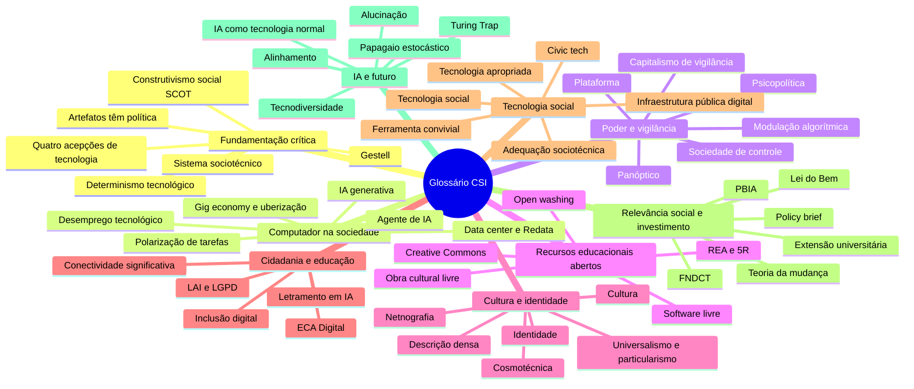

# Glossário de Computação, Sociedade e Inclusão

> [!quote] Vocabulário também é ferramenta de engenharia
> *Você já sabe o que é latência, deadlock e complexidade assintótica. Esta disciplina acrescenta palavras que deixam ver o que um sistema faz com as pessoas. "Viés" e "paridade demográfica" não são a mesma coisa; "gratuito" e "aberto" não são a mesma coisa; "alucinação" e "indiferença à verdade" não são a mesma coisa. Cada distinção dessas muda uma decisão de projeto.*

---

## 🗺️ Como os termos se agrupam

A lista é alfabética, mas as ideias vêm em famílias, que são as unidades da ementa. Use o mapa para achar o vizinho de um termo.

> [!tip] Como ler cada verbete
> Autor e ano entre parênteses quando o conceito tem dono. Termo de campo, sem cunhagem única, entra sem atribuição, e isso é de propósito: aqui, inventar autoria é erro grave. O link leva à página que trabalha o termo com caso, dado e atividade.

---

## 0-9

- **5R**: as cinco liberdades que definem um REA: reter, reusar, revisar, remixar e redistribuir (David Wiley). Licença que bloqueia revisar e remixar dá material gratuito, não aberto. Ver [[Recursos Educacionais Abertos]].

---

## A

- **Acessibilidade**: poder ser usado por pessoas com deficiência sem adaptação especial. É obrigação legal para sites de empresa com sede no Brasil (LBI, art. 63). Ver [[Vieses, discriminação algorítmica e inclusão]].
- **Actante**: qualquer coisa que modifica um curso de ação, humana ou não; a lombada é um "policial deitado" (Latour, 1991). Ver [[Filosofia da Tecnologia - as grandes perguntas da era da IA]].
- **Adequação sociotécnica**: reprojetar a tecnologia convencional para servir a outro arranjo social, em vez de transferi-la pronta (Dagnino, 2014). Ver [[Tecnologia social e tecnologia convencional]].
- **Agente de IA**: sistema que não só responde: planeja, chama ferramentas e age no mundo. A passagem de ferramenta a agente é a fronteira atravessada entre 2024 e 2026. Ver [[Glossário de Engenharia de Software com IA]].
- **AI Act**: lei europeia de IA por níveis de risco, aplicável desde 02/08/2026; as obrigações de alto risco foram adiadas para 2027 e 2028. Ver [[A virada da IA - o que mudou no mundo desde 2022]].
- **Alienação por ignorância da máquina**: alienação propriamente técnica, a de quem não entende o objeto; produz ao mesmo tempo tecnofobia e tecnofilia (Simondon, 1958). Ver [[Filosofia da Tecnologia - as grandes perguntas da era da IA]].
- **Alinhamento**: treino que aproxima a saída do modelo dos valores declarados por quem o treina. A pergunta política é sempre: alinhado a quem? Ver [[Glossário de Engenharia de Software com IA]].
- **Alucinação**: nome de mercado para a saída fluente e falsa de um modelo; contestado por supor percepção onde não há nenhuma. Ver [[O que a IA sabe - Informação, verdade e alucinação]].
- **Anotação de dados e moderação de conteúdo**: o trabalho humano que sustenta a IA: terceirizado, mal pago e psicologicamente pesado, do Quênia ao Brasil. Ver [[A virada da IA - o que mudou no mundo desde 2022]].
- **Artefatos têm política**: um objeto técnico carrega arranjos de poder, ou por resolver uma disputa no desenho, ou por exigir certa estrutura para funcionar (Winner, 1980). Ver [[A tecnologia não é neutra - Computação e Sociedade]].
- **Automação "so-so"**: substitui gente sem ganho relevante de produtividade: corta emprego sem gerar riqueza nova (Acemoglu e Johnson, 2023). Ver [[Automação, trabalho e o futuro das profissões]].
- **Autonomia da técnica**: o problema não são as máquinas, é o sistema de métodos de máxima eficiência, que cresce sozinho e absorve moral, direito e política (Ellul, 1954). Ver [[Filosofia da Tecnologia - as grandes perguntas da era da IA]].

---

## B

- **Bem público digital**: software, dado, modelo ou conteúdo aberto avaliado contra o DPG Standard e registrado pela Digital Public Goods Alliance. Ver [[Tecnologia social e tecnologia convencional]].
- **Bullshit**: discurso indiferente ao valor de verdade (Frankfurt, 2005); aplicado a LLMs por Hicks, Humphries e Slater (2024), para quem "alucinação" é a metáfora errada. Ver [[Filosofia da Tecnologia - as grandes perguntas da era da IA]].

---

## C

- **Caixa-preta**: sistema cujo interior deixou de ser discutido porque virou consenso, e por isso é usado sem ser questionado (Latour). Ver [[A tecnologia não é neutra - Computação e Sociedade]].
- **Capitalismo de plataforma**: a empresa não produz o bem, produz a intermediação, com efeito de rede e tendência ao monopólio (Srnicek, 2016). Ver [[Poder, plataformas e vigilância - o público, o privado e o sujeito]].
- **Capitalismo de vigilância**: o dado que sobra do uso do serviço, o excedente comportamental, vira matéria-prima de produtos de predição (Zuboff, 2019). Ver [[Ética da IA - Poder, Vigilância e Automação]].
- **Ciborgue**: híbrido de organismo e máquina que desmonta as fronteiras humano/animal e organismo/máquina, e com elas a política da pureza (Haraway, 1985). Ver [[Filosofia da Tecnologia - as grandes perguntas da era da IA]].
- **Ciência aberta**: publicar artigo, dado, código e revisão de forma reutilizável. Em 2026, 37,9% dos trabalhos do OpenAlex estavam em acesso aberto. Ver [[Recursos Educacionais Abertos]].
- **Cidadania digital**: exercer direitos e deveres por meio de sistemas: gov.br, LAI, consulta pública, contestação de decisão automatizada. Inclui quem fica de fora deles. Ver [[Cidadania e educação na sociedade digital]].
- **Civic tech**: tecnologia cívica feita pela sociedade civil para monitorar ou abrir o Estado: Querido Diário, Base dos Dados, Serenata de Amor. Ver [[Tecnologia social e tecnologia convencional]].
- **Código técnico**: a forma como valores sociais entram no desenho e depois passam a parecer exigência técnica (Feenberg, 1999). Ver [[Filosofia da Tecnologia - as grandes perguntas da era da IA]].
- **Colonialidade do poder**: o padrão de poder nascido da colonização da América, que classifica pela ideia de raça e sobrevive ao fim do colonialismo político (Quijano, 2000). Ver [[Filosofia da Tecnologia - as grandes perguntas da era da IA]].
- **Colonialismo de dados**: a extração de dados da vida cotidiana repete a apropriação colonial de recursos, com centro no Norte (Couldry e Mejias, 2019). Ver [[Poder, plataformas e vigilância - o público, o privado e o sujeito]].
- **Conectividade significativa**: índice do CETIC.br com 9 indicadores (custo, dispositivos, qualidade, uso). Em 2025, 85% dos brasileiros conectados, só 20% na faixa alta. Ver [[Cidadania e educação na sociedade digital]].
- **Construtivismo social (SCOT)**: o artefato resulta da negociação entre grupos sociais relevantes, e a "melhor" solução é a que venceu a disputa (Bijker e Pinch, 1984). Ver [[A tecnologia não é neutra - Computação e Sociedade]].
- **Cosmotécnica**: a técnica unifica cosmos e moral dentro de uma cosmologia específica: não existe "a" técnica universal (Yuk Hui, 2016). Ver [[Cultura, identidade e tecnologias digitais]].
- **Creative Commons**: licenças públicas padronizadas, da organização fundada em 2001. Nem toda CC é livre: BY, BY-SA e CC0 são, as com NC ou ND não. Ver [[Recursos Educacionais Abertos]].
- **Cultura**: herança social, não biológica: o conjunto aprendido de significados e regras de um grupo (Laraia, 1986). Não é erudição nem civilização. Ver [[Cultura, identidade e tecnologias digitais]].

---

## D

- **Dark pattern**: interface que induz ao que o usuário não faria se a opção fosse simétrica: aceitar em um clique, recusar em sete. Ver [[Poder, plataformas e vigilância - o público, o privado e o sujeito]].
- **Data center e Redata**: a instalação física que hospeda nuvem e treino de IA, intensiva em energia, água e terreno. O Redata, regime especial de tributação do setor, passou no Senado em 01/09/2026. Ver [[Computação em nuvem]].
- **Datificação**: transformar em dado negociável o que antes não era medido (sono, humor, deslocamento). Pré-requisito do capitalismo de vigilância. Ver [[Poder, plataformas e vigilância - o público, o privado e o sujeito]].
- **Deepfake**: conteúdo sintético com realismo ou verossimilhança que cria ou altera imagem, voz ou manifestação de uma pessoa (tese do TSE, 01/09/2026). Ver [[Cultura, identidade e tecnologias digitais]].
- **Descrição densa**: interpretar o significado, não o movimento: a diferença entre o tique e a piscadela está na teia de significados (Geertz, 1973). Ver [[Cultura, identidade e tecnologias digitais]].
- **Desemprego tecnológico**: substituição de trabalho mais rápida que a criação de novos usos para ele. Termo de Keynes (1930), no ensaio da semana de 15 horas. Ver [[Automação, trabalho e o futuro das profissões]].
- **Determinismo tecnológico**: a técnica teria trajetória própria e determinaria a sociedade, que só se adapta. Alvo comum de Winner e do construtivismo social. Ver [[A tecnologia não é neutra - Computação e Sociedade]].
- **Dispositivo e coisa focal**: o dispositivo entrega o bem e esconde a maquinaria; a coisa focal exige esforço e presença (Albert Borgmann, 1984). É gerar o código contra aprender a programar. Ver [[Filosofia da Tecnologia - as grandes perguntas da era da IA]].
- **Dividual**: no controle contínuo, o indivíduo vira amostra, dado e perfil negociável; a senha substitui a assinatura (Deleuze, 1990). Ver [[Poder, plataformas e vigilância - o público, o privado e o sujeito]].

---

## E

- **EaD**: educação a distância, regulada pelo Decreto 12.456/2025, que define três formatos e veda a oferta a distância de Medicina, Direito, Enfermagem, Odontologia, Psicologia e licenciaturas. Ver [[Cidadania e educação na sociedade digital]].
- **ECA Digital**: Lei 15.211/2025, em vigor desde 17/03/2026: risco mitigado desde a concepção, privacidade por padrão, verificação de idade e proibição de perfilar crianças. Ver [[Cidadania e educação na sociedade digital]].
- **Economia da atenção**: mercado cujo recurso escasso é o tempo de atenção: ao otimizar engajamento, otimiza-se indignação (Tim Wu, 2016). Ver [[Poder, plataformas e vigilância - o público, o privado e o sujeito]].
- **eMAG e WCAG**: os dois padrões de acessibilidade digital no Brasil: WCAG 2.2 é a recomendação do W3C (2023); eMAG 3.1 é obrigatório em site do governo federal. Ver [[Vieses, discriminação algorítmica e inclusão]].
- **Epistemicídio computacional**: a visão computacional não só erra contra pessoas negras, apaga saberes já nas escolhas de desenho e coleta (Nina da Hora; termo de Sueli Carneiro, 2005). Ver [[Vieses, discriminação algorítmica e inclusão]].
- **Esfera pública**: espaço de deliberação entre pessoas privadas sobre assuntos comuns (Habermas, 1962); em 2022 ele reconhece que as plataformas o fragmentam. Ver [[Poder, plataformas e vigilância - o público, o privado e o sujeito]].
- **Etnografia digital (netnografia)**: estudo de comunidades online com rigor etnográfico: diário de campo, vocabulário nativo, consentimento (Kozinets, 2015; Hine; Pink, 2016). Ver [[Cultura, identidade e tecnologias digitais]].
- **Exposição à IA**: quanto as tarefas de uma ocupação podem ser afetadas por IA generativa: 1 em cada 4 trabalhadores no mundo (OIT, 2025). Exposição não é substituição. Ver [[Automação, trabalho e o futuro das profissões]].
- **Extensão ou comunicação**: crítica ao "estender" o saber a quem é tratado como recipiente vazio, e defesa da coparticipação no ato de conhecer (Freire, 1971). Ver [[Projeto de Extensão - IA para Todos]].
- **Extensão universitária**: articulação de ensino e pesquisa com a sociedade. A Resolução CNE/CES 7/2018 fixa o mínimo de 10% da carga horária da graduação. Ver [[Relevância social, investimento e políticas públicas de tecnologia]].
- **Extração**: ler a IA como indústria extrativa: lítio, água, energia, rotulagem mal paga e dados sem consentimento (Crawford, 2021). Ver [[A virada da IA - o que mudou no mundo desde 2022]].

---

## F

- **Farmacologia da técnica**: toda técnica é *pharmakon*, remédio e veneno, e a questão política é quem cuida da dosagem (Stiegler, 1994). Ver [[Filosofia da Tecnologia - as grandes perguntas da era da IA]].
- **Ferramenta convivial**: a que amplia a autonomia de quem usa, em vez de tornar a pessoa operadora do sistema (Illich, 1973). Ver [[Tecnologia social e tecnologia convencional]].
- **Filtro-bolha**: hipótese de que a personalização isola o usuário num universo próprio (Pariser, 2011). Estudos de larga escala acharam efeito menor que a tese popular. Ver [[Cultura, identidade e tecnologias digitais]].
- **FNDCT**: principal fundo federal de fomento a ciência e tecnologia; a LC 177/2021 proibiu o contingenciamento das fontes vinculadas a ele. Ver [[Relevância social, investimento e políticas públicas de tecnologia]].
- **Futuro ancestral**: alargar o horizonte de futuro a partir de outras formas de existir, contra a marcha única do progresso (Krenak, 2022). Ver [[Filosofia da Tecnologia - as grandes perguntas da era da IA]].

---

## G

- **Gestell (armação)**: o modo de desvelamento da técnica moderna, que interpela tudo como fundo de reserva disponível, inclusive o humano (Heidegger, 1953). Dali vem: "a essência da técnica não é nada de técnico". Ver [[Filosofia da Tecnologia - as grandes perguntas da era da IA]].
- **Gig economy e uberização**: trabalho por demanda via aplicativo, sem vínculo. Na formulação brasileira, quem trabalha se autogerencia enquanto é gerenciado pelo algoritmo (Ludmila Abílio, 2019). Ver [[Automação, trabalho e o futuro das profissões]].
- **Globalização como fábula, perversidade e possibilidade**: o mundo como nos fazem crer, como é, e como pode ser (Milton Santos, 2000). Ver [[Filosofia da Tecnologia - as grandes perguntas da era da IA]].

---

## I

- **IA como tecnologia normal**: capacidade do modelo não é poder no mundo: o gargalo do impacto é a difusão, limitada por instituições (Narayanan e Kapoor, 2025). Ver [[A virada da IA - o que mudou no mundo desde 2022]].
- **IA generativa**: modelos que produzem texto, imagem, áudio, vídeo ou código a partir de instruções, em vez de só classificar. No cotidiano desde novembro de 2022. Ver [[A virada da IA - o que mudou no mundo desde 2022]].
- **Identidade**: em Hall (1992), do sujeito de núcleo fixo ao pós-moderno, cuja identidade é "celebração móvel". Em Castells (1997), identidade legitimadora, de resistência e de projeto. Ver [[Cultura, identidade e tecnologias digitais]].
- **Inclusão digital**: ampliar acesso e uso de tecnologias digitais. A crítica: incluir como consumidor de plataforma não é dar poder sobre a técnica (Cazeloto, 2008). Ver [[Cidadania e educação na sociedade digital]].
- **Infraestrutura pública digital (DPI)**: trilhos digitais compartilhados (identidade, pagamento, troca de dados) providos como bem público: no Brasil, Pix, gov.br e urna eletrônica. Ver [[Tecnologia social e tecnologia convencional]].
- **Ingenuidade e criticidade**: o maravilhamento ingênuo diante da máquina é ideologia que naturaliza a posição dos países centrais, e a ele se opõe a consciência crítica (Vieira Pinto, 2005). Ver [[Filosofia da Tecnologia - as grandes perguntas da era da IA]].

---

## J

- **Justiça algorítmica**: paridade demográfica (mesma taxa de decisão positiva entre grupos), igualdade de oportunidade (mesma taxa de verdadeiro positivo; Hardt, Price e Srebro, 2016) e calibração (mesmo escore, mesma probabilidade real). Ver [[Vieses, discriminação algorítmica e inclusão]].

---

## L

- **Labor, trabalho e ação**: o labor atende ao ciclo biológico, o trabalho fabrica o mundo durável, a ação acontece entre pessoas (Arendt, 1958). A IA automatiza labor, corrói trabalho ou substitui ação? Ver [[Filosofia da Tecnologia - as grandes perguntas da era da IA]].
- **LAI**: Lei de Acesso à Informação (12.527/2011): qualquer pessoa pede informação a órgão federal pelo Fala.BR, sem justificar, em 20 dias mais 10. Ver [[Cidadania e educação na sociedade digital]].
- **LBI**: Lei Brasileira de Inclusão (13.146/2015): define barreira e tecnologia assistiva (art. 3º) e obriga acessibilidade em sites de empresas (art. 63). Ver [[Vieses, discriminação algorítmica e inclusão]].
- **Lei do Bem**: Lei 11.196/2005, principal incentivo fiscal a P&D nas empresas: R\$ 51,6 bilhões em inovação no ano-base 2024. Ver [[Relevância social, investimento e políticas públicas de tecnologia]].
- **Letramento em IA**: competências para usar, avaliar e questionar sistemas de IA. Referência: o marco da UNESCO para estudantes (2024), com versão em português. Ver [[Cidadania e educação na sociedade digital]].
- **LGPD**: Lei Geral de Proteção de Dados (13.709/2018): bases legais, direitos do titular (inclusive revisão de decisão automatizada) e a ANPD. Ver [[Poder, plataformas e vigilância - o público, o privado e o sujeito]].
- **Licença aberta e obra cultural livre**: autoriza previamente reuso, adaptação e redistribuição. O teste é a *Definition of Free Cultural Works* 1.1 (2015): passam CC0, CC BY, CC BY-SA e domínio público, não passam NC nem ND. Ver [[Recursos Educacionais Abertos]].

---

## M

- **Marco Civil da Internet**: Lei 12.965/2014: neutralidade de rede, privacidade e responsabilidade de provedores. Em 26/06/2025 o STF declarou a inconstitucionalidade parcial e progressiva do art. 19. Ver [[Poder, plataformas e vigilância - o público, o privado e o sujeito]].
- **Meio técnico-científico-informacional**: o estágio do espaço em que técnica, ciência e informação se fundem, com densidade desigual em cada lugar (Milton Santos, 1996). Ver [[Filosofia da Tecnologia - as grandes perguntas da era da IA]].
- **Model card**: ficha que documenta um modelo: uso pretendido, dados de treino, métricas por subgrupo, limitações e riscos (Mitchell e outros, 2019). Ver [[Vieses, discriminação algorítmica e inclusão]].
- **Modulação algorítmica**: controle pela distribuição seletiva de conteúdo já existente, o que exige captura massiva de dados (Sérgio Amadeu da Silveira). Todo *feed ranking* modula. Ver [[Poder, plataformas e vigilância - o público, o privado e o sujeito]].

---

## N

- **Não-coisa**: a substituição das coisas, que resistem e duram, por informações, que são efêmeras e não se habitam (Han, 2021). Ver [[Filosofia da Tecnologia - as grandes perguntas da era da IA]].

---

## O

- **ODS**: os 17 Objetivos de Desenvolvimento Sustentável da Agenda 2030 da ONU: vocabulário comum para descrever impacto de projeto. Ver [[Relevância social, investimento e políticas públicas de tecnologia]].
- **Open washing**: apresentar como aberto o que não é: só os pesos, sem dados nem código, com licença restritiva. Peso solto está para modelo aberto como PDF grátis para REA. Ver [[Recursos Educacionais Abertos]].

---

## P

- **Panóptico**: arquitetura de Bentham em que o vigiado não sabe se está sendo observado e interioriza a vigilância; para Foucault (1975), o modelo do poder disciplinar. Ver [[Poder, plataformas e vigilância - o público, o privado e o sujeito]].
- **Papagaio estocástico**: o modelo costura sequências de forma linguística sem referência a significado, e a coerência é do leitor (Bender, Gebru e outras, 2021). Ver [[Filosofia da Tecnologia - as grandes perguntas da era da IA]].
- **PBIA**: Plano Brasileiro de Inteligência Artificial 2024-2028: R\$ 23 bilhões em quatro anos, em cinco eixos, do compute à formação. Ver [[Relevância social, investimento e políticas públicas de tecnologia]].
- **Pesos e modelo de pesos abertos**: pesos são os parâmetros aprendidos, o que de fato "é" o modelo; abri-los para download não implica dados nem código abertos. Ver [[Glossário de Engenharia de Software com IA]].
- **PL 2338/2023**: marco legal da IA no Brasil, aprovado no Senado em 10/12/2024 e ainda sem parecer na Câmara em setembro de 2026. Prevê níveis de risco e multa até R\$ 50 milhões. Ver [[A virada da IA - o que mudou no mundo desde 2022]].
- **PLACTS**: Pensamento Latino-Americano em Ciência, Tecnologia e Sociedade (anos 1960 e 1970): Varsavsky, Herrera e Sábato, raiz da tecnologia social. Ver [[Tecnologia social e tecnologia convencional]].
- **Plataforma**: infraestrutura de intermediação entre grupos distintos, que ganha valor com o efeito de rede e tende a concentrar. Ver [[Poder, plataformas e vigilância - o público, o privado e o sujeito]].
- **Polarização de tarefas**: a automação atinge primeiro o meio rotineiro da escala e o emprego cresce nos extremos. Autor (2015) lembra que ela complementa tanto quanto substitui. Ver [[Automação, trabalho e o futuro das profissões]].
- **Policy brief**: duas páginas com problema em dados, opções, recomendação, custo com fonte e indicadores. É formato de entrega aqui. Ver [[Trabalhos e Projetos de Computação, Sociedade e Inclusão]].
- **Psicopolítica**: o poder não proíbe, agrada: o Big Data não reprime como o panóptico, prediz e estimula, e a exploração vira auto-exploração (Han, 2014). Ver [[Poder, plataformas e vigilância - o público, o privado e o sujeito]].

---

## R

- **Racionalização democrática**: usuários e afetados intervêm no design e ampliam a racionalidade: a técnica carrega valores, mas eles são disputáveis (Feenberg, 1999). Ver [[Filosofia da Tecnologia - as grandes perguntas da era da IA]].
- **Racismo algorítmico**: "a ordenação algorítmica racializada de classificação social, recursos e violência em detrimento de grupos minorizados" (Tarcízio Silva, 2022). Ver [[Vieses, discriminação algorítmica e inclusão]].
- **REA**: recursos educacionais abertos: em domínio público ou sob licença que permita acesso, reuso, adaptação e redistribuição sem custo (UNESCO, 25/11/2019). Ver [[Recursos Educacionais Abertos]].
- **Renda básica**: transferência monetária regular e incondicional. Caso brasileiro em escala: Maricá (RJ), moeda social mumbuca, cerca de 93 mil beneficiários. Ver [[Automação, trabalho e o futuro das profissões]].

---

## S

- **Semana de 4 dias**: reduzir jornada sem reduzir salário, em pilotos internacionais desde 2022 e no Brasil desde 2023. Ver [[Automação, trabalho e o futuro das profissões]].
- **Sistema sociotécnico**: um sistema nunca é só código: é código mais pessoas, regras, incentivos e infraestrutura. Urna, Pix e assistente de IA só funcionam assim. Ver [[A tecnologia não é neutra - Computação e Sociedade]].
- **Soberania digital**: capacidade de um país de decidir sobre infraestrutura, dados e modelos. Termo disputado: empresa nacional e pesos abertos não são a mesma coisa. Ver [[A virada da IA - o que mudou no mundo desde 2022]].
- **Sociedade de controle**: dos confinamentos (escola, fábrica, prisão) ao controle contínuo e à modulação (Deleuze, 1990); atualização brasileira em Souza e outros (2021). Ver [[Poder, plataformas e vigilância - o público, o privado e o sujeito]].
- **Sociedade em rede**: forma social em que as funções dominantes se organizam em redes de informação, deslocando poder da hierarquia para a conexão (Castells). Ver [[Cidadania e educação na sociedade digital]].
- **Software livre**: garante executar, estudar e modificar, redistribuir e distribuir versões modificadas (Stallman, GNU, 1983). Em 1998 surge o *open source*. Ver [[Recursos Educacionais Abertos]].
- **Solucionismo**: recastar situação social complexa como problema de solução computável, tratando deliberação e conflito como ineficiência (Morozov, 2013). Ver [[Filosofia da Tecnologia - as grandes perguntas da era da IA]].

---

## T

- **Tecnodiversidade**: há muitas cosmotécnicas, não uma marcha única: a saída não é acelerar nem frear a mesma técnica, é bifurcá-la (Yuk Hui, ed. bras. 2020). Ver [[Cultura, identidade e tecnologias digitais]].
- **Tecnologia (quatro acepções)**: teoria da técnica; sinônimo coloquial de técnica; o conjunto das técnicas de uma sociedade; e a ideologização da técnica, "toda tecnologia é uma ideologia" (Vieira Pinto, 2005, p. 322). Ver [[Filosofia da Tecnologia - as grandes perguntas da era da IA]].
- **Tecnologia apropriada**: de escala humana, adequada ao contexto local e ao que a comunidade consegue operar e manter (Schumacher, 1973). Ver [[Tecnologia social e tecnologia convencional]].
- **Tecnologia assistiva**: recursos e serviços que ampliam a funcionalidade de pessoas com deficiência (LBI, art. 3º). Exemplos abertos: VLibras e o NVDA. Ver [[Vieses, discriminação algorítmica e inclusão]].
- **Tecnologia social**: "técnicas e metodologias transformadoras desenvolvidas na interação com a população", voltadas à inclusão social. Está na lei que criou os Institutos Federais (11.892/2008). Ver [[Tecnologia social e tecnologia convencional]].
- **Tecnopólio**: cultura em que a técnica vira a única fonte de autoridade e é a cultura que se justifica diante dela (Postman, 1992). Ver [[Filosofia da Tecnologia - as grandes perguntas da era da IA]].
- **Teorema da impossibilidade**: fora de casos degenerados, é impossível satisfazer calibração e igualdade de oportunidade ao mesmo tempo (Kleinberg e outros, 2016). Escolher a métrica é decisão política. Ver [[Vieses, discriminação algorítmica e inclusão]].
- **Teoria crítica da tecnologia**: recusa o substantivismo e o instrumentalismo: os valores entram quando o objeto volta a contextos sociais e éticos, na instrumentalização secundária (Feenberg). Ver [[Filosofia da Tecnologia - as grandes perguntas da era da IA]].
- **Teoria da mudança**: a cadeia insumos, atividades, produtos, resultados e impacto. A armadilha da extensão é parar em produtos e chamar isso de impacto. Ver [[Relevância social, investimento e políticas públicas de tecnologia]].
- **Trabalho fantasma (*ghost work*)**: o trabalho humano invisível que faz a automação parecer automática: cada automação cria nova demanda dele (Gray e Suri, 2019). Ver [[Automação, trabalho e o futuro das profissões]].
- **Turing Trap (armadilha de Turing)**: mirar a semelhança com o humano empurra a pesquisa a substituir trabalho em vez de aumentar capacidade; é escolha, não destino (Brynjolfsson, 2022). Ver [[O engenheiro de computação em 2036 - trabalho, carreira e responsabilidade]].

---

## U

- **Universalismo e particularismo**: um padrão único de julgamento das culturas contra os critérios próprios de cada uma. Um classificador global de "conteúdo impróprio" é universalista por construção. Ver [[Cultura, identidade e tecnologias digitais]].

---

## V

- **Viés algorítmico**: erro sistemático que prejudica um grupo de forma consistente. Vem de dado histórico, rótulo, proxy, retroalimentação, métrica escolhida e composição da equipe. Ver [[Vieses, discriminação algorítmica e inclusão]].
- **Vigilância**: coleta sistemática de informação sobre pessoas para influenciar, administrar ou controlar, em quatro formas: disciplinar, de controle contínuo, de mercado e estatal. Ver [[Anonimato e privacidade]].
- **Virtudes tecnomorais**: doze virtudes técnicas (honestidade, humildade, justiça, coragem, empatia, cuidado e outras), porque nem regra nem cálculo dão conta do inédito (Vallor, 2016). Ver [[Ética da IA - Responsabilidade e Agência Moral]].

---

## W

- **WCAG**: ver *eMAG e WCAG*, na letra E.
- **WEIRD**: *Western, Educated, Industrialized, Rich and Democratic*: crítica à generalização de resultados obtidos num recorte estreito da humanidade (Henrich, Heine e Norenzayan, 2010), hoje aplicada aos corpora dos modelos. Ver [[Cultura, identidade e tecnologias digitais]].

---

## 🇧🇷 Cinco termos que só existem porque alguém no Brasil os nomeou

| Termo | Quem formulou | O que nomeia |
|---|---|---|
| **Racismo algorítmico** | Tarcízio Silva (2022) | A ordenação algorítmica racializada, não só o erro de acurácia |
| **Epistemicídio computacional** | Nina da Hora, a partir de Sueli Carneiro (2005) | O apagamento de saberes já no desenho do sistema |
| **Modulação algorítmica** | Sérgio Amadeu da Silveira | O controle pela distribuição seletiva de conteúdo |
| **Uberização** | Ludmila Abílio (2019) | O autogerenciamento subordinado ao algoritmo |
| **Adequação sociotécnica** | Renato Dagnino (2014) | O reprojeto para a tecnologia servir a outro arranjo social |

> [!info] 🇧🇷 Onde ler cada um
> Todos os quatro primeiros têm texto em acesso aberto; os links diretos estão em [[Materiais, leituras, filmes e podcasts de Computação e Sociedade]].

---

## 🔗 Veja também

Todas as páginas da disciplina, na ordem do semestre:

- [[Tópicos/Computação, Sociedade e Inclusão/index|Computação, Sociedade e Inclusão]] (ementa e mapa das unidades)
- [[A tecnologia não é neutra - Computação e Sociedade]]
- [[Filosofia da Tecnologia - as grandes perguntas da era da IA]] (origem da maioria dos verbetes com autor)
- [[A virada da IA - o que mudou no mundo desde 2022]]
- [[Automação, trabalho e o futuro das profissões]]
- [[Poder, plataformas e vigilância - o público, o privado e o sujeito]]
- [[Vieses, discriminação algorítmica e inclusão]]
- [[Cultura, identidade e tecnologias digitais]]
- [[Recursos Educacionais Abertos]]
- [[Cidadania e educação na sociedade digital]]
- [[Tecnologia social e tecnologia convencional]]
- [[Relevância social, investimento e políticas públicas de tecnologia]]
- [[O engenheiro de computação em 2036 - trabalho, carreira e responsabilidade]]
- [[Kit de ferramentas de Computação e Sociedade]] (métodos e ferramentas das atividades)
- [[Trabalhos e Projetos de Computação, Sociedade e Inclusão]]
- [[Projeto de Extensão - IA para Todos]]
- [[Cronograma de Computação, Sociedade e Inclusão]]
- [[Materiais, leituras, filmes e podcasts de Computação e Sociedade]] (onde ler cada termo)

Glossários irmãos e páginas que aprofundam verbetes daqui:

- [[Glossário de Engenharia de Software com IA]], [[Glossário de computação em nuvem]] e [[Computação em nuvem]]
- [[Ética da IA - Poder, Vigilância e Automação]] e [[Ética da IA - Responsabilidade e Agência Moral]]
- [[O que a IA sabe - Informação, verdade e alucinação]], [[Anonimato e privacidade]], [[História da Computação]]
- [[Anatomia de um Argumento]]: como testar a tese de qualquer autor citado aqui

---

> [!note] 📚 Fontes
> Este glossário é um índice e não tem bibliografia própria. Cada verbete resume o que a página linkada desenvolve, e é lá que estão as fontes primárias (lei, artigo, relatório, obra do autor) com link e data, na seção "📚 Fontes"; as referências completas ficam em "📖 Leituras" e em [[Materiais, leituras, filmes e podcasts de Computação e Sociedade]].
>
> Duas exceções, por serem definições do próprio glossário: obra cultural livre segue a *Definition of Free Cultural Works* versão 1.1, de 17/02/2015; os 5R seguem a formulação de David Wiley em [opencontent.org/definition](https://opencontent.org/definition/), versão de 26/09/2023.

> [!tip] 🧭 Achou um termo que falta?
> O glossário cresce durante o semestre. Achou nas leituras um conceito que não está aqui? Traga a definição com a fonte (autor, obra, ano, página ou URL) e ele entra. Propor um verbete com referência correta é, em si, um exercício da disciplina.
