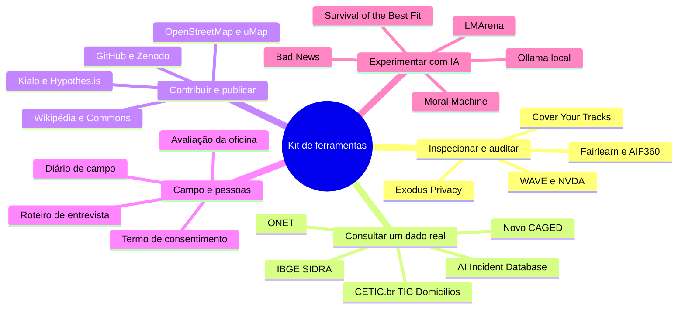
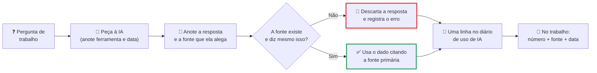

# Kit de ferramentas de Computação e Sociedade

> [!quote] Aqui a opinião vem depois da evidência
> *Toda página desta disciplina manda você fazer alguma coisa: consultar um dado, auditar um sistema, entrevistar uma pessoa, publicar um material. Esta página é a caixa de ferramentas: onde fazer, com que conta, seguindo qual passo e com que resultado na mão no fim. Ela é cobrada em todos os trabalhos de [[Possíveis trabalhos e projetos de Computação, Sociedade e Inclusão]].*

As atividades se organizam em cinco famílias, e nenhuma se resolve escrevendo no caderno. As seções **1 a 4** são ferramentas (onde clicar), as **5 a 8** são métodos (como fazer com rigor) e a **9** é a regra da casa sobre IA.

---

## 1. 🧰 Contas e ferramentas da disciplina

Crie estas contas **na primeira semana**, com o seu e-mail pessoal (não o institucional, para não perder acesso depois de formado). Nenhuma cobra nada para o uso que a disciplina pede.

![[Recursos/Computação, Sociedade e Inclusão/Kit de ferramentas de Computação e Sociedade/hypothesis-icone.png|Ícone do Hypothes.is, a ferramenta de anotação social usada nas leituras da disciplina (Wikimedia Commons, CC BY-SA 4.0)]]

| Ferramenta | Para quê | Link | Grátis? | Como criar a conta |
|---|---|---|---|---|
| **Wikipédia (pt)** | Editar um verbete com fonte | <https://pt.wikipedia.org/wiki/Wikipédia:Tutorial> | Sim | "Criar uma conta" no topo direito; e-mail é opcional |
| **Wikimedia Commons** | Subir foto em licença livre, com URL permanente | <https://commons.wikimedia.org/wiki/Special:UploadWizard> | Sim | A mesma conta da Wikipédia serve; exige login antes de subir |
| **Hypothes.is** | Anotar textos e PDFs na margem e responder ao colega | <https://hypothes.is/signup> | Sim (uso individual) | E-mail e senha em `hypothes.is/signup`, depois a extensão do Chrome |
| **Kialo Edu** | Árvore de argumentos pró e contra, com fonte em cada nó | <https://www.kialo-edu.com/register> | Sim ("free and always will be") | Registre-se como estudante e entre pelo link da turma |
| **GitHub** | Publicar o REA, o código e o histórico do projeto | <https://github.com/signup> | Sim | E-mail, senha e nome de usuário; ative a verificação em duas etapas |
| **Zenodo** | Depositar o REA e receber um **DOI** citável | <https://zenodo.org/signup/> | Sim (CERN e OpenAIRE) | Cadastro por e-mail, ORCID ou GitHub; o DOI sai em segundos |
| **OpenStreetMap** | Mapear acessibilidade, wi-fi público, serviços | <https://www.openstreetmap.org/user/new> | Sim | E-mail e senha; a edição vale no mapa mundial |
| **uMap** | Mapa temático sobre o OpenStreetMap, com link público | <https://umap.openstreetmap.fr/> | Sim | Dá para criar sem conta, mas só com conta ele fica salvo |
| **Google Colab** | Rodar Python no navegador sem instalar nada | <https://colab.research.google.com/> | Sim | Use a conta Google que você já tem |
| **Ollama** | Rodar um modelo **no seu computador**, sem mandar dado para fora | <https://ollama.com/> | Sim | Baixe o instalador (Windows, macOS, Linux); sem conta |
| **Fala.BR** | Pedido pela Lei de Acesso à Informação, com protocolo | <https://falabr.cgu.gov.br/> | Sim | Entre com a conta **gov.br** que você já usa |
| **e-Cidadania (Senado)** | Apoiar ou criar ideia legislativa; consulta pública | <https://www12.senado.leg.br/ecidadania> | Sim | Cadastro no portal; ideia legislativa precisa de 20.000 apoios |
| **Brasil Participativo** | Consultas e conferências do governo federal | <https://brasilparticipativo.presidencia.gov.br/> | Sim | Login pelo gov.br ou conta por e-mail |

Na hora de publicar (GitHub, Zenodo, Commons), a licença é escolha, não detalhe: do topo para a base do espectro abaixo a liberdade diminui, e só as faixas verdes são Obra Cultural Livre. Gere a sua em <https://creativecommons.org/chooser/>.

![[Recursos/Computação, Sociedade e Inclusão/Kit de ferramentas de Computação e Sociedade/espectro-licencas-creative-commons.png|Espectro das licenças Creative Commons, do domínio público (CC0, no topo) ao todos os direitos reservados (na base). Verde escuro = obra cultural livre (Wikimedia Commons, Shaddim, CC BY 4.0)]]

> [!warning] Duas correções de rota (03/09/2026)
> **O Participa + Brasil foi encerrado**: a própria página manda migrar para o **Brasil Participativo**, no ar com **424 processos participativos** ativos. E o painel **`data.cetic.br` estava fora do ar** ("temporariamente indisponível enquanto realizamos melhorias"): o plano B, que funciona, está na seção 2.

> [!example] 🧪 Atividade 1: abrir as contas e deixar rastro público
> **Ferramentas:** [Wikipédia](https://pt.wikipedia.org/wiki/Wikipédia:Tutorial) · [Hypothes.is](https://hypothes.is/signup) · [Kialo Edu](https://www.kialo-edu.com/register) · [GitHub](https://github.com/signup)
>
> 1. Crie as **quatro contas** e anote o nome de usuário de cada uma (é ele que identifica o seu trabalho, não o seu nome).
> 2. Na Wikipédia, abra a sua página de testes (`Especial:Minha página/Testes`), escreva três linhas e salve: é uma edição real, com registro público.
> 3. Instale o Hypothes.is (extensão do Chrome, ou o *bookmarklet* para Firefox e Safari; as duas opções em <https://web.hypothes.is/start/>).
> 4. Abra "AI as Normal Technology" (<https://knightcolumbia.org/content/ai-as-normal-technology>), selecione uma frase de que você **discorda** e publique **uma anotação pública** dizendo por quê, em duas linhas.
>
> **Resultado esperado:** quatro nomes de usuário anotados, o link do seu histórico (`pt.wikipedia.org/wiki/Especial:Contribuições/SEU_USUÁRIO`) e o **link público da anotação**.
>
> 📱 **Só com celular:** as quatro contas se criam no navegador. O Hypothes.is não tem extensão no celular: use o proxy, colando a URL depois de `https://via.hypothes.is/`.

---

## 2. 🔎 Fontes de dados confiáveis

**Número sem fonte não vale nada, e fonte sem data vale menos ainda.** Cada linha traz uma consulta já feita, com o resultado, para você conferir se chegou ao mesmo lugar.

![[Recursos/Computação, Sociedade e Inclusão/Kit de ferramentas de Computação e Sociedade/nic-br-logo.png|O NIC.br mantém o CETIC.br, que produz as pesquisas TIC Domicílios, TIC Educação e TIC Empresas: a fonte primária brasileira sobre acesso e uso de tecnologia (Wikimedia Commons, domínio público)]]

| Fonte | Exemplo de consulta e o resultado que saiu | Link |
|---|---|---|
| **CETIC.br, TIC Domicílios** | Acesso **só pelo celular**, 2025: **87% na classe DE** contra **5% na classe A**; computador no domicílio, classe DE: **10%** | <https://cetic.br/pt/pesquisa/domicilios/indicadores/> |
| **CETIC.br, TIC Educação** | 2025 (2.404 escolas): **7 em cada 10 alunos do Ensino Médio** usam IA generativa em pesquisa escolar, mas **só 32%** receberam orientação; **22% das escolas** têm guia de uso de IA | <https://cetic.br/pt/pesquisa/educacao/indicadores/> |
| **CETIC.br, TIC Empresas** | Indicador "empresas que utilizaram tecnologias de IA", por porte e forma de aquisição | <https://cetic.br/pt/pesquisa/empresas/indicadores/> |
| **IBGE SIDRA (API)** | `.../values/t/4714/n6/3300605/v/93/p/2022` devolve JSON: **Bom Jesus do Itabapoana, 35.173 pessoas** no Censo 2022 | <https://sidra.ibge.gov.br/> |
| **IBGE Cidades** | Bom Jesus x Itaperuna em população, renda e escolaridade, lado a lado | <https://cidades.ibge.gov.br/> |
| **Novo CAGED** | Saldo de emprego formal por município, setor e ocupação; referência mais recente publicada: **julho de 2026** | <https://www.gov.br/trabalho-e-emprego/pt-br/assuntos/estatisticas-trabalho/novo-caged> |
| **O\*NET (EUA)** | `Software Developers` (**15-1252.00**): **17 tarefas**, crescimento 2024-2034 "muito acima da média (7% ou mais)", mediana de **US\$ 135.980** ao ano | <https://www.onetonline.org/link/summary/15-1252.00> |
| **Will Robots Take My Job** | Risco por ocupação, a partir de Frey e Osborne (2013): bom contraste com a OIT, que mede por tarefa. ⚠️ Bloqueia leitura automatizada, abre no navegador | <https://willrobotstakemyjob.com/> |
| **dados.gov.br** | Abra um conjunto e responda: tem dicionário? última atualização? em que formato? | <https://dados.gov.br/> |
| **Base dos Dados** | Consulta SQL no BigQuery sobre IBGE, INEP, Receita ou TSE, com link compartilhável | <https://basedosdados.org/> |
| **Portal da Transparência** | Numa ação ligada a IA, **empenhado x pago**: a diferença entre anunciado e executado é o achado | <https://portaldatransparencia.gov.br/> |
| **Our World in Data** | **14.089 gráficos**, todos com download em CSV e licença CC BY | <https://ourworldindata.org/> |
| **Stanford AI Index** | Edição **2026**: **9 capítulos** (P&D, desempenho, IA responsável, economia, ciência, medicina, educação, política, opinião pública), PDF gratuito | <https://hai.stanford.edu/ai-index/2026-ai-index-report> |
| **WEF, Future of Jobs** | Edição 2025: **170 milhões** de empregos criados e **92 milhões** deslocados até 2030, saldo **+78 milhões** | <https://reports.weforum.org/docs/WEF_Future_of_Jobs_Report_2025.pdf> |
| **OIT, exposição à IA** | 20/05/2025: **1 em cada 4 trabalhadores** do mundo em ocupação exposta; na faixa mais alta, **4,7% do emprego feminino** contra **2,4% do masculino** | <https://www.ilo.org/publications/generative-ai-and-jobs-refined-global-index-occupational-exposure> |
| **AI Incident Database** | Escolha um incidente do ano e responda: quem foi prejudicado, quem implantou, que tipo de falha | <https://incidentdatabase.ai/apps/incidents/> |
| **Estatísticas da Wikipédia** | Em 03/09/2026: **7.234.960 artigos em inglês** contra **1.181.481 em português**, razão de 6 para 1, em **348 Wikipédias ativas** | <https://meta.wikimedia.org/wiki/List_of_Wikipedias> |
| **Câmara dos Deputados** | **PL 2338/2023** (marco da IA): em 03/09/2026, **37 proposições apensadas** e último despacho de **02/09/2026** | <https://www.camara.leg.br/proposicoesWeb/fichadetramitacao?idProposicao=2487262> |
| **Google Trends** | "inteligência artificial" x "ChatGPT" no Brasil em 5 anos: anote a data do salto | <https://trends.google.com/trends/> |
| **Wayback Machine** | Duas datas da mesma URL lado a lado. ⚠️ Instável em 03/09/2026; plano B: histórico de versões da página, ou PDF datado | <https://web.archive.org/> |

> [!tip] Como citar um número sem levar bronca
> Errado: "a maioria dos brasileiros pobres só acessa a internet pelo celular". Certo: **"87% dos domicílios da classe DE acessam a internet exclusivamente pelo celular (CETIC.br, TIC Domicílios 2025)"**, com o link. Obrigatórios: **valor**, **pesquisa** e **ano do dado** (que não é o ano em que você leu).

> [!example] 🧪 Atividade 2: dois números, duas fontes primárias
> **Ferramentas:** [CETIC.br](https://cetic.br/pt/pesquisa/domicilios/indicadores/) e [IBGE SIDRA](https://sidra.ibge.gov.br/)
>
> 1. Antes de abrir qualquer fonte, peça a um chatbot os dois números dos passos 2 e 3, e anote as respostas.
> 2. No CETIC.br, abra os indicadores da TIC Domicílios, selecione **2025**, escolha um indicador (há um módulo **M, de inteligência artificial**), baixe o XLSX e anote **um valor** com o recorte, o nome do indicador e o ano da coleta.
> 3. No SIDRA, rode a consulta de população do **seu** município trocando `3300605` na URL da tabela acima.
>
> **Resultado esperado:** tabela de três colunas (**o que a IA respondeu** · **o número oficial** · **a diferença**) e os dois links. Para Bom Jesus, o SIDRA devolve **35.173**: se o chatbot deu outro número, você já tem a primeira linha do seu diário de uso de IA.
>
> 📱 **Só com celular:** a URL da API do SIDRA devolve o JSON na tela; o XLSX abre no app de planilha.

---

## 3. 🔐 Autoinspeção e privacidade

Antes de auditar o sistema dos outros, audite o seu rastro. Tudo abaixo mostra dados **sobre você** e nada exige instalar coisa duvidosa.

| Ferramenta | O que revela | Link | Nota |
|---|---|---|---|
| **Google Takeout** | O volume real do seu rastro: localização, YouTube, buscas, fotos | <https://takeout.google.com/> | O arquivo demora horas: **peça uma semana antes** |
| **Minha Atividade** | A linha do tempo do que você buscou e assistiu | <https://myactivity.google.com/> | Anote antes de apagar |
| **Google Ad Settings** | Idade, gênero, estado civil e interesses que o Google **inferiu** | <https://myadcenter.google.com/> | Classifique 10 inferências em certo, errado e assustadoramente certo |
| **Anúncios da Meta** | A lista literal de interesses inferidos pelo Instagram e Facebook | <https://accountscenter.facebook.com/ads> | Print sem expor terceiros |
| **ToS;DR** | Nota de A a E dos termos de uso, com as cláusulas ruins | <https://tosdr.org/> | Em 03/09/2026: **Google grau E**, **Facebook grau E**, **OpenAI grau C** |
| **Exodus Privacy** | Rastreadores e permissões de cada app Android | <https://reports.exodus-privacy.eu.org/> | Busque pelo nome do app ou pelo link da Play Store |
| **Cover Your Tracks** | Se o seu navegador é **único**, e quantos bits de entropia identificam você | <https://coveryourtracks.eff.org/> | Da EFF, sem cadastro; botão "Test Your Browser" |
| **AmIUnique** | Confirmação em outra base, atributo por atributo | <https://amiunique.org/fingerprint> | Projeto acadêmico da Université de Lille |
| **Have I Been Pwned** | Em que vazamentos o seu e-mail apareceu, com data | <https://haveibeenpwned.com/> | Em 03/09/2026: **1.034 vazamentos** e **17.805.159.840 contas** |
| **Am I in The Stack?** | Se o **seu código** do GitHub entrou no dataset de treino The Stack | <https://huggingface.co/spaces/bigcode/in-the-stack> | Substitui o Have I Been Trained (<https://haveibeentrained.com/>), **em manutenção** em 03/09/2026 |
| **DevTools** | Quantos domínios de terceiros uma página de notícia contata | `F12` → **Application → Cookies** e aba **Network** | Nativo, não instala nada |

> [!example] 🧪 Atividade 3: descubra se você é único na multidão
> **Ferramenta:** [Cover Your Tracks, da Electronic Frontier Foundation](https://coveryourtracks.eff.org/)
>
> 1. Abra no seu navegador de sempre e clique em **"Test Your Browser"**.
> 2. Anote: se a impressão digital é **única**, quantos **bits de entropia** identificam você e quais **três atributos** mais contribuíram (fontes instaladas, resolução, WebGL).
> 3. Repita em janela anônima, depois com um bloqueador ligado, depois no **navegador do celular**.
>
> **Resultado esperado:** tabela dos quatro testes lado a lado e a resposta a uma pergunta incômoda: **em qual você ficou menos identificável, e por que a janela anônima quase não mudou nada?**

---

## 4. 🧪 Auditoria e teste

Auditar é medir o comportamento de um sistema com método declarado, não achar que ele é bom ou ruim. Três frentes aparecem nos trabalhos: **acessibilidade**, **viés de modelo** e **comparação de modelos**.

| Ferramenta | O que audita, e o que custa | Link |
|---|---|---|
| **WAVE (WebAIM)** | Acessibilidade: erros, alertas e contraste, com o critério WCAG de cada um. Grátis, com extensão em <https://wave.webaim.org/extension> | <https://wave.webaim.org/> |
| **axe DevTools** | O mesmo, no navegador, com lista priorizada. Extensão do Chrome com teste de 14 dias; o avançado é pago (use o WAVE se não quiser cadastro) | <https://www.deque.com/axe/devtools/> |
| **Lighthouse** | Aba "Accessibility" do `F12`, nota de 0 a 100. Nativo no Chrome | Nativo |
| **NVDA** | Usar um site **de olhos fechados**, só com leitor de tela. Livre, **só Windows** (versão 2026.2); no Linux, o **Orca** | <https://www.nvaccess.org/download/> |
| **Coblis** | Como a interface é vista por quem tem daltonismo. Grátis e local: a imagem não sai do seu computador | <https://www.color-blindness.com/coblis-color-blindness-simulator/> |
| **VLibras** | Tradução de conteúdo digital para Libras. Grátis e de código aberto (governo federal e UFPB) | <https://www.gov.br/governodigital/pt-br/acessibilidade-e-usuario/vlibras> |
| **Fairlearn** | Disparidade de um classificador por grupo: paridade demográfica, *equalized odds*, taxa de seleção. Grátis | <https://fairlearn.org/> |
| **AI Fairness 360** | O mesmo, com algoritmos de mitigação prontos. Grátis (IBM e LF AI) | <https://aif360.res.ibm.com/> |
| **What-If Tool** | Mexer nos dados e ver a decisão do modelo mudar, sem código. Grátis (Google PAIR) | <https://pair-code.github.io/what-if-tool/> |
| **LMArena** | Votar às cegas entre dois modelos e comparar com o ranking. Grátis; `lmarena.ai` redireciona para `arena.ai` | <https://lmarena.ai/> |
| **Ollama** | Rodar um modelo aberto local e comparar com um da nuvem. Grátis | <https://ollama.com/> |
| **Hugging Face Spaces** | Testar demos de modelos e detectores sem instalar nada. Grátis, com fila | <https://huggingface.co/spaces> |
| **Moral Machine (MIT)** | Dilemas de veículo autônomo, com o seu perfil comparado ao do mundo. Grátis. ⚠️ Carrega por JavaScript: abra no navegador | <https://moralmachine.net/> |
| **Survival of the Best Fit** | Treinar um "modelo de contratação" e ver o viés nascer do dado que você deu. Grátis, cerca de **6 minutos** (Mozilla Foundation) | <https://www.survivalofthebestfit.com/> |
| **Bad News** | Jogar como produtor de desinformação e aprender as táticas por dentro. Grátis | <https://www.getbadnews.com/> |

### 4.1 O Colab de auditoria de viés, pronto para rodar

O caminho oficial do **Fairlearn** é a galeria de exemplos (<https://fairlearn.org/main/auto_examples/index.html>); o mais próximo dos trabalhos é o **Credit Loan Decisions** (<https://fairlearn.org/main/auto_examples/plot_credit_loan_decisions.html>), com 30.000 registros de inadimplência de cartão e cálculo de acurácia balanceada, taxa de falso positivo, taxa de falso negativo, taxa de seleção e **diferença de *equalized odds***. O repositório do Fairlearn **não guarda arquivos `.ipynb`**: eles saem no pacote do fim da galeria (`Download all examples in Jupyter notebooks`, hoje em <https://fairlearn.org/_downloads/6f1e7a639e0699d6164445b55e6c116d/auto_examples_jupyter.zip>), e você sobe no Colab por **Arquivo → Fazer upload de notebook**.

Para **um clique só**, o AIF360 tem notebook no GitHub, e o Colab abre notebook do GitHub sem download:

`https://colab.research.google.com/github/Trusted-AI/AIF360/blob/main/examples/tutorial_credit_scoring.ipynb`

> [!example] 🧪 Atividade 4: rodar uma auditoria de viés até o fim
> **Ferramentas:** [Google Colab](https://colab.research.google.com/) · [Fairlearn](https://fairlearn.org/main/auto_examples/index.html) · [AIF360](https://colab.research.google.com/github/Trusted-AI/AIF360/blob/main/examples/tutorial_credit_scoring.ipynb)
>
> 1. Abra o notebook do AIF360 pelo link do Colab e rode **todas** as células até a última (se pedir reinício depois do `pip install`, reinicie e rode de novo).
> 2. Localize a métrica `mean_difference` **antes** e **depois** do `Reweighing`.
> 3. Num segundo notebook, rode `!pip install fairlearn`, cole o código do exemplo Credit Loan Decisions e rode até a tabela de métricas por grupo aparecer.
> 4. Responda em cinco linhas: **que definição de justiça** o notebook usou e **o que ela sacrificou**? (Kleinberg e colegas provaram em 2016 que calibração e *equalized odds* não podem valer ao mesmo tempo: <https://arxiv.org/abs/1609.05807>.)
>
> **Resultado esperado:** no AIF360, o `mean_difference` do German Credit sai de **-0,169905** (17% de desvantagem para o grupo não privilegiado) e vai a **0,0** depois do `Reweighing`. Print das duas células, a tabela do Fairlearn e o parágrafo da pergunta 4.

> [!example] 🧪 Atividade 5: auditoria de acessibilidade em 15 minutos
> **Ferramenta:** [WAVE, do WebAIM](https://wave.webaim.org/)
>
> 1. Rode o WAVE na home do portal do IFF (<https://portal1.iff.edu.br>) e no site da prefeitura da sua cidade, anotando **erros**, **alertas** e **erros de contraste** de cada um.
> 2. Abra os três erros mais fáceis de corrigir e anote o **critério WCAG 2.2** de cada um pelo número (1.1.1, 1.4.3, 2.4.4).
> 3. Rode a mesma página no **Lighthouse** (`F12` → Lighthouse → Accessibility) e compare a nota com a contagem do WAVE; depois suba uma captura no **Coblis** e veja se algum aviso importante depende só da cor.
>
> **Resultado esperado:** tabela com dois sites, três contagens cada, os três critérios WCAG por número e uma frase sobre **qual erro um usuário de leitor de tela sentiria primeiro**. Erro grave em site público vira ofício, e ofício é extensão ([[Projeto de Extensão - IA para Todos]]).
>
> 📱 **Só com celular:** o WAVE roda colando a URL. No lugar do NVDA, use **TalkBack** (Android) ou **VoiceOver** (iPhone) e tente uma tarefa de olhos fechados, cronometrando.

---

## 5. 📓 Métodos de campo: entrevista, diário e ética

Todo dado de campo desta disciplina nasce de **uma pessoa real que consentiu**.

### 5.1 Roteiro de entrevista (8 perguntas)

Serve para o T2, para o projeto de extensão e para qualquer conversa que vire evidência; dura de 15 a 25 minutos. Adapte o vocabulário, nunca a ordem: a primeira pergunta é para a pessoa relaxar, a última é para você descobrir o que não sabia perguntar.

> 1. Me conta como é um dia normal de trabalho seu, do começo ao fim.
> 2. O que mudou no seu trabalho nos últimos três anos?
> 3. Que ferramentas digitais ou de inteligência artificial você usa hoje? Como aprendeu a usar?
> 4. Tem alguma parte do seu trabalho que uma máquina ou um programa já faz? Como foi quando isso mudou?
> 5. E o que do seu trabalho você acha que nenhuma máquina faz? Me dá um exemplo.
> 6. Quando você pensa nos próximos cinco anos, o que te preocupa?
> 7. Se um jovem de 20 anos dissesse que quer essa profissão, o que você diria a ele?
> 8. Tem alguma coisa importante que eu não perguntei e que você acha que eu deveria saber?

**Cinco regras que fazem diferença.** Pergunta aberta, nunca de sim ou não. Não sugira a resposta ("você não acha que a IA vai acabar com isso?" já contaminou o dado). Depois da resposta, **fique três segundos em silêncio**: é aí que vem a parte boa. Peça exemplo sempre que ouvir um adjetivo. Anote na hora, entre aspas, a **fala literal** mais forte. **Variação para trabalhador de aplicativo:** troque as perguntas 3 a 6 por horas por semana, renda líquida **depois** dos custos, quem paga manutenção e combustível, o que acontece quando o aplicativo bloqueia a conta, e se conhece o PLP 12/2024.

### 5.2 Consentimento (copie e use)

Para entrevista, o consentimento **verbal gravado** basta, desde que gravado antes de começar. Para foto e vídeo, tem que ser escrito.

> **Consentimento verbal para entrevista (leia com a gravação já ligada)**
>
> "Meu nome é [nome], sou estudante de Engenharia de Computação no Instituto Federal Fluminense, campus Bom Jesus do Itabapoana. Esta conversa faz parte de um trabalho da disciplina Computação, Sociedade e Inclusão. Vou gravar para transcrever, e no trabalho o seu nome não vai aparecer: você será identificado só pela profissão e pela idade aproximada. Você pode não responder qualquer pergunta e pode pedir para parar a qualquer momento. A gravação será apagada depois da entrega. Você concorda em participar e em ser gravado? Por favor, responda em voz alta."

> **Termo de consentimento para uso de imagem (oficina de extensão)**
>
> **Projeto:** oficina "IA para Todos", disciplina Computação, Sociedade e Inclusão, Instituto Federal Fluminense, campus Bom Jesus do Itabapoana.
> **Data e local:** ____/____/2026, em ______________________________.
>
> Eu, ______________________________________, autorizo o uso da minha **imagem** (fotografias feitas durante a oficina) exclusivamente no **relatório acadêmico da disciplina, na apresentação em sala e no material educacional aberto** produzido pela equipe. Estou ciente de que: a) a participação na oficina **não depende** desta autorização; b) **não** haverá uso comercial, publicitário nem político da imagem; c) posso revogar esta autorização a qualquer momento, avisando a equipe ou o professor responsável; d) meu nome completo **não** será divulgado junto à imagem sem pedido meu.
>
> Assinatura: ______________________________ Contato (opcional): __________________
> Responsável pela equipe: ______________________________

> [!warning] Ética que não se negocia
> **LGPD:** colete o mínimo (nome e assinatura na lista, nada de CPF, RG ou endereço), diga para que serve, e apague o áudio depois da entrega. **Menores:** além da autorização do responsável e da escola, a regra da disciplina é mais rígida que a lei, **nenhuma foto com rosto identificável de menor**; fotografe mãos, telas, o quadro, a sala de costas. **Anonimização:** no texto, "E1, motorista de aplicativo, 34 anos"; a chave de quem é E1 fica fora do arquivo entregue. **Nunca** peça, digite ou fotografe senha, CPF, código de verificação ou dado bancário de ninguém. **Nunca** entre em grupo fechado sem permissão de quem administra.

### 5.3 Gravar, transcrever com IA e conferir

**Grave** com o celular mesmo, dizendo data, local e consentimento nos primeiros 30 segundos (isso vira a sua prova). **Transcreva** com IA, que é permitido e economiza horas. **Confira três trechos**, e os três mais importantes, não os mais fáceis: o número citado, o nome próprio e a frase que vai entre aspas, porque transcritor automático erra nome, número e gíria regional exatamente onde dói. Por fim, **anonimize** e **registre no diário de uso de IA** (seção 6.5) a ferramenta, os trechos conferidos e os erros corrigidos.

### 5.4 Diário de campo (template)

Para a etnografia digital do T3 e para qualquer observação. Uma entrada por dia, mínimo dez. A regra de ouro é a coluna 4: **fato e impressão nunca na mesma coluna**.

| Data e hora | Onde (plataforma, grupo) | O que aconteceu (só fatos) | O que eu estranhei (impressão minha) | Termos nativos | Regra implícita percebida | Pergunta que ficou |
|---|---|---|---|---|---|---|
| 12/10, 20h10 a 20h50 | Grupo público de trocas, WhatsApp | 14 mensagens, 9 delas ofertas com foto e preço; 2 pessoas responderam em privado; 1 foi advertida pelo administrador às 20h32 | Achei a advertência rude, mas ninguém mais reclamou | "no PV", "reservado", "tá em pé?" | Negociar preço é no privado, nunca no grupo | Quem decide o que é propaganda demais? |
| | | | | | | |

**Descrição densa (Geertz), na prática:** não basta anotar que a pessoa piscou; é preciso saber se foi tique ou piscadela cúmplice, e isso só a teia de significados do grupo diz. Escolha **três episódios** e reescreva cada um explicando o que aquilo **significa ali**, para quem, e o que aconteceria se alguém fizesse diferente. Isso é análise; o resto é resumo.

### 5.5 Observação de uso (acompanhar alguém usando um serviço)

Sente-se **ao lado** de alguém (uma pessoa idosa, um familiar sem intimidade com tecnologia) enquanto ela tenta uma tarefa real no gov.br, no Meu INSS ou no site da prefeitura. Defina **uma tarefa** e um critério de sucesso antes de começar. **Não ajude** nos cinco primeiros minutos e cronometre; só ajude quando pedirem, anotando **em que ponto exato** pediram. Classifique as barreiras por tipo: linguagem, navegação, técnica (deu erro), física (letra pequena, alvo de toque pequeno) e confiança (medo de clicar). Feche perguntando "o que você faria se eu não estivesse aqui?": a resposta costuma ser o achado do trabalho.

> [!abstract] 🧠 Lente filosófica: Paulo Freire (Extensão ou comunicação?, 1969) 📗
> Freire não é tecnófobo, e a crítica dele não é à tecnologia: é ao **modelo de transferência**. Em *Extensão ou comunicação?* ele descreve a invasão cultural como o gesto de um sujeito que parte do próprio espaço histórico e cultural "para penetrar outro espaço histórico-cultural, superpondo aos indivíduos deste seu sistema de valores". Quem entrevista para confirmar a hipótese que já trouxe pronta está invadindo, não pesquisando: conhecer, para Freire, é ato entre sujeitos mediado pelo mundo. Em *Pedagogia da Esperança* (1992) ele fecha a posição sobre técnica: o fundamental é "a assunção de uma posição crítica, vigilante, indagadora, em face da tecnologia. Nem, de um lado, demonologizá-la, nem, de outro, divinizá-la". **Pergunta para o seu relatório: o que a pessoa entrevistada te ensinou que você não esperava aprender?** Sem resposta, volte a campo.

> [!example] 🧪 Atividade 6: entrevista de 5 minutos, transcrita e conferida
> **Ferramentas:** gravador do celular · transcrição automática por IA · roteiro da seção 5.1
>
> 1. Escolha **uma pessoa real** (familiar, vizinho, colega de outro curso) e peça 5 minutos.
> 2. Ligue a gravação e **leia o consentimento verbal** da seção 5.2 antes da primeira pergunta.
> 3. Faça as perguntas **1, 3, 5 e 8** do roteiro, com três segundos de silêncio depois de cada resposta.
> 4. Transcreva com IA e **confira três trechos** contra o áudio: um número, um nome próprio e a frase que vai citar.
>
> **Resultado esperado:** a transcrição, os três trechos conferidos com **o que estava errado** na versão automática (quase sempre há algo) e uma citação anonimizada assim: `"frase literal" (E1, professora, 52 anos, entrevista em 08/09/2026)`.
>
> 📱 **Só com celular:** grave, transcreva e escreva tudo no celular; a conferência é ouvindo o áudio com fone.

---

## 6. 📝 Métodos de escrita e argumentação

### 6.1 Policy brief de 2 páginas (esqueleto)

O gênero mais curto e mais poderoso da política pública: quem lê tem 4 minutos e vai decidir algo. **Sem introdução histórica, sem "desde os primórdios".**

| Bloco | Tamanho | O que entra |
|---|---|---|
| **Título** | 1 linha | Afirmativo, com o pedido dentro: "Levar conectividade às 6 escolas rurais de Bom Jesus custa X e cabe no PDDE" |
| **Resumo executivo** | 5 linhas | Problema, o número que o prova, recomendação, custo, prazo. Se o leitor parar aqui, já sabe o que você quer |
| **O problema** | 1 parágrafo | Dois dados locais ou regionais com fonte e ano. Se o dado **não existe**, diga: a ausência é achado e vira recomendação |
| **Por que agir agora** | 3 linhas | A janela: um edital aberto, uma lei que entrou em vigor, um prazo |
| **Opções** | tabela de 3 linhas | Sempre três, incluindo **"não fazer nada"**, cada uma com custo aproximado, fonte de financiamento possível (Fust, PBIA, emenda, FAPERJ, edital dos IFs, FBB) e um caso parecido, com link |
| **Recomendação** | 1 parágrafo | Uma opção e por quê; quem faz, com quem, começando quando |
| **Primeiros 12 meses** | 4 marcos | Data, entregável, responsável |
| **Indicadores** | 2 linhas | Cada um com **valor de partida** e meta ("de 10% para 40% de domicílios com computador na classe DE") |
| **Riscos** | 2 linhas | O que pode dar errado e o que você faria |
| **Referências** | até 8 | Só o que foi citado, em ABNT, com data de acesso |

**Relatório com evidência** segue a mesma espinha: contexto e público → o que foi feito → evidências → resultados → o que aprendemos → próximos passos → referências. A diferença entre nota alta e baixa está no bloco de evidências: tabela, número com fonte, print com data, transcrição, link do que foi publicado. **Adjetivo não é evidência.**

### 6.2 ABNT em 6 linhas

1. **Livro:** SOBRENOME, Nome. *Título: subtítulo*. 2. ed. Cidade: Editora, ano.
2. **Capítulo:** SOBRENOME, Nome. Título do capítulo. In: SOBRENOME, Nome (org.). *Título do livro*. Cidade: Editora, ano. p. 15-32.
3. **Artigo:** SOBRENOME, Nome. Título do artigo. *Nome da Revista*, v. 46, n. 2, p. 85-101, ano. DOI: 10.xxxx/yyyy.
4. **Web:** ENTIDADE ou SOBRENOME, Nome. *Título da página*. ano. Disponível em: https://url. Acesso em: 3 set. 2026.
5. **Lei:** BRASIL. *Lei nº 13.709, de 14 de agosto de 2018*. Lei Geral de Proteção de Dados Pessoais. Brasília, DF: Presidência da República, 2018.
6. **No texto:** citação direta curta entre aspas com `(SOBRENOME, ano, p. 45)`; paráfrase sem aspas com `(SOBRENOME, ano)`; citação de mais de 3 linhas em parágrafo recuado, fonte menor e **sem** aspas.

### 6.3 Ler um artigo científico em 20 minutos

| Minutos | O que fazer |
|---|---|
| 0 a 3 | Título, resumo, palavras-chave, ano, veículo e **quem financiou** |
| 3 a 6 | Pule para a **conclusão**: ela diz o que você vai encontrar no meio |
| 6 a 10 | **Figuras e tabelas**, com as legendas. É onde mora o resultado |
| 10 a 15 | Método: **o que mediram, em quantos casos, onde e quando** |
| 15 a 18 | A seção de **limitações** (todo artigo honesto tem uma) |
| 18 a 20 | Escreva 3 frases: o que perguntaram, o que acharam e **o que isso não prova** |

Faça isso com anotação pública no [Hypothes.is](https://web.hypothes.is/): a turma lê o mesmo texto uma vez só, com as dúvidas na margem.

### 6.4 Zotero

Gerenciador de referências gratuito e de código aberto (<https://www.zotero.org/download>): o conector do navegador captura o artigo com um clique e o editor de texto gera a lista de referências no estilo escolhido (mais de 9.000 estilos, ABNT incluído). Para uma citação avulsa sem instalar nada, <https://zbib.org/>.

### 6.5 Usar IA sem plagiar: pedir, verificar, registrar

O **diário de uso de IA** é obrigatório em todos os trabalhos, tem 1 página e vai antes das referências. Uma linha por marco:

| Data | Marco | O que pedi (ferramenta, versão, prompt em 1 linha) | O que veio | O que estava errado | O que eu fiz | Evidência |
|---|---|---|---|---|---|---|
| 08/09 | Dado de conectividade | Chatbot X, "% de domicílios da classe DE com acesso só pelo celular" | "cerca de 60%" | Sem fonte e sem ano; valor divergente | Abri a TIC Domicílios 2025 e li a tabela | 87%, CETIC.br, TIC Domicílios 2025, com link |
| 12/09 | Citação de Freire | Chatbot X, "cite Freire sobre tecnologia" | Frase atribuída à *Pedagogia do Oprimido* | A frase **não existe** no livro | Troquei pela frase verificada de *Pedagogia da Esperança* | PDF do Acervo Paulo Freire, com página |

No fim, a **declaração de uso**: quais ferramentas, para quê, quais trechos foram gerados e revisados por você, e o que foi feito sem IA nenhuma.

> [!example] 🧪 Atividade 7: peça, verifique, registre (o método inteiro em 30 minutos)
> **Ferramentas:** um chatbot qualquer · a fonte primária correspondente · a tabela acima
>
> 1. Escolha **três afirmações factuais** de que você precisa para algum trabalho: um percentual, uma data de lei, uma citação de autor.
> 2. Peça as três a um chatbot **exigindo a fonte** de cada uma e copie a resposta inteira.
> 3. Abra as três fontes citadas e marque cada uma: **existe e diz isso** · **existe e diz outra coisa** · **não existe**.
> 4. Preencha três linhas do diário de uso de IA.
>
> **Resultado esperado:** as três linhas preenchidas e o **placar** das verificações. Traga o placar: a turma monta a taxa de erro do modelo naquele dia, com n conhecido. Esse número é seu, é datado e vale mais que qualquer manchete sobre alucinação.

---

## 7. 🗣️ Debate estruturado

![[Recursos/Computação, Sociedade e Inclusão/Kit de ferramentas de Computação e Sociedade/kialo-arvore-de-debate.png|Árvore de debate no formato do Kialo: verde para os argumentos que apoiam o nó pai, vermelho para os que o contradizem. Cada nó é uma afirmação isolada, com fonte (Wikimedia Commons, CC BY 4.0)]]

### 7.1 Formato Oxford, com tempos (50 minutos)

```mermaid
flowchart LR
    V1["🗳️ 0-3 min<br/>Votação inicial"] --> S["🎲 3-5 min<br/>Sorteio dos lados"]
    S --> P["📚 5-15 min<br/>Preparo com fontes"]
    P --> F1["🅰️ 15-19 min<br/>A favor, 1ª fala"]
    F1 --> F2["🅱️ 19-23 min<br/>Contra, 1ª fala"]
    F2 --> R1["↩️ 23-26 min<br/>Réplica do contra"]
    R1 --> R2["↩️ 26-29 min<br/>Réplica do a favor"]
    R2 --> Q["🙋 29-36 min<br/>Perguntas da plateia"]
    Q --> C["🏁 36-40 min<br/>Fechamentos, 2 min cada"]
    C --> V2["🗳️ 40-43 min<br/>Votação final"]
    V2 --> D["🔍 43-50 min<br/>Quem mudou e por qual evidência"]
    classDef chave stroke:#3182ce,stroke-width:3px
    class V1,V2 chave
```

Três regras fazem o formato funcionar. **O lado é sorteado**, então você vai defender aquilo em que talvez não acredite (é o ponto do exercício). **Vence quem moveu mais votos**, não quem tinha mais apoio no começo, e é para isso que servem as duas votações. No fechamento **não entra evidência nova**.

### 7.2 Regras de evidência (valem no debate e no trabalho)

- Toda afirmação com número precisa de **URL e ano projetados na tela** na hora. "Eu li em algum lugar" não conta.
- **Resposta de IA não é fonte.** A fonte é o documento que a IA citou, depois de você abrir e confirmar que ele existe e diz aquilo.
- Ataque o argumento, nunca a pessoa. Quem ataca a pessoa perde o ponto.
- Antes de discordar, **reformule o argumento do outro lado** até ele concordar com a sua reformulação.
- Espantalho, falso dilema, apelo à autoridade e generalização apressada estão catalogados em [[Anatomia de um Argumento]].

Para debate assíncrono, o [Kialo Edu](https://www.kialo-edu.com/) monta a árvore: tese no topo, argumentos pró e contra pendurados em cada nó, fonte em cada afirmação. A vantagem sobre o grupo de mensagens é que o mesmo argumento não pode ser repetido: ele já está lá, e você tem que responder **àquele nó**.

---

## 8. 🎪 Como fazer uma oficina com a comunidade

Resumo operacional; o enunciado completo (públicos, parceiros, rubrica, cronograma) está em [[Projeto de Extensão - IA para Todos]].

| Etapa | O que resolver antes |
|---|---|
| **Público e parceiro** | Público concreto (grupo de convivência, escola, sindicato) e uma pessoa de contato com nome e telefone; comece pela rede que a equipe já tem |
| **Objetivo verificável** | "Cada participante sai tendo feito **uma** coisa": uma pergunta a um assistente, um golpe identificado, uma configuração de privacidade ajustada |
| **Roteiro de 2 horas** | 10 min acolhida e lista · 20 min demonstração ao vivo · 60 min mão na massa no celular de cada um · 20 min riscos e onde buscar ajuda · 10 min avaliação e material para levar |
| **Materiais** | Cartilha impressa com letra grande, QR code do REA, projetor **e** plano B sem projetor, extensão de tomada, internet própria (nunca conte com o wi-fi do local), lista e termos impressos |
| **Evidências** | Lista assinada, 3 a 5 fotos com termo, avaliação com pelo menos 5 respostas, relato do dia escrito no mesmo dia |

**Lista de presença.** Cabeçalho com oficina, data, horário, local, instituição e equipe. Depois as colunas `Nº | Nome completo | Assinatura | Como soube da oficina (opcional)`. **Nunca peça CPF, RG, endereço ou telefone.**

**Formulário de avaliação, 5 perguntas (anônimo, em papel ou por QR code).**

> 1. De 1 a 5, quanto do que foi mostrado hoje você conseguiu entender? (1 = nada, 5 = tudo)
> 2. O que você conseguiu fazer hoje que não sabia fazer antes? (uma linha)
> 3. O que ficou confuso ou faltou explicar melhor?
> 4. Você acha que vai usar isso no seu dia a dia? ( ) Sim ( ) Talvez ( ) Não. Por quê?
> 5. Sobre o que você gostaria que fosse a próxima oficina?

**Relato do dia** (1 página, escrito no mesmo dia): data, horário e local · quantas pessoas vieram e qual o perfil · o que estava previsto · o que aconteceu de fato · **três perguntas que o público fez** (costumam valer mais que a oficina inteira) · o que deu errado · o que mudaríamos · evidências anexadas.

**Relatório de extensão** (até 8 páginas): 1. Identificação (equipe, público, parceiro, data, local) · 2. Contexto e justificativa com dados · 3. O que foi feito (o roteiro executado, não o planejado) · 4. Evidências · 5. Resultados da avaliação, com os números das 5 perguntas · 6. O que a equipe aprendeu, ligando a Freire, Cazeloto e tecnologia social · 7. Próximos passos e como o parceiro continua sozinho · 8. Referências e apêndices.

> [!warning] E se ninguém aparecer?
> Acontece, e não zera a nota se estiver documentado. **Avise o professor no mesmo dia**, escreva o relato mesmo assim (por que ninguém veio é dado: chuva, horário, divulgação tardia, o parceiro não avisou o grupo) e execute o **plano B** já previsto na proposta. O que zera é ficar calado e inventar uma oficina que não houve.

---

## 9. 🤖 Regras de uso de IA nesta disciplina

Usar IA é **permitido e esperado**: avalia-se o seu julgamento, a evidência que você produziu e a sua capacidade de defender o trabalho. Não se aceita entregar o que você não verificou.

| ✅ Permitido (e recomendado) | 📓 Obrigatório | 🚫 Fraude, nota 0 |
|---|---|---|
| Sugerir desenho de experimento, estrutura, roteiro | Registrar cada uso no **diário de uso de IA** (seção 6.5) | Entrevista, diário de campo, lista de presença ou dado **inventados** |
| Transcrever entrevista automaticamente | Conferir **três trechos** contra o áudio e dizer quais | Citação de autor, lei ou artigo que a IA gerou e você não abriu |
| Traduzir, revisar, melhorar a clareza | Declarar quais trechos foram gerados e revisados | Tabela de dados "gerada" em vez de coletada |
| Explicar conceito difícil, gerar código para o Colab | Verificar o conceito numa fonte primária | **Prompt injection** no PDF entregue, visível ou escondida |
| Comparar respostas de dois modelos e tabular | Anotar ferramenta, versão e data | Trabalho gerado que você não consegue defender oralmente |

> [!warning] O teste de defesa
> Na devolutiva, o professor escolhe **uma linha** da sua tabela, **uma entrada** do seu diário de campo ou **uma frase** da sua transcrição e pergunta o que é aquilo. Quem coletou responde em cinco segundos. As regras gerais de entrega (só PDF, prazo, atraso valendo 6,0) estão em [[Regras e boas práticas]] e em [[Possíveis trabalhos e projetos de Computação, Sociedade e Inclusão]].

---

## 10. 🇧🇷 No Brasil

**A fonte primária brasileira existe e é boa.** O CETIC.br, ligado ao NIC.br e ao CGI.br, roda desde 2005 pesquisas domiciliares presenciais com amostra nacional (a TIC Domicílios 2025 ouviu 27.177 domicílios): não é preciso citar consultoria estrangeira para falar de conectividade no Brasil. **E o acesso ao dado público é um direito com prazo**: pelo Fala.BR qualquer pessoa protocola um pedido a qualquer órgão federal e recebe protocolo, e o silêncio também é dado, recorrível.

**Mas o país publica mal sobre si mesmo.** Harvard publica em CC BY os módulos de ética das disciplinas de computação; ementas brasileiras equivalentes ficam em PDF escaneado, atrás de login ou em plano de ensino que não sai do sistema acadêmico. A universidade brasileira ainda não pratica recurso educacional aberto sobre si mesma ([[Recursos Educacionais Abertos]]).

---

## 11. 🤖 E a IA? · 🔮 E em 2036?

A IA generativa mexeu nas cinco famílias deste kit, e não do mesmo jeito. **Ficou mais barato** transcrever entrevista, traduzir relatório, escrever código de auditoria e resumir 40 páginas. **Ficou mais caro** confiar: transcrição erra nome e número, resumo apaga a ressalva do autor, e o modelo inventa citação com naturalidade porque foi treinado para produzir texto plausível, não texto verdadeiro ([[O que a IA sabe - Informação, verdade e alucinação]]). O trabalho intelectual escasso deixou de ser **produzir** o texto e passou a ser **verificar** o texto.

Dois cenários honestos convivem para 2036: quem defende a "IA como tecnologia normal" (Narayanan e Kapoor, 2025) espera difusão lenta, de décadas, com os métodos de evidência seguindo humanos; quem projeta transformação rápida (WEF, *Future of Jobs* 2025) espera **39% das habilidades atuais transformadas em cinco anos**. As duas leituras cabem no mesmo conselho para quem vai ser engenheiro de computação: **aprenda a verificar**, porque é a parte que nenhum dos dois cenários automatiza ([[Automação, trabalho e o futuro das profissões]] e [[O engenheiro de computação em 2036 - trabalho, carreira e responsabilidade]]).

---

## 🗣️ Para debater em sala

1. **Transcrever entrevista com IA deveria ser proibido em pesquisa de campo?** *A favor da proibição:* para Geertz a etnografia é interpretação, e quem não ouve o áudio inteiro perde a hesitação, a ironia e o silêncio, que são o dado. *Contra:* a OIT (2025) descreve exatamente isso como transformação de tarefa, e não substituição do trabalho, e a regra de conferir três trechos preserva o essencial a um custo muito menor.
2. **Pedido pela LAI que ninguém responde é fracasso da atividade ou é o resultado?** *É resultado:* o silêncio administrativo é evidência de opacidade, e a lei prevê recurso. *É fracasso:* sem resposta não há dado, e o aluno é avaliado por algo que não controla. As duas posições se checam no próprio Fala.BR (<https://falabr.cgu.gov.br/>).
3. **Publicar o material da oficina em CC BY (uso comercial liberado) ou em CC BY-NC?** *CC BY:* só ela passa na definição de Obra Cultural Livre e permite reuso real por prefeitura, escola e editora. *CC BY-NC:* protege a comunidade que participou de ver o próprio material virar produto pago de terceiro. O espectro está na imagem da seção 1; o debate inteiro, em [[Recursos Educacionais Abertos]].

---

## ❓ Quiz rápido

> [!question]- 1. Você escreveu "87% dos domicílios da classe DE acessam a internet só pelo celular". O que ainda falta?
> **Resposta:** a pesquisa e o ano do dado: **(CETIC.br, TIC Domicílios 2025)**, com o link. Valor, pesquisa e ano da coleta são obrigatórios; o ano em que você leu não interessa.

> [!question]- 2. "O modelo me deu a citação e a referência completa do livro, então está fonteado." Certo ou errado?
> **Resposta:** errado. Resposta de IA não é fonte. A fonte é o documento citado, **depois** de você abrir e confirmar que ele existe e diz aquilo. Modelos geram referências plausíveis e inexistentes com naturalidade.

> [!question]- 3. Qual destas perguntas está errada pelo padrão do kit? (a) "Me conta como é um dia normal de trabalho seu"; (b) "Você não acha que a IA vai acabar com a sua profissão?"; (c) "Me dá um exemplo disso?"
> **Resposta:** a (b): é fechada e já sugere a resposta, contaminando o dado. Pergunta aberta, sem sugestão, e três segundos de silêncio depois da resposta.

> [!question]- 4. Por que "o administrador foi rude ao advertir" não pode ficar na mesma coluna de "o administrador advertiu um membro às 20h32"?
> **Resposta:** porque uma é fato observado e a outra é impressão sua. Misturar as duas impede qualquer releitura crítica depois e destrói a distinção que sustenta a descrição densa de Geertz.

> [!question]- 5. A equipe fez tudo certo e ninguém apareceu na oficina. Qual é a conduta?
> **Resposta:** avisar o professor no mesmo dia, escrever o relato do dia mesmo assim (registrando por que ninguém veio) e executar o plano B previsto na proposta. Inventar uma oficina que não houve é fraude e vale 0.

---

## 🔗 Veja também

- [[Possíveis trabalhos e projetos de Computação, Sociedade e Inclusão]]: os enunciados que cobram cada ferramenta deste kit · [[Projeto de Extensão - IA para Todos]]: a oficina com a comunidade, em detalhe.
- [[Comp Sociedade 7Eng 2026-2]]: o log da turma, com o registro das aulas e o que foi definido em sala · [[Glossário de Computação, Sociedade e Inclusão]] e [[Materiais, leituras, filmes e podcasts de Computação e Sociedade]]: os conceitos com autor e o que ler, ver e ouvir.
- As páginas que usam este kit: [[A tecnologia não é neutra - Computação e Sociedade]] · [[Filosofia da Tecnologia - as grandes perguntas da era da IA]] · [[A virada da IA - o que mudou no mundo desde 2022]] · [[Automação, trabalho e o futuro das profissões]] · [[Poder, plataformas e vigilância - o público, o privado e o sujeito]] · [[Vieses, discriminação algorítmica e inclusão]] · [[Cultura, identidade e tecnologias digitais]] · [[Recursos Educacionais Abertos]] · [[Cidadania e educação na sociedade digital]] · [[Tecnologia social e tecnologia convencional]] · [[Relevância social, investimento e políticas públicas de tecnologia]] · [[O engenheiro de computação em 2036 - trabalho, carreira e responsabilidade]].
- [[Anatomia de um Argumento]] (falácias, para a seção 7) · [[Regras e boas práticas]] (formato de entrega e integridade) · [[Anonimato e privacidade]] e [[Ollama - gerenciamento de modelos de IA]] (aprofundam as seções 3 e 4).
- [[Tópicos/Computação, Sociedade e Inclusão/index|Computação, Sociedade e Inclusão]]: página principal da disciplina.
- ➡️ **Próxima aula:** [[A tecnologia não é neutra - Computação e Sociedade]], onde o kit é usado pela primeira vez.

---

> [!note] 📚 Fontes dos números citados (visitadas em 03/09/2026; as URLs das ferramentas estão nas tabelas das seções 1 a 4)
> - [CETIC.br, TIC Domicílios](https://cetic.br/pt/pesquisa/domicilios/indicadores/) e [os resultados de 2025 em PDF](https://cetic.br/media/analises/tic_domicilios_2025_principais_resultados.pdf) · [CETIC.br, TIC Educação](https://cetic.br/pt/pesquisa/educacao/indicadores/) e [a coletiva de 2025 em PDF](https://cetic.br/media/pdf/analises/20260804094932_pt_br_tic_educacao_2025_coletiva_de_imprensa.pdf) · [API do SIDRA, população de Bom Jesus](https://apisidra.ibge.gov.br/values/t/4714/n6/3300605/v/93/p/2022) · [O\*NET 15-1252.00](https://www.onetonline.org/link/summary/15-1252.00) · [WEF, Future of Jobs 2025 (PDF)](https://reports.weforum.org/docs/WEF_Future_of_Jobs_Report_2025.pdf) · [OIT, Generative AI and Jobs (20/05/2025)](https://www.ilo.org/publications/generative-ai-and-jobs-refined-global-index-occupational-exposure) · [Stanford HAI, AI Index 2026](https://hai.stanford.edu/ai-index/2026-ai-index-report) · [Lista de Wikipédias](https://meta.wikimedia.org/wiki/List_of_Wikipedias) · [ficha do PL 2338/2023](https://www.camara.leg.br/proposicoesWeb/fichadetramitacao?idProposicao=2487262)
> - Auditoria de viés: [Fairlearn, galeria de exemplos](https://fairlearn.org/main/auto_examples/index.html) e [Credit Loan Decisions](https://fairlearn.org/main/auto_examples/plot_credit_loan_decisions.html) · [AIF360, tutorial de credit scoring](https://github.com/Trusted-AI/AIF360/blob/main/examples/tutorial_credit_scoring.ipynb) · [Kleinberg, Mullainathan e Raghavan (2016)](https://arxiv.org/abs/1609.05807) · [Narayanan e Kapoor, AI as Normal Technology (2025)](https://knightcolumbia.org/content/ai-as-normal-technology)
> - Freire em acesso aberto: [Extensão ou comunicação? (PDF integral)](https://fasam.edu.br/wp-content/uploads/2020/07/Extensao-ou-Comunicacao-1.pdf) · [Pedagogia da Esperança, Acervo Paulo Freire](https://acervo.paulofreire.org/items/3fbb996c-20ad-4be3-a658-499d2bb3494a)
> - Imagens: [Hypothesis Icon (Nthangell, CC BY-SA 4.0)](https://commons.wikimedia.org/wiki/File:Hypothesis_Icon.png) · [Kialo debate tree (Bolton et al., CC BY 4.0)](https://commons.wikimedia.org/wiki/File:Structured_online_debate_%E2%80%93_Kialo_debate_tree.png) · [NIC.br logo (CGI.br, domínio público)](https://commons.wikimedia.org/wiki/File:NIC.br_logo.svg) · [Creative commons license spectrum (Shaddim, CC BY 4.0)](https://commons.wikimedia.org/wiki/File:Creative_commons_license_spectrum.svg)

> [!note] 📖 Leituras
> - FREIRE, Paulo. *Extensão ou comunicação?* 8. ed. Rio de Janeiro: Paz e Terra, 2021 (original de 1969). 📗 🔓 Funda a diferença entre levar conhecimento e construir conhecimento com alguém: leia o capítulo II antes da primeira entrevista.
> - GEERTZ, Clifford. *A interpretação das culturas*. Rio de Janeiro: LTC, 1989 (original de 1973). O capítulo 1 traz a descrição densa, a diferença entre o tique e a piscadela, que é a diferença entre resumo e análise no seu diário de campo.
> - KOZINETS, Robert V. *Netnography: the essential guide to qualitative social media research*. 3. ed. London: SAGE, 2020. O manual para estudar comunidade online com rigor, com as regras de consentimento e de citação de postagem.
> - LARAIA, Roque de Barros. *Cultura: um conceito antropológico*. Rio de Janeiro: Zahar, 1986. 📗 Cem páginas em linguagem simples: o que "cultura" quer dizer antes de você usar a palavra num relatório.
> - CAZELOTO, Edilson. *Inclusão digital: uma visão crítica*. São Paulo: Senac, 2019. 📗 Para não confundir dar acesso com incluir, ao planejar a oficina.
