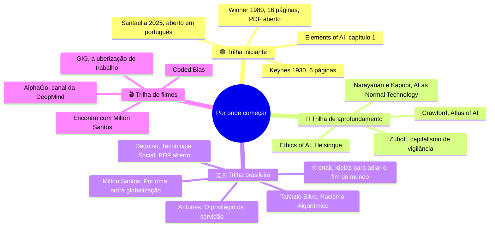
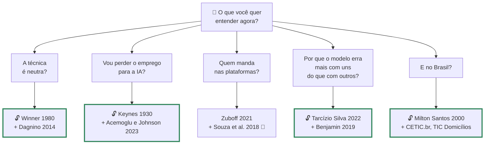

# Materiais, leituras, filmes e podcasts de Computação e Sociedade

> [!quote] Paulo Freire, *Pedagogia da Esperança* (1992)
> *"O que me parece fundamental para nós, hoje [...] é a assunção de uma posição crítica, vigilante, indagadora, em face da tecnologia. Nem, de um lado, demonologizá-la, nem, de outro, divinizá-la."*

Em 2026 há mais opinião sobre IA e sociedade do que qualquer pessoa consegue ler, e quase toda gratuita, o que piora o problema em vez de resolver. Esta página é o filtro: **cada link foi aberto e conferido em 03/09/2026**. Material pago vem sinalizado; versão aberta e legítima vem marcada com 🔓.

---

## 1. 📗 A bibliografia do PPC, comentada

As dez obras do PPC (Res. CONSUP 130/2023). Antes de comprar, procure no catálogo da **biblioteca do campus** e pergunte se o IFF assina a [Minha Biblioteca](https://minhabiblioteca.com.br/), onde parte destes títulos está em digital.

**HALL, Stuart.** *A identidade cultural na pós-modernidade*. Rio de Janeiro: DP&A, 1997 (orig. 1992).
Ensaio curto sobre a identidade que deixou de ser fixa e virou construída. Serve a [[Cultura, identidade e tecnologias digitais]]: separa quem você é de quem você performa no perfil, no avatar, no bot. **Leia primeiro** o capítulo das três concepções de sujeito, 15 páginas.

**REIS, Abel.** *Sociedade.com: como as tecnologias digitais afetam quem somos e como vivemos*. Porto Alegre: Arquipélago Editorial, 2018, 216 p. ISBN 978-85-54500-26-9.
Panorama brasileiro de um engenheiro de computação formado na UFRJ, e o item mais acessível da lista. Serve à abertura e a [[A tecnologia não é neutra - Computação e Sociedade]]. **Leia primeiro** qualquer capítulo: é o aquecimento antes de Castells.

**CASTELLS, Manuel.** *A sociedade em rede* (v. 1 de *A era da informação*) e *O poder da identidade* (v. 2). São Paulo: Paz e Terra (1ª ed. bras. do v. 2 em 1999).
O v. 1 é a referência sobre a passagem da sociedade industrial para a informacional; o v. 2 mostra a identidade como forma de resistir a isso. Servem a [[Poder, plataformas e vigilância - o público, o privado e o sujeito]] e a [[Cultura, identidade e tecnologias digitais]]. **Leia primeiro** o prólogo do v. 1, "A rede e o ser"; confira a edição no exemplar, houve reimpressões revistas.

**SOUZA, Joyce; AVELINO, Rodolfo; SILVEIRA, Sérgio Amadeu da (orgs.).** *A sociedade de controle: manipulação e modulação nas redes digitais*. São Paulo: [Hedra](https://hedra.com.br/produto/a-sociedade-de-controle/), 2018.
Coletânea sobre modulação algorítmica de comportamento; Silveira, sociólogo da UFABC, é o nome central da crítica brasileira de plataformas. Serve a [[Poder, plataformas e vigilância - o público, o privado e o sujeito]]. **Leia primeiro** o capítulo dele sobre modulação. 🔓 Do mesmo autor, aberto: *RECIIS*, v. 18, n. 3, 2024, DOI 10.29397/reciis.v18i3.4634.

**CAZELOTO, Edilson.** *Inclusão digital: uma visão crítica*. São Paulo: Editora Senac São Paulo, 2008.
Estraga a festa da inclusão digital, no bom sentido: incluir pode significar incluir num circuito de consumo, não em cidadania. Serve a [[Vieses, discriminação algorítmica e inclusão]] e é obrigatório antes da primeira oficina do [[Projeto de Extensão - IA para Todos]]. **Leia primeiro** a parte que separa **acesso**, **uso** e **apropriação**.

**PISCHETOLA, Magda.** *Inclusão digital e educação: a nova cultura da sala de aula*. Petrópolis: Vozes, 2016.
Pesquisa de campo em escolas brasileiras: mede o que acontece quando chega tecnologia na sala, não o que o folder promete. Serve a [[Cidadania e educação na sociedade digital]]. **Leia primeiro** os capítulos de campo: o antídoto contra o solucionismo educacional.

**VALLEJO, Antonio Pantoja et al.** *Sociedade da informação, educação digital e inclusão*. Florianópolis: Insular / UFSC, 2007.
Coletânea ibero-brasileira, a mais datada da lista, e vale por isso: mostra o que se esperava da internet **antes** das plataformas. Serve a [[Relevância social, investimento e políticas públicas de tecnologia]]. **Leia primeiro** o capítulo introdutório: comparar a promessa de 2007 com 2026 é meia aula pronta.

![[Recursos/Computação, Sociedade e Inclusão/Materiais, leituras, filmes e podcasts de Computação e Sociedade/paulo-freire-1963.png|Paulo Freire em 1963, dois anos antes do exílio. As duas obras dele citadas aqui foram escritas fora do Brasil. Domínio público, Wikimedia Commons]]

**FREIRE, Paulo.** *Extensão ou comunicação?* Rio de Janeiro: Paz e Terra (escrito no exílio chileno em 1968, 1ª ed. em português em 1971). 🔓 [PDF integral](https://fasam.edu.br/wp-content/uploads/2020/07/Extensao-ou-Comunicacao-1.pdf).
Freire ataca a palavra "extensão": estender é levar algo de A para B, e isso já é invasão cultural; no lugar, propõe comunicação, que é diálogo. É o texto fundador do [[Projeto de Extensão - IA para Todos]]. **Leia primeiro** o capítulo II: "Tôda invasão sugere [...] um sujeito que invade [...] superpondo aos indivíduos [do outro espaço] seu sistema de valôres" (grafia original).

**FREIRE, Emerson; BATISTA, Sueli Soares dos Santos.** *Sociedade e tecnologia na era digital*. São Paulo: Érica, 2014. ISBN 978-85-365-1006-4.
Atenção: **não é Paulo Freire**, é Emerson Freire, do Centro Paula Souza. Manual didático para cursos técnicos que serve à disciplina inteira, sobretudo [[Filosofia da Tecnologia - as grandes perguntas da era da IA]]. **Leia primeiro** os capítulos iniciais, que definem técnica e sociedade da informação sem exigir formação em humanas. Está na Minha Biblioteca.

**HOOKS, bell.** *Ensinando a transgredir: a educação como prática da liberdade*. São Paulo: WMF Martins Fontes, 2013 (orig. 1994).
Gloria Jean Watkins, que assinava bell hooks em minúsculas de propósito, trata a sala de aula como espaço político: ensaios curtos, zero jargão. Serve a [[Cidadania e educação na sociedade digital]] e às oficinas. **Leia primeiro** "Pedagogia engajada": ninguém aprende onde não pode discordar, que é o problema da oficina em que o instrutor fala 50 minutos seguidos.

> [!abstract] 🧠 Lente filosófica: Álvaro Vieira Pinto (*O Conceito de Tecnologia*, 2005)
> Vieira Pinto (1909 a 1987), catedrático de filosofia na atual UFRJ, escreveu este livro no Brasil pós-golpe, entre 1973 e 1974; ele só saiu em 2005, dezoito anos após a morte do autor. Interessa a quarta das quatro acepções que ele dá a "tecnologia": tecnologia como **ideologização da técnica**. "Toda tecnologia é uma ideologia" (v. 1, p. 322, citado com página em PIRES, 2021).
> Isso muda a forma de ler uma bibliografia. Quando alguém diz "estamos na era da IA", não descreve um fato meteorológico: faz uma afirmação que beneficia alguém. Ele chamava de **ingenuidade** aceitar a narrativa do progresso importado, e de **criticidade** ler a tecnologia a partir da posição real do seu país no sistema mundial. Um engenheiro brasileiro em 2026 lê papers do Norte, roda modelos treinados em inglês e aprende benchmarks definidos fora daqui.
> A pergunta que ele deixa: quando você escolhe o que ler sobre IA, quem escolheu por você?

![[Recursos/Computação, Sociedade e Inclusão/Materiais, leituras, filmes e podcasts de Computação e Sociedade/alvaro-vieira-pinto.png|Álvaro Vieira Pinto, foto sem data. Escreveu mais de 1300 páginas sobre o conceito de tecnologia e morreu sem vê-las publicadas. Domínio público, Wikimedia Commons]]

---

## 2. 📚 Leituras essenciais fora do PPC

O PPC é a espinha, não a jaula. **Nível:** 🟢 iniciante · 🟡 intermediário · 🔴 avançado (longo, em inglês, ou os dois).

### 2.1 Clássicos curtos que valem o dobro do tamanho

| Leitura | Nível | Por que ler |
|---|---|---|
| **WINNER, Langdon.** "Do Artifacts Have Politics?". *Daedalus*, v. 109, n. 1, 1980, pp. 121 a 136. 🔓 [PDF](https://faculty.cc.gatech.edu/~beki/cs4001/Winner.pdf) | 🟢 | Fundou o campo: artefatos incorporam poder antes de qualquer uso. Se for ler um só, leia este |
| **KEYNES, John Maynard.** "Economic Possibilities for our Grandchildren", 1930. 🔓 [PDF, Yale](http://www.econ.yale.edu/smith/econ116a/keynes1.pdf) | 🟢 | Previu semana de 15 horas até 2030. Por que falhou é metade de [[Automação, trabalho e o futuro das profissões]] |
| **NARAYANAN, Arvind; KAPOOR, Sayash.** "AI as Normal Technology". *Knight Institute, Columbia*, 15/04/2025. 🔓 [HTML](https://knightcolumbia.org/content/ai-as-normal-technology) | 🟡 | Antídoto contra as duas histerias simétricas. Dos autores de *AI Snake Oil* (2024) |
| **SANTAELLA, Lucia.** "A ética como guia para o uso da IA generativa". *Educação & Sociedade*, v. 46, 2025. 🔓 [DOI](https://doi.org/10.1590/es.296469) | 🟢 | A melhor porta de entrada em português: CC BY 4.0, cabe numa aula |

### 2.2 Pensamento brasileiro e latino-americano

| Leitura | Nível | Por que ler |
|---|---|---|
| **PINTO, Álvaro Vieira.** *O Conceito de Tecnologia*. Contraponto, 2005, 2 v. | 🔴 | Técnica e ideologia em 1300 páginas. Entrada pelo comentário 🔓 [PIRES, 2021](https://seer.uftm.edu.br/revistaeletronica/index.php/revistagepadle/article/view/6091) |
| **SANTOS, Milton.** *Por uma outra globalização*. Record, 2000 | 🟡 | Globalização como **fábula**, **perversidade** e **possibilidade**. Vale para IA linha a linha |
| **KRENAK, Ailton.** *Ideias para adiar o fim do mundo*. Companhia das Letras, 2019 | 🟢 | Menos de 100 páginas. Eleito para a ABL em 05/10/2023, posse em 05/04/2024 |
| **SILVA, Tarcízio.** *Racismo Algorítmico*. Edições Sesc, 2022. 🔓 [versão aberta](https://racismo-algoritmico.pubpub.org/) (abre no navegador, bloqueia robô) e [Internet Archive](https://archive.org/details/tarcizio-silva-racismo-algoritmico) | 🟡 | A síntese brasileira: "a ordenação algorítmica racializada" num mundo moldado pela supremacia branca (p. 66) |
| **DAGNINO, Renato.** *Tecnologia Social*. Insular/EDUEPB, 2014. 🔓 [PDF integral, SciELO Books](https://static.scielo.org/scielobooks/7hbdt/pdf/dagnino-9788578793272.pdf) | 🟡 | **Adequação sociotécnica**: não basta transferir tecnologia convencional, é preciso reprojetar. Base de [[Tecnologia social e tecnologia convencional]] |
| **ANTUNES, Ricardo.** *O privilégio da servidão*. Boitempo, 2018. 🔓 [amostra oficial](https://blogdaboitempo.com.br/wp-content/uploads/2022/05/privilegioservidao_antunes-1.pdf) | 🟡 | O clássico sobre uberização: quem projeta dispatch implementa em código o que ele descreve em sociologia |
| **SILVEIRA, Sérgio Amadeu da.** *Tudo sobre tod@s* (2017) e *Democracia e os códigos invisíveis* (2019), Edições Sesc. 🔓 [*V!RUS* 30, 2025](https://revistas.usp.br/virus/article/view/240239) | 🟡 | Modulação algorítmica em português, por quem mantém o Tecnopolítica |

### 2.3 Poder, vigilância e economia da IA

| Leitura | Nível | Por que ler |
|---|---|---|
| **ZUBOFF, Shoshana.** *A era do capitalismo de vigilância*. Intrínseca, 2021 | 🔴 | Nomeou o modelo de negócio da internet. Sem fôlego? [[Ética da IA - Poder, Vigilância e Automação]] resume |
| **CRAWFORD, Kate.** *Atlas of AI*. Yale UP, 2021. 🔓 projeto visual com Vladan Joler: <https://anatomyof.ai/> | 🔴 | IA como indústria extrativa: lítio, energia, rotulagem, descarte. Sem edição brasileira |
| **ACEMOGLU, Daron; JOHNSON, Simon.** *Poder e progresso*. Companhia das Letras, 2023 | 🟡 | Produtividade só vira prosperidade compartilhada com poder de barganha. O contraponto ao tecno-otimismo |
| **HAN, Byung-Chul.** *Psicopolítica*. Âyiné, 2018 | 🟢 | Fino e cortante: o poder atual não reprime, seduz. Você se expõe achando que é liberdade |
| **HUI, Yuk.** *Tecnodiversidade*. Trad. Humberto do Amaral. Ubu, 2020, 192 p. | 🔴 | Uma tecnologia universal ou muitas cosmotécnicas? O volume da Ubu reúne textos, não traduz um livro só |
| **FEENBERG, Andrew.** *Questioning Technology*. Routledge, 1999. 🔓 [textos do autor](https://www.sfu.ca/~andrewf/); em português, *Cadernos EBAPE.BR*, v. 20, n. 1, 2022, DOI 10.1590/1679-395120200212 | 🔴 | Saída do falso dilema entre técnica neutra e técnica dominadora: ela é **ambivalente** |

### 2.4 Vieses, discriminação e trabalho invisível

| Leitura | Nível | Por que ler |
|---|---|---|
| **BENJAMIN, Ruha.** *Race After Technology*. Polity, 2019 | 🔴 | O "New Jim Code": tecnologia que parece neutra e reproduz hierarquia racial |
| **NOBLE, Safiya Umoja.** *Algorithms of Oppression*. NYU Press, 2018 | 🔴 | Auditoria de busca com metodologia replicável, que é o que interessa a engenheiro |
| **O'NEIL, Cathy.** *Algoritmos de destruição em massa*. Rua do Sabão, 2020 | 🟡 | Três critérios de modelo tóxico: opacidade, escala e dano. A leitura mais prática |
| **EUBANKS, Virginia.** *Automating Inequality*. St. Martin's Press, 2018 | 🔴 | Sistemas públicos que decidem quem recebe benefício: mecanismo idêntico ao de qualquer cadastro social |
| **GRAY, Mary L.; SURI, Siddharth.** *Ghost Work*, 2019. 🔓 [site](https://ghostwork.info/) | 🔴 | O "paradoxo do último quilômetro": toda automação cria trabalho humano invisível |

> [!example] 🧪 Faça 1: Winner anotado, em grupo, no Hypothes.is
> **Ferramenta:** [Hypothes.is](https://web.hypothes.is/) e o [PDF de Winner 1980](https://faculty.cc.gatech.edu/~beki/cs4001/Winner.pdf).
>
> 1. Crie conta, instale a extensão e peça ao professor o link do grupo privado da turma.
> 2. Anote **três trechos**: um na definição das "duas maneiras" (p. 123), um no caso das pontes de Robert Moses (pp. 123 a 124) e um na colheitadeira de tomate (pp. 126 a 127).
> 3. Responda a **duas anotações de colegas**, discordando de pelo menos uma.
>
> **Resultado esperado:** print da barra lateral com as suas 5 contribuições, data e hora visíveis.
>
> 📱 **Só com celular:** a extensão não roda no navegador móvel. Use `https://via.hypothes.is/` colando a URL do PDF depois da barra final.

---

## 3. 🎬 Filmes e documentários

Título, direção e ano conferidos. Para saber onde um filme está **hoje** no Brasil, use o [JustWatch](https://www.justwatch.com/br), buscador de catálogos.

| Filme | Ficha e onde | O que discutir |
|---|---|---|
| **Coded Bias** | Shalini Kantayya, 2021, estreia 22/03/2021 na série *Independent Lens* ([PBS](https://www.pbs.org/independentlens/documentaries/coded-bias/)). Catálogo pago | Buolamwini, do MIT, mostra o reconhecimento facial errando mais em pele escura. **Era o dataset, a métrica ou a equipe?** |
| **The Cleaners** | Hans Block e Moritz Riesewieck, 2018 ([PBS](https://www.pbs.org/independentlens/documentaries/the-cleaners/)). Catálogo pago | Moderadores terceirizados nas Filipinas decidem o que bilhões veem. **Se a moderação virar IA, o trauma some ou muda de lugar?** |
| **The Great Hack** (*Privacidade Hackeada*) | Jehane Noujaim e Karim Amer, 2019 (Sundance 26/01, Netflix 24/07/2019) | Cambridge Analytica em três personagens. **O que aqui seria ilegal sob a LGPD, e o que seguiria legal?** |
| **O Dilema das Redes** | Jeff Orlowski, 2020, Netflix. Base: [Center for Humane Technology](https://www.humanetech.com/) | Objeto de crítica, não verdade. **Quanto é evidência e quanto é dramatização com atores?** Compare com Zuboff |
| **AlphaGo** | Greg Kohs, 2017. 🔓 completo no canal da Google DeepMind, 1h30min28s: <https://www.youtube.com/watch?v=WXuK6gekU1Y> | A partida contra Lee Sedol, distribuída pela empresa que fez o modelo. **O que um filme do próprio laboratório nunca mostra?** |
| **Do Not Track** | Brett Gaylor, 2015, Upian, Arte, ONF e BR. 🔓 série web interativa: <https://donottrack-doc.com/> | Coleta os **seus** dados enquanto você assiste. **O que acertou em 2015 e o que ficou pequeno para 2026?** |

### 3.1 Brasileiros

![[Recursos/Computação, Sociedade e Inclusão/Materiais, leituras, filmes e podcasts de Computação e Sociedade/milton-santos-1994.png|Milton Santos em 1994, seis anos antes de publicar "Por uma outra globalização". Foto CC BY-SA 4.0, Wikimedia Commons]]

| Obra | Ficha e onde assistir |
|---|---|
| **Encontro com Milton Santos: o mundo global visto do lado de cá** | Silvio Tendler, 2006. 🔓 canal da produtora do diretor, 1h29min20s: <https://www.youtube.com/watch?v=ifZ7PNTazgY> · **versão curta de 28min26s**, MultiRio: <https://www.youtube.com/watch?v=6KRjpWG8htA> |
| **GIG: a uberização do trabalho** | [Repórter Brasil](https://reporterbrasil.org.br/documentarios/gig/), 2019, direção de Carlos Juliano Barros, Caue Angeli e Maurício Monteiro Filho. 🔓 completo no canal oficial, 59min20s: <https://www.youtube.com/watch?v=cMPnAfrMLCk> |
| **Roda Viva com Ailton Krenak** | TV Cultura, 19/04/2021, 1h32min41s. 🔓 <https://www.youtube.com/watch?v=BtpbCuPKTq4> |
| **Roda Viva Retrô com Milton Santos** | TV Cultura, 1997, 1h26min24s. 🔓 <https://www.youtube.com/watch?v=xPfkiR34law> |
| **Roda Viva com Paulo Blikstein** | TV Cultura, 17/08/2026, educação e IA, 1h21min20s. O mais recente da lista. 🔓 <https://www.youtube.com/watch?v=pnQSmykqM-M> |

> [!warning] O que não achei
> Não localizei documentário brasileiro **sobre reconhecimento facial** com autoria e ano confirmados em fonte institucional. Achou um? Mande ao professor e ele entra aqui com o seu crédito. Não vale reupload sem autoria.

> [!example] 🧪 Faça 2: 20 minutos de Krenak, com minutagem
> **Ferramenta:** [Roda Viva com Ailton Krenak, TV Cultura, 19/04/2021](https://www.youtube.com/watch?v=BtpbCuPKTq4).
>
> 1. Escolha um trecho contínuo de **20 minutos**, em qualquer ponto do programa.
> 2. Anote **3 frases** dele com o **timestamp exato**, no formato `hh:mm:ss`.
> 3. Para cada frase, escreva 2 linhas conectando-a a um autor desta página: Vieira Pinto (ideologização da técnica), Milton Santos (globalização como fábula) ou Yuk Hui (tecnodiversidade).
>
> **Resultado esperado:** meia página com 3 citações minutadas e 3 conexões. Frase sem timestamp é resumo, não evidência.
>
> 📱 **Só com celular:** o app mostra o tempo ao tocar na tela; para copiar o link minutado, use "Compartilhar" e marque "Iniciar em".

---

## 4. 🎧 Podcasts, canais e newsletters que existem em 2026

Nada aqui é "ouvi falar que existe": cada item foi aberto em 03/09/2026, no ar.

| Brasileiros | O que cobre |
|---|---|
| **Tecnopolítica**, Sérgio Amadeu da Silveira (UFABC). [Canal](https://www.youtube.com/@PodcastTecnopol%C3%ADtica) | Soberania, plataformas, algoritmos, colonialismo de dados. Entradas: [#1, algoritmos](https://www.youtube.com/watch?v=aRkqfx_XTVY), 41min26s; [#207, Milton Santos](https://www.youtube.com/watch?v=ufJYz8jTYqk), 53min03s. ⚠️ `tecnopolitica.com.br` não resolve: use o canal |
| **Dadocracia**, [Data Privacy Brasil](https://www.dataprivacybr.org/) | LGPD, ANPD, regulação de IA, dados e infância, IA na educação e no Direito. Episódio 207 no ar |
| **Segue o Fio** e **Núcleo Investiga**, [Núcleo Jornalismo](https://nucleo.jor.br/) | Investigação de tecnologia no Brasil: plataformas, eleições, moderação, data centers. Ep. 5 em 02/09/2026 |
| **Desvelar**, Tarcízio Silva. [Site](https://desvelar.org/) | Não é podcast: acervo e formação, com o [banco de casos de discriminação algorítmica](https://desvelar.org/casos-de-discriminacao-algoritmica/) |
| **Hipsters Ponto Tech**, Alura. [hipsters.tech](https://hipsters.tech/) | Mercado e prática, não filosofia. ⚠️ Sem episódio de ética de IA confirmado |
| **IEA-USP** e **Café Filosófico CPFL** | Conferências longas para recorte: [Regulação da IA no Brasil](https://www.youtube.com/watch?v=xKkzu0FS8l8), 2h01min38s; [Tecnologia, inclusão e IA](https://www.youtube.com/watch?v=Wh0vgiP1Gi4), 51min49s |
| **Univesp**, [canal](https://www.youtube.com/@univesptv) | Séries "Sociedade, Tecnologia e Inovação" e "Ética, Cidadania e Sociedade": ["Introdução à ética"](https://www.youtube.com/watch?v=6tu8ERj7g-Y), 21min23s. ⚠️ Não existe curso "Filosofia da Tecnologia" lá |

| Internacionais | O que cobre |
|---|---|
| **Hard Fork**, Kevin Roose e Casey Newton, NYT. [Feed](https://podcasts.apple.com/us/podcast/hard-fork/id1528594034) | Semanal, noticiário de IA e plataformas com ceticismo saudável |
| **Tech Won't Save Us**, Paris Marx. [techwontsave.us](https://techwontsave.us/) | Contraponto ao Vale do Silício: infraestrutura, energia, trabalho, poder corporativo. Episódio de 03/09/2026 |
| **Import AI**, Jack Clark. [importai.substack.com](https://importai.substack.com/) | Newsletter semanal que lê pesquisa de ponta. Mais de 139 mil assinantes |
| **Ada Lovelace Institute**. [Site](https://www.adalovelaceinstitute.org/) | Relatórios e newsletter sobre governança de dados e IA |

> [!warning] Dois erros que circulam e você não deve repetir
> 1. **Não existe Roda Viva com Sérgio Amadeu da Silveira.** A busca devolve Sérgio Amaral, outra pessoa. Se um LLM te der esse link, ele inventou.
> 2. **O MIT Technology Review Brasil não tem podcast localizável**: `mittechreview.com.br/podcasts/` devolve 404.

> [!tip] Como usar podcast sem se enganar
> Podcast é ótimo para **descobrir** e péssimo para **citar**. A ideia pode vir de um episódio, mas o que entra no trabalho é a fonte primária: o paper, a lei, o relatório, o livro. Sem ela, o item não existe para a avaliação. Ver [[Kit de ferramentas de Computação e Sociedade]].

---

## 5. 🎓 Cursos gratuitos

| Curso | Instituição | Formato e custo |
|---|---|---|
| [**Elements of AI**](https://www.elementsofai.com/), com [versão em português](https://www.elementsofai.pt/) | Helsinque e MinnaLearn | "Introdução à IA" (sem pré-requisito) e "Building AI" (Python básico). Mais de 2 milhões de inscritos. Gratuito, com certificado; a versão em português é de Portugal |
| [**Ethics of AI**](https://ethics-of-ai.mooc.fi/) | Univ. de Helsinque | 7 módulos no seu ritmo: introdução, não maleficência, responsabilização, transparência, direitos humanos, justiça e ética na prática. Gratuito |
| [**Embedded EthiCS**](https://embeddedethics.seas.harvard.edu/) | Harvard | Não é curso para se inscrever: repositório de **módulos de ética embutidos em disciplinas técnicas**, coensinados por filósofos ([módulos](https://embeddedethics.seas.harvard.edu/modules), [disciplinas](https://embeddedethics.seas.harvard.edu/classes)). Gratuito, **CC BY 4.0**: pode adaptar e reusar |
| **AI, Decision Making, and Society**, 6.3950 e 6.3952 ([catálogo](https://student.mit.edu/catalog/m6c.html)) | MIT | Causalidade, teste de hipótese e aprendizado supervisionado e por reforço aplicados a justiça criminal, saúde, finanças e redes sociais; há também 6.7990, *Ethical Machine Learning in Human Systems*. ⚠️ **6.C40** saiu do catálogo |
| Competências em IA: [estudantes](https://unesdoc.unesco.org/ark:/48223/pf0000394281_por) e [professores](https://unesdoc.unesco.org/ark:/48223/pf0000394280_por), em português | UNESCO, 2024 | Quatro competências para estudantes (mentalidade centrada no humano, ética da IA, técnicas e aplicações, design de sistemas) e cinco para professores. Esqueleto da oficina do [[Projeto de Extensão - IA para Todos]] |
| [**Minicursos do NIC.br**](https://cursoseventos.nic.br/) | NIC.br | ⚠️ São **técnicos de rede**, não de sociedade: BGP, ISO 27001, VoIP com Wireshark, hardening, drones. Entram porque quem entende a infraestrutura discute melhor a política dela |

> [!info] 🇧🇷 A universidade brasileira não pratica REA sobre si mesma
> Harvard publica os módulos do Embedded EthiCS em CC BY 4.0, com plano de aula e leitura. Do lado brasileiro, a pesquisa que sustenta esta página **não recuperou nenhuma ementa pública** de "Computadores e Sociedade" em USP, UFRGS, UFPE, UnB, UFF ou UFSCar: catálogo atrás de login, PDF escaneado, plano de ensino preso no SIGAA. Não é anedota: é um dado sobre política de abertura, e conversa com [[Recursos Educacionais Abertos]].

> [!example] 🧪 Faça 3: capítulo 1 do Elements of AI, em português
> **Ferramenta:** [Elements of AI, versão em português](https://www.elementsofai.pt/).
>
> 1. Crie conta e faça o **capítulo 1** inteiro ("O que é a IA?"), exercícios incluídos. Leva cerca de uma hora.
> 2. Anote a definição de IA que o curso adota e as três características que ele usa para delimitar o termo.
> 3. Faça a mesma pergunta a um LLM e **tabule as diferenças**: o que o curso inclui e o LLM não, e vice-versa.
>
> **Resultado esperado:** print da tela de conclusão do capítulo 1, com a barra de progresso, mais a tabela de diferenças (mínimo três linhas).
>
> 📱 **Só com celular:** o curso é responsivo e roda inteiro no navegador do celular.

---

## 6. 🏛️ Organizações e observatórios brasileiros

Precisa de **dado brasileiro com fonte**? Não comece pelo Google: comece por esta tabela. Todos responderam em 03/09/2026.

| Organização | O que faz | Link |
|---|---|---|
| **CGI.br / NIC.br / CETIC.br** | O CETIC.br produz as TIC Domicílios, TIC Educação e TIC Empresas: fonte oficial sobre acesso e desigualdade digital | <https://cetic.br/> e <https://data.cetic.br> |
| **OBIA** | Indicadores nacionais de IA e acompanhamento do Plano Brasileiro de IA | <https://obia.nic.br/> |
| **ANPD** | Fiscaliza LGPD e ECA Digital, publica tomadas de subsídios e normas | <https://www.gov.br/anpd/pt-br> |
| **InternetLab** | Direito e tecnologia: privacidade, liberdade de expressão, desigualdade | <https://internetlab.org.br/pt/> |
| **Data Privacy Brasil** | Direitos digitais e proteção de dados, com foco em assimetrias de poder | <https://www.dataprivacybr.org/> |
| **Coding Rights** | Joana Varon, "hackeando o patriarcado desde 2015": Chupadados e Oráculo Transfeminista | <https://codingrights.org/> e <https://chupadados.codingrights.org/> |
| **Desvelar** | Tarcízio Silva: casos de discriminação algorítmica, biblioteca e formações | <https://desvelar.org/> |
| **Rede de Observatórios da Segurança** | Origem do dado mais citado do país: em casos de 2019, **90,5% das pessoas presas por reconhecimento facial no Brasil eram negras** | <https://observatorioseguranca.com.br/> |
| **PretaLab** | Silvana Bahia, do Olabi: mapeia e forma mulheres negras e indígenas em tecnologia | <https://pretalab.com/> |
| **Intervozes** | Direito à comunicação, regulação de mídia e de plataformas | <https://intervozes.org.br/> |
| **Instituto Alana** | Infância, direitos e tecnologia; referência no debate do ECA Digital | <https://alana.org.br/> |
| **Open Knowledge Brasil** | Dados abertos e tecnologia cívica. Mantém o Querido Diário | <https://ok.org.br/> |
| **Wikimedia Brasil** | Afiliado brasileiro do movimento Wikimedia: Wikipédia, Commons, conhecimento livre | <https://wmnobrasil.org/> |
| **Iniciativa Educação Aberta** | REA, políticas de abertura e formação | <https://aberta.org.br/> |
| **SBC** | Código de Ética Profissional, Referenciais de Formação e comissões especiais. ⚠️ Não existe comissão "Computação e Sociedade": a mais próxima é Educação em Computação | <https://www.sbc.org.br/> |

> [!abstract] 🧠 Lente filosófica: Milton Santos (*Por uma outra globalização*, 2000)
> Milton Santos, geógrafo baiano e professor titular da USP, propôs ler a globalização em três camadas (paráfrase da tese central): a **fábula** é o discurso (aldeia global, informação para todos), a **perversidade** é a experiência da maioria, e a **possibilidade** é o que ainda cabe fazer com a mesma base técnica, se a política mudar.
> Aplique à tabela acima. A fábula diz que o dado público brasileiro está a um clique; a perversidade é que boa parte dele está em PDF escaneado, atrás de login ou em painel que não exporta; a possibilidade é que existe gente organizada raspando esses dados e publicando, e um engenheiro de computação é exatamente quem transforma possibilidade em código.
> Pergunta aberta: das quinze organizações acima, quantas você conhecia antes desta página, e o que isso diz sobre quem vinha decidindo a sua atenção?

![[Recursos/Computação, Sociedade e Inclusão/Materiais, leituras, filmes e podcasts de Computação e Sociedade/ailton-krenak-2017.png|Ailton Krenak na Câmara dos Deputados em 03/10/2017. Em 2023 tornou-se o primeiro indígena eleito para a Academia Brasileira de Letras. Foto CC BY-SA 4.0, Wikimedia Commons]]

---

## 7. 📝 Concursos e ENADE

Esta disciplina parece a menos cobrável do curso. Não é.

**ENADE.** A prova tem **Formação Geral** (uma discursiva e nove objetivas, peso 25%) e **Componente Específico** (uma discursiva e as demais, peso 75%). A Formação Geral é onde tecnologia e sociedade entram sem disfarce; no Componente Específico de Eng. de Computação, os temas daqui vêm como **acessibilidade e IHC**, **LGPD** e **ética profissional**. Provas e gabaritos de 2004 a 2025 no [Inep](https://www.gov.br/inep/pt-br/areas-de-atuacao/avaliacao-e-exames-educacionais/enade/provas-e-gabaritos).

**Exemplo 1, Formação Geral (ENADE 2023, Eng. de Computação, questão 04, gabarito A).** Dois textos sobre IA generativa, o segundo alertando que ela "pode agravar a desigualdade econômico-social, tanto entre nações quanto entre indivíduos da mesma nação". As quatro alternativas erradas são clichês que esta disciplina desmonta: que a IA "promove a igualdade econômico-social", que "gera pouco impacto" em países desenvolvidos, que "restringe o aprendizado ao que é legalmente estabelecido". Quem decorou definição de IA erra; quem estudou desigualdade digital acerta.

**Exemplo 2, Componente Específico (mesma prova, questão 21, gabarito A).** Vereadores querem transformar a cidade em "cidade inteligente" e consultam especialistas em IHC. A questão apresenta dois fundamentos de acessibilidade, **equidade** (atender a todos, independentemente de habilidades físicas, sensoriais ou cognitivas) e **informação perceptível** (texto alternativo, contraste para daltônicos), e pede que se avaliem três afirmações sobre leis municipais. É acessibilidade cobrada como raciocínio, não decoreba de norma. [Prova](https://download.inep.gov.br/enade/provas_e_gabaritos/2023_PV_engenharia_da_computacao.pdf) · [gabarito](https://download.inep.gov.br/enade/provas_e_gabaritos/2023_GB_engenharia_da_computacao.pdf).

**Concursos de TI.** Em edital de analista ou técnico, isto aparece em "Legislação" ou "Noções de Direito Digital". As normas que mais caem: [LGPD, Lei 13.709/2018](https://www.planalto.gov.br/ccivil_03/_ato2015-2018/2018/lei/l13709.htm) (bases legais, direitos do titular, controlador e operador, ANPD) · [Marco Civil, Lei 12.965/2014](https://www.planalto.gov.br/ccivil_03/_ato2011-2014/2014/lei/l12965.htm) (neutralidade de rede, responsabilidade de provedores) · [LBI, Lei 13.146/2015](https://www.planalto.gov.br/ccivil_03/_ato2015-2018/2015/lei/l13146.htm) (acessibilidade como direito, inclusive em sítios e aplicativos) · Código de Ética Profissional da [SBC](https://www.sbc.org.br/).

> [!tip] Estratégia honesta de estudo para prova
> Nenhuma banca cobra "o que Winner pensava": elas cobram **artigo de lei** e **aplicação de conceito a um caso**. Esta disciplina dá a segunda parte. Nas duas questões acima, foi isso que separou quem acertou de quem chutou.

---

## 8. 🤖 Estudar com IA sem se enganar

Você vai usar IA para estudar, e a disciplina não finge que não. O problema não é usar: é usar de um jeito que produz sensação de aprendizado sem aprendizado, e bibliografia que não existe.

**O NotebookLM com PDFs abertos.** O [NotebookLM](https://notebooklm.google.com/) responde a partir dos documentos que **você** sobe e cita o trecho de origem. Em vez de perguntar o que o modelo acha que Winner disse, você sobe o PDF e ele fica obrigado a apontar a página. Caderno sugerido, só com material aberto desta página: Winner 1980, Keynes 1930, Dagnino 2014, Freire, Narayanan e Kapoor 2025 e Santaella 2025. Aí "onde Dagnino e Winner discordam sobre neutralidade?" ganha resposta rastreável.

**A regra: pedir, verificar, registrar.**

| Passo | O que fazer | O que entregar |
|---|---|---|
| **Pedir** | Faça a pergunta ao LLM e exija referências **com DOI ou URL**. Guarde o prompt exato | o prompt, copiado |
| **Verificar** | Cheque cada referência na fonte primária: DOI em <https://doi.org>, artigo no <https://www.scielo.br>, dado no CETIC.br, lei no Planalto. Referência que não abre não existe | a evidência (print do 404, ou o link que abriu) |
| **Registrar** | Anote a **diferença** entre o que o modelo disse e o que a fonte diz. Essa diferença é o aprendizado, não o resumo | duas a cinco linhas por item |

> [!warning] O teste que você faz uma vez e nunca esquece
> Peça a um LLM cinco referências brasileiras sobre racismo algorítmico, com DOI, e cheque cada DOI em <https://doi.org>. Faça isso **antes** de confiar em qualquer bibliografia gerada: a taxa de invenção varia por modelo e por tema, e o único jeito de saber a sua é medir. Esse teste aparece nos [[Possíveis trabalhos e projetos de Computação, Sociedade e Inclusão]].

> [!tip] Onde a IA ajuda de verdade
> Traduzir um parágrafo denso de Castells para linguagem de engenheiro. Gerar dez perguntas sobre o capítulo que você acabou de ler. Ser advogado do diabo num debate. Achar o timestamp numa transcrição que você já assistiu. Em todos, você já tem a fonte na mão e usa o modelo como ferramenta, não como oráculo.

---

## 🔗 Veja também

Na ordem do semestre: [[Tópicos/Computação, Sociedade e Inclusão/index|Computação, Sociedade e Inclusão]] · [[A tecnologia não é neutra - Computação e Sociedade]] · [[Filosofia da Tecnologia - as grandes perguntas da era da IA]] · [[A virada da IA - o que mudou no mundo desde 2022]] · [[Automação, trabalho e o futuro das profissões]] · [[Poder, plataformas e vigilância - o público, o privado e o sujeito]] · [[Vieses, discriminação algorítmica e inclusão]] · [[Cultura, identidade e tecnologias digitais]] · [[Recursos Educacionais Abertos]] · [[Cidadania e educação na sociedade digital]] · [[Tecnologia social e tecnologia convencional]] · [[Relevância social, investimento e políticas públicas de tecnologia]] · [[O engenheiro de computação em 2036 - trabalho, carreira e responsabilidade]].

Apoio: [[Kit de ferramentas de Computação e Sociedade]] (debates, rubricas e regras de citação) · [[Possíveis trabalhos e projetos de Computação, Sociedade e Inclusão]] · [[Projeto de Extensão - IA para Todos]] · [[Glossário de Computação, Sociedade e Inclusão]].

Fora da disciplina: [[Tópicos/Filosofia da Mente e da Tecnologia/index|Filosofia da Mente e da Tecnologia]], com [[Ética da IA - Poder, Vigilância e Automação]], [[Ética da IA - Responsabilidade e Agência Moral]], [[O que a IA sabe - Informação, verdade e alucinação]] e [[Anatomia de um Argumento]] · [[Carreira e mercado de trabalho]] · [[Tendências do futuro]].

➡️ **Próxima aula:** [[Glossário de Computação, Sociedade e Inclusão]]

---

> [!note] 📚 Fontes (todas visitadas em 03/09/2026)
> Cada URL citada acima foi aberta e conferida, e está inline na própria linha. Aqui ficam só as fontes sem link no corpo e os créditos de imagem.
> - Fichas editoriais: [Sociedade.com, Abel Reis](https://www.livrariaarquipelago.com.br/sociedade-com-abel-reis) · [Freire e Batista, Érica/GEN](https://www.grupogen.com.br/livro-sociedade-e-tecnologia-na-era-digital-emerson-freire-sueli-soares-dos-santos-batista-erica-9788536510064) · [Minha Biblioteca](https://minhabiblioteca.com.br/)
> - Citação de Freire (*Pedagogia da Esperança*): [Acervo Paulo Freire](https://acervo.paulofreire.org/items/3fbb996c-20ad-4be3-a658-499d2bb3494a), CC BY-NC-ND. Fichas de filme: [The Great Hack](https://en.wikipedia.org/wiki/The_Great_Hack) e [Do Not Track](https://donottrack-doc.com/en/intro/).
> - Imagens (Wikimedia Commons): [Paulo Freire, 1963, domínio público](https://commons.wikimedia.org/wiki/File:Paulo_Freire_(1963).tif) · [Álvaro Vieira Pinto, domínio público](https://commons.wikimedia.org/wiki/File:Alvaro_Vieira_Pinto,_sem_data.tif) · [Milton Santos, 1994, CC BY-SA 4.0](https://commons.wikimedia.org/wiki/File:Milton_Santos-FIG_1994_(1).jpg) · [Ailton Krenak, 2017, CC BY-SA 4.0](https://commons.wikimedia.org/wiki/File:Ailton_Krenak_03-10-2017_-_Comiss%C3%A3o_de_Meio_Ambiente_e_Desenvolvimento_Sustent%C3%A1vel.jpg)

> [!note] 📖 Como citar
> Livro: `SOBRENOME, Nome. *Título*. Cidade: Editora, ano.` Artigo: some o `DOI`. Vídeo: `CANAL. Título. Plataforma, data. Disponível em: <URL>. Acesso em: data.` Duas regras não negociáveis, detalhadas no [[Kit de ferramentas de Computação e Sociedade]]: **toda citação leva página ou timestamp** e **nenhuma referência entra sem você ter aberto**.
