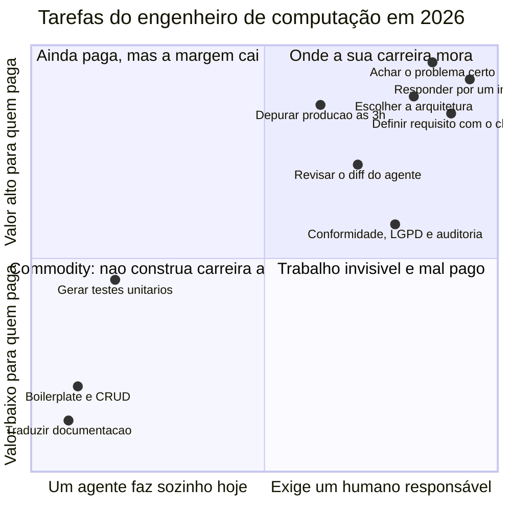
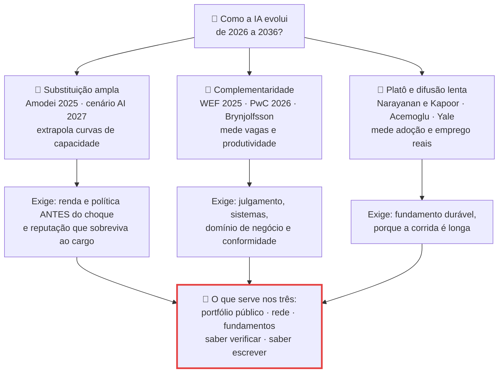

# O engenheiro de computação em 2036: trabalho, carreira e responsabilidade

> [!quote] Julho de 2025, um experimento que ninguém esperava
> *Dezesseis desenvolvedores experientes resolveram 246 tarefas reais nos próprios repositórios de código aberto. Metade com IA, metade sem. Antes de começar, previram acelerar 24%. No fim, acharam que tinham acelerado 20%. O cronômetro dizia outra coisa: com IA levaram **19% mais tempo**.*

Esta é a última aula de conteúdo da disciplina e a única que fala diretamente de você: o objeto de estudo aqui é a sua profissão daqui a dez anos, e você tem uma vantagem sobre quase todo mundo que escreve sobre isso na internet, porque **sabe o que a ferramenta faz por dentro**. A página não vende otimismo nem pânico: junta o que foi medido até setembro de 2026, separa medição de declaração de executivo e termina com três cenários e um plano que funciona nos três. [[Automação, trabalho e o futuro das profissões]] tratou do trabalho em geral; aqui o recorte é o seu.

---

## 1. 🧑‍💻 O que mudou para quem programa (2023 a 2026)

![[Recursos/Computação, Sociedade e Inclusão/O engenheiro de computação em 2036 - trabalho, carreira e responsabilidade/programador-em-trabalho.png|Programar em 2026 é cada vez menos digitar e cada vez mais revisar o que outra coisa digitou.]]

Em 2023 você pedia uma linha e o editor completava. Em 2026 você descreve um objetivo, um agente edita vários arquivos, roda os testes e devolve um diff. O que você faz com esse diff virou a maior parte do trabalho. O detalhe técnico está em [[Vibe Coding e Engenharia Agêntica]] e [[Ferramentas de IA para Desenvolvimento]]; aqui interessa o efeito na carreira.

| Tarefa | 2023 | 2026 |
|---|---|---|
| Escrever uma função a partir de uma descrição | Autocompletar sugere linhas, você digita a maior parte | Agente escreve o arquivo, roda o teste e devolve um diff pronto |
| Entender uma base de código nova | Ler código, ler doc, perguntar a alguém | Perguntar ao agente com o repositório indexado, e conferir o que ele afirmou |
| Escrever testes unitários | Manual, sempre atrasado | Gerados em massa; o problema virou "esse teste testa a coisa certa?" |
| Boilerplate, CRUD, scaffolding | Horas de trabalho chato | Custo marginal quase zero |
| Corrigir um bug de produção | Stack trace, busca, hipótese | Agente propõe o patch; o gargalo virou **reproduzir e validar** |
| Code review | Ler o diff que um colega escreveu | Ler o diff que **ninguém** escreveu à mão, sem autor para explicar a intenção |
| Decidir o que construir | Conversa com cliente ou com o time | Igual: nenhuma ferramenta decide requisito por você |
| Assinar pelo que subiu para produção | Você | Você. Único item da tabela que não mudou nada |

> [!warning] A última linha é a aula inteira
> A IA mudou a produção do artefato e não mudou uma vírgula da **imputação**. Quando o sistema derrubar o faturamento de um cliente às 3 da manhã, ninguém vai processar o modelo. As sete primeiras linhas são sobre ferramenta; a oitava é sobre a profissão.

### 1.1 "X% do nosso código é escrito por IA"

| Quem | O que disse | Quando |
|---|---|---|
| **Sundar Pichai**, CEO da Alphabet | "mais de **25%** de todo código novo no Google é gerado por IA" | resultados do 3T2024, **29/10/2024** |
| **Sundar Pichai** | Subiu para "**mais de 30%**" | resultados do 1T2025, **24/04/2025** |
| **Thomas Dohmke**, CEO do GitHub | Até **2030**, **90%** do código poderá ser escrito por IA | 2023 a 2024 |

> [!warning] O alerta metodológico que quase ninguém dá
> Nessas falas, "código gerado por IA" significa **sugestão de autocompletar aceita por um desenvolvedor**, medida em caracteres, e não "programa funcionando entregue sozinho". Se você aceita três linhas e reescreve duas, as três continuam contando. Confundir caracteres aceitos com funcionalidade entregue é o erro número um da imprensa de tecnologia, e um engenheiro tem obrigação profissional de não cometê-lo.
>
> Duas ausências propositais: a declaração de **Satya Nadella** sobre o percentual de código por IA na Microsoft, que não consegui confirmar em transcrição oficial, e um suposto dataset de **Andrej Karpathy** com 342 ocupações, que não existe no site dele. Número sem fonte primária não entra.

Do outro lado está a única medição controlada disponível: o estudo da **METR** (10/07/2025), ensaio randomizado com 16 devs experientes e 246 issues em repositórios de código aberto que eles já conheciam. Resultado: **19% mais lentos** com IA. O achado principal não é a lentidão, é a **divergência de 39 pontos percentuais** entre percepção e medição. Os autores limitam o alcance (amostra pequena, devs muito experientes em bases que dominam), mas o resultado vacina contra um vício profissional: **"pareceu mais rápido" não é medição**.

### 1.2 O degrau de entrada

| Fonte | O que mede | Achado | Data |
|---|---|---|---|
| **Stanford, "Canaries in the Coal Mine?"** (Brynjolfsson, Chandar e Chen) | Folha de pagamento real da ADP, até jun/2026 | Emprego de **22 a 25 anos** em ocupações expostas: **19% abaixo** do contrafactual dos pares menos expostos, por **menos contratação**. Experientes não têm lacuna comparável | rev. **12/08/2026** (a 1ª versão, ago/2025, dizia 13%) |
| **PwC, Global AI Jobs Barometer** | Mais de **1 bilhão** de anúncios de vaga em 27 países | Vaga de entrada exposta à IA é **7x mais provável** de exigir competência sênior; cresceram **35%** desde 2019 enquanto as demais caíram **10%**. Prêmio salarial de IA: **62%** | **15/06/2026** |

O mesmo relatório impede a leitura apocalíptica: as empresas **mais** expostas à IA aumentaram o quadro em **52%**, contra 36% das menos expostas, e as vagas que pedem IA cresceram **69%**, quase **8 vezes** o mercado total (9%). Ou seja: o mercado não encolheu, **o degrau de entrada subiu**. A IA removeu justamente o trabalho rotineiro que servia de aprendizado profissional.

> [!info] Um número que você vai ver e que eu não vou usar
> Circulam quedas de vagas júnior de 19%, 28% e até 40%, todas de agregadores repetindo agregadores, sem relatório primário com método. Aqui só entram Stanford e PwC, que publicam amostra e metodologia.

> [!example] 🧪 Atividade 1: replicar a tese da PwC com 20 vagas reais
> **Ferramenta:** [portal de vagas da Gupy](https://www.gupy.io/job-search/sortBy=publishedDate), [ProgramaThor](https://programathor.com.br/) e [LinkedIn Jobs](https://www.linkedin.com/jobs/).
>
> 1. Colete **10 vagas de desenvolvedor júnior** e **10 de sênior**, no Rio de Janeiro ou remotas, guardando os links.
> 2. Planilha com: link, senioridade anunciada, **anos de experiência exigidos**, stack, **menciona IA?**, habilidades comportamentais, faixa salarial quando houver, regime.
> 3. Calcule: quantas vagas **de júnior** pedem 2 anos ou mais? Quantas pedem IA? Qual a diferença média de anos entre as listas?
>
> **Resultado esperado:** a planilha de 20 linhas, os três números e uma frase dizendo se a sua amostra confirma a tese dos 7x da PwC.
>
> 📱 **Só com celular:** os três sites abrem no navegador; use o Google Sheets.

> [!example] 🧪 Atividade 2: o que 33 mil desenvolvedores dizem que sentem
> **Ferramenta:** [Stack Overflow Developer Survey 2025, seção de IA](https://survey.stackoverflow.co/2025/ai).
>
> 1. Anote cinco números: percentual que **usa ou pretende usar** IA, percentual de profissionais que usam **diariamente**, percentual que **desconfia** da acurácia contra o que confia, percentual que confia "muito" e a maior frustração relatada.
> 2. Aplique as mesmas perguntas à sua turma (formulário anônimo, mínimo de 15 respostas) e monte a tabela: pergunta, resposta global 2025, resposta da turma 2026.
>
> **Resultado esperado:** a tabela comparativa e uma frase apontando a maior divergência entre turma e amostra global, com hipótese sobre a causa.
>
> ⚠️ Em 03/09/2026 a edição 2026 **ainda não tinha sido publicada**: confira em [survey.stackoverflow.co](https://survey.stackoverflow.co/) antes de dizer "a mais recente".

---

## 2. 💼 O mercado brasileiro em 2026

Quase tudo que se lê sobre "o futuro do dev" descreve o mercado americano. O seu tem outra forma.

| Recorte (Brasscom, "TI sem fronteiras", 11/12/2025) | Dado |
|---|---|
| Concentração regional | Sudeste com **mais de 60%** dos empregos formais em TIC; São Paulo com cerca de 1/3 do país |
| Salário médio em São Paulo | **R\$ 7.462** (25% acima da média nacional) · Sul: **R\$ 5.178** |
| Analista de Desenvolvimento de Sistemas | **253.173** profissionais, média de **R\$ 8.260** |
| Suporte de TI e helpdesk | **252.808** empregos, média de **R\$ 3.041**; helpdesk **R\$ 2.517** · Redes: **53.504** empregos, média **R\$ 5.307** |

A distância entre **R\$ 8.260** e **R\$ 2.517** dentro do mesmo setor é o dado mais útil da tabela: "trabalhar com TI" é uma escada com degraus muito distantes, e a IA mexe nos dois extremos.

A Brasscom também ouviu quem tenta entrar ("Escuta Jovem", **29/04/2026**, 420 jovens e 23 empregadores, maioria de mulheres, pessoas negras, egressos de escola pública e famílias de baixa renda): **58%** veem a IA como aliada e **30%** temem substituição; **54%** apontam a dificuldade de **conseguir entrevista** como barreira principal; **45%** nunca tiveram emprego formal; **69%** vêm de famílias com até dois salários mínimos.

> [!info] 🇧🇷 O mesmo funil, visto de cima e de baixo
> A PwC mede a vaga de entrada sendo "senioridada" no mundo inteiro; a Brasscom mede jovens brasileiros travando **antes da entrevista**. Mesmo estreitamento, duas metodologias independentes. Quando o degrau sobe, cai primeiro quem não tem rede de contatos para pulá-lo: exclusão no mercado de trabalho não precisa de algoritmo enviesado, basta um pré-requisito. Ver [[Vieses, discriminação algorítmica e inclusão]].

Três saídas brasileiras que quase não aparecem em relatório global. **Concurso público:** o Concurso Público Nacional Unificado está na 2ª edição em 2026, pelo Ministério da Gestão e da Inovação em Serviços Públicos, com divulgação restrita no defeso eleitoral de **04/07 a 25/10/2026**; somam-se tribunais, Serpro, Dataprev, bancos públicos e institutos federais. É o comprador de TI sob menor pressão de automação de curto prazo, e onde a PwC mede o **menor** prêmio salarial de IA (**16%**, contra 118% no varejo de consumo). **Remoto:** aproxima o salário de quem mora fora do eixo Rio e São Paulo daqueles R\$ 7.462 e, ao mesmo tempo, coloca você para competir com gente de Recife, Buenos Aires e Bangalore. **Freelance e produto próprio:** fica fora do emprego formal e é onde muita gente do interior começa (ver [[Formas de ganhar dinheiro]] e [[Empreendedorismo digital]]).

> [!example] 🧪 Atividade 3: um edital de concurso de TI de 2026, lido de verdade
> **Ferramenta:** [Concurso Público Nacional Unificado](https://www.gov.br/gestao/pt-br/concursonacional) e [PCI Concursos, área de informática](https://www.pciconcursos.com.br/concursos/informatica/).
>
> 1. Encontre **um** edital de 2026 para cargo de TI, baixe o PDF e anote órgão, cargo, vagas, **remuneração inicial**, escolaridade e banca.
> 2. No conteúdo programático, procure o que esta disciplina cobre (ética profissional, LGPD, governança de dados, acessibilidade, sociedade da informação, IA) e **copie os itens literalmente, com a página do edital**.
> 3. Compare a remuneração inicial com a média da Brasscom para Analista de Desenvolvimento de Sistemas (R\$ 8.260).
>
> **Resultado esperado:** ficha de uma página com órgão, cargo, salário, banca, os tópicos copiados com a página, e uma frase respondendo: o que este edital cobra que a sua grade **não** ensina?
>
> 📱 **Só com celular:** os dois sites e o PDF abrem no navegador.

---

## 3. 🧠 O que permanece humano, segundo a evidência

![[Recursos/Computação, Sociedade e Inclusão/O engenheiro de computação em 2036 - trabalho, carreira e responsabilidade/erik-brynjolfsson-assa-2025.png|Erik Brynjolfsson, economista de Stanford, em 2025. É dele tanto o estudo dos "canários" sobre emprego jovem quanto o argumento de que imitar humanos é a meta errada para a IA.]]

Toda revista de negócios tem sua lista de "habilidades do futuro" e quase nenhuma tem evidência atrás. Esta tem: são os itens em que **WEF 2025, PwC 2026 e o índice de uso real da Anthropic convergem**, com número.

| O que permanece escasso | Evidência | Número |
|---|---|---|
| **Pensamento sistêmico e analítico**: entender o sistema, não o trecho | WEF, aumento líquido de demanda | analítico **55**, sistêmico **51** |
| **Julgamento sob incerteza**: decidir sem informação completa e responder pela decisão | PwC: papéis "profissionalizados" x "democratizados" | crescem **2x** mais, salários sobem **42%** mais rápido |
| **Comunicação, empatia e escuta ativa** | WEF, recorte Brasil | **60%** dos empregadores brasileiros as citam em ascensão |
| **Cibersegurança** (a superfície de ataque cresce com a IA) e **curiosidade, aprendizado contínuo, resiliência** | WEF | **70** (2º do ranking), **61** e **66** |
| **Saber usar IA bem**, competência aprendida e não botão | Anthropic, mar/2026 | 6+ meses de uso dão **10% mais** taxa de sucesso |
| **Definir o problema certo** e ter *taste* | WEF, por ausência: programação é 17º de 21 | programação **27**, contra IA e big data **87** |

O último item merece parágrafo próprio. No ranking do WEF 2025 **"programação" é a 17ª habilidade de 21**, atrás de IA e big data, cibersegurança, pensamento criativo e sistêmico. No mesmo relatório, **"Software and Applications Developers" está entre as 15 ocupações que mais crescem**. Não é contradição: a **ocupação** cresce e a **habilidade de escrever código** deixou de ser o gargalo.

### 3.1 Três economistas, três razões para não entrar em pânico

**Erik Brynjolfsson** (Stanford) chama de **armadilha de Turing** o vício de mirar máquinas *parecidas* com humanos: isso empurra pesquisa, investimento e política pública para a **substituição** do trabalho, quando o ganho maior estaria na **complementaridade**, porque substituir concentra renda em quem tem o capital e aumentar capacidade humana eleva salários. E é escolha de projeto, não destino (paráfrase de *The Turing Trap*, 2022). Quem escolhe é quem escreve a especificação: você.

**Daron Acemoglu** (MIT) chega a um número modesto: ganho **total** de produtividade de cerca de **0,7% em dez anos**, porque só cerca de 20% das tarefas dos EUA estão expostas e, dessas, apenas um quarto (perto de **5% da economia**) é automatizável **com lucro**. O resto é o que ele chama de *so-so automation*: troca o humano pela máquina sem ganho que compense a troca (paráfrase; números de *The Simple Macroeconomics of AI*, NBER WP 32487, 2024).

**David Autor** (MIT) explica por que dois séculos de automação não produziram desemprego permanente. No resumo do próprio artigo, a automação substitui trabalho, mas "**automation also complements labor, raises output in ways that leads to higher demand for labor**", porque os computadores substituem em tarefas rotineiras e codificáveis "**while amplifying the comparative advantage of workers in supplying problem-solving skills, adaptability, and creativity**" (AUTOR, 2015). A pergunta para 2036 não é "vai sobrar emprego?", é **"quem chega às tarefas novas, e em quanto tempo?"**.

> [!abstract] 🧠 Lente filosófica: Gilbert Simondon (*Du mode d'existence des objets techniques*, 1958)
> Além da alienação econômica que Marx descreveu (quem é dono da máquina), Simondon identifica uma alienação **técnica**: a ignorância do funcionamento da máquina. A cultura moderna tratou o objeto técnico ora como matéria bruta, ora como escravo, ora como ameaça, e essa recusa a compreendê-lo produz **tecnofobia e tecnofilia**, duas faces da mesma ignorância. A saída é uma **cultura técnica**, com uma figura específica: nem o operador que aperta botões, nem o proprietário que recebe o lucro, mas o **mediador que conhece o esquema de funcionamento** (paráfrase).
>
> Em 2026: quem sabe o que são tokens, janela de contexto, amostragem e taxa de alucinação não trata o modelo nem como oráculo nem como demônio. É a descrição mais precisa da sua função na próxima década, e **nenhum agente a ocupa**, porque exige alguém que responda pelo esquema.
>
> **Pergunta aberta:** e o profissional que usa modelos cujos pesos e dados de treino são segredo comercial? Ele é o mediador de Simondon ou virou operador de novo?

### 3.2 O que o PPC do curso já pedia, lido de novo

O perfil de egresso da Engenharia de Computação (PPC, Res. CONSUP 130/2023) lista competências que soavam a formalidade de documento e viraram a descrição do trabalho que sobra (paráfrase). **Comunicar-se** nas formas escrita, oral e gráfica: você escreve a especificação que o agente executa e o relatório de incidente que a diretoria lê, e a qualidade do seu texto virou limite superior da qualidade do seu código. **Aprender a aprender**: a meia-vida da ferramenta caiu para meses. Atuar em **equipes multidisciplinares**: quem traduz entre jurídico, negócio e engenharia é humano, e é esse julgamento que a PwC mede pagando 42% mais rápido. **Avaliar criticamente os impactos** sociais e ambientais: virou requisito regulatório (AI Act, LGPD, PL 2338), que alguém com o seu diploma vai ter que implementar.

> [!example] 🧪 Atividade 4: inventário de tarefas da sua própria semana
> **Ferramenta:** uma planilha, um cronômetro e um agente de código ([Claude Code](https://claude.com/claude-code), [GitHub Copilot](https://github.com/features/copilot), [Cursor](https://cursor.com/) ou um modelo local via [Ollama](https://ollama.com/)).
>
> 1. Durante **7 dias**, registre toda tarefa técnica de mais de 15 minutos: o que era, quanto tempo levou e a classificação em **(a)** um agente faz sozinho hoje, **(b)** faz com supervisão, **(c)** não faz.
> 2. Escolha **duas** tarefas classificadas como (a) ou (b) e **teste de verdade**, cronometrando separadamente: tempo de explicar, tempo do agente e **tempo de corrigir e validar**. Só conte como sucesso se o resultado foi **verificado**; "pareceu certo" não conta.
>
> **Resultado esperado:** a planilha dos 7 dias, o percentual em cada categoria e a tabela dos dois testes. Compare com os **19%** da METR: no seu caso, a percepção bateu com o cronômetro?
>
> 📱 **Só com celular:** o registro cabe em qualquer app de notas; para o teste, use a versão web da ferramenta.

---

## 4. ⚖️ Responsabilidade: quem assina o sistema

![[Recursos/Computação, Sociedade e Inclusão/O engenheiro de computação em 2036 - trabalho, carreira e responsabilidade/boeing-737-max-em-solo-2019.png|Aviões Boeing 737 MAX estacionados perto do Boeing Field, abril de 2019, durante a proibição mundial de voo. O que os deixou ali foi uma decisão de software.]]

O **MCAS** do Boeing 737 MAX empurrava o nariz do avião para baixo quando os sensores indicavam ângulo de ataque excessivo, para que o MAX voasse como os 737 anteriores e os pilotos não precisassem de novo treinamento. O avião tinha **dois** sensores de ângulo de ataque; o MCAS usava **um de cada vez**, e uma falha nele virava ponto único de falha, sem base para o sistema de controle de voo rejeitar a informação. **Lion Air 610**, 29/10/2018: 189 mortos. **Ethiopian Airlines 302**, 10/03/2019: 157 mortos. Total: **346 pessoas**.

Em outubro de 2019 a Boeing divulgou mensagens internas de 2016 mostrando que engenheiros já haviam identificado problemas no MCAS. O relatório final do Comitê de Transportes da Câmara dos EUA (set/2020) concluiu que a empresa "colocou metas de produção e de custo acima da segurança", "reteve informação crítica da FAA" e "descartou preocupações de funcionários sobre o MCAS". Em **07/01/2021** veio o acordo criminal de mais de **US\$ 2,5 bilhões** por fraude na certificação, e o piloto técnico-chefe do MAX, **Mark Forkner**, foi denunciado por prestar informação falsa à FAA. Nenhuma dessas frases contém a palavra "algoritmo": todas contêm decisões que alguém com a sua formação tomou, aprovou ou deixou passar.

| Caso | O que o software fazia | Consequência |
|---|---|---|
| **Volkswagen, dieselgate** (aviso da EPA em **18/09/2015**) | Um *defeat device*: o software lia posição do volante, velocidade, duração de funcionamento do motor e pressão barométrica para reconhecer o teste de dinamômetro. No laboratório ligava o controle de emissões; na rua desligava, e o carro emitia até **40 vezes** mais óxidos de nitrogênio que o permitido | **482 mil** veículos afetados nos EUA, custo de cerca de **US\$ 33,3 bilhões** até 01/06/2020. Responsáveis técnicos e executivos foram criminalmente acusados: **Oliver Schmidt**, gerente de conformidade de emissões, preso pelo FBI em 07/01/2017, e seis executivos denunciados em 11/01/2017, incluindo o ex-CEO Martin Winterkorn |
| **Horizon, Correios britânicos** (1999 a 2015) | Sistema de contabilidade de agências feito pela **Fujitsu**, com "centenas" de bugs. Funcionários da Fujitsu podiam **alterar remotamente** as contas das agências, algo que os Correios negavam publicamente ser possível | **Mais de 900** chefes de agência condenados injustamente, cerca de 700 processados pelos próprios Correios, **236 presos**, casos ligados a **pelo menos treze suicídios**. O inquérito revelou em 2024 que a Fujitsu sabia dos bugs **desde 1999**; o custo final estimado passa de **£ 1 bilhão** |

> [!warning] O padrão comum aos três casos
> Em nenhum deles o sistema "se rebelou". Em todos, alguém **sabia**. O que faltou não foi conhecimento técnico: foi um caminho seguro entre quem sabia e quem decidia. Essa é a diferença entre um acidente e uma falha organizacional, e é a razão de existir código de ética profissional.

### 4.1 O que os códigos dizem, com artigo e alínea

Um engenheiro de computação registrado no CREA está sujeito ao **Código de Ética Profissional do Sistema Confea/Crea**, adotado pela **Resolução nº 1.002, de 26 de novembro de 2002**. Não é conselho: é norma, com comissão de ética, processo e sanção.

| Dispositivo | Texto literal |
|---|---|
| Art. 9º, I, c (dever) | "contribuir para a preservação da **incolumidade pública**" |
| Art. 9º, III, f (dever) | "**alertar sobre os riscos e responsabilidades** relativos às prescrições técnicas e às conseqüências presumíveis de sua inobservância" |
| Art. 10, II, c (**vedado**) | "**omitir ou ocultar fato de seu conhecimento** que transgrida à ética profissional" |
| Art. 12, g (**direito**) | "à **recusa ou interrupção** de trabalho, contrato, emprego, função ou tarefa quando julgar incompatível com sua titulação, capacidade ou dignidade pessoais" |

Leia a última linha de novo. **Recusar-se a fazer é um direito profissional expresso em norma brasileira.** É o fundamento jurídico da **objeção de consciência técnica**: a recusa fundamentada em executar algo que você avalia como tecnicamente inseguro ou eticamente incompatível. Ela não protege sozinha contra retaliação, e por isso a forma importa: recusa por escrito, com o risco descrito em termos técnicos e uma alternativa proposta, é outra coisa que "eu não quero".

Do lado internacional e voluntário, o **Software Engineering Code of Ethics and Professional Practice**, adotado pela **IEEE Computer Society e pela ACM** em **1999**, tem oito princípios nesta ordem de prevalência: **PUBLIC** ("Software engineers shall act consistently with the public interest"), **CLIENT AND EMPLOYER** ("act in a manner that is in the best interests of their client and employer consistent with the public interest"), **PRODUCT** ("meet the highest professional standards possible"), **JUDGMENT** ("maintain integrity and independence in their professional judgment"), e ainda MANAGEMENT, PROFESSION, COLLEAGUES e SELF.

Repare na hierarquia: **PUBLIC vem antes de CLIENT AND EMPLOYER**, e o princípio 2 é explicitamente condicionado ("consistent with the public interest"). É a regra de desempate para o dia em que o interesse do seu chefe e o do público apontarem para lados opostos.

> [!info] Diferença que vale a prova
> O código do **Confea/Crea** é **norma jurídica**, vincula quem tem registro e tem sanção; o da **ACM/IEEE-CS** é **voluntário**. Há ainda o **ACM Code of Ethics** (atualização de 2018), em [acm.org/code-of-ethics](https://www.acm.org/code-of-ethics). A SBC mantém documentos institucionais em [sbc.org.br](https://www.sbc.org.br/): os endereços diretos que testei em 03/09/2026 devolveram 404, então localize a seção atual e traga o link que funcionar.

### 4.2 Ética e conformidade viraram cargo

| Norma | Onde está em setembro de 2026 |
|---|---|
| **EU AI Act** | Em vigor desde 01/08/2024; proibições desde fev/2025, modelos de propósito geral desde ago/2025, **aplicabilidade geral em 02/08/2026**. O pacote "AI Omnibus", em vigor desde **27/07/2026**, **adiou** o alto risco para **02/12/2027** (biometria, emprego, educação, migração) e **02/08/2028** (embarcado em produtos) |
| **PL 2338/2023 (Brasil)** | Aprovado por unanimidade no Senado em **10/12/2024**; na Câmara desde 29/04/2025, em Comissão Especial, relator dep. Aguinaldo Ribeiro. Em **03/09/2026** seguia **aguardando parecer**, com **37 proposições apensadas**. Prevê classificação por nível de risco, direitos de transparência, explicação e contestação, e multas de até **R\$ 50 milhões** |

Duas leituras opostas do mesmo fato: quem defende a regulação diz que o adiamento europeu prova captura regulatória; quem a critica diz que prova que a norma foi escrita sem viabilidade técnica. Não está em disputa o efeito no seu currículo: **conformidade virou especialidade de engenharia**, e cai do lado direito do quadrante da seção 3.

> [!abstract] 🧠 Lente filosófica: Shannon Vallor (*Technology and the Virtues*, 2016; *The AI Mirror*, 2024)
> Para tecnologias emergentes, nem calcular consequências nem seguir regras prontas funciona: não sabemos as consequências e não existe regra para o caso inédito. Resta formar **caráter técnico-moral**, e Vallor lista doze virtudes técnicas (honestidade, autocontrole, humildade, justiça, coragem, empatia, cuidado, civilidade, flexibilidade, perspectiva, magnanimidade e sabedoria prática). Nomeia também a condição de quem age sem enxergar as consequências: **opacidade acrática**. Em *The AI Mirror*, a tese é que a IA não é uma mente nova, é um **espelho** que devolve padrões do nosso passado (paráfrase).
>
> A utilidade disso cabe num code review. Em vez de "isso é antiético", que trava a conversa, pergunte: **que virtude o design deste sistema exige do usuário, e qual ele destrói?** Um app que só funciona se o usuário desistir de ler o que aceitou destrói a possibilidade da prudência. Sobre consequências de longo prazo, veja [[Ética da IA - Responsabilidade e Agência Moral]].
>
> **Pergunta aberta:** se a virtude se forma pela prática repetida, o que se forma em quem tem por prática diária aceitar sugestões que não conseguiu verificar?

### 4.3 Quando o chefe pede algo errado

Não vai chegar como "fraude o teste de emissões". Vai chegar como "esse log a gente guarda por precaução", "põe o consentimento marcado por padrão", "sobe agora, o teste a gente faz depois".

1. **Nomear o risco técnico.** "Isso nos expõe a sanção da ANPD", e não "isso é feio": risco é a linguagem que a gestão entende e registra.
2. **Pôr por escrito.** E-mail ou comentário no ticket, com data. Sem registro vira palavra contra palavra, e foi essa ausência que enterrou os engenheiros da Boeing.
3. **Oferecer alternativa.** "Não assim, mas assim funciona e custa X a mais": a maior parte dos pedidos errados é pressa, não maldade.
4. **Escalar por dentro.** Liderança técnica, DPO, jurídico, comitê de ética, canal interno. Esgotar a via interna é requisito prático e muitas vezes jurídico.
5. **Recusar formalmente.** Art. 12, g do Confea/Crea, por escrito e fundamentado: direito profissional expresso, não insubordinação.
6. **Denunciar fora.** Órgão regulador (ANPD, Anatel, Bacen, CREA), Ministério Público, imprensa. É o **whistleblowing**: caro, lento, com custo pessoal real, e foi assim que o Horizon veio à tona, depois de quinze anos.

Os passos 1 a 3 resolvem a esmagadora maioria dos casos e custam quase nada. O erro clássico do profissional jovem é pular do silêncio direto para o passo 6, ou ficar no silêncio.

> [!example] 🧪 Atividade 5: um dilema real mapeado a dois códigos
> **Ferramenta:** [Software Engineering Code of Ethics (IEEE-CS/ACM)](https://www.computer.org/education/code-of-ethics), [ACM Code of Ethics](https://www.acm.org/code-of-ethics) e o [Código de Ética do Confea/Crea (PDF)](https://www.confea.org.br/midias/uploads-imce/Cod_Etica_13ed_com_capas_para_site.pdf).
>
> 1. Escolha **um dilema real** vivido ou presenciado em estágio, extensão, iniciação científica ou freela. **Anonimize por completo** e descreva em no máximo 8 linhas.
> 2. No código IEEE-CS/ACM, identifique **dois princípios** dos oito que o caso aciona, copiando o texto literal. No PDF do Confea/Crea, localize **um artigo e uma alínea** aplicáveis, com a página.
> 3. Responda em três linhas: **qual dos dois códigos dá resposta mais clara? Qual tem sanção real? Quem fiscaliza?**
>
> **Resultado esperado:** uma página com o caso anonimizado, os dois princípios copiados, o artigo do Confea com número e página, e a comparação final. Entrega individual.
>
> ⚠️ **Ética da atividade:** se o caso envolve alguém identificável, mude os detalhes não essenciais até ninguém poder ser reconhecido. Se não der, escolha outro caso.

---

## 5. 🔮 2036 em três cenários, e o plano que serve para os três

| Cenário | Quem defende, e com que evidência | O que exige de quem tem 22 anos hoje |
|---|---|---|
| **Substituição ampla**: a IA erode a vantagem humana tarefa a tarefa e o choque chega antes das instituições | **Dario Amodei** (Anthropic, 28/05/2025: metade dos empregos de entrada de colarinho branco em 1 a 5 anos) e o cenário ***AI 2027*** (abr/2025), por extrapolação de curvas de capacidade | Não apostar a vida numa única especialidade técnica; construir **reputação e rede** que sobrevivam ao cargo; acompanhar o debate de renda e política pública, que decide o seu piso |
| **Complementaridade**: disrupção grande, saldo líquido positivo, gargalo em requalificação e design | **WEF 2025** (+170 mi criados, 92 mi deslocados, saldo **+78 milhões** até 2030), **PwC 2026** e **Brynjolfsson** (2022), por anúncios de vaga e produtividade setorial | Subir a escada da PwC: julgamento, sistemas, domínio de um negócio específico e conformidade. É o cenário que mais recompensa quem estuda o **domínio**, não só a stack |
| **Platô e difusão lenta**: IA é tecnologia de uso geral com difusão medida em décadas | **Narayanan e Kapoor** (15/04/2025), **Acemoglu** (2024) e **Yale Budget Lab** (01/10/2025), por adoção e emprego observados | Fundamento durável: sistemas operacionais, redes, dados, matemática. Numa corrida longa, quem só aprendeu a ferramenta da moda nunca acumula |

O que separa os três lados não é honestidade: é **o que cada um aceita como evidência**. Quem extrapola capacidade de modelo vê aceleração; quem mede adoção e folha de pagamento vê inércia. Os recuos recentes calibram: Amodei passou a enquadrar o tema pelo **paradoxo de Jevons** em 05/05/2026; **Jensen Huang** (NVIDIA) disse em 28/07/2026 que o medo está "exatamente ao contrário", porque a IA mata **tarefas**, não empregos; **Sam Altman** declarou em 2026 estar "feliz em estar errado". Reportagem da Fortune de **26/05/2026** relaciona os recuos ao calendário de abertura de capital. Não prova má-fé, e não é o ponto: **declaração de CEO não é evidência científica, é posicionamento de mercado**.

### 5.1 O plano de carreira antifrágil

Antifrágil aqui não é "resistente": é o que **melhora com o choque**. Um plano assim tem que valer nos três cenários, inclusive naquele em que você errou a aposta.

| Peça | O que é, em concreto | Por que funciona nos três cenários |
|---|---|---|
| **Portfólio público** | 3 a 5 repositórios com README que explica o problema, licença, testes e commits reais | Contorna a barreira que 54% dos jovens da Brasscom relatam: conseguir a entrevista. É prova de trabalho independente de diploma e de indicação |
| **Comunidade** | Grupo de estudo, meetup, contribuição a projeto aberto, evento regional | Rede é o mecanismo real de contratação em qualquer cenário, e ninguém indica um agente |
| **Extensão** | Projeto com público externo real e evidência (oficina, material aberto, avaliação) | Ensina o que nenhum agente faz: entender um problema que a pessoa não sabe formular. Ver [[Projeto de Extensão - IA para Todos]] |
| **Pós-graduação** | Especialização, mestrado ou doutorado, inclusive junto com o trabalho | Compra tempo no choque, dá acesso a concurso e carreira acadêmica, e ensina a **produzir** evidência |
| **Empreender** | Produto próprio, freela, consultoria, micro-SaaS | Diversifica renda e ensina precificação e contrato. Ver [[Formas de ganhar dinheiro]] e [[Registro de propriedade intelectual]] |
| **Fundamentos** | Sistemas operacionais, redes, dados, matemática, escrita | Vale quando a ferramenta some: é a razão de existir [[Habilidades atemporais]] |

Falta uma peça óbvia que não é técnica: **saber escrever**. Se a especificação é a entrada do sistema e o relatório de incidente é a saída, texto ruim vira software ruim. Ver [[Carreira e mercado de trabalho]] e [[Tendências do futuro]].

> [!abstract] 🧠 Lente filosófica: Hannah Arendt (*A condição humana*, 1958)
> Arendt separa três atividades. O **labor** é o ciclo biológico: produz consumo, não deixa vestígio e nunca termina. O **trabalho** (*work*) fabrica um mundo de objetos duráveis, que dá permanência à existência humana. A **ação** acontece entre pessoas, sem mediação de coisas, e é onde cada um revela quem é: é o domínio da pluralidade e da **natalidade**, o poder de começar algo novo. A modernidade inverte essa hierarquia: tudo vira consumo, e a automação aparece exatamente quando a sociedade passou a se definir pelo emprego. O prólogo registra o paradoxo: uma sociedade de trabalhadores prestes a ser libertada do trabalho, sem saber o que fazer com essa liberdade (paráfrase).
>
> Isso dá uma régua melhor que "a IA vai acabar com empregos". Pergunte, tarefa a tarefa: a IA automatiza **labor** (o repetitivo que ninguém quer, e aí ótimo), corrói **trabalho** (o mundo durável que fica depois de você, e aí é perda) ou substitui **ação** (e aí é grave, porque ação não é substituível por definição)?
>
> **Pergunta aberta:** quando um agente abre o pull request, roda o teste e escreve a descrição, de quem é a ação?

> [!example] 🧪 Atividade 6: publicar o portfólio, não prometer publicar
> **Ferramenta:** [GitHub](https://github.com/) e [choosealicense.com](https://choosealicense.com/), mantido pelo próprio GitHub.
>
> 1. Escolha **um** projeto seu que já existe e crie ou atualize o repositório público, com um **README** de quatro seções: **que problema resolve**, **como rodar** (comandos reais, testados numa máquina limpa), **o que ainda não funciona** e **como contribuir**.
> 2. Escolha uma licença no choosealicense.com, adicione o arquivo `LICENSE` e escreva uma linha explicando **por que** escolheu MIT, GPLv3 ou outra.
> 3. Peça a um colega para seguir o README **sem falar com você** e anotar em que passo travou. Corrija o README com base nisso.
>
> **Resultado esperado:** o link do repositório com README, licença e um commit posterior ao teste do colega, mais o registro do passo em que ele travou. O critério não é o código: é **alguém conseguir usar sem você por perto**.
>
> 📱 **Só com celular:** a interface web do GitHub cria repositório, edita README e adiciona licença.

> [!example] 🧪 Atividade 7: uma previsão datada para 2030, publicada
> **Ferramenta:** [Kialo](https://www.kialo.com/) (debate estruturado em prós e contras) ou [Hypothes.is](https://web.hypothes.is/) (anotação pública sobre um texto na web).
>
> 1. Escreva **uma** previsão falseável sobre a sua profissão em **31/12/2030**. "A IA vai mudar tudo" não vale; "em dez vagas de dev júnior sorteadas no Brasil, pelo menos sete exigirão experiência prévia" vale.
> 2. Sustente com **duas fontes com link e data**, uma de cada lado do debate da seção 5 (por exemplo, Stanford Canaries contra Yale Budget Lab).
> 3. Publique: crie a tese no Kialo com pelo menos um argumento pró e um contra, **ou** anote publicamente com Hypothes.is um dos relatórios citados aqui, colando ali a sua previsão. Copie o link e agende um lembrete para **janeiro de 2031**.
>
> **Resultado esperado:** o link público da previsão com as duas fontes visíveis e o print do lembrete agendado. O formato do debate está no [[Kit de ferramentas de Computação e Sociedade]] e a régua do bom argumento em [[Anatomia de um Argumento]].
>
> 📱 **Só com celular:** os dois rodam no navegador; o Hypothes.is tem versão via proxy (`via.hypothes.is`) que dispensa extensão.

---

## 6. 🇧🇷 No Brasil, e no Noroeste Fluminense

O debate sobre "o futuro do trabalho do dev" quase sempre pressupõe alguém morando numa capital, com visto e inglês fluente. Bom Jesus do Itabapoana muda três variáveis dessa conta.

**Remoto é a alavanca principal, e corta dos dois lados.** É o único mecanismo que aproxima o salário de quem mora no interior daquela média paulista de R\$ 7.462, e o mesmo que coloca você para disputar a vaga com gente de Recife, do Porto e de Bangalore. A resposta prática não é fugir da concorrência global: é escolher onde você tem vantagem que ninguém remoto tem.

**Agro-tech é a vantagem local mais óbvia e a menos disputada.** O Noroeste Fluminense é região de pecuária leiteira, cana e agricultura familiar. Software de gestão de rebanho, rastreabilidade, sensoriamento, previsão de safra e crédito rural exige alguém que entenda ao mesmo tempo de sistema e de propriedade rural, e essa combinação é rara em qualquer capital. É o "domínio de negócio específico" que a PwC mede pagando mais rápido. Nenhum agente vai a uma fazenda entender por que o produtor não usa o app que já está no celular dele.

**O serviço público é grande empregador de TI aqui.** Prefeituras, câmaras, tribunais, IFF, UENF, hospitais e o governo federal contratam analistas, técnicos e professores. É a via com menor pressão de automação de curto prazo e menor prêmio salarial de IA (16%, pela PwC), e a via em que o conteúdo desta disciplina cai na prova: acessibilidade, LGPD, transparência ativa, licitação de software, dados abertos.

> [!info] 🇧🇷 A ligação com a extensão da disciplina
> As 20 horas de extensão desta disciplina são o único momento do curso em que você projeta para alguém que **não é você**. Paulo Freire, em *Extensão ou comunicação?* (1971), chama de **invasão cultural** o gesto de o técnico impor sua visão de mundo a um espaço histórico-cultural alheio, tratando quem recebe a tecnologia como objeto passivo. E em *Pedagogia da Esperança* (1992) fixa a posição que esta disciplina adota: "o que me parece fundamental para nós, hoje [...] é a assunção de uma posição crítica, vigilante, indagadora, em face da tecnologia. Nem, de um lado, demonologizá-la, nem, de outro, divinizá-la".
>
> A diferença entre implantar dialogando e implantar depositando a solução pronta é a diferença entre um sistema usado e um print bonito no relatório. Ver [[Projeto de Extensão - IA para Todos]] e [[Tecnologia social e tecnologia convencional]].

---

## 7. 🤖 E a IA? · 🔮 E em 2036?

**Medido e razoavelmente sólido:** a contratação de gente de 22 a 25 anos em ocupações expostas caiu na folha real (Stanford, 12/08/2026); a vaga de entrada ficou mais exigente e as empresas que mais usam IA contrataram **mais** gente (PwC, 15/06/2026); em experimento controlado a IA **atrasou** devs experientes e ninguém percebeu (METR, 10/07/2025); e "programação" caiu para 17º de 21 num ranking em que "desenvolvedor de software" segue entre as ocupações que mais crescem (WEF, 07/01/2025).

**Não medido, e chute com roupa de dado:** quantos empregos existirão em 2036, se os modelos continuarão melhorando na mesma taxa, e quanto do "código gerado por IA" vira produto que funciona. Quem afirma essas três coisas com precisão está vendendo algo, inclusive quando é um CEO citado por jornal sério.

**Depende de escolha, não de previsão:** se a IA será projetada para substituir ou para aumentar capacidade humana. Brynjolfsson mostra que os incentivos, inclusive fiscais, empurram para substituir. E a parte que a IA não toca é a **imputação**: nenhuma norma no mundo permite hoje responsabilizar um modelo. O Confea/Crea cobra do profissional registrado; o AI Act e o PL 2338 cobram do fornecedor e do operador. Quanto mais o sistema decide, mais valiosa fica a assinatura embaixo dele, e mais cara fica a assinatura dada sem verificação.

---

## 🗣️ Para debater em sala

> [!question] 1. Faculdade de computação ainda vale a pena em 2026?
> **Vale:** o WEF coloca "Software and Applications Developers" entre as 15 ocupações que mais crescem até 2030, e a PwC mede prêmio salarial de 62% para habilidades de IA, com headcount 52% maior nas mais expostas. O que cresceu foi a exigência de **julgamento e sistemas**, que um curso de cinco anos ensina e um bootcamp de seis meses não.
> **Não vale, ou não assim:** o mesmo WEF põe "programação" em 17º de 21, e a Stanford mede queda de 19% na contratação de 22 a 25 anos. Se o degrau de entrada sumiu, quatro anos de mensalidade e custo de oportunidade podem render menos que entrar cedo com portfólio.

> [!question] 2. Usar agente de código em trabalho da faculdade é aprender ou terceirizar?
> **É aprender, se medido:** a Anthropic mede 10% mais taxa de sucesso em quem tem 6+ meses de uso, controlando por complexidade. Usar bem é competência adquirida; proibir na graduação forma alguém que vai usar mal no primeiro emprego.
> **É terceirizar, na prática:** a METR mostrou devs experientes 19% mais lentos e **acreditando** que ficaram 20% mais rápidos. Se o profissional experiente erra a autoavaliação em 39 pontos, o estudante sem repertório não sabe quando o agente errou.

> [!question] 3. Recusar-se a construir um sistema é dever profissional ou é o emprego de outra pessoa?
> **É dever, e é direito:** o Confea/Crea garante no art. 12, g a "recusa ou interrupção de trabalho [...] quando julgar incompatível com sua titulação, capacidade ou dignidade pessoais", e veda no art. 10, II, c "omitir ou ocultar fato de seu conhecimento que transgrida à ética profissional". O IEEE-CS/ACM põe PUBLIC acima de CLIENT AND EMPLOYER. Boeing, Volkswagen e Horizon mostram o custo do silêncio.
> **É ingenuidade sem proteção:** recusa individual sem estabilidade, sindicato ou lei de proteção ao denunciante custa o emprego de quem recusa sem mudar o produto, que sai igual pelas mãos do próximo. Quem argumenta assim quer o esforço em **regulação e proteção institucional** (AI Act, PL 2338, canais formais). Teste comum: qual rota já parou um sistema ruim, com caso documentado?

---

## ❓ Quiz rápido

> [!question]- 1. Quando Pichai disse em 29/10/2024 que "mais de 25% do código novo no Google é gerado por IA", o que estava sendo medido?
> **Resposta:** sugestões de autocompletar **aceitas por desenvolvedores**, contadas em caracteres. A métrica não distingue a linha aceita e depois reescrita da que ficou, e não sustenta a conclusão de que 25% do trabalho de programar foi automatizado.

> [!question]- 2. O estudo da METR (10/07/2025) concluiu que a IA torna todos os desenvolvedores mais lentos. Verdadeiro ou falso?
> **Resposta:** **falso**. Eram 16 devs **experientes**, em repositórios que eles **já conheciam**, e os próprios autores dizem que não se generaliza. Além disso, o achado principal não é a lentidão de 19%: é a divergência de 39 pontos percentuais entre percepção e cronômetro.

> [!question]- 3. Os dados da PwC (15/06/2026) mostram que as empresas mais expostas à IA cortaram pessoal. Verdadeiro ou falso?
> **Resposta:** **falso**. As mais expostas aumentaram o quadro em **52%**, contra 36% das menos expostas. O que a PwC mostra é outra coisa: a vaga **de entrada** ficou 7x mais provável de exigir competência sênior. O degrau subiu; o prédio não encolheu.

> [!question]- 4. Um engenheiro registrado no CREA recebe ordem para implementar algo tecnicamente inseguro. Que dispositivo do Código do Confea/Crea ele invoca para recusar?
> **Resposta:** o **art. 12, g**, direito "à recusa ou interrupção de trabalho [...] quando julgar incompatível com sua titulação, capacidade ou dignidade pessoais". Some a isso o dever do **art. 9º, III, f**: alertar sobre riscos e consequências presumíveis. Recusar sem alertar por escrito desperdiça metade da proteção.

> [!question]- 5. No ranking do WEF 2025 "programação" aparece em 17º entre 21. Isso significa que programar deixou de importar?
> **Resposta:** **não**. No mesmo relatório, "Software and Applications Developers" está entre as **15 ocupações que mais crescem** até 2030. O ranking mede **aumento líquido de demanda**, não importância: a habilidade escassa deixou de ser escrever código e passou a ser decidir o que construir e garantir que funciona.

---

## 🔗 Veja também

- [[Automação, trabalho e o futuro das profissões]]: a versão macro desta aula, com dois séculos de marcos e a exposição por ocupação.
- [[Vibe Coding e Engenharia Agêntica]], [[Desenvolvimento de Software com IA]], [[Ferramentas de IA para Desenvolvimento]] e [[Boas Práticas e Riscos da IA no Desenvolvimento]]: como o trabalho da seção 1 funciona por dentro, e onde quebra.
- [[Carreira e mercado de trabalho]], [[Habilidades atemporais]] e [[Formas de ganhar dinheiro]]: as peças práticas do plano da seção 5.
- [[Ética da IA - Responsabilidade e Agência Moral]]: Hans Jonas, imputação e agência moral de máquinas.
- [[Relevância social, investimento e políticas públicas de tecnologia]]: a aula anterior, sobre quem paga a conta da tecnologia que você vai construir.
- [[Kit de ferramentas de Computação e Sociedade]]: como fazer cada atividade desta página, passo a passo.
- ➡️ **Próxima aula (fechamento):** [[Trabalhos e Projetos de Computação, Sociedade e Inclusão]]

---

> [!note] 📚 Fontes (2025 e 2026)
> - **Medições:** [METR (10/07/2025)](https://metr.org/blog/2025-07-10-early-2025-ai-experienced-os-dev-study/) · [Stanford, Canaries in the Coal Mine? (rev. 12/08/2026)](https://digitaleconomy.stanford.edu/publications/canaries-in-the-coal-mine/) · [PwC, 2026 Global AI Jobs Barometer (15/06/2026)](https://www.pwc.com/gx/en/news-room/press-releases/2026/pwc-2026-ai-jobs-barometer.html) · [WEF, Future of Jobs 2025, PDF](https://reports.weforum.org/docs/WEF_Future_of_Jobs_Report_2025.pdf) · [Stack Overflow Survey 2025, IA](https://survey.stackoverflow.co/2025/ai) · [Anthropic Economic Index, mar/2026](https://www.anthropic.com/research/economic-index-march-2026-report)
> - **Brasil:** [Brasscom, TI sem fronteiras (11/12/2025)](https://brasscom.org.br/ti-sem-fronteiras-brasscom-lanca-relatorio-que-mostra-consolidacao-de-novos-polos-tecnologicos-no-brasil/) · [Brasscom, Escuta Jovem (29/04/2026)](https://brasscom.org.br/58-dos-jovens-veem-ia-como-aliada-para-o-ingresso-no-mercado-de-tecnologia-indica-pesquisa/) · [Novo CAGED (MTE)](https://www.gov.br/trabalho-e-emprego/pt-br/assuntos/estatisticas-trabalho/novo-caged) · [CPNU](https://www.gov.br/gestao/pt-br/concursonacional) · [PCI Concursos](https://www.pciconcursos.com.br/concursos/informatica/)
> - **Códigos e regulação:** [Software Engineering Code of Ethics, IEEE-CS/ACM (1999)](https://www.computer.org/education/code-of-ethics) · [ACM Code of Ethics](https://www.acm.org/code-of-ethics) · [Confea/Crea, Res. 1.002/2002, PDF](https://www.confea.org.br/midias/uploads-imce/Cod_Etica_13ed_com_capas_para_site.pdf) e [ética profissional no Confea](https://www.confea.org.br/atuacao/etica-profissional) · [AI Act](https://digital-strategy.ec.europa.eu/en/policies/regulatory-framework-ai) · [PL 2338/2023, tramitação](https://www.camara.leg.br/proposicoesWeb/fichadetramitacao?idProposicao=2487262)
> - **Declarações datadas:** [Pichai, 25% (The Hill, 29/10/2024)](https://thehill.com/policy/technology/4962336-google-ceo-says-more-than-25-percent-of-companys-new-code-written-by-ai/) · [Pichai, 30% (Analytics India, 24/04/2025)](https://analyticsindiamag.com/ai-news-updates/sundar-pichai-says-over-30-of-code-at-google-now-ai-generated/) · [GitHub, 90% até 2030 (Abranet)](https://abranet.org.br/noticias/git-hub-preve-que-ate-2030-90-do-codigo-podera-ser-escrito-por-ia/) · [Amodei (Axios, 28/05/2025)](https://www.axios.com/2025/05/28/ai-jobs-white-collar-unemployment-anthropic) e [o recuo (Fortune, 05/05/2026)](https://fortune.com/2026/05/05/dario-amodei-jevons-paradox-will-ai-wipe-out-white-collar-jobs/) · [Huang (Fortune, 28/07/2026)](https://fortune.com/2026/07/28/nvidia-jensen-huang-ai-killing-tasks-not-jobs/) · [Altman (PYMNTS, 2026)](https://www.pymnts.com/artificial-intelligence-2/2026/openais-sam-altman-retracts-ai-job-cut-prediction/) · [recuos e IPOs (Fortune, 26/05/2026)](https://fortune.com/2026/05/26/sam-altman-dario-amodei-walking-back-ai-jobs-apocalypse-prophecies-ipo/)
> - **Cenários:** [AI as Normal Technology (15/04/2025)](https://knightcolumbia.org/content/ai-as-normal-technology) · [AI 2027](https://ai-2027.com/) · [Acemoglu, NBER WP 32487](https://www.nber.org/system/files/working_papers/w32487/w32487.pdf) · [Yale Budget Lab (01/10/2025)](https://budgetlab.yale.edu/research/evaluating-impact-ai-labor-market-current-state-affairs) · [Autor, JEP 29(3), 2015](https://www.aeaweb.org/articles?id=10.1257/jep.29.3.3) · [Brynjolfsson, The Turing Trap](https://arxiv.org/abs/2201.04200)
> - **Casos:** [MCAS do 737 MAX](https://en.wikipedia.org/wiki/Maneuvering_Characteristics_Augmentation_System) e [certificação do 737 MAX](https://en.wikipedia.org/wiki/Boeing_737_MAX_certification) · [emissões da Volkswagen](https://en.wikipedia.org/wiki/Volkswagen_emissions_scandal) · [Horizon nos Correios britânicos](https://en.wikipedia.org/wiki/British_Post_Office_scandal)
> - **Imagens (Wikimedia Commons):** [Boeing 737 MAX grounded aircraft, April 2019](https://commons.wikimedia.org/wiki/File:Boeing_737_MAX_grounded_aircraft_near_Boeing_Field,_April_2019.jpg) · [ASSA 2025 - Erik Brynjolfsson 01](https://commons.wikimedia.org/wiki/File:ASSA_2025_-_Erik_Brynjolfsson_01.jpg) · [Programmer at work (Unsplash)](https://commons.wikimedia.org/wiki/File:Programmer_at_work_(Unsplash).jpg)

> [!note] 📖 Leituras
> - BRYNJOLFSSON, Erik. "The Turing Trap". *Daedalus*, v. 151, n. 2, 2022, pp. 272 a 287. 🔓 [preprint](https://arxiv.org/abs/2201.04200). Mirar máquinas "parecidas com humanos" é escolha de projeto, não destino.
> - AUTOR, David H. "Why Are There Still So Many Jobs?". *Journal of Economic Perspectives*, v. 29, n. 3, 2015, pp. 3 a 30. Por que dois séculos de automação não produziram desemprego permanente.
> - SIMONDON, Gilbert. *Du mode d'existence des objets techniques*. Paris: Aubier, 1958 (trad. portuguesa: Lisboa: Relógio d'Água, 2020). A alienação como ignorância da máquina.
> - ARENDT, Hannah. *A condição humana*. Trad. Roberto Raposo. Rio de Janeiro: Forense Universitária, 13. ed., 2020 (orig. 1958). Labor, trabalho e ação.
> - VALLOR, Shannon. *Technology and the Virtues*. Oxford: OUP, 2016; e *The AI Mirror*. Oxford: OUP, 2024. As doze virtudes técnicas e a IA como espelho.
> - 📗 FREIRE, Paulo. *Extensão ou comunicação?* Rio de Janeiro: Paz e Terra, 1971. 🔓 [PDF integral](https://fasam.edu.br/wp-content/uploads/2020/07/Extensao-ou-Comunicacao-1.pdf). Invasão cultural: implantar sem diálogo falha mesmo com o código certo.
> - NARAYANAN, Arvind; KAPOOR, Sayash. *AI Snake Oil*. Princeton UP, 2024. 🔓 [AI as Normal Technology](https://knightcolumbia.org/content/ai-as-normal-technology). Calibragem de expectativa para trinta anos de carreira.
