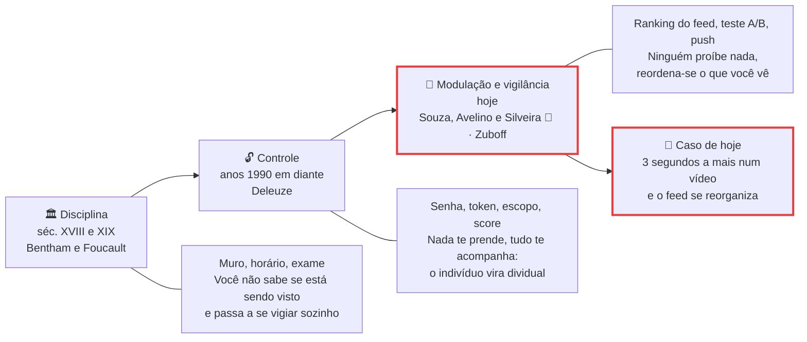
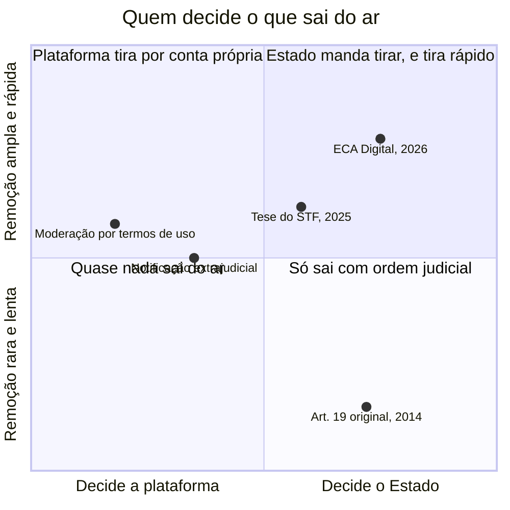
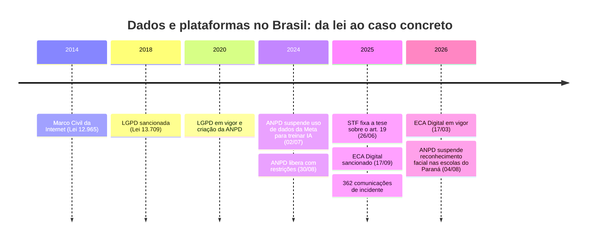

# Poder, plataformas e vigilância: o público, o privado e o sujeito

> [!quote] São Paulo, fevereiro de 2026
> *Oitenta e duas pessoas foram apontadas por câmeras de reconhecimento facial, levadas a delegacias e liberadas em seguida. Cinquenta e três delas porque o mandado já não constava no banco nacional, seis por inconsistência na base do próprio sistema.*

Poder, nesta aula, não é quem grita mais alto. É quem decide **o que aparece**, **o que fica registrado** e **quem responde por isso**. Essas três decisões, que antes cabiam a um juiz, a um editor de jornal ou a um diretor de escola, hoje passam por sistemas que alguém como você escreveu: um ranqueador de feed, um pipeline de logs, um classificador de imagens.

A página não vai dizer se a tecnologia é boa ou má. Vai dar o vocabulário para nomear o que acontece, os dados brasileiros de 2025 e 2026 para não discutir no vácuo, e as ferramentas para você **olhar os seus próprios dados antes do fim da aula**. Capitalismo de vigilância e "artefatos têm política" já foram abertos em [[Ética da IA - Poder, Vigilância e Automação]]: aqui aprofundamos os autores que faltam e o caso brasileiro.

---

## 1. 👁️ Do panóptico à modulação do feed

Comece pelo caso concreto. Você parou dois segundos a mais num vídeo, não curtiu, não comentou, não seguiu ninguém, e no dia seguinte o feed estava diferente. **Ninguém te proibiu de ver nada**: o disponível foi reordenado, e o efeito é que uma parte do mundo ficou perto e outra ficou longe. Guarde a cena: ela é o fim de uma história que começa com um projeto de prisão de 1791.

### 1.1 A arquitetura que dispensa o vigia

**Jeremy Bentham** publicou em 1791 o projeto do **Panóptico**: prédio circular de celas com uma torre no centro. O vigia enxerga todas as celas, o preso não enxerga o vigia. O detalhe genial e assustador é econômico: **não precisa ter ninguém na torre**. Como o preso não sabe se está sendo observado agora, ele se comporta como se sempre estivesse.

![[Recursos/Computação, Sociedade e Inclusão/Poder, plataformas e vigilância - o público, o privado e o sujeito/panoptico-bentham.png|Planta e corte do Panóptico de Bentham (1791): a vigilância é efeito da arquitetura, não do vigia.]]

O projeto saiu do papel: o **Presidio Modelo**, construído em Cuba entre 1926 e 1928, é um panóptico real.

![[Recursos/Computação, Sociedade e Inclusão/Poder, plataformas e vigilância - o público, o privado e o sujeito/presidio-modelo-panoptico.png|Interior do Presidio Modelo, Isla de la Juventud, Cuba. Foto de Friman, CC BY-SA 3.0.]]

Em 1975 o filósofo francês **Michel Foucault** transformou esse prédio em conceito, no livro *Vigiar e punir*: a sociedade moderna funciona por **disciplina**, produzida em espaços de confinamento (escola, quartel, fábrica, hospital, prisão) com a mesma gramática de horário, lugar marcado, registro individual, exame e comparação com a média. Ninguém precisa bater em ninguém, porque o vigiado **interioriza** a vigilância.

![[Recursos/Computação, Sociedade e Inclusão/Poder, plataformas e vigilância - o público, o privado e o sujeito/michel-foucault.png|Michel Foucault por volta de 1968.]]

Tradução direta para quem programa: **logging, telemetria, "esta sessão pode ser gravada", proctoring de prova online, o gráfico de commits do GitHub**. O que produz o efeito não é alguém olhar, é você não saber se alguém está olhando.

### 1.2 O que muda quando o muro cai

Em 1990 **Gilles Deleuze** escreveu seis páginas, o *Post-scriptum sobre as sociedades de controle*, dizendo que aquele modelo já acabava. Não porque a vigilância diminuiu, mas porque **os muros deixaram de ser necessários**. Três frases dele, verificadas na tradução inglesa publicada em *October* (1992):

- **"Individuals have become 'dividuals,' and masses, samples, data, markets, or 'banks'."** O indivíduo, aquilo que não se divide, vira **dividual**: um feixe de atributos que se fatia e se vende em pedaços. Você não é "o Wesley", é uma faixa etária, um CEP, um score, um cluster.
- **"In the societies of control, on the other hand, what is important is no longer either a signature or a number, but a code: the code is a password."** A assinatura identificava, a matrícula numerava. A **senha** libera ou barra o acesso item por item, e pode ser revogada sem aviso.
- **"The old monetary mole is the animal of the spaces of enclosure, but the serpent is that of the societies of control."** A toupeira cava galerias fechadas, a serpente se move em ondas.

Se você já implementou **token que expira**, autorização por **escopo** ou **feature flag** para 5% dos usuários, construiu o que Deleuze descreveu trinta anos antes de existir JWT.

### 1.3 O nome brasileiro da coisa: modulação

O passo seguinte é brasileiro. A coletânea ***A sociedade de controle: manipulação e modulação nas redes digitais***, organizada por Joyce Souza, Rodolfo Avelino e Sérgio Amadeu da Silveira (Hedra, 2018) e presente na bibliografia básica desta disciplina, atualiza Deleuze para as plataformas: a rede social não só vigia, ela **modula** comportamento em tempo real, por teste A/B, recomendação e gamificação. E a modulação dispensa censura: basta reordenar.

> [!abstract] 🧠 Lente filosófica: Foucault (*Vigiar e punir*, 1975) e Deleuze (*Post-scriptum*, 1990)
> Foucault (paráfrase) mostra que o poder moderno não é principalmente proibição: é **produção de comportamento** por arquitetura, registro e comparação. O Panóptico é o diagrama disso, e funciona melhor com a torre vazia.
> Deleuze aceita o diagnóstico e diz que envelheceu: os confinamentos entraram em crise, e o que os substitui é a **modulação**, um controle que muda de forma o tempo todo, como uma peneira cuja malha mudasse de ponto a ponto (paráfrase). Daí a frase verificada sobre o **dividual**.
> **Fica a pergunta:** se o poder disciplinar produzia um sujeito que se vigiava, o que produz um poder que nem precisa ser percebido? E do lado de cá do teclado: ao escrever o ranqueador, você constrói a torre ou a peneira?

> [!abstract] 🧠 Lente filosófica: Souza, Avelino e Silveira, *A sociedade de controle* (2018) 📗
> Sérgio Amadeu da Silveira, professor da UFABC e um dos organizadores, dá ao fenômeno o nome mais preciso da literatura brasileira. Citação lida no artigo integral: *"A modulação é um processo de controle da visualização de conteúdos, sejam discursos, imagens ou sons. As plataformas não criam discursos, mas contam com sistemas de algoritmos que distribuem os discursos criados pelos seus usuários"*.
> Isso desmonta a defesa favorita das plataformas ("não produzimos conteúdo, só hospedamos"): distribuir seletivamente **é** exercer poder sobre o discurso, sem escrever uma linha dele. E não funciona sem perfil, o que liga vigilância de dados a controle de comportamento.
> **Fica a pergunta:** otimizar CTR é decisão técnica ou política? Se for as duas, quem assina embaixo?

> [!example] 🧪 Atividade 1: Meça o seu próprio rastro
> **Ferramenta:** [Minha Atividade](https://myactivity.google.com) e [Google Takeout](https://takeout.google.com).
>
> 1. No Minha Atividade, escolha **um** dia da última semana (o site agrupa por dia) e **conte os itens registrados**: buscas, vídeos, apps abertos, comandos de voz.
> 2. Pelo filtro de datas, anote a **data do registro mais antigo** que existe.
> 3. No Takeout, clique em "Desmarcar tudo", selecione **duas** categorias ("Minha Atividade" e "YouTube") e peça a exportação. Ela demora horas: **peça hoje**. Quando chegar, anote o **tamanho em MB ou GB**.
>
> **Resultado esperado:** três números (itens em um dia, ano do registro mais antigo, tamanho do export) e uma frase sobre quanto disso você lembrava de ter entregado.
>
> 📱 **Só com celular:** os dois sites abrem no navegador; no Android também em Configurações → Google → Gerenciar sua Conta → Dados e privacidade.

> [!example] 🧪 Atividade 2: O seu dossiê publicitário
> **Ferramenta:** [preferências de anúncios da Meta](https://accountscenter.facebook.com/ads) e [Google My Ad Center](https://myadcenter.google.com).
>
> 1. Na Meta, abra **Preferências de anúncios → Categorias de interesse** (o nome do menu muda de versão para versão).
> 2. Anote **10 interesses inferidos** e classifique cada um como **certo**, **errado** ou **assustadoramente certo**.
> 3. Em **Anunciantes cujos anúncios você viu**, anote **3 anunciantes** que você nunca procurou nem seguiu. Compare no My Ad Center o que o Google atribui a você (faixa etária, gênero, estado civil, interesses).
> 4. Pegue o interesse mais estranho e escreva **duas hipóteses técnicas** da inferência: pixel num site, SDK de anúncio num app, lista de contatos, dado comprado.
>
> **Resultado esperado:** tabela de 10 linhas classificadas, 3 anunciantes e 2 hipóteses técnicas. **Leve a tabela, não a tela**: nada de print com dado pessoal seu ou de terceiros.

---

## 2. 💰 Plataforma, atenção e o poder que agrada

Se a modulação depende de perfil, alguém paga pelo perfil. Essa é a parte econômica.

O economista **Nick Srnicek** (*Capitalismo de plataforma*, 2016) descreve a plataforma não como um site, mas como **modelo de negócio**: infraestrutura de intermediação entre dois ou mais grupos (usuários e anunciantes, motoristas e passageiros), que extrai dados de toda interação e cresce por **efeito de rede**, empurrando o mercado para dois ou três vencedores. A camada de cima, o **capitalismo de vigilância** de Shoshana Zuboff, está em [[Ética da IA - Poder, Vigilância e Automação]]; aqui vamos ao lado **do sujeito**. Quem estudou [[Computação em nuvem]] reconhece por que nuvem e anúncios convergem para as mesmas empresas.

| Indicador | Valor | Fonte |
|---|---|---|
| Tempo diário em redes sociais no Brasil | **3h37**, o **3º maior do mundo** | DataReportal, Digital 2025 Brazil |
| WhatsApp | **1h38 por dia** e **28,4 acessos diários** | Comscore, compilação 2026 |
| Instagram e TikTok | **1h27 por dia** cada, empatados | Comscore, compilação 2026 |
| Escolas que já debatem o impacto das telas na saúde mental | **80%** em 2025, contra **62%** em 2024 | CETIC.br, TIC Educação 2025 |

Um alerta de método: **"dopamina digital"** virou senso comum e **não é consenso neurocientífico**. O mecanismo bem descrito na literatura é mais antigo e mais banal, o **reforço de razão variável**, o mesmo do caça-níquel, formulado por Skinner nos anos 1950. Puxar para atualizar o feed é puxar a alavanca.

**Dark pattern** (ou *deceptive design*, design enganoso) é a interface projetada para que a escolha do usuário seja diferente da que ele faria se entendesse a tela: "Aceitar todos os cookies" em verde e "Gerenciar preferências" em cinza de 11 pixels, cancelamento que exige telefonema, caixa pré-marcada, contagem regressiva falsa. A resposta regulatória chegou: o **ECA Digital** (Lei 15.211/2025, em vigor desde 17/03/2026) exige no **art. 7º** **privacidade por padrão no grau mais protetivo disponível**, e no **art. 26** proíbe criar **perfis comportamentais de crianças e adolescentes** para publicidade. Para um recorte de usuários, o default deixou de ser escolha de produto e virou obrigação legal.

| O que é coletado | Para que serve na prática | Onde desligar ou reduzir |
|---|---|---|
| **Histórico de localização** | Perfil de deslocamento, anúncio por região, medição de visita a loja | Permissões do app → Localização: "ao usar" ou "nunca" |
| **Buscas, vídeos, apps abertos** | Inferência de interesse e ranqueamento do feed | [myactivity.google.com](https://myactivity.google.com): desativar e definir exclusão automática (3, 18 ou 36 meses) |
| **Identificador de publicidade** (GAID, IDFA) | Cola o seu comportamento em apps diferentes na mesma pessoa | Android → Google → Anúncios → Excluir ID; iOS → Privacidade → Rastreamento |
| **Interesses inferidos** | Segmentação de anúncio e de conteúdo | [anúncios da Meta](https://accountscenter.facebook.com/ads) e [My Ad Center](https://myadcenter.google.com) |
| **Contatos e agenda** | Grafo social, sugestão de amizade, público semelhante | Permissões do app → Contatos → negar (a maioria continua funcionando) |
| **Pixels e SDKs de terceiros** | Retargeting: o sapato que te persegue por uma semana | Bloqueador de rastreadores; navegador com proteção reforçada |
| **Tempo de uso, desbloqueios, push** | Otimização de engajamento e horário de disparo | Bem-estar digital (Android), Tempo de Uso (iOS), push por app |

> [!abstract] 🧠 Lente filosófica: Byung-Chul Han, *Psicopolítica* (2014)
> O filósofo coreano-alemão Byung-Chul Han sustenta (paráfrase) que saímos da sociedade **disciplinar**, a do "não pode", com muros e regulamentos, para a sociedade **do desempenho**, a do "pode", do projeto e da autorrealização. A exploração vira **auto-exploração** e por isso não gera revolta: não há opressor externo para enfrentar, sobra cansaço.
> Em *Psicopolítica* o argumento fica pior para quem trabalha com dados: o Big Data **não opera como o Panóptico**, que reprime, e sim como **psicopolítica**, que prediz e estimula. O poder eficaz não proíbe, ele **agrada**. Ninguém te obrigou a abrir o WhatsApp 28 vezes hoje. É o par exato de **Herbert Marcuse** (*O homem unidimensional*, 1964), para quem a dominação na sociedade industrial avançada dispensa o terror porque opera pela abundância administrada, produzindo conforto que é gratificação e servidão ao mesmo tempo (paráfrase).
> **Fica a pergunta:** se o sistema te satisfaz, de que ponto de vista você o criticaria? Han diria que a psicopolítica elimina esse ponto de vista. Isso é diagnóstico ou é subestimar o usuário?

> [!example] 🧪 Atividade 3: Sete dias de atenção, medidos
> **Ferramenta:** Android → Configurações → **Bem-estar digital**; iOS → Ajustes → **Tempo de Uso**.
>
> 1. Anote a **média diária dos últimos 7 dias**, o **app líder**, os **desbloqueios por dia** e as **notificações por dia**.
> 2. Calcule a diferença percentual entre a sua média e os **3h37** do DataReportal para o Brasil.
> 3. Desligue as notificações do app líder por **48 horas** e volte ao painel: registre a variação no tempo daquele app.
>
> **Resultado esperado:** os 4 números antes, os mesmos 4 depois das 48 horas e a diferença percentual em relação à média nacional. Se der, compare a mediana da turma com essa média.

> [!example] 🧪 Atividade 4: Quantos rastreadores moram no seu celular
> **Ferramenta:** [Exodus Privacy](https://reports.exodus-privacy.eu.org).
>
> 1. Escolha **2 apps** de uso diário: um de rede social e um que não seja (banco, transporte, delivery, saúde).
> 2. Abra o relatório mais recente de cada APK e anote **número de rastreadores**, **número de permissões**, o **nome de 3 empresas rastreadoras** e a **categoria** de cada uma (analytics, publicidade, perfilamento, localização).
> 3. Negue no seu celular **uma permissão** que julgue desnecessária, use o app e registre se algo quebrou.
>
> **Resultado esperado:** tabela de 2 linhas (app, rastreadores, permissões, 3 empresas) e o registro do que aconteceu ao negar a permissão.
>
> 📱 **Só com celular:** o site abre no navegador e há app oficial do Exodus na F-Droid que analisa o que já está instalado.

---

## 3. 🏛️ O público, o privado e o sujeito

Se a praça virou plataforma, o que sobrou de "público"?

**Jürgen Habermas** descreveu, em *Mudança estrutural da esfera pública* (1962), o surgimento de um espaço entre a família e o Estado, formado por pessoas privadas que se reúnem como público para deliberar: cafés, jornais, associações. Havia um pressuposto técnico, a **mediação editorial**: alguém escolhia o que era publicado, assinava embaixo e podia ser cobrado. Em 2022 Habermas voltou ao tema para dizer que as plataformas quebraram esse pressuposto. O que aparece hoje não passou por um editor, passou por um **ranqueador otimizado por engajamento**. É a **esfera pública algorítmica**.

### 3.1 A bolha existe? Duas evidências que brigam

Aqui está o exercício mais importante da disciplina: a mesma pergunta, dois estudos sérios, respostas diferentes.

| Posição | Evidência | O que ela mostra |
|---|---|---|
| **A câmara de eco é real** | CINELLI, M. et al., *PNAS*, v. 118, n. 9, 2021 | Comparou mais de **100 milhões de conteúdos** sobre temas polêmicos no Gab, Facebook, Reddit e Twitter: a agregação em **clusters homofílicos** domina a dinâmica, com segregação **maior no Facebook** que no Reddit |
| **Trocar o algoritmo não muda a opinião** | GUESS, A. M. et al., *Science*, v. 381, n. 6656, 2023 | Experimento com dezenas de milhares de usuários reais: trocar o feed algorítmico por um **cronológico** reduziu muito o tempo de uso e mudou o que aparecia, mas **não alterou** polarização nem conhecimento político em 3 meses |

Nenhum cancela o outro. O primeiro mede **estrutura da rede**; o segundo mede **efeito causal sobre atitude** numa janela curta, e recebeu crítica pública porque a plataforma mexeu no algoritmo por conta própria durante o experimento. Leitura honesta: **a arquitetura concentra você entre semelhantes, e ainda assim mudar o ranqueador por três meses não vira o voto de ninguém.** Há uma terceira leitura, a de Silveira: talvez o efeito da modulação esteja na **visibilidade** e no **comportamento**, não na opinião declarada.

### 3.2 A praça é privada: moderação e o art. 19

Quando você é banido de uma plataforma, não perdeu um direito civil: perdeu acesso a um serviço privado. Só que esse serviço privado é, para milhões, o único lugar onde a vida pública acontece.

O **art. 19 do Marco Civil da Internet** (Lei 12.965/2014) dizia que a plataforma **só responde** civilmente pelo conteúdo de um usuário se descumprir **ordem judicial** de remoção. A intenção declarada era proteger a liberdade de expressão. Em **11/06/2025** o Plenário do STF formou maioria (**8 a 3**) pela **inconstitucionalidade parcial e progressiva** do artigo, e em **26/06/2025** fixou a tese de repercussão geral, válida a partir dali até o Congresso legislar. O conceito de inconstitucionalidade **progressiva** é o mais interessante para Engenharia: a norma **não nasceu** inconstitucional, ela **se tornou**, porque as condições técnicas e econômicas mudaram.

| Situação | Quem precisa acionar | Efeito |
|---|---|---|
| Maioria dos ilícitos civis | **Notificação extrajudicial** da vítima | A plataforma responde se, notificada, não remover em tempo razoável |
| Rol taxativo de crimes graves com circulação massiva (atos antidemocráticos, terrorismo, incitação a suicídio e automutilação, discriminação, crimes contra a mulher, crimes sexuais contra vulneráveis, tráfico de pessoas) | **Dever de cuidado**, independe de notificação | Responsabilidade por **falha sistêmica** na remoção |
| Ilícito impulsionado por **anúncio pago** ou **rede artificial de distribuição** | Ninguém precisa avisar | **Responsabilidade presumida**, afastada se a empresa provar diligência |
| **Crimes contra a honra** e comunicação privada (e-mail, mensageria, reunião fechada) | **Ordem judicial** | A regra do art. 19 **permanece** |

A decisão também exige que provedores com atuação no Brasil mantenham **sede ou representante legal no país**, ponto herdado do episódio de 2024 em que uma plataforma global operou aqui sem representante legal e foi bloqueada por decisão judicial, caso que rende discussão sobre jurisdição, soberania digital e proporcionalidade. Vale a regra da casa: **antes de citar datas e números em prova ou slide, confira na fonte primária do STF**, não na memória nem na de um LLM.

### 3.3 Privacidade não é segredo, é controle

A **LGPD** (Lei 13.709/2018) não trata privacidade como "esconder coisa errada", e sim como **poder de decisão sobre o próprio dado**, convertido em direitos exigíveis:

- **Art. 18:** a qualquer momento você pode pedir **confirmação** de que existe tratamento, **acesso**, **correção**, **anonimização, bloqueio ou eliminação** de dados desnecessários, **portabilidade**, **informação sobre com quem seus dados foram compartilhados** e **revogação do consentimento**. O §1º permite **peticionar à ANPD**.
- **Art. 19:** a resposta vem **em formato simplificado, imediatamente**, ou por **declaração clara e completa** (origem dos dados, critérios, finalidade) **em até 15 dias**.
- **Art. 20:** você pode **solicitar revisão de decisões tomadas unicamente com base em tratamento automatizado** que afetem seus interesses, inclusive as que definem perfil de crédito, de consumo ou profissional. O §1º obriga o controlador a fornecer **informações claras e adequadas sobre os critérios e os procedimentos** da decisão, observados os segredos comercial e industrial.

O art. 20 é onde o "dividual" de Deleuze encontra a lei: você pode exigir explicação sobre a **fatia sua** que a máquina usou para decidir.

> [!example] 🧪 Atividade 5: Conte quantos terceiros entram junto com a notícia
> **Ferramenta:** DevTools do navegador (**F12** → **Application → Cookies** e aba **Network**).
>
> 1. Em janela anônima, sem bloqueador, carregue **uma única matéria** de um portal de notícias brasileiro.
> 2. Em **Application → Cookies**, liste os domínios que gravaram cookie e marque os que **não são** o domínio do jornal: esses são os terceiros.
> 3. Em **Network**, conte **quantos domínios distintos** foram contatados nessa página. Repita com o bloqueador ligado e anote a diferença nos dois números.
>
> **Resultado esperado:** dois pares de números (cookies de terceiros e domínios contatados, com e sem bloqueador) e o ranking das 5 empresas mais frequentes na turma.
>
> 📱 **Só com celular:** use o [Webbkoll](https://webbkoll.dataskydd.net), cole a URL da matéria e leia as seções de requests de terceiros e de cookies.

> [!example] 🧪 Atividade 6: Exerça um direito da LGPD de verdade (embrião do T1)
> **Ferramenta:** a política de privacidade de um serviço que você usa, o canal do **encarregado (DPO)** dele e a [Lei 13.709/2018](https://www.planalto.gov.br/ccivil_03/_ato2015-2018/2018/lei/l13709.htm).
>
> 1. Escolha **um** serviço que decide algo sobre você (rede social, banco, bureau de crédito, app de transporte) e ache na política de privacidade o **canal do encarregado**, em geral um e-mail (`dpo@`, `privacidade@`, `encarregado@`) ou formulário.
> 2. Envie um pedido escrito citando **confirmação e acesso** (art. 18, I e II), **informação sobre compartilhamento** (art. 18, VII) e, se houver decisão automatizada, **revisão e explicação dos critérios** (art. 20 e §1º).
> 3. Registre **data e hora do envio** e calcule a **data limite dos 15 dias** do art. 19, II.
> 4. Na data limite, registre o resultado: resposta completa, parcial ou silêncio. Em caso de silêncio, anote o caminho para peticionar à ANPD.
>
> **Resultado esperado:** um PDF com o pedido enviado (com data), a resposta (ou o print da caixa vazia na data limite) e três linhas avaliando se ela cumpre o requisito de "informações claras e adequadas". **Peça apenas os seus próprios dados.** Este material entra direto no [[Trabalhos e Projetos de Computação, Sociedade e Inclusão|T1: auditoria de um algoritmo do cotidiano]].
>
> 📱 **Só com celular:** vários apps já têm o pedido em Configurações → Privacidade → "Baixar seus dados". Serve, desde que você registre data de envio e de resposta.

> [!example] 🧪 Atividade 7: A tese do STF aplicada a três posts reais
> **Ferramenta:** o documento oficial [Informação à Sociedade sobre o art. 19 do Marco Civil](https://www.stf.jus.br/arquivo/cms/noticiaNoticiaStf/anexo/Informac807a771oa768SociedadeArt19MCI_vRev.pdf) (o site do STF bloqueia acesso automatizado: abra no navegador, não por script).
>
> 1. Leia e monte uma **tabela de 4 linhas** com os regimes: notificação extrajudicial, dever de cuidado, responsabilidade presumida em impulsionamento pago, e o que ainda exige ordem judicial.
> 2. Escolha **3 conteúdos reais** que você viu esta semana. Descreva o conteúdo e **não exponha o autor**.
> 3. Para cada um, responda **qual regime se aplicaria** e **quem age primeiro** (a vítima, a plataforma ou o juiz). Anote **dois pontos** do documento que você não sabia.
>
> **Resultado esperado:** a tabela de 4 regimes, a classificação dos 3 conteúdos com uma linha de justificativa cada e os 2 pontos novos. Se discordar da tese, escreva qual regime você adotaria e por quê.

---

## 4. 🇧🇷 Estado e vigilância no Brasil

Até aqui o poder era privado. Agora entra o Estado, que no Brasil de 2026 é comprador ativo de tecnologia de vigilância.

![[Recursos/Computação, Sociedade e Inclusão/Poder, plataformas e vigilância - o público, o privado e o sujeito/reconhecimento-facial.png|Demonstração pública de reconhecimento facial: cada rosto vira uma caixa e um vetor comparado com um banco. Foto de Pete Woodhead, CC BY 2.0.]]

### 4.1 Smart Sampa: os números que existem

O **Smart Sampa** é o programa municipal de videomonitoramento com reconhecimento facial de São Paulo, em operação desde 2023, integrando dezenas de milhares de câmeras. O que se sabe com fonte:

- **04/02/2026:** **82 pessoas foram abordadas e levadas a delegacias** e depois liberadas. Dessas, **53 por ausência de registro no BNMP** (o mandado não constava mais no Banco Nacional de Monitoramento de Prisões) e **6 por inconsistência na própria base do Smart Sampa**.
- **Nota técnica da Rede Liberdade com o Instituto Peregum:** entre as prisões via Smart Sampa com identificação racial registrada, **25,09% eram de pessoas negras**. O dado racial existia em apenas **58,9%** dos registros, o que já diz algo sobre a qualidade da base.
- **Estudo do CESeC:** após mais de um ano de operação, **não há evidência estatística de impacto na redução de crimes**, segundo a coordenadora da pesquisa, Thallita Lima.
- **Caso individual:** um homem negro foi **detido 4 vezes em 7 meses** por erro do sistema.

Para contexto, o dado mais citado do país vem do levantamento da **Rede de Observatórios da Segurança** sobre casos de 2019: **90,5% das pessoas presas por reconhecimento facial no Brasil eram negras**. O pesquisador **Tarcízio Silva** mantém o [Desvelar](https://desvelar.org), banco público de casos de discriminação algorítmica. O mecanismo técnico desse erro desigual é o assunto de [[Vieses, discriminação algorítmica e inclusão]].

### 4.2 Reconhecimento facial na escola: o caso do Paraná

Em 2023 a rede estadual do Paraná passou a condicionar o **registro de frequência escolar** ao reconhecimento facial: professores fotografavam a sala, as imagens iam para servidores e um algoritmo marcava presença. O sistema chegou a mais de **1.700 escolas** e cerca de **1 milhão de estudantes**.

Em **04/08/2026** a Superintendência de Fiscalização da **ANPD** determinou a **suspensão imediata** do tratamento de dados biométricos de crianças e adolescentes da rede estadual. Entre os fundamentos, o **art. 11** da LGPD (dado biométrico é **dado sensível**, com hipóteses restritas de tratamento), o **art. 14** (dados de crianças e adolescentes devem atender ao **melhor interesse** delas) e os deveres de segurança e prestação de contas. O raciocínio interessa a um engenheiro: **a legitimidade do objetivo (registrar presença) não justifica automaticamente a infraestrutura biométrica escolhida para alcançá-lo.** Havia alternativa menos invasiva, e ela é a chamada oral.

Um levantamento do **InternetLab**, de março de 2026, identificou reconhecimento facial em escolas públicas de **sete estados** (Alagoas, Amazonas, Goiás, Paraná, Rio de Janeiro, São Paulo e Tocantins), com pouca transparência, sem debate com a comunidade escolar e com respostas insuficientes a pedidos de acesso à informação.

> [!info] 🇧🇷 Faça o teste na sua cidade
> "Quantas câmeras a prefeitura daqui opera, com que software, guardando imagem por quanto tempo?" quase nunca tem resposta publicada, e é uma pergunta respondível por pedido de acesso à informação (Lei 12.527/2011) no [Fala.BR](https://falabr.cgu.gov.br). É um bom ponto de partida para o [[Projeto de Extensão - IA para Todos]] e vale para Bom Jesus do Itabapoana tanto quanto para São Paulo.

### 4.3 ANPD contra Meta, e o vazamento como rotina

- **02/07/2024:** a ANPD determinou **suspensão cautelar** do tratamento de dados publicados nas plataformas da Meta para **treinamento de IA**, com **multa diária de R\$ 50.000**. Motivos: base legal inadequada (legítimo interesse), falta de informação clara, limitação excessiva de direitos e dados de crianças e adolescentes sem salvaguardas.
- **30/08/2024:** a ANPD **suspendeu a medida preventiva** após a Meta apresentar Plano de Conformidade, permitindo retomada **com restrições**. O Idec sustentou que a análise foi insuficiente e que a base legal não foi devidamente examinada.
- Em **2025** a ANPD recebeu **362 comunicações de incidentes de segurança**, quase uma por dia, e abriu processo sancionador por incidente que atingiu dados de **500 mil pacientes** de unidades públicas de saúde em seis estados. O prazo para comunicar incidente relevante passou a ser de **3 dias úteis** da ciência.

Quando você projetar o próximo sistema, a pergunta não é "e se vazar", é "quando vazar, quantas pessoas e quais campos". Isso muda a arquitetura, e é o raciocínio de superfície de ataque de [[Anonimato e privacidade]] e [[Engenharia social]].

> [!example] 🧪 Atividade 8: Você é único na multidão?
> **Ferramenta:** [Cover Your Tracks (EFF)](https://coveryourtracks.eff.org) e [AmIUnique](https://amiunique.org).
>
> 1. Rode o Cover Your Tracks no navegador do dia a dia e anote: se bloqueia rastreadores, se a impressão digital é **única**, e quantos **bits de informação identificadora** o teste atribui a você.
> 2. Repita em **aba anônima**, depois com um **bloqueador** ativo, e por fim no **celular**.
> 3. Rode o AmIUnique e anote quais atributos mais contribuem para a sua unicidade (fontes, resolução, fuso, WebGL, user agent).
>
> **Resultado esperado:** tabela de 4 linhas (normal, anônimo, com bloqueador, celular) com três colunas: bloqueia rastreadores, é único, bits de entropia. Escreva duas linhas sobre o resultado mais contraintuitivo. Dica: aba anônima costuma **não** ajudar contra fingerprinting, e entender por quê é metade da atividade.
>
> 📱 **Só com celular:** os dois sites rodam no navegador do celular, sem instalar nada.

---

## 5. 🧭 Colonialismo de dados: onde ficam os servidores

Se a modulação precisa de dados e os dados precisam de infraestrutura, a pergunta seguinte é geográfica: **onde isso mora e quem escreveu o contrato?**

**Nick Couldry** e **Ulises Mejias**, em *The Costs of Connection* (2019), propõem o **colonialismo de dados**: a extração de dados repetiria a lógica histórica de apropriação de recursos, agora sobre a vida cotidiana, com centro de acumulação no Norte global. Não é metáfora vaga: dados extraídos na periferia, processados e monetizados no centro, com rotulagem terceirizada e modelos treinados majoritariamente em corpora anglófonos.

O Brasil está nesse ponto de decisão. Em **01/09/2026** o Senado aprovou o **PL 278/2026**, que cria o **Redata**, regime especial de tributação para data centers: zera tributos federais sobre importação de componentes e suspende tributos sobre equipamentos do ativo imobilizado por cinco anos. Em troca exige energia de fontes limpas ou renováveis, **eficiência hídrica igual ou inferior a 0,05 litro por kWh** no resfriamento, investimento no país de 2% do valor dos produtos comprados com o benefício e reserva de **10% dos serviços para o mercado interno**. A renúncia fiscal estimada pelo governo é de cerca de **R\$ 5,2 bilhões** no primeiro ano. Entidades da sociedade civil publicaram manifesto criticando a falta de debate, com uma frase que resume a objeção: **"soberania não se resume a instalar servidores em território nacional"**. O fio continua em [[A virada da IA - o que mudou no mundo desde 2022]].

> [!abstract] 🧠 Lente filosófica: Couldry e Mejias, *The Costs of Connection* (2019)
> A tese (paráfrase): o colonialismo histórico apropriou-se de território, corpos e recursos naturais; o colonialismo de dados apropria-se da **vida cotidiana como matéria-prima**, e o faz com consentimento aparente, porque vem embrulhado em serviço útil e gratuito.
> O par brasileiro é **Laymert Garcia dos Santos** (*Politizar as novas tecnologias*, 2003), que já lia em paralelo a apropriação do **código genético** (biodiversidade brasileira virando informação patenteável no Norte) e a do **código digital**. Ele defende (citação de resenha acadêmica, sem página confirmada) a "necessidade imperiosa [...] de se politizar completamente o debate sobre a tecnologia e suas relações com a ciência e com o capital, em vez de deixar que ela continue a ser tratada apenas no âmbito das políticas tecnológicas dos Estados ou das estratégias das empresas transnacionais". Isso é de 2003, duas décadas antes do debate sobre dado biométrico como insumo de treino.
> **Fica a pergunta:** um data center em solo brasileiro, com energia e água brasileiras, processando dados de brasileiros para um modelo cujos pesos e cuja política de uso são decididos fora do país: isso é soberania ou é endereço?

> [!example] 🧪 Atividade 9: Leia o contrato que você assinou sem ler
> **Ferramenta:** [ToS;DR (Terms of Service, Didn't Read)](https://tosdr.org).
>
> 1. Escolha **3 serviços** de uso diário e anote a **nota de A a E** de cada um.
> 2. Para cada um, copie **uma cláusula classificada como "ruim" ou "blocker"** e anote qual direito ela restringe (uso do seu conteúdo, foro, alteração unilateral, retenção após exclusão, compartilhamento com terceiros).
> 3. Abra o **termo de uso oficial** e use Ctrl+F para **localizar a cláusula original**: confirme se o resumo corresponde ao texto real e anote a divergência, se houver. Verifique também **onde os dados são armazenados** e **em que país se resolvem os litígios**.
>
> **Resultado esperado:** ficha de 3 serviços com nota, cláusula ruim (texto original citado), direito restringido e país de foro. O passo 3 é o ponto da atividade: **resumo não é fonte**.
>
> 📱 **Só com celular:** o ToS;DR funciona no navegador e há extensão para Firefox Android.

---

## 6. 🤖 E a IA? · 🔮 E em 2036?

A IA não inventou a vigilância: ela **removeu o gargalo humano**. Antes, mil câmeras exigiam mil pessoas olhando telas, e por isso quase nada era visto. Com visão computacional, mil câmeras viram um índice pesquisável. Três mudanças: **escala** (buscar um rosto em 40 mil câmeras virou problema de GPU, não de pessoal), **perfilamento** (modelos de embedding cruzam texto, imagem e comportamento no mesmo espaço vetorial, e o "dividual" de Deleuze virou literalmente um vetor) e **predição** (o *predictive policing* tenta antecipar onde e por quem o crime acontece, herdando os vieses da base que o alimenta).

A mesma técnica joga do outro lado: **detecção de fraude**, **privacidade diferencial** (estatística útil sem expor indivíduo), **aprendizado federado** (treinar sem centralizar dado bruto), **criptografia homomórfica** e **enclaves** (processar sem ler). Nada disso é ficção: é engenharia disponível, com custo.

| Cenário para 2036 | Quem sustenta essa direção | Sinal de que está acontecendo |
|---|---|---|
| **Vigilância normalizada** | A leitura de Zuboff e de Couldry e Mejias sobre a trajetória atual | Biometria em serviços cotidianos (escola, transporte, estádio) antes de qualquer regra específica, como nos sete estados brasileiros |
| **Regulação forte e efetiva** | O desenho do PL 2338/2023 e do AI Act europeu, com classificação por risco e direito de explicação e contestação | Decisões administrativas com efeito prático, como a suspensão do reconhecimento facial nas escolas do Paraná |
| **Descentralização técnica** | Modelos abertos, software livre e a tese de "IA como tecnologia normal" de Narayanan e Kapoor | Gente rodando modelo no próprio hardware, como em [[Ollama - gerenciamento de modelos de IA]], em vez de mandar tudo para a nuvem |

Cuidado com a torcida: o AI Act europeu, celebrado como prova de que "dá para regular", teve as obrigações de alto risco **adiadas** de agosto de 2026 para dezembro de 2027 e agosto de 2028, por um pacote de simplificação em vigor desde 27/07/2026. **Regular no papel e regular na prática são coisas diferentes.**

**O que sobra para você.** Você forma em 2027 ou 2028 e vai passar a década seguinte escrevendo sistemas que coletam dado. Cinco decisões que são suas, não do jurídico:

1. **Minimização.** Todo campo coletado precisa responder "para qual finalidade declarada?". Campo sem finalidade é passivo, não ativo.
2. **Retenção.** Log eterno é decisão de arquitetura, não lei da natureza. Defina TTL e escreva o job que apaga.
3. **Default protetivo.** O art. 7º do ECA Digital já obriga isso para menores. Fazer para todo mundo é barato e vira diferencial.
4. **Explicabilidade operacional.** Alguém vai pedir a explicação do art. 20 da LGPD. Guardar features e score no momento da decisão custa pouco; reconstruir depois custa muito.
5. **Alternativa menos invasiva.** É a pergunta que derrubou o sistema do Paraná: dá para atingir o mesmo objetivo com menos dado sensível?

Isso é **privacy by design**, requisito não funcional do mesmo tipo que desempenho e disponibilidade, com a diferença de que a auditoria pode vir de uma autoridade com poder de multa. O tema continua em [[O engenheiro de computação em 2036 - trabalho, carreira e responsabilidade]].

---

## 🗣️ Para debater em sala

> [!question] 1. O Estado deve suspender o reconhecimento facial na segurança pública até existirem regras específicas?
> **Posição A, moratória.** O estudo do CESeC não encontrou evidência estatística de redução de crimes; 82 pessoas foram levadas a delegacias e liberadas, 53 delas por mandado que já não constava no BNMP; e o levantamento de 2019 da Rede de Observatórios da Segurança registra 90,5% de pessoas negras entre as presas por reconhecimento facial. Enquanto o erro recai desigualmente, o custo social supera o benefício não comprovado.
> **Posição B, regular em vez de proibir.** O PL 2338/2023 (aprovado no Senado em 10/12/2024, ainda aguardando parecer na Câmara) classifica identificação biométrica como sistema de alto risco, com avaliação, transparência e contestação, em vez de banimento; o AI Act europeu segue lógica parecida. Proibição empurra o uso para a sombra; regulação com auditoria deixa rastro fiscalizável.
> **O que decide:** que evidência de eficácia seria suficiente para você? Defina o número antes de discutir.

> [!question] 2. A tese do STF sobre o art. 19 protege a vítima ou cria censura privada?
> **Posição A, avanço necessário.** A análise da "inconstitucionalidade parcial e progressiva" sustenta que a norma de 2014 foi escrita para uma internet que não existe mais, e que exigir ordem judicial em todo caso deixava a vítima sem remédio útil diante de circulação massiva. A tese mantém a ordem judicial para crimes contra a honra justamente para não transformar debate em censura.
> **Posição B, risco de remoção excessiva.** A Coalizão Direitos na Rede publicou nota crítica em 02/07/2025: responsabilizar a plataforma por conteúdo não removido cria incentivo a remover por precaução, e quem paga a conta do excesso é o usuário sem advogado.
> **O que decide:** existe desenho técnico (prazo, recurso, relatório público de remoções) que reduza o incentivo à remoção preventiva? Proponha um.

> [!question] 3. A bolha algorítmica é o problema, ou é desculpa?
> **Posição A, a estrutura importa.** Cinelli et al. (PNAS, 2021) analisaram mais de 100 milhões de conteúdos e mostraram que clusters homofílicos dominam a dinâmica das redes, com segregação maior no Facebook que no Reddit.
> **Posição B, o efeito causal é pequeno.** Guess et al. (Science, 2023) trocaram o feed algorítmico por cronológico em dezenas de milhares de usuários reais: mudou o tempo de uso e o que aparecia, e não mudou polarização nem conhecimento político em três meses.
> **O que decide:** e se os dois estiverem certos, e o efeito da modulação estiver na visibilidade e no comportamento (o que você compra, compartilha e deixa de ver) em vez da opinião declarada, como sugere Silveira? Como você mediria isso?

---

## ❓ Quiz rápido

> [!question]- 1. No Panóptico de Bentham, lido por Foucault, o que produz o efeito disciplinar?
> **Resposta:** O vigiado **não saber** se está sendo observado naquele momento, o que o leva a agir como se sempre estivesse. Por isso a torre pode estar vazia: o efeito vem da arquitetura e da incerteza, não do vigia. É o mesmo mecanismo de "esta sessão pode ser gravada".

> [!question]- 2. Segundo Deleuze, o que substitui a assinatura e o número da sociedade disciplinar?
> **Resposta:** O **código**, e o código é uma **senha**: *"what is important is no longer either a signature or a number, but a code: the code is a password"*. Junto vem o **dividual**: o indivíduo deixa de ser indivisível e vira feixe de atributos fatiável (amostras, dados, mercados, bancos).

> [!question]- 3. Você pediu acesso aos seus dados pela LGPD. Qual é o prazo legal de resposta?
> **Resposta:** Art. 19: **imediatamente** em **formato simplificado**, ou em **até 15 dias** por **declaração clara e completa** indicando origem dos dados, critérios utilizados e finalidade. Se a empresa ignorar, cabe **peticionar à ANPD** (art. 18, §1º).

> [!question]- 4. Depois da tese do STF de 26/06/2025, qual situação ainda exige ordem judicial?
> **Resposta:** Os **crimes contra a honra** (calúnia, difamação, injúria) continuam sob a regra do art. 19, assim como os serviços de comunicação privada. Nos demais ilícitos civis basta **notificação extrajudicial**, e para o rol taxativo de crimes graves há **dever de cuidado** independente de notificação.

> [!question]- 5. Verdadeiro ou falso: o estudo do CESeC concluiu que o Smart Sampa reduziu a criminalidade em São Paulo.
> **Resposta:** **Falso.** Após mais de um ano de operação, o estudo **não encontrou evidência estatística de impacto na redução de crimes**. "Não há evidência de efeito" não é o mesmo que "está provado que não há efeito", e essa diferença é exatamente o que se cobra de quem audita sistemas.

---

## 🔗 Veja também

- [[Ética da IA - Poder, Vigilância e Automação]]: capitalismo de vigilância (Zuboff) e "artefatos têm política" (Winner), a base que esta página pressupõe.
- [[Anonimato e privacidade]]: o lado técnico da defesa (Tor, VPN, metadados, o que a anonimização garante de fato).
- [[Engenharia social]]: por que o dado que vaza vira ataque contra pessoas, não contra máquinas.
- [[A tecnologia não é neutra - Computação e Sociedade]]: a tese geral de que escolha técnica embute escolha política.
- [[Vieses, discriminação algorítmica e inclusão]]: o mecanismo técnico do erro desigual do reconhecimento facial.
- [[Trabalhos e Projetos de Computação, Sociedade e Inclusão]]: a atividade 6 é o embrião do **T1**.
- [[Kit de ferramentas de Computação e Sociedade]]: formato do debate, protocolo ético e modelos de termo.
- ⬅️ **Aula anterior:** [[Automação, trabalho e o futuro das profissões]]
- ➡️ **Próxima aula:** [[Cultura, identidade e tecnologias digitais]]

---

> [!note] 📚 Fontes (2025-2026)
> **Vigilância no Brasil:** [Smart Sampa, 82 pessoas levadas a delegacias (Brasil de Fato, 04/02/2026)](https://www.brasildefato.com.br/2026/02/04/smart-sampa-mais-de-80-pessoas-foram-levadas-para-delegacias-por-inconsistencia-do-reconhecimento-facial/) · [25% das pessoas presas são negras (Alma Preta)](https://almapreta.com.br/sessao/cotidiano/pesquisa-indica-que-25-das-pessoas-presas-pelo-smart-sampa-sao-negras-e-aponta-falhas-no-sistema/) · [Estudo do CESeC](https://revistasegurancaeletronica.com.br/reconhecimento-facial-do-smart-sampa-nao-reduziu-criminalidade-na-cidade-de-sp-diz-estudo/) · [Desvelar, casos de discriminação algorítmica](https://desvelar.org/casos-de-discriminacao-algoritmica/) · [Rede de Observatórios da Segurança](https://observatorioseguranca.com.br/) · [Reconhecimento facial monitora alunos (Agência Pública, 18/03/2026)](https://apublica.org/2026/03/reconhecimento-facial-sistema-monitora-alunos-no-brasil/) · [ANPD suspende o uso nas escolas do Paraná (Data Privacy Brasil)](https://www.dataprivacybr.org/documentos/anpd-suspende-o-uso-de-reconhecimento-facial-em-escolas-publicas-do-parana/)
>
> **Leis e decisões:** [LGPD, Lei 13.709/2018](https://www.planalto.gov.br/ccivil_03/_ato2015-2018/2018/lei/l13709.htm) · [ECA Digital, Lei 15.211/2025](https://www.planalto.gov.br/ccivil_03/_ato2023-2026/2025/lei/l15211.htm) · [STF, Informação à Sociedade sobre o art. 19 (PDF oficial)](https://www.stf.jus.br/arquivo/cms/noticiaNoticiaStf/anexo/Informac807a771oa768SociedadeArt19MCI_vRev.pdf) · [Maioria formada (Conjur, 11/06/2025)](https://www.conjur.com.br/2025-jun-11/stf-forma-maioria-por-responsabilizacao-de-big-techs-por-publicacoes-de-usuarios/) · [Tese fixada (Conjur, 26/06/2025)](https://conjur.com.br/2025-jun-26/supremo-fixa-tese-sobre-responsabilizacao-de-plataformas-por-conteudo-de-usuarios/) · [Inconstitucionalidade progressiva (Conjur, 15/08/2025)](https://conjur.com.br/2025-ago-15/o-stf-e-a-inconstitucionalidade-parcial-e-progressiva-do-artigo-19-do-marco-civil-da-internet/) · [Nota da Coalizão Direitos na Rede (02/07/2025)](https://direitosnarede.org.br/2025/07/02/nota-sobre-julgamento-do-stf-sobre-a-constitucionalidade-do-artigo-19-do-marco-civil-da-internet/) · [ANPD suspende dados da Meta (02/07/2024)](https://www.gov.br/anpd/pt-br/assuntos/noticias/anpd-determina-suspensao-cautelar-do-tratamento-de-dados-pessoais-para-treinamento-da-ia-da-meta) · [Retomada com restrições (30/08/2024)](https://www.gov.br/anpd/pt-br/assuntos/noticias/meta-cumpre-exigencias-da-anpd-e-podera-retomar-com-restricoes-o-uso-de-dados-pessoais-para-treinamento-de-inteligencia-artificial) · [PL 2338/2023 na Câmara](https://www.camara.leg.br/proposicoesWeb/fichadetramitacao?idProposicao=2487262) · [AI Act (Comissão Europeia)](https://digital-strategy.ec.europa.eu/en/policies/regulatory-framework-ai) · [Senado aprova o Redata (Agência Brasil, 01/09/2026)](https://agenciabrasil.ebc.com.br/politica/noticia/2026-09/senado-aprova-projeto-que-cria-incentivos-para-data-centers-no-brasil)
>
> **Atenção e esfera pública:** [DataReportal, Digital 2025 Brazil](https://datareportal.com/reports/digital-2025-brazil) · [Consumo de internet e redes no Brasil em 2026 (Comscore)](https://www.negociossc.com.br/blog/o-consumo-de-internet-e-redes-sociais-no-brasil-de-2026-em-dados/) · [CETIC.br, TIC Educação 2025](https://cetic.br/pt/noticia/tic-educacao-2025-mostra-que-8-em-cada-10-escolas-brasileiras-debatem-impacto-do-uso-de-telas-na-saude-mental-dos-alunos/) · CINELLI, M. et al. The echo chamber effect on social media. *PNAS*, v. 118, n. 9, 2021, [doi 10.1073/pnas.2023301118](https://doi.org/10.1073/pnas.2023301118) · GUESS, A. M. et al. *Science*, v. 381, n. 6656, p. 398-404, 2023, [doi 10.1126/science.abp9364](https://doi.org/10.1126/science.abp9364) · [Deleuze, Postscript on the Societies of Control](https://theanarchistlibrary.org/library/gilles-deleuze-postscript-on-the-societies-of-control) · [SILVEIRA, S. A., A noção de modulação e os sistemas algorítmicos (PDF)](https://revista.fapcom.edu.br/index.php/revista-paulus/article/download/111/102) · [Deceptive Design, catálogo de dark patterns](https://www.deceptive.design/)
>
> **Ferramentas das atividades:** [Minha Atividade](https://myactivity.google.com) · [Takeout](https://takeout.google.com) · [My Ad Center](https://myadcenter.google.com) · [anúncios da Meta](https://accountscenter.facebook.com/ads) · [Cover Your Tracks](https://coveryourtracks.eff.org) · [AmIUnique](https://amiunique.org) · [Exodus Privacy](https://reports.exodus-privacy.eu.org) · [ToS;DR](https://tosdr.org) · [Webbkoll](https://webbkoll.dataskydd.net) · [Fala.BR](https://falabr.cgu.gov.br)
>
> **Imagens (Wikimedia Commons):** [Panóptico de Bentham, 1791, domínio público](https://commons.wikimedia.org/wiki/File:Panopticon.jpg) · [Presidio Modelo, Friman, CC BY-SA 3.0](https://commons.wikimedia.org/wiki/File:Presidio-modelo2.JPG) · [Michel Foucault c. 1968, domínio público](https://commons.wikimedia.org/wiki/File:Michel_Foucault_c._1968.jpg) · [Demonstração de reconhecimento facial, Pete Woodhead, CC BY 2.0](https://commons.wikimedia.org/wiki/File:Demonstration_of_facial_recognition_software.jpg)

> [!note] 📖 Leituras
> - 📗 SOUZA, Joyce; AVELINO, Rodolfo; SILVEIRA, Sérgio Amadeu da (orgs.). *A sociedade de controle: manipulação e modulação nas redes digitais*. São Paulo: Hedra, 2018. Bibliografia básica do PPC: traduz Deleuze para as plataformas brasileiras.
> - 📗 CASTELLS, Manuel. *O poder da identidade*. São Paulo: Paz e Terra, 1999. Bibliografia básica do PPC: poder e identidade na sociedade em rede, base para a próxima aula.
> - FOUCAULT, Michel. *Vigiar e punir: nascimento da prisão*. Petrópolis: Vozes, 1977 (orig. 1975). O Panóptico como diagrama do poder disciplinar.
> - 🔓 DELEUZE, Gilles. Post-scriptum sobre as sociedades de controle. In: *Conversações*. São Paulo: Ed. 34, 1992 (orig. 1990). Seis páginas, leitura obrigatória da aula; [texto em inglês em acesso livre](https://theanarchistlibrary.org/library/gilles-deleuze-postscript-on-the-societies-of-control).
> - 🔓 SILVEIRA, Sérgio Amadeu da. *Democracia e os códigos invisíveis*. São Paulo: Edições Sesc, 2019. [PDF aberto no Internet Archive](https://archive.org/details/sergio-amadeu-da-silveira-democracia-e-os-codigos-invisiveis).
> - HAN, Byung-Chul. *Psicopolítica*. Belo Horizonte: Âyiné, 2018 (orig. 2014).
> - SRNICEK, Nick. *Capitalismo de plataforma*. São Paulo: Ubu, 2017 (orig. 2016).
> - HABERMAS, Jürgen. *Mudança estrutural da esfera pública*. São Paulo: Unesp, 2014 (orig. 1962).
> - COULDRY, Nick; MEJIAS, Ulises A. *The Costs of Connection*. Stanford: Stanford University Press, 2019.
> - SANTOS, Laymert Garcia dos. *Politizar as novas tecnologias*. São Paulo: Editora 34, 2003. Código genético e código digital como a mesma lógica de apropriação.
