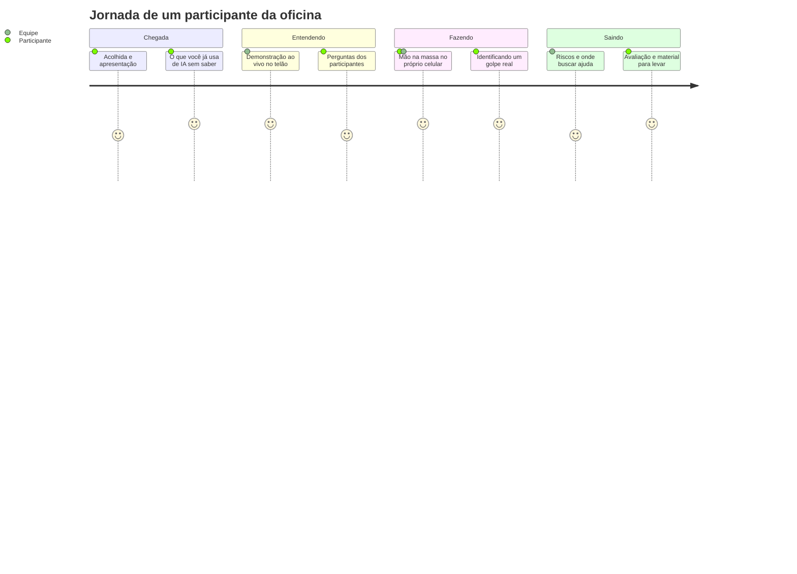

# Projeto de Extensão: IA para Todos

> [!quote] Aprendizado Prático
> *Não é necessário realizar todas as tarefas abaixo, somente as que forem solicitadas pelo professor.*

> [!info] Isto é uma proposta
> Este é um **possível projeto** para as 20 horas de extensão da disciplina. O professor define em aula se ele acontece, com quais públicos, quanto vale e qual é a data de cada marco. Os pontos e os marcos desta página são sugestões; a versão que vale é a anunciada em aula e registrada no [[Comp Sociedade 7Eng 2026-2|log da turma]].

> [!quote] Extensão ou comunicação?
> *Paulo Freire perguntou isso em 1969, muito antes da internet: levar conhecimento "para" a comunidade é diferente de construir conhecimento "com" ela. Este projeto existe para você descobrir, na prática, que ensinar uma pessoa idosa a reconhecer um golpe feito com inteligência artificial, ou um estudante de escola pública a estudar com IA sem ser enganado por ela, ensina mais sobre computação e sociedade do que qualquer texto.*

> [!abstract] 🧭 O que é
> Um terço da carga horária desta disciplina (20 das 60 horas-aula) é **extensão curricularizada**: a Resolução CNE/CES 7/2018 exige que pelo menos 10% dos currículos de graduação sejam atividades de extensão, e o projeto pedagógico do curso coloca essa carga dentro desta disciplina. Extensão, aqui, significa **trabalho com público externo ao campus, com troca de mão dupla e evidência**. A proposta: em equipes de 3 a 4, planejar, produzir e executar **uma oficina de letramento em inteligência artificial e inclusão digital** para um público real de Bom Jesus do Itabapoana, e publicar o material como **recurso educacional aberto** (REA) para que qualquer pessoa reutilize.

---

## 1. 🎯 Objetivos

| Para a comunidade | Para você |
|---|---|
| Entender o que é inteligência artificial em linguagem simples e o que ela já faz no cotidiano (WhatsApp, buscas, atendimento, golpes) | Aplicar as unidades 4, 6, 7 e 8 da ementa (REA, cidadania e educação, tecnologia social, relevância social) num projeto real |
| Sair da oficina com pelo menos uma coisa feita: uma pergunta a um assistente de IA, um golpe identificado, um serviço do gov.br acessado, uma configuração de privacidade ajustada | Exercitar as competências do curso: comunicar-se com público não técnico, trabalhar em equipe, avaliar o impacto social do que projeta |
| Reconhecer riscos (deepfake, desinformação, vazamento de dados, dependência) e saber onde buscar ajuda | Produzir e licenciar um recurso educacional aberto, com acessibilidade e créditos |
| Ter acesso a um material que fica (o REA), com licença livre | Coletar evidência e avaliar o próprio trabalho como um projeto de tecnologia social |

> [!info] Contexto que justifica o projeto
> A pesquisa TIC Domicílios 2025 do CETIC.br mostra que cerca de um terço dos usuários de internet no Brasil já usa IA generativa, mas o uso é de 6% entre pessoas com 60 anos ou mais e de 16% na classe DE, contra 69% na classe A; e que na classe DE 87% acessam a internet só pelo celular. A TIC Educação 2025 mostra que 7 em cada 10 alunos do ensino médio usam IA generativa, mas só 32% receberam orientação para isso. As fontes completas estão em [[A virada da IA - o que mudou no mundo desde 2022]] e [[Cidadania e educação na sociedade digital]]. O público das oficinas é exatamente quem esses números deixam de fora.

---

## 2. 👥 Públicos e formatos possíveis

Cada equipe escolhe **um** público e **um** formato. A turma inteira, junta, cobre públicos diferentes. Quem faz o contato com o parceiro é a equipe, com apoio do professor.

| Público | Parceiros possíveis em Bom Jesus | Tema da oficina (2 h) | Cuidados |
|---|---|---|---|
| **A. Pessoas idosas** | Grupos de convivência, CRAS, associações de bairro, paróquias e igrejas, academia da terceira idade | "IA no seu celular": o que é, golpes com voz e vídeo falsos (deepfake), WhatsApp seguro, gov.br e Meu INSS, como perguntar a um assistente de IA, o que nunca informar | Ritmo lento, letra grande, uma coisa de cada vez, ajudar no celular de cada um; nunca pedir senha nem CPF |
| **B. Estudantes de escola pública** (fundamental II ou médio) | Escolas municipais e estaduais, com autorização da direção | "Estudar com IA sem ser enganado": o que a IA acerta e erra, como conferir, deepfake e fake news, o que a escola permite, carreiras com IA | Menores: autorização da escola; **nenhuma foto com rosto identificável**; lista de presença assinada pela escola |
| **C. Produtores rurais e comércio local** | Sindicato rural, associação comercial, feira, cooperativas, EMATER | "IA para o seu negócio": atendimento por WhatsApp, planilha e previsão simples, fotos de produto, ferramentas gratuitas, cuidados com dados de cliente | Exemplos do negócio deles, não da faculdade; nada de propaganda de produto |
| **D. Comunidade do campus** (técnicos integrados, servidores, terceirizados) | Coordenações dos cursos técnicos, setores administrativos | "IA sem cola": como estudar e trabalhar com IA, verificar fontes, acessibilidade (leitor de tela, VLibras) | Público interno conta como extensão só se aberto a quem não é do curso; preferir os públicos A a C |
| **E. Quem não pode vir** | Rádio comunitária, redes sociais da prefeitura, escolas | REA em vídeo curto (com legendas e, se possível, Libras) ou cartilha impressa, com uma sessão de lançamento presencial | Vale como formato só junto com pelo menos uma sessão presencial com público |

> [!tip] O melhor público é o que vocês já conhecem
> A avó de alguém do grupo que frequenta um grupo de convivência, a escola onde alguém estudou, o sindicato de que o pai de alguém participa. A extensão começa pela rede que a turma já tem.

---

## 3. 🧩 A oficina de 2 horas (roteiro sugerido)

| Tempo | Bloco | O que acontece |
|---|---|---|
| 0 a 10 min | **Acolhida** | Quem somos, por que estamos aqui, o que vai acontecer; lista de presença; termo de consentimento para fotos (quem quiser) |
| 10 a 30 min | **O que é IA** | Demonstração ao vivo: uma pergunta a um assistente, um áudio ou vídeo falso, um golpe real recente (com fonte); em linguagem de todo dia, sem sigla |
| 30 a 90 min | **Mão na massa** | Em duplas ou trios, cada participante com o próprio celular e um membro da equipe por grupo: fazer uma pergunta útil a um assistente e conferir a resposta; ajustar uma configuração de privacidade; acessar um serviço do gov.br; reconhecer 3 sinais de golpe. Cada participante sai com **uma coisa feita** |
| 90 a 110 min | **Riscos e cuidados** | Deepfake, desinformação, dados pessoais, dependência; onde buscar ajuda (Procon, delegacia virtual, canal de denúncia, família) |
| 110 a 120 min | **Avaliação e despedida** | Formulário de 5 perguntas (papel ou celular, modelo no [[Kit de ferramentas de Computação e Sociedade|kit]]); entrega do material (impresso ou QR code para o REA) |

> [!warning] Regras de ouro em sala
> Sem jargão (se disser "LLM", explique ou não diga). Exemplos locais e da vida deles. Ninguém sai sem ter feito algo. Ninguém é constrangido por não saber. Nunca peça senha, CPF, foto de documento ou dado bancário de ninguém, nem para "ajudar". Se o assistente de IA errar ao vivo, ótimo: é a melhor aula sobre verificação.

---

## 4. 📦 Entregas e evidências

| Entrega | Marco | O que contém |
|---|---|---|
| **Proposta** | 1º marco, logo após a formação das equipes | Público e parceiro (com contato feito e resposta), data e local previstos, roteiro da oficina adaptado ao público, lista de materiais, divisão de responsabilidades na equipe, riscos e plano B. PDF de 2 a 3 páginas |
| **REA** | rascunho para revisão antes da oficina; versão final no fechamento | O material da oficina: guia ou cartilha em PDF acessível (contraste, fonte legível, texto alternativo nas imagens) e os slides ou o vídeo usados; **licença CC BY-SA 4.0** (ou CC BY), créditos de todas as imagens e fontes, versão editável; publicado no **repositório da turma no GitHub** e depositado no **Zenodo** (com DOI) ou no **Wikimedia Commons** |
| **Execução** | janela das oficinas, definida em aula | Lista de presença assinada (nome e assinatura; nada de CPF), 3 a 5 fotos com consentimento escrito (sem rosto de menores), formulário de avaliação respondido por pelo menos 5 participantes, relato de 1 página escrito no mesmo dia (o que funcionou, o que não funcionou, o que perguntaram) |
| **Relatório e apresentação** | último marco | Relatório de até 8 páginas: contexto e público, o que foi feito, evidências, resultados da avaliação, o que a equipe aprendeu (ligando com Freire, Cazeloto, tecnologia social), próximos passos e como o parceiro pode continuar. Apresentação de 10 minutos por equipe, com fala de cada integrante |

> [!info] Registro institucional
> As oficinas fazem parte de uma disciplina com carga de extensão prevista no projeto do curso. O professor cuida do registro da ação junto à coordenação de extensão do campus e providencia, quando solicitada, declaração de participação para parceiros e participantes. A lista de presença e o relatório alimentam esse registro: capriche neles.

---

## 5. 🗺️ Marcos do projeto (a ordem, sem datas)

```mermaid
flowchart LR
    A(["🏁 Lançamento: equipes,<br/>público e formato"]) --> B["📞 Contato com o parceiro"]
    B --> C{{"📄 Proposta da equipe"}}
    C --> D["🛠️ Produção do REA"]
    D --> E{{"👀 Rascunho revisado<br/>e ensaio em sala"}}
    E --> F["🤝 Oficina com o público"]
    F --> G["📣 Acompanhamento em sala"]
    G --> H["🌐 Publicação do REA<br/>GitHub + Zenodo"]
    H --> I(["🎤 Relatório e apresentações"])

    classDef marco stroke:#e53e3e,stroke-width:3px
    classDef ext stroke:#38a169,stroke-width:3px
    class C,E,I marco
    class F ext
```

- **Lançamento:** equipes formadas; cada equipe escolhe público e formato em sala.
- **Proposta:** entregue com o contato com o parceiro já feito.
- **Rascunho e ensaio:** o material é revisado em sala e cada equipe ensaia 15 minutos da oficina com a turma como público.
- **Janela das oficinas:** dia e horário combinados com o parceiro; pode ser fora do horário da aula.
- **Acompanhamento:** cada equipe reporta em 3 minutos o que já executou.
- **Fechamento:** apresentações finais e entrega do relatório com as evidências.

As datas de cada marco são combinadas em aula e ficam no [[Comp Sociedade 7Eng 2026-2|log da turma]].

---

## 6. ⚖️ Ética, consentimento e dados

| Regra | Como cumprir |
|---|---|
| **Consentimento informado** | No início, explicar quem vocês são, que é um projeto de disciplina do IFF, que a participação é livre e que ninguém precisa dar nenhum dado pessoal |
| **Imagem** | Foto só de quem assinou o termo (modelo no kit); participantes que não quiserem ficam fora do enquadramento; **menores: sem rosto identificável**, mesmo com autorização |
| **Dados pessoais (LGPD)** | Lista de presença só com nome e assinatura; formulário de avaliação anônimo; não fotografar telas de celular de participantes; não guardar contatos sem pedido expresso |
| **Segurança** | Nunca pedir senha, CPF, foto de documento, dado bancário; se alguém contar que caiu num golpe, orientar a procurar o Procon ou a delegacia, sem intervir na conta da pessoa |
| **Neutralidade** | Sem propaganda de produto, empresa, partido ou candidato; ferramentas apresentadas por função, com alternativas gratuitas |
| **Respeito** | Não há pergunta boba; ritmo do participante; linguagem do participante |
| **Plano B** | Se o parceiro cancelar ou ninguém aparecer: oficina aberta no campus divulgada com uma semana de antecedência, ou sessão em outro grupo da tabela de públicos. Avise o professor no mesmo dia |

> [!abstract] 🧠 Lente filosófica: Paulo Freire (Extensão ou comunicação?, 1969) 📗
> Freire criticou a extensão entendida como "levar" o conhecimento do técnico ao camponês, como se o outro fosse um recipiente vazio. Para ele, conhecer é um ato entre sujeitos, mediado pelo mundo: o técnico também aprende, ou não há comunicação, há invasão cultural. Traduzido para a sua oficina: se vocês saírem sem ter aprendido nada com os participantes (que golpes circulam por aqui, o que eles já fazem com o celular, o que temem), a oficina foi extensão no sentido que Freire rejeita. Pergunta para o relatório: o que a comunidade ensinou a vocês?

> [!abstract] 🧠 Lente filosófica: tecnologia social (Renato Dagnino)
> Uma tecnologia é social quando é desenvolvida **com** quem a usa, adequada ao contexto, de propriedade e controle coletivos, e avaliada pelo problema que resolve, não pelo lucro que gera. A sua oficina e o seu REA são tecnologia social em miniatura: produzidos com o público, licenciados para reuso livre, avaliados pelos participantes. A página [[Tecnologia social e tecnologia convencional]] aprofunda o conceito.

---

## 7. 📊 Rubrica (sugestão: 5,0 pontos)

| Item | Critério | Pontos |
|---|---|---|
| **Proposta** | Público e parceiro definidos com contato feito; roteiro adaptado; materiais; responsabilidades; riscos e plano B | **0,5** |
| **REA publicado** | Qualidade pedagógica (linguagem do público, exemplos locais, atividades) | 0,7 |
| | Licença CC, publicação no GitHub e Zenodo/Commons, acessibilidade (PDF acessível, legendas) | 0,5 |
| | Créditos e fontes (imagens, dados, textos) | 0,3 |
| | *subtotal* | **1,5** |
| **Oficina executada** | Execução com público real (mínimo 8 participantes) | 1,0 |
| | Evidências completas (lista assinada, fotos com consentimento, relato do dia) | 0,5 |
| | Avaliação dos participantes (≥ 5 respostas) analisada | 0,5 |
| | *subtotal* | **2,0** |
| **Relatório e apresentação** | Relatório com evidências, resultados e aprendizado ligado aos conceitos | 0,5 |
| | Apresentação: cada integrante fala e responde | 0,5 |
| | *subtotal* | **1,0** |
| **Total** | | **5,0** |

> [!info] Ajuste individual
> A nota é da equipe. Ajustes individuais: quem não foi à oficina não recebe os 2,0 pontos de execução; a parte de apresentação (0,5) é individual; participação registrada (commits, materiais, contato com o parceiro) desempata. Entrega atrasada do relatório vale 6,0 na escala de 0 a 10 (60% dos pontos), como em todos os trabalhos ([[Possíveis trabalhos e projetos de Computação, Sociedade e Inclusão]]).

---

## 8. 🧰 Materiais prontos para começar

- **Letramento em IA em português:** materiais abertos da UNESCO (competências em IA para estudantes e professores), do CETIC.br e de organizações brasileiras estão listados em [[Materiais, leituras, filmes e podcasts de Computação e Sociedade]]; reutilize (com crédito) em vez de inventar do zero, e registre no REA os 5R que a licença permite.
- **Ferramentas gratuitas para a oficina:** um assistente de IA acessível pelo navegador ou pelo WhatsApp, o gov.br, o VLibras, a busca reversa de imagens, os sites de checagem (Lupa, Aos Fatos). O [[Kit de ferramentas de Computação e Sociedade]] tem a tabela com links.
- **Templates no kit:** termo de consentimento de imagem, lista de presença, formulário de avaliação (5 perguntas), relato do dia, estrutura do relatório.
- **Como licenciar e publicar:** o passo a passo está em [[Recursos Educacionais Abertos]] (licenciador da Creative Commons, GitHub, Zenodo, Wikimedia Commons).

---

## 🔗 Veja também

- [[Possíveis trabalhos e projetos de Computação, Sociedade e Inclusão]]: o banco de trabalhos da disciplina.
- [[Comp Sociedade 7Eng 2026-2]]: o log da turma, com o que foi definido em aula.
- [[Recursos Educacionais Abertos]], [[Cidadania e educação na sociedade digital]], [[Tecnologia social e tecnologia convencional]] e [[Relevância social, investimento e políticas públicas de tecnologia]]: as unidades da ementa que o projeto coloca em prática.
- [[Tópicos/Computação, Sociedade e Inclusão/index|Computação, Sociedade e Inclusão]]: página principal da disciplina.

> [!note] 📖 Leituras
> - FREIRE, Paulo. *Extensão ou comunicação?* 8. ed. Rio de Janeiro: Paz e Terra, 2021 (original de 1969). 📗 Bibliografia do curso.
> - CAZELOTO, Edilson. *Inclusão digital: uma visão crítica*. São Paulo: Senac, 2019. 📗 Bibliografia do curso.
> - HOOKS, bell. *Ensinando a transgredir: a educação como prática da liberdade*. 2. ed. São Paulo: WMF Martins Fontes, 2017. 📗 Bibliografia do curso.
> - BRASIL. Conselho Nacional de Educação. *Resolução CNE/CES nº 7, de 18 de dezembro de 2018*: diretrizes para a extensão na educação superior.
