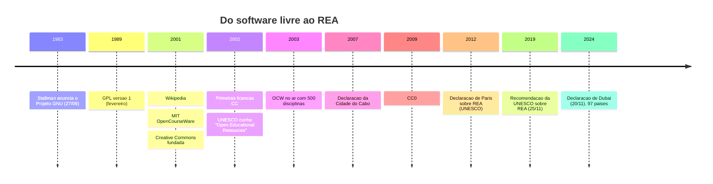
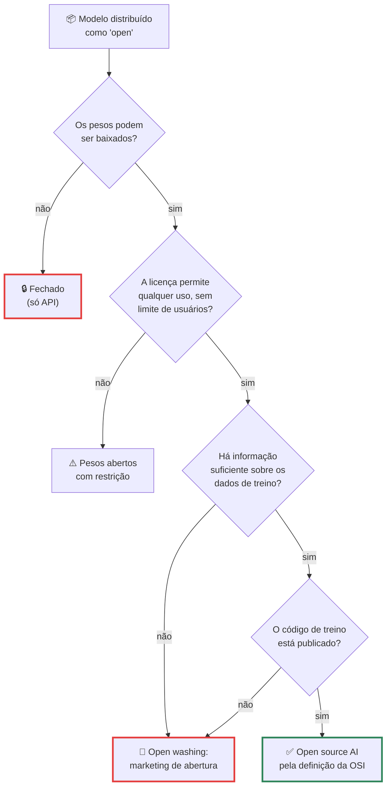
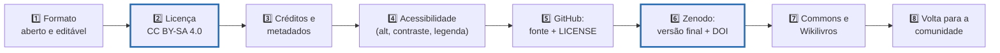
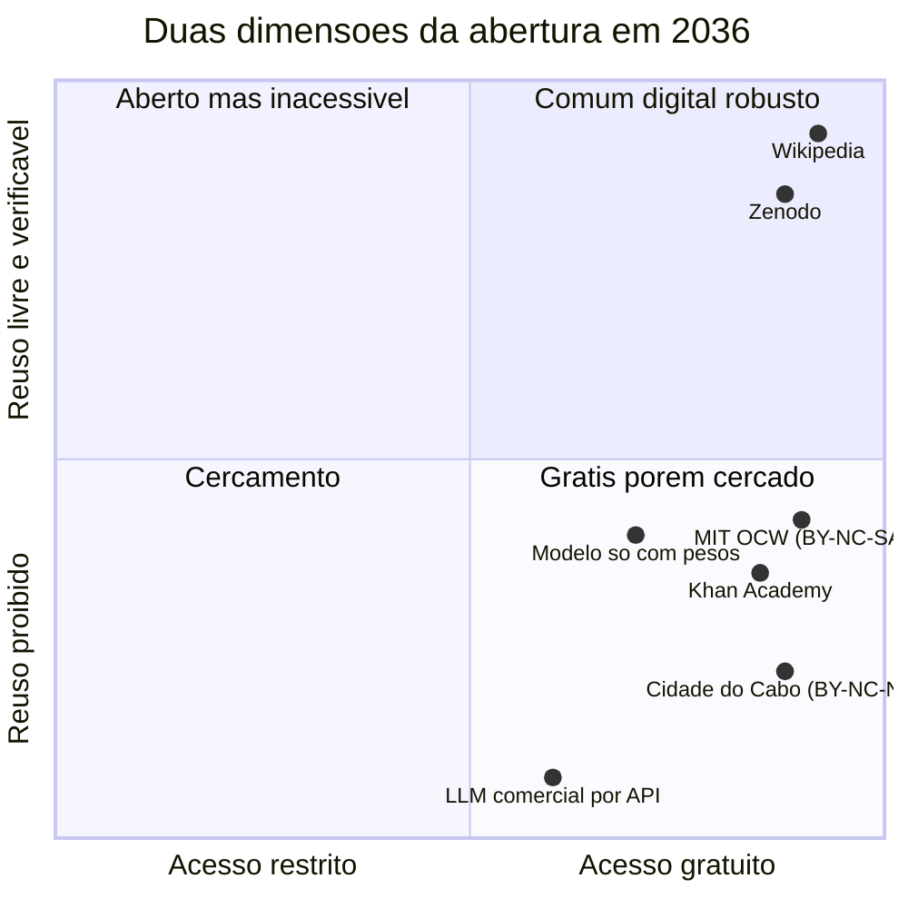

# Recursos Educacionais Abertos

> [!quote] Frase de abertura
> *O MIT abriu mais de 2.500 disciplinas para o mundo inteiro. A Declaração da Cidade do Cabo pregou a educação aberta para o planeta. Nenhuma das duas passa no próprio teste: as licenças que elas escolheram proíbem exatamente o que o movimento defende. "Aberto" não é sinônimo de "de graça", e a aula de hoje é sobre essa diferença.*

---

## 1. 📜 De onde isso vem: 1983, 2001, 2019, 2024

Antes de existir a sigla REA, existiu uma briga sobre código.

Em **27 de setembro de 1983**, um programador do laboratório de IA do MIT postou na Usenet uma mensagem intitulada "Free Unix!": ia escrever um sistema operacional inteiro compatível com Unix e dar de graça a quem quisesse. O nome do sistema era uma piada recursiva, **GNU** ("GNU's Not Unix"); o nome dele era **Richard Stallman**. Em **janeiro de 1984** ele pediu demissão do MIT, e explicou o motivo: se continuasse no quadro, o MIT poderia reivindicar a propriedade do trabalho e impor os próprios termos de distribuição.

![[Recursos/Computação, Sociedade e Inclusão/Recursos Educacionais Abertos/richard-stallman.png|Richard Stallman no LibrePlanet 2019. Foto de Ruben Rodriguez, CC BY 4.0, Wikimedia Commons]]

Em **fevereiro de 1989** saiu a **GPL versão 1**, que inventou o truque jurídico do **copyleft**: usar o direito autoral para obrigar que toda versão derivada continue livre. E a Free Software Foundation formulou as **quatro liberdades essenciais** do software livre (texto oficial do gnu.org): **executar** o programa como quiser, para qualquer fim (liberdade 0); **estudar** como funciona e modificar, tendo acesso ao código (1); **redistribuir** cópias para ajudar outras pessoas (2); e **distribuir as suas versões modificadas** (3).

Guarde essa lista: ela reaparece nos **5R dos REA** e na definição de **IA open source** da OSI. É a mesma ideia aplicada a código, a conteúdo e a modelo.

**2001** foi a virada do conteúdo: nasceram quase juntos a **Wikipédia**, o **MIT OpenCourseWare** e a **Creative Commons** (fundada por Lawrence Lessig, Hal Abelson e Eric Eldred). Em **2002** saíram as primeiras licenças CC e a **UNESCO cunhou o termo "Open Educational Resources"**, num fórum em Paris sobre o impacto do open courseware em países em desenvolvimento.

Hoje o MIT OpenCourseWare declara **mais de 2.500 disciplinas** e **mais de 500 milhões** de aprendizes alcançados. A **Declaração da Cidade do Cabo**, de 2007, somava **3.317 assinaturas individuais e 390 institucionais** quando consultada em 03/09/2026. A **Recomendação da UNESCO sobre REA**, de **25/11/2019**, é o único documento normativo internacional sobre o tema. E o **3º Congresso Mundial de REA** aconteceu em **Dubai, 19 e 20 de novembro de 2024**, com o tema "bens públicos digitais, soluções abertas e IA para acesso inclusivo ao conhecimento", adotando a **Declaração de Dubai** com **97 países** representados.

![[Recursos/Computação, Sociedade e Inclusão/Recursos Educacionais Abertos/logo-rea-unesco.png|O logo global de Recursos Educacionais Abertos, desenhado pelo brasileiro Jonathas Mello para a UNESCO. CC BY 3.0, Wikimedia Commons]]

> [!abstract] 🧠 Lente filosófica: Sérgio Amadeu da Silveira (*Software livre: a luta pela liberdade do conhecimento*, 2004)
> Sérgio Amadeu é cientista político, professor da UFABC, e foi um dos articuladores do software livre no governo brasileiro nos anos 2000. O argumento dele não é técnico, é econômico: informação tem custo de reprodução perto de zero, então fechar ou abrir é decidir quem fica com o valor. A frase que resume o livro: **"Redistribuir o conhecimento neste momento histórico de uma sociedade em rede é redistribuir poder e riqueza."** E, sobre padrões: **"Podem reforçar monopólios ou permitir a desconcentração de poder sobre a sociedade e o mercado. O software livre reforça a idéia e a constituição de padrões públicos."**
>
> Ao escolher entre formato aberto e proprietário você não escolhe entre `.md` e `.docx`: decide quem vai precisar pedir licença a quem para continuar o seu trabalho. Pergunta aberta: se redistribuir conhecimento é redistribuir poder, quem tem interesse concreto em que o material da sua oficina fique fechado?

---

## 2. 📖 O que é REA (e por que "gratuito" não basta)

A definição oficial está na Recomendação da UNESCO de 2019, e vale no original porque cada palavra foi negociada entre países:

> "Open Educational Resources (OER) are learning, teaching and research materials in any format and medium that reside in the public domain or are under copyright that have been released under an **open license**, that permit **no-cost access, re-use, re-purpose, adaptation and redistribution** by others."

Materiais de ensino, aprendizagem e pesquisa, em qualquer formato, em **domínio público** ou sob **licença aberta**. Repare no que a definição **não** diz: não diz "de graça na internet". Um PDF gratuito com "todos os direitos reservados" é gratuito e **não** é REA.

### 2.1 Os 5R de David Wiley

O teste prático mais usado no mundo é o de **David Wiley** (opencontent.org, versão de 26/09/2023). Cinco verbos:

| R (em português) | Definição original de Wiley |
|---|---|
| **Retain** (reter) | "make, own, and control a copy of the resource" |
| **Revise** (revisar) | "edit, adapt, and modify your copy of the resource" |
| **Remix** (remixar) | "combine your original or revised copy with other existing material" |
| **Reuse** (reutilizar) | "use your original, revised, or remixed copy publicly" |
| **Redistribute** (redistribuir) | "share copies [...] with others" |

Wiley acrescenta um teste técnico, o **ALMS**: **A**ccess to editing tools (a ferramenta de edição é acessível ou cara?), **L**evel of expertise (quanta perícia o formato exige?), **M**eaningfully editable (é editável de verdade ou está achatado num PDF?) e **S**elf-sourced (o formato distribuído é o mesmo que se edita?). É por isso que um PDF exportado do Canva perde no ALMS mesmo com licença CC BY, e um `.md` num repositório ganha. **Licença aberta sem formato aberto é abertura de fachada.**

### 2.2 As licenças Creative Commons, e quais são abertas de fato

![[Recursos/Computação, Sociedade e Inclusão/Recursos Educacionais Abertos/creative-commons-espectro.png|O espectro das licenças Creative Commons em português, do domínio público (topo) a "todos os direitos reservados" (base). Imagem de Shaddim, CC BY 4.0, Wikimedia Commons]]

São seis licenças CC mais o CC0. Quem decide se a obra é **livre** não é a Creative Commons: é o teste da **Definition of Free Cultural Works** (versão 1.1, de 17/02/2015), que exige quatro liberdades muito parecidas com as do software livre.

| Licença | Permite adaptar? | Permite uso comercial? | Aprovada como Obra Cultural Livre? |
|---|---|---|---|
| **CC0** | sim | sim | ✅ sim |
| **CC BY** | sim | sim | ✅ sim |
| **CC BY-SA** | sim, com copyleft | sim | ✅ sim |
| **CC BY-NC** | sim | ❌ não | ❌ não |
| **CC BY-ND** | ❌ não | sim | ❌ não |
| **CC BY-NC-SA** | sim | ❌ não | ❌ não |
| **CC BY-NC-ND** | ❌ não | ❌ não | ❌ não |

**Por que o NC ("não comercial") atrapalha na prática:** (1) "não comercial" nunca foi definido com precisão, então uma ONG que cobra inscrição simbólica, uma escola privada ou um professor que imprime numa gráfica viram zona cinzenta, e **na dúvida o material não é usado**; (2) material NC **não pode ser remixado** com CC BY-SA nem entrar na Wikipédia; (3) o NC bloqueia o reuso de escala. **E o ND ("sem derivadas") mata o REA:** sem direito de derivar morrem *Revise* e *Remix*, dois dos cinco R.

> [!warning] 🎯 O gancho: o REA se trai
> O **MIT OpenCourseWare**, projeto fundador do movimento, publica em **CC BY-NC-SA 4.0**: tem NC, logo **não** é obra cultural livre. A **Declaração da Cidade do Cabo**, que prega educação aberta para o mundo, publica o próprio site em **CC BY-NC-ND 4.0**: o texto que defende os 5R proíbe dois deles.
>
> Não é hipocrisia barata: é a diferença real entre **acesso gratuito** (o que essas instituições quiseram garantir) e **liberdade de reuso** (o que o movimento diz defender). As duas coisas são confundidas há 20 anos, e continuam sendo confundidas em todo edital que promete "material aberto".

> [!example] 🧪 Atividade 1: Licencie um trabalho seu de verdade
> **Ferramenta:** o [licenciador oficial da Creative Commons](https://creativecommons.org/chooser/) e a sua conta no [GitHub](https://github.com/).
>
> 1. Escolha um trabalho **seu** que já exista: projeto de outra disciplina, script, relatório, rascunho da cartilha da oficina.
> 2. Responda às quatro perguntas do licenciador: exigir atribuição, permitir uso comercial, permitir adaptações, exigir a mesma licença nas adaptações.
> 3. Copie o **texto de atribuição** e o **HTML** gerados (o site avisa que não guarda nada do que você digita).
> 4. Publique num repositório público no GitHub, cole a licença no `README.md` e crie um arquivo `LICENSE` com o texto legal completo.
> 5. Compare com a recomendação do [choosealicense.com](https://choosealicense.com/), mantido pelo GitHub, que trata de licenças de **software** (MIT, GPL, Apache), e anote a diferença entre licenciar código e licenciar conteúdo.
>
> **Resultado esperado:** o **link do repositório** com a licença detectada pelo GitHub na barra lateral, mais uma frase explicando por que você escolheu (ou recusou) NC e SA.
>
> 📱 **Só com celular:** o licenciador roda no navegador e o GitHub permite criar arquivo pelo próprio site ("Add file").

---

## 3. 🏛️ Políticas públicas: o que a lei mandou e o que aconteceu

A Recomendação da UNESCO organiza a ação estatal em **cinco áreas**: capacitar quem cria e usa REA, construir política de apoio, estimular REA inclusivos e de qualidade, **criar modelos de sustentabilidade** e cooperar internacionalmente. Guarde a quarta: é a que o Brasil mais falha.

| Instrumento (data) | O que diz | Situação |
|---|---|---|
| **Portaria MEC nº 451** (16/05/2018) | recurso da educação básica feito **com dinheiro do MEC** deve usar licença e formato abertos quando viável, em plataforma pública | em vigor |
| **Decreto municipal de SP nº 52.681** (26/09/2011) | licenciamento aberto obrigatório na rede municipal | em vigor |
| **PL 989/2011** (SP) | política estadual de REA | **vetado** (vício de iniciativa) |
| **PL 1513/2011** (federal) | licença aberta para material comprado pelo poder público | **não aprovado** |
| **PL 185/2014** (PR) e **PL 1832/2014** (DF) | políticas estadual e distrital de REA | não implantada / **arquivado** |
| **PNE 2014-2024** (Lei 13.005/2014) | REA nas estratégias **5.3** e **7.2** | vigência encerrada |
| **Novo PNE** (PL 2.614/2024) | **aprovado pelo Senado em 25/03/2026**: 17 diretrizes, 19 objetivos, **73 metas e 372 estratégias**; investimento público em educação sobe de **5,5% do PIB** para **7,5% em sete anos** e **10%** ao fim da década | seguiu para sanção |

O padrão é fácil de ler: **a norma federal mais forte é uma portaria de 2018**, e quase toda tentativa de virar lei morreu no caminho. Onde existe, a política cria a obrigação de abrir, mas não financia a manutenção do que foi aberto.

> [!info] 🇧🇷 Um caso vivo de "abertura sem sustentabilidade"
> O **Portal Domínio Público**, de 2004, respondeu **HTTP 403** a todos os acessos automatizados testados em 03/09/2026. A **Plataforma MEC RED** (`mecred.mec.gov.br`), repositório oficial de recursos educacionais do MEC, devolveu uma página que carrega só a palavra "Loading..." e nunca renderiza conteúdo para quem não executa JavaScript, o que inclui robôs de busca, conexões lentas e parte dos leitores de tela. Isso não é detalhe técnico: é a quarta área da Recomendação falhando na prática. A política mandou abrir, alguém abriu, e depois ninguém foi pago para manter.

> [!example] 🧪 Atividade 2: Audite o repositório oficial do MEC
> **Ferramenta:** [Plataforma MEC RED](https://mecred.mec.gov.br/) (o endereço antigo `plataformaintegrada.mec.gov.br` redireciona para lá).
>
> 1. Abra no navegador do computador e **cronometre** até aparecer conteúdo utilizável.
> 2. Busque por **"inteligência artificial"** e escolha **um** recurso.
> 3. Anote: **título, autor, licença declarada, formato e ano**.
> 4. Aplique os **5R** e o **ALMS**: dá para reter, revisar, remixar, reutilizar e redistribuir? O formato é editável de verdade? Depois abra o **DevTools (F12) → Network → throttling "Slow 3G"** e recarregue: a página ainda entrega alguma coisa?
> 5. **Se o site não carregar, isso é o resultado, não um fracasso seu:** registre data, hora, print e o código HTTP da aba Network. Depois refaça os passos 2 a 4 no [Wikilivros](https://pt.wikibooks.org/) e compare.
>
> **Resultado esperado:** ficha de uma página com os dois casos, print, licença, formato e nota dos 5R. E uma frase respondendo: uma política pública de REA que produz um site que não carrega cumpriu a política?

---

## 4. 🧩 Os projetos que sustentam o comum

### 4.1 O ecossistema Wikimedia

A Wikipédia é o maior REA do mundo e quase ninguém a chama assim. Todo o conteúdo é **CC BY-SA**: qualquer pessoa pode copiar, adaptar e até vender, desde que credite e mantenha a mesma licença.

![[Recursos/Computação, Sociedade e Inclusão/Recursos Educacionais Abertos/wikipedia-globo-pt.png|O globo de peças da Wikipédia em português. Wikimedia Foundation, CC BY-SA 3.0, Wikimedia Commons]]

| Acervo (03/09/2026) | Número |
|---|---|
| Wikipédia em português: artigos | **1.181.491** (72.736.677 edições acumuladas) |
| Wikipédia em português: **editores ativos** | **7.585** |
| Wikimedia Commons: arquivos | **147.076.314** (37.140 editores ativos) |
| Wikilivros em português | **651 livros**, 14.155 módulos |

Esses números são vivos e você pode conferir a qualquer hora na API pública ([Wikipédia](https://pt.wikipedia.org/w/api.php?action=query&meta=siteinfo&siprop=statistics&format=json), [Commons](https://commons.wikimedia.org/w/api.php?action=query&meta=siteinfo&siprop=statistics&format=json)): entre a manhã e a tarde de 03/09/2026 o Commons ganhou **16 mil arquivos**. Agora leia de novo a linha dos editores ativos: a enciclopédia em português inteira, consultada por milhões de brasileiros por dia, é mantida por cerca de **7.585 pessoas**. Uma turma de engenharia com 25 alunos que edite de verdade não é gota no oceano: é 0,3% do corpo editorial da língua.

![[Recursos/Computação, Sociedade e Inclusão/Recursos Educacionais Abertos/wikipedia-educacao-brasil.png|Palestra do Programa Wikipédia na Universidade, Faculdade Cásper Líbero, São Paulo, 2014. Foto de Horadrim, CC BY-SA 4.0, Wikimedia Commons]]

O **Programa de Educação da Wikimedia** existe no Brasil desde o começo dos anos 2010 e faz o que esta disciplina pede: transformar trabalho de aluno, que normalmente morre na pasta do professor, em verbete público revisado por estranhos.

> [!example] 🧪 Atividade 3: Edite a Wikipédia de verdade
> **Ferramenta:** [Wikipédia em português](https://pt.wikipedia.org/) e o [tutorial oficial](https://pt.wikipedia.org/wiki/Wikipédia:Tutorial), com 12 módulos (criar conta, página de testes, edição, formatação, ligações, referências).
>
> 1. Crie conta com um nome de usuário que você aceite ver publicamente para sempre e treine na **página de testes** indicada pelo tutorial. Não pule esta etapa.
> 2. Escolha um artigo **ruim de verdade** e ligado à disciplina: verbete de tecnologia sem fontes, cidade da região com dado desatualizado, conceito de computação sem referência.
> 3. Faça **uma** melhoria com **fonte verificável**: corrija um dado errado, acrescente referência a artigo científico ou dado oficial (IBGE, CETIC.br, gov.br), conserte uma frase confusa. Salve com um resumo de edição honesto.
>
> **Resultado esperado:** o **link do diff** (aba "Ver histórico", clique na sua edição). Se for revertida, melhor ainda: entregue o diff **e** o link da discussão com o que o outro editor alegou. Isso é revisão por pares acontecendo com você.
>
> ⚠️ **Ética:** não edite o verbete sobre você, parentes, a própria empresa ou o IFF sem declarar conflito de interesse na página de discussão. Nada de editar "só para testar": cada edição é pública e permanente.
>
> 📱 **Só com celular:** o editor visual, o histórico e o diff funcionam no navegador do celular.

> [!example] 🧪 Atividade 4: Coloque Bom Jesus do Itabapoana no acervo do mundo
> **Ferramenta:** [assistente de upload do Wikimedia Commons](https://commons.wikimedia.org/wiki/Special:UploadWizard).
>
> 1. Fotografe **você mesmo** algo que falte no Commons: uma fachada histórica do centro de Bom Jesus, uma praça, a ponte sobre o Itabapoana, um prédio do campus, uma planta, um objeto. Regra dura: **sem pessoas identificáveis** e nada que seja obra protegida de terceiro (quadro, escultura recente, cartaz).
> 2. Suba pelo assistente, marque "trabalho próprio", escolha **CC BY-SA 4.0**, preencha descrição, data, local e categoria.
> 3. Depois de publicado, **use** a foto em algum lugar: um artigo da Wikipédia, o REA da sua oficina, um post.
>
> **Resultado esperado:** a **URL permanente do arquivo** no Commons e o print da página mostrando a licença escolhida. Diferença para a Atividade 1: aqui você licenciou algo que passa a existir para 147 milhões de vizinhos de acervo.

### 4.2 Fora do mundo Wikimedia

| Projeto | O que é | Pegadinha a conferir |
|---|---|---|
| **[OER Commons](https://oercommons.org/)** | catálogo internacional, com filtro por disciplina, nível e licença | bloqueia robôs (403 em 03/09/2026); no navegador funciona |
| **[Wikilivros](https://pt.wikibooks.org/)** | livros didáticos colaborativos em CC BY-SA | qualidade muito desigual entre títulos |
| **[Khan Academy](https://www.khanacademy.org/)** | videoaulas gratuitas, com versão em português | **gratuito não é aberto**: confira a licença |
| **[MEC RED](https://mecred.mec.gov.br/)** | repositório oficial do MEC | ver a Atividade 2 |
| **[Domínio Público](http://www.dominiopublico.gov.br/)** | obras em domínio público, no ar desde 2004 | respondeu 403 em 03/09/2026 |
| **[SciELO](https://www.scielo.br/)** | maior biblioteca científica aberta da América Latina, em CC BY 4.0 | é ciência aberta, não material didático |

### 4.3 Ciência aberta: o mesmo movimento, outro andar

| Acervo (03/09/2026) | Número |
|---|---|
| **OpenAlex**: trabalhos indexados | **322.824.612** |
| OpenAlex: trabalhos **em acesso aberto** | **122.192.279**, ou **37,9%** do total |
| **arXiv**: submissões acumuladas | **3.155.398** |
| **Zenodo**: registros depositados | **7.246.699** |

Trinta e sete por cento. Depois de 25 anos de movimento de acesso aberto, **quase dois terços da ciência do mundo seguem atrás de paywall**. Esse é o tamanho real da disputa, e é bom saber disso antes de dizer que "hoje está tudo aberto na internet". O **Zenodo**, onde a sua oficina vai parar, foi lançado em **maio de 2013**, é operado pelo **CERN** com a **OpenAIRE**, aceita qualquer área, emite **DOI** e mantém os metadados em **CC0**.

### 4.4 Este site é um REA? E o assistente do campus?

Hora de virar o microscópio para dentro. O site que você está lendo é gerado pelo **Quartz**, projeto de código aberto que transforma notas em Markdown num site estático. O repositório que o publica, `wesleyfolly/aulas`, é **público no GitHub** e traz um `LICENSE.txt` com a **licença MIT**, herdada do Quartz. Só que MIT é licença de **software**: cobre o código do gerador, não o texto das aulas. Conferindo em 03/09/2026, **o conteúdo destas páginas não tem licença declarada**. Conclusão desconfortável e honesta: este site é **gratuito e público**, mas hoje **não é formalmente um REA**. Você acabou de aprender a diagnosticar esse defeito, e a Atividade 8 propõe consertá-lo.

Já o **IFFBot**, o assistente de perguntas e respostas do campus construído com recuperação aumentada por geração (RAG) sobre documentos institucionais, tem uma camada aberta verificável: o artigo que descreve o sistema está em **acesso aberto** na biblioteca da Sociedade Brasileira de Computação, com DOI próprio ([10.5753/wics.2025.7986](https://doi.org/10.5753/wics.2025.7986)). Abertura tem camadas: o artigo pode ser aberto sem que o código seja, o código sem que os dados sejam. Guarde a ideia de camadas, porque a próxima seção vive dela.

> [!abstract] 🧠 Lente filosófica: Paulo Freire (📗 *Extensão ou comunicação?*, 1968)
> Freire escreveu esse livro no exílio chileno, olhando para agrônomos que levavam técnica agrícola a camponeses. O alvo não era a técnica: era o **modelo de transferência**, que ele chama de **invasão cultural**: "Tôda invasão sugere [...] um sujeito que invade. Seu espaço histórico-cultural [...] é o espaço de onde êle parte para penetrar outro espaço histórico-cultural, superpondo aos indivíduos dêste seu sistema de valôres."
>
> Troque "extensionista" por "equipe de produto" e você tem a descrição de um deploy mal feito numa comunidade. Publicar uma cartilha em CC BY sobre IA para um grupo de idosos que você nunca ouviu é **abertura sem diálogo**: tecnicamente livre, pedagogicamente invasiva. Freire não era tecnófobo: em *Pedagogia da Esperança* (1992) ele defende "a assunção de uma posição crítica, vigilante, indagadora, em face da tecnologia. Nem, de um lado, demonologizá-la, nem, de outro, divinizá-la".
>
> Pergunta aberta para a sua oficina em [[Projeto de Extensão - IA para Todos]]: o seu REA vai ser escrito **para** a comunidade ou **com** ela? A licença é a mesma nos dois casos. O resultado, não.

---

## 5. 🤖 REA e IA: pesos abertos contam?

Se um modelo de linguagem serve para aprender e alguém publica os pesos de graça, isso é um recurso educacional aberto? Em 2026 a pergunta ficou concreta.

A **Open Source Initiative**, a mesma entidade que aprova licenças de software livre há décadas, publicou a **Open Source AI Definition (OSAID) versão 1.0**. Ela exige as quatro liberdades de sempre, agora aplicadas ao sistema de IA: **usar** para qualquer fim sem pedir permissão, **estudar** e inspecionar os componentes, **modificar** inclusive para mudar a saída, e **compartilhar** com ou sem modificações. Para que sejam exercíveis, exige **três componentes**:

| Componente | Texto da OSI |
|---|---|
| **Data information** | "Sufficiently detailed information about the data used to train the system so that a skilled person can build a substantially equivalent system" |
| **Code** | "The complete source code used to train and run the system" |
| **Parameters** | "The model parameters, such as weights or other configuration settings" |

Agora aplique ao mundo real. O [Hugging Face](https://huggingface.co/models), repositório de fato do ecossistema, listava **3.038.766 modelos** em 03/09/2026. Quase todos se dizem "open". Pouquíssimos entregam os três componentes.

Três casos para calibrar o julgamento:

- **DeepSeek**: publica os pesos sob **licença MIT** desde janeiro de 2025. Custo de treino declarado do V3: **US\$ 5,576 milhões**, número contestado por excluir infraestrutura e pesquisa anterior.
- **Maritaca AI** (brasileira, família Sabiá): treinada em português e em direito brasileiro, contexto de 128 mil tokens. **Pesos fechados, só por API**, sem download e sem número de parâmetros divulgado.
- **Tucano** (brasileiro, aberto): decoder-transformers pré-treinados nativamente em português, de **160 milhões a 2,4 bilhões de parâmetros**, com o dataset **GigaVerbo** publicado (Nicholas Kluge Corrêa, artigo de 12/11/2024).

A Maritaca é nacional, competente e **fechada**; o Tucano é nacional, **aberto** e pequeno. "Soberania tecnológica" significa ter empresa brasileira ou ter pesos abertos? Não é a mesma coisa, e as duas respostas têm gente séria defendendo.

> [!info] 🤖 E o conteúdo que a própria IA gerou?
> Nos Estados Unidos, obra sem autoria humana não recebe copyright, então licenciar o que a máquina produziu sozinha é juridicamente estranho: não se licencia o que não se possui. No Brasil, a **Lei 9.610/1998** protege a criação **do espírito humano**, e a discussão sobre obra gerada por máquina segue aberta.
>
> Consequência prática para a sua entrega: o REA da oficina precisa ter **contribuição humana substantiva declarada**. Use IA para rascunhar, revisar e diagramar à vontade, e registre no próprio material **o que foi feito com IA e o que foi decidido, verificado e escrito por você**. As regras de uso de IA da disciplina estão no [[Kit de ferramentas de Computação e Sociedade]].

> [!example] 🧪 Atividade 5: Três modelos, um teste de abertura
> **Ferramenta:** [Hugging Face Models](https://huggingface.co/models) e a [definição de IA open source da OSI](https://opensource.org/ai/open-source-ai-definition).
>
> 1. Escolha **3 modelos** da lista de tendências: um de laboratório dos EUA, um chinês e um em português (procure por `TucanoBR` ou por `portuguese`).
> 2. Para cada um, abra a aba **Files and versions** e o **model card** e preencha: nome, licença declarada, pesos disponíveis para download, dataset de treino identificado, código de treino publicado.
> 3. Classifique cada modelo em **uma** das caixas do fluxograma acima (*open source AI pela OSI*, *pesos abertos com restrição* ou *open washing*) e copie o trecho exato da licença que sustenta a classificação.
>
> **Resultado esperado:** tabela de 3 linhas com a citação da licença e a caixa escolhida em cada uma. Aposta do professor: **nenhum** dos três passa nos três requisitos da OSI. Se algum passar, traga, que a aula muda.
>
> 📱 **Só com celular:** o Hugging Face roda no navegador (para rodar um modelo aberto localmente, veja [[Ollama - gerenciamento de modelos de IA]]).

---

## 6. 🛠️ Como produzir um REA (o passo a passo da sua oficina)

Isto não é teoria: é o procedimento da entrega de REA do [[Projeto de Extensão - IA para Todos]], com rascunho para revisão até 27/11 e versão final até 18/12.

**1. Escolha o formato pensando no ALMS.** Publique o fonte da cartilha em **Markdown** ou ODT, não só o PDF final; slides em formato editável; vídeo com o `.srt` separado. Se usar Canva, exporte também em formato aberto e **confira a licença dos elementos gráficos**: nem tudo do Canva pode ser redistribuído em CC.

**2. Escolha a licença no licenciador, não no chute.** A disciplina pede **CC BY-SA 4.0** (ou CC BY). Nada de NC nem ND: o material precisa poder ser impresso pela associação de bairro, adaptado por outra escola e remixado por outra turma. Gere o selo em [creativecommons.org/chooser](https://creativecommons.org/chooser/) e cole na primeira ou na última página.

**3. Credite tudo, no formato TASL:** **T**ítulo, **A**utor, **S**ite (link) e **L**icença de cada imagem, gráfico ou texto de terceiro. Sem isso, um CC BY-SA vira violação de direito autoral com cara de abertura. Não achou a licença de uma imagem? Troque por uma do [Wikimedia Commons](https://commons.wikimedia.org/).

**4. Escreva metadados pensando em quem vai achar o material daqui a 5 anos:** título descritivo, autores com afiliação, data, versão, público-alvo, palavras-chave, resumo de 3 linhas, licença e idioma. É o que o Zenodo vai pedir.

**5. Acessibilidade não é enfeite:** é a diferença entre incluir e fingir que incluiu. No PDF: texto de verdade (nunca imagem de texto), corpo 12 ou maior, contraste alto, **texto alternativo em toda imagem**, hierarquia de títulos e ordem de leitura corretas. No vídeo: legenda. Ferramentas de teste (WAVE, axe, NVDA) no [[Kit de ferramentas de Computação e Sociedade]].

**6. Publique o fonte no GitHub:** repositório público da turma, `README.md`, `LICENSE` com o texto legal, arquivos editáveis versionados. O histórico de commits vira, de brinde, a evidência de quem fez o quê. **7. Deposite a versão final no Zenodo e ganhe um DOI:** a partir daí o material é **citável** e sobrevive à sua conta do GitHub. **8. Devolva as peças ao comum:** fotos da oficina (com consentimento, sem rostos) ao **Wikimedia Commons**, um capítulo da cartilha ao **Wikilivros**, o recurso completo no **MEC RED**. Um REA que só existe no drive da equipe não é REA, é arquivo.

Um detalhe que decide onde publicar: o [GitHub Pages](https://pages.github.com/) some se a conta for apagada; o [Zenodo](https://zenodo.org/), o [Commons](https://commons.wikimedia.org/) e o [Wikilivros](https://pt.wikibooks.org/), não.

> [!example] 🧪 Atividade 6: Deposite algo e ganhe um DOI
> **Ferramenta:** [Zenodo](https://zenodo.org/) (CERN e OpenAIRE) e o ambiente de testes oficial, o **[Zenodo Sandbox](https://sandbox.zenodo.org/)**.
>
> 1. Crie conta (dá para entrar com ORCID ou GitHub).
> 2. Faça um **depósito de teste no Sandbox**: suba um PDF de uma página com o resumo do projeto da equipe.
> 3. Preencha os metadados: tipo de publicação, título, autores, descrição, palavras-chave, **licença CC BY-SA 4.0**, idioma, versão.
> 4. Publique, copie o **DOI** gerado e veja como exportar a citação (BibTeX, ABNT).
>
> **Resultado esperado:** o **DOI do depósito de teste** e o print da tela de metadados. Em dezembro você repete isso no Zenodo de produção, com o REA final da oficina.
>
> ⚠️ **Cuidado:** depósito no Zenodo de produção é **permanente**. Por isso o teste vai no Sandbox.

> [!example] 🧪 Atividade 7: Um quiz interativo em H5P para a oficina
> **Ferramenta:** [Lumi](https://lumi.education/), editor H5P de código aberto com versão desktop (Windows, Mac, Linux) e versão em nuvem, ou o [H5P.org](https://h5p.org/).
>
> 1. Instale o Lumi Desktop ou abra o Lumi Cloud.
> 2. Crie um **Question Set** ou **Multiple Choice** com **3 perguntas** sobre um tema da oficina (o que é alucinação de um chatbot, o que nunca digitar num assistente, como conferir uma informação).
> 3. Escreva o feedback de cada alternativa: quem erra precisa aprender algo com o erro.
> 4. Exporte em **.h5p** (formato editável, que respeita o *Revise* dos 5R) **e** em **HTML** (abre em qualquer navegador, mesmo sem internet).
> 5. Coloque os dois arquivos no repositório do grupo, com a licença.
>
> **Resultado esperado:** os dois arquivos no repositório e o link. Teste o HTML **offline**, com o wi-fi desligado: se não funcionar sem internet, não serve para oficina em telecentro ou escola com rede ruim.

> [!example] 🧪 Atividade 8: Encontre um REA para reusar e prove os 5R
> **Ferramenta:** [Wikilivros](https://pt.wikibooks.org/) e [OER Commons](https://oercommons.org/) (este exige navegador, bloqueia robôs).
>
> 1. Procure **um recurso pronto** que sirva de base para a oficina: um capítulo sobre internet, material de letramento digital, um guia de uso de IA.
> 2. Registre a **licença exata** e responda, com sim ou não, a cada um dos **5R**.
> 3. Faça a **adaptação mínima viável**: corte, traduza um trecho, troque um exemplo por um de Bom Jesus, corrija um erro.
> 4. Publique a adaptação com **atribuição correta (TASL)** e licença compatível, no repositório da equipe.
> 5. **Bônus que vale para este site:** localize no repositório [wesleyfolly/aulas](https://github.com/wesleyfolly/aulas) o arquivo `LICENSE.txt`, confirme que ele licencia o **código**, e escreva em 5 linhas a proposta de licença para o **conteúdo** das aulas, com o argumento de por que essa e não outra.
>
> **Resultado esperado:** link da adaptação publicada, tabela dos 5R preenchida e a proposta de licença para o conteúdo deste site.

> [!abstract] 🧠 Lente filosófica: bell hooks (📗 *Ensinando a transgredir: a educação como prática da liberdade*, 1994)
> bell hooks (o nome é grafado em minúsculas por escolha dela) era professora e teórica estadunidense, leitora declarada de Paulo Freire. **(Paráfrase, não citação literal:)** o argumento central do livro é que a sala de aula deixa de ser transmissão quando quem ensina também se expõe e quem aprende também produz; a educação vira prática da liberdade quando o conhecimento é construído junto, e não entregue pronto por quem detém a autoridade.
>
> Aplicado a REA, isso cobra algo que a licença sozinha não cobra: publicar em CC BY-SA garante que qualquer pessoa **pode** modificar, não que alguém **vá**. A diferença entre um REA vivo (a Wikipédia, um Wikilivro) e um REA morto (um PDF aberto que ninguém tocou em 8 anos) não está na licença, está em ter comunidade, porta de entrada fácil e tratar quem chega como coautor. Pergunta aberta: no seu REA, qual é a instrução, em português simples, que diz a um participante da oficina **como** propor uma mudança? Se ela não existe, o material é aberto no papel e fechado na prática.

---

## 7. 🇧🇷 No Brasil: números, comunidade e o que dá para fazer daqui

- **A língua está subrepresentada e depende de pouca gente.** Bom Jesus do Itabapoana, Itaperuna e o Noroeste Fluminense aparecem de forma rala nos acervos livres: verbetes curtos, poucas fotos no Commons, quase nada em áudio. São **7.585 editores ativos** para toda a Wikipédia em português.
- **A norma existe, o financiamento não.** A Portaria MEC 451/2018 obriga licença aberta para material pago com dinheiro do MEC na educação básica, mas as duas plataformas federais de referência estavam, em 03/09/2026, com problemas de acesso. **Lacuna honesta:** também não localizamos confirmação de que o novo PNE mencione REA, software livre ou IA. Isso é atividade, não opinião: procure o autógrafo do PL 2.614/2024 no [portal de matérias do Senado](https://www25.senado.leg.br/web/atividade/materias) e use Ctrl+F.
- **Existe comunidade organizada.** A **Iniciativa Educação Aberta** ([aberta.org.br](https://aberta.org.br/)), com Wikimedia Brasil e UNESCO, é o ponto de encontro do REA brasileiro, com projetos como *Educação Vigiada*, *Wikiversidade* e o *Jogo da Política de Educação Aberta*.
- **O toque local.** Tudo que a sua equipe produzir em CC BY-SA fica disponível para a próxima turma, para a escola do lado e para qualquer cidade com o mesmo problema. É a diferença entre um trabalho que morre em dezembro e um que continua.

---

## 8. 🤖 E a IA? · 🔮 E em 2036?

A IA mexeu no REA em três frentes, e nenhuma é confortável.

**Produzir ficou barato, verificar ficou caro.** Gerar uma cartilha de 20 páginas ilustrada leva uma tarde, mas o gargalo do REA nunca foi produção: era revisão, contexto e manutenção. Se o volume multiplica e a revisão não acompanha, o comum digital não fica mais rico, fica mais poluído.

**O comum virou insumo de treino.** Wikipédia, arXiv, Zenodo, Commons e repositórios de código foram matéria-prima dos modelos de 2022 a 2026. Quem defende diz que é para isso mesmo que a licença aberta existe: reuso irrestrito, inclusive comercial. Quem critica diz que CC BY exige atribuição, e nenhum chatbot atribui nada.

**E a palavra "aberto" foi capturada.** Modelo que libera só os pesos se chama "open"; plataforma com acesso gratuito se chama "open". O termo virou marketing, como já tinha acontecido com "REA" quando virou sinônimo de PDF de graça.

**Cenário A, cercamento.** O conhecimento útil migra para dentro de assistentes proprietários. O aluno não procura material: pergunta ao chatbot. O REA continua existindo, sem tráfego, como o Portal Domínio Público existe hoje.

**Cenário B, comum robusto.** A escassez de dados confiáveis torna acervos curados por humanos mais valiosos, não menos: Wikipédia, repositórios institucionais e REA bem licenciados viram infraestrutura crítica e passam a ser financiados como tal. É a aposta implícita da Recomendação da UNESCO e da Declaração de Dubai, que tratam REA como **bem público digital**.

**Cenário C, o mais provável: os dois ao mesmo tempo.** Cercamento na camada de interface (todo mundo fala com um assistente), comum robusto na camada de dados (o assistente depende de acervos abertos). Nesse mundo, quem sabe licenciar, versionar, depositar e manter acervo controla a matéria-prima.

**O que você, engenheiro de computação formado entre 2027 e 2030, faz com isso:** (1) **licenciar é competência técnica**, porque escolher entre MIT, Apache 2.0, GPL e AGPL num produto, e entre CC BY, CC BY-SA e CC0 na documentação, é decisão de arquitetura com efeito jurídico e comercial, e errar custa contrato; (2) **auditar a abertura alheia**, que é o que um time de compliance faz antes de adotar um modelo (a tabela da Atividade 5); (3) **contribuir com o comum é currículo verificável**, com URL permanente e data em cada diff, pull request e DOI; (4) **manter é mais raro que criar**, e a quarta área da Recomendação, sustentabilidade, é onde quase todo mundo falha.

---

## 🗣️ Para debater em sala

**1. Licença NC protege ou sabota quem produz?**
- **Protege:** o MIT OpenCourseWare escolheu **CC BY-NC-SA** para impedir que empresas revendam material feito com dinheiro filantrópico e institucional. Sem NC, o incentivo de muita instituição a abrir desaparece ([MIT OCW](https://ocw.mit.edu/about/)).
- **Sabota:** a **Definition of Free Cultural Works** exclui NC das licenças livres e a Wikipédia recusa conteúdo NC. Na prática o NC bloqueia a gráfica que imprimiria barato, a ONG que cobra inscrição simbólica e o remix com CC BY-SA ([freedomdefined.org](https://freedomdefined.org/Definition)).

**2. Modelo que libera só os pesos merece ser chamado de "aberto"?**
- **Não merece:** a **OSI** exige informação sobre dados, código de treino e parâmetros. Sem os três não há como estudar nem reconstruir, e chamar isso de open source é **open washing** ([OSI](https://opensource.org/ai/open-source-ai-definition)).
- **Merece:** pesos baixáveis já permitem rodar local, auditar a saída, fazer fine-tuning e escapar da dependência de API, e exigir o dataset completo pode ser juridicamente impossível ([DeepSeek publica pesos em MIT](https://en.wikipedia.org/wiki/DeepSeek)).

**3. Material educacional pago com dinheiro público deve ser obrigatoriamente aberto?**
- **Deve:** é o princípio da **Portaria MEC 451/2018** e da Recomendação da UNESCO: o cidadão pagou uma vez, não deveria pagar de novo para usar.
- **Cuidado:** obrigar a abrir sem financiar a manutenção produz exatamente o **MEC RED de 2026**, um repositório oficial que não renderiza. Antes de criar mais obrigação seria preciso resolver a área 4 da Recomendação, que nenhuma lei brasileira enfrenta.

O formato do debate está no [[Kit de ferramentas de Computação e Sociedade]].

---

## ❓ Quiz rápido

> [!question]- 1. Um professor publica um PDF de graça no site da escola, com "todos os direitos reservados" no rodapé. É um REA?
> **Resposta: não.** Falta a licença aberta. Pela UNESCO (2019), REA exige domínio público **ou** licença aberta que permita acesso sem custo, reuso, adaptação e redistribuição. Gratuito é sobre preço; aberto é sobre permissão.

> [!question]- 2. Quais dos 5R uma licença CC BY-ND permite?
> **Resposta: três, não cinco.** ND proíbe obras derivadas, o que elimina **Revise** e **Remix**; sobram *Retain*, *Reuse* e *Redistribute*. Por isso ND não é aprovada como obra cultural livre, e um material ND é "gratuito", não REA no sentido de Wiley.

> [!question]- 3. Duas apostilas têm licença CC BY. Uma é PDF exportado do Canva, a outra é Markdown no GitHub. São igualmente abertas?
> **Resposta: não, e quem mostra isso é o ALMS.** A licença é idêntica, mas o PDF perde em *meaningfully editable* (texto achatado no layout) e em *self-sourced* (o fonte ficou na conta do Canva). Abertura tem camada jurídica **e** camada técnica.

> [!question]- 4. Pela OSI, o que falta a um modelo que publica pesos em MIT mas não diz com que dados foi treinado nem publica o código de treino?
> **Resposta: dois dos três componentes.** Tem *Parameters*, não tem *Data information* nem *Code*. Sem isso ninguém estuda nem reconstrói um sistema equivalente: não é open source AI pela OSAID, por mais permissiva que seja a licença dos pesos.

> [!question]- 5. Por que o Zenodo aparece no passo a passo, se o material já vai estar no GitHub?
> **Resposta: permanência e citabilidade.** O Zenodo emite **DOI** e mantém o registro mesmo que a conta do autor no GitHub desapareça. Um repositório pode ser apagado por quem o criou; um DOI não some. É a diferença entre publicar e **arquivar**.

---

## 🔗 Veja também

- [[Projeto de Extensão - IA para Todos]]: o REA que você vai produzir, com prazos, rubrica e regras de consentimento.
- [[Kit de ferramentas de Computação e Sociedade]]: a tabela completa das ferramentas e as regras de uso de IA da disciplina.
- [[Registro de propriedade intelectual]]: o outro lado da moeda, quando o objetivo é **fechar** (patente, marca, registro de software).
- [[Sobre esse site]]: como este site funciona por dentro, e por que é o exemplo imperfeito da seção 4.4.
- [[Poder, plataformas e vigilância - o público, o privado e o sujeito]]: quem controla a infraestrutura sobre a qual o comum digital roda.
- [[Materiais, leituras, filmes e podcasts de Computação e Sociedade]]: as leituras completas da disciplina.
- ⬅️ **Aula anterior:** [[Vieses, discriminação algorítmica e inclusão]]
- ➡️ **Próxima aula:** [[Cidadania e educação na sociedade digital]]

---

> [!note] 📚 Fontes (2026)
> - UNESCO: [Recomendação sobre REA, 25/11/2019](https://www.unesco.org/en/legal-affairs/recommendation-open-educational-resources-oer) · [REA e Congresso de Dubai 2024](https://www.unesco.org/en/open-educational-resources)
> - Definições: [WILEY, 5R e ALMS, 26/09/2023](https://opencontent.org/definition/) · [Free Cultural Works v1.1, 17/02/2015](https://freedomdefined.org/Definition) · [OSI, Open Source AI Definition v1.0](https://opensource.org/ai/open-source-ai-definition)
> - Creative Commons: [licenças e CC0](https://creativecommons.org/share-your-work/cclicenses/) · [linha do tempo](https://creativecommons.org/about/history/) · [Cidade do Cabo, assinaturas lidas em 03/09/2026](https://www.capetowndeclaration.org/read/) · [MIT OpenCourseWare](https://ocw.mit.edu/about/)
> - Software livre: [anúncio do Projeto GNU, 27/09/1983](https://www.gnu.org/gnu/initial-announcement.html) · [saída do MIT, jan/1984](https://www.gnu.org/gnu/thegnuproject.html) · [quatro liberdades](https://www.gnu.org/philosophy/free-sw.html) · [GPL v1, fev/1989](https://www.gnu.org/licenses/old-licenses/gpl-1.0.html)
> - Brasil: [Senado, novo PNE, 25/03/2026](https://www12.senado.leg.br/noticias/materias/2026/03/25/aprovado-pelo-senado-novo-plano-nacional-da-educacao-segue-para-a-sancao) · [Educação Aberta](https://aberta.org.br/) · [MEC RED](https://mecred.mec.gov.br/) · [Domínio Público](http://www.dominiopublico.gov.br/) · [Lei 9.610/1998](https://www.planalto.gov.br/ccivil_03/leis/l9610.htm) · [SciELO](https://www.scielo.br/)
> - Números vivos de 03/09/2026: [API de estatísticas da Wikipédia pt](https://pt.wikipedia.org/w/api.php?action=query&meta=siteinfo&siprop=statistics&format=json) e [do Commons](https://commons.wikimedia.org/w/api.php?action=query&meta=siteinfo&siprop=statistics&format=json) · [Wikilivros](https://pt.wikibooks.org/) · [OpenAlex](https://api.openalex.org/works) · [arXiv](https://arxiv.org/stats/monthly_submissions) · [Hugging Face](https://huggingface.co/models)
> - Modelos: [DeepSeek](https://en.wikipedia.org/wiki/DeepSeek) · [Maritaca AI](https://www.maritaca.ai/) · [Tucano](https://huggingface.co/TucanoBR) · [SOUZA, W. F. V. de et al. Assistente Virtual Inteligente para Instituições Educacionais: Aplicação da Técnica RAG no IFBot. WICS 2025, p. 217-224](https://doi.org/10.5753/wics.2025.7986)
> - Imagens, todas do Wikimedia Commons: [Stallman, LibrePlanet 2019, Ruben Rodriguez, CC BY 4.0](https://commons.wikimedia.org/wiki/File:Richard_Stallman_at_LibrePlanet_2019.jpg) · [logo REA, Jonathas Mello, CC BY 3.0](https://commons.wikimedia.org/wiki/File:Global_Open_Educational_Resources_Logo.svg) · [espectro CC pt, Shaddim, CC BY 4.0](https://commons.wikimedia.org/wiki/File:Creative_Commons_license_spectrum_pt.svg) · [globo da Wikipédia pt, WMF, CC BY-SA 3.0](https://commons.wikimedia.org/wiki/File:Wikipedia-logo-v2-pt.svg) · [Cásper Líbero, Horadrim, CC BY-SA 4.0](https://commons.wikimedia.org/wiki/File:Wikipedia_Education_Program_-_Casper_Libero_01.jpg)

> [!note] 📖 Leituras
> - FREIRE, Paulo. *Extensão ou comunicação?* Rio de Janeiro: Paz e Terra (original de 1968). 📗 🔓 [PDF integral](https://fasam.edu.br/wp-content/uploads/2020/07/Extensao-ou-Comunicacao-1.pdf). Por que levar tecnologia pronta a uma comunidade pode ser invasão, e não extensão.
> - HOOKS, bell. *Ensinando a transgredir: a educação como prática da liberdade*. São Paulo: WMF Martins Fontes, 2017 (original de 1994). 📗 Por que abrir o material não basta se quem aprende segue tratado como consumidor.
> - SILVEIRA, Sérgio Amadeu da. *Software livre: a luta pela liberdade do conhecimento*. São Paulo: Fundação Perseu Abramo, 2004. 🔓 [PDF integral](https://fpabramo.org.br/wp-content/uploads/2013/04/software_livre.pdf). Padrão aberto, monopólio e distribuição de poder. Do mesmo autor, sobre algoritmos de plataforma: *Democracia e os códigos invisíveis* (Edições Sesc, 2019).
> - CAZELOTO, Edilson. *Inclusão digital: uma visão crítica*. São Paulo: Senac, 2019. 📗 Por que "dar acesso" não resolve, tema da próxima aula.
> - UNESCO. *Quadro de competências em IA* para [estudantes](https://unesdoc.unesco.org/ark:/48223/pf0000394281_por) e [professores](https://unesdoc.unesco.org/ark:/48223/pf0000394280_por). Paris, 2024. 🔓 Base curricular em português, pronta para reusar na oficina.
