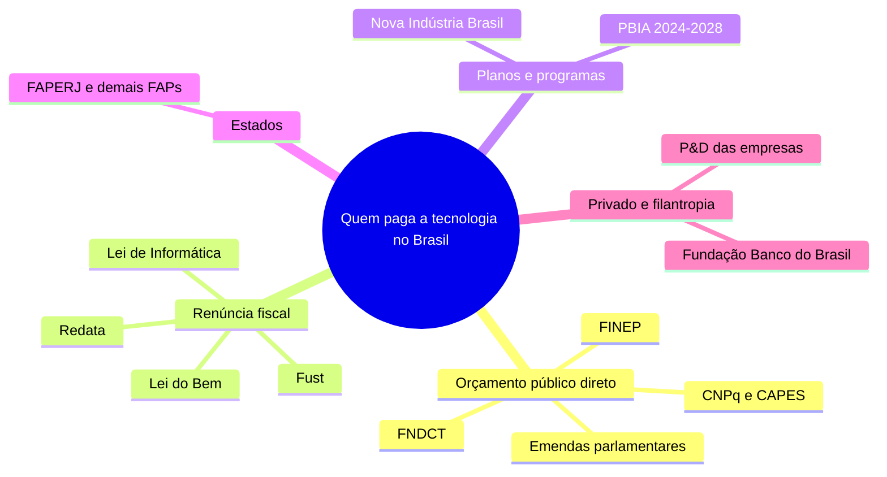
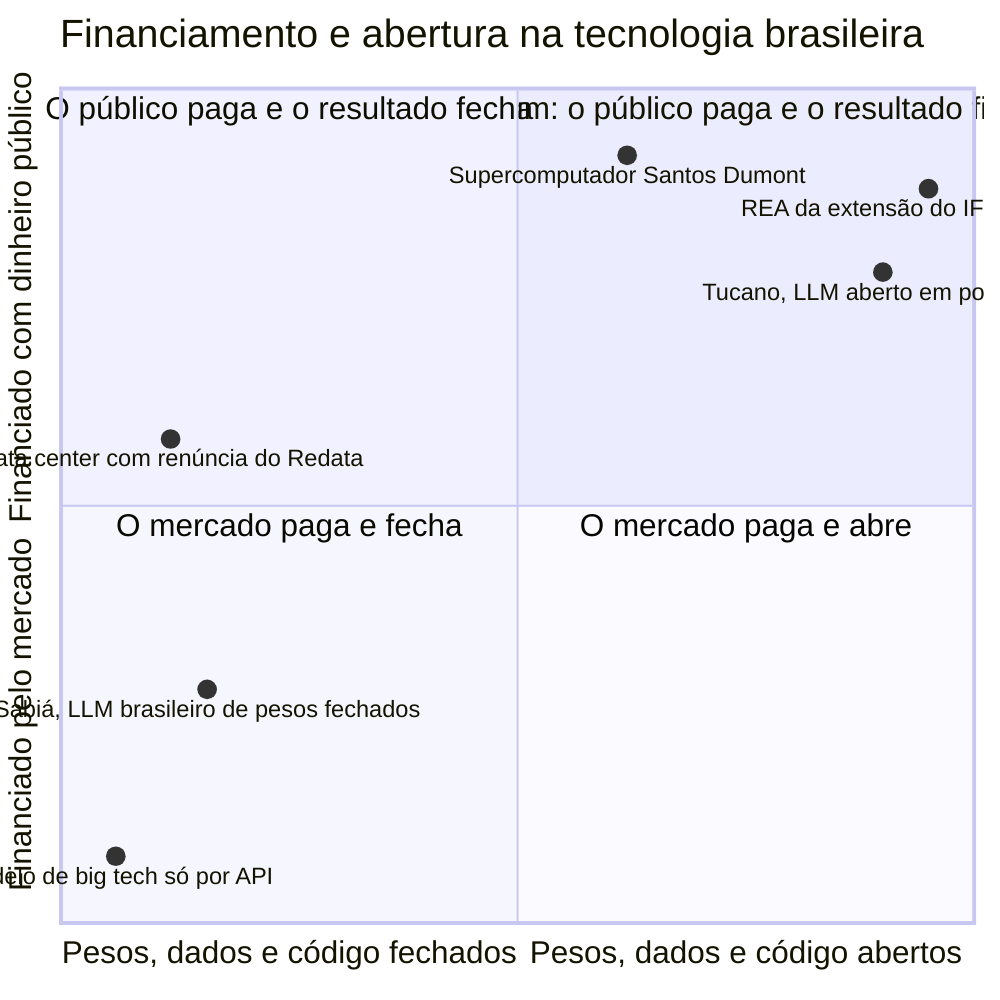
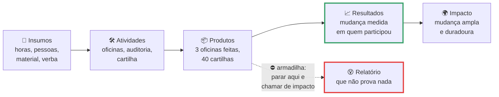
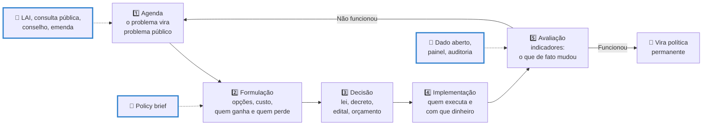

# Relevância social, investimento e políticas públicas de tecnologia

> [!quote] Frase de abertura
> *O Plano Brasileiro de Inteligência Artificial prevê R\$ 23 bilhões em quatro anos. Só a Google reportou mais de US\$ 150 bilhões de investimento em infraestrutura em 2025, num ano só. Antes de discutir se o Brasil "vai ficar para trás", vale uma pergunta mais chata: quem está pagando a conta, e o que a sociedade recebe de volta?*

---

## 1. 💸 Quem paga a tecnologia que você vai construir

Comece por um prédio. Em Petrópolis (RJ) fica o Laboratório Nacional de Computação Científica (LNCC), que opera o supercomputador **Santos Dumont**, cuja expansão foi inaugurada em 25/11/2019 pelo Ministério da Ciência, Tecnologia e Inovações. Ninguém "compra" esse prédio no mercado: ele existe porque houve decisão política, orçamento e uma lei que impede o dinheiro de sumir no caminho.

![[Recursos/Computação, Sociedade e Inclusão/Relevância social, investimento e políticas públicas de tecnologia/lncc-petropolis.png|O LNCC, em Petrópolis (RJ), onde opera o supercomputador Santos Dumont (Wikimedia Commons, domínio público)]]

Você vai passar a carreira usando, pedindo ou disputando dinheiro público de tecnologia, mesmo trabalhando só na iniciativa privada: pelo edital que financia sua startup, pelo incentivo fiscal que abate o P&D da empresa, pela bolsa do mestrado do colega, pelo campus onde você está sentado. Este é o mapa.

### 1.1 A tabela do dinheiro (com data e fonte)

Regra desta aula: **valor sem ano e sem fonte não vale nada**.

| Instrumento | Número verificado | Data | Fonte |
|---|---|---|---|
| **FNDCT**, o principal fundo de C&T do país | a **LC 177/2021** proibiu o contingenciamento das fontes vinculadas; a **MP 1136/2022** escalonou o limite de aplicação como percentual da receita prevista: **58% em 2023, 68% em 2024, 78% em 2025, 88% em 2026 e 100% em 2027**. Num edital concreto de 21/08/2026, o fundo bancou **até R\$ 15 milhões** numa chamada Brasil e Noruega | 2021 a 2026 | [Câmara](https://www.camara.leg.br/noticias/905819-MEDIDA-PROVISORIA-IMPOE-LIMITES-PARA-APLICACAO-DE-RECURSOS-DO-FNDCT) e [MCTI](https://www.gov.br/mcti/pt-br/acompanhe-o-mcti/noticias/noticias-julho-outubro-2026/cooperacao-brasil-noruega-seleciona-projetos-em-energia-petroleo-offshore-e-transporte-maritimo-verde) |
| **Lei do Bem** (Lei 11.196/2005): a empresa abate parte do gasto com P&D do imposto devido | **20 anos** em nov/2025 e **R\$ 296 bilhões** em projetos no acumulado. Ano-base **2024**: **R\$ 51,6 bi** em inovação, **14 mil projetos**, **4.252 empresas** e **renúncia estimada em R\$ 12 bi** | nov/2025 | [MCTI](https://www.gov.br/mcti/pt-br/acompanhe-o-mcti/lei-do-bem) e [Portal da Indústria](https://noticias.portaldaindustria.com.br/noticias/politica-industrial/lei-do-bem-investiu-r-296-bi-em-projetos-de-inovacao-e-tecnologia-no-brasil/) |
| **PBIA 2024-2028**, Plano Brasileiro de IA | **R\$ 23 bilhões** em quatro anos, em **cinco eixos**, lançado na 5ª Conferência Nacional de CT&I | 2024 | [MCTI](https://www.gov.br/mcti/pt-br/acompanhe-o-mcti/transformacaodigital/plano-brasileiro-de-inteligencia-artificial) |
| **Redata** (PL 278/2026): regime especial de tributação para data centers | aprovado pelo **Senado em 01/09/2026** (Câmara em maio/2026); zera tributos federais na importação de componentes e suspende tributos sobre ativo imobilizado por **5 anos**. **Renúncia estimada em cerca de R\$ 5,2 bi no ano** e **R\$ 1 bi/ano nos dois seguintes** | 01/09/2026 | [Agência Brasil](https://agenciabrasil.ebc.com.br/politica/noticia/2026-09/senado-aprova-projeto-que-cria-incentivos-para-data-centers-no-brasil) |

Duas leituras cabem na mesma tabela, e as duas são defensáveis. **R\$ 23 bilhões é muito dinheiro**: é mais que o orçamento anual de vários ministérios e vem de imposto pago por gente que ganha salário mínimo. E **R\$ 23 bilhões é pouco dinheiro**: converta esses R\$ 23 bi de quatro anos pela cotação de hoje e compare com os **mais de US\$ 150 bilhões de capex que a Google reportou em 2025**, num ano só ([AI Index 2026](https://hai.stanford.edu/ai-index/2026-ai-index-report/economy)).

> [!warning] ⚠️ O que esta página NÃO conferiu (e você deveria)
> Estes instrumentos aparecem no mapa acima, mas ficaram **sem fonte primária com número**: **Lei de Informática e PPB**, **Fust**, **Nova Indústria Brasil**, **FNDCT em reais para 2025 e 2026**, **bolsas do CNPq e da CAPES**, e o percentual clássico de "90% da ciência brasileira sai de universidade pública". Não repita valor sobre eles vindo de slide alheio: confira em [finep.gov.br](http://www.finep.gov.br/), [gov.br/cnpq](https://www.gov.br/cnpq/), [gov.br/capes](https://www.gov.br/capes/) e [gov.br/mdic](https://www.gov.br/mdic/). Trazer com fonte vale ponto extra.

> [!example] 🧪 Atividade 1: Rastreie o dinheiro de um órgão de ciência
> **Ferramenta:** [Portal da Transparência, despesas por órgão](https://portaldatransparencia.gov.br/despesas/orgao)
>
> 1. Escolha **um** órgão: CNPq, CAPES, FINEP ou o Ministério da Ciência, Tecnologia e Inovações.
> 2. Filtre pelo ano de **2025** e anote os três valores que o portal separa: **empenhado**, **liquidado** e **pago**.
> 3. Repita para **2024**, calcule a variação percentual do valor **pago** e, no glossário do portal, veja a diferença entre empenhar e pagar.
>
> **Resultado esperado:** print com os três valores e tabela de 2 linhas (2024 e 2025) com a variação, mais a resposta de: **se empenhado e pago são muito diferentes, o que isso diz sobre a política?**
>
> 📱 **Só com celular:** o portal é responsivo; use "Consultas Detalhadas" e tire o print em modo paisagem.

> [!example] 🧪 Atividade 2: Quanto custa a renúncia fiscal da Lei do Bem
> **Ferramenta:** [página oficial da Lei do Bem no MCTI](https://www.gov.br/mcti/pt-br/acompanhe-o-mcti/lei-do-bem)
>
> 1. Na seção de estatísticas, anote o **número de empresas participantes** ano a ano de 2017 a 2024 (em 2024 são **4.252**).
> 2. No **Relatório de Execução da Lei do Bem** mais recente, anote **renúncia total**, **investimento em P&D declarado** e **ano-base**.
> 3. Calcule a razão `investimento privado ÷ renúncia` e anote **em que região** está a maioria das empresas beneficiadas.
>
> **Resultado esperado:** tabela com os 8 anos, a razão com uma casa decimal, e uma frase respondendo: **essa renúncia teria produzido mais ciência se tivesse virado orçamento do FNDCT?**

### 1.2 A escala: onde o Brasil está no mapa do P&D

Antes de discutir soberania, olhe o mapa do indicador que compara países: **gasto em pesquisa e desenvolvimento como percentual do PIB**.

![[Recursos/Computação, Sociedade e Inclusão/Relevância social, investimento e políticas públicas de tecnologia/gasto-pd-percentual-pib-owid.png|Gasto em P&D como percentual do PIB em 2021, mapa do Our World in Data com dados do Banco Mundial (Wikimedia Commons, CC BY 4.0)]]

Repare em três coisas antes de opinar: (a) a faixa mais escura é pequena e concentrada; (b) o Brasil não está nem entre os piores nem entre os melhores da América Latina; (c) boa parte do mundo aparece hachurada, **sem dado**, o que já é um achado sobre quem tem estatística e quem não tem. E um detalhe metodológico decide muitos debates: o indicador soma **público e privado**, e onde a empresa investe pouco em P&D é o Estado que impede o numerador de zerar. Quando alguém diz "o Estado gasta demais com ciência", pergunte quanto o setor privado do mesmo país gasta.

> [!example] 🧪 Atividade 3: Leia o PBIA na fonte, não no resumo
> **Ferramenta:** [página oficial do PBIA no MCTI](https://www.gov.br/mcti/pt-br/acompanhe-o-mcti/transformacaodigital/plano-brasileiro-de-inteligencia-artificial) e o painel [obia.nic.br/indicadores-pbia](https://obia.nic.br/indicadores-pbia)
>
> 1. Na página do MCTI, anote os **cinco eixos** do plano com o nome completo de cada um.
> 2. Escolha **um** eixo e localize **uma ação concreta**: nome, órgão responsável e, se houver, valor previsto.
> 3. No painel do OBIA, ache **um indicador com número e data**. Se o que você quer não estiver preenchido, **isso é resultado**: anote qual falta.
> 4. Peça a um chatbot "quais são os eixos do PBIA e quanto custa cada um" e marque cada afirmação como confere, diverge ou inventou.
>
> **Resultado esperado:** os 5 eixos escritos à mão, a ficha de 1 ação, 1 indicador do OBIA com data e o placar da checagem do chatbot (que vai para o diário de uso de IA do [[Kit de ferramentas de Computação e Sociedade]]).

---

## 2. 🏛️ Estado empreendedor x solucionismo

Aqui moram as duas críticas mais fortes do campo.

![[Recursos/Computação, Sociedade e Inclusão/Relevância social, investimento e políticas públicas de tecnologia/mariana-mazzucato.png|Mariana Mazzucato, autora de The Entrepreneurial State (Wikimedia Commons, CC BY 2.0)]]

**Mariana Mazzucato**, economista ítalo-americana, publicou *The Entrepreneurial State* em 2013. A tese: o Estado não espera o mercado falhar para consertar, ele **cria mercado**, assumindo o risco na fase em que nenhum investidor privado assume (internet, GPS, tela sensível ao toque e a tecnologia por trás dos assistentes de voz saíram de financiamento público de risco). A conclusão incomoda os dois lados: se o público banca o risco, o retorno deveria voltar ao público, via participação, licenciamento ou condicionalidade no edital.

**Evgeny Morozov**, ensaísta bielorrusso, publicou *To Save Everything, Click Here* no **mesmo ano de 2013**, com tese quase oposta em espírito: o problema não é quem paga, é a **pergunta**.

| | **Mazzucato** (2013) | **Morozov** (2013) |
|---|---|---|
| Pergunta central | **quem financiou**, e quem colhe o retorno? | o problema era mesmo **técnico**, ou foi reformulado para caber num app? |
| Aplicado à IA no Brasil | se o Estado banca compute e formação com R\$ 23 bi, o que a sociedade recebe de volta? | o chatbot do posto resolve a falta de médico, ou só encurta a fila na tela? |

> [!abstract] 🧠 Lente filosófica: Evgeny Morozov (*To Save Everything, Click Here*, 2013)
> Morozov chama de **solucionismo** o gesto de reescrever situação social complexa como problema bem definido de solução computável, tratando como ineficiência o que é deliberação, conflito ou opacidade legítima. O erro, para ele, não é técnico: **a redefinição do problema já é decisão política**, tomada por engenheiros, sem debate (paráfrase). Segundo alvo: o "internet-centrismo", a crença de que "a internet" tem lógica própria à qual a sociedade deve se adaptar.
>
> Aplique o teste ao seu projeto. Se a resposta para "por que pessoas idosas caem em golpe de voz clonada" for "porque falta um app", pare: talvez falte, mas talvez falte fiscalização bancária, tempo de família ou uma regra de verificação no banco. **Qual parte do seu problema não é resolvível por código, e o que você vai escrever sobre ela no relatório?**

### 2.1 O caso brasileiro: data center e regulação

Dois projetos sobre IA tramitaram no Congresso ao mesmo tempo, com destinos muito diferentes.

| | **Redata** (PL 278/2026) | **Marco legal da IA** (PL 2338/2023) |
|---|---|---|
| O que faz | tributação especial para data centers: zera tributos federais na importação de componentes e suspende tributos sobre ativo imobilizado por 5 anos | classifica sistemas por **nível de risco**, cria direitos dos afetados (transparência, explicação, contestação) e o Sistema Nacional de Regulação e Governança de IA, com multas de até R\$ 50 milhões |
| Onde está | aprovado na Câmara em maio/2026 e no **Senado em 01/09/2026**; seguiu para sanção | aprovado por unanimidade no **Senado em 10/12/2024**; na Câmara desde 29/04/2025 em Comissão Especial e, em **03/09/2026, ainda aguardando parecer**, com **37 proposições apensadas** |
| Custo e contrapartidas | renúncia de cerca de **R\$ 5,2 bi** no ano e **R\$ 1 bi/ano** nos dois seguintes; exige energia limpa, eficiência hídrica **≤ 0,05 L por kWh**, investir **2%** do valor dos produtos comprados com o benefício e reservar **10%** dos serviços ao mercado interno | sem renúncia fiscal; o custo recai sobre quem opera sistema de alto risco, em obrigações de governança |
| Fonte | [Agência Brasil, 01/09/2026](https://agenciabrasil.ebc.com.br/politica/noticia/2026-09/senado-aprova-projeto-que-cria-incentivos-para-data-centers-no-brasil) | [ficha de tramitação na Câmara](https://www.camara.leg.br/proposicoesWeb/fichadetramitacao?idProposicao=2487262) |

**Quem defende o Redata** diz que sem infraestrutura física no país não há soberania: o dado fica hospedado fora, a latência é pior, emprego e imposto sobre serviço ficam no exterior, e as contrapartidas de energia e água são das mais duras já escritas em lei de incentivo no Brasil.

**Quem critica** assinou manifesto dizendo que faltou debate e que soberania não se resume a instalar servidor em território nacional: o data center pode ser de empresa estrangeira, rodar modelo estrangeiro e exportar o valor, deixando aqui o consumo de energia e água ([Sul21](https://sul21.com.br/noticias/geral/2026/09/organizacoes-criticam-incentivo-fiscal-para-data-centers-no-brasil/)).

O fato incômodo, que serve aos dois lados: **o incentivo tramitou em meses, e o marco de direitos está há mais de 20 meses entre a aprovação no Senado e um parecer na Câmara.** Isso não prova má-fé, e projeto tributário e projeto de direitos têm ritos diferentes, mas é dado sobre prioridade de agenda. Medir dá uma hora: abra as duas fichas de tramitação e conte os dias.

### 2.2 Um mapa para escolher lado com mais precisão

"Público x privado" é um eixo só, e esconde metade da questão. O que muda a vida de quem usa a tecnologia é o cruzamento de **quem financia** com **quão aberto é o resultado**: modelo pago com dinheiro público e entregue como caixa-preta não é bem comum, e modelo aberto pago por empresa privada pode ser.

Dois pontos do gráfico são casos brasileiros opostos: o **Sabiá**, da Maritaca AI, treinado com corpora do português e do direito brasileiro, tem **pesos fechados, só por API**; o **Tucano**, pré-treinado nativamente em português (160 milhões a 2,4 bilhões de parâmetros, dataset GigaVerbo, equipe de Nicholas Kluge Corrêa), é **aberto no Hugging Face**, acadêmico e pequeno. Soberania é ter empresa nacional ou ter peso aberto? São coisas diferentes, e às vezes conflitantes.

> [!abstract] 🧠 Lente filosófica: Álvaro Vieira Pinto (*O Conceito de Tecnologia*, 2005)
> Vieira Pinto (1909 a 1987), filósofo brasileiro, escreveu essa obra entre 1973 e 1974, publicada só em 2005. Dos quatro sentidos que ele dá a "tecnologia", o quarto interessa aqui: tecnologia como **ideologização da técnica**. "Era tecnológica" não é fato neutro, é narrativa fabricada pelos países centrais para naturalizar a própria dianteira e reduzir a periferia a quem se maravilha e imita.
>
> Citação verificada com página: "toda tecnologia transporta inevitavelmente um conteúdo ideológico" e "toda tecnologia é uma ideologia" (PINTO, 2005, v. 1, p. 320 e 322, citadas em [PIRES, *Iniciação & Formação Docente*, v. 8, n. 3, 2021](https://seer.uftm.edu.br/revistaeletronica/index.php/revistagepadle/article/view/6091)).
>
> Aplicado à tabela de dinheiro: quando um edital brasileiro exige "estado da arte internacional" como critério, ele financia ciência ou imitação? E a pergunta simétrica, que evita o outro extremo: **recusar o que vem de fora também pode ser ideologia?**

---

## 3. 🎓 Os Institutos Federais e a extensão

Você está dentro de uma política pública neste minuto, e isso não é figura de linguagem: a lei que criou o seu campus manda fazer exatamente o que a sua turma vai fazer.

![[Recursos/Computação, Sociedade e Inclusão/Relevância social, investimento e políticas públicas de tecnologia/campus-instituto-federal-barbacena.png|Campus Barbacena do IF Sudeste MG, herdeiro das antigas escolas técnicas e agrícolas federais (Wikimedia Commons, CC0)]]

### 3.1 A lei que criou o IFF já falava em tecnologia social

A **Lei nº 11.892, de 29/12/2008** criou a Rede Federal de Educação Profissional, Científica e Tecnológica e os Institutos Federais. Dois dispositivos, verbatim:

> **Art. 6º** Os Institutos Federais têm por finalidades e características: [...] **VII** - desenvolver programas de extensão e de divulgação científica e tecnológica; [...] **IX** - promover a produção, o desenvolvimento e a transferência de **tecnologias sociais**, notadamente as voltadas à preservação do meio ambiente.

> **Art. 7º** [...] **IV** - desenvolver atividades de extensão de acordo com os princípios e finalidades da educação profissional e tecnológica, em articulação com o mundo do trabalho e os segmentos sociais, e com ênfase na produção, desenvolvimento e difusão de conhecimentos científicos e tecnológicos.

Guarde: a expressão **tecnologia social** está na lei que criou o IFF, como finalidade institucional, desde 2008. O [[Projeto de Extensão - IA para Todos]] desta disciplina não é atividade extra nem enfeite curricular: é o inciso IX sendo cumprido, com nome e número.

### 3.2 O tamanho da rede e a regra dos 10%

| Fato | Número | Data | Fonte |
|---|---|---|---|
| Tamanho da Rede Federal | **686 unidades** em todos os estados e no DF (após 30 novos campi da Portaria MEC nº 34/2025), mais de **1,6 milhão de estudantes** e mais de **12,9 mil cursos**; expansão anunciada de **100 campi** e **12 mil vagas** em 20 institutos de 18 estados | jan/2025 | [MEC](https://www.gov.br/mec/pt-br/assuntos/noticias/2025/janeiro/diversos-campi-de-institutos-federais-aumentarao-vagas) |
| Extensão no currículo | **Res. CNE/CES nº 7/2018**, Art. 4º: extensão deve compor "no mínimo, 10% (dez por cento) do total da carga horária curricular estudantil dos cursos de graduação"; Art. 19: prazo de "até 3 (três) anos" para implantar | 18/12/2018 | [Resolução CNE/CES 7/2018](https://www.in.gov.br/materia/-/asset_publisher/Kujrw0TZC2Mb/content/id/55877808) |
| Nesta disciplina | o PPC (Res. CONSUP 130/2023) põe **20 h/a de extensão** nas 60 h/a desta disciplina | 2023 | PPC do curso |

A Resolução 7/2018 regimenta a **Meta 12.7 do Plano Nacional de Educação** (Lei 13.005/2014) e define extensão, no Art. 3º, como atividade que "promove a **interação** transformadora entre as instituições de ensino superior e os outros setores da sociedade". Interação, não entrega: é a diferença que Paulo Freire fez em *Extensão ou Comunicação?*

### 3.3 O que torna uma tecnologia "socialmente relevante"

"Relevância social" vira palavra vazia sem critério. Versão operacional, para usar como checklist do projeto:

- **Problema real e demandado:** quem tem esse problema, como você sabe, e a comunidade pediu? (falhou quando o problema foi deduzido em sala, ou quando a resposta é "eles ainda não sabem que precisam disso")
- **Apropriação e custo:** a comunidade opera, mantém e muda sem você, com o que ela tem? (falhou se só funciona com a turma presente, internet estável e celular caro)
- **Reversibilidade:** se der errado, dá para voltar atrás? (falhou quando há dado pessoal que não dá para "descoletar")
- **Efeito medido e aberto:** mudou algo mensurável, e o resultado fica disponível para reuso? (falhou se o relatório só tem lista de presença e o material morre no Drive de um aluno)

### 3.4 Teoria da mudança: onde o relatório de extensão costuma parar

O erro clássico do relatório de extensão é confundir **produto** com **resultado**. "Fizemos 3 oficinas e distribuímos 40 cartilhas" é produto: prova que houve atividade, não que algo mudou. **Resultado** é a proporção de participantes que identifica um golpe por IA numa amostra de 5 mensagens, medida antes e depois, com os dois números.

E honestidade metodológica vale mais nota que número bonito: avaliação de impacto de verdade exige contrafactual (grupo de comparação), que a sua turma não terá. Escrever "esta medida mostra X e **não** prova Y, porque não houve grupo de controle" é maturidade profissional.

Para dar vocabulário comum ao relatório, use a **Agenda 2030**: 17 Objetivos de Desenvolvimento Sustentável, com indicadores brasileiros publicados pelo IBGE em [odsbrasil.gov.br](https://odsbrasil.gov.br/). Um projeto de inclusão digital costuma tocar os ODS 4, 9 e 10.

> [!example] 🧪 Atividade 4: Ancore seu projeto em dois indicadores oficiais dos ODS
> **Ferramenta:** [ODS Brasil, do IBGE](https://odsbrasil.gov.br/) (navegue por objetivo em `odsbrasil.gov.br/objetivo/objetivo?n=9`)
>
> 1. Abra o **ODS 9** e o **ODS 4** e escolha, em cada um, **um indicador ligado a tecnologia, conectividade, pesquisa ou educação digital**.
> 2. Anote de cada: **código oficial**, nome, **valor mais recente**, **ano de referência** e a fonte primária que o IBGE cita.
> 3. Se o indicador tiver desagregação por região, sexo, cor ou renda, anote o valor da **maior e da menor** categoria.
> 4. Escreva **duas linhas** ligando um deles ao problema do seu projeto de extensão.
>
> **Resultado esperado:** ficha com os 2 indicadores (código, valor, ano, fonte, desagregação) e as 2 linhas de ligação. Ela entra no relatório do projeto e no policy brief do T4.

---

## 4. 📝 Como se faz uma política pública

Política pública não nasce de discurso. Ela tem um ciclo, e cada etapa tem uma porta de entrada diferente para quem é técnico.

Você influencia nas três portas pontilhadas, e nenhuma exige cargo: um pedido de informação bem escrito põe um assunto na agenda, um brief de duas páginas muda a formulação, e um painel com dado aberto obriga a avaliação a existir.

### 4.1 O policy brief em uma tela

O **policy brief** é o gênero mais curto e mais poderoso da política pública: quem lê tem quatro minutos e vai decidir algo. O esqueleto de 10 blocos está no [[Kit de ferramentas de Computação e Sociedade]] (seção 6); aqui, a versão de bolso.

1. **Título e resumo em 5 linhas:** título afirmativo com o pedido dentro ("Conectar as 6 escolas rurais custa X e cabe no programa Y"); resumo com problema, número que o prova, recomendação, custo e prazo.
2. **O problema e por que agora:** **dois** dados locais com fonte e ano (se o dado não existe, diga: a ausência é achado) e a janela, que é um edital aberto, uma lei em vigor ou um prazo.
3. **Opções:** sempre **três**, incluindo "não fazer nada", cada uma com custo e fonte de financiamento possível.
4. **Recomendação, indicadores e riscos:** uma opção, com quem faz e começando quando; dois indicadores, cada um com **valor de partida** e meta; e o que pode dar errado.

O "não fazer nada" não é piada: é a linha de base contra a qual as outras duas opções são julgadas.

### 4.2 Os instrumentos que qualquer cidadão pode usar

- **LAI** ([Fala.BR](https://falabr.cgu.gov.br/)): obriga um órgão a responder com dado, e o silêncio também é dado.
- **Ideia legislativa** ([e-Cidadania](https://www12.senado.leg.br/ecidadania/principalideia)): com **20 mil apoios** vira sugestão legislativa debatida por senadores.
- **Consulta pública** ([Participa + Brasil](https://www.gov.br/participamaisbrasil/), [ANPD](https://www.gov.br/anpd/)): contribuir por escrito na formulação de uma norma.
- **Tramitação** ([Câmara](https://www.camara.leg.br/), [Senado](https://www25.senado.leg.br/web/atividade/materias)): ler pareceres e emendas antes de opinar.
- **Conselhos, audiências e emendas:** assento em conselho municipal, e o dinheiro carimbado por parlamentar rastreado no painel de emendas do [Portal da Transparência](https://portaldatransparencia.gov.br/).

> [!example] 🧪 Atividade 5: Participe de verdade de uma ideia legislativa sobre tecnologia
> **Ferramenta:** [e-Cidadania, Senado Federal](https://www12.senado.leg.br/ecidadania/principalideia)
>
> 1. Busque ideias com termos como `inteligência artificial`, `internet`, `dados pessoais` ou `conectividade`.
> 2. Escolha **uma**, leia o texto inteiro e anote título, apoios de hoje e quanto falta para os **20 mil**.
> 3. **Apoie ou comente** (é preciso conta gov.br). Se discordar, comente por quê, com argumento e fonte: discordar em público com evidência também é participação.
>
> **Resultado esperado:** print com seu apoio ou comentário registrado e a ficha da ideia (título, apoios, prazo). Não vale print sem ação registrada.
>
> 📱 **Só com celular:** o e-Cidadania funciona no navegador do celular e o login gov.br já está no seu aparelho.

> [!example] 🧪 Atividade 6: Escreva o parágrafo de problema do seu T4 (embrião do trabalho)
> **Ferramenta:** [IBGE SIDRA](https://apisidra.ibge.gov.br/values/t/4714/n6/3300605/v/93/p/2022) (a chamada de exemplo devolve a população de Bom Jesus do Itabapoana no Censo 2022) e o painel de indicadores da [TIC Domicílios do CETIC.br](https://cetic.br/pt/pesquisa/domicilios/indicadores/)
>
> 1. Escolha um problema real do Noroeste Fluminense: conectividade rural, inclusão digital de pessoas idosas, IA na escola pública, acessibilidade dos serviços digitais municipais, dados abertos da prefeitura.
> 2. Extraia **um dado municipal ou estadual** do SIDRA e **um dado da TIC Domicílios** recortado por classe, região ou faixa etária. Anote tabela, variável e ano de cada.
> 3. Escreva **um parágrafo de no máximo 6 linhas** no formato do brief: quem tem o problema, o tamanho dele em números, e por que agora.
> 4. Passe ao colega e peça que ele marque **toda frase sem número atrás**. Reescreva.
>
> **Resultado esperado:** o parágrafo final com as duas fontes e ano, mais a versão marcada pelo colega. Ele é o começo do [[Trabalhos e Projetos de Computação, Sociedade e Inclusão|T4]] e vale nota lá.

> [!abstract] 🧠 Lente filosófica: Milton Santos (*A Natureza do Espaço*, 1996; *Por uma outra globalização*, 2000)
> Milton Santos (1926 a 2001), geógrafo brasileiro, lê a globalização em três chaves simultâneas: **fábula** (o mundo como nos fazem crer), **perversidade** (o mundo como é, concentração disfarçada de inevitabilidade técnica) e **possibilidade** (o mundo como pode ser, aberta a partir dos países pobres). E cunha o **meio técnico-científico-informacional**: técnica, ciência e informação fundidas no espaço, com densidade **diferente em cada lugar**.
>
> Citação verificada com página: "O meio técnico-científico-informacional é a cara geográfica da globalização" (SANTOS, 1997, p. 191, citado em [MAIA, *Ateliê Geográfico*, v. 6, n. 4, 2012](https://revistas.ufg.br/atelie/article/download/15642/13076/0)).
>
> Não é abstração: data center, cabo submarino e cluster de GPU se instalam em pontos específicos do planeta, escolhidos por energia barata, água e incentivo fiscal. O Redata é, nessa leitura, uma política de **território**. **Onde os data centers do Redata vão ser construídos, quem paga a energia e a água deles, e o que sobra para o lugar que os recebeu?**

---

## 5. ⚖️ Ética profissional: a que código você responde

Três códigos disputam a sua mesa, e não têm o mesmo peso jurídico.

| | **ACM Code of Ethics** | **Código de Ética da SBC** | **Código do Sistema CONFEA/CREA** |
|---|---|---|---|
| Norma | adotado em 1992; **revisão de 2018**, adotada pelo Conselho da ACM em **22/06/2018** | **Resolução nº 02, de 21/03/2024**, tradução do código da **IFIP** (2021), que adapta o da ACM | **Resolução CONFEA nº 1.002, de 26/11/2002**, em vigor desde 01/08/2003 |
| Estrutura | 4 partes: princípios gerais, responsabilidades profissionais, liderança e conformidade | as mesmas 4 partes, em português, com Comissão de Ética própria (ativa desde 2013) | princípios (Art. 8º), deveres (Art. 9º), condutas vedadas e processo disciplinar |
| Vincula? | **voluntário**, sem sanção estatal | **voluntário**, aplicável a associados | **obrigatório e sancionável**: obriga todo profissional registrado, com processo no CREA e possível cancelamento do registro |
| Fonte | [acm.org/code-of-ethics](https://www.acm.org/code-of-ethics) | [SBC, Ética](https://www.sbc.org.br/etica-sbc/) e [PDF da Resolução 02/2024](https://www.sbc.org.br/wp-content/uploads/2024/07/C-digo-de-tica-e-Conduta-Profissional_Resolucao_002-2024.pdf) | [normativos.confea.org.br](https://normativos.confea.org.br/Ementas/Visualizar?id=542) |

Os sete princípios gerais da seção 1, na tradução oficial da SBC: **1.1** contribuir para a sociedade e o bem-estar humano; **1.2** evitar danos; **1.3** ser honesto e confiável; **1.4** ser justo e não discriminar; **1.5** respeitar o trabalho de produzir novas ideias; **1.6** respeitar a privacidade; **1.7** honrar a confidencialidade. Na seção 3, o mais citado é o **3.1**: "garantir que o bem público seja preocupação central" durante todo o trabalho de computação.

O código do CONFEA usa linguagem mais antiga e mais dura. O **Art. 8º** lista sete princípios, entre eles:

> **I)** A profissão é bem social da humanidade e o profissional é o agente capaz de exercê-la, tendo como objetivos maiores a preservação e o desenvolvimento harmônico do ser humano, de seu ambiente e de seus valores; [...] **VI)** A profissão é exercida com base nos preceitos do desenvolvimento sustentável na intervenção sobre os ambientes natural e construído, e na incolumidade das pessoas, de seus bens e de seus valores.

E o **Art. 9º** vira dever: "oferecer seu saber para o bem da humanidade", "contribuir para a preservação da incolumidade pública" e "desempenhar sua profissão ou função nos limites de suas atribuições e de sua capacidade pessoal de realização".

Traduzindo para 2026: **aceitar projetar um sistema que você não sabe avaliar viola um dever que tem número de artigo.**

### 5.1 "IA responsável" séria x ESG de fachada

Quase toda empresa grande publica hoje uma política de IA responsável. Algumas são engenharia, outras são peça de comunicação, e o teste é sempre o mesmo: **existe alguém que pode dizer não, e isso já aconteceu?**

Sinais de coisa séria: **critérios de reprovação** escritos (casos de uso que a empresa não aceita); **model card** com métricas por subgrupo e limitações; equipe com **poder de barrar lançamento** e histórico de ter barrado; **auditoria externa publicada**, inclusive quando dá ruim. Sinais de fachada: princípios genéricos ("transparência", "equidade") sem regra que decida nada; relatório com foto de time diverso e nenhum número; comitê consultivo sem autoridade sobre o cronograma; autoavaliação que só acha pontos fortes.

Relatório de ESG é **objeto de análise crítica**, não fonte: leia como quem lê propaganda, procurando o número que falta.

### 5.2 Servidor público, empregado ou dono do negócio

O mesmo código vale nos três lugares, mas a pressão muda. No **serviço público**, decidem lei, edital e orçamento; a ética aperta na licitação e no uso de dado do cidadão, e a proteção é o processo formal com controle externo (TCU, CGU). Na **empresa privada**, decidem meta trimestral e cliente, e o aperto é prazo contra qualidade. No **negócio próprio**, decidem caixa e contrato, e a tentação é vender o que ainda não funciona. Para os dois últimos: [[Carreira e mercado de trabalho]], [[Empreendedorismo digital]] e [[Formas de ganhar dinheiro]].

> [!example] 🧪 Atividade 7: Julgue um incidente real de IA com três códigos
> **Ferramentas:** [AI Incident Database](https://incidentdatabase.ai/apps/discover/) e os três códigos linkados na tabela acima
>
> 1. Escolha **um incidente de 2025 ou 2026** (a base já passava do nº 1.660 em 03/09/2026), leia **dois** relatos diferentes e anote o que os dois concordam ser fato.
> 2. Monte uma tabela: `princípio` · `texto` · `o que foi violado, com evidência do relato` · `quem poderia ser punido`.
> 3. Preencha com **três** princípios do ACM (sugestões: 1.2 evitar danos, 1.4 não discriminar, 2.5 avaliação abrangente de sistemas, 3.1 bem público) e, na última linha, **um** inciso do Art. 9º do CONFEA.
> 4. Responda em duas linhas: **qual código dá resposta mais clara, e qual tem sanção real no Brasil?**
>
> **Resultado esperado:** a tabela preenchida, com citação literal do princípio e link do incidente. Equipes discordarem sobre o mesmo caso é esperado, e vai para o debate.

---

## 6. 🇧🇷 No Brasil e no Noroeste Fluminense

Dinheiro federal é o que aparece no noticiário, mas quase nunca é o primeiro que um projeto pequeno alcança. Para uma equipe de graduação em Bom Jesus do Itabapoana, a fila realista é esta.

| Fonte | O que financia | Onde procurar |
|---|---|---|
| **FAPERJ** | bolsas, auxílio a pesquisa, apoio a jovem cientista e programas setoriais no estado do Rio | [faperj.br, lista de editais](https://www.faperj.br/?id=28.5.7) |
| **Editais internos do IFF** | bolsas de extensão e de iniciação científica; menores, com menos concorrência e prazo curto | portal do IFF e a coordenação de pesquisa e extensão do campus |
| **Emendas parlamentares** | equipamento, obra e custeio carimbados para um município ou instituição | painel de emendas do [Portal da Transparência](https://portaldatransparencia.gov.br/) |
| **Fundação Banco do Brasil** | tecnologia social certificada e reaplicação | [fbb.org.br](https://www.fbb.org.br/) |
| **CNPq e FINEP** | bolsas, chamadas nacionais e subvenção econômica a empresas, com exigência institucional maior | [gov.br/cnpq](https://www.gov.br/cnpq/) e [finep.gov.br](http://www.finep.gov.br/) |

O território tem números. Bom Jesus do Itabapoana tinha **35.173 habitantes** no Censo 2022, com estimativa de **37.178** para 2026 (IBGE, SIDRA). O cenário nacional que justifica qualquer projeto de inclusão aqui: **29 milhões de brasileiros não usam internet**, quase metade com **mais de 60 anos**; só **22%** têm conectividade significativa, e **3%** nas classes DE; e a IA generativa é usada por **32%** dos usuários de internet, mas por **69%** na classe A contra **16%** nas classes DE (CETIC.br, TIC Domicílios 2024 e 2025).

Leia o último número devagar. A diferença entre 69% e 16% não é preferência: é acesso, língua, tempo, dispositivo e confiança. É o tipo de desigualdade que um plano nacional de IA pode reduzir ou aprofundar, dependendo de em qual eixo o dinheiro for parar.

> [!example] 🧪 Atividade 8: Ache um edital aberto da FAPERJ e leia como quem vai submeter
> **Ferramenta:** [lista de editais da FAPERJ](https://www.faperj.br/?id=28.5.7)
>
> 1. Ache **um edital com inscrições abertas hoje** e anote nome, número, **valor máximo por projeto**, **prazo final** e a quem se destina (professor, aluno, empresa).
> 2. Leia os **critérios de julgamento** e transcreva os dois de maior peso.
> 3. Verifique se o seu projeto de extensão, como está, **seria elegível**, e anote o motivo objetivo (quem pode submeter, prazo, contrapartida).
>
> **Resultado esperado:** ficha de 1 edital com valor e prazo, os 2 critérios transcritos e a resposta "elegível / não elegível, porque...". Se nenhum edital estiver aberto na data, **isso é o resultado**: anote a data da consulta e o edital mais recente encerrado.

---

## 7. 🤖 E a IA? · 🔮 E em 2036?

A IA muda o tema desta aula em dois sentidos opostos. Ela **encarece** a política de tecnologia (compute, energia, água e talento custam caro, na escala de empresas maiores que muitos países) e **barateia** a fiscalização dela (dado aberto, painel automático e leitura assistida de edital estão ao alcance de uma turma de graduação).

Três cenários para a política brasileira de IA até 2036. Nenhum é previsão: são hipóteses com sinal de acompanhamento, para conferir depois quem estava certo.

| Cenário | Como seria | Sinal de que está acontecendo |
|---|---|---|
| **Industrial** | o Estado banca infraestrutura, compute e formação e cobra contrapartida: uso nacional, dado aberto, modelo em português (a lógica de Mazzucato) | PBIA executado com indicador publicado no OBIA; Redata sancionado com contrapartidas fiscalizadas; supercomputação ampliada |
| **Regulatório** | o centro vira direito e risco: o marco legal sai, uma autoridade fiscaliza, empresas se adaptam (a lógica europeia) | PL 2338/2023 aprovado na Câmara e sancionado; ANPD ou o SIA operando com decisões públicas |
| **Laissez-faire** | o país compra IA pronta, incentiva quem instala infraestrutura e adia direito (o argumento é competitividade) | incentivo fiscal rápido e marco de direitos parado; adoção alta com pouca regra |

Uma ressalva que estraga a narrativa fácil de "basta copiar a Europa": no próprio AI Act, as obrigações de sistemas de **alto risco** foram adiadas por um pacote de simplificação de 2026 para **dezembro de 2027** e **agosto de 2028**. Regular no papel e regular na prática são coisas diferentes ([Comissão Europeia](https://digital-strategy.ec.europa.eu/en/policies/regulatory-framework-ai)).

Nos três, a habilidade que não desvaloriza é a mesma: **transformar um problema social em documento com número, custo e responsável**. E há o que fazer em cada um: no industrial, escrevendo proposta para edital e exigindo cláusula de abertura; no regulatório, traduzindo requisito legal em requisito de sistema (log, explicação, contestação, retenção) e contribuindo em consulta pública; no laissez-faire, publicando auditoria independente, porque sem regra o único freio é evidência pública.

---

## 🗣️ Para debater em sala

Formato no [[Kit de ferramentas de Computação e Sociedade]].

**1. Renúncia fiscal para data center é investimento em soberania ou transferência de renda?**
- *A favor:* sem infraestrutura no país não há latência decente, emprego nem imposto aqui, e o Redata traz contrapartidas duras (energia limpa, 0,05 L/kWh, 10% do serviço ao mercado interno). [Agência Brasil, 01/09/2026](https://agenciabrasil.ebc.com.br/politica/noticia/2026-09/senado-aprova-projeto-que-cria-incentivos-para-data-centers-no-brasil)
- *Contra:* faltou debate, soberania não é só ter servidor em solo nacional, e a renúncia de R\$ 5,2 bilhões sai do mesmo caixa que financia FNDCT e bolsas. [Sul21, set/2026](https://sul21.com.br/noticias/geral/2026/09/organizacoes-criticam-incentivo-fiscal-para-data-centers-no-brasil/)

**2. Se o dinheiro público paga, o resultado tem que ser aberto?**
- *A favor:* é a consequência lógica de Mazzucato (2013), e o Tucano mostra que dá para fazer LLM aberto em português com dinheiro acadêmico.
- *Contra:* abertura total pode inviabilizar empresa nacional que precisa de receita (Sabiá/Maritaca), e nem todo dado pode ser aberto; a alternativa é abertura **condicionada**.

**3. Extensão obrigatória de 10% forma cidadão ou é trabalho gratuito para o poder público?**
- *A favor:* a Res. CNE/CES 7/2018 define extensão como interação transformadora e a Lei 11.892/2008 põe tecnologia social como finalidade do IF: sem prática com comunidade, o diploma vira treinamento técnico.
- *Contra:* sem financiamento, transporte e tempo docente, a curricularização vira mão de obra estudantil não remunerada substituindo serviço que o Estado deveria prestar.

---

## ❓ Quiz rápido

> [!question]- 1. A MP 1136/2022 fixou, para o FNDCT, um limite de aplicação de recursos escalonado. Qual é o percentual previsto para 2026?
> **Resposta:** **88%**. O escalonamento é 58% (2023), 68% (2024), 78% (2025), 88% (2026) e 100% (2027). Antes, a LC 177/2021 já proibira o contingenciamento das fontes vinculadas.

> [!question]- 2. Na Lei do Bem, ano-base 2024, a renúncia estimada foi de cerca de R\$ 12 bilhões e o investimento em inovação declarado, R\$ 51,6 bilhões. O que essa razão permite e o que NÃO permite concluir?
> **Resposta:** permite dizer que o investimento declarado foi mais de 4 vezes a renúncia. **Não** permite concluir que a lei "causou" esse investimento: parte aconteceria de qualquer jeito, e provar causalidade exigiria comparar com empresas parecidas que não usaram o benefício.

> [!question]- 3. Verdadeiro ou falso: "fizemos 3 oficinas e distribuímos 40 cartilhas" é um **resultado** do projeto de extensão.
> **Resposta:** **Falso.** Isso é **produto**. Resultado é mudança medida em quem participou: a proporção que identifica um golpe por IA numa amostra de 5 mensagens, antes e depois. Confundir os dois é o erro mais comum do relatório de extensão.

> [!question]- 4. Qual dos três códigos de ética discutidos pode, no Brasil, levar ao cancelamento do registro profissional?
> **Resposta:** o do **Sistema CONFEA/CREA** (Resolução 1.002/2002), que obriga todo profissional registrado e tem processo disciplinar. ACM e SBC são voluntários: orientam e podem gerar sanção interna, mas não retiram o direito de exercer a profissão.

> [!question]- 5. Um colega diz: "a Europa já resolveu, é só o Brasil copiar o AI Act". Qual objeção factual você faz?
> **Resposta:** a parte mais dura do AI Act, a de **alto risco**, foi adiada por um pacote de simplificação de 2026 para **dezembro de 2027** e **agosto de 2028**. A Europa ainda não aplicou integralmente o que aprovou: copiar o texto não copia a implementação.

---

## 🔗 Veja também

- [[Tecnologia social e tecnologia convencional]]: o conceito que a Lei 11.892/2008 põe como finalidade do IF, e que esta aula financia.
- [[Projeto de Extensão - IA para Todos]]: a política pública em miniatura que a sua equipe vai executar e medir.
- [[Trabalhos e Projetos de Computação, Sociedade e Inclusão]]: o **T4** é o policy brief, e a atividade 6 é o parágrafo de problema dele.
- [[Kit de ferramentas de Computação e Sociedade]]: o brief completo em 10 blocos, ABNT e o diário de uso de IA.
- [[Cidadania e educação na sociedade digital]]: participação, LAI e serviços digitais do lado do cidadão.
- [[Empreendedorismo digital]] e [[Formas de ganhar dinheiro]]: o outro caminho, quando você é quem pede o edital.
- ➡️ **Próxima aula:** [[O engenheiro de computação em 2036 - trabalho, carreira e responsabilidade]]

---

> [!note] 📚 Fontes (2026)
> - **Normas:** [Lei 11.892/2008, Institutos Federais](https://www.planalto.gov.br/ccivil_03/_ato2007-2010/2008/lei/l11892.htm) · [Res. CNE/CES 7/2018, extensão](https://www.in.gov.br/materia/-/asset_publisher/Kujrw0TZC2Mb/content/id/55877808) · [Res. CONFEA 1.002/2002](https://normativos.confea.org.br/Ementas/Visualizar?id=542) · [Código de Ética da SBC, Res. 02/2024](https://www.sbc.org.br/wp-content/uploads/2024/07/C-digo-de-tica-e-Conduta-Profissional_Resolucao_002-2024.pdf) · [ACM Code of Ethics](https://www.acm.org/code-of-ethics)
> - **Dinheiro e planos:** [MP 1136/2022 e o FNDCT](https://www.camara.leg.br/noticias/905819-MEDIDA-PROVISORIA-IMPOE-LIMITES-PARA-APLICACAO-DE-RECURSOS-DO-FNDCT) · [Lei do Bem](https://www.gov.br/mcti/pt-br/acompanhe-o-mcti/lei-do-bem) e [os 20 anos, nov/2025](https://noticias.portaldaindustria.com.br/noticias/politica-industrial/lei-do-bem-investiu-r-296-bi-em-projetos-de-inovacao-e-tecnologia-no-brasil/) · [PBIA 2024-2028](https://www.gov.br/mcti/pt-br/acompanhe-o-mcti/transformacaodigital/plano-brasileiro-de-inteligencia-artificial) e [OBIA](https://obia.nic.br/indicadores-pbia) · [Rede Federal, MEC jan/2025](https://www.gov.br/mec/pt-br/assuntos/noticias/2025/janeiro/diversos-campi-de-institutos-federais-aumentarao-vagas)
> - **Redata e regulação:** [Senado aprova o Redata, 01/09/2026](https://agenciabrasil.ebc.com.br/politica/noticia/2026-09/senado-aprova-projeto-que-cria-incentivos-para-data-centers-no-brasil) · [manifesto crítico, set/2026](https://sul21.com.br/noticias/geral/2026/09/organizacoes-criticam-incentivo-fiscal-para-data-centers-no-brasil/) · [tramitação do PL 2338/2023](https://www.camara.leg.br/proposicoesWeb/fichadetramitacao?idProposicao=2487262) · [AI Act](https://digital-strategy.ec.europa.eu/en/policies/regulatory-framework-ai) · [AI Index 2026, Economia](https://hai.stanford.edu/ai-index/2026-ai-index-report/economy)
> - **Ferramentas das atividades:** cada uma está linkada dentro da própria atividade (Portal da Transparência, ODS Brasil, e-Cidadania, FAPERJ, AI Incident Database, CETIC.br, SIDRA).
> - **Imagens (Wikimedia Commons):** [LNCC, domínio público](https://commons.wikimedia.org/wiki/File:Lncc-frente.jpg) · [Mazzucato, CC BY 2.0](https://commons.wikimedia.org/wiki/File:Mariana_Mazzucato_2016_(cropped).jpg) · [P&D em % do PIB, OWID, CC BY 4.0](https://commons.wikimedia.org/wiki/File:Research_%26_development_spending_as_a_share_of_GDP.png) · [campus do IF Sudeste MG, CC0](https://commons.wikimedia.org/wiki/File:Instituto_Federal_Campus_Barbacena.jpg)

> [!note] 📖 Leituras
> - MAZZUCATO, Mariana. *The Entrepreneurial State*. London: Anthem Press, 2013. (o Estado assume o risco da inovação, e o retorno deveria voltar ao público)
> - MOROZOV, Evgeny. *To Save Everything, Click Here*. New York: PublicAffairs, 2013. (o antídoto ao "tem um app para isso"; no Brasil, parcialmente em *Big Tech*, Ubu, 2018)
> - PINTO, Álvaro Vieira. *O Conceito de Tecnologia*. Rio de Janeiro: Contraponto, 2005. 2 v. (a "era tecnológica" como ideologia de país central) 🔓 [resenha com páginas](https://seer.uftm.edu.br/revistaeletronica/index.php/revistagepadle/article/view/6091)
> - SANTOS, Milton. *Por uma outra globalização*. Rio de Janeiro: Record, 2000. (fábula, perversidade e possibilidade; infraestrutura como geografia de poder) 🔓 [Introdução em PDF](https://arquivos.ufrrj.br/arquivos/202320605769723791143dbac634808fe/Texto_6_Milton_Santos__Introduo_Geral_-_Livro_Por_uma_outra_globalizacao.pdf)
> - FREIRE, Paulo. *Extensão ou Comunicação?* Rio de Janeiro: Paz e Terra, 1971. 📗 (estender um saber x comunicar-se com quem já sabe: a base da rubrica)
