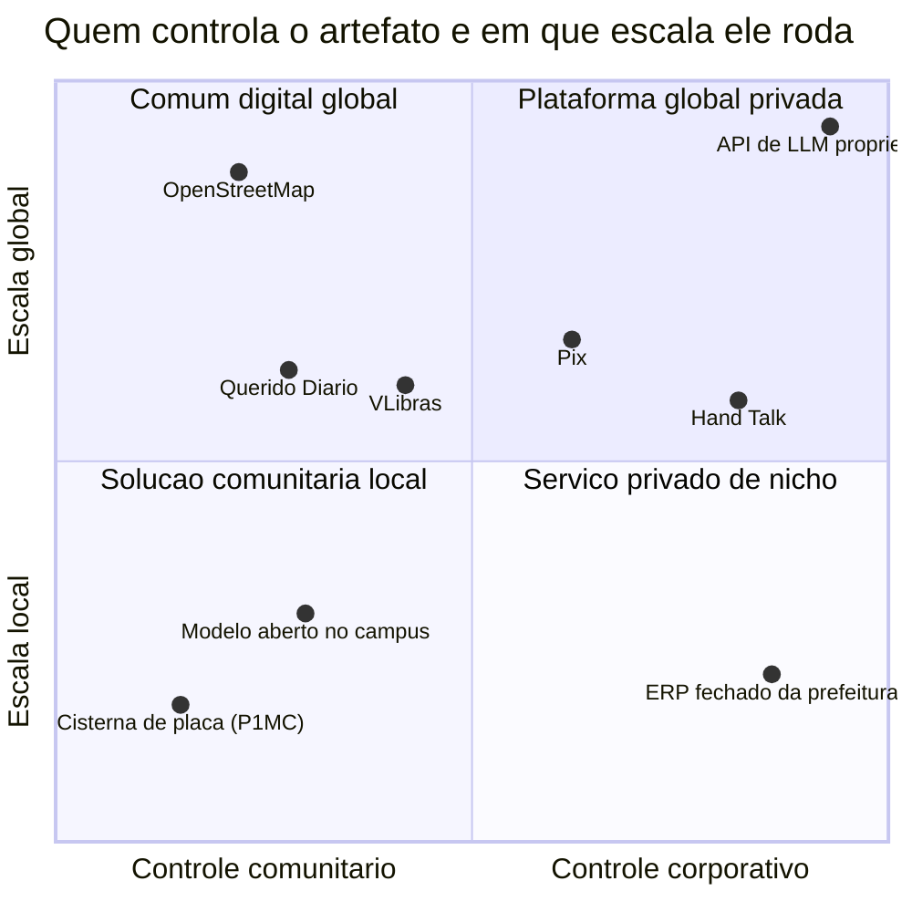
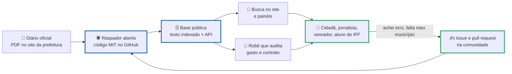

# Tecnologia social e tecnologia convencional

> [!quote] Um número para começar a aula
> *Em 3 de setembro de 2026, a API do Querido Diário listava **5.570 municípios brasileiros** e apenas **953** com a fonte do diário oficial mapeada. No Rio de Janeiro, 52 dos 92. Itaperuna está coberta. **Bom Jesus do Itabapoana, código 3300605, não está.** Não falta tecnologia: falta alguém escrever um raspador de 200 linhas para uma cidade de 35.173 pessoas, porque não há mercado nisso. Esta aula é sobre o tipo de tecnologia que existe exatamente onde não há mercado.*

---

## 1. 🌱 O manual vale mais que o objeto

Comece pelo caso, não pela definição.

No semiárido brasileiro, a **cisterna de placa** é um reservatório de 16 mil litros construído ao lado da casa, com placas de cimento moldadas no próprio terreno, para captar a água do telhado na estação chuvosa. Ela sustenta uma família de até cinco pessoas por uma estiagem de até oito meses. O **P1MC** (Programa Um Milhão de Cisternas), da ASA (Articulação Semiárido Brasileiro), já capacitou **mais de 650 mil famílias**, chegou a **mais de 1.000 dos 1.417 municípios** do semiárido e armazenou **mais de 10 bilhões de litros** de água.

![[Recursos/Computação, Sociedade e Inclusão/Tecnologia social e tecnologia convencional/cisterna-de-placa-asa-piaui.png|Outdoor da ASA na BR-343, no Piauí, anunciando 50 mil cisternas de placas no estado (foto de 2015, Wikimedia Commons).]]

Repare no que é a tecnologia ali. Não é a caixa d'água: caixa d'água se compra. A tecnologia é o **processo**: o desenho da placa, o traço do cimento, o manual, a formação do pedreiro local, a organização da comunidade e a regra de gestão da água. Tudo isso circula livre, é ensinado de pessoa a pessoa e pode ser refeito em qualquer lugar com material local. É um recurso aberto, só que de concreto. Com software, o argumento será o mesmo.

### 1.1 As duas definições que a literatura usa

A **Rede de Tecnologia Social (RTS)** foi lançada em **14 de abril de 2005, em Brasília**, articulando Fundação Banco do Brasil, Petrobras, o então Ministério da Ciência e Tecnologia, Sebrae, Finep e Embrapa. O portal da rede, mantido pelo IBICT, definia assim:

> **Tecnologia Social compreende produtos, técnicas e/ou metodologias reaplicáveis, desenvolvidas na interação com a comunidade e que represente efetivas soluções de transformação social.**

A palavra que carrega o peso é **reaplicável**. Uma solução que só funciona com aquela equipe, naquela cidade, com aquele orçamento, resolve um problema; não vira tecnologia social.

O **Instituto de Tecnologia Social (ITS Brasil)**, que completou 25 anos em 2026, define de um jeito complementar:

> **Conjunto de técnicas e metodologias transformadoras, desenvolvidas e/ou aplicadas na interação com a população e apropriadas por ela, que representam soluções para inclusão social e melhoria das condições de vida.**

A palavra nova é **apropriadas por ela**. Não basta a comunidade participar da oficina: ela precisa ficar com a coisa na mão, saber operar, consertar e ensinar. O ITS publica parâmetros que funcionam como checklist de auditoria do REA que a sua equipe vai produzir:

| Parâmetro do ITS Brasil | Pergunta prática para o seu projeto |
|---|---|
| Razão de ser | O problema foi identificado **pela** população ou por você, no laboratório? |
| Tomada de decisão | Quem decidiu formato, horário e linguagem? |
| Papel da população | Houve apropriação e aprendizagem, ou só assistência? |
| Sustentabilidade | Continua funcionando depois que a turma vai embora? |
| Escala | Outra turma, em outra cidade, refaz só com o que você publicou? |

> [!info] 🇧🇷 O domínio que morreu
> O site da RTS, `rts.org.br`, **não existe mais como rede de tecnologia social**: em 03/09/2026 o domínio serve outro conteúdo. O conceito oficial de 2005 só é recuperável pelo Internet Archive. Infraestrutura cívica sem financiamento continuado apodrece, e o conhecimento público some junto: guarde o caso para [[Relevância social, investimento e políticas públicas de tecnologia]].

> [!example] 🧪 Atividade 1: Garimpar duas tecnologias sociais do Rio de Janeiro
> **Ferramenta:** banco de tecnologias sociais da Fundação Banco do Brasil, na plataforma [Transforma!](https://transforma.fbb.org.br/). A navegação por tema segue o padrão `https://transforma.fbb.org.br/tecnologia-social/tema/recursos-hidricos` (troque por `alimentacao`, `educacao`, `energia`, `habitacao`, `meio-ambiente`, `renda` ou `saude`).
>
> 1. Escolha **dois temas** e, em cada um, use o filtro lateral **UF** marcando **RJ - Rio de Janeiro**.
> 2. Abra **uma** tecnologia de cada tema e anote nome, instituição, problema, como funciona em 3 linhas, e o que a página **não** informa (custo? prazo? quantas famílias?).
> 3. Responda em uma frase: para reaplicar isso em Bom Jesus do Itabapoana, o que teria que mudar?
>
> **Resultado esperado:** tabela de 2 linhas com nome, link, instituição, problema, solução e a lacuna de informação encontrada.
>
> 📱 **Só com celular:** funciona no navegador.

> [!abstract] 🧠 Lente filosófica: Renato Dagnino (*Tecnologia Social: contribuições conceituais e metodológicas*, 2014) 🔓
> Dagnino, da Unicamp, nega a neutralidade da tecnologia de um jeito específico: a tecnologia convencional, aquela que a empresa capitalista desenvolve e usa, **carrega embutida** a lógica que a produziu (escala, hierarquia, poupança de mão de obra, propriedade privada do resultado). Não é estoque neutro à espera de uso bom ou mau. Daí a **adequação sociotécnica**: não basta "transferir" tecnologia convencional para uma cooperativa, é preciso reprojetar o artefato, a organização e o conhecimento embutido nele. Nas palavras dele: *"Tal como formulado, o conceito Adequação Sociotécnica é o processo que busca levar a cabo [...] uma vez que a ninguém interessa 'voltar às cavernas' ou 'jogar a criança com a água do banho', chegar à TS a partir da tecnologia capitalista"* (DAGNINO, 2014, p. 209). A consequência é política: quando a tecnologia convencional falha num empreendimento autogestionário, a culpa vai para a comunidade ("não souberam usar"), e o problema estava no artefato.
> **Pergunta:** o CRM que você vai instalar na associação de moradores foi desenhado para equipe de vendas com metas individuais. O que nele precisa ser reprojetado antes de virar ferramenta de um grupo que decide em assembleia?

---

## 2. ⚖️ Tecnologia social x tecnologia convencional

O contraste não é "boa contra má". É contraste de **escolhas de projeto**, e cada linha da tabela é uma decisão que alguém tomou.

| Dimensão | Tecnologia convencional | Tecnologia social |
|---|---|---|
| **Quem define o problema** | empresa, mercado, edital, roadmap | a comunidade, antes de existir solução |
| **Escala** | grande e uniforme; o ganho vem da padronização | pequena e adaptável; o ganho vem da reaplicação com ajuste local |
| **Efeito sobre o trabalho** | poupa mão de obra (é o objetivo) | costuma **ampliar** ocupação e renda |
| **Propriedade** | patente, segredo, código fechado, termos de uso | aberta e documentada para ser refeita |
| **Objetivo declarado** | produtividade, mercado, lucro | autonomia, inclusão, permanência |
| **Como se mede sucesso** | receita, retenção, custo por unidade | a comunidade continua usando depois que o projeto acabou |
| **Papel do usuário** | consumidor (ou dado de treino) | coprodutor |
| **Culpa quando falha** | do usuário, que "não soube usar" | do artefato, que não foi adequado |

> [!warning] Cuidado com a leitura fácil
> Tecnologia social **não** é tecnologia pobre, artesanal ou antiga. Cisterna de placa usa cálculo estrutural; o Querido Diário usa raspagem, indexação e API pública. O que muda é **quem decide o desenho e quem fica com o controle**, não o nível técnico. Quem confunde as duas coisas entrega à comunidade uma versão pior da mesma ferramenta.

### 2.1 A linhagem: de onde vem essa ideia

A linha do tempo é curta e vale decorar: **1973** (Schumacher e Illich publicam no mesmo ano), **2001** (Prêmio FBB e fundação do ITS Brasil), **2005** (lançamento da RTS), **2007** (Portal do Software Público), **2008** (Lei dos Institutos Federais), **2020** (Lei 14.063) e **2026** (13º Prêmio FBB, e o Querido Diário em 953 dos 5.570 municípios).

Quatro correntes alimentam o conceito, todas nascidas da mesma insatisfação com a ideia de que existe **um** caminho tecnológico.

- **E. F. Schumacher**, *Small Is Beautiful* (1973), propôs a **tecnologia intermediária**: entre a enxada e a fábrica automatizada existe uma faixa de escala humana, mais barata que a industrial e muito mais produtiva que a tradicional, e é nela que a maior parte do mundo vive.
- **Gandhi** tratou a roca de fiar (*charkha*) como escolha política, não nostálgica: quem controla a máquina controla a autonomia de quem trabalha nela. **Ivan Illich**, *Tools for Conviviality* (1973), deu o critério mais afiado, logo abaixo.
- **PLACTS**, o Pensamento Latino-Americano em Ciência, Tecnologia e Sociedade dos anos 1960 e 1970, é a raiz mais próxima de nós: **Varsavsky** e a crítica ao cientificismo importado, **Herrera** e a distinção entre política científica explícita e implícita (o que o país **diz** que quer e o que de fato financia), e **Sábato** com o triângulo Estado, estrutura produtiva e infraestrutura científico-tecnológica. É daí que vem o vocabulário brasileiro de soberania tecnológica.

![[Recursos/Computação, Sociedade e Inclusão/Tecnologia social e tecnologia convencional/ivan-illich-desenho.png|Retrato de Ivan Illich desenhado pelo usuário Chiossone (Wikimedia Commons). Não é fotografia: é desenho de autor, e vale conferir a origem de qualquer imagem antes de usar.]]

> [!abstract] 🧠 Lente filosófica: Ivan Illich (*Tools for Conviviality*, 1973)
> Illich chama de **ferramenta convivial** aquela que amplia a autonomia de quem a usa, em vez de transformar a pessoa em operadora de um sistema que ela não entende nem controla (paráfrase; não localizei tradução em acesso aberto para citar literalmente). A bicicleta é o exemplo dele: você aprende sozinho, conserta na esquina, decide o trajeto. O automóvel, não: exige indústria, combustível, estrada, seguro, oficina especializada, e reorganiza a cidade em torno de si. Illich acrescenta um movimento desconfortável: toda ferramenta tem um limiar a partir do qual passa a produzir o contrário do que prometia (a escola que ensina a depender do diploma, o carro que faz perder mais tempo do que se ganharia andando). O nome disso é **contraprodutividade**.
> **Pergunta:** o assistente de IA que responde à dúvida do aluno em 2 segundos aumenta a autonomia dele ou cria dependência de uma ferramenta que ele não pode consertar, auditar nem hospedar? Onde estaria o limiar?

**Andrew Feenberg** dá o outro lado, e é o mais útil para engenheiro. Em *Questioning Technology* (Routledge, 1999), ele recusa tanto o pessimismo que trata a técnica como destino quanto o instrumentalismo que a trata como ferramenta neutra: a tecnologia é **ambivalente**, carrega valores, mas esses valores resultam de disputa e **podem ser redesenhados**. Ele chama de **racionalização democrática** as intervenções de usuários e grupos afetados que mudam o desenho técnico; o caso clássico é o Minitel francês, terminal de consulta a dados que os usuários transformaram na marra em rede de conversa. Feenberg, aliás, já lecionou na UnB. A consequência é direta: se os valores entram no design, **participar do design é participar da política**.

O eixo horizontal não separa "grátis" de "pago", e sim **quem pode mexer**. O Pix é gratuito e público, mas ninguém fora do Banco Central o redesenha. O OpenStreetMap é editável por qualquer um com uma conta, e por isso fica no canto oposto.

> [!example] 🧪 Atividade 2: Colocar Bom Jesus do Itabapoana no mapa aberto
> **Ferramenta:** [OpenStreetMap](https://www.openstreetmap.org/), conta gratuita e editor iD no navegador. O OSM é, aliás, um dos bens públicos digitais registrados na ONU (você confere na Atividade 7).
>
> 1. Crie conta e localize Bom Jesus do Itabapoana (ou a sua cidade).
> 2. Escolha **3 pontos que você conhece de verdade** (escola, CRAS, ponto de ônibus, rampa, praça com wi-fi, UBS) e confira se existem e se nome, tipo e horário estão certos.
> 3. **Adicione ou corrija os 3.** No comentário do changeset escreva `mapeamento IFF Bom Jesus, disciplina Computacao Sociedade e Inclusao` e a fonte (`survey`, se viu no local). Salve e copie a URL.
>
> **Resultado esperado:** o **link público do changeset** (`openstreetmap.org/changeset/NÚMERO`) e um print do antes e depois. A edição fica no seu nome e passa a valer para o mundo inteiro, inclusive para os aplicativos de entrega que usam OSM.
>
> ⚖️ **Ética:** mapeie só o que observou, nunca residência de terceiros com nome de morador. Erro de boa-fé se corrige; invenção estraga a base para todo mundo.
>
> 📱 **Só com celular:** dá para conferir os pontos; a edição sai melhor no notebook.

---

## 3. 🇧🇷 Tecnologia social no Brasil: o dinheiro, os números e a lei

### 3.1 O prêmio que virou um banco de soluções

A **Fundação Banco do Brasil** criou o **Prêmio de Tecnologia Social em 2001**, a cada dois anos. Segundo a própria FBB, ele já destinou **mais de R\$ 22 milhões** em premiações e impulsionou **cerca de R\$ 1 bilhão** em investimentos para reaplicação de tecnologias sociais pelo país.

A **13ª edição**, em 2026, destinou **até R\$ 6 milhões** e anunciou os vencedores no Festival de Soluções Sociais para o Brasil, de **27 a 29 de maio de 2026**, no CCBB de Brasília. Foram **7 soluções premiadas**, e a lista diz muito sobre o que o país entende por tecnologia social hoje: **Afroteca** (conhecimento afrocentrado, com acervo e formação), **Dicionário Multimídia de Línguas Indígenas**, **Oficina Locomover** (manutenção de bicicletas ligada a renda e mobilidade), **Óleo no Ponto** (economia circular de resíduo), **Projeto Fitoterápicos**, **Rendar Saberes** (renda renascença e trabalho de mulheres) e **Centro de Aprendizagem Indígena do Rio Negro** (autonomia energética territorial).

As certificadas entram na plataforma **Transforma!**, que reúne **mais de 900 tecnologias sociais** documentadas e livres para uso e adaptação: é o acervo da Atividade 1. Guarde o **Dicionário Multimídia de Línguas Indígenas**, que volta na seção 5.

### 3.2 A palavra está na lei que criou o seu campus

Isto não é retórica de professor. A **Lei nº 11.892, de 29 de dezembro de 2008**, que criou os Institutos Federais, diz literalmente:

> **Art. 6º** Os Institutos Federais têm por finalidades e características: [...]
> **VII** - desenvolver programas de extensão e de divulgação científica e tecnológica;
> **IX** - promover a produção, o desenvolvimento e a transferência de **tecnologias sociais**, notadamente as voltadas à preservação do meio ambiente.

A expressão "tecnologia social" está no artigo que define **para que serve** o IFF, desde 2008. A extensão curricularizada (a Resolução CNE/CES nº 7, de 18/12/2018, exige no mínimo 10% da carga horária da graduação em extensão) e as **20 horas-aula de extensão desta disciplina** (CSECBJ.54, 60 h/a) não são apêndice simpático: são o inciso IX sendo cumprido, com você dentro.

O [[Projeto de Extensão - IA para Todos]] é a peça prática desta unidade. Na aula combinada para isso, cada equipe traz o **rascunho do REA** e ensaia 15 minutos da oficina para a turma. Use os parâmetros do ITS (seção 1.1) como roteiro de crítica ao trabalho dos colegas.

> [!example] 🧪 Atividade 3: Mapa dos serviços digitais da cidade (uMap)
> **Ferramenta:** [uMap](https://umap.openstreetmap.fr/pt-br/), que monta mapas colaborativos sobre a base do OpenStreetMap sem instalar nada.
>
> 1. Crie um mapa chamado `Onde resolver a vida digital em Bom Jesus`.
> 2. Marque **5 pontos** onde alguém **sem internet em casa** consegue resolver algo digital: lotérica, CRAS, biblioteca, telecentro, praça com wi-fi, cartório, prefeitura, o campus.
> 3. Em cada balão escreva **o que dá para fazer ali**, o horário e se precisa levar documento. Deixe o mapa público e copie o link.
>
> **Resultado esperado:** a **URL pública do mapa** com 5 pontos preenchidos. É matéria-prima da oficina do projeto de extensão: exatamente o que uma pessoa idosa precisa saber e não sabe.
>
> 📱 **Só com celular:** funciona no navegador, marcando os pontos andando pela cidade.

---

## 4. 💻 Tecnologia social digital: civic tech, software público e trilhos do Estado

Aqui a disciplina encontra a sua profissão. Tudo que foi dito da cisterna vale para código, com uma vantagem enorme (custo de reaplicação quase zero) e uma armadilha: código sem manutenção morre, e quem dependia dele fica na mão.

### 4.1 Civic tech brasileira: o dado sai da gaveta

O caso exemplar é o **Querido Diário**, da Open Knowledge Brasil. Todo município publica atos oficiais no diário oficial, normalmente em PDF, num site que muda de layout a cada gestão. Sem isso indexado, ninguém consegue perguntar o simples: quanto a prefeitura gastou com software em 2025? Há menção a inteligência artificial nos atos deste ano? O projeto raspa, extrai texto, indexa e publica uma API, com código no GitHub sob **licença MIT**.

Os números, lidos na própria API em **03/09/2026**:

| Indicador | Valor |
|---|---|
| Municípios no índice | **5.570** |
| Municípios com fonte de diário oficial mapeada | **953** (cerca de 17%) |
| Municípios do RJ no índice / com fonte mapeada | 92 / **52** |
| Bom Jesus do Itabapoana (3300605) | **sem fonte mapeada** |
| Itaperuna | coberta |

Traduzindo: **mais de 4,6 mil cidades brasileiras não têm o próprio diário oficial em formato consultável**. A transparência existe na lei e não existe na prática, e a diferença entre as duas é um raspador que ninguém escreveu. É um diagnóstico de país e, ao mesmo tempo, um projeto de extensão de tamanho realista para uma equipe de 7º período.

No mesmo ecossistema: **Operação Serenata de Amor** e o robô Rosie (auditoria de reembolsos parlamentares), **Brasil.io** e **Base dos Dados** (dados públicos limpos e consultáveis em SQL), **Colab** (problemas urbanos) e **Fogo Cruzado** (dados sobre tiroteios).

O ciclo só fecha porque a última seta existe. Em tecnologia convencional, o usuário insatisfeito abre um chamado e espera; em tecnologia social digital, ele abre uma issue e, se souber, resolve. É a **racionalização democrática** de Feenberg em forma de pull request.

> [!example] 🧪 Atividade 4: Caçar "inteligência artificial" nos diários oficiais
> **Ferramenta:** [Querido Diário](https://queridodiario.ok.org.br/), busca em `https://queridodiario.ok.org.br/pesquisa`, e a API `https://queridodiario.ok.org.br/api/cities`.
>
> 1. Na busca, escolha um município **coberto** (Itaperuna serve) e procure por `"inteligência artificial"` e depois por `internet`.
> 2. Abra **um** resultado e anote data, órgão e o trecho exato: é contrato, licitação, nomeação, projeto de lei?
> 3. Abra a API de municípios e procure `Bom Jesus do Itabapoana` (3300605). Existe o campo `publication_urls`? Quantos municípios do seu estado têm fonte mapeada?
>
> **Resultado esperado:** 1 achado real com data e link, mais a resposta objetiva "Bom Jesus está coberta? sim ou não", com o trecho da API que prova.
>
> 📱 **Só com celular:** a busca funciona e a API abre no navegador como texto.

> [!example] 🧪 Atividade 5: Um número do seu município, direto da fonte
> **Ferramenta:** [API do IBGE SIDRA](https://apisidra.ibge.gov.br/values/t/4714/n6/3300605/v/93/p/2022), [Base dos Dados](https://basedosdados.org/) e [Brasil.io](https://brasil.io/datasets/).
>
> 1. Abra a URL do SIDRA acima: ela pede a tabela 4714 (Censo 2022), nível município (`n6`), código **3300605** (Bom Jesus do Itabapoana), variável 93 (população residente). Anote o campo `V` e repita com o código de Itaperuna.
> 2. Escolha **um segundo indicador** em Base dos Dados ou Brasil.io (domicílios, empresas, saúde, educação) para o mesmo município.
>
> **Resultado esperado:** tabela com 2 indicadores e 2 municípios, com ano, fonte e link. É o parágrafo de contexto que o relatório do seu projeto de extensão precisa ter e a maioria não tem (📱 a API do SIDRA abre no navegador do celular).

> [!example] 🧪 Atividade 6: Entrar de verdade num projeto cívico
> **Ferramenta:** as issues marcadas [`good first issue` do Querido Diário](https://github.com/okfn-brasil/querido-diario/labels/good%20first%20issue) e o repositório da [Operação Serenata de Amor](https://github.com/okfn-brasil/serenata-de-amor).
>
> 1. Leia **3 issues** abertas com esse rótulo (em 03/09/2026 havia 25 no Querido Diário; várias são de mapeamento de municípios por sistema de publicação, o gargalo da seção 4.1).
> 2. Escolha **uma** e escreva 5 linhas: o que ela pede, que conhecimento exige, quanto tempo levaria e qual seria o seu primeiro passo.
> 3. Se, e somente se, você for mesmo trabalhar nela, comente na issue, em português, se apresentando.
>
> **Resultado esperado:** link da issue, seu resumo de 5 linhas e, se comentou, o print.
>
> ⚖️ **Ética:** projeto aberto é feito por voluntários. Nada de issue de teste, de "quero contribuir" seguido de sumiço, nem de pull request de vírgula para inflar contribuição.

### 4.2 Software público: a licença aberta que já é lei

O Brasil tem um instrumento que muita gente da área desconhece. A **Lei nº 14.063, de 23 de setembro de 2020**, determina no Art. 16:

> **Art. 16.** Os sistemas de informação e de comunicação desenvolvidos exclusivamente por órgãos e entidades da administração direta, autárquica e fundacional dos Poderes e órgãos constitucionalmente autônomos dos entes federativos são regidos por **licença de código aberto**, permitida a sua utilização, cópia, alteração e distribuição sem restrições por todos os órgãos e entidades abrangidos por este artigo.

O § 1º estende a regra aos sistemas já em operação e o § 2º lista exceções, como restrição de acesso por segurança. Antes disso, o **Portal do Software Público Brasileiro** já existia desde **12 de abril de 2007**, hoje com **81 softwares catalogados**, disciplinado pela Portaria STI/MP nº 46/2016, alterada pela Portaria SGD/ME nº 3/2019.

O argumento oficial do governo é o de Illich e Dagnino em outra roupa: **independência de fornecedor**. Ao contratar software proprietário, o órgão fica dependente da única empresa capaz de alterar aquele código, e a prefeitura de 35 mil habitantes é quem tem menos poder de barganha.

> [!example] 🧪 Atividade 7: Bens públicos digitais, e os brasileiros da lista
> **Ferramenta:** [registro da Digital Public Goods Alliance (DPGA)](https://www.digitalpublicgoods.net/registry), endossado pela ONU. Em 03/09/2026 tinha **250 bens públicos digitais** (software aberto, dados abertos, sistemas de IA e conteúdo aberto), avaliados contra o **DPG Standard**.
>
> 1. Percorra o registro e encontre **3 bens públicos digitais desenvolvidos no Brasil**. Dica: comece pelo Querido Diário e olhe também dados abertos e meio ambiente.
> 2. Para cada um anote nome, categoria, licença, quem mantém e o link do repositório.
> 3. Escolha um indicador do DPG Standard (documentação, licença aberta, privacidade, não causar dano, padrões abertos): o REA da sua equipe o cumpriria hoje? O que faltaria?
>
> **Resultado esperado:** tabela com 3 bens brasileiros, com licença e link, mais um parágrafo de autoavaliação do seu REA.

> [!example] 🧪 Atividade 8: Três softwares públicos e a Lei 14.063
> **Ferramenta:** catálogo do [Portal do Software Público Brasileiro](https://softwarepublico.gov.br/social/search/software_infos) e a [página oficial do Software Público no gov.br](https://www.gov.br/governodigital/pt-br/plataformas-e-servicos-digitais/software-publico).
>
> 1. Liste **3 softwares** do catálogo: nome, órgão responsável, para que serve, licença declarada.
> 2. Procure o repositório de cada um e anote a **data do último commit** (ou registre que não achou repositório público, que também é resultado).
> 3. Responda em 3 linhas: eles cumprem o Art. 16 da Lei 14.063/2020? O que impede uma prefeitura de 35 mil habitantes de adotar um deles amanhã?
>
> **Resultado esperado:** tabela de 3 linhas com licença e data do último commit, mais a conclusão. "Estar catalogado" e "estar vivo" são coisas diferentes.

### 4.3 Infraestrutura pública digital: os trilhos do Estado

**Infraestrutura pública digital (DPI, de *digital public infrastructure*)** é o conjunto de trilhos digitais compartilhados que o Estado provê como bem público (identidade, pagamento, troca de dados), sobre os quais público e privado constroem serviços. O caso mais citado no mundo é o **India Stack** (Aadhaar, UPI, DigiLocker); o brasileiro é o trio **Pix, gov.br e urna eletrônica**, mais o SUS digital.

![[Recursos/Computação, Sociedade e Inclusão/Tecnologia social e tecnologia convencional/urna-eletronica-brasileira-2022.png|Urna eletrônica brasileira do modelo usado a partir de 2022 (foto do TSE, domínio público).]]

A urna é o exemplo mais provocativo da aula. É uniforme e centralizada como qualquer tecnologia convencional, tem fornecedor, e ninguém na comunidade a reprojeta. Mas resolve um problema de inclusão brutal: voto secreto, autônomo e rápido para uma população de escolaridade muito desigual, com resultado no mesmo dia num país continental. **Isso é tecnologia social?** Pelo critério "reaplicável e apropriada pela comunidade", não; pelo critério "resolve demanda concreta e amplia cidadania", sim. Guarde a divergência para o debate.

Os números mostram que a infraestrutura pega, mas pega desigual (CETIC.br, TIC Domicílios 2025, divulgada em 09/12/2025): **75%** dos usuários de internet usam **Pix**, mas são **98%** na classe A contra **60%** nas classes DE; **71%** dos usuários de 16 anos ou mais acessaram algum **serviço de governo** pela internet e **56%** entraram na plataforma **gov.br**.

### 4.4 Tecnologia assistiva: "com quem", não "para quem"

O **VLibras** traduz automaticamente português para Libras (texto, áudio e vídeo) e foi desenvolvido pelo **LAVID/UFPB** com a Secretaria de Governo Digital, o Ministério dos Direitos Humanos, a RNP e a Câmara dos Deputados. É software livre e de código aberto, e qualquer site pode embutir o widget. Do outro lado existe a **Hand Talk**, empresa brasileira que resolve o mesmo problema com modelo privado. Os dois avatares traduzem; só um deles você pode instalar no servidor do campus, auditar e adaptar.

Vale dizer com todas as letras, porque é erro comum de engenheiro: **tradução automática para Libras não substitui intérprete humano**. Ela amplia alcance, erra em termo técnico, sigla, número e ambiguidade, e a comunidade surda tem posições divergentes sobre avatares. Trate como acessibilidade complementar, e teste com quem usa.

> [!example] 🧪 Atividade 9: Testar o limite da tradução automática para Libras
> **Ferramenta:** [VLibras](https://www.gov.br/governodigital/pt-br/acessibilidade-e-usuario/vlibras/vlibras) e [Hand Talk](https://www.handtalk.me/br/).
>
> 1. Pegue **um parágrafo real** do material da oficina da sua equipe e traduza nos dois, assistindo à sinalização inteira.
> 2. Anote **3 pontos em que a tradução falhou ou ficou duvidosa**: sigla (IA, LGPD, Pix), número, termo técnico, palavra ambígua ou frase longa demais.
> 3. **Reescreva o parágrafo** para sobreviver à tradução (frases curtas, sigla explicada) e traduza de novo.
>
> **Resultado esperado:** parágrafo antes e depois, a lista das 3 falhas e um print de cada tradutor. Bônus: o texto reescrito também fica melhor para a pessoa idosa da oficina (📱 os dois têm versão web e aplicativo).

---

## 5. 🌍 A mesma tecnologia não chega igual em todo lugar

### 5.1 Norte e Sul: a geografia de quem faz e de quem usa

O argumento estrutural é simples de enunciar e desconfortável de aceitar: **os dados de treino, o poder de computação, os modelos e as licenças estão no Norte global; o dado bruto, o trabalho de rotulagem e o mercado consumidor estão no Sul.** É a geografia da mineração com outra matéria-prima.

**Nick Couldry e Ulises Mejias**, em *The Costs of Connection* (Stanford University Press, 2019), chamam isso de **colonialismo de dados**: a extração de dados repete a lógica histórica de apropriação de recursos, agora sobre a vida cotidiana, com o centro de decisão no Norte. Não é metáfora fraca: as duas coisas envolvem apropriação de algo que antes não era mercadoria (terra, corpo, agora comportamento) e uma justificativa moral para a apropriação ("progresso", "conectar o mundo").

**Milton Santos** deu o vocabulário geográfico três décadas antes. O **meio técnico-científico-informacional** é o estágio em que técnica, ciência e informação se fundem e passam a produzir o território, sempre de forma desigual: cada lugar recebe uma densidade diferente desse meio. A formulação que ficou é que **"o meio técnico-científico-informacional é a cara geográfica da globalização"** (SANTOS, 1997, p. 191). Em *Por uma outra globalização* (2000), ele separa três leituras do processo: a **fábula** (o mundo como nos fazem crer), a **perversidade** (o mundo como é) e a **possibilidade** (o mundo como pode ser, vista a partir dos países pobres e das classes populares).

Não é abstrato para você: todo data center, cabo submarino e cluster de GPU que sustenta a IA de 2026 se instala em pontos específicos do planeta. É por isso que a IA chega antes, mais barata e mais bem ajustada em São Paulo do que em Bom Jesus do Itabapoana, e mais em Bom Jesus do que numa aldeia.

### 5.2 Quem constrói tecnologia a partir do Sul

**Masakhane** é o exemplo mais forte: comunidade de base de processamento de linguagem natural "for Africa, by Africans" (o nome significa "construímos juntos" em isiZulu). Já em **fevereiro de 2020** reunia **mais de 1.000 participantes de 30 países africanos**, com **mais de 49 resultados de tradução publicados para mais de 38 línguas africanas** e trabalhos em ACL, COLING e EMNLP. O site lembra o dado que explica a urgência: **2.000 das línguas do mundo são africanas**, e quase nenhuma tem corpus digital decente.

No Brasil, o análogo apareceu premiado neste ano: o **Dicionário Multimídia de Línguas Indígenas**, do 13º Prêmio FBB. Documentação linguística feita com as comunidades é política de língua, projeto de memória e, se a licença permitir, insumo para um modelo funcionar naquela língua. Repare na ordem: **primeiro o dado feito com a comunidade, depois o modelo**. O inverso, treinar o modelo e depois procurar comunidade para usá-lo, é transferência sem adequação.

![[Recursos/Computação, Sociedade e Inclusão/Tecnologia social e tecnologia convencional/ailton-krenak.png|Ailton Krenak, liderança indígena, escritor e primeiro indígena eleito para a Academia Brasileira de Letras (foto do Garapa Coletivo Multimídia, 2010).]]

> [!abstract] 🧠 Lente filosófica: Ailton Krenak (*Ideias para adiar o fim do mundo*, 2019)
> Krenak, eleito para a Academia Brasileira de Letras em 2023 e empossado em 2024, não trata a tecnologia como boa ou má em si: trata como sintoma de uma relação com a Terra. O que recusa é a adesão automática ao show do progresso e o lugar quase religioso da tecnologia hoje. Duas falas literais: *"As corporações estão tentando transformar a gente em máquinas. Criaram essa história de cultura digital, e o resultado é que todo mundo está plasmado em uma tela o tempo inteiro, vivendo em outros mundos"* (Época Negócios, jan/2025) e *"Estou preocupado com o efeito quase místico que ciência e tecnologia estão imprimindo no nosso modo de pensar o mundo"* (IHU-Unisinos, jun/2025). A crítica atinge em cheio a palavra "inclusão": incluir em quê, a que custo, e quem decidiu que aquilo é o centro?
> **Pergunta:** a sua oficina inclui a comunidade num mundo que ela escolheu, ou a convence a entrar num mundo já decidido? Como você saberia a diferença, na prática, ao fim do dia?

**Yuk Hui**, filósofo de Hong Kong, dá o outro lado da mesma moeda com um conceito operacional: **tecnodiversidade**. Contra a premissa, compartilhada pela filosofia europeia e pelo Vale do Silício, de que existe **uma** técnica universal em marcha única, ele propõe pensar **cosmotécnicas** situadas, cada uma com sua cosmologia e seus valores. Na apresentação da edição brasileira de *Tecnodiversidade* (Ubu, 2020): *"Não há uma única tecnologia, mas sim uma tecnodiversidade, uma multiplicidade de cosmotécnicas que diferem umas das outras em seus valores, epistemologias e formas de existência."* A saída não seria acelerar nem frear a mesma técnica, e sim bifurcá-la. Para o seu trabalho: a alternativa ao modelo do Norte não é o mesmo modelo com sotaque, é outro desenho.

---

## 6. 🤖 IA como tecnologia social? · 🔮 E em 2036?

### 6.1 A pergunta que a turma tem que responder

Aplique o crivo da RTS e do ITS a um sistema de IA. Cada linha tem resposta verificável.

| Critério | API de LLM proprietária | Modelo aberto rodando no campus |
|---|---|---|
| **Reaplicável?** | não: depende de contrato, cota e cartão | sim: baixa, roda, copia o disco |
| **Feita na interação com a comunidade?** | não: o dado dela é o mundo inteiro, sem consentimento local | depende do que **você** fizer com ela |
| **Apropriável?** | a comunidade não audita, ajusta nem hospeda | pode, se alguém ensinar (esse alguém é você) |
| **Documentada para reaplicação?** | documentação de uso, não de construção | pesos e cartão do modelo públicos |
| **Sobrevive ao fim do projeto?** | enquanto houver quem pague | enquanto houver máquina e quem saiba manter |
| **Onde para o dado da comunidade** | no servidor de uma empresa em outro país | no campus |

Isso não decide a questão sozinho: um modelo aberto mal ajustado, que erra o nome do benefício do INSS, é pior para a comunidade do que uma API boa. O ponto de Dagnino não é escolher a tecnologia mais pobre, é **não confundir a solução do fornecedor com a solução da comunidade**. Para experimentar o lado aberto, o caminho é o [[Ollama - gerenciamento de modelos de IA]]; a comparação nuvem x local está no [[Kit de ferramentas de Computação e Sociedade]].

### 6.2 As três condições e o risco de sempre

Para uma aplicação de IA ter chance de funcionar como tecnologia social, três condições aparecem em quase todos os casos que dão certo:

1. **Dado local e legítimo.** O modelo precisa ter visto o problema daquela gente (o sotaque, a doença, a praga, a língua, o formulário), com consentimento e licença clara.
2. **Controle e manutenção próximos.** Alguém a menos de 100 km precisa saber ligar, atualizar e desligar aquilo, ou a solução dura o tempo do edital.
3. **Abertura suficiente para auditar.** Não necessariamente peso aberto, mas no mínimo: o que entra, o que sai, a taxa de erro e quem responde quando erra.

O risco de sempre tem nome. **Evgeny Morozov**, em *To Save Everything, Click Here* (2013), chama de **solucionismo tecnológico** o hábito de recastar situações sociais complexas como problemas bem definidos de solução computável, tratando como ineficiência o que é deliberação, conflito ou opacidade legítima (paráfrase). O erro não é técnico: **a redefinição do problema já é decisão política**, tomada por engenheiros, sem debate público. O teste dele cabe numa pergunta: *o problema estava mal resolvido ou mal formulado?* O chatbot do posto resolve a falta de médico? O app do CRAS resolve a fila do CRAS?

> [!tip] O seu projeto de extensão como tecnologia social em miniatura
> O [[Projeto de Extensão - IA para Todos]] tem todos os elementos do conceito em escala pequena: problema identificado com a comunidade, artefato (a oficina e o REA), licença aberta, documentação para reaplicação e avaliação pelos participantes. Os dois critérios em que a maioria das equipes vai falhar são os mais difíceis: **apropriação** (alguém de lá dá a oficina de novo sem você?) e **permanência** (o material continua servindo em março?). Escreva no relatório o que fez para atacar os dois. Se não fez nada, escreva isso também: honestidade metodológica vale mais nota que número bonito.

### 6.3 E em 2036?

Três cenários, com quem sustenta cada um. Nenhum é profecia; todos são apostas que já têm evidência e defensor.

| Cenário | O que acontece até 2036 | Base do argumento | O que você faz com isso |
|---|---|---|---|
| **Trilhos públicos** | a lógica do Pix e do gov.br se estende: identidade, pagamento e dados como infraestrutura pública, com bens digitais reusados entre países | agenda de DPI, Art. 16 da Lei 14.063/2020, os 250 bens da DPGA | governo digital e empresas que integram com o Estado; saber licença tanto quanto Kubernetes |
| **Dependência com verniz social** | tudo vira camada fina sobre APIs de três empresas; "IA para o bem" é marketing e a comunidade nunca controla nada | colonialismo de dados, solucionismo, Krenak | ser quem sabe medir dependência e negociar contrato de saída; valor de mercado, não militância |
| **Tecnodiversidade real** | modelos e dados locais, línguas minorizadas documentadas, cooperativas de dados, infraestrutura compartilhada entre instituições públicas | Masakhane, Yuk Hui, Dicionário Multimídia de Línguas Indígenas, software público | é onde um IF do interior tem vantagem: você está perto de quem tem o problema |

O engenheiro que trabalha nessa fronteira tem um papel antigo e uma decisão nova. Antigo porque é o que Feenberg descreve: quem participa do design participa da política. Nova porque, em 2036, a decisão de projeto que mais pesa não será qual framework, e sim **o que roda perto de quem usa e o que roda num servidor que ninguém aqui controla**. Se você vai empreender com isso, a ponte é [[Empreendedorismo digital]]; se vai fazer carreira pública, é a próxima aula.

---

## 🗣️ Para debater em sala

Formato no [[Kit de ferramentas de Computação e Sociedade]]. Não é atividade avaliada: é o roteiro do debate.

**1. Um modelo de linguagem proprietário pode ser tecnologia social?**

| Posição A: pode | Posição B: não pode |
|---|---|
| Os parâmetros do ITS olham para a **demanda social concreta, a apropriação e a melhoria de vida**, não para a propriedade do código. Se a ferramenta resolve o problema e a comunidade sabe usá-la, o critério está atendido; exigir modelo aberto pode significar entregar solução pior a quem tem menos. | A definição da RTS exige **reaplicável** e Dagnino exige poder reprojetar o artefato. Sem acesso ao peso, ao dado e à licença, a comunidade não reaplica, não audita e não sobrevive a uma mudança de preço. |

**2. A urna eletrônica é tecnologia social?**

| Posição A: é | Posição B: não é |
|---|---|
| Resolve demanda social concreta (voto secreto, autônomo e apurável para população de escolaridade desigual), amplia cidadania e é decisão pública. Pelos parâmetros do ITS, marca quase todas as caixas de razão de ser e de resultado. | Não é reaplicável nem apropriável: ninguém na comunidade constrói, adapta ou audita o artefato sem autorização. É infraestrutura pública convencional bem-feita, outra categoria. |

**3. Levar oficina de IA para quem não pediu é inclusão ou invasão?**

| Posição A: é invasão, se a comunidade não definiu o problema | Posição B: não oferecer é abandono |
|---|---|
| Paulo Freire, em *Extensão ou comunicação?* (1969), mostra que "levar" conhecimento a quem é tratado como recipiente vazio é invasão cultural, não educação. Krenak acrescenta: a pressa de incluir supõe que o mundo digital é o centro, e ninguém perguntou. | O CETIC.br mostra uso de IA generativa muito menor entre pessoas idosas e nas classes DE, e quem fica de fora é o alvo preferido de golpe com voz e vídeo sintéticos. Não oferecer, em nome do respeito, deixa a assimetria como está. |

---

## ❓ Quiz rápido

> [!question]- 1. Por que a cisterna de placa é considerada tecnologia social?
> **Resposta:** porque a tecnologia é o **processo documentado e reaplicável** (desenho, traço, manual, formação do pedreiro, organização comunitária), construído na interação com a população e apropriado por ela, e não o objeto. Uma caixa d'água comprada pronta resolveria o problema imediato sem nada disso.

> [!question]- 2. Verdadeiro ou falso: "tecnologia social é tecnologia de baixa complexidade técnica".
> **Resposta:** **falso.** O que define não é o nível técnico, e sim quem define o problema, quem controla o artefato e como se mede o sucesso. A cisterna exige cálculo estrutural; o Querido Diário usa raspagem, indexação e API.

> [!question]- 3. Em 03/09/2026, quantos dos 5.570 municípios do índice do Querido Diário tinham fonte de diário oficial mapeada, e Bom Jesus do Itabapoana estava entre eles?
> **Resposta:** **953** municípios, cerca de 17%, e **Bom Jesus do Itabapoana não estava** (código IBGE 3300605, sem `publication_urls`). Itaperuna estava. No RJ eram 52 de 92.

> [!question]- 4. O que a Lei nº 14.063/2020 determina sobre software desenvolvido pelo poder público, e por que isso interessa a uma prefeitura pequena?
> **Resposta:** o **Art. 16** determina que sistemas desenvolvidos **exclusivamente** por órgãos da administração pública são regidos por **licença de código aberto**, com uso, cópia, alteração e distribuição livres entre os órgãos abrangidos (exceções no § 2º). Reduz o aprisionamento a fornecedor, e a prefeitura de 35 mil habitantes é quem tem menos poder de barganha.

> [!question]- 5. Segundo Morozov, qual é o erro central do solucionismo tecnológico?
> **Resposta:** recastar situações sociais complexas como problemas de solução computável, tratando como ineficiência o que é deliberação, conflito ou opacidade legítima. O erro não é a solução ser ruim: é a **redefinição do problema** já ser decisão política tomada sem debate.

---

## 🔗 Veja também

- [[Projeto de Extensão - IA para Todos]]: a unidade 7 vira prática aqui, e o rascunho do REA é revisado nesta aula.
- [[Recursos Educacionais Abertos]]: a mesma discussão (quem estuda, modifica e redistribui o artefato), aplicada a material didático.
- [[A tecnologia não é neutra - Computação e Sociedade]]: a premissa que Dagnino leva às últimas consequências, e [[Filosofia da Tecnologia - as grandes perguntas da era da IA]], onde Feenberg, Illich, Vieira Pinto e Yuk Hui aparecem com mais fôlego.
- [[Vieses, discriminação algorítmica e inclusão]] e [[Cultura, identidade e tecnologias digitais]]: por que dado local não é detalhe.
- [[Empreendedorismo digital]]: quando a tecnologia social encontra modelo de negócio, e onde os dois brigam.
- [[Kit de ferramentas de Computação e Sociedade]] e [[Glossário de Computação, Sociedade e Inclusão]]: ferramentas e termos desta aula.
- ⬅️ **Aula anterior:** [[Cidadania e educação na sociedade digital]]
- ➡️ **Próxima aula:** [[Relevância social, investimento e políticas públicas de tecnologia]]

---

> [!note] 📚 Fontes (todas consultadas em 03/09/2026)
> - Conceito: [ITS Brasil](https://itsbrasil.org.br/areas-de-atuacao-tecnologia-social/) · Portal RTS, mantido pelo IBICT, arquivado em 22/12/2010: [conceito](http://web.archive.org/web/20101222162726/http://www.rts.org.br/rts/tecnologia-social/tecnologia-social) · [LEMOS e DECHANDT, *Organizações & Sociedade*, 26(90), 2019](https://doi.org/10.1590/1984-9260906), lançamento da RTS em 14/04/2005
> - Brasil: [ASA, P1MC](https://www.asabrasil.org.br/acoes/p1mc) · [Prêmio FBB](https://fbb.org.br/premio/) · [Transforma!, vencedores do 13º Prêmio, 10/06/2026](https://transforma.fbb.org.br/blog/festival-de-solucoes-sociais-para-o-brasil-revela-vencedores-do-premio-fundacao-bb-de-ts-2) · [plataforma Transforma!](https://transforma.fbb.org.br/) · [Lei 11.892/2008, Art. 6º, IX](https://www.planalto.gov.br/ccivil_03/_ato2007-2010/2008/lei/l11892.htm) · [Lei 14.063/2020, Art. 16](https://www.planalto.gov.br/ccivil_03/_ato2019-2022/2020/lei/l14063.htm)
> - Digital: [gov.br, Software Público](https://www.gov.br/governodigital/pt-br/plataformas-e-servicos-digitais/software-publico) · [Querido Diário](https://queridodiario.ok.org.br/) e sua [API de municípios](https://queridodiario.ok.org.br/api/cities) · [DPGA, 250 bens públicos digitais](https://www.digitalpublicgoods.net/registry) · [VLibras](https://www.gov.br/governodigital/pt-br/acessibilidade-e-usuario/vlibras/vlibras) · [Masakhane](https://www.masakhane.io/). As demais ferramentas estão linkadas nas atividades.
> - Dados: [CETIC.br, TIC Domicílios 2025 (09/12/2025)](https://cetic.br/pt/noticia/50-milhoes-de-brasileiros-ja-usam-ia-mas-potenciais-beneficios-continuam-limitados-as-camadas-de-maior-renda-e-escolaridade/) · [SIDRA, população de Bom Jesus no Censo 2022](https://apisidra.ibge.gov.br/values/t/4714/n6/3300605/v/93/p/2022)
> - Pensadores: Krenak em [Época Negócios, jan/2025](https://epocanegocios.globo.com/tecnologia/noticia/2025/01/e-preciso-parar-de-endeusar-os-magnatas-da-tecnologia-e-lembrar-que-eles-so-trabalham-em-beneficio-proprio-diz-ailton-krenak) e [IHU-Unisinos, jun/2025](https://www.ihu.unisinos.br/categorias/653699-nos-nao-podemos-ser-uma-maquina-de-fazer-coisas-entrevista-com-ailton-krenak) · [Ubu Editora, *Tecnodiversidade*, de Yuk Hui](https://www.ubueditora.com.br/tecnodiversidade.html) · [MAIA, *Ateliê Geográfico*, 2012](https://revistas.ufg.br/atelie/article/download/15642/13076/0), citando SANTOS, 1997, p. 191
> - Imagens (Wikimedia Commons): [Cisterna da ASA no Piauí, de Academia de letras de CM, CC BY-SA 3.0 br](https://commons.wikimedia.org/wiki/File:Cisterna_da_ASA_(In_Piau%C3%AD).JPG) · [Ivan Illich drawing, de Chiossone, CC BY-SA 3.0](https://commons.wikimedia.org/wiki/File:Ivan_Illich_drawing.jpg) · [urna eletrônica de 2022, TSE, domínio público](https://commons.wikimedia.org/wiki/File:Brazilian_DRE_voting_machine_for_2022_elections.jpg) · [Ailton Krenak, Garapa Coletivo Multimídia, CC BY-SA 2.0](https://commons.wikimedia.org/wiki/File:Ailton_Krenak_(5269420566)_(cropped).jpg)

> [!note] 📖 Leituras
> - DAGNINO, Renato (org.). *Tecnologia social: contribuições conceituais e metodológicas*. Campina Grande: EDUEPB; Florianópolis: Insular, 2014. 🔓 [PDF integral na SciELO Books](https://static.scielo.org/scielobooks/7hbdt/pdf/dagnino-9788578793272.pdf); a citação desta aula está na p. 209.
> - ILLICH, Ivan. *Tools for Conviviality*. New York: Harper & Row, 1973. Ferramenta convivial e contraprodutividade.
> - SCHUMACHER, E. F. *Small Is Beautiful*. London: Blond & Briggs, 1973. Tecnologia intermediária e escala humana.
> - FEENBERG, Andrew. *Questioning Technology*. London: Routledge, 1999. Ambivalência e racionalização democrática.
> - PINTO, Álvaro Vieira. *O conceito de tecnologia*. Rio de Janeiro: Contraponto, 2005. 2 v. Ingenuidade tecnológica e ideologização da técnica.
> - SANTOS, Milton. *A natureza do espaço*. São Paulo: Hucitec, 1996; e *Por uma outra globalização*. Rio de Janeiro: Record, 2000.
> - KRENAK, Ailton. *Ideias para adiar o fim do mundo*. São Paulo: Companhia das Letras, 2019; e *A vida não é útil*, 2020.
> - HUI, Yuk. *Tecnodiversidade*. São Paulo: Ubu, 2020. Cosmotécnica contra a marcha técnica única.
> - COULDRY, Nick; MEJIAS, Ulises A. *The Costs of Connection*. Stanford: Stanford University Press, 2019. Colonialismo de dados.
> - MOROZOV, Evgeny. *To Save Everything, Click Here*. New York: PublicAffairs, 2013. O problema mal formulado.
> - FREIRE, Paulo. *Extensão ou comunicação?* Rio de Janeiro: Paz e Terra, 1969. 📗 Bibliografia do curso.
> - CAZELOTO, Edilson. *Inclusão digital: uma visão crítica*. São Paulo: Senac, 2019. 📗 Bibliografia do curso.
