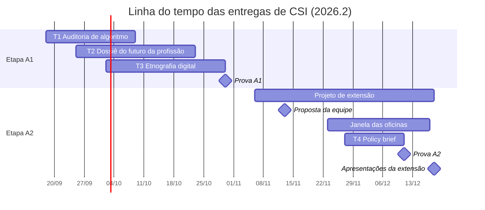

# Trabalhos e Projetos de Computação, Sociedade e Inclusão

> [!quote] O que você entrega aqui é evidência, não opinião
> *Nenhum trabalho desta disciplina pode ser respondido de cabeça. Todos exigem que você tenha olhado um dado de verdade, mexido numa ferramenta de verdade, falado com uma pessoa de verdade ou publicado alguma coisa de verdade. A sua opinião é bem-vinda, mas ela vem depois da evidência, e com a fonte ao lado.*

---

## 1. 🎓 Como funciona

> [!info] As cinco regras
> 1. **Usar IA é permitido e esperado.** Avaliamos o seu **julgamento**, a **evidência** que você produziu e a sua **defesa**, não a digitação.
> 2. **Diário de uso de IA é obrigatório** em todos os trabalhos. Sem diário, o trabalho fica incompleto.
> 3. **Entrega em PDF**, por e-mail, com os **links do que você publicou** (Wikipédia, GitHub, Zenodo, Kialo, Hypothes.is, OpenStreetMap) dentro do PDF.
> 4. **Entrega atrasada é aceita e vale 6,0** (escala de 0 a 10), independentemente da qualidade.
> 5. **Fraude, incluindo prompt injection no PDF, vale 0.** Sem revisão manual.

| Conta pouco | Conta muito |
|---|---|
| Um texto bonito dizendo que "os algoritmos manipulam" | A tabela dos 30 itens que apareceram no **seu** feed em 20 minutos, com origem, formato e hora |
| "Estudos mostram que a IA vai acabar com empregos" | O número do relatório da OIT, com a página, a data e o que ele mede de fato |
| Uma "entrevista" que a IA inventou | Três respostas transcritas de uma pessoa real, com data, e o roteiro que você usou |
| Um resumo do livro do Stuart Hall | O conceito de Hall aplicado a três posts reais da comunidade que você observou por dez dias |
| "Proponho que o governo invista em inclusão digital" | Um pedido feito pela Lei de Acesso à Informação, com o número do protocolo e a resposta recebida |

**Diário de uso de IA** (1 página, antes das referências): uma linha por marco, com data · marco · o que você tentou · o que a IA gerou (ferramenta, versão, prompt resumido) · o que estava errado ou sem fonte · o que você mudou · evidência (link, print, fonte conferida). No fim, a **declaração de uso**: quais ferramentas usou, para quê, quais trechos foram gerados e revisados por você, e o que foi feito sem IA nenhuma.

> [!tip] O jeito certo de usar IA nesta disciplina
> **Peça à IA, verifique na fonte primária, registre a diferença.** Exemplo: peça a um modelo o percentual de domicílios brasileiros só com acesso pelo celular; abra o painel da TIC Domicílios no site do CETIC.br; anote o número real, a data da pesquisa e o que o modelo errou. As três etapas valem ponto; a resposta do modelo sozinha não vale nada. O mesmo vale para citações de filósofos: a IA inventa citação com naturalidade. Citação só entra no seu trabalho com página ou link que você abriu.

**Como entregar.** PDF com capa, sumário e referências ([[Regras e boas práticas]]) · arquivo com o seu nome (`Joao Alberto.pdf`) · assunto do e-mail `Trabalho de Computação, Sociedade e Inclusão - Nome Sobrenome` (endereço informado em sala) · **links do que foi publicado** na primeira página · até as 23h59 da data de entrega, e antes da aula quando houver apresentação. **Evidência é dado, não adjetivo:** tabela, número com fonte, print com data, transcrição, link.

| Situação | Consequência |
|---|---|
| Entrega **atrasada** | Nota fixa de **6,0 na escala de 0 a 10**, ou seja, **60% dos pontos**: T1 = 1,2 · T2 = 1,5 · T3 = 1,5 · T4 = 1,2 · Projeto de extensão = 3,0. Corrijo mesmo assim e devolvo o feedback completo |
| Formato diferente de **PDF** | Desconto equivalente a 2,0 pontos na escala de 0 a 10 (20% dos pontos). O trabalho é corrigido normalmente |
| **Prompt injection** no PDF, visível ou escondida (texto branco, fonte 1pt, metadado) | Fraude: **nota 0**, sem revisão manual |
| Entrevista, diário de campo ou dado **inventados** | Fraude: **nota 0** no trabalho |
| Atraso **com** fraude | A fraude vence: **0** |

> [!warning] Ética com pessoas
> T2, T3 e o projeto de extensão envolvem pessoas reais. Regras que valem sempre: **consentimento** (a pessoa sabe que é para um trabalho da faculdade e concorda), **anonimização** (nomes trocados, nada que identifique alguém contra a vontade), **nada de menores identificáveis**, **nunca invadir grupo fechado** sem permissão, **nunca pedir senha, CPF ou dado sensível**. Os modelos de termo de consentimento e o protocolo ético estão no [[Kit de ferramentas de Computação e Sociedade]].

---

## 2. 🗓️ Mapa das entregas

| Trabalho | Pontos | Etapa | Formato | Lançamento | Entrega |
|---|---|---|---|---|---|
| **T1** Auditoria de um algoritmo do cotidiano | 2,0 | A1 | Individual | 18/09 | **09/10** |
| **T2** Dossiê: o futuro da minha profissão | 2,5 | A1 | Duplas | 25/09 | **23/10** |
| **T3** Etnografia digital de uma comunidade | 2,5 | A1 | Individual | 02/10 | **30/10** |
| **Projeto de Extensão** IA para Todos | 5,0 | A2 | Equipes de 3 a 4, ajuste individual | 06/11 | proposta **13/11** · oficinas **23/11 a 17/12** · relatório e apresentação **18/12** |
| **T4** Policy brief: uma política pública de tecnologia para o Noroeste Fluminense | 2,0 | A2 | Duplas | 27/11 | **11/12** |

Com as provas objetivas (3,0 em cada etapa), A1 e A2 fecham 10,0 pontos cada, por **soma**, nunca por média ponderada. Calendário completo em [[Cronograma de Computação, Sociedade e Inclusão]].

---

## 3. 🔍 T1: Auditoria de um algoritmo do cotidiano (2,0 pontos)

**2,0 pontos · A1 · individual · lançado 18/09 · entrega 09/10 · 6 a 8 h**
**Apoio:** [[A tecnologia não é neutra - Computação e Sociedade]] · [[Poder, plataformas e vigilância - o público, o privado e o sujeito]] · [[Vieses, discriminação algorítmica e inclusão]] · [[Kit de ferramentas de Computação e Sociedade]]

**Objetivo.** Escolher **um sistema algorítmico que decide algo na sua vida** e produzir o **laudo de auditoria** dele: o que ele sabe de você, como se comporta quando você muda as condições, que política carrega (o teste de Winner) e o que a lei te permite fazer a respeito.

**Sistemas que servem.** Feed do Instagram, TikTok ou YouTube · preço dinâmico do Uber, 99 ou iFood · recomendação do Spotify ou da Netflix · anúncios da Meta ou do Google · resultados do Google para o seu nome · filtro de spam do e-mail · "Para você" do X · score de crédito (Serasa) · o ranking de um marketplace. Um sistema só, e um que você usa de verdade.

**Por que o mercado faz isso.** Auditoria algorítmica é obrigação legal em construção: o AI Act europeu exige avaliação de sistemas de alto risco e o PL 2338/2023 prevê o mesmo no Brasil; a LGPD já garante o direito de acesso aos dados e de revisão de decisões automatizadas. Quem sabe auditar um sistema é quem vai ser chamado quando a empresa precisar provar que ele não discrimina.

### Roteiro

1. **O que ele sabe de você (1 h).** Abra os dados que o sistema expõe: Google "Minha Atividade" e Takeout, preferências de anúncios da Meta ou do Google, a página "Por que estou vendo isso?" de um anúncio, o histórico do app. Anote 10 inferências que o sistema fez sobre você e marque quais estão certas.
2. **Experimento controlado (2 a 3 h).** Mude uma condição e meça o efeito. Exemplos: 30 minutos de feed em conta logada contra 30 minutos em janela anônima (tabule cada item: origem, formato, tema, patrocinado ou não) · o mesmo trajeto no app de transporte em três horários (print do preço) · a mesma busca em dois dispositivos ou duas contas · duas semanas "curtindo" só um tipo de conteúdo e a mudança do feed. Registre tudo em tabela, com data e hora.
3. **Teste de Winner (30 min).** Que política este artefato carrega? Liste 3 evidências observáveis nas configurações e nos padrões (o que vem ligado, o que é difícil de desligar, quem ganha com cada padrão) e passe o sistema pelas quatro lentes (social, econômica, cultural, política).
4. **Exercer um direito (30 min + espera).** Faça um pedido real com base na LGPD: acesso aos seus dados, explicação de uma decisão automatizada ou exclusão de dados, pelo canal do próprio serviço ou pelo e-mail do encarregado (DPO). Registre a data, o texto enviado, o prazo legal e a resposta (ou a ausência dela até a entrega).
5. **Laudo (2 h).** PDF de 4 a 6 páginas: sistema e por que ele; o que ele sabe de você; o experimento (método, tabela, resultado); o teste de Winner e as quatro lentes; o pedido LGPD; conclusão em 5 linhas com o que você mudaria no projeto desse sistema se fosse o engenheiro responsável.

| Rubrica (2,0 pontos) | Pontos |
|---|---|
| **Experimento documentado** (método claro, tabela com data e hora, resultado interpretado) | **0,8** |
| **Análise** (teste de Winner com evidência, quatro lentes, ligação com os conceitos das páginas: vigilância, modulação, viés) | **0,7** |
| **Direito exercido** (pedido LGPD real, com protocolo, prazo e resposta registrados) | **0,2** |
| **Formato e diário de IA** (PDF, capa, sumário, referências, diário coerente) | **0,3** |

> [!warning] Como a IA entra e o que é cola
> **Entra:** peça à IA para sugerir o desenho do experimento, ou para explicar uma cláusula dos termos de uso, e confira no texto original. **É cola:** tabela de feed "gerada", pedido LGPD que não foi enviado, print sem data. Na defesa, escolho **uma linha da sua tabela** e pergunto o que ela é.

---

## 4. 💼 T2: Dossiê: o futuro da minha profissão (2,5 pontos)

**2,5 pontos · A1 · duplas · lançado 25/09 · entrega 23/10 · 10 a 12 h por dupla**
**Apoio:** [[Automação, trabalho e o futuro das profissões]] · [[A virada da IA - o que mudou no mundo desde 2022]] · [[O engenheiro de computação em 2036 - trabalho, carreira e responsabilidade]] · [[Kit de ferramentas de Computação e Sociedade]]

**Objetivo.** Escolher **uma profissão** (a de vocês, engenharia de computação, ou a de alguém da família: professor, contador, agricultor, enfermeiro, motorista, comerciante) e responder com evidência: o que a IA já faz das tarefas dessa profissão, o que os dados de 2025-2026 dizem sobre ela, o que dizem as pessoas que a exercem, e três cenários fundamentados para 2036.

**Por que isso importa.** Os relatórios mais citados sobre o futuro do trabalho medem coisas diferentes (exposição, adoção, emprego de entrada, produtividade) e chegam a conclusões opostas. Saber ler esses relatórios, e comparar com a realidade de quem trabalha, é o que separa análise de manchete.

### Roteiro

1. **Tarefas (2 h).** Abra a ocupação no O*NET (ou na CBO brasileira) e liste as 10 a 15 tarefas principais. Para cada uma, marque: um agente ou modelo de IA já faz hoje? Parcialmente? Não? Com que evidência (teste seu ou fonte)?
2. **Dados (2 h).** Extraia, com página e data, o que dizem sobre a profissão (ou o setor) pelo menos três destas fontes: WEF Future of Jobs 2025, índice de exposição da OIT (2025), Anthropic Economic Index, o estudo de Stanford sobre trabalhadores de entrada, a FGV IBRE ou a ESPM para o Brasil, o painel do Novo CAGED (emprego formal no setor, no RJ). Monte uma tabela "fonte · o que mede · o que diz sobre a profissão · data".
3. **Experimento (2 h).** Escolham uma tarefa real da profissão que leve uns 30 minutos (um relatório, uma planilha, um diagnóstico simples, uma resposta a cliente, um trecho de código) e peçam a um agente ou modelo que a faça. Cronometrem, avaliem a qualidade em 3 critérios definidos antes, e registrem o que precisou de correção humana.
4. **Pessoas (2 h).** Entrevistem **duas pessoas** que exercem a profissão (roteiro de 8 perguntas no Kit; consentimento; gravação ou anotação; transcrição de pelo menos 3 respostas de cada). Perguntas mínimas: o que mudou no trabalho nos últimos 3 anos, o que usam de IA, o que temem, o que acham que não muda.
5. **Cenários (2 h).** Três cenários para 2036 (substituição ampla, complementaridade, platô), cada um com quem o defende (autor, relatório, data), o que precisaria acontecer e o que a profissão vira em cada um. Fechem com uma recomendação para quem tem 20 anos e quer essa profissão.
6. **Dossiê (2 h).** PDF de 6 a 8 páginas mais apêndice com a tabela de tarefas, a tabela de dados, o registro do experimento e as transcrições.

| Rubrica (2,5 pontos) | Pontos |
|---|---|
| **Dados com fonte** (≥ 3 fontes, página e data, tabela "o que mede") | **0,6** |
| **Experimento documentado** (tarefa real, tempo, critérios, correções) | **0,7** |
| **Entrevistas** (2 pessoas reais, roteiro, transcrições, consentimento) | **0,6** |
| **Cenários fundamentados** (3 cenários com autor e condições; recomendação) | **0,4** |
| **Formato e diário de IA** | **0,2** |

> [!info] Entrevista por WhatsApp vale
> Áudio ou chamada de vídeo com uma pessoa real vale como entrevista, desde que haja consentimento e transcrição. Transcrever com IA é permitido; conferir três trechos com o áudio é obrigatório e vai no diário.

---

## 5. 📓 T3: Etnografia digital de uma comunidade (2,5 pontos)

**2,5 pontos · A1 · individual · lançado 02/10 · entrega 30/10 · 10 dias de campo + 4 h de escrita**
**Apoio:** [[Cultura, identidade e tecnologias digitais]] · [[Poder, plataformas e vigilância - o público, o privado e o sujeito]] · [[Kit de ferramentas de Computação e Sociedade]]

**Objetivo.** Passar **dez dias observando uma comunidade online** como um etnógrafo: com diário de campo datado, vocabulário nativo, regras explícitas e implícitas, e depois analisar o que viu com os conceitos de cultura e identidade da disciplina (Laraia, Geertz, Hall, Castells, Kozinets).

**Comunidades que servem.** Um subreddit, um servidor público de Discord, um fórum, um canal de Twitch com chat ativo, uma comunidade de jogo, um grupo aberto de Facebook, uma hashtag viva no TikTok, um grupo de agricultores, de mães, de concurseiros, de fãs. Regra: **comunidade aberta** (qualquer um entra) ou uma em que você já esteja e que aceite observação. Nada de grupo privado invadido. Nada de comunidade de menores.

### Roteiro

1. **Entrada (dia 1).** Apresente-se se a comunidade tiver esse costume; se for observação silenciosa em espaço aberto, registre por que isso é aceitável ali. Anote as regras explícitas (descrição, moderação, pinned posts).
2. **Diário de campo (dias 1 a 10).** Uma entrada por dia, mínimo 10 entradas, cada uma com: data e hora · onde olhou · o que aconteceu (fatos) · o que sentiu ou estranhou (separado dos fatos) · termos nativos que apareceram (com o significado que você inferiu) · regras implícitas percebidas · uma pergunta que ficou. O template está no Kit.
3. **Descrição densa (2 h).** Escolha 3 posts ou episódios e descreva cada um "densamente" (Geertz): não só o que foi dito, mas o que significa naquele contexto, para quem, e o que acontece se alguém fizer diferente.
4. **Análise (2 h).** Aplique: cultura como conceito antropológico (o que é "natural" ali e não é fora), identidade em Hall (que identidades os membros performam; fragmentação) e em Castells (a comunidade é identidade legitimadora, de resistência ou de projeto?), a mediação da plataforma (o que o algoritmo e o design fazem com a cultura do grupo: ranking, moderação, incentivos).
5. **Ética (30 min).** Anonimize tudo (nomes, handles, prints com nomes borrados), explique como entrou e por que foi legítimo, e o que você não registrou por respeito.
6. **Relatório.** PDF de 5 a 7 páginas mais o diário de campo completo em apêndice.

| Rubrica (2,5 pontos) | Pontos |
|---|---|
| **Diário de campo** (≥ 10 entradas datadas, fatos separados de impressões, vocabulário nativo) | **1,0** |
| **Descrição densa** (3 episódios interpretados no contexto) | **0,5** |
| **Análise com os conceitos** (cultura, Hall, Castells, mediação da plataforma, com evidência do diário) | **0,7** |
| **Ética e anonimização** | **0,1** |
| **Formato e diário de IA** | **0,2** |

> [!warning] O diário não se inventa
> O diário de campo tem data, hora e detalhe que só quem esteve lá tem. Na defesa, escolho **uma entrada** e pergunto sobre ela. Um diário "gerado" é fraude (nota 0).

---

## 6. 🏛️ T4: Policy brief: uma política pública de tecnologia para o Noroeste Fluminense (2,0 pontos)

**2,0 pontos · A2 · duplas · lançado 27/11 · entrega 11/12 · 6 a 8 h por dupla**
**Apoio:** [[Relevância social, investimento e políticas públicas de tecnologia]] · [[Cidadania e educação na sociedade digital]] · [[Tecnologia social e tecnologia convencional]] · [[Kit de ferramentas de Computação e Sociedade]]

**Objetivo.** Escrever um **policy brief** de 2 a 3 páginas, no formato que assessores e gestores usam, sobre **um problema real de tecnologia e sociedade do Noroeste Fluminense** (Bom Jesus do Itabapoana e vizinhos): conectividade rural, inclusão digital de pessoas idosas, IA na escola pública, dados abertos da prefeitura, telecentro ou laboratório aberto, acessibilidade dos serviços digitais municipais, capacitação em IA para o comércio local.

**Por que isso importa.** Engenheiro que sabe escrever um brief influencia decisão: numa empresa, numa prefeitura, numa consulta pública. É o gênero textual mais curto e mais poderoso da política pública.

### Roteiro

1. **Problema com dados (2 h).** Um parágrafo de problema sustentado por pelo menos 2 dados locais ou regionais (IBGE SIDRA para o município, CETIC.br por região, INEP por escola, Novo CAGED, dados da prefeitura, dados.gov.br). Se o dado não existir, isso é um achado: registre.
2. **Um pedido pela LAI (30 min + espera).** Façam um pedido real de informação no Fala.BR (à prefeitura, ao Estado, ao IFF ou a um ministério) sobre o problema, e registrem protocolo, prazo e resposta.
3. **Opções (1 h).** Três opções de política (inclusive "não fazer nada"), cada uma com custo aproximado, fonte de financiamento possível (Fust, PBIA, emenda, FBB, edital dos IFs, FAPERJ) e um exemplo em que algo parecido foi feito (com fonte).
4. **Recomendação (1 h).** Uma opção recomendada, com os passos dos primeiros 12 meses, os responsáveis, dois indicadores de sucesso (com o valor de partida) e um risco.
5. **Brief (2 h).** 2 a 3 páginas no template do Kit: título, resumo executivo em 5 linhas, problema, opções, recomendação, indicadores, referências. Linguagem direta, sem jargão, sem partidarismo.

| Rubrica (2,0 pontos) | Pontos |
|---|---|
| **Problema com dados** (≥ 2 dados locais/regionais com fonte e data; pedido LAI registrado) | **0,6** |
| **Opções e recomendação fundamentadas** (3 opções com custo e exemplo; recomendação com passos e responsáveis) | **0,7** |
| **Viabilidade, financiamento e indicadores** | **0,4** |
| **Formato de brief e diário de IA** | **0,3** |

---

## 7. 🤝 Projeto de Extensão: IA para Todos (5,0 pontos)

**5,0 pontos · A2 · equipes de 3 a 4 · lançado 06/11 · proposta 13/11 · oficinas 23/11 a 17/12 · relatório e apresentação 18/12**

É um terço da carga horária da disciplina e a entrega mais importante do semestre: **oficinas de letramento em inteligência artificial e inclusão digital** para públicos reais de Bom Jesus do Itabapoana, com o material publicado como **recurso educacional aberto**. O enunciado completo (públicos, parceiros, roteiro da oficina de 2 horas, evidências, ética, consentimento, cronograma e rubrica detalhada) está em [[Projeto de Extensão - IA para Todos]].

| Rubrica (5,0 pontos, resumo) | Pontos |
|---|---|
| **Proposta** (13/11: público, parceiro, data, local, roteiro, materiais, responsáveis, riscos) | **0,5** |
| **REA publicado** (material da oficina com licença Creative Commons, acessível, com créditos, no GitHub e no Zenodo ou Wikimedia Commons) | **1,5** |
| **Oficina executada com evidências** (público real, lista de presença, fotos com consentimento, avaliação dos participantes) | **2,0** |
| **Relatório e apresentação** (18/12) | **1,0** |

> [!info] Ajuste individual
> A nota é da equipe, com ajuste individual pela presença na oficina, pela participação registrada (commits, materiais, lista) e pela apresentação. Quem não foi à oficina não recebe os pontos de execução.

---

## 8. 📝 Provas objetivas (3,0 pontos em cada etapa)

| Prova | Data | O que cai | Formato |
|---|---|---|---|
| **A1** | 30/10 | As páginas das partes 1 e 2: [[A tecnologia não é neutra - Computação e Sociedade]], [[Filosofia da Tecnologia - as grandes perguntas da era da IA]], [[A virada da IA - o que mudou no mundo desde 2022]], [[Automação, trabalho e o futuro das profissões]], [[Poder, plataformas e vigilância - o público, o privado e o sujeito]], [[Cultura, identidade e tecnologias digitais]], [[Vieses, discriminação algorítmica e inclusão]] | 100% objetiva (múltipla escolha e verdadeiro ou falso), com cartão-resposta; questões de caso: um cenário real e o conceito que o explica |
| **A2** | 11/12 | As páginas das partes 3 e 4: [[Recursos Educacionais Abertos]], [[Cidadania e educação na sociedade digital]], [[Tecnologia social e tecnologia convencional]], [[Relevância social, investimento e políticas públicas de tecnologia]], [[O engenheiro de computação em 2036 - trabalho, carreira e responsabilidade]] | Idem |

> [!tip] Como estudar
> Os quizzes no fim de cada página têm o mesmo estilo da prova. O [[Glossário de Computação, Sociedade e Inclusão]] tem os conceitos com o autor. Estude pelos casos: para cada conceito, saiba um caso real que o ilustra e quem o formulou.

---

## 9. ⭐ Pontos extras por contribuição pública

Até **0,5 ponto por etapa**, somado à etapa em que foi conquistado, para quem publicar algo útil de verdade e provar:

| Contribuição | Evidência | Pontos |
|---|---|---|
| Edição substantiva aceita na Wikipédia em português (com fonte, mantida por 7 dias) | link do histórico | 0,2 |
| Mapeamento de 10 ou mais pontos de Bom Jesus no OpenStreetMap | link do changeset | 0,2 |
| Resposta fundamentada a uma consulta pública (ANPD, MEC, e-Cidadania, Participa + Brasil) | print com data | 0,2 |
| Recurso educacional aberto extra publicado com DOI no Zenodo | link do DOI | 0,3 |
| Relato de bug ou issue aceita em projeto de tecnologia cívica (Querido Diário, Serenata, Base dos Dados) | link da issue | 0,3 |

---

## 🔗 Veja também

- [[Projeto de Extensão - IA para Todos]]: o enunciado completo do projeto.
- [[Kit de ferramentas de Computação e Sociedade]]: roteiros de entrevista, template de diário de campo, template de policy brief, termo de consentimento, fontes de dados.
- [[Cronograma de Computação, Sociedade e Inclusão]]: todas as datas.
- [[Regras e boas práticas]]: formato de entrega e regras gerais.
- [[Tópicos/Computação, Sociedade e Inclusão/index|Computação, Sociedade e Inclusão]]: página principal da disciplina.
