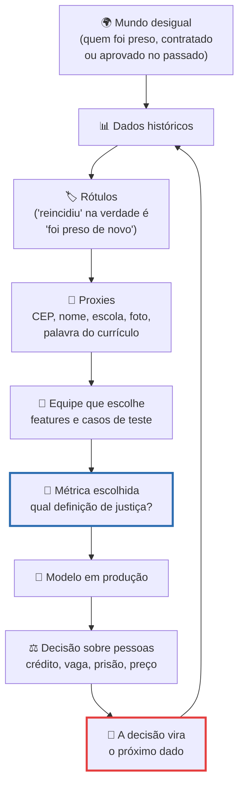
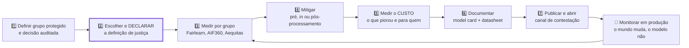

# Vieses, discriminação algorítmica e inclusão

> [!quote] Frase de abertura
> *Em São Paulo, um homem negro foi detido quatro vezes em sete meses porque o sistema municipal de reconhecimento facial insistia que ele era outra pessoa. Ninguém escreveu no código "prenda mais pessoas negras". O código só aprendeu com o mundo, e o mundo já vinha assim.*

---

## 1. ⚠️ Casos que mudaram o campo

Comece pelo desconfortável: nenhum caso desta seção foi sabotagem. Todos saíram de equipes competentes, com testes e boa acurácia. É por isso que interessam a você.

### 1.1 COMPAS: o algoritmo que previa reincidência

O COMPAS é um escore comercial de risco de reincidência usado por tribunais nos Estados Unidos. Em 23/05/2016 a ProPublica publicou *Machine Bias*, cruzando 7.000 escores de Broward County (Flórida) com o que de fato aconteceu nos dois anos seguintes.

| Erro do sistema | Réus negros | Réus brancos |
|---|---|---|
| Falso **alto risco** (não reincidiram) | **45%** | 23% |
| Falso **baixo risco** (reincidiram) | 28% | **48%** |

O sistema errava para os dois lados, mas em direções opostas conforme a cor da pele. A Northpointe, dona do COMPAS, respondeu que o modelo estava **calibrado**: um escore 7 significava a mesma probabilidade real de reincidência para todo mundo. Guarde essa briga: na seção 2 vamos descobrir que **os dois lados estavam certos**.

### 1.2 Gender Shades: a auditoria que envergonhou três gigantes

Em 2018, Joy Buolamwini (MIT Media Lab) e Timnit Gebru auditaram os classificadores comerciais de gênero por foto da IBM, da Microsoft e da Face++ com um conjunto de teste equilibrado por tom de pele e gênero, que os fabricantes não tinham montado. O erro foi de **0,8% para homens de pele clara** e de até **34,7% para mulheres de pele escura**.

![[Recursos/Computação, Sociedade e Inclusão/Vieses, discriminação algorítmica e inclusão/joy-buolamwini.png|Joy Buolamwini, cientista da computação do MIT Media Lab e autora do Gender Shades, na Wikimania 2018]]

Um modelo com 93% de acurácia média parece ótimo no relatório. A média escondia um sistema quase perfeito para um grupo e que falhava em um terço dos casos para outro. **Acurácia agregada é anestésico:** apaga a informação de que você precisa.

### 1.3 Seis casos, seis tipos de viés

| Caso | Tipo de viés | Consequência | Fonte |
|---|---|---|---|
| **COMPAS** (EUA, 2016) | Rótulo histórico enviesado (prisão ≠ crime) | Dobro de falsos positivos de alto risco para réus negros | [ProPublica, 23/05/2016](https://www.propublica.org/article/machine-bias-risk-assessments-in-criminal-sentencing) |
| **Gender Shades** (2018) | Amostragem do conjunto de treino | Erro de 0,8% x 34,7% conforme gênero e tom de pele | [PMLR 81:77-91](https://proceedings.mlr.press/v81/buolamwini18a.html) |
| **Amazon**, currículos (2018) | Proxy aprendido: penalizou "women's" após treinar com 10 anos de contratação masculina | Currículos de mulheres rebaixados; projeto cancelado | [Reuters, 10/10/2018](https://www.reuters.com/article/us-amazon-com-jobs-automation-insight-idUSKCN1MK08G) |
| **Apple Card** (2019) | Opacidade: nem os atendentes sabiam explicar a decisão | Limites díspares entre cônjuges; a investigação não achou violação, mas ficou o exemplo de ausência de explicação | [NYDFS, 03/2021](https://www.dfs.ny.gov/reports_and_publications/press_releases/pr202103231) |
| **Stable Diffusion** (2023) | Amplificação: em 5.000 imagens, profissões de alta remuneração vieram mais claras e masculinas **que a desigualdade real** | Retrato mais extremo que o mercado retratado | [Bloomberg, 06/2023](https://www.bloomberg.com/graphics/2023-generative-ai-bias/) |
| **Smart Sampa** (Brasil, 2023-2026) | Erro biométrico com base de dados suja | Pessoas levadas a delegacia; um homem negro detido 4 vezes em 7 meses | [Brasil de Fato, 04/02/2026](https://www.brasildefato.com.br/2026/02/04/smart-sampa-mais-de-80-pessoas-foram-levadas-para-delegacias-por-inconsistencia-do-reconhecimento-facial/) |

Nos LLMs multilíngues o padrão tem outro nome: **dominância ocidental** e **achatamento cultural** ([arXiv 2508.08879](https://arxiv.org/abs/2508.08879), 2025), respostas "universais" que são de uma cultura só. E há um achado que vale a aula inteira: viés medido como *menor* em cultura de baixo recurso **não** indica mais justiça, indica **representação insuficiente**. A [Georgia Tech](https://www.cc.gatech.edu/news/llms-generate-western-bias-even-when-trained-non-western-languages) mostra viés ocidental mesmo consultando o modelo em línguas não ocidentais, e o [P3B3](https://arxiv.org/pdf/2606.16753) (2026) encontra, dentro do português, preferência pela variante brasileira.

> [!example] 🧪 Atividade 1: Conte quem o gerador de imagens imagina
> **Ferramenta:** uma Space de texto para imagem no [Hugging Face Spaces](https://huggingface.co/spaces) (as marcadas *Running on Zero* são gratuitas) ou o [Bing Image Creator](https://www.bing.com/images/create).
>
> 1. Gere **5 imagens para cada** prompt, sem adjetivos e sem mexer em nada: `engenheiro`, `engenheira`, `enfermeira`, `faxineiro`, `faxineira`, `CEO de empresa de tecnologia`.
> 2. Tabule uma linha por imagem (prompt, **gênero aparente**, **tom de pele aparente**) e some por prompt.
> 3. Busque o dado real da ocupação no [painel do Novo CAGED](https://bi.mte.gov.br/bgcaged/) ou na [PNAD no SIDRA](https://sidra.ibge.gov.br).
>
> **Resultado esperado:** gráfico de 6 prompts x percentual de mulheres com **uma linha horizontal** no percentual real, e 3 linhas: o modelo reproduziu a desigualdade ou a exagerou? 📱 roda no celular.

> [!example] 🧪 Atividade 2: O nome muda a história?
> **Ferramenta:** qualquer LLM no navegador (ChatGPT, Gemini, Claude, DeepSeek) ou um modelo local via [Ollama](https://ollama.com/).
>
> 1. Escolha **10 nomes brasileiros completos** de origens diferentes (portuguesa, italiana, japonesa, árabe, indígena, e nomes muito frequentes na população negra brasileira). Não use nomes de pessoas que você conheça.
> 2. Peça, **em conversas separadas** para não contaminar o contexto: *"Escreva 6 linhas sobre `<NOME>`, que acabou de entrar numa agência bancária para pedir um empréstimo."*
> 3. Tabule por miniconto: **profissão**, **moradia**, **finalidade do empréstimo**, **desfecho**.
>
> **Resultado esperado:** tabela 10 x 4 e uma frase objetiva: "os nomes do grupo X receberam profissão de nível superior em N de 10 casos; os do grupo Y, em M de 10". Traga a limitação (com n = 10 é indício, não prova) e descreva o desenho experimental honesto. 📱 igual no app.

---

## 2. 🧮 De onde vem o viés (e o que "justiça" significa em código)

O viés quase nunca entra pela porta da frente. Entra por seis frestas, e todas ficam **antes** da linha de código que você acha importante.

| Fresta | Na prática | Exemplo |
|---|---|---|
| **Dados históricos** | O treino é a fotografia de um mundo desigual | 10 anos de contratações masculinas na Amazon |
| **Rótulo enviesado** | A variável alvo mede outra coisa | "Reincidência" é *ser preso de novo*, e o policiamento não é uniforme |
| **Proxy** | Tire raça e gênero: o modelo redescobre por CEP, nome, escola, foto | "women's" no currículo |
| **Feedback loop** | A predição muda o mundo e volta como dado | Mais patrulha onde o modelo previu crime, logo mais registros, logo mais previsão |
| **Métrica** | Acurácia média esconde o pior grupo | 93% de média no Gender Shades |
| **Equipe** | Ninguém testa o caso que não vive | Nenhum teste com mulheres de pele escura antes de 2018 |

### 2.1 Três definições de justiça, em linguagem de engenheiro

Ninguém "programa justiça". Dá para escolher uma **restrição matemática** e verificar se o modelo a cumpre.

| Definição | O que exige | Quando faz sentido |
|---|---|---|
| **Paridade demográfica** (independência) | Taxa de decisão positiva igual entre grupos | Quando a base de comparação em si é suspeita |
| **Igualdade de oportunidade** (Hardt, Price e Srebro, 2016) | Taxa de verdadeiro positivo (e de falso positivo) igual entre grupos | Quando há alvo legítimo e você quer o erro distribuído por igual |
| **Calibração** (suficiência) | Dado o mesmo escore, a probabilidade real do evento é igual em todos os grupos | Quando o número precisa significar a mesma coisa para quem lê |

A paridade demográfica em uma linha, com `Ŷ` sendo a decisão do modelo e `A` o grupo protegido:

$$
P(\hat{Y} = 1 \mid A = a) \;=\; P(\hat{Y} = 1 \mid A = b)
$$

A fórmula é trivial. O difícil é a frase que vem depois.

### 2.2 O teorema da impossibilidade e a moral que ele carrega

Em 2016 e 2017, dois trabalhos independentes provaram o mesmo: **exceto em casos degenerados** (predição perfeita, ou prevalência idêntica do evento entre grupos), **é impossível satisfazer calibração e igualdade de erro entre grupos ao mesmo tempo** ([Kleinberg, Mullainathan e Raghavan](https://arxiv.org/abs/1609.05807); [Chouldechova](https://arxiv.org/abs/1610.07524)).

Volte à briga da seção 1.1: a ProPublica media **igualdade de erro**, a Northpointe media **calibração**. Não era erro de conta de ninguém, era o teorema se manifestando numa sala de tribunal. A moral, e é a frase mais importante desta página:

> Escolher a métrica de justiça é uma **decisão política**, não técnica. Quem não a discute a toma assim mesmo, por omissão, ao escrever `model.score(X_test, y_test)`.

Você vai ser pago para fazer essa escolha. A pergunta é se ela vai estar documentada ou escondida no código.

> [!abstract] 🧠 Lente filosófica: Tarcízio Silva (*Racismo algorítmico*, Edições Sesc, 2022)
> Tarcízio Silva, doutor em Ciências Humanas e Sociais, é a referência-síntese do tema em português. A tese dele não é que algoritmos "erram mais com pessoas negras", é algo mais incômodo para quem programa:
>
> > "Definimos racismo algorítmico como o modo pelo qual a disposição de tecnologias e imaginários sociotécnicos em um mundo moldado pela supremacia branca realiza a ordenação algorítmica racializada de classificação social, recursos e violência em detrimento de grupos minorizados" (SILVA, 2022, p. 66 do PDF em acesso aberto).
>
> Repare no deslocamento: não é o modelo que é racista, é a **disposição** de dados, treino, métrica e imaginário de design. A auditoria muda de "meu modelo tem viés?" para "de onde veio esse dado, quem foi contado nele, e a favor de quem esse sistema foi arquitetado?". Ajustar um limiar não desfaz uma arquitetura.
>
> **Pergunta aberta:** se o mundo que gerou o dado é o problema, um modelo "justo" treinado nesse dado é um conserto ou um álibi?

> [!example] 🧪 Atividade 3: Meça a disparidade com Fairlearn ou AIF360
> **Ferramenta:** [Colab](https://colab.research.google.com/) com [Fairlearn](https://fairlearn.org/) (`pip install fairlearn`) ou [AIF360](https://aif360.readthedocs.io/en/stable/). Dados: [COMPAS](https://github.com/propublica/compas-analysis) (`compas-scores-two-years.csv`) ou [Adult](https://archive.ics.uci.edu/dataset/2/adult).
>
> 1. Carregue o CSV pela URL bruta do GitHub e treine um classificador simples (regressão logística ou árvore, tanto faz).
> 2. Calcule, **por grupo racial** (COMPAS) ou **por sexo** (Adult): taxa de seleção, taxa de falso positivo e taxa de verdadeiro positivo. No Fairlearn é o `MetricFrame`; no AIF360, o módulo `aif360.metrics`.
> 3. Anote os **três números** de disparidade e aplique um mitigador de pós-processamento (`ThresholdOptimizer` no Fairlearn, ou um *postprocessing* do AIF360). **Recalcule tudo.**
>
> **Resultado esperado:** tabela **antes x depois** com as métricas e a acurácia, mais a conclusão: *"escolhi a definição X, a disparidade caiu de A para B, e o preço foi C pontos de acurácia"*. Se nada piorou, você mediu errado. 📱 o Colab abre no celular.

---

## 3. 🔍 Auditoria: como se prova que um sistema discrimina

Auditar não é opinar: é produzir um artefato reproduzível. Existe ferramenta pronta e gratuita desde 2018.

O [Fairlearn](https://fairlearn.org/) (Microsoft) dá métricas por grupo e mitigadores em pré, in e pós-processamento, com API compatível com scikit-learn. O [AIF360](https://aif360.readthedocs.io/en/stable/) (IBM e LF AI) tem catálogo maior e datasets embutidos. O [Aequitas](http://aequitas.dssg.io/) (Univ. de Chicago) gera relatório de disparidade pronto para gestor público. O [What-If Tool](https://pair-code.github.io/what-if-tool/) (Google PAIR) faz contrafactuais: mude um atributo e veja a decisão virar.

Dois artefatos de documentação viraram padrão de fato: os **Model Cards** ([Mitchell et al., 2019](https://arxiv.org/abs/1810.03993)), com uso pretendido, usos fora de escopo e **desempenho desagregado por grupo**, que são a bula do remédio; e os **Datasheets for Datasets** ([Gebru et al., 2018](https://arxiv.org/abs/1803.09010)), ficha do **dado**: por que foi coletado, por quem, com que consentimento e quem está representado. É o rótulo de composição.

### 3.1 O que a lei já exige e o que ainda não exige

| Norma | Situação em 09/2026 | O que obriga |
|---|---|---|
| **LGPD, art. 20** | Em vigor | **Revisão de decisões automatizadas** e informação clara sobre os **critérios e procedimentos**. É o "direito à explicação" brasileiro |
| **Cadastro Positivo (Lei 12.414/2011, LC 166/2019)** | Em vigor | Direito de conhecer os elementos e critérios do escore de crédito (o seu score na Serasa ou no SPC) |
| **LBI (Lei 13.146/2015), art. 63** | Em vigor | Acessibilidade obrigatória em sites de empresas com sede ou representação no Brasil |
| **EU AI Act** | Em vigor desde 01/08/2024, **aplicável em geral desde 02/08/2026** | Classificação por risco; as obrigações de **alto risco** foram **adiadas** para 02/12/2027 e 02/08/2028 pelo AI Omnibus, em vigor desde 27/07/2026 |
| **PL 2338/2023 (Marco Legal da IA)** | **Aprovado no Senado em 10/12/2024**, aguardando parecer do relator na Câmara, com 37 proposições apensadas | Proposta: níveis de risco, direitos de transparência, explicação e contestação, e multas de até R\$ 50 milhões por infração |

Detalhe que muda o debate: quem defende "copiar a Europa" precisa saber que a parte mais dura do AI Act foi **adiada por dois anos**. Regular no papel e na prática são coisas distintas.

> [!example] 🧪 Atividade 4: Contrate 6 minutos de gente
> **Ferramenta:** [Survival of the Best Fit](https://www.survivalofthebestfit.com/), jogo gratuito no navegador (Gabor Csapo, Jihyun Kim, Miha Klasinc e Alia ElKattan, com apoio da Mozilla Foundation).
>
> 1. Jogue até o fim (cerca de 6 minutos): você é o CEO de uma startup e contrata pessoas até não dar conta.
> 2. No ponto em que o jogo oferece automatizar a triagem, **anote qual dado ele usa para treinar o modelo**.
> 3. Escreva a lição em **uma frase** e mapeie essa frase para uma das seis frestas da seção 2.
>
> **Resultado esperado:** print da tela final, a frase da lição e o nome da fresta. Em sala comparamos quantas frestas diferentes a turma identificou. 📱 roda no navegador.

---

## 4. ♿ Inclusão e acessibilidade: o lado que a Engenharia esquece

Discriminação algorítmica não é só raça e gênero. A forma mais frequente de exclusão computacional no Brasil é a mais silenciosa: **o sistema simplesmente não funciona para quem tem deficiência**, e ninguém reclama porque essa pessoa nunca chegou à tela de reclamação.

![[Recursos/Computação, Sociedade e Inclusão/Vieses, discriminação algorítmica e inclusão/icone-acessibilidade.png|Símbolo Internacional de Acesso, desenho original de 1968 da Rehabilitation International]]

### 4.1 O tamanho do problema (PNAD Contínua 2022, IBGE)

**18,6 milhões de pessoas** de 2 anos ou mais têm alguma deficiência no Brasil, ou **8,9%** desse grupo etário.

| Indicador | Com deficiência | Sem deficiência |
|---|---|---|
| Analfabetismo | **19,5%** | 4,1% |
| Ensino Médio completo | **25,6%** | 57,3% |
| Ensino Superior completo | **7,0%** | 20,9% |
| Participação na força de trabalho | **29,2%** | 66,4% |
| **Participação, entre quem tem nível superior** | **54,7%** | **84,2%** |
| Informalidade entre os ocupados | **55,0%** | 38,7% |
| Rendimento médio | **R\$ 1.860** | **R\$ 2.690** |

Olhe fixamente para a linha em negrito. Ela derruba o argumento mais comum ("é falta de qualificação"): **mesmo entre quem tem diploma superior**, a participação na força de trabalho é 54,7% contra 84,2%. Trinta pontos que a escolaridade não explica. Sobra barreira, e boa parte é digital: você é quem a constrói ou a derruba.

### 4.2 As normas que você vai ter que cumprir

- **WCAG 2.2** (W3C Recommendation atualizada em **12/12/2024**): quatro princípios, o **POUR** (perceptível, operável, compreensível, robusto), em três níveis (A, AA, AAA). Acrescenta **9 critérios de sucesso** sobre a 2.1, entre eles aparência do foco (2.4.13), movimentos de arrastar (2.5.7), tamanho de alvo de toque (2.5.8) e autenticação acessível (3.3.8 e 3.3.9).
- **eMAG 3.1** (abril/2014), **obrigatório** para sites do governo federal no SISP pela Portaria nº 3 de maio de 2007, com seis seções: marcação, comportamento, conteúdo, apresentação, multimídia e formulário.
- **LBI (Lei 13.146/2015)**, art. 63: acessibilidade obrigatória em sites de empresas com sede ou representação comercial no país. O art. 3º define **barreira** e **tecnologia assistiva**.

### 4.3 A IA como muleta e como muro

| IA como **tecnologia assistiva** | IA como **nova barreira** |
|---|---|
| Descrição automática de imagens para leitor de tela | CAPTCHA visual (e o de áudio ruim) barra quem não enxerga ou não ouve |
| Legendas e transcrição automática em tempo real | Autenticação por voz falha com disartria ou sotaque regional |
| Tradução para Libras (VLibras, Hand Talk) | Reconhecimento facial não lê rosto com paralisia facial ou órtese |
| Simplificação de texto para deficiência intelectual | Interface só por gesto de arrastar (o critério 2.5.7 existe por isso) |

![[Recursos/Computação, Sociedade e Inclusão/Vieses, discriminação algorítmica e inclusão/vlibras-logo.png|Guga, Ícaro e Hozana, os três avatares do VLibras, tradutor automático de português para Libras]]

O **VLibras** é software livre da Secretaria de Governo Digital, da Secretaria Nacional dos Direitos da Pessoa com Deficiência e do LAVID da UFPB. Traduz texto, áudio e vídeo em português para Libras, e o widget entra em qualquer site com poucas linhas.

> [!example] 🧪 Atividade 5: Audite um site público de verdade
> **Ferramenta:** [WAVE](https://wave.webaim.org/), do WebAIM, mais [axe DevTools](https://www.deque.com/axe/devtools/) ou o Lighthouse (nativo no Chrome, aba Accessibility).
>
> 1. Rode o WAVE na home do [portal do IFF](https://portal1.iff.edu.br/) e em **duas páginas internas** (uma com formulário, se achar); repita no site da prefeitura da sua cidade (para quem é de Bom Jesus do Itabapoana, `bomjesus.rj.gov.br`).
> 2. Anote por página: número de **errors**, de **contrast errors** e de **alerts**.
> 3. Escolha **3 erros** e cite para cada um o **critério WCAG 2.2 pelo número** (o WAVE mostra a referência), com a correção em uma linha de HTML ou CSS.
> 4. Rode o Lighthouse na mesma página e compare a nota com o resultado do WAVE.
> 5. Pegue um **gráfico que você mesmo fez** em outra disciplina, suba no [Coblis](https://www.color-blindness.com/coblis-color-blindness-simulator/) e simule deuteranopia, protanopia, tritanopia e monocromacia. Se alguma série sumir, refaça com **redundância de codificação** (padrão de traço, marcador, rótulo direto) e cite o critério "Use of Color" da WCAG.
>
> **Resultado esperado:** tabela de 3 sites x 3 números, os 3 erros mais fáceis de corrigir (com número do critério e trecho de código) e as 5 versões do seu gráfico no Coblis. Como o eMAG é obrigatório para site federal, o resultado do portal do IFF é dado sobre conformidade, não sobre gosto. 📱 roda no celular.

> [!example] 🧪 Atividade 6: Dez minutos de olhos fechados
> **Ferramenta:** [NVDA](https://www.nvaccess.org/download/), leitor de tela livre da NV Access (versão 2026.2, só Windows 10+). No Linux, Orca; no celular, **TalkBack** ou **VoiceOver**, já instalados.
>
> 1. Ative o leitor de tela e aprenda dois comandos: ler próximo elemento e listar links.
> 2. **Desligue o monitor** ou feche os olhos de verdade, e cumpra **uma tarefa real**: achar o calendário acadêmico no site do IFF, fazer login no SUAP, ou descobrir o horário de um ônibus.
> 3. **Cronometre.** Anote o minuto em que desistiu e o elemento exato que travou você (imagem sem `alt`, botão sem rótulo, `div` clicável que não é `button`, foco que sumiu).
>
> **Resultado esperado:** o tempo cronometrado, **3 barreiras** nomeadas com o elemento HTML responsável e um parágrafo em primeira pessoa. É o texto mais honesto que a turma escreve no semestre. 📱 no TalkBack, aprenda a desligar **antes** de ligar.

> [!example] 🧪 Atividade 7: Traduza um parágrafo para Libras
> **Ferramenta:** [VLibras](https://www.gov.br/governodigital/pt-br/acessibilidade-e-usuario/vlibras/vlibras) (extensão, app ou widget) e, para comparar, o [Hand Talk](https://www.handtalk.me/).
>
> 1. Instale o VLibras e traduza **um parágrafo técnico** desta página (o teorema da impossibilidade) e **um parágrafo cotidiano** (a abertura), gravando a tela dos avatares.
> 2. Anote onde a tradução empacou: termos técnicos, siglas, nomes próprios, números.
> 3. Ative o widget do VLibras em uma página HTML sua (o site oficial fornece o script) e mostre funcionando.
>
> **Resultado esperado:** os dois vídeos, a lista de 5 termos que a tradução não deu conta e o print da sua página com o widget ativo. Discussão: tradução imperfeita é melhor que nenhuma acessibilidade, ou cria a ilusão que dispensa o intérprete humano? 📱 o app faz tudo.

---

## 5. 👩🏾‍💻 Quem faz a tecnologia decide para quem ela funciona

Volte ao Gender Shades. A pergunta não é "por que o modelo errava com mulheres de pele escura?", é **como um produto chegou ao mercado sem que ninguém testasse esse caso**. A resposta provável não é maldade: é ausência.

| Indicador | Número | Fonte |
|---|---|---|
| Mulheres nas matrículas do Ensino Superior brasileiro | **60,3%** | INEP, compilado pela imprensa (2024 e 2025) |
| Mulheres nos cursos de Computação e TIC | cerca de **15%** | mesma fonte |
| Crescimento do número de mulheres em Computação, 2013 a 2023 | **+368%** | INEP, via Mapa do Ensino Superior (Semesp, 15ª ed.) |
| Mulheres em cursos de ciências que concluíram os estudos | **27%** | Agência Brasil, fevereiro/2025 |
| Mulheres **negras** com mais de 25 anos e Ensino Superior completo | **14,9%** | IBGE, 2023 |
| Mulheres **brancas** na mesma faixa | **30,3%** | IBGE, 2023 |

Repare na tensão entre a segunda e a terceira linha: o número absoluto de mulheres em Computação quase quintuplicou em dez anos **e mesmo assim** a participação relativa segue perto de 15%. Crescer não é alcançar, porque o denominador cresceu junto. É a armadilha estatística de todo painel de diversidade de empresa.

| Iniciativa | O que é | Números |
|---|---|---|
| [Meninas Digitais (SBC)](https://meninas.sbc.org.br/) | Programa nacional criado em 2011 na regional Mato Grosso da SBC, institucionalizado em 2015 | **130+ projetos parceiros**, **18 mil pessoas**, **1.100 escolas** |
| [PretaLab](https://www.pretalab.com/) | Iniciativa do **Olabi**: formação, rede profissional e pesquisa com mulheres negras e indígenas em tecnologia | **700+ mulheres negras** formadas; parcerias com Google, Thoughtworks e OLX |
| [Coding Rights](https://codingrights.org/) | Tecnologia e feminismo, desde 2015 | Projetos Lampejo (IA e eleições) e TRAMAS (colonialismo digital) |

![[Recursos/Computação, Sociedade e Inclusão/Vieses, discriminação algorítmica e inclusão/bell-hooks.png|bell hooks, autora de Ensinando a transgredir, obra da bibliografia do PPC desta disciplina]]

> [!abstract] 🧠 Lente filosófica: bell hooks (*Ensinando a transgredir*, 1994; WMF Martins Fontes, 2013) 📗
> bell hooks escrevia sobre sala de aula, não sobre software. Mas a **pedagogia engajada** dela atravessa direto o problema desta seção (paráfrase da obra): quem ensina não pode se colocar como observador neutro fora do processo, e a sala só funciona quando as vozes que costumam ser silenciadas encontram lugar real de fala, não lugar decorativo.
>
> Troque "sala de aula" por "reunião de refinamento de backlog" e o argumento sobrevive inteiro. Quem se diz neutro em relação ao produto que constrói presume um ponto de vista de lugar nenhum. Não existe: existe o de quem estava na sala.
>
> **Pergunta aberta:** a sua última equipe testou o sistema com quem? Se todos os testadores se pareciam com você, o que exatamente foi testado?

> [!example] 🧪 Atividade 8: Extraia o número do INEP você mesmo
> **Ferramenta:** [Censo da Educação Superior, resultados (INEP)](https://www.gov.br/inep/pt-br/areas-de-atuacao/pesquisas-estatisticas-e-indicadores/censo-da-educacao-superior/resultados), com abas por ano.
>
> 1. Abra a aba do ano mais recente, baixe a **Sinopse Estatística** e localize a tabela de **matrículas por curso e sexo** (ou por área geral e sexo, na classificação CINE).
> 2. Extraia as matrículas masculinas e femininas em **Computação e TIC** e calcule o percentual de mulheres. Repita para **Educação** e **Saúde e bem-estar**.
> 3. Peça o mesmo percentual a um LLM, sem dar a planilha, e **anote a diferença** entre o número dele e o seu, além da data que ele alegou.
>
> **Resultado esperado:** três percentuais com o nome exato da tabela e o ano ("Tabela X.Y da Sinopse Estatística da Educação Superior 20NN") e a comparação com o LLM. É o exercício central da disciplina: **o dado tem endereço**, e quem cita sem endereço está chutando.

---

## 6. 🇧🇷 No Brasil: os casos, os números, as organizações

Nos casos americanos, o erro do modelo custou um anúncio mal direcionado ou uma vaga perdida. No Brasil, o caso emblemático custa **liberdade**. O **Smart Sampa**, programa municipal de videomonitoramento com reconhecimento facial de São Paulo, opera desde 2023 integrando dezenas de milhares de câmeras. Os números públicos em 2026:

- Brasil de Fato, **04/02/2026**: **82 pessoas abordadas e levadas a delegacias**, depois liberadas. Dessas, **53 por ausência de registro** no Banco Nacional de Monitoramento de Prisões e **6 por inconsistência da própria base** do Smart Sampa.
- Nota técnica da **Rede Liberdade** com o **Instituto Peregum**: entre as prisões com identificação racial registrada (**58,9%** do total), pessoas negras foram **25,09%**.
- Estudo do **CESeC**: após mais de um ano de operação, **não há evidência estatística de impacto na redução de crimes** (Thallita Lima, coordenadora da pesquisa).
- Um homem negro foi **detido 4 vezes em 7 meses** por erro do sistema.

E o número mais citado do país, do levantamento da **Rede de Observatórios da Segurança** sobre casos de 2019: **90,5% das pessoas presas por reconhecimento facial no Brasil eram negras**.

> [!abstract] 🧠 Lente filosófica: Nina da Hora e Sueli Carneiro, o epistemicídio computacional
> Nina da Hora é cientista da computação (PUC-Rio, mestrado na Unicamp com dissertação sobre reconhecimento facial, orientação de Sandra Avila) e fundou o Instituto da Hora: *"Em 2020, fundei o Instituto da Hora, dedicado à promoção dos direitos digitais no Brasil e ao incentivo de uma abordagem mais coletiva e crítica da inteligência artificial na sociedade"*.
>
> O conceito que ela leva para a computação é o **epistemicídio computacional** (paráfrase): sistemas de visão computacional não apenas erram de forma enviesada, eles **apagam formas de existência e de conhecimento** antes de qualquer decisão do modelo, nas escolhas de desenho, coleta e infraestrutura. O que conta como "rosto legível" já é um ato de apagamento. O termo vem de antes: **Sueli Carneiro**, na tese defendida na USP em 2005 (*A construção do outro como não-ser como fundamento do ser*), define **epistemicídio** como a negação sistemática da capacidade cognitiva e da produção de conhecimento de pessoas negras (paráfrase).
>
> O efeito prático é deslocar a auditoria para antes do modelo treinado: Fairlearn mede a saída, nenhuma biblioteca mede *"quem decidiu o que conta como dado válido?"*.
>
> **Pergunta aberta:** se um sistema erra 10% para um grupo e 1% para outro, corrigir os 10% resolve? Ou o problema já estava na decisão de que aquele grupo era "caso difícil" e não "caso de teste obrigatório"?

Onde procurar caso documentado: o [Desvelar](https://desvelar.org/casos-de-discriminacao-algoritmica/), de Tarcízio Silva, mantém o Mapeamento de Danos e Discriminação Algorítmica (linha do tempo com citação pronta); a [Rede de Observatórios](https://observatorioseguranca.com.br/) cobre reconhecimento facial; a [Coding Rights](https://codingrights.org/) trabalha IA, gênero e colonialismo digital; [InternetLab](https://www.internetlab.org.br/) e [Data Privacy Brasil](https://www.dataprivacybr.org/) pesquisam direito e proteção de dados; a [AI Incident Database](https://incidentdatabase.ai/apps/incidents/) cataloga incidentes do mundo todo.

Bom Jesus do Itabapoana não tem Smart Sampa, mas tem, como qualquer cidade do interior, sites de serviço público que precisam funcionar para todo mundo. A Atividade 5 e o [[Projeto de Extensão - IA para Todos]] existem por isso: o laudo de acessibilidade que a turma produzir sobre um site municipal é documento real, entregável a quem administra o site.

---

## 7. 🤖 E a IA? · 🔮 E em 2036?

### 7.1 Viés em escala contra auditoria em escala

**Do lado do problema:** antes, um modelo enviesado afetava os clientes de um banco. Hoje um modelo de fundação é o substrato de milhares de produtos, e o mesmo viés se propaga para todos de uma vez. Pior: o texto e a imagem gerados em massa viram **dado de treino** da geração seguinte, e o feedback loop da seção 2 fecha em escala planetária. Há ainda um limite estrutural: *On the Dangers of Stochastic Parrots* (Bender, Gebru, McMillan-Major e Shmitchell, FAccT 2021) argumenta que os corpora de treino ficaram **grandes demais para serem documentados** (paráfrase). Ninguém sabe o que está lá dentro, e "não sabemos" não é "não tem viés". O contexto conta: Timnit Gebru foi desligada do Google em dezembro de 2020, durante a revisão interna desse artigo.

**Do lado da solução:** auditar ficou barato. Em 2016 exigia acesso privilegiado ao modelo e aos dados. Em 2026, um aluno do 7º período roda Fairlearn num Colab de graça em vinte minutos (Atividade 3) e testa um LLM proprietário com 20 prompts (Atividade 2). **Auditoria virou capacidade distribuída**, e essa é a maior alavanca do campo.

### 7.2 Línguas, e quem não está no corpus

O Brasil tem mais de 200 línguas indígenas vivas e praticamente nenhuma com corpus digital suficiente para treinar um modelo decente. O resultado não é um modelo "neutro" nessas línguas: é um modelo que **não existe** para quem as fala, num país em que o serviço público migra para o digital. E o achado de 2025 fecha a armadilha: viés baixo em cultura de baixo recurso é sintoma de que quase não há representação para enviesar.

### 7.3 Três cenários para 2036

| Cenário | Como seria | Base empírica hoje |
|---|---|---|
| **Vira compliance** | Relatório de impacto algorítmico tão rotineiro quanto laudo contábil, com a profissão de auditor de modelo | É a aposta do AI Act e do PL 2338, com avaliação de impacto para alto risco |
| **Adiamento permanente** | A regra existe no papel, a data-limite é empurrada, e auditar sobra para sociedade civil e imprensa | O AI Omnibus adiou o alto risco para 2027 e 2028; o PL 2338 está parado há 21 meses |
| **Auditoria distribuída** | Nem Estado nem empresa: turmas, jornalistas e ONGs com ferramenta aberta | Todos os casos desta página vieram de fora da empresa auditada |

Os três podem coexistir. O interessante é que **o terceiro não depende de licença de ninguém**, e você acabou de aprender a fazê-lo.

### 7.4 O que o engenheiro assina

O **Código de Ética e Conduta Profissional da SBC** foi atualizado pela **Resolução nº 02, de 21 de março de 2024**. É tradução do código da IFIP, que adapta o da ACM, em quatro partes: princípios éticos gerais, responsabilidades profissionais, princípios de liderança e conformidade. O item **1.4, "Ser justo e adotar ações não discriminatórias"**, diz textualmente:

> "O uso da informação e da tecnologia pode causar novas desigualdades ou aumentar as já existentes. As tecnologias e práticas devem ser tão inclusivas e acessíveis quanto possível e os profissionais da Computação devem tomar medidas para evitar a criação de sistemas ou tecnologias que privem de direitos ou oprimam as pessoas. **A falha em projetar para inclusão e acessibilidade pode constituir discriminação injusta.**"

Leia a última frase de novo. Não é "seria bom incluir": **deixar de projetar para inclusão já é, pelo código da sua própria sociedade científica, discriminação injusta**. O equivalente internacional é o [ACM Code of Ethics](https://www.acm.org/code-of-ethics), na atualização de 2018. O código da SBC não tem poder de polícia; o do Sistema CONFEA/CREA, ao qual o engenheiro registrado se vincula, tem. Mas o ponto é outro: quando você assinar um sistema que decide sobre pessoas, essa frase já estava escrita, e você já sabia dela desde o 7º período.

---

## 🗣️ Para debater em sala

Três perguntas sem resposta fechada, no formato do [[Kit de ferramentas de Computação e Sociedade]]. Cada lado traz fonte, não impressão.

**1. Reconhecimento facial em segurança pública deve ser proibido ou regulado?**
- **Proibir:** o erro custa liberdade e cai sobre um grupo específico. Evidência: 90,5% das presas por reconhecimento facial em 2019 eram negras (Rede de Observatórios); 82 pessoas levadas a delegacia pelo Smart Sampa, 6 por inconsistência da base (Brasil de Fato, 04/02/2026); o CESeC não encontra impacto na criminalidade.
- **Regular:** proibir tecnologia raramente funciona, e o custo de não ter ferramenta também recai sobre a periferia, onde há mais crime violento. Evidência: o AI Act não proíbe biometria em bloco, classifica como alto risco com avaliação de impacto e supervisão humana; o PL 2338 segue a mesma lógica.

**2. Se as definições de justiça são incompatíveis, quem escolhe qual usar?**
- **O engenheiro, e deve assumir isso:** o teorema é matemático, alguém tem que decidir, e quem entende do trade-off é quem constrói. Evidência: Fairlearn e AIF360 exigem declarar a métrica antes de medir.
- **Não o engenheiro:** é escolha distributiva, portanto política; delegá-la a quem escreve o código entrega decisão pública a quem não foi eleito nem pode ser responsabilizado. Evidência: o PL 2338 e o AI Act põem a avaliação de impacto no **fornecedor e no operador**, com direito de contestação do afetado.

**3. Tradução automática imperfeita para Libras é acessibilidade ou é a ilusão dela?**
- **É acessibilidade:** software livre federal, chega a milhões de páginas a custo marginal zero; nenhuma instituição contrataria intérprete humano por página. Evidência: a política de acessibilidade digital do gov.br, com eMAG obrigatório no SISP.
- **É ilusão:** a tradução erra em termo técnico, nome próprio e número, que é onde a informação está, e o widget permite declarar conformidade sem revisar nada. Evidência: a LBI (art. 3º) define tecnologia assistiva pela **função efetiva** de promover autonomia, não pela presença do recurso.

---

## ❓ Quiz rápido

> [!question]- 1. A ProPublica e a Northpointe brigaram sobre o COMPAS. Quem estava certo?
> **Resposta:** os dois. A ProPublica mediu **igualdade de erro entre grupos**; a Northpointe, **calibração**. Kleinberg et al. (2016) e Chouldechova (2017) provaram que, fora de casos degenerados, as duas **não podem valer ao mesmo tempo**. A disputa não era aritmética: era sobre qual definição de justiça adotar.

> [!question]- 2. Um modelo de reconhecimento facial tem 93% de acurácia média. Isso é boa notícia?
> **Resposta:** não dá para saber, e essa é a resposta. No Gender Shades, sistemas com boa média tinham 0,8% de erro para homens de pele clara e até 34,7% para mulheres de pele escura. **Sem métrica desagregada por grupo, um número global não diz nada sobre justiça.**

> [!question]- 3. Se eu remover raça e gênero das features, o modelo fica justo?
> **Resposta:** não. O modelo aprende **proxies**: CEP, nome, escola, foto, palavras do currículo. A Amazon não usava gênero como variável e mesmo assim penalizou currículos com "women's". Remover o atributo protegido torna a discriminação **mais difícil de medir**, não menor.

> [!question]- 4. Pela PNAD Contínua 2022, qual é a participação na força de trabalho de pessoas com deficiência que têm nível superior, comparada à de pessoas sem deficiência com a mesma escolaridade?
> **Resposta:** **54,7% contra 84,2%**. Derruba a explicação por qualificação: mesmo com diploma superior sobram quase 30 pontos. O que resta são barreiras, e boa parte delas é digital.

> [!question]- 5. O que diz o item 1.4 do Código de Ética da SBC (Resolução 02/2024) sobre acessibilidade?
> **Resposta:** que "a falha em projetar para inclusão e acessibilidade **pode constituir discriminação injusta**". Não projetar para inclusão não é omissão neutra: é um tipo de discriminação.

---

## 🔗 Veja também

- [[Poder, plataformas e vigilância - o público, o privado e o sujeito]]: o Smart Sampa lá é vigilância; aqui é erro desigual.
- [[Ética da IA - Responsabilidade e Agência Moral]]: quem responde quando o sistema erra.
- [[Boas Práticas e Riscos da IA no Desenvolvimento]]: o mesmo problema por dentro do desenvolvimento.
- [[A tecnologia não é neutra - Computação e Sociedade]]: por que uma escolha técnica carrega política.
- [[Cultura, identidade e tecnologias digitais]]: aula anterior; identidade e representação são o pano de fundo do achatamento cultural dos LLMs.
- [[Projeto de Extensão - IA para Todos]]: onde a auditoria da Atividade 5 vira entrega para a comunidade.
- ➡️ **Próxima aula:** [[Recursos Educacionais Abertos]]

---

> [!note] 📚 Fontes (2026)
> **Casos e justiça:** [ProPublica 2016](https://www.propublica.org/article/machine-bias-risk-assessments-in-criminal-sentencing) · [Gender Shades, PMLR 81, 2018](https://proceedings.mlr.press/v81/buolamwini18a.html) · [Reuters 2018](https://www.reuters.com/article/us-amazon-com-jobs-automation-insight-idUSKCN1MK08G) · [NYDFS 2021](https://www.dfs.ny.gov/reports_and_publications/press_releases/pr202103231) · [Bloomberg 2023](https://www.bloomberg.com/graphics/2023-generative-ai-bias/) · [arXiv 2508.08879](https://arxiv.org/abs/2508.08879) · [Kleinberg 2016](https://arxiv.org/abs/1609.05807) · [Chouldechova 2017](https://arxiv.org/abs/1610.07524) · [Stochastic Parrots](https://s10251.pcdn.co/pdf/2021-bender-parrots.pdf)
>
> **Brasil:** [Brasil de Fato, Smart Sampa, 04/02/2026](https://www.brasildefato.com.br/2026/02/04/smart-sampa-mais-de-80-pessoas-foram-levadas-para-delegacias-por-inconsistencia-do-reconhecimento-facial/) · [Alma Preta, Rede Liberdade](https://almapreta.com.br/sessao/cotidiano/pesquisa-indica-que-25-das-pessoas-presas-pelo-smart-sampa-sao-negras-e-aponta-falhas-no-sistema/) · [IBGE, PNAD Contínua 2022](https://agenciadenoticias.ibge.gov.br/agencia-noticias/2012-agencia-de-noticias/noticias/37317-pessoas-com-deficiencia-representam-7-3-da-populacao-do-pais-em-2022) · [Semesp](https://www.semesp.org.br/mapa/edicao-15/brasil/) · [INEP](https://www.gov.br/inep/pt-br/areas-de-atuacao/pesquisas-estatisticas-e-indicadores/censo-da-educacao-superior/resultados) · [Código de Ética da SBC, Res. 02/2024](https://www.sbc.org.br/wp-content/uploads/2024/07/C-digo-de-tica-e-Conduta-Profissional_Resolucao_002-2024.pdf) · [PL 2338/2023](https://www.camara.leg.br/proposicoesWeb/fichadetramitacao?idProposicao=2487262)
>
> **Normas e ferramentas:** [WCAG 2.2](https://www.w3.org/TR/WCAG22/) · [eMAG 3.1](https://emag.governoeletronico.gov.br/) · [LBI](https://www.planalto.gov.br/ccivil_03/_ato2015-2018/2015/lei/l13146.htm) · [EU AI Act](https://digital-strategy.ec.europa.eu/en/policies/regulatory-framework-ai) · [Fairlearn](https://fairlearn.org/) · [AIF360](https://aif360.readthedocs.io/en/stable/) · [WAVE](https://wave.webaim.org/) · [NVDA](https://www.nvaccess.org/download/)
>
> **Imagens:** [Joy Buolamwini, Wikimania 2018, Niccolò Caranti, CC BY-SA 4.0](https://commons.wikimedia.org/wiki/File:Joy_Buolamwini_-_Wikimania_2018_01.jpg) · [bell hooks, Cmongirl, domínio público](https://commons.wikimedia.org/wiki/File:Bellhooks.jpg) · [Símbolo Internacional de Acesso, Rehabilitation International (1968) / Jacklau96, domínio público](https://commons.wikimedia.org/wiki/File:International_Symbol_of_Access.svg) · [avatares do VLibras](https://www.gov.br/governodigital/pt-br/acessibilidade-e-usuario/vlibras/vlibras)

> [!note] 📖 Leituras
> - SILVA, Tarcízio. *Racismo algorítmico*. São Paulo: Edições Sesc SP, 2022. 🔓 [acesso aberto](https://racismo-algoritmico.pubpub.org/). Define o conceito e mantém o catálogo brasileiro de casos.
> - HOOKS, bell. *Ensinando a transgredir*. São Paulo: WMF Martins Fontes, 2013 (orig. 1994). 📗 Não existe posição neutra de quem ensina, nem de quem projeta.
> - BENJAMIN, Ruha. *Race After Technology*. Cambridge: Polity, 2019. O **New Jim Code**: hierarquia racial sob aparência de neutralidade.
> - NOBLE, Safiya Umoja. *Algorithms of Oppression*. New York: NYU Press, 2018. Resultado de busca é curadoria, não espelho.
> - EUBANKS, Virginia. *Automating Inequality*. New York: St. Martin's Press, 2018. O recorte de **classe** na automação de benefícios.
> - O'NEIL, Cathy. *Algoritmos de destruição em massa*. Santo André: Rua do Sabão, 2020. Opacidade, escala e dano com feedback loop.
> - CARNEIRO, Aparecida Sueli. *A construção do outro como não-ser como fundamento do ser*. Tese, FE-USP, 2005. 🔓 [USP](https://repositorio.usp.br/item/001465832). A origem brasileira do **epistemicídio**.
> - CAZELOTO, Edilson. *Inclusão digital: uma visão crítica*. São Paulo: Senac São Paulo, 2008. 📗 Por que "dar acesso" não é incluir.