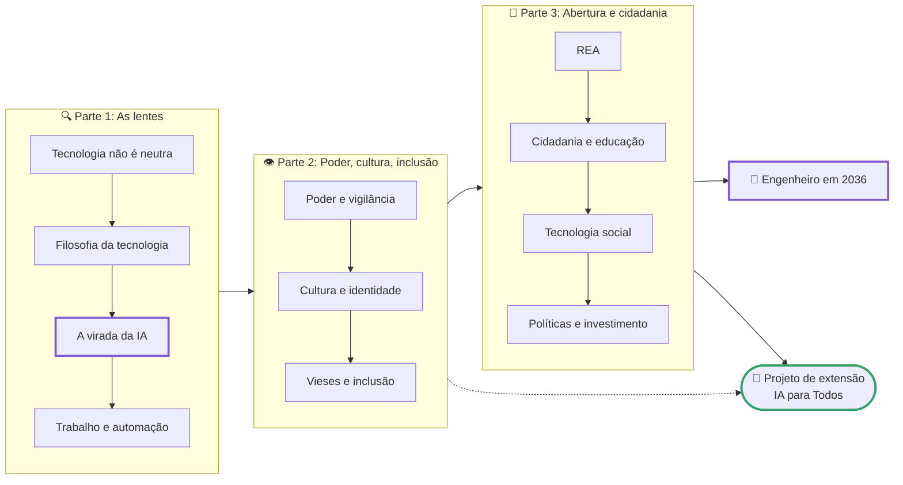

# Computação, Sociedade e Inclusão

> [!quote] A pergunta que organiza tudo
> *Em 2026, um terço dos brasileiros conectados já usa inteligência artificial generativa, e a maioria da classe DE só acessa a internet pelo celular. A mesma tecnologia que escreve o seu código decide quem consegue crédito, que notícia você vê e que emprego vai existir em 2036. Quem construiu isso? Para quem? E o que você, que vai construir a próxima geração, faz com essa responsabilidade?*

> [!abstract] 🧭 Sobre esta disciplina (7º período, 2026.2)
> **Computação, Sociedade e Inclusão** (CSECBJ.54) é a disciplina em que o engenheiro de computação para de olhar só para dentro da máquina e passa a olhar para o que a máquina faz com as pessoas. A ementa do curso tem oito unidades: **fundamentação crítica** (aspectos sociais, econômicos, culturais e políticos), **o computador na sociedade atual**, **relações de poder** (o público, o privado e o sujeito), **recursos educacionais abertos**, **cultura e identidade**, **cidadania e educação na sociedade digital**, **tecnologia social** e **relevância social e investimento em tecnologia**. Esta turma lê as oito a partir da maior transformação da nossa época: a **inteligência artificial**, o **futuro do trabalho** e o que vem depois, com uma **lente filosófica** que ajuda a pensar com clareza e sem hype.
>
> A carga horária é de 60 horas-aula: 20 de teoria, 20 de prática e **20 de extensão**. A proposta para as 20 horas de extensão é um projeto real com a comunidade de Bom Jesus do Itabapoana, o [[Projeto de Extensão - IA para Todos]]; o que vale no semestre é definido em aula.

---

## 🎯 Organização da disciplina

> [!tip] Links rápidos
> - [[Possíveis trabalhos e projetos de Computação, Sociedade e Inclusão|📝 Possíveis trabalhos e projetos]]: banco de trabalhos com roteiro e rubrica; o professor define em aula quais valem no semestre.
> - [[Projeto de Extensão - IA para Todos|🤝 Projeto de Extensão: IA para Todos]]: proposta de oficinas de letramento em IA e inclusão digital com a comunidade, com o material publicado como recurso educacional aberto.
> - [[Kit de ferramentas de Computação e Sociedade|🧰 Kit de ferramentas]]: métodos e ferramentas de todas as atividades (dados, autoinspeção, auditoria, campo, debate, escrita). Comece por aqui na primeira semana.
> - [[Materiais, leituras, filmes e podcasts de Computação e Sociedade|📚 Materiais, leituras, filmes e podcasts]]: a bibliografia do curso comentada e o que ler, ver e ouvir de graça.
> - [[Glossário de Computação, Sociedade e Inclusão|📖 Glossário]]: os termos da disciplina em uma linha, com o autor de cada conceito.
> - [[Comp Sociedade 7Eng 2026-2|🗒️ Log da turma]]: o que foi dado em cada aula.

---

## 📚 Conteúdo da disciplina

### Parte 1: As lentes (unidades 1 e 2 da ementa)

| Página | O que você vai ver |
|--------|--------------------|
| [[A tecnologia não é neutra - Computação e Sociedade]] | As quatro lentes da disciplina (social, econômica, cultural, política), o "teste de Winner" (que política este artefato carrega?), sistemas sociotécnicos e o retrato do computador na sociedade brasileira em 2026 |
| [[Filosofia da Tecnologia - as grandes perguntas da era da IA]] | Seis perguntas que organizam tudo (a técnica é neutra? o que a IA faz com a verdade? o que sobra para o humano? quem decide? que futuro queremos? o que é progresso?) com Heidegger, Ellul, Simondon, Arendt, Winner, Feenberg, Han, Yuk Hui, Vieira Pinto, Milton Santos, Freire e Krenak |
| [[A virada da IA - o que mudou no mundo desde 2022]] | Cronologia 2022-2026, adoção no mundo e no Brasil, a cadeia de valor da IA (dados, trabalho humano, chips, energia, água), soberania, regulação (AI Act, PL 2338, TSE, ECA Digital) e as narrativas em disputa |
| [[Automação, trabalho e o futuro das profissões]] | 200 anos de automação, o que os dados de 2025-2026 dizem sobre empregos e tarefas, quem ganha e quem perde, o trabalho por trás da IA, renda básica e semana de 4 dias, e as filosofias do trabalho e do ócio |

### Parte 2: Poder, inclusão e cultura (unidades 3 e 5 da ementa)

| Página | O que você vai ver |
|--------|--------------------|
| [[Poder, plataformas e vigilância - o público, o privado e o sujeito]] | Do panóptico à sociedade de controle e ao capitalismo de vigilância; plataformas como praça privada; reconhecimento facial, LGPD, ANPD e STF; e uma inspeção dos seus próprios dados |
| [[Cultura, identidade e tecnologias digitais]] | O que é cultura e como se estuda (etnografia, agora digital), universalismo e particularismo, identidade em Stuart Hall e Manuel Castells, cultura digital brasileira e a pergunta "de quem é a cultura dentro do modelo de IA?" |
| [[Vieses, discriminação algorítmica e inclusão]] | COMPAS, Gender Shades, racismo algorítmico, viés em modelos de linguagem e geradores de imagem, o que "justiça algorítmica" significa tecnicamente, auditoria com ferramenta na mão, acessibilidade e quem faz a tecnologia |

### Parte 3: Abertura, cidadania e tecnologia social (unidades 4, 6, 7 e 8 da ementa)

| Página | O que você vai ver |
|--------|--------------------|
| [[Recursos Educacionais Abertos]] | História, definição, os 5R, licenças Creative Commons, políticas públicas e projetos no Brasil, software livre e ciência aberta, modelos de IA abertos, e como produzir e publicar um REA |
| [[Cidadania e educação na sociedade digital]] | Inclusão digital no Brasil e sua crítica, presencial e a distância (a nova regulação da EaD), IA na educação, gov.br e PIX como cidadania, Lei de Acesso à Informação, participação e checagem |
| [[Tecnologia social e tecnologia convencional]] | O conceito de tecnologia social, cisternas e prêmio da Fundação Banco do Brasil, computação cívica, infraestrutura pública digital, tecnologia no Norte e no Sul global, e a IA como possível tecnologia social |
| [[Relevância social, investimento e políticas públicas de tecnologia]] | Quem paga a ciência e a tecnologia no Brasil (FNDCT, Lei do Bem, PBIA), Estado empreendedor versus solucionismo, os Institutos Federais e a extensão, como se mede impacto social e a ética profissional do engenheiro |

### Parte 4: Você em 2036

| Página | O que você vai ver |
|--------|--------------------|
| [[O engenheiro de computação em 2036 - trabalho, carreira e responsabilidade]] | O que a IA e os agentes mudam para quem programa e projeta sistemas, o mercado brasileiro em 2026, o que permanece humano, a responsabilidade de quem assina e três cenários para a sua carreira |

---

## 🗺️ Roadmap

---

## 🧠 As quatro lentes e o ângulo desta turma

> [!info] O método
> Toda tecnologia desta disciplina passa por **quatro lentes**, que são as da ementa: **social** (quem usa, quem fica de fora, que relações cria), **econômica** (quem paga, quem lucra, que trabalho gera e destrói), **cultural** (que valores e hábitos produz) e **política** (quem decide, que poder concentra, que lei regula). Você vai aplicar as quatro ao seu celular na primeira aula e ao mundo inteiro na última.

> [!tip] Por que a inteligência artificial é o fio condutor
> Porque é o caso-limite de tudo que a ementa pede: uma tecnologia que reorganiza o **trabalho** (do anotador de dados ao programador), concentra **poder** (chips, dados e modelos em poucas empresas e países), carrega **cultura** (a de quem escreveu os dados de treino), redefine **cidadania e educação** (tutores, deepfakes, serviços públicos) e disputa **investimento público** (o Plano Brasileiro de IA). Estudar computação e sociedade em 2026 sem falar de IA seria estudar o século errado.

> [!abstract] Por que filosofia numa disciplina de engenharia
> Porque quem projeta sistemas toma decisões filosóficas o tempo todo, com ou sem perceber: "o modelo entende", "o algoritmo é neutro", "isso é progresso". Uma aula inteira ([[Filosofia da Tecnologia - as grandes perguntas da era da IA]]) fornece as lentes; depois, toda página tem blocos **🧠 Lente filosófica** que mudam a forma de ver o caso concreto. Não é história da filosofia decorada: é filosofia aplicada, com argumento, evidência e o direito de discordar. As páginas de [[Tópicos/Filosofia da Mente e da Tecnologia/index|Filosofia da Mente e da Tecnologia]] deste site são a disciplina irmã.

> [!success] Mão na massa, mesmo em ciências humanas
> Nenhuma atividade desta disciplina se resolve escrevendo no caderno. Você vai auditar o seu próprio feed, extrair números do CETIC.br e do IBGE, editar a Wikipédia, pedir uma informação pública pela Lei de Acesso à Informação, entrevistar um profissional, fazer um diário de campo numa comunidade online, rodar uma auditoria de viés num Colab, testar três modelos de IA e tabular o que dizem, e dar uma oficina para pessoas de verdade. Debate e reflexão existem, mas em seções próprias, com posições contrastadas e fonte. Leia [[Minha metodologia de ensino]] e [[Regras e boas práticas]].

> [!warning] Instituição pública, ano eleitoral, tema político
> Esta disciplina trata de política pública, lei e poder, e 2026 é ano de eleição. As páginas descrevem o que as normas dizem, quem defende e quem critica, sempre com fonte, e param aí. Você decide com evidência. Nenhum conteúdo aqui endossa partido ou candidato.

---

## 🤝 O projeto de extensão

> [!example] IA para Todos
> Um terço da carga horária desta disciplina é **extensão**. A proposta desta turma: as equipes planejam, produzem e executam **oficinas de letramento em inteligência artificial e inclusão digital** para públicos reais de Bom Jesus do Itabapoana (pessoas idosas, alunos de escolas públicas, produtores rurais e comerciantes, a comunidade do campus), e publicam o material como **recurso educacional aberto** com licença Creative Commons. Tudo com evidência: lista de presença, avaliação dos participantes e material publicado. Detalhes, públicos, roteiro e rubrica em [[Projeto de Extensão - IA para Todos]]; o que vale, os públicos e as datas são definidos em aula.

---

## 📎 Veja também

- [[Tópicos/Filosofia da Mente e da Tecnologia/index|Filosofia da Mente e da Tecnologia]]: a disciplina irmã (máquinas pensam? o que a IA sabe? ética da IA).
- [[Tópicos/Roadmap do futuro/Inteligência artificial|Inteligência artificial (Roadmap do Futuro)]] e [[Introdução ao futuro]]: as ferramentas de IA na prática.
- [[Desenvolvimento de Software com IA]] e [[Vibe Coding e Engenharia Agêntica]]: o que a IA muda no trabalho de quem programa.
- [[Carreira e mercado de trabalho]] e [[Tendências do futuro]]: a visão de Empreendedorismo sobre o futuro do trabalho.
- [[Anonimato e privacidade]] e [[Engenharia social]]: a visão de Segurança da Informação sobre vigilância e manipulação.
