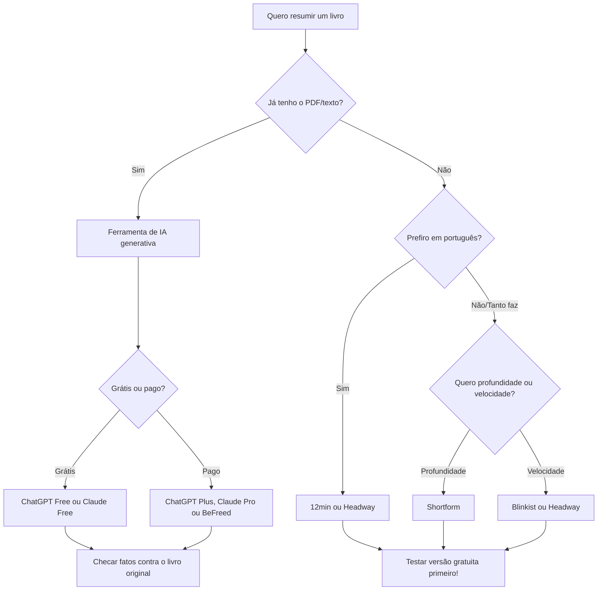

# Aplicativos e sites de resumo

> [!TIP] Sugestão
> Podcast sobre resumos de livros de empreendedorismo: [ResumoCast](https://www.resumocast.com.br/)

## 📖 Por que ler resumos?

Se alguém quer ter sucesso na vida, a forma mais garantida é ler. Nós temos que ler todos os dias quando estamos em uma rede social, navegando pela internet, lendo notícias, etc.

Porém os livros são o local onde o conhecimento está estruturado em uma ideia com início, meio e fim. Possui um sumário e foi estruturado com uma lógica.

### Duas formas de ler livros

Para mim existem duas formas de ler livros. **Ler o livro inteiro** e **ler seu resumo**. Ambas as formas são importantes.

- **Lendo o livro inteiro:** Você tem acesso ao conhecimento com profundidade e possui um certo tempo para refletir sobre o assunto.
- **Lendo o resumo:** Você tem uma boa noção do conteúdo e coloca na cabeça os pontos chaves daquele tema em poucos minutos.

### O poder dos resumos

Na maior parte das vezes, um bom resumo leva em média uns 10 minutos de leitura. Então se você tirar 10 minutos por dia de leitura de resumos, você terá os pontos chaves de conhecimento de **365 livros por ano**. Claro que nem todo dia você conseguirá ler um resumo e nem sempre vai lembrar de tudo, porém você entendeu a ideia :)

> [!TIP] Segredo
> Muitas pessoas por aí na Internet dizem que leem centenas de livros por ano, mas na verdade 99% delas só leem resumos :)

---

## 📱 Plataformas especializadas

Existem sites e aplicativos especializados em disponibilizar resumos de livros, com um bom processo de curadoria, ferramentas de busca, etc.

### Blinkist

![[Recursos/Empreendedorismo/Desafio de leitura/Aplicativos e sites de resumo/blinkist.png|Blinkist]]

> [!INFO] Aplicativo recomendado
> [Blinkist](http://blinkist.com)

**Vantagens:**
- Possui um dos melhores acervos do mercado com atualizações diárias de livros
- Interface excelente
- Ferramentas para salvar, destacar e anotar partes específicas
- Plano Pro (2025) inclui **Blinkist AI**: resume artigos, PDFs e podcasts enviados pelo usuário
- Sincroniza com Kindle e Evernote

**Desvantagens:**
- Somente em inglês e alemão
- Assinatura anual Premium: aproximadamente US$ 99/ano (em torno de R$ 500/ano em 2025)
- Porém é possível instalar e usar gratuitamente com algumas limitações

### Aplicativos em português e gratuitos

> [!TIP] Opção gratuita
> [12min - Mude sua vida!](https://12min.com/br/)

O **12min** é 100% em português e espanhol, com cada resumo pensado para ser lido (ou ouvido) em até 12 minutos. É uma das poucas plataformas com conteúdo nativo em português, o que facilita muito para iniciantes.

---

## 🆕 Novidades 2025-2026: o cenário atual

O mercado de resumos mudou bastante com a chegada de ferramentas de inteligência artificial. Hoje existem dois grandes grupos de soluções:

1. **Plataformas curadas por humanos** (Blinkist, Shortform, 12min): equipe editorial seleciona e escreve os resumos. Mais confiáveis, mas o acervo é limitado.
2. **Ferramentas de IA generativa** (ChatGPT, Claude, ChatPDF, Mapify): você envia o livro, capítulo ou PDF e a IA resume na hora. Acervo ilimitado, mas exige checagem dos fatos.

### Comparativo das principais ferramentas (2025-2026)

| Ferramenta | Idioma | Tipo | Plano gratuito | Preço pago (aprox.) | Destaque |
|---|---|---|---|---|---|
| [Blinkist](https://blinkist.com) | EN/DE | Curado | Sim (limitado) | ~R$ 500/ano | Maior acervo; Blinkist AI no Pro |
| [12min](https://12min.com/br) | PT/ES/EN | Curado | Sim | ~R$ 149/ano | Melhor opção em português |
| [Shortform](https://shortform.com) | EN | Curado | Sim (limitado) | ~US$ 197/ano | Resumos mais profundos; exercícios |
| [Headway](https://makeheadway.com) | PT/EN + outros | Curado | Sim (1/dia) | ~R$ 323/ano | Gamificado; streaks e quizzes |
| [getAbstract](https://getabstract.com) | EN/PT/DE/ES | Curado | Sim (5/mês) | ~US$ 299/ano | Foco em negócios e liderança |
| [BeFreed](https://befreed.ai) | EN | IA + curado | Sim (limitado) | ~US$ 99/ano | Gera podcast personalizado do livro |
| [ChatGPT](https://chat.openai.com) | Qualquer | IA generativa | Sim | ~US$ 20/mês (Plus) | Versatilidade; sobe PDF direto |
| [Claude](https://claude.ai) | Qualquer | IA generativa | Sim | ~US$ 20/mês (Pro) | Fidelidade ao texto; 200k tokens |
| [ChatPDF](https://chatpdf.com) | Qualquer | IA generativa | Sim (3/dia, 50p) | ~US$ 5/mês | Perguntas sobre o PDF enviado |
| [Mapify](https://mapify.so/pt) | Qualquer | IA generativa | Sim | ~US$ 9/mês | Gera mapa mental do resumo |

> [!WARNING] Atenção ao usar IA para resumos
> Ferramentas de IA generativa (ChatGPT, Claude, etc.) podem cometer **alucinações**, ou seja, inventar informações com tom de certeza. Sempre cruze os dados gerados com o livro original ou outras fontes confiáveis.

---

## 🗺️ Como escolher a ferramenta certa?

---

## 🧪 Atividades práticas

> [!example] 🧪 Atividade 1: Primeiro resumo com IA em 5 minutos
> **Ferramenta:** [ChatGPT](https://chat.openai.com) (gratuito) ou [Claude](https://claude.ai) (gratuito)
>
> **Passo a passo:**
> 1. Acesse um dos dois sites (sem precisar pagar).
> 2. Cole o seguinte prompt na caixa de texto:
>    > *"Resuma os 5 principais ensinamentos do livro 'A Startup Enxuta' de Eric Ries em forma de bullet points. Para cada ensinamento, dê um exemplo prático de aplicação num pequeno negócio."*
> 3. Leia o resultado gerado.
> 4. Abra qualquer site de resenhas (Goodreads, Amazon) e verifique se pelo menos 3 dos pontos citados correspondem ao que outros leitores destacam.
>
> **Resultado observável:** Você terá em mãos um resumo acionável em menos de 5 minutos E saberá identificar se a IA "alucionou" alguma informação.

> [!example] 🧪 Atividade 2: Comparação lado a lado de duas plataformas
> **Ferramentas:** [12min](https://12min.com/br) (gratuito, em português) + [Headway](https://makeheadway.com) (gratuito, 1 resumo/dia)
>
> **Passo a passo:**
> 1. Instale os dois aplicativos no celular (ambos têm versão gratuita).
> 2. Em cada um, busque o mesmo livro de empreendedorismo (sugestão: *"Pai Rico, Pai Pobre"* ou *"O Jeito Amazon de Fazer"*).
> 3. Leia o resumo nos dois apps e preencha uma tabela pessoal com: profundidade do conteúdo (1-5), clareza do texto (1-5), qualidade do áudio (1-5), facilidade de uso (1-5).
> 4. Traga a tabela preenchida para discutir com a turma.
>
> **Resultado observável:** Você terá uma opinião fundamentada sobre qual plataforma se encaixa melhor no seu estilo de aprendizagem, baseada em experiência real, não em propaganda.

> [!example] 🧪 Atividade 3: Checagem de fidelidade do resumo por IA
> **Ferramentas:** [ChatPDF](https://chatpdf.com) (gratuito, até 3 PDFs/dia) + PDF de um capítulo de livro de domínio público
>
> **Passo a passo:**
> 1. Baixe um capítulo gratuito de um livro de empreendedorismo (ex: capítulos de amostra disponíveis na Amazon ou Google Books).
> 2. Suba o PDF no ChatPDF e peça: *"Quais são os 3 argumentos centrais deste capítulo? Cite a página de cada um."*
> 3. Abra o PDF original e confira se as citações de página estão corretas.
> 4. Registre: quantas estavam corretas? Quantas eram imprecisas ou inventadas?
>
> **Resultado observável:** Você vai descobrir, na prática, o que é uma "alucinação de IA" e por que checar a fonte original ainda é indispensável, mesmo com as melhores ferramentas de 2026.

---

## 🏆 Desafio de leitura

![[Recursos/Empreendedorismo/Desafio de leitura/Aplicativos e sites de resumo/image.png|Desafio de leitura]]

![[Recursos/Empreendedorismo/Desafio de leitura/Aplicativos e sites de resumo/image-1.png|Desafio de leitura]]

---

> [!note] 📚 Fontes (2026)
> - [Os 10 melhores apps de resumo de livros (Shortform Hub)](https://www.shortform.com/blog/hub/product/best-book-summary-apps/)
> - [As 8 melhores alternativas ao Blinkist em 2026 (Shortform Hub)](https://www.shortform.com/blog/hub/product/blinkist-alternatives/)
> - [Shortform vs. Headway vs. Blinkist: qual é o melhor em 2026?](https://www.littlealmanack.com/p/shortform-vs-headway-vs-blinkist)
> - [Melhores apps de resumo 2025: Blinkist vs Headway (2smart2read)](https://www.2smart2read.com/best-book-summary-apps-websites/)
> - [Custo do Headway App (makeheadway.com)](https://makeheadway.com/pt/blog/headway-app-e-pago/)
> - [Melhores IAs para resumo de livros e artigos (Na Prática)](https://napratica.org.br/noticias/as-melhores-ias-para-resumos)
> - [As 10 melhores ferramentas de IA para resumir textos em 2026 (Mapify)](https://mapify.so/pt/blog/top-ai-text-summarizer)
> - [Melhor IA para resumir PDFs e artigos em 2026 (TechTudo)](https://www.techtudo.com.br/guia/2026/03/melhor-ia-para-resumir-pdfs-e-artigos-em-2026-testamos-7-ferramentas-edsoftwares.ghtml)
> - [Como usar o ChatGPT para resumo de livros (Na Prática)](https://napratica.org.br/noticias/como-usar-o-chatgpt-para-fazer-resumo-de-livros-e-aumentar-sua-produtividade-nos-estudos)
> - [Blinkist Review: vale a pena em 2026? (BeFreed)](https://www.befreed.ai/blog/blinkist-review)
