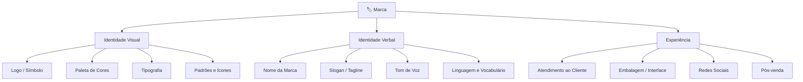
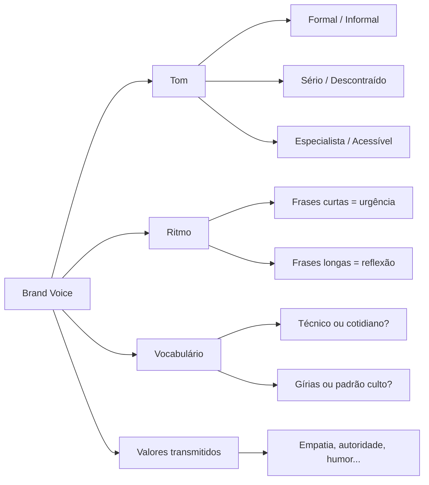
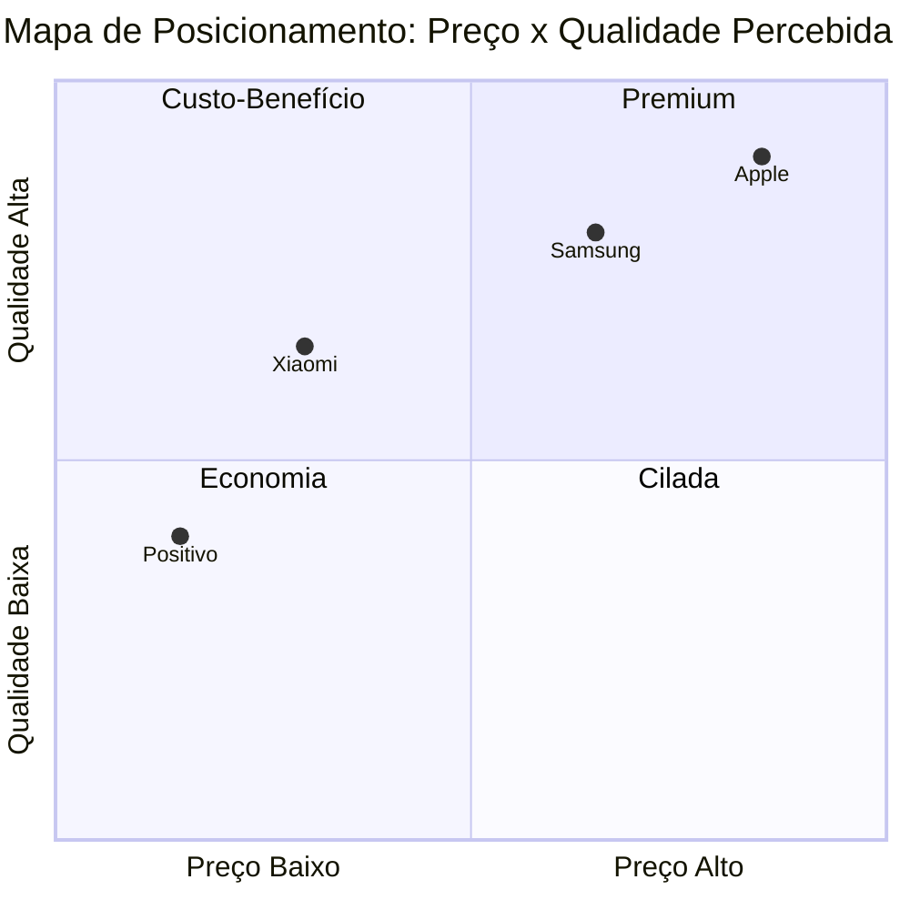

# Branding

> [!info] O que é Branding
> Branding é o processo de construção e gestão de uma marca. Enquanto a **marca** é o ativo (percepções e reputação), o **branding** são as ações deliberadas para construí-la.

---

## 🧱 Conceitos Fundamentais

![[Recursos/Empreendedorismo/Branding/pilares-branding.svg|Os pilares do Branding]]

### Identidade da Marca
- **Valores, missão e propósito** que definem a essência da marca
- **Elementos visuais**: logo, cores, tipografia, design
- **Personalidade e voz**: como a marca se comunica

### Proposta de Valor
Benefícios únicos (funcionais, emocionais ou simbólicos) que a marca promete entregar. Responde: "Por que escolher esta marca?"

### Posicionamento
Estratégia de ocupar um espaço único na mente do consumidor em relação aos concorrentes. Define como a marca é percebida.

### Diferenciação
Capacidade de ser percebida como diferente, com vantagens competitivas significativas. Pode ser pelo produto, serviço, experiência, valores ou design.

### Brand Equity (Valor de Marca)
Valor extra que o nome da marca adiciona além dos atributos físicos. Resulta de reconhecimento, associações positivas e lealdade.

---

## 📐 Princípios Importantes

- **Consistência**: manter identidade visual, voz e valores alinhados em todos os pontos de contato
- **Experiência do cliente**: todas as interações reforçam ou diminuem a proposta de valor
- **Conhecimento do público**: entender quem é o cliente, o que valoriza e seus desejos

---

## 🎨 Identidade Visual: os Elementos que Formam uma Marca

A identidade visual é o conjunto de elementos gráficos e verbais que tornam uma marca reconhecível. Não se trata apenas de um logo bonito: cada elemento comunica algo sobre os valores e a personalidade da empresa.

> [!tip] Por que isso importa?
> Estudos de mercado mostram que uma apresentação de marca consistente pode aumentar a receita em até **23%**. Quanto mais coerentes forem os elementos visuais e verbais, mais memorável e confiável a marca se torna.

---

## 🎨 Psicologia das Cores no Branding

A escolha da paleta de cores não é estética: é estratégica. As cores ativam emoções e associações inconscientes nos consumidores.

| Cor | Emoções/Associações | Exemplos de Marcas |
|-----|--------------------|--------------------|
| 🔴 Vermelho | Urgência, energia, paixão, apetite | Coca-Cola, Netflix, iFood |
| 🔵 Azul | Confiança, segurança, tecnologia, calma | Samsung, LinkedIn, Bradesco |
| 🟡 Amarelo | Otimismo, atenção, criatividade, alegria | McDonald's, Ikea, Correios |
| 🟢 Verde | Natureza, saúde, sustentabilidade, equilíbrio | Natura, Whatsapp, Starbucks |
| 🟠 Laranja | Entusiasmo, acessibilidade, calor humano | Amazon, Fanta, Duolingo |
| 🟣 Roxo | Luxo, criatividade, espiritualidade, mistério | Cadbury, Hallmark, Twitch |
| ⚫ Preto | Elegância, sofisticação, poder, exclusividade | Apple, Nike, Chanel |
| ⚪ Branco | Simplicidade, pureza, minimalismo, clareza | Apple (fundo), Dove |

> [!warning] Cuidado com contextos culturais
> As associações de cor variam por cultura. O branco representa luto em alguns países asiáticos; o vermelho simboliza boa sorte na China. Ao construir uma marca com alcance internacional, pesquise as conotações locais.

---

## ✍️ Tipografia e Personalidade

A fonte escolhida comunica antes mesmo que o texto seja lido. Há quatro grandes famílias tipográficas, cada uma com personalidade distinta:

| Família | Característica | Personalidade | Uso Típico |
|---------|---------------|---------------|------------|
| Serif (ex.: Times, Georgia) | Pequenos traços nas extremidades | Tradição, autoridade, jornalismo | Jornais, escritórios de advocacia, luxo clássico |
| Sans-Serif (ex.: Arial, Helvetica) | Sem traços, linhas limpas | Modernidade, acessibilidade, tecnologia | Startups, apps, empresas tech |
| Script (ex.: Pacifico, Lobster) | Imita escrita cursiva | Elegância, criatividade, informalidade | Marcas de moda, confeitarias, produtos artesanais |
| Display (ex.: Impact, Bebas) | Alta expressividade, impacto visual | Força, ousadia, jovialidade | Logotipos, capas, marcas esportivas |

> [!tip] Regra prática
> Use no máximo **duas fontes** em uma identidade visual: uma para títulos (display/serif) e uma para corpo de texto (sans-serif). Mais do que isso gera ruído visual e confunde o leitor.

---

## 🗣️ Brand Voice: a Voz da Marca

Brand Voice é o conjunto de características verbais que definem **como** a marca se comunica, não apenas **o que** ela diz. É a personalidade da marca traduzida em palavras.

### Exemplos de Brand Voice em ação

| Marca | Como se comunica | Exemplo de frase |
|-------|-----------------|-----------------|
| Nubank | Direto, descontraído, empático | "A gente odeia burocracia tanto quanto você." |
| Magazine Luiza | Próximo, popular, acolhedor | "Bora junto, Magalu!" |
| Apple | Minimalista, sofisticado, inspirador | "Think different." |
| Natura | Sensorial, sustentável, afetivo | "Bem estar bem." |

> [!note] Consistência verbal importa tanto quanto visual
> Uma marca pode ter um logo impecável e uma paleta linda, mas se o texto do Instagram soa de um jeito e o do site soa de outro, o consumidor sente incoerência, mesmo sem saber nomear o problema.

---

## 📍 Posicionamento de Marca: Ocupar um Espaço na Mente do Consumidor

Posicionamento não é o que você faz com o produto. É o que você faz com a **mente do consumidor** (Al Ries e Jack Trout, *Positioning*, 1981, clássico ainda referenciado em 2026).

### Tipos de Posicionamento

| Tipo | Descrição | Exemplo |
|------|-----------|---------|
| Por atributo | Destaca uma característica específica do produto | Volvo = segurança |
| Por benefício | Foca no resultado que o cliente obtém | Sensodyne = menos dor no dente sensível |
| Por usuário | Define quem é o público da marca | Dove = mulheres reais, não modelos |
| Por concorrente | Se posiciona em contraste com rival | Pepsi = "a escolha de uma nova geração" |
| Por preço/valor | Premium ou acessível como diferencial | Casas Bahia = preço baixo para todos |
| Por propósito | Causa ou missão como diferencial | Patagonia = preservação ambiental |

### Mapa de Posicionamento

O mapa de posicionamento é uma ferramenta visual para comparar marcas em dois eixos relevantes para o mercado (exemplo: preço x qualidade percebida).

> [!tip] Como usar o mapa de posicionamento
> Escolha dois eixos relevantes para o seu setor. Marque onde os concorrentes estão. Identifique espaços vazios: esses são oportunidades de posicionamento diferenciado para a sua marca.

---

## 🌐 Tendências de Branding para 2026

O mercado de branding está em rápida evolução. Conhecer as tendências ajuda empreendedores a construir marcas preparadas para o futuro.

> [!abstract] Tendências mapeadas em 2025-2026
>
> - **Humanização e Brand Voice conversacional**: marcas abandonam textos engessados e adotam vozes acessíveis, emocionalmente inteligentes e consistentes entre plataformas.
> - **IA como ferramenta de branding**: IA acelera naming, prototipação de identidade visual, criação de guias de marca e simulação de campanhas. Ferramentas como Looka e Adobe Firefly democratizam o acesso.
> - **Posicionamento por propósito**: identidade visual sozinha não sustenta crescimento. O mercado exige propósito claro, diferenciação consistente e valores autênticos.
> - **Minimalismo estratégico**: logos simples, identidades visuais respiraveis e design sensorial (texturas, microinterações, animações fluidas).
> - **Comunidades como pilar de marca**: em 2026, comunidades engajadas ao redor de uma marca valem mais do que campanhas de alcance massivo.
> - **Branding sensorial**: design deixa de ser só visual. Sons, animações, ritmo de navegação e microinterações expressam personalidade de marca.

---

## 🛠️ Ferramentas para Criar sua Identidade de Marca

| Ferramenta | Para que serve | Custo | Link |
|-----------|---------------|-------|------|
| **Canva** | Criar logo, posts, apresentações, materiais gráficos | Gratuito / Pro R\$ 35/mês | canva.com |
| **Looka** | Gerar logo com IA + kit completo de marca (cartão, redes, mockups) | Pago por projeto | looka.com |
| **Coolors** | Criar e explorar paletas de cores com códigos HEX/RGB | Gratuito | coolors.co |
| **Adobe Color** | Gerador de paletas com teoria das cores | Gratuito | color.adobe.com |
| **Google Fonts** | Explorar e baixar fontes gratuitas para uso comercial | Gratuito | fonts.google.com |
| **Brandmark** | Gerar logos com IA a partir de palavras-chave | Pago por projeto | brandmark.io |
| **Namechk** | Verificar se nome/usuário está disponível nas redes sociais | Gratuito | namechk.com |

> [!tip] Sequência recomendada para empreendedores iniciantes
> 1. Defina nome, propósito e público-alvo (antes de qualquer ferramenta).
> 2. Escolha paleta de cores no **Coolors** com base na emoção que quer transmitir.
> 3. Escolha tipografia no **Google Fonts** (uma para títulos, uma para texto).
> 4. Crie o logo no **Canva** (versão gratuita já resolve para MVP) ou no **Looka** (se quiser resultado mais profissional rapidamente).
> 5. Verifique disponibilidade do nome nas redes no **Namechk**.
> 6. Crie um documento simples de guia de marca: logo + cores (HEX) + fontes + tom de voz.

---

## 🔬 Atividades Práticas

> [!example] 🧪 Atividade 1: Criar uma Identidade de Marca do Zero
>
> **Cenário:** Você vai abrir um pequeno negócio local (escolha: cafeteria, barbearia, pet shop, loja de roupas, escola de idiomas).
>
> **Ferramenta:** Canva (canva.com) ou Looka (looka.com)
>
> **Passos:**
> 1. Acesse o Canva ou o Looka.
> 2. No Canva: use o criador de logos (menu "Criar um design" > "Logo"). No Looka: informe o nome do negócio e as preferências de estilo.
> 3. Escolha cores que reflitam a personalidade do negócio (use a tabela de psicologia das cores desta aula como referência).
> 4. Escolha uma fonte para o nome da marca e uma para slogan/subtítulo.
> 5. Gere pelo menos três variações do logo (versão colorida, versão em preto e branco, versão compacta para ícone de app).
>
> **Resultado observável:** Ao final, você terá um arquivo com três versões do logo, a paleta de cores com os códigos HEX e o nome das fontes escolhidas. Apresente para a turma explicando **por que** cada escolha visual comunica a essência do negócio.

> [!example] 🧪 Atividade 2: Construir uma Paleta de Cores e Justificar
>
> **Ferramenta:** Coolors (coolors.co)
>
> **Passos:**
> 1. Acesse o coolors.co.
> 2. Escolha uma cor base que represente o negócio que você criou na Atividade 1 (ou escolha um novo negócio hipotético).
> 3. Gere uma paleta harmônica com 4 a 5 cores usando o botão "Generate" ou travando a cor base e gerando as demais.
> 4. Explore as opções de harmonia (análoga, complementar, triádica) usando o botão "Adjust" > "Color Harmony".
> 5. Anote os códigos HEX de cada cor.
> 6. Para cada cor, escreva uma frase explicando qual emoção ou associação ela traz para a marca.
>
> **Resultado observável:** Uma paleta de 4 a 5 cores com os códigos HEX e uma justificativa escrita de uma frase para cada cor, conectando a escolha à estratégia de posicionamento do negócio.

> [!example] 🧪 Atividade 3: Auditoria de Identidade de Marca Real
>
> **Ferramenta:** Navegador web + Instagram da marca escolhida
>
> **Passos:**
> 1. Escolha uma marca que você conhece e admira (pode ser local, nacional ou global).
> 2. Acesse o site oficial e o perfil do Instagram da marca.
> 3. Preencha a tabela de análise a seguir:
>
> | Elemento | O que você encontrou | Impressão/Emoção transmitida |
> |----------|---------------------|------------------------------|
> | Cores principais | | |
> | Tipografia (fonte principal) | | |
> | Tom de voz nos posts | | |
> | Slogan ou frase recorrente | | |
> | Tipo de imagens usadas | | |
> | Consistência entre site e Instagram | | |
>
> 4. Responda: essa marca tem uma identidade coerente? O visual e o texto comunicam a mesma personalidade? O que você mudaria?
>
> **Resultado observável:** Uma tabela preenchida com análise real de uma marca + um parágrafo de conclusão com pelo menos um ponto forte e um ponto de melhoria identificados.

---

## 🔖 Guia de Marca (Brand Guide): o Documento que Unifica Tudo

Um Guia de Marca (ou Manual de Marca) é o documento que registra todas as decisões de identidade visual e verbal de uma empresa. Serve para garantir consistência, mesmo quando diferentes pessoas criam materiais para a marca.

**Componentes mínimos de um guia de marca para pequenas empresas:**

1. **Missão, visão e valores** da empresa (quem somos, onde queremos chegar, no que acreditamos)
2. **Logo**: versões permitidas, espaçamento mínimo, fundos em que pode ser usado e usos proibidos
3. **Paleta de cores**: cores primárias, secundárias e neutras com os códigos HEX, RGB e CMYK
4. **Tipografia**: nome das fontes, peso (bold/regular/light), tamanhos recomendados para títulos e corpo
5. **Tom de voz**: três a cinco adjetivos que descrevem como a marca fala + exemplos de frases corretas e incorretas
6. **Exemplos de aplicação**: como a marca aparece em cartão de visita, post de Instagram, assinatura de email

> [!warning] Sem guia de marca, a identidade se perde
> Sem um guia registrado, cada post nas redes sociais pode usar uma cor diferente, cada colaborador pode escrever com um tom diferente, e a marca perde consistência. O resultado: o consumidor não reconhece a marca e não cria vínculo.

---

> [!note] 📚 Fontes (2026)
>
> - [Tendências de branding para 2026: como as marcas vão se posicionar na nova era da atenção](https://bayerlstudio.com.br/tendencias-de-branding-que-devem-ganhar-forca-no-comeco-de-2026-como-as-marcas-vao-se-posicionar-na-nova-era-da-atencao/) (Bayerl Studio, 2026)
> - [Branding Digital na Era da IA: Como Construir Marcas Autênticas em 2026](https://agenciakaizen.com.br/branding-digital-ia-marcas-autenticas-2026/) (Agência Kaizen, 2026)
> - [Tendência para 2026: posicionamento de marca](https://mundodomarketing.com.br/tendencia-para-2026-posicionamento-de-marca) (Mundo do Marketing, 2026)
> - [Identidade Visual: O Que é & Como Criar Uma (Guia 2026)](https://www.designdemarca.pt/identidade-visual/) (Demarca Design, 2026)
> - [Complete Brand Identity System Guide 2025](https://spellbrand.com/blog/brand-identity-system) (Spellbrand, 2025)
> - [Brand Identity Guidelines 2025 Guide and Best Practices](https://tunemywebsite.com/brand-identity-guidelines) (TuneMyWebsite, 2025)
> - [Branding para Pequenas Empresas: Por Onde Começar](https://babitonhela.com/blog/branding-pequenas-empresas-comecar/) (Babi Tonhela, 2025)
> - [Como criar identidade visual completa com IA: logo, cores e tipografia](https://www.techenet.com/2026/04/como-criar-identidade-visual-completa-com-ia-logo-cores-e-tipografia/) (Techenet, 2026)
> - Al Ries e Jack Trout, *Positioning: The Battle for Your Mind* (1981), referência clássica ainda amplamente citada em literatura de marketing 2025-2026.
