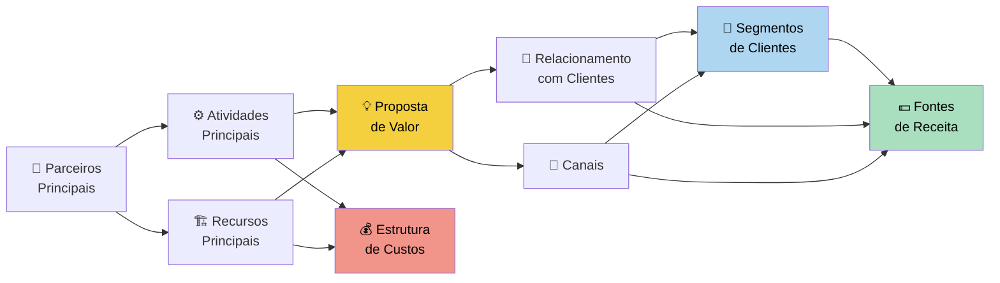

# Business Model Canvas

> [!INFO] Definição
> É ferramenta para esboçar ideias ou modelo de negócios. É um mapa visual pré-formatado contendo **nove blocos** simples de entender.

## 🗂️ Os nove blocos

![[Recursos/Empreendedorismo/Business Model Canvas/canvas-blocos.svg|Visualização dos 9 blocos do Business Model Canvas]]

O Business Model Canvas é dividido em nove blocos fundamentais que cobrem todos os aspectos de um modelo de negócio:

1. **Segmentos de clientes** - Para quem você está criando valor?
2. **Proposta de valor** - Que problema você resolve? Que valor você entrega?
3. **Canais** - Como você alcança seus clientes?
4. **Relacionamento com clientes** - Que tipo de relacionamento você estabelece?
5. **Fontes de receita** - Como você ganha dinheiro?
6. **Recursos principais** - Que recursos são necessários?
7. **Atividades principais** - Que atividades são essenciais?
8. **Parceiros principais** - Quem são seus parceiros e fornecedores?
9. **Estrutura de custos** - Quais são os principais custos?

---

## 🧩 Estrutura lógica do canvas

O canvas não é uma lista aleatória: ele tem uma lógica espacial. O lado **direito** foca em **criação de valor** (o que importa para o cliente), e o lado **esquerdo** foca em **eficiência operacional** (como a empresa se organiza para entregar esse valor). A **Proposta de Valor** fica no centro, conectando os dois lados.

> [!tip] Leitura do diagrama
> Comece pela **Proposta de Valor** (centro, amarelo). Pergunte: quem se beneficia? (azul, direita). Como chega até eles? (azul). Como a empresa se organiza para entregar? (blocos da esquerda). Quanto custa e quanto gera? (vermelho e verde).

---

## 📋 Tabela dos 9 blocos

| # | Bloco | Pergunta-chave | Exemplos práticos |
|---|-------|---------------|-------------------|
| 1 | **Segmentos de clientes** | Para quem criamos valor? | Consumidores finais, empresas B2B, nichos específicos |
| 2 | **Proposta de valor** | Que dor resolvemos? Que ganho entregamos? | Conveniência, preço, qualidade, novidade, status |
| 3 | **Canais** | Como o cliente nos encontra e recebe o produto? | App, site, loja física, parceiros, redes sociais |
| 4 | **Relacionamento com clientes** | Como interagimos e fidelizamos? | Suporte 24h, autoatendimento, comunidade, programa de pontos |
| 5 | **Fontes de receita** | Como e quanto o cliente paga? | Venda única, assinatura, comissão, licença, freemium |
| 6 | **Recursos principais** | Que ativos são indispensáveis? | Tecnologia, marca, equipe, patentes, capital |
| 7 | **Atividades principais** | O que precisamos fazer todos os dias? | Desenvolvimento, logística, marketing, suporte |
| 8 | **Parceiros principais** | De quem dependemos? | Fornecedores, distribuidores, joint ventures |
| 9 | **Estrutura de custos** | Quais são os maiores gastos? | Pessoal, infraestrutura, marketing, produção |

---

## 🌍 Exemplos reais: engenharia reversa

Entender o canvas de empresas de sucesso ajuda a internalizar como cada bloco funciona na prática.

### iFood

> [!example] Canvas do iFood (simplificado)
> | Bloco | Conteúdo |
> |-------|----------|
> | Segmentos | Consumidores com fome + restaurantes parceiros (plataforma bilateral) |
> | Proposta de valor | Pedido fácil em minutos, variedade, rastreamento em tempo real |
> | Canais | App mobile (iOS e Android), site |
> | Relacionamento | Avaliações, cupons, iFood Club (fidelidade) |
> | Fontes de receita | Comissão por pedido (~12-30%) + anúncios de restaurantes (destaque) |
> | Recursos | Plataforma tecnológica, dados de usuários, base de restaurantes |
> | Atividades | Manutenção da plataforma, aquisição de restaurantes, logística de entregadores |
> | Parceiros | Restaurantes, entregadores autônomos, operadoras de pagamento |
> | Custos | Infraestrutura de TI, marketing, suporte, incentivos a entregadores |

### Netflix

> [!example] Canvas da Netflix (simplificado)
> | Bloco | Conteúdo |
> |-------|----------|
> | Segmentos | Mais de 2.000 microsegmentos de preferência identificados por IA |
> | Proposta de valor | Streaming ilimitado sem anúncios, conteúdo original exclusivo (Netflix Originals) |
> | Canais | App, Smart TV, console, navegador web |
> | Relacionamento | Recomendação personalizada por algoritmo, autoatendimento |
> | Fontes de receita | Assinatura mensal (planos Basic, Standard, Premium e com anúncios) |
> | Recursos | Biblioteca de conteúdo, algoritmo de recomendação, data centers globais |
> | Atividades | Produção de conteúdo original, licenciamento, desenvolvimento da plataforma |
> | Parceiros | Estúdios, distribuidores de internet, fabricantes de TV |
> | Custos | Produção de conteúdo (maior custo), tecnologia, marketing |

### Uber

> [!example] Canvas do Uber (simplificado)
> | Bloco | Conteúdo |
> |-------|----------|
> | Segmentos | Passageiros urbanos + motoristas parceiros (plataforma bilateral) |
> | Proposta de valor | Para passageiros: transporte rápido e previsível. Para motoristas: renda flexível |
> | Canais | App mobile, integração com mapas (Google Maps, Waze) |
> | Relacionamento | Avaliações mútuas (4 estrelas+), suporte in-app |
> | Fontes de receita | Comissão de 25% sobre corridas + Uber Eats (15-30%) |
> | Recursos | Algoritmo de matching, dados de geolocalização, marca global |
> | Atividades | Matching motorista-passageiro, processamento de pagamento, gestão de qualidade |
> | Parceiros | Motoristas autônomos, seguradoras, operadoras de pagamento |
> | Custos | Desenvolvimento da plataforma, marketing, incentivos a motoristas, suporte jurídico |

> [!warning] Ponto de atenção
> iFood e Uber são **plataformas bilaterais** (conectam dois grupos distintos). Isso gera um canvas com **duas propostas de valor** e **duas perspectivas de segmento**. Esse padrão é diferente de empresas que vendem diretamente ao consumidor final.

---

## 🔍 Detalhamento dos blocos mais críticos

### Proposta de Valor (bloco central)

A proposta de valor é o coração do canvas. Ela descreve o **pacote de benefícios** que a empresa oferece para satisfazer as necessidades de um segmento específico. Pode ser:

- **Novidade**: algo que não existia antes (ex.: Nubank criando banco 100% digital no Brasil)
- **Desempenho**: melhorar algo que já existe (ex.: SSD mais rápido que HD)
- **Personalização**: adaptar ao cliente (ex.: recomendações da Netflix)
- **Conveniência**: facilitar a vida (ex.: iFood, Uber)
- **Preço**: oferecer o mesmo por menos (ex.: marcas próprias de supermercado)
- **Status/Marca**: vender identidade (ex.: Apple, Nike)

### Segmentos de clientes: três tipos principais

| Tipo | Descrição | Exemplo |
|------|-----------|---------|
| Mercado de massa | Proposta única para grande grupo homogêneo | TV aberta, sabão em pó |
| Nicho | Grupo específico com necessidades únicas | Equipamentos de escalada |
| Plataforma bilateral | Serve dois grupos interdependentes | iFood (restaurantes + consumidores) |

### Fontes de receita: principais modelos

| Modelo | Como funciona | Exemplo |
|--------|--------------|---------|
| Venda | Transferência de propriedade | Loja de eletrônicos |
| Assinatura | Acesso contínuo por taxa recorrente | Netflix, Spotify |
| Freemium | Básico grátis, premium pago | Canva, LinkedIn |
| Comissão | Taxa sobre transações intermediadas | iFood, Uber, Mercado Livre |
| Licença | Direito de uso de propriedade intelectual | Software empresarial |
| Publicidade | Acesso ao público em troca de anúncios | Google, Instagram |

---

## 🧪 Atividades práticas

> [!example] 🧪 Atividade 1: Preencha o canvas da sua ideia no Canvanizer
> **Ferramenta:** [canvanizer.com/new/business-model-canvas](https://canvanizer.com/new/business-model-canvas) (gratuito, sem cadastro)
>
> **Passo a passo:**
> 1. Acesse o link e crie um canvas em branco
> 2. Comece pelo bloco **Segmentos de Clientes**: escreva quem compraria sua ideia e por quê
> 3. Preencha a **Proposta de Valor**: que problema real você resolve para essa pessoa?
> 4. Preencha os demais 7 blocos com pelo menos 1 post-it cada
> 5. Exporte em PDF ou tire print e traga para a próxima aula
>
> **Resultado observável:** um canvas preenchido com sua ideia de negócio, onde cada bloco tem pelo menos uma resposta concreta (não "depende" ou "varia").
>
> **Dica:** se travar em algum bloco, pule e volte no final. O canvas é iterativo, não linear.

---

> [!example] 🧪 Atividade 2: Engenharia reversa do canvas de uma empresa conhecida
> **Ferramenta:** papel quadriculado ou template em PDF do [Strategyzer](https://www.strategyzer.com/library/the-business-model-canvas)
>
> **Passo a passo:**
> 1. Escolha uma das empresas: **Spotify, Airbnb, Magazine Luiza ou Nubank**
> 2. Pesquise como essa empresa funciona (site oficial, notícias recentes)
> 3. Preencha os 9 blocos do canvas para essa empresa com base no que você descobriu
> 4. Identifique: qual é a **maior fonte de receita** dela? Qual bloco parece ser o mais estratégico?
> 5. Compare seu resultado com o de um colega que escolheu a mesma empresa
>
> **Resultado observável:** um canvas preenchido onde você consegue explicar em voz alta, para qualquer colega, como aquela empresa ganha dinheiro e por que clientes a escolhem.

---

> [!example] 🧪 Atividade 3: Aprofunde a Proposta de Valor com o método "Dores e Ganhos"
> **Ferramenta:** papel A4 dobrado ao meio (ou planilha)
>
> **Passo a passo:**
> 1. Escolha um produto ou serviço real (pode ser o da Atividade 1 ou outro)
> 2. Crie duas colunas: **Dores do cliente** (o que frustra, cansa, custa caro, demora) e **Ganhos desejados** (o que facilita, encanta, economiza tempo ou dinheiro)
> 3. Preencha cada coluna com pelo menos 3 itens baseados em entrevistas informais (pergunte a um familiar ou amigo)
> 4. Reescreva a Proposta de Valor do bloco 2 do canvas usando linguagem do cliente: "Nós ajudamos [segmento] a [ganho] eliminando [dor]"
>
> **Resultado observável:** uma frase de proposta de valor que qualquer pessoa fora da sala entende sem precisar de explicação técnica. Teste: leia para alguém que não está na aula e veja se ela entende o que o negócio faz.

---

## 💡 Dicas de uso em sala e na prática

> [!tip] Como usar o canvas de forma eficaz
> - **Use post-its físicos** (ou digitais no Canvanizer): eles permitem mover e testar hipóteses facilmente
> - **Uma ideia por post-it**: não escreva parágrafos; seja direto e específico
> - **Comece pelo cliente**, não pelo produto: preencher Segmentos e Proposta de Valor primeiro ajuda a validar se a ideia faz sentido antes de pensar em custos
> - **Revise com frequência**: o canvas é vivo; negócios mudam, e o canvas deve refletir isso
> - **Hipóteses, não certezas**: no início, cada bloco é uma hipótese a validar com dados reais

> [!warning] Armadilhas comuns
> - Confundir **atividades** (o que a empresa faz) com **recursos** (o que a empresa tem)
> - Listar receita teórica em vez de receita real e testada
> - Ignorar o lado esquerdo (eficiência) e focar só no cliente: um negócio viável precisa dos dois lados equilibrados
> - Copiar o canvas de um concorrente sem adaptar ao próprio contexto

---

## 🔗 Recursos

- [O que é o Business Model Canvas - O Analista de Modelos de Negócios](https://analistamodelosdenegocios.com.br/o-que-e-o-business-model-canvas/)
- [Canvas template](https://docs.google.com/drawings/d/1AXRXIMj6FwoV3pRztI8us48VvcRRFk0CBGYdCSnjWyM/edit)
- [Canvas canal](https://docs.google.com/drawings/d/1VLuWHZxR-tRJUp0BvAclhGa4yHRQbGWjkwQg6tL7wWU/edit)
- [Canvanizer (ferramenta gratuita online)](https://canvanizer.com/new/business-model-canvas)
- [Template oficial Strategyzer](https://www.strategyzer.com/library/the-business-model-canvas)
- [Tutorial Canvanizer](https://canvanizer.com/how-to-use/business-model-canvas-tutorial)

---

> [!note] 📚 Fontes (2026)
> - [Business Model Canvas: Estruturando Valor com Clareza e Velocidade - The Tech Strategist (2025)](https://techstrategist.com.br/wps/2025/08/15/business-model-canvas-estruturando-valor-com-clareza-e-velocidade/)
> - [iFood Business Model Canvas - Vizologi](https://vizologi.com/business-strategy-canvas/ifood-business-model-canvas/)
> - [Modelo de Negócio do iFood - O Analista de Modelos de Negócios](https://analistamodelosdenegocios.com.br/modelo-de-negocio-do-ifood/)
> - [Netflix, Inc. (NFLX): Modelo de Negócios Canvas - DCF Modeling (jan. 2025)](https://dcfmodeling.com/pt/products/nflx-business-model-canvas)
> - [5 Melhores Exemplos Canvas Marketing que Netflix e Uber Usam - Labra (2025)](https://labra.com.br/melhores-exemplos-canvas-marketing/)
> - [Strategyzer: Getting Started with the Business Model Canvas](https://www.strategyzer.com/library/getting-started-with-the-business-model-canvas)
> - [Sebrae: Entenda como utilizar o Canvas no seu modelo de negócio](https://sebrae.com.br/sites/PortalSebrae/artigos/entenda-como-utilizar-o-canvas-no-seu-modelo-de-negocio,00bb40993ad26810VgnVCM1000001b00320aRCRD)
