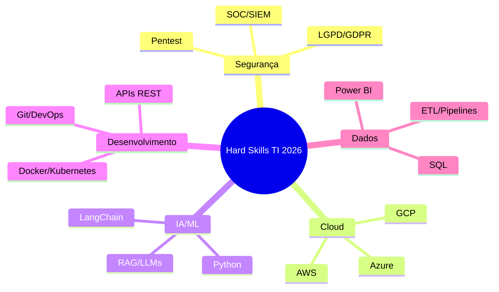
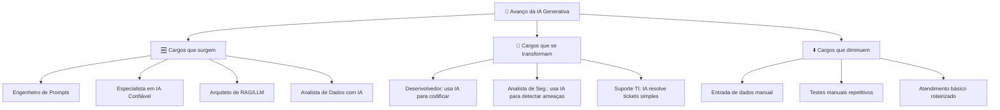
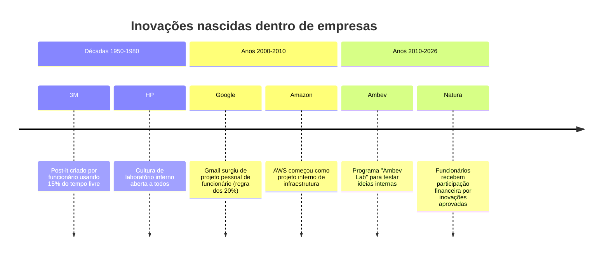
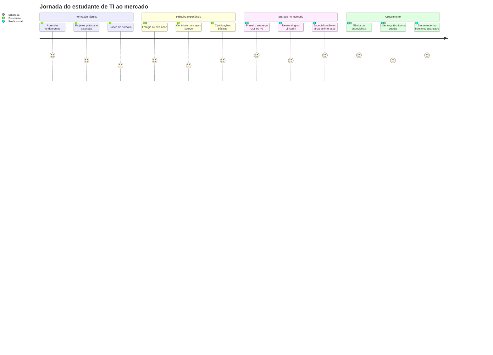
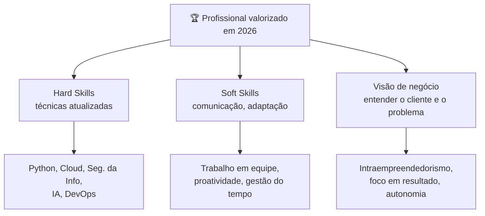

# Carreira e mercado de trabalho (intra-empreendedorismo) 💼

---

## 🌐 Panorama do mercado de TI em 2026

> [!important] O mercado de TI está em expansão acelerada
> O setor de Tecnologia da Informação e Comunicação (TIC) no Brasil cresceu **18,5% em 2025**, superando a média global (ABES/IDC). A demanda por profissionais supera em muito a oferta: o Brasil forma cerca de **53 mil profissionais/ano**, enquanto o mercado exige **159 mil** (Brasscom). Isso significa que há espaço para quem está se formando agora.

### O que esse número significa para você?

O déficit de profissionais cria uma vantagem competitiva real para quem investe em qualificação. O mercado não está saturado: pelo contrário, **44% das organizações brasileiras planejam ampliar suas equipes de TI em 2026** (Robert Half).


---

## 🔥 Áreas em alta e salários (2026)

> [!tip] Onde estão as melhores oportunidades
> Segundo o **Guia Salarial Robert Half 2026** e dados da Brasscom, estas são as áreas com maior demanda e melhores remunerações em TI no Brasil.

| Área | Cargo Júnior | Cargo Sênior | Demanda |
|------|-------------|-------------|---------|
| 🔐 Cibersegurança | R$ 7.000 | R$ 32.000 | Altíssima |
| ☁️ Cloud Computing | R$ 10.000 | R$ 22.000 | Muito alta |
| 🤖 IA / Engenharia de Prompts | R$ 8.000 | R$ 25.000 | Crescendo 306% |
| 💻 Desenvolvimento de Software | R$ 4.500 | R$ 18.000 | Alta (maior volume) |
| 📊 Ciência de Dados | R$ 5.000 | R$ 19.000 | Alta |
| 🌐 Redes e Infraestrutura | R$ 3.500 | R$ 12.000 | Estável |

> [!warning] Salário médio geral em TI
> O salário médio em TI no Brasil em 2026 é de aproximadamente **R$ 7.666/mês** (Salario.com.br). Profissionais que combinam cloud + segurança + automação chegam a posições de destaque ainda mais cedo.

```mermaid
bar
    title Faixa salarial por área TI no Brasil (R$/mês, 2026)
    x-axis ["Ciberseg.", "Cloud", "IA/Prompts", "Dev. Software", "Dados", "Redes"]
    y-axis "Salário (R$)" 0 --> 35000
    bar [7000, 10000, 8000, 4500, 5000, 3500] : "Júnior"
    bar [32000, 22000, 25000, 18000, 19000, 12000] : "Sênior"
```

---

## 🛠️ Habilidades mais exigidas nas vagas

> [!info] Hard Skills vs. Soft Skills
> Pesquisa da PUCPR (2025) mostrou que **59% das competências exigidas nas vagas são soft skills**. Saber programar não é suficiente: você precisa saber trabalhar em equipe, comunicar resultados e se adaptar rapidamente.

### Hard Skills (técnicas)



### Soft Skills (comportamentais)

| Skill | Por que importa |
|-------|----------------|
| 🗣️ Comunicação | Traduzir problema técnico para o cliente/gestor |
| 🤝 Trabalho em equipe | Projetos reais são sempre colaborativos |
| 🔄 Adaptabilidade | A tecnologia muda a cada 18 meses |
| 🧠 Pensamento crítico | Resolver problemas novos sem receita pronta |
| 🎯 Proatividade | Propor soluções antes de ser solicitado |
| ⏱️ Gestão de tempo | Sprints, deadlines, múltiplos projetos |

---

> [!example] 🧪 Atividade 1: Radiografia de 3 vagas reais
>
> **Objetivo:** Descobrir quais habilidades o mercado realmente pede para a sua área de interesse.
>
> **Como fazer:**
> 1. Acesse **[LinkedIn Jobs](https://www.linkedin.com/jobs/)** ou **[Gupy](https://portal.gupy.io/)**.
> 2. Pesquise o cargo que você quer ocupar em 2 a 3 anos (ex: "Analista de Segurança da Informação Júnior", "Desenvolvedor Back-end", "Técnico de Redes").
> 3. Abra **3 vagas diferentes** e copie os requisitos de cada uma em uma tabela.
> 4. Marque com ✅ o que você já sabe, com 🔴 o que você não sabe ainda.
> 5. Identifique as **3 habilidades que aparecem nas 3 vagas** ao mesmo tempo: essas são as mais críticas para você investir.
>
> **Resultado observável:** Uma lista priorizada das habilidades reais que o mercado exige para o seu cargo-alvo, com gaps claros para planejar os próximos estudos.

---

## 📈 Impacto da Inteligência Artificial no emprego

> [!warning] A IA não vai "roubar" seu emprego, mas vai transformar como você trabalha
> O World Economic Forum estima que a IA criará **97 milhões de novos empregos até 2030**, embora elimine ou transforme cargos operacionais repetitivos. No Brasil, a demanda por profissionais com conhecimento em IA cresceu **97% em 3 anos** e pode subir mais **150% até 2025** (dados compilados por Alura/FIAP).

### Cargos que mais crescem por influência da IA (Brasil 2026)



> [!tip] Estratégia inteligente
> A IA é uma **ferramenta de alavancagem**: quem aprende a usá-la produz mais em menos tempo. Um desenvolvedor que usa Copilot/Claude Code resolve em 1h o que antes levava 4h. Isso **não significa perder o emprego**: significa ser mais valorizado e conseguir entregar mais projetos.

---

## 🚀 Plataformas de freelance (trabalho independente)

> [!INFO] Definição
> Plataforma de mercado para trabalho freelancer e remoto, de contratação de trabalhadores independentes.

### Principais plataformas

- **99freelas** - Plataforma brasileira de freelancers
- **Workana** - Marketplace de trabalho remoto e freelance
- **GetNinjas** - Plataforma de contratação de serviços

### Plataformas internacionais (para quem tem inglês)

| Plataforma | Foco | Pagamento médio |
|-----------|------|----------------|
| [Upwork](https://www.upwork.com) | Desenvolvimento, design, dados | USD 25-150/hora |
| [Toptal](https://www.toptal.com) | Top 3% profissionais, altamente seletivo | USD 60-250/hora |
| [Fiverr](https://www.fiverr.com) | Gigs rápidos, serviços pacotizados | USD 5-500/entrega |
| [Freelancer.com](https://www.freelancer.com) | Diversas áreas técnicas | USD 10-80/hora |

> [!tip] Começar no Brasil, crescer no mundo
> A rota recomendada para estudantes: comece no **99freelas** ou **Workana** para construir portfólio e referências em português. Com 5 a 10 projetos concluídos, tente plataformas internacionais. O dólar faz diferença: R$ 60/hora no Upwork (USD 12) é acessível lá fora e alto aqui.

---

## 🔍 Análise de vagas de TI

### Áreas de atuação

- **Segurança da informação** - Análise de requisitos e oportunidades
- **Programação** - Demanda e habilidades necessárias
- **Montagem e manutenção** - Mercado e competências técnicas

### Onde buscar vagas de TI no Brasil

| Plataforma | Especialidade |
|-----------|--------------|
| [LinkedIn Jobs](https://www.linkedin.com/jobs/) | Todas as áreas, networking |
| [Gupy](https://portal.gupy.io/) | Grandes empresas e startups |
| [Catho](https://www.catho.com.br/) | Mercado geral |
| [GEEKHUNTER](https://www.geekhunter.com.br/) | Exclusivo para TI |
| [Programathor](https://programathor.com.br/) | Desenvolvedores |
| [InfoJobs](https://www.infojobs.com.br/) | TI e tecnologia |

---

> [!example] 🧪 Atividade 2: Pesquisa salarial e roadmap de carreira
>
> **Parte A: Consulta salarial no Glassdoor**
> 1. Acesse **[Glassdoor Brasil](https://www.glassdoor.com.br/Sal%C3%A1rios/index.htm)** ou **[Love Mondays](https://www.lovemondays.com.br/)**.
> 2. Pesquise o cargo que você deseja na sua cidade ou "remoto".
> 3. Anote: salário mínimo, mediano e máximo relatado.
> 4. Compare com a tabela salarial desta aula: o mercado local está acima ou abaixo da média nacional?
>
> **Parte B: Monte seu roadmap de carreira**
> 1. Acesse **[roadmap.sh](https://roadmap.sh/)**.
> 2. Escolha a trilha da sua área de interesse (ex: Backend, DevOps, Cibersegurança, IA/ML).
> 3. Marque em verde o que você já sabe, em amarelo o que está aprendendo, em vermelho o que ainda não tocou.
> 4. Identifique os **próximos 3 passos concretos** para avançar na trilha escolhida.
>
> **Resultado observável:** Um roadmap personalizado com seu nível atual mapeado e os próximos passos de desenvolvimento claramente identificados, comparado com faixas salariais reais do mercado.

---

## 💡 Intraempreendedorismo: inovar de dentro

> [!INFO] O que é intraempreendedor?
> O intraempreendedor é o profissional que, **dentro de uma empresa**, age como dono: propõe soluções, otimiza processos, cria produtos e assume responsabilidade pelos resultados. É empreendedor sem sair do emprego.

### Por que as empresas querem perfis intraempreendedores?

- Empresas com cultura de intraempreendedorismo têm **62% mais chances** de lançar produtos inovadores.
- Times intraempreendedores geram **21% mais receita** do que empresas sem essa cultura.
- Reduz a necessidade de contratar externamente para resolver problemas internos.

### Exemplos reais



### Como demonstrar perfil intraempreendedor no trabalho (ou no estágio)

| Ação | Impacto percebido pelo gestor |
|------|------------------------------|
| Identificar e reportar um problema com proposta de solução | Proatividade e senso de dono |
| Automatizar uma tarefa repetitiva da equipe | Eficiência e impacto técnico |
| Propor e liderar uma pequena melhoria de processo | Liderança e execução |
| Documentar o que você aprendeu e compartilhar com a equipe | Colaboração e generosidade |
| Estudar a área do cliente interno para entender suas dores | Visão de negócio |

---

> [!example] 🧪 Atividade 3: Mapeie uma oportunidade intraempreendedora
>
> **Objetivo:** Treinar o olhar de intraempreendedor em contextos reais.
>
> **Como fazer:**
> 1. Pense em um ambiente que você conhece bem: escola, empresa de estágio, comércio familiar, projeto de extensão, laboratório do IFF.
> 2. Identifique **1 processo manual ou ineficiente** que poderia ser melhorado com tecnologia (ex: agendamento feito por papel, controle de estoque em caderno, comunicação por áudio de WhatsApp sem registro).
> 3. Use o **[Canva](https://www.canva.com/)** ou o **[Miro](https://miro.com/)** para criar um slide simples com: problema identificado, solução proposta e benefício esperado.
> 4. Apresente para a turma em até 2 minutos.
>
> **Resultado observável:** Uma proposta concreta de inovação interna com problema, solução e benefício definidos, no formato que uma empresa real esperaria de um colaborador proativo.

---

## 🧭 Construindo sua carreira: do IFF ao mercado



### Checklist de empregabilidade para estudantes de TI

- [ ] Perfil no LinkedIn atualizado com foto, resumo e projetos
- [ ] Repositório no GitHub com ao menos 3 projetos próprios
- [ ] Certificação básica na sua área (ex: CompTIA, Google, AWS Free Tier)
- [ ] Participação em ao menos 1 projeto de extensão ou pesquisa
- [ ] Portfólio com descrição de problemas resolvidos, não só código
- [ ] Carta de apresentação adaptada por vaga (não genérica)
- [ ] Contato com profissionais da área para informational interviews

---

## 📊 Resumo visual: o triângulo do profissional de TI



---

> [!note] 📚 Fontes (2026)
>
> - [Mercado de trabalho em TI no Brasil: tendências e oportunidades em 2026 (InvGate)](https://blog.invgate.com/pt/mercado-para-ti)
> - [10 cargos de TI que estarão em alta em 2026 (IT Forum)](https://itforum.com.br/carreira/cargos-ti-em-alta-2026/)
> - [Guia Salarial 2026: Tecnologia (Robert Half)](https://www.roberthalf.com/br/pt/insights/guia-salarial/tecnologia)
> - [Tabela de Cargos e Salários TI 2026 (Nerdin)](https://www.nerdin.com.br/plano_de_cargos_e_salarios_ti.php)
> - [Brasscom: TIC pode gerar até 147 mil empregos formais no Brasil em 2025](https://brasscom.org.br/tic-pode-gerar-ate-147-mil-empregos-formais-no-brasil-em-2025/)
> - [Empregos em alta em 2026: LinkedIn revela os cargos que mais crescem no Brasil (QuerosBolsa)](https://querobolsa.com.br/revista/empregos-em-alta-em-2026-linkedin-revela-os-cargos-que-mais-crescem-no-brasil)
> - [As 5 habilidades mais valorizadas no Brasil em 2026, segundo o LinkedIn (Exame)](https://exame.com/carreira/as-5-habilidades-mais-valorizadas-no-brasil-em-2026-segundo-o-linkedin/)
> - [Como a IA vai mudar o mercado de trabalho em 2026 (Impacta)](https://www.impacta.com.br/blog/inteligencia-artificial-mercado-de-trabalho-2026/)
> - [Inteligência Artificial deve criar até 97 milhões de empregos até 2030 (UniSenaiPR)](https://unisenaipr.com.br/en/pos-graduacao_inteligencia-artificial-deve-criar-ate-97-milhoes-de-empregos-ate-2030-mas-falta-mao-de-obra-qualificada)
> - [Intraempreendedorismo: Guia Completo Para Inovar Em 2025 (Neil Patel)](https://neilpatel.com/br/blog/intraempreendedorismo/)
> - [Mercado de IA 2026: O guia de tendências, oportunidades e carreiras (Alura)](https://www.alura.com.br/artigos/mercado-de-ia)
