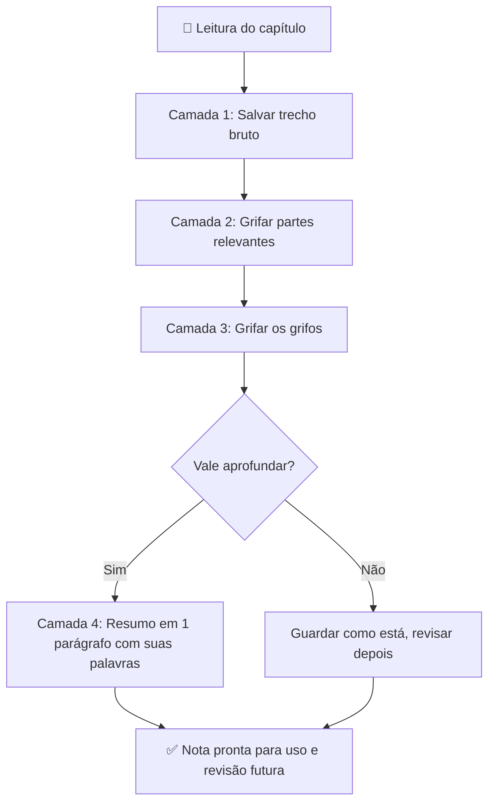
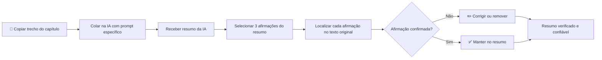
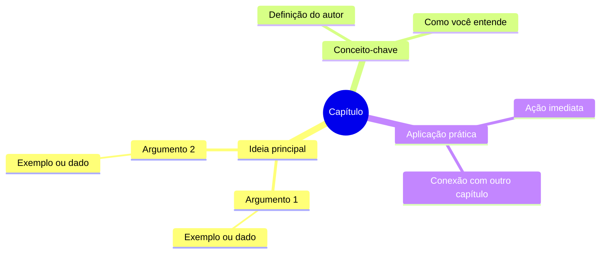

# Como resumir um livro

![[Recursos/Empreendedorismo/Como resumir um livro/metodo-4-passos.svg|Metodologia de 4 passos para resumir livros]]

## 🗂️ Metodologia em 4 passos

### 1. Ter um sistema de anotações

Estabeleça um método consistente para organizar suas anotações (digital ou físico).

### 2. Responder e anotar as perguntas fundamentais

Antes de começar a leitura, responda:

- Qual assunto do livro? Qual área de conhecimento?
- Qual a experiência do autor?
- O que ele quer me ensinar?
- Qual a ideia principal?

### 3. Anotar a ideia principal de cada capítulo

Identifique e registre o conceito central de cada capítulo para ter uma visão estruturada do livro.

### 4. Anotar em detalhes o que você vai fazer na prática com esse conhecimento

> [!TIP] Aplicação prática
> O conhecimento só tem valor quando aplicado. Defina ações concretas que você tomará baseado no que aprendeu.

---

## 🔄 Sumarização Progressiva (método Tiago Forte)

A **sumarização progressiva** é uma técnica criada por Tiago Forte (autor de *Building a Second Brain*) para comprimir informação em camadas, respeitando o tempo e a relevância de cada trecho.

A ideia central: você nunca sabe, no momento da leitura, o que será mais útil no futuro. Por isso, o método propõe filtros sucessivos, aplicados em momentos diferentes, em vez de tentar extrair tudo de uma vez.

### As 4 camadas da sumarização progressiva

| Camada | O que fazer | Ferramenta sugerida |
|--------|-------------|---------------------|
| **Camada 1** | Salvar o trecho bruto (copiar, fotografar, transcrever) | Notion, Obsidian, papel |
| **Camada 2** | Grifar as partes mais relevantes do trecho | Caneta marca-texto ou highlight digital |
| **Camada 3** | Grifar os grifos: destacar o mais essencial dentro do que já foi grifado | Segunda cor de marca-texto |
| **Camada 4** | Escrever um resumo executivo em suas próprias palavras (1 parágrafo) | Bloco de notas, caderno |

> [!INFO] Princípio-chave
> Não aplique todas as camadas a todas as notas. Reserve a Camada 4 apenas para o material que você realmente vai usar. Quantidade não é qualidade.

### Fluxo visual do método

> [!example] 🧪 Atividade: Sumarização progressiva de 1 capítulo
>
> **Ferramenta:** Livro físico (canetas de 2 cores) ou PDF com Zotero/Hypothes.is
>
> **Passos:**
> 1. Leia 1 capítulo completo do livro que você está usando no semestre.
> 2. Releia o capítulo e grife (caneta amarela ou highlight) os trechos que parecem mais importantes.
> 3. Releia apenas os trechos grifados e grife novamente (caneta laranja ou bold) o mais essencial dentro deles.
> 4. Com base apenas nos destaques duplos, escreva um resumo do capítulo em **exatamente 1 página A4** (sem olhar o texto original).
>
> **Resultado observável:** Uma página com a essência do capítulo escrita com suas próprias palavras, produzida em menos de 40 minutos.

---

## 🤖 Resumo com Inteligência Artificial

Ferramentas como ChatGPT, Claude e NotebookLM conseguem resumir capítulos e livros inteiros com rapidez. Porém, IAs cometem erros factuais, inventam citações e perdem nuances do contexto original. Usar IA como ponto de partida é eficiente; aceitar o resumo sem verificação é arriscado.

### Comparativo de ferramentas de IA para resumo

| Ferramenta | Ponto forte | Limitação |
|------------|-------------|-----------|
| **NotebookLM** | Responde só com base no que você enviou (zero alucinação sobre o texto carregado) | Precisa fazer upload do arquivo |
| **Claude** | Janela de contexto longa, mantém coerência em capítulos extensos, captura bem o tom | Pode inferir detalhes fora do texto enviado |
| **ChatGPT** | Ágil para trechos curtos colados diretamente | Limite de contexto menor; tende a generalizar |

### Processo recomendado para usar IA com segurança

> [!WARNING] Alucinação de IA
> IAs podem inventar autores, datas, citações e até capítulos inteiros que não existem no livro. Nunca use um resumo gerado por IA em trabalho acadêmico sem verificar as afirmações principais no texto original.

> [!example] 🧪 Atividade: Checar 3 fatos do resumo gerado por IA
>
> **Ferramenta:** ChatGPT ou Claude (acesso gratuito disponível no navegador)
>
> **Passos:**
> 1. Escolha 1 capítulo do seu livro e copie pelo menos 3 parágrafos representativos.
> 2. Cole o texto em ChatGPT ou Claude com o prompt: *"Resuma este trecho em 5 bullet points, mantendo as ideias do autor."*
> 3. Leia o resumo gerado e identifique **3 afirmações factuais** (ex.: nomes, números, conceitos).
> 4. Volte ao texto original e localize cada uma dessas 3 afirmações.
> 5. Registre numa tabela simples: afirmação, encontrou no texto (sim/não), o que o texto diz de fato.
>
> **Resultado observável:** Uma tabela de verificação com 3 linhas preenchidas, mostrando onde a IA acertou e onde errou ou distorceu.

---

## 🗺️ Mapa Mental do Livro

Um mapa mental transforma a estrutura linear de um livro em uma representação visual das conexões entre ideias. É especialmente útil para capturar a arquitetura de argumento do autor e identificar quais capítulos se relacionam entre si.

### Ferramentas recomendadas (2025-2026)

| Ferramenta | Tipo | Diferencial |
|------------|------|-------------|
| **Whimsical** | Online, gratuito | Tem IA que gera o mapa a partir de um texto colado; colaborativo em tempo real |
| **Markmap** | Online/VS Code | Escreve em Markdown e o mapa é gerado automaticamente; exporta como SVG/HTML |
| **Mapify** | Online | Converte PDF inteiro em mapa mental via IA |
| **MindMap AI** | Online, gratuito | Específico para livros: transforma capítulos em nós do mapa |
| **Papel + caneta** | Analógico | Mais lento, mais memorável; pesquisas indicam maior retenção |

### Estrutura sugerida para o mapa de um capítulo

> [!example] 🧪 Atividade: Mapa mental de 1 capítulo no Whimsical ou Markmap
>
> **Ferramenta:** [Whimsical](https://whimsical.com) (conta gratuita) ou [Markmap](https://markmap.js.org/repl) (sem cadastro)
>
> **Passos com Whimsical:**
> 1. Crie uma conta gratuita em whimsical.com.
> 2. Abra um novo "Mind Map".
> 3. No nó central, coloque o título do capítulo.
> 4. Crie 3 a 5 nós filhos, um para cada ideia principal do capítulo.
> 5. Para cada nó filho, adicione pelo menos 1 nó neto com um exemplo ou dado concreto do texto.
> 6. Exporte como imagem e cole na sua nota do capítulo.
>
> **Passos com Markmap (sem cadastro):**
> 1. Acesse markmap.js.org/repl.
> 2. Apague o exemplo e escreva sua estrutura em Markdown (use `#` para o título, `-` para os nós).
> 3. O mapa é gerado em tempo real à direita.
> 4. Clique em "Export" para salvar como SVG.
>
> **Resultado observável:** Um arquivo de imagem ou SVG do mapa mental do capítulo, com pelo menos 3 níveis de profundidade e 10 nós visíveis.

---

## 📊 Comparativo dos três métodos

| Método | Tempo médio por capítulo | Retenção esperada | Melhor para |
|--------|--------------------------|-------------------|-------------|
| Sumarização progressiva | 30 a 50 min | Alta (reescrita ativa) | Capítulos densos, leitura de estudo |
| Resumo com IA + verificação | 15 a 25 min | Média (depende da verificação) | Leitura exploratória, revisão rápida |
| Mapa mental | 20 a 40 min | Alta (visual + síntese) | Livros com muitos conceitos relacionados |

> [!TIP] Combinação recomendada
> Use IA para gerar um rascunho rápido, sumarização progressiva para aprofundar o que importa, e mapa mental para visualizar a estrutura geral. Os três métodos se complementam.

---

## 📚 Recursos relacionados

- [[Desafio de leitura]]
- [[Aplicativos e sites de resumo]]

---

> [!note] 📚 Fontes (2026)
> - [Progressive Summarization: A Practical Technique for Designing Discoverable Notes (Forte Labs)](https://fortelabs.com/blog/progressive-summarization-a-practical-technique-for-designing-discoverable-notes/)
> - [The Art of Summarization: Tiago Forte's Progressive Highlighting 2.0 Technique in Action (Medium)](https://medium.com/@mariusbongarts/the-art-of-summarization-tiago-fortes-progressive-highlighting-2-0-technique-in-action-96f6b7b78ae4)
> - [How to Summarize Books Using ChatGPT: 7 Experiments in AI Distillation (Forte Labs)](https://fortelabs.com/blog/how-to-summarize-books-using-chatgpt/)
> - [Can Claude Summarize Books Accurately? Long-Form Summarization Quality and Risks (Data Studios)](https://www.datastudios.org/post/can-claude-summarize-books-accurately-long-form-summarization-quality-and-risks)
> - [How to Summarize a Textbook with AI (Chapter by Chapter) (Vertech Academy)](https://www.vertechacademy.com/blog/how-to-summarize-textbook-with-ai)
> - [Free Mind Map Maker with AI (Whimsical)](https://whimsical.com/mind-maps)
> - [Markmap: Visualize Markdown as Mind Maps](https://markmap.js.org/)
> - [Mapify: AI Summarizer and Mind Map Generator](https://mapify.so/)
