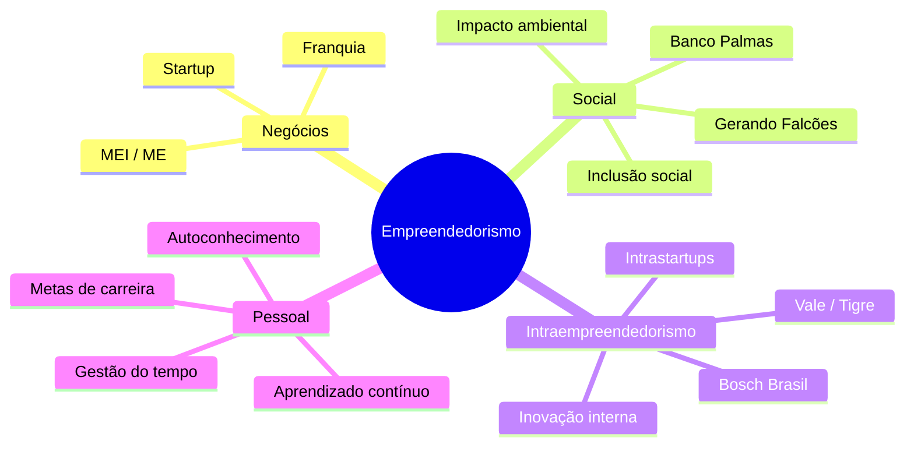
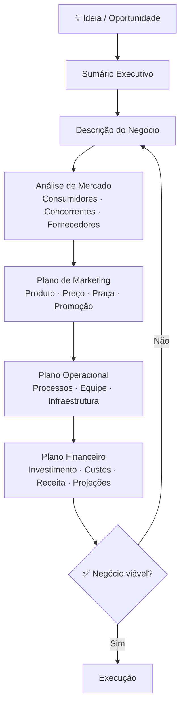

# Conceitos básicos

> [!INFO] Nota
> A maior parte dos conceitos básicos estão presentes na apostila. Mas alguns destaques colocaremos por aqui.

---

## 🤔 O que é Empreendedorismo?

Quando ouvimos a palavra empreendedorismo, ela está muito ligada ao mundo dos negócios e empresas, porém existe também o termo **empreendedorismo pessoal** que é a arte de transformar seus pensamentos e ideias em resultados e melhorar cada aspecto da sua vida pessoal e profissional.

> [!quote] Definição ampla
> Empreendedorismo é a capacidade de identificar oportunidades, assumir riscos calculados e criar valor, seja em um negócio, em um projeto ou na própria vida.

### Construindo seu próprio conceito

- Devemos **construir** nosso próprio conceito de "empreendedorismo"
- Devemos identificar características empreendedoras "presentes" e "ausentes" em nosso próprio perfil

### Empreendedorismo como comportamento

Empreendedorismo deixou de ser um termo ligado exclusivamente aos **negócios** e passou a ser visto como **comportamento**.

O Empreendedorismo, como "comportamento", pode estar associado a:
- Um negócio ou empresa
- Um projeto
- Uma realização pessoal

> [!tip] Por que isso importa?
> Mesmo quem trabalha com carteira assinada pode (e deve) exercitar o comportamento empreendedor: identificar problemas, propor soluções, entregar mais valor do que o esperado. Essa postura diferencia profissionais no mercado atual.

---

## 🌳 Formas de empreendedorismo

![[Recursos/Empreendedorismo/Conceitos básicos/formas-empreendedorismo.svg|Diagrama das quatro formas de empreendedorismo]]

- **Empreendedorismo de negócios** - [[Empreendedorismo de negócios]]
- **Empreendedorismo social** - foco em impacto social
- **Intra-empreendedorismo** - empreendedorismo dentro de organizações
- **Empreendedorismo pessoal** - desenvolvimento pessoal e profissional

### Comparativo rápido

| Forma | Onde acontece | Objetivo principal | Exemplo real (2025-2026) |
|---|---|---|---|
| **Negócios** | Mercado / empresa própria | Lucro e crescimento | Magazine Luiza (Luiza Trajano) |
| **Social** | Terceiro setor / startups de impacto | Resolver problema social de forma sustentável | Banco Palmas (Fortaleza-CE) |
| **Intraempreendedorismo** | Dentro de uma empresa já existente | Inovar por dentro | Bosch Brasil (equipes internas de "intrastartups") |
| **Pessoal** | Vida individual | Autodesenvolvimento e realização | Metas de carreira, aprendizado contínuo |

> [!example] 🧪 Atividade: Classifique 3 negócios reais
> **O que fazer:** Acesse o site [sebrae.com.br](https://sebrae.com.br) e escolha 3 histórias de empreendedores da seção "Histórias de Sucesso". Para cada um, classifique: qual das 4 formas de empreendedorismo representa? Justifique em 1 frase.
>
> **Ferramenta:** Navegador + site Sebrae
>
> **Resultado observável:** Tabela preenchida com: nome do empreendedor | tipo de negócio | forma de empreendedorismo | justificativa.

---

---

### Empreendedorismo social: mais que caridade

O empreendedorismo social gera receita **e** impacto positivo ao mesmo tempo. Não é filantropia: é modelo de negócio sustentável com missão social.

**Exemplos brasileiros reais (2025-2026):**

- **Banco Palmas** (Fortaleza-CE): criou uma moeda social que circula apenas no bairro, estimulando o comércio local e oferecendo microcrédito para quem quer empreender.
- **Gerando Falcões** (São Paulo-SP): redes de educação, esporte e empregabilidade em comunidades vulneráveis.
- **Abraço Cultural**: escola de idiomas com corpo docente formado por refugiados, promovendo ensino de línguas e diversidade cultural.
- **Retalhar**: transforma resíduos têxteis em matéria-prima, contratando cooperativas de costureiras de periferias urbanas.

> [!success] Dado de contexto (2025)
> No primeiro trimestre de 2025, o Brasil abriu cerca de **1,4 milhão de pequenos negócios**. Muitos deles combinam objetivo de renda com impacto social na comunidade local.

### Intraempreendedorismo: inovar por dentro

O **intraempreendedor** é o colaborador que age como empreendedor dentro da empresa onde trabalha: propõe novas soluções, cria processos, lidera projetos inovadores sem precisar abrir um negócio próprio.

**Prêmio de Intraempreendedorismo 2025** (Brasil): empresas como Vale, B3, Três Corações, ENGIE e Tigre foram reconhecidas. Cerca de **46% das empresas já possuem áreas dedicadas à inovação** internamente.

### Empreendedorismo pessoal: você como seu próprio projeto

Empreendedorismo pessoal é tratar a própria vida como um projeto a ser gerenciado: definir objetivos, identificar recursos, superar obstáculos e medir resultados. As habilidades são as mesmas do empreendedor de negócios: resiliência, planejamento, adaptação, comunicação assertiva.

> [!example] 🧪 Atividade: Mapa problema → solução da sua vida
> **O que fazer:** No [FigJam](https://www.figma.com/figjam/) (gratuito, acesso pelo navegador sem instalar), crie um quadro com dois blocos: **"Problema que quero resolver na minha vida"** e **"Solução que posso criar"**. Ligue os dois com uma seta e adicione um terceiro bloco: **"Valor gerado (para quem?)."**
>
> **Ferramenta:** FigJam (figma.com/figjam) ou papel + post-its físicos.
>
> **Resultado observável:** Diagrama de 3 blocos conectados, com uma ideia concreta de empreendedorismo pessoal mapeada.

---

## 🔍 Pesquisa de mercado

Uma importante etapa inicial de um empreendimento é a **pesquisa de mercado**.

> [!INFO] Definição
> Uma pesquisa de mercado compreende o conjunto de todas as ações desenvolvidas pelo empreendedor no sentido de obter informações sobre o mercado (consumidores, concorrentes, fornecedores, análise de conjuntura, localização, etc.) no qual atua e/ou pretende atuar.

### Origem dos dados

![[Recursos/Empreendedorismo/Conceitos básicos/pesquisa-mercado.svg|Comparativo entre dados primários e secundários]]

A origem dos dados da pesquisa pode ser **primária** ou **secundária**:

- **Secundária:** Mais barata e rápida. Os dados podem estar defasados ou incompletos para o objetivo.
- **Primária:** Requer mais tempo e dinheiro. Porém trata-se de dados confiáveis, atualizados e específicos para o seu negócio.

### Comparativo detalhado: primária vs. secundária

| Critério | Dados Primários | Dados Secundários |
|---|---|---|
| **Custo** | Alto (tempo + dinheiro) | Baixo (já existem) |
| **Velocidade** | Lento | Rápido |
| **Relevância** | Alta (feito para o seu negócio) | Média (pode não se encaixar) |
| **Exemplos de fontes** | Entrevistas, questionários, observação | IBGE, Sebrae, relatórios de mercado |
| **Ferramentas digitais** | Google Forms, SurveyMonkey | Google Trends, IBGE Cidades |

### Ferramentas gratuitas para pesquisa primária online

| Ferramenta | Link | Destaque |
|---|---|---|
| Google Forms | [forms.google.com](https://forms.google.com) | Integra com Google Sheets, ilimitado |
| SurveyMonkey (free) | [surveymonkey.com](https://www.surveymonkey.com) | Templates prontos de pesquisa de mercado |
| Google Trends | [trends.google.com.br](https://trends.google.com.br) | Veja se há demanda pelo seu produto/serviço |
| IBGE Cidades | [cidades.ibge.gov.br](https://cidades.ibge.gov.br) | Dados demográficos e econômicos por município |

> [!example] 🧪 Atividade: Pesquise a demanda pela sua ideia
> **O que fazer:** Acesse o [Google Trends](https://trends.google.com.br) e pesquise o nome do produto ou serviço da sua ideia de negócio. Observe: a busca está crescendo, estável ou caindo nos últimos 12 meses? Compare com um produto concorrente.
>
> **Ferramenta:** Google Trends (trends.google.com.br), navegador, sem cadastro.
>
> **Resultado observável:** Print da tela com a curva de interesse ao longo do tempo + 1 parágrafo de interpretação: "Minha ideia tem demanda crescente / estável / declinante porque..."

---

## 📋 Plano de negócio

> [!INFO] Definição
> É um documento que descreve (por escrito) quais os objetivos de um negócio e quais passos devem ser dados para que esses objetivos sejam alcançados, diminuindo os riscos e as incertezas.

Um plano de negócio permite identificar e restringir seus erros no papel, ao invés de cometê-los no mercado.

> [!TIP] Questão para reflexão
> É necessário? E para negócios online?

### Estrutura típica de um Plano de Negócio (Sebrae)

### Plano de negócio vs. modelo de negócio (Canvas)

| Aspecto | Plano de Negócio | Business Model Canvas |
|---|---|---|
| **Tamanho** | Documento longo (20-50 pgs) | 1 página visual |
| **Ideal para** | Negócios consolidados, financiamento bancário | Startups, validação rápida de ideia |
| **Foco** | Detalhamento operacional e financeiro | Hipóteses a validar |
| **Flexibilidade** | Estático (revisa-se com planejamento) | Dinâmico (muda conforme aprende) |

> [!warning] Startups: Canvas antes do Plano
> Para startups, o Sebrae recomenda começar pelo **Business Model Canvas** (modelo de negócio de 1 página) para validar hipóteses rapidamente. O Plano de Negócio completo vem depois, quando o modelo já foi testado.

> [!example] 🧪 Atividade: Pesquise a história de 1 empreendedor real
> **O que fazer:** Escolha um dos empreendedores abaixo e acesse o link indicado. Leia a história e escreva um resumo de **exatamente 3 frases**: (1) de onde veio o empreendedor, (2) qual problema ele resolveu, (3) qual o resultado alcançado.
>
> **Opções:**
> - Flávio Augusto da Silva (Wise Up): [euqueroinvestir.com/flavio-augusto](https://euqueroinvestir.com/educacao-financeira/flavio-augusto-da-silva-do-cheque-especial-ao-clube-do-bilhao)
> - Luiza Helena Trajano (Magazine Luiza): [ibccoaching.com.br/luiza-trajano](https://www.ibccoaching.com.br/portal/exemplo-de-lideranca/historia-sucesso-luiza-helena-trajano-magazine-luiza/)
> - Histórias do Sebrae: [sebrae.com.br](https://sebrae.com.br)
>
> **Resultado observável:** Parágrafo de 3 frases numeradas, lido em voz alta para a turma.

---

> [!note] 📚 Fontes (2026)
> - [Startups de Impacto Social no Brasil: Desafios e Oportunidades em 2025 (Startup do Bem)](https://startupdobem.com.br/startups-de-impacto-social-no-brasil-desafios-e-oportunidades-em-2025/)
> - [Tendências de empreendedorismo 2026 (Sebrae RS)](https://digital.sebraers.com.br/blog/empreendedorismo/tendencias-de-empreendedorismo-2026-para-ficar-de-olho/)
> - [Prêmio de Intraempreendedorismo 2025 (Envolverde)](https://envolverde.com.br/noticia/premio-de-intraempreendedorismo-2025-anuncia-vencedores-e-projetos-mais-transformadores-da-inovacao-corporativa-no-brasil)
> - [Plano de Negócios: o que é, como fazer e modelo (Sebrae)](https://sebrae.com.br/sites/PortalSebrae/artigos/plano-de-negocios-o-que-e-como-fazer-e-modelo-do-sebrae,f8fca26475abb810VgnVCM1000001b00320aRCRD)
> - [Flávio Augusto da Silva: do cheque especial ao Clube do Bilhão](https://euqueroinvestir.com/educacao-financeira/flavio-augusto-da-silva-do-cheque-especial-ao-clube-do-bilhao)
> - [Luiza Helena Trajano: história de sucesso (IBC Coaching)](https://www.ibccoaching.com.br/portal/exemplo-de-lideranca/historia-sucesso-luiza-helena-trajano-magazine-luiza/)
> - [8 exemplos de intraempreendedorismo: cases de sucesso (PlayStudio)](https://www.playstudio.io/blog/exemplos-de-intraempreendedorismo)
> - [Empreendedorismo social: 8 exemplos brasileiros inspiradores (PodHeitor)](https://www.podheitor.com.br/post/empreendedorismo-social-exemplos-brasileiros-inspiradores)
