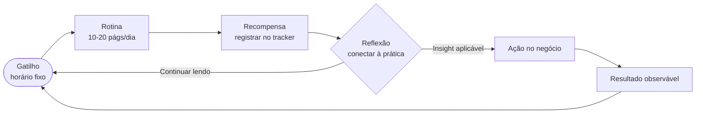

# Desafio de leitura

## 📋 Recursos relacionados

- [[Como resumir um livro]]
- [[Aplicativos e sites de resumo]]

---

## 📚 Por que empreendedores leem?

> [!info] Leitura como vantagem competitiva
> Grandes empreendedores e investidores mantêm rotinas rigorosas de leitura. Não é coincidência: leitura sistemática amplia repertório, antecipa tendências e constrói o vocabulário necessário para tomar decisões melhores.

Dados de referência (fontes na seção final):

- **Bill Gates:** 50 livros por ano, cerca de 1 por semana.
- **Mark Zuckerberg:** 1 livro a cada 2 semanas.
- **Warren Buffett:** passa aproximadamente 80% do dia lendo.
- **Mark Cuban:** 3 horas diárias de leitura sobre sua indústria.

> [!tip] Ponto de partida prático
> Você não precisa competir com esses números. **10 a 20 páginas por dia** equivalem a 1 livro completo por mês, o que já coloca qualquer pessoa no topo de 90% da população brasileira em termos de hábito de leitura.

---

## 📖 Lista de livros recomendados

### Clássicos do empreendedorismo

1. **Trabalhe 4 horas por semana** - Timothy Ferriss
2. **O poder do hábito** - Charles Duhigg
3. **Como fazer acontecer** - David Allen
4. **Pai rico pai pobre** - Robert Kiyosaki
5. **A única coisa** - Gary Keller
6. **Os 7 hábitos das pessoas altamente eficazes** - Stephen Covey
7. **Como fazer amigos e influenciar pessoas** - Dale Carnegie
8. **4 horas para o corpo** - Timothy Ferriss
9. **Essencialismo** - Greg McKeown

---

## 🗂️ Tabela de livros recomendados (2025-2026)

| Título | Autor | Tema principal |
|--------|-------|----------------|
| Trabalhe 4 horas por semana | Timothy Ferriss | Produtividade e estilo de vida |
| O poder do hábito | Charles Duhigg | Formação de hábitos |
| Essencialismo | Greg McKeown | Foco e eliminação do supérfluo |
| Pai rico pai pobre | Robert Kiyosaki | Educação financeira |
| A única coisa | Gary Keller | Priorização |
| Os 7 hábitos das pessoas altamente eficazes | Stephen Covey | Desenvolvimento pessoal |
| Como fazer amigos e influenciar pessoas | Dale Carnegie | Comunicação e liderança |
| De zero a um | Peter Thiel | Startups e inovação |
| O jeito Pixar de ser | Ed Catmull | Criatividade e cultura organizacional |
| Mindset: a nova psicologia do sucesso | Carol S. Dweck | Mentalidade de crescimento |
| A startup enxuta | Eric Ries | MVP e validação de ideias |
| Sprint | Jake Knapp | Resolução rápida de problemas |
| Nunca divida a diferença | Chris Voss | Negociação |
| Os segredos da mente milionária | T. Harv Eker | Mentalidade financeira |

---

## 🔄 Ciclo do hábito de leitura

O ciclo abaixo mostra como transformar leitura em hábito sustentável, baseado no modelo de Charles Duhigg (*O Poder do Hábito*) aplicado à rotina do empreendedor:

> [!note] Como usar o diagrama
> Escolha um **gatilho fixo** (ex.: após o café da manhã ou antes de dormir). Leia o seu bloco diário de páginas. Registre no seu tracker (Goodreads, Notion etc.) como **recompensa imediata**. Ao final do livro, conecte os aprendizados à sua realidade, gerando uma ação concreta.

---

## 🧪 Atividades mão na massa

> [!example] 🧪 Atividade 1: Montar um tracker de leitura no Goodreads
>
> **Objetivo:** criar seu perfil de leitor e cadastrar o primeiro livro com meta de páginas/dia.
>
> **Ferramenta:** [Goodreads](https://www.goodreads.com) (gratuito, web e app iOS/Android).
>
> **Passo a passo:**
> 1. Crie uma conta gratuita em [goodreads.com](https://www.goodreads.com) ou baixe o app.
> 2. Vá em **"Reading Challenge"** e defina quantos livros quer ler este ano.
> 3. Pesquise um dos livros da tabela acima e mova-o para a estante **"Lendo"**.
> 4. No perfil do livro, clique em **"Update progress"** e informe a página atual.
> 5. Calcule: `total de páginas ÷ prazo em dias = páginas por dia`. Anote essa meta.
>
> **Resultado observável:** ao final da atividade, você terá um perfil no Goodreads com 1 livro cadastrado, meta de páginas/dia definida e progresso atualizado. Tire um print da tela de progresso para registrar o ponto de partida.

---

> [!example] 🧪 Atividade 2: Plano de leitura no Notion com acompanhamento semanal
>
> **Objetivo:** estruturar um plano de leitura com datas e registrar o progresso por pelo menos 1 semana.
>
> **Ferramenta:** [Notion](https://www.notion.so) (gratuito, web e app) com o template **"Book Tracker"** disponível no [Notion Marketplace](https://www.notion.so/templates).
>
> **Passo a passo:**
> 1. Acesse [notion.so](https://www.notion.so) e crie uma conta gratuita.
> 2. No Marketplace, busque **"Book Tracker"** e duplique o template para o seu espaço.
> 3. Adicione o livro escolhido com: título, autor, total de páginas, data de início e data-alvo de conclusão.
> 4. Crie uma propriedade **"Páginas lidas hoje"** e atualize diariamente por 7 dias.
> 5. Ao final da semana, verifique se o ritmo diário está compatível com a data-alvo.
>
> **Resultado observável:** tabela no Notion com 7 registros diários de progresso, mostrando consistência (ou necessidade de ajuste) no plano original. Compartilhe o link público da página com o professor.

---

> [!example] 🧪 Atividade 3: Resumo de 1 página ao terminar um livro
>
> **Objetivo:** consolidar o aprendizado do livro em um resumo estruturado de 1 página.
>
> **Ferramenta:** qualquer editor de texto (Obsidian, Notion, Google Docs). Consulte [[Como resumir um livro]] para o método completo.
>
> **Estrutura do resumo (1 página, máximo):**
> - **Ideia central:** qual o problema que o livro resolve?
> - **3 conceitos-chave:** os pontos mais importantes em 1 frase cada.
> - **Citação favorita:** uma passagem que marcou você.
> - **Ação imediata:** o que você vai fazer diferente nos próximos 7 dias por causa deste livro?
>
> **Resultado observável:** documento de 1 página entregue ao professor com as 4 seções preenchidas. A ação imediata deve ser específica e verificável (ex.: "vou acordar 30 minutos mais cedo para ler", não "vou ler mais").

---

## 🗓️ Como organizar sua rotina de leitura

> [!tip] Rotina de 10-20 páginas por dia
> Escolha **um horário fixo** e proteja-o como reunião importante. Os melhores horários relatados por empreendedores são: logo após acordar (antes de checar o celular) ou nos 30 minutos antes de dormir. Consistência diária supera maratonas esporádicas.

Sugestão de cadência para o desafio da disciplina:

| Semana | Meta | Entrega |
|--------|------|---------|
| 1 | Criar tracker e cadastrar livro | Print do Goodreads ou link do Notion |
| 2-3 | Ler e registrar progresso diário | Tabela de 7 registros |
| 4 | Terminar o livro e escrever resumo | Documento de 1 página |

---

> [!note] 📚 Fontes (2026)
>
> - [Os 10 livros de negócios e empreendedorismo mais lidos em 2026 - NegociosSC](https://www.negociossc.com.br/blog/os-10-livros-de-negocios-e-empreendedorismo-mais-lidos-em-2026/)
> - [11 livros para inspirar empreendedores em 2026 - Correio Braziliense](https://www.correiobraziliense.com.br/revista-do-correio/2025/12/7317953-11-livros-para-inspirar-empreendedores-em-2026.html)
> - [Os 15 melhores livros de empreendedorismo para ler em 2026 - Santander](https://santandernegocioseempresas.com.br/conhecimento/empreendedorismo/15-livros-empreendedorismo-2026/)
> - [27 melhores livros sobre empreendedorismo em 2026 - Nuvemshop](https://www.nuvemshop.com.br/blog/livros-para-empreendedores/)
> - [A leitura como diferencial competitivo - Jornal do Brás](https://jornaldobras.com.br/noticia/64653/a-leitura-como-diferencial-competitivo-o-segredo-de-grandes-empreendedores)
> - [10 hábitos de empreendedores de sucesso - Exame](https://exame.com/carreira/guia-de-carreira/10-habitos-de-empreendedores-de-sucesso/)
> - [Tutorial completo do Goodreads para leitores - Fusão Online](https://fusaoonline.com/tutorial-completo-do-goodreads-para-leitores/)
> - [Notion Marketplace: Book Tracker templates](https://www.notion.so/templates)
