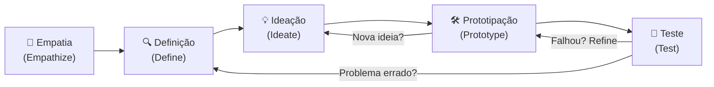

# Design thinking

> [!tip] Metodologia Centrada no Usuário
> Design thinking é uma metodologia de solução de problemas que coloca o usuário no centro do processo, usando empatia, criatividade e iteração para desenvolver soluções inovadoras.

---

## 🗺️ Visão Geral: as 5 Etapas

![[Recursos/Empreendedorismo/Design thinking/etapas-design-thinking.svg|As 5 etapas do Design Thinking]]

O fluxo abaixo mostra as etapas e o caráter **iterativo** do processo: setas de retorno indicam que é normal (e esperado) voltar etapas ao longo do projeto.

> [!note] Processo Iterativo
> As etapas não são estritamente lineares. Muitas vezes você vai iterar, voltar de Teste para Ideação, redefinir o problema ou refinar protótipos.

---

## 📊 Resumo Rápido das Etapas

| Etapa | Pergunta central | Principal ferramenta |
|-------|-----------------|----------------------|
| Empatia | Quem é o usuário e o que ele sente? | Entrevistas, mapa de empatia |
| Definição | Qual é o problema real? | Declaração HMW ("Como poderíamos...") |
| Ideação | Quais soluções são possíveis? | Brainstorming, SCAMPER |
| Prototipação | Como isso funciona na prática? | Protótipo em papel, wireframe |
| Teste | A solução resolve o problema? | Observação, feedback estruturado |

---

## 🧡 1. Empatia (Empathize)

**Objetivo:** Compreender profundamente os usuários: desejos, dores, necessidades e contexto.

**Como fazer:**
- Entrevistas qualitativas e observações em campo
- Mapas de empatia: "O que o usuário sente, pensa, vê, escuta, fala, faz"
- Shadowing: acompanhar o usuário enquanto realiza uma tarefa real
- Pesquisa secundária: dados de mercado, reviews, fóruns de usuários

**Importância:** Evita criar soluções baseadas em suposições; garante que o problema entendido seja real.

### Mapa de Empatia (estrutura dos 6 campos)

| Campo | Pergunta guia |
|-------|---------------|
| **Pensa e sente** | Quais são as grandes preocupações e aspirações do usuário? |
| **Ouve** | O que amigos, colegas e influências dizem a ele? |
| **Vê** | O que ele observa no seu ambiente? |
| **Fala e faz** | Como ele se comporta em público? O que diz? |
| **Dores** | Quais são os maiores medos e frustrações? |
| **Ganhos** | O que ele quer realmente conquistar? |

> [!example] 🧪 Atividade 1: Entrevista de Empatia
> **Ferramenta:** papel + caneta (ou Notion/Google Docs)
> **Ação:** escolha 1 pessoa do seu círculo próximo (amigo, familiar, colega). Entreviste-a por 10 minutos sobre um problema do dia a dia: dificuldade em pagar contas, usar transporte público, estudar em casa, etc. Anote ao menos **3 dores reais** que ela mencionar, usando as próprias palavras dela.
> **Resultado observável:** uma lista de 3 citações literais do entrevistado que revelam uma frustração genuína, pronta para alimentar a próxima etapa.

> [!example] 🧪 Atividade 2: Mapa de Empatia no FigJam ou Miro
> **Ferramenta:** [FigJam (gratuito)](https://www.figma.com/figjam/) ou [Miro (gratuito com conta estudante)](https://miro.com/templates/empathy-map/)
> **Ação:** abra o template de mapa de empatia em um dos dois. Preencha os 6 campos com base na entrevista da Atividade 1. Exporte o mapa como PNG.
> **Resultado observável:** um arquivo PNG do mapa de empatia preenchido, com pelo menos 3 post-its em cada campo.

---

## 🔍 2. Definição (Define)

**Objetivo:** Interpretar dados coletados para articular claramente o problema a resolver.

**Como fazer:**
- Sintetizar insights e identificar padrões entre múltiplas entrevistas
- Formular "How Might We" (Como poderíamos...) ou declarações de problema centradas no usuário
- Usar o formato: **[Usuário] precisa de [necessidade] porque [insight]**

**Importância:** Serve de base para idear soluções relevantes; evita "soluções para o problema errado".

### Formato de Declaração de Problema

> *"[Nome/Persona] é um [contexto] que precisa de [necessidade] porque [insight revelado na empatia]."*

**Exemplo prático (Nubank):** "O João, assalariado de 25 anos, precisa de um cartão de crédito sem burocracia porque toda vez que tenta solicitar um em banco tradicional passa horas na fila e enfrenta exigências de comprovantes que ele não tem à mão."

### Técnica "Como Poderíamos..." (How Might We)

Transforme a dor identificada em uma pergunta aberta que estimule ideias:

| Dor (empatia) | Declaração HMW |
|---------------|----------------|
| Usuário não consegue entender sua fatura | Como poderíamos tornar a fatura tão clara que qualquer pessoa entenda em 30 segundos? |
| Entrega de comida sempre atrasa | Como poderíamos dar ao usuário controle real sobre o tempo de espera? |
| Estudante esquece de revisar conteúdo | Como poderíamos transformar a revisão em algo divertido e automático? |

---

## 💡 3. Ideação (Ideate)

**Objetivo:** Gerar o máximo de ideias possíveis para enfrentar o problema definido.

**Como fazer:**
- Brainstorming: gerar ideias livremente, sem julgamento, por tempo limitado (ex.: 10 minutos)
- Sketches: desenhos rápidos de soluções possíveis
- Mapas mentais: ramificar conceitos a partir do problema central
- Encorajar ideias divergentes antes de convergir para prioridades

**Importância:** Amplia possibilidades e aumenta a chance de encontrar soluções inovadoras.

### Técnica SCAMPER

SCAMPER é um checklist de perguntas para forçar novas perspectivas sobre uma ideia existente:

| Letra | Inglês | Ação | Exemplo aplicado |
|-------|--------|------|-----------------|
| **S** | Substitute | Substituir | Trocar atendente humano por chatbot |
| **C** | Combine | Combinar | Juntar academia com aplicativo de gamificação |
| **A** | Adapt | Adaptar | Usar sistema de pontos de jogos em fidelidade de loja |
| **M** | Modify | Modificar | Tornar embalagem reutilizável |
| **P** | Put to other uses | Novos usos | Usar resíduo de café como fertilizante |
| **E** | Eliminate | Eliminar | Retirar etapas desnecessárias de um formulário |
| **R** | Rearrange | Reorganizar | Inverter ordem de atendimento para priorizar idosos |

> [!example] 🧪 Atividade 3: Brainstorming Cronometrado
> **Ferramenta:** papel A4 + caneta (1 ideia por post-it se quiser organizar depois)
> **Ação:** use o problema definido na etapa anterior. Configure um timer para **8 minutos**. Escreva o máximo de ideias possíveis para resolver o problema, sem filtrar nada: vale ideia "impossível", cara, absurda. Ao final, circule as 3 mais promissoras.
> **Resultado observável:** lista de no mínimo 10 ideias brutas e 3 ideias selecionadas para prototipar.

---

## 🛠️ 4. Prototipação (Prototype)

**Objetivo:** Tornar ideias tangíveis; criar versões simplificadas para experimentação.

**Como fazer:**
- Protótipos de baixa fidelidade: papel, storyboard, maquetes, wireframes
- Explorar funcionalidades, aparência e interações
- Regra de ouro: quanto mais barato e rápido, melhor; o objetivo é aprender, não impressionar

**Importância:** Permite testar hipóteses de forma rápida e barata antes de investir pesado.

### Tipos de Protótipo por Fidelidade

| Tipo | Material | Tempo médio | Quando usar |
|------|----------|-------------|-------------|
| Esboço em papel | Papel A4, lápis | 5-15 min | Primeiras ideias, fluxos |
| Storyboard | Papel + desenhos em sequência | 15-30 min | Jornada do usuário |
| Maquete física | Papelão, EVA, fita | 30-60 min | Produto físico |
| Wireframe digital | Figma, Canva, Balsamiq | 30-90 min | Interfaces digitais |
| Role-playing | Encenação ao vivo | 20-40 min | Serviços e atendimento |

> [!example] 🧪 Atividade 4: Protótipo em Papel
> **Ferramenta:** papel A4, tesoura, caneta, fita adesiva
> **Ação:** escolha 1 das 3 ideias selecionadas no brainstorming. Em no máximo **20 minutos**, monte um protótipo físico ou em papel. Se for um app, desenhe as telas principais. Se for um produto, monte uma maquete de papelão. Se for um serviço, escreva o passo a passo como um roteiro.
> **Resultado observável:** um artefato físico (ou folhas desenhadas) que represente a solução, pronto para ser mostrado e testado com outra pessoa.

---

## 🧪 5. Teste (Test)

**Objetivo:** Validar protótipos com usuários reais; recolher feedback e ajustar.

**Como fazer:**
- Apresentar tarefas aos usuários para interagir com o protótipo
- Observar e questionar abertamente: "O que você estava pensando quando fez isso?"
- Identificar o que funciona e o que precisa de ajuste
- Registrar reações verbais e não verbais

**Importância:** É onde aprendemos de fato; pode revelar falhas e levar a voltar etapas anteriores.

### Roteiro de Teste Rápido (5-10 minutos por pessoa)

| Passo | O que fazer |
|-------|-------------|
| 1. Contexto | Explicar o problema, não a solução: "Imagine que você tem [problema]..." |
| 2. Tarefa | Pedir para o usuário interagir com o protótipo sem instrução adicional |
| 3. Observação | Anotar onde travou, confundiu ou surpreendeu (sem intervir) |
| 4. Perguntas | Perguntar o que achou: "O que funcionou? O que não fez sentido?" |
| 5. Registro | Anotar 1 ponto positivo e 1 ponto de melhoria por testador |

> [!example] 🧪 Atividade 5: Teste com 1 Pessoa Real
> **Ferramenta:** protótipo da Atividade 4 + folha de anotações
> **Ação:** peça a 1 colega (que não participou do seu processo) para interagir com o protótipo. Siga o roteiro acima: contexto, tarefa, observação, perguntas. Anote ao menos **2 feedbacks concretos** que ele der.
> **Resultado observável:** uma lista com 1 elogio e 1 crítica real do testador, e uma decisão: o protótipo passou, precisa de ajuste ou o problema foi mal definido?

---

## 🏢 Cases Reais de Design Thinking

> [!abstract] Empresas brasileiras que usaram design thinking

### Nubank
O banco digital surgiu da frustração dos fundadores com a burocracia bancária brasileira. Aplicando empatia profunda com usuários que odiavam filas e papelada, criaram um cartão sem anuidade com solicitação 100% pelo app. Hoje é um dos maiores bancos digitais do mundo.

### Natura: Shampoo Sou
A Natura enviou pesquisadores para **morar na casa de consumidores** e observar como usavam shampoo no dia a dia. O insight: as pessoas usavam muito mais produto do que o necessário. Resultado: linha Sou, 30% mais barata e com 50% menos impacto ambiental na embalagem.

### TOTVS: UX Lab
A empresa de software B2B criou um laboratório interno de experiência do usuário (UX Lab). Ao entrevistar vendedores no varejo, descobriu que eles precisavam de um sistema para acompanhar clientes pela loja com tablet. Criaram, testaram e lançaram a solução em ciclos curtos.

### Instituto Tellus: Bibliotecas Escolares
Aplicação do design thinking para renovar bibliotecas em escolas públicas de Santos-SP. Mais de 1.000 pessoas da comunidade foram envolvidas na coleta de dados, resultando em projetos cocriados com professores, alunos e famílias.

---

## 🔗 Design Thinking vs. Outras Metodologias

| Aspecto | Design Thinking | Lean Startup | Scrum |
|---------|----------------|--------------|-------|
| Foco central | Usuário e empatia | Hipótese de negócio | Entrega incremental |
| Ponto de partida | Problema humano | Ideia de produto | Backlog de funcionalidades |
| Ciclo típico | Dias a semanas | Semanas a meses | Sprints de 1-4 semanas |
| Protótipo | Qualquer artefato | MVP funcional | Incremento de produto |
| Compatibilidade | Complementar a Lean e Scrum | Complementar a DT e Scrum | Complementar a DT e Lean |

---

> [!note] 📚 Fontes (2025-2026)
> - [As 5 Etapas do Design Thinking na Prática (CriarH)](https://criarh.com.br/etapas-do-design-thinking/)
> - [Fases do Design Thinking (Quiker)](https://quiker.com.br/fases-do-design-thinking/)
> - [As 5 Etapas do Processo de Design Thinking (IxDF, PT)](https://translate.google.com/translate?u=https%3A%2F%2Fwww.interaction-design.org%2Fliterature%2Farticle%2F5-stages-in-the-design-thinking-process&hl=pt&sl=en&tl=pt&client=srp)
> - [Mapa de Empatia: guia UX 2025 (ESPM UX)](https://uxdi.espm.br/mapa-de-empatia-guia-ux-2025/)
> - [Ferramentas de Design Thinking: Mapa da Jornada (HDI Brasil)](https://hdibrasil.com.br/conteudo/ferramentas-de-design-thinking-mapa-da-jornada-do-usuario)
> - [Exemplos de Design Thinking: 5 cases (MindMiners)](https://mindminers.com/blog/exemplos-de-design-thinking/)
> - [Produtos brasileiros com Design Thinking (Attri)](https://www.attri.com.br/blog/9-produtos-e-servicos-brasileiros-feitos-com-design-thinking/)
> - [Ideação em Design Thinking: técnicas (Vitall Inovação)](https://vitallinovacao.com.br/blogs/ideacao-em-design-thinking:-tecnicas-para-gerar-ideias-inovadoras)
> - [Design Thinking para empreendedorismo (Sebrae)](https://sebrae.com.br/sites/PortalSebrae/galeriavideo/como-aplicar-o-design-thinking-na-minha-empresa,7a1a7aada1e95710VgnVCM1000004c00210aRCRD)
