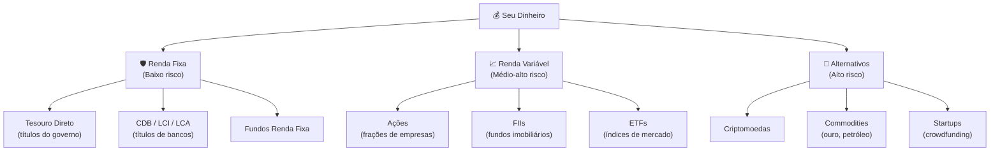
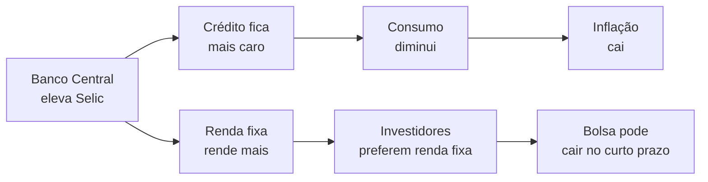
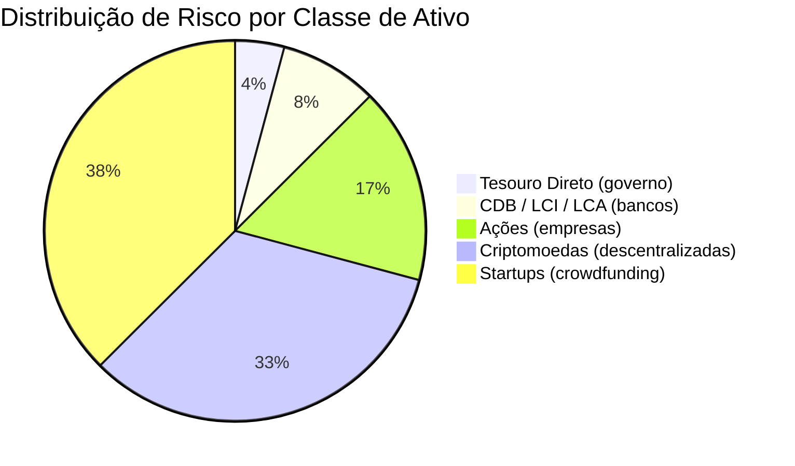

> [!tip] Estrutura do Conteúdo
> Podemos dividir nosso assunto em **duas grandes partes**. A `primeira` é a sua mentalidade sobre dinheiro, a parte teórica. Entra aqui o controle dos gastos, como economizar etc.
> 
> A `segunda`, é a parte prática de investir. Qual investimento fazer, quando, por que, usando qual corretora, como gerenciar os investimentos, etc.

---

## 1. 💵 Fundamentos do Dinheiro

### 💰 O que é Dinheiro

> [!info] Definição
> Meio de troca aceito para comprar bens e serviços.

- **História do dinheiro:** começou com escambo, passou por metais, papel-moeda e hoje inclui dinheiro digital.
- **Função do dinheiro na economia:** servir como meio de troca, reserva de valor e unidade de conta.

> [!video] Vídeo Recomendado
> [Dinheiro | Nerdologia](https://www.youtube.com/watch?v=5vpixQc3b2M)

### 📊 Conceitos de Valor e Inflação

- **Inflação:** aumento geral dos preços; reduz o poder de compra.
- **Índices de inflação:** IPCA, IGP-M e INPC medem a variação de preços.

> [!info] 📈 IPCA em 2026 (dado real)
> - Acumulado no ano (jan a mai/2026): **3,20%**
> - Acumulado em 12 meses: **4,72%**
> - Meta do Banco Central: **3%** (tolerância: 1,5 p.p. para cima ou baixo)
> - Expectativa Focus para fechamento de 2026: **4,89%**
>
> Isso significa que R$ 1.000 de janeiro de 2026 já compravam cerca de R$ 968 em termos reais até maio. A inflação corrói o dinheiro parado.

### 📋 Planejamento Financeiro Pessoal

- **Orçamento familiar:** controle de entradas e saídas de dinheiro.
- **Gastos fixos x variáveis:** fixos não mudam (aluguel), variáveis mudam (lazer).
- **Reserva de emergência:** valor guardado para imprevistos (3 a 6 meses de despesas).

> [!example] 🧪 Atividade: Monte seu Orçamento Pessoal
> **Ferramenta:** [Google Sheets](https://sheets.google.com) (gratuito, basta ter conta Google)
>
> **O que fazer:**
> 1. Abra uma planilha nova e crie três colunas: `Categoria`, `Valor Mensal (R$)`, `Tipo (Fixo/Variável)`.
> 2. Liste pelo menos 8 gastos reais seus (ou da sua família): aluguel, internet, mercado, transporte, lazer, streaming, etc.
> 3. Some os gastos fixos e os variáveis separadamente.
> 4. Calcule: `Renda mensal - Total de gastos = Sobra ou falta`.
>
> **Resultado observável:** você verá exatamente se fecha o mês no positivo ou negativo, e quais categorias pesam mais. Identifique 1 gasto variável que poderia cortar ou reduzir.

---

## 2. 🎓 Educação Financeira

### 🎯 Importância

> [!success] Benefícios
> Evita dívidas e promove estabilidade.

- **Hábitos saudáveis:** gastar menos do que ganha, comparar preços, evitar impulsos.
- **Controle de dívidas:** priorizar juros altos e renegociar quando possível.

### ⏰ Planejamento de Curto, Médio e Longo Prazo

Metas financeiras conforme tempo (ex: viagem, carro, aposentadoria).

| Horizonte | Prazo | Exemplos de Meta | Tipos de Investimento Adequados |
|-----------|-------|------------------|---------------------------------|
| Curto prazo | Até 1 ano | Viagem, notebook, reserva de emergência | Tesouro Selic, CDB liquidez diária |
| Médio prazo | 1 a 5 anos | Carro, entrada do imóvel, curso | CDB, LCI/LCA, Tesouro Prefixado |
| Longo prazo | 5+ anos | Aposentadoria, imóvel, independência | Ações, FIIs, Tesouro IPCA+ |

### 🚀 Liberdade Financeira

> [!tip] Definição
> Viver dos rendimentos sem depender do salário.

**Como alcançar:** poupar, investir e aumentar renda passiva.

> [!example] 🧪 Atividade: Calcule sua Data de Independência Financeira
> **Ferramenta:** [Calculadora do Cidadão (Banco Central)](https://www3.bcb.gov.br/CALCIDADAO/publico/exibirFormCorrecaoValores.do?method=exibirFormCorrecaoValores)
>
> **O que fazer:**
> 1. Acesse a calculadora e escolha a opção "Aplicação em renda fixa".
> 2. Simule: você investe R$ 500 por mês por 20 anos à taxa de 0,9% ao mês (aproximação da Selic atual de 14,5% a.a.).
> 3. Anote o valor final acumulado.
> 4. Divida esse valor por 0,008 (0,8% ao mês) para saber a renda passiva mensal que ele geraria.
>
> **Resultado observável:** você verá um número concreto e poderá comparar com sua necessidade mensal atual. Quanto maior a diferença entre o que ganha e o que gasta, mais rápido chega lá.

---

## 3. 📦 Tipos de Investimentos

![[Recursos/Empreendedorismo/Dinheiro e investimentos/tipos-investimentos.svg|Visão geral dos tipos de investimentos]]

### 🛡️ Renda Fixa

> [!success] Características
> Previsibilidade e segurança.

- **Tesouro Direto:** títulos públicos emitidos pelo governo.
- **CDB, LCI, LCA:** títulos de bancos com rentabilidade atrelada a taxas (CDI, Selic).
- **Fundos de renda fixa:** reúnem diversos ativos conservadores.

> [!info] 📊 Rendimentos Reais de Renda Fixa (junho/2026)
>
> | Investimento | Rendimento Estimado (a.a.) | IR? | Liquidez | Segurança |
> |---|---|---|---|---|
> | Poupança | ~10,15% (70% Selic) | Isento PF | Mensal (aniversário) | FGC até 250k |
> | Tesouro Selic | ~14,5% bruto / ~11,5% líquido | Sim (15% a 22,5%) | D+1 | Governo Federal |
> | CDB 100% CDI | ~14,4% bruto / ~11,4% líquido | Sim (15% a 22,5%) | Depende do emissor | FGC até 250k |
> | LCI / LCA | ~12,5% a 13% bruto | **Isento PF** | Carência mínima | FGC até 250k |
>
> Selic atual: **14,50% a.a.** (decisão Copom abr/2026). IPCA 12 meses: **4,72%**. Qualquer desses supera a inflação com folga.

### 📈 Renda Variável

> [!warning] Características
> Retorno incerto, maior risco.

- **Ações:** frações de empresas negociadas na bolsa.
- **FIIs:** fundos que investem em imóveis e pagam rendimentos.
- **ETFs:** fundos que replicam índices de mercado.

### 🔮 Investimentos Alternativos

- **Criptomoedas:** ativos digitais baseados em blockchain.
- **Commodities:** ouro, prata, petróleo etc.
- **Startups:** investimento coletivo em empresas novas (crowdfunding).

---

## 4. 🏦 Mercado Financeiro

### 📊 Bolsa de Valores

> [!info] Definição
> Ambiente de compra e venda de ativos.

- **Como operar:** via corretoras e home brokers.
- **Índices:** Ibovespa (Brasil), S&P500 (EUA).

> [!example] 🧪 Atividade: Acompanhe Ações e FIIs Reais
> **Ferramenta:** [Status Invest](https://statusinvest.com.br) (gratuito, sem cadastro necessário)
>
> **O que fazer:**
> 1. Acesse statusinvest.com.br e pesquise o ticker `PETR4` (Petrobras) na barra de busca.
> 2. Anote o preço atual, o dividend yield (rendimento de dividendos) e o P/L (preço/lucro).
> 3. Agora pesquise um FII: `MXRF11`. Veja o preço da cota e o DY (dividend yield).
> 4. Compare: qual dos dois pagou mais dividendos proporcionalmente no último ano?
>
> **Resultado observável:** você terá lido e interpretado dados reais de ativos financeiros negociados hoje na B3. Perceba que o DY de FIIs costuma ser mensal, enquanto ações pagam trimestralmente ou semestralmente.

### 💹 Taxa Selic

> [!tip] Taxa Básica de Juros do Brasil
> A Selic é a taxa-mãe de todos os investimentos de renda fixa. Quando ela sobe, a renda fixa fica mais atrativa; quando cai, o mercado busca renda variável.

- **Relação com inflação:** Selic alta controla preços; baixa estimula consumo.
- **Efeitos:** impacta rendimento da renda fixa e custo de crédito.

> [!info] Selic hoje: **14,50% a.a.** (atualizado 17/06/2026)
> O Copom reduziu 0,25 p.p. em abril/2026. Mercado projeta mais um corte em 2026, chegando a 14,25% no final do ano.

---

## 5. 👤 Perfil de Investidor

> [!tip] Identifique seu Perfil
> Escolha o perfil que melhor se adequa ao seu perfil de risco e objetivos.

- **🛡️ Conservador:** busca segurança; prefere renda fixa.
- **⚖️ Moderado:** aceita algum risco; mistura renda fixa e variável.
- **🚀 Agressivo:** aceita alta volatilidade; foco em ações e criptos.

| Perfil | Tolerância a Perdas | Horizonte Típico | Exemplos de Carteira |
|--------|---------------------|-----------------|----------------------|
| Conservador | Muito baixa | Curto a médio | 80% renda fixa, 20% FIIs |
| Moderado | Média | Médio a longo | 50% renda fixa, 30% ações, 20% FIIs |
| Agressivo | Alta | Longo prazo | 30% renda fixa, 50% ações, 20% alternativos |

> [!example] 🧪 Atividade: Descubra seu Perfil de Investidor Oficial
> **Ferramenta:** [Suitability da XP Investimentos](https://www.xpi.com.br/investimentos/perfil-de-investidor/) ou qualquer grande corretora (Rico, NuInvest, BTG)
>
> **O que fazer:**
> 1. Acesse o link e responda ao questionário de suitability (5 a 10 perguntas sobre renda, objetivos e tolerância a risco).
> 2. Anote o perfil que o sistema atribuiu a você.
> 3. Compare com a tabela acima: a carteira sugerida faz sentido para sua realidade?
>
> **Resultado observável:** você terá passado pelo mesmo processo que qualquer investidor real passa ao abrir conta em corretora. Esse resultado é usado por lei (Resolução CVM 30/2021) para orientar as recomendações de produtos.

---

## 6. ⚠️ Riscos e Diversificação

### ⚠️ Riscos de Mercado

- **Volatilidade:** variação de preços de ativos.
- **Risco de crédito:** chance de calote.

> [!warning] Interpretação
> Os valores acima são ilustrativos do **risco relativo** de cada classe, não de retorno esperado. Maior risco não significa maior retorno garantido, apenas maior variabilidade.

### 🎯 Diversificação

> [!success] Estratégia Fundamental
> Distribuir investimentos para reduzir perdas.

**Analogia simples:** não coloque todos os ovos na mesma cesta. Se uma empresa quebra e você tem 100% do dinheiro nela, perde tudo. Se tem 5% nela, perde apenas 5%.

### 🛡️ Estratégias de Proteção

- **Hedge:** uso de ativos para compensar perdas.
- **Descorrelação:** investir em ativos que reagem diferente às crises.

> [!example] 🧪 Atividade: Compare Poupança vs Tesouro Selic em números reais
> **Ferramenta:** [Calculadora do Tesouro Direto](https://www.tesourodireto.com.br/simulador/) (site oficial do governo)
>
> **O que fazer:**
> 1. Acesse o simulador do Tesouro Direto e simule R$ 5.000 aplicados em Tesouro Selic por 1 ano.
> 2. Anote o valor final (já com desconto de IR e taxa de custódia).
> 3. Agora calcule manualmente a poupança: R$ 5.000 × 1,1045 (rendimento estimado 10,45% a.a.) = R$ 5.522,50.
> 4. Compare os dois resultados.
>
> **Resultado observável:** você verá que mesmo após IR, o Tesouro Selic rende mais que a poupança em 2026 (Selic a 14,5% vs poupança a ~10,15%). Diferença real em reais, calculada por você.

---

## 7. 💸 Educação Tributária

### 💸 Impostos sobre Investimentos

- **IR:** incide sobre lucros em ações, FIIs e fundos.
- **IOF:** cobrado em resgates curtos.

> [!info] Tabela Regressiva de IR para Renda Fixa
>
> | Prazo de Aplicação | Alíquota de IR |
> |--------------------|----------------|
> | Até 180 dias | 22,5% |
> | 181 a 360 dias | 20,0% |
> | 361 a 720 dias | 17,5% |
> | Acima de 720 dias | **15,0%** |
>
> **Isentos de IR para pessoa física:** poupança, LCI, LCA, CRI, CRA e dividendos de ações e FIIs.

### 📋 Planejamento Tributário

> [!tip] Otimização
> Escolher investimentos e prazos que minimizem impostos.

**Exemplo prático:** aplicar em CDB por 6 meses (22,5% de IR) ou em LCI isenta de IR. Com Selic a 14,5%, uma LCA que paga 90% do CDI (~13,1% bruto) pode superar um CDB 100% CDI após o imposto no curto prazo.

---

## 8. 🧠 Comportamento do Investidor

### 🧠 Psicologia

> [!warning] Controle Emocional
> Controlar emoções evita decisões ruins.

- **FOMO:** medo de perder oportunidades leva a erros.
- **Ancoragem:** fixar em um preço passado e recusar vender abaixo dele, mesmo que o contexto mudou.
- **Efeito manada:** seguir o que todos estão fazendo sem análise própria (ex.: todos comprando Bitcoin, você compra no topo).

> [!warning] Os Maiores Erros Comportamentais
> 1. Vender na baixa por desespero (cristaliza o prejuízo)
> 2. Comprar na alta por FOMO (compra no pico)
> 3. Concentrar tudo em um único ativo
> 4. Ignorar a inflação (dinheiro na conta corrente perde valor)
> 5. Procrastinar: "vou começar ano que vem" (juros compostos precisam de tempo)

### ⏳ Disciplina e Paciência

> [!success] Princípios Fundamentais
> Investir com constância e foco no longo prazo.

**O poder dos juros compostos:** R$ 500 por mês investidos a 1% ao mês por 30 anos resultam em mais de R$ 1,7 milhão. Quem começa com 20 anos chega aos 50 com muito mais do que quem começa aos 35 anos com os mesmos aportes.

---

## 9. 💻 Tecnologia e Investimentos

### 💻 Plataformas Digitais

- **Home broker:** sistema online de compra e venda.
- **Fintechs:** empresas tecnológicas que facilitam investir.
- **Robôs de investimento:** automatizam decisões baseadas em perfil.

> [!info] Corretoras e Plataformas Populares no Brasil (2026)
>
> | Plataforma | Tipo | Destaque |
> |---|---|---|
> | [Tesouro Direto](https://www.tesourodireto.com.br) | Governo | Títulos públicos, taxa zero em muitas corretoras |
> | [NuInvest](https://www.nuinvest.com.br) | Fintech | App simples, CDB e ações |
> | [XP Investimentos](https://www.xpi.com.br) | Corretora | Grande variedade de produtos |
> | [BTG Pactual Digital](https://www.btgpactual.com) | Banco/Corretora | FIIs, ações, renda fixa |
> | [Status Invest](https://statusinvest.com.br) | Análise | Comparar dividendos, DY, histórico |
> | [Investidor10](https://investidor10.com.br) | Análise | Índices, indicadores econômicos |

### ⛓️ Blockchain e Criptoativos

> [!info] Tecnologia
> Garante segurança e descentralização.

- **Bitcoin (BTC):** primeira criptomoeda, reserva de valor digital, oferta limitada a 21 milhões de unidades.
- **Ethereum (ETH):** plataforma de contratos inteligentes (smart contracts).
- **Risco:** alta volatilidade, regulação incompleta, sem FGC.

> [!example] 🧪 Atividade: Simule uma Carteira Diversificada
> **Ferramenta:** [Investidor10](https://investidor10.com.br/carteira/) (gratuito, sem instalar nada)
>
> **O que fazer:**
> 1. Acesse a ferramenta de carteira e monte uma carteira fictícia de R$ 10.000 com pelo menos 3 classes de ativos: ex. R$ 5.000 em Tesouro Selic, R$ 3.000 em uma ação (VALE3 ou ITUB4), R$ 2.000 em um FII (MXRF11).
> 2. Observe o DY médio ponderado da carteira e a composição por setor.
> 3. Mude a alocação (ex.: tire renda fixa, coloque mais ações) e veja como o risco e o retorno esperado se alteram.
>
> **Resultado observável:** você praticará diversificação real com dados reais do mercado atual, sem arriscar nenhum dinheiro de verdade.

---

## 10. 📚 Estudo de Casos

### 🌟 Investidores de Sucesso

- **Buffett:** foco em valor
- **Dalio:** diversificação e ciclos econômicos

### 📊 Análise de Carteiras Reais

> [!tip] Aprendizado Prático
> Observar composição e resultados.

### ❌ Erros Comuns

> [!warning] Evite Estes Erros
> - Falta de planejamento
> - Seguir modas
> - Vender na baixa

---

> [!note] 📚 Fontes (2026)
> Dados coletados em junho de 2026 para fins didáticos. Rendimentos são estimativas com base nos índices vigentes e podem variar.
>
> - [Taxa Selic atual: 14,50% a.a. (Meelion, 17/06/2026)](https://www.meelion.com/indicadores-financeiros/selic/)
> - [Copom reduz Selic para 14,5% a.a. (Agência Brasil)](https://agenciabrasil.ebc.com.br/economia/noticia/2026-04/banco-central-reduz-juros-basicos-para-145-ao-ano)
> - [Poupança vs CDB vs Tesouro Direto 2026 (Seu Crédito Digital)](https://seucreditodigital.com.br/poupanca-vs-cdb-vs-tesouro-direto-2026/)
> - [IPCA acumulado 2026 (Investidor10)](https://investidor10.com.br/indices/ipca/)
> - [Boletim Focus: inflação prevista 4,86% em 2026 (Agência Brasil)](https://agenciabrasil.ebc.com.br/economia/noticia/2026-04/boletim-focus-mercado-preve-inflacao-de-486-em-2026)
> - [Calculadora do Cidadão (Banco Central do Brasil)](https://www3.bcb.gov.br/CALCIDADAO/)
> - [Simulador Tesouro Direto (site oficial)](https://www.tesourodireto.com.br/simulador/)
> - [Status Invest: análise de ativos reais](https://statusinvest.com.br)
