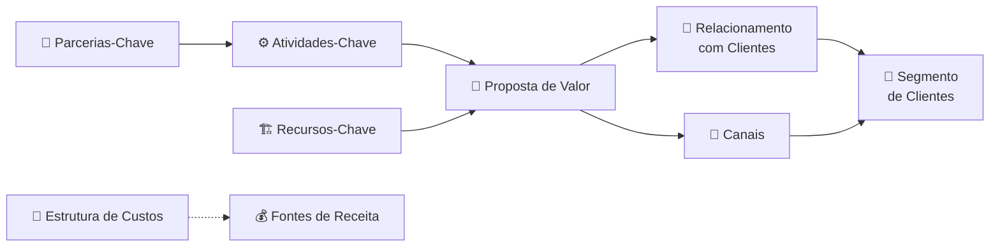
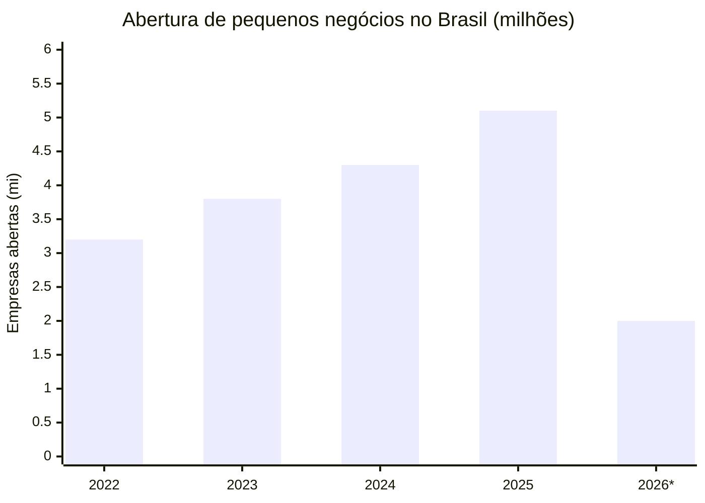
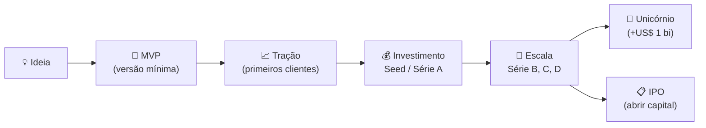
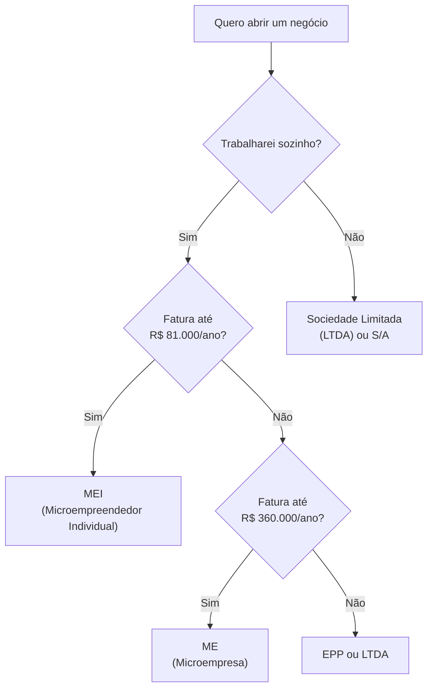
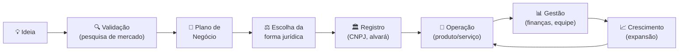

# Empreendedorismo de negócios

> [!info] Definição
> Empreendedorismo de negócios é o comportamento empreendedor vinculado à criação e gestão de empresas com objetivo de gerar lucro e valor no mercado.

---

## 🏢 Características do Empreendedor

![[Recursos/Empreendedorismo/Empreendedorismo de negócios/caracteristicas-empreendedor.svg|As 10 características do empreendedor]]

- **Autoconfiança**: acreditar na própria ideia e capacidade de decisão
- **Proatividade**: agir sem esperar ordens, antecipar problemas
- **Planejamento**: definir passos, prazos e objetivos claros
- **Busca por conhecimento**: estar sempre aprendendo e atento ao mercado
- **Resiliência**: superar obstáculos e manter foco nos objetivos
- **Tolerância ao risco calculado**: assumir desafios com consciência
- **Comprometimento**: colocar esforço, tempo e envolvimento pessoal
- **Adaptabilidade**: ajustar o rumo quando o mercado muda
- **Comunicação**: saber transmitir ideias, negociar e liderar
- **Orientação para qualidade**: entregar bem e buscar melhoria contínua

> [!tip] 💡 Empreendedor não nasce pronto
> Cada uma dessas características pode ser desenvolvida com prática, leitura, erros e experiências reais. Nenhum empreendedor de sucesso começou dominando todas.

### Perfil do empreendedor brasileiro (GEM 2025)

A Pesquisa GEM (Global Entrepreneurship Monitor) de 2025 revela que o Brasil está entre os países mais empreendedores do mundo. Alguns destaques:

- 57% dos MEIs acreditam que 2026 será ainda melhor do que 2025 para seus negócios
- O setor de Serviços lidera as novas aberturas (cerca de 64% do total)
- Em 2025, 5,1 milhões de empresas foram abertas no Brasil, recorde histórico

---

## 📄 Plano de Negócios

> [!tip] Ferramenta Essencial
> Documento formal que descreve o negócio: ideia, estrutura, mercado, estratégias, projeções financeiras e operação.

### Elementos Essenciais

1. **Resumo executivo**: visão geral clara do negócio e objetivos
2. **Descrição da empresa**: missão, visão, valores, estrutura
3. **Análise de mercado**: público-alvo, concorrência, tendências
4. **Estratégia e modelo de negócio**: como ganhar dinheiro, produto/serviço, canais
5. **Operações**: logística, localização, produção, fornecedores
6. **Plano financeiro**: projeções de receitas, despesas, fluxo de caixa
7. **Estratégia de crescimento**: planos de expansão
8. **Análise de riscos**: identificar desafios e como mitigá-los

### Para que Serve

- Identificar oportunidades e riscos
- Servir como guia estratégico para tomada de decisões
- Aumentar credibilidade junto a investidores, parceiros e fornecedores

> [!example] 🧪 Atividade: Analisar de onde vem a receita de uma empresa real
> **Escolha uma empresa conhecida** (Nubank, iFood, Magazine Luiza, Netflix Brasil, ou outra de sua preferência).
>
> 1. Acesse o site oficial da empresa e a aba "Relações com Investidores" (se disponível) ou pesquise no Google: `[nome da empresa] modelo de receita como ganha dinheiro`
> 2. Liste pelo menos 3 fontes de receita diferentes dessa empresa (ex: taxas, assinaturas, comissões, publicidade)
> 3. Estime qual dessas fontes é a **principal** e justifique sua resposta
>
> **Ferramentas sugeridas:** site oficial da empresa, [Sebrae](https://sebrae.com.br), Google Notícias
>
> **Resultado esperado:** você será capaz de explicar em 3 frases como aquela empresa ganha dinheiro, sem usar jargão genérico.

---

## 💰 Fontes de Receita de um Negócio

Uma das perguntas mais importantes para qualquer negócio é: **de onde vem o dinheiro?** O modelo de receita define como a empresa cobra pelo valor que entrega.

### Principais Tipos de Receita

| Tipo | Descrição | Exemplo Real |
|------|-----------|--------------|
| Venda direta | Produto ou serviço vendido uma única vez | Loja de roupas, padaria |
| Assinatura / Recorrência | Cliente paga mensalmente para continuar usando | Netflix, Spotify, planos de academia |
| Comissão / Taxa por transação | Percentual sobre cada negócio intermediado | iFood (cobra da loja por pedido), Mercado Livre |
| Licenciamento | Cobrança pelo direito de usar software ou marca | Microsoft Office, franquias |
| Publicidade | Receita ao exibir anúncios de terceiros | Google, Instagram, portais de notícias |
| Freemium | Versão gratuita + pago para funcionalidades extras | Spotify Free vs Premium, Canva |
| Serviços financeiros | Juros, tarifas e produtos de crédito | Nubank (juros do rotativo, empréstimos), C6 Bank |

> [!warning] ⚠️ Modelo de receita ≠ modelo de negócio
> O **modelo de negócio** é mais amplo: inclui quem são os clientes, o que entrega de valor, quais recursos usa e como se relaciona com parceiros. O **modelo de receita** é apenas a parte financeira desse modelo.

### Caso Real: Nubank

O Nubank é o maior banco digital do mundo fora da Ásia, com valuation acima de US\$ 30 bilhões. Sua receita vem de múltiplas fontes:

- Juros do cartão de crédito (rotativo e parcelamento)
- Spread de empréstimos pessoais
- Taxas de interchange (percentual cobrado dos lojistas a cada transação)
- Rendimentos sobre investimentos dos clientes
- Produtos premium (Ultravioleta)

> [!example] 🧪 Atividade: Mapear fontes de receita de um negócio local
> **Pense num negócio local que você conhece** (pode ser do seu bairro, cidade ou da sua família): uma lanchonete, barbearia, salão de beleza, farmácia, petshop, etc.
>
> 1. Acesse o **[Sebrae](https://www.sebrae.com.br)** e pesquise pelo setor desse negócio (ex: "como funciona modelo de receita barbearia")
> 2. Liste todas as fontes de receita que aquele negócio tem ou **poderia ter** (ex: barbearia: corte avulso, mensalidade, venda de produtos, barboterapia)
> 3. Identifique qual fonte de receita tem **maior margem** e qual tem **maior volume**
>
> **Resultado esperado:** você vai perceber que quase todo negócio pode ter mais de uma fonte de receita e que diversificar é uma estratégia para sobreviver em momentos de crise.

---

## 🗺️ Modelo de Negócio: Business Model Canvas

O **Business Model Canvas (BMC)** é uma ferramenta visual criada por Alexander Osterwalder que permite mapear o modelo de negócio inteiro em uma única página. É usado por startups, grandes empresas e empreendedores iniciantes no mundo todo.

### Os 9 blocos do Canvas

| Bloco | Pergunta Central |
|-------|-----------------|
| Segmento de Clientes | Para quem estamos criando valor? |
| Proposta de Valor | Que problema resolvemos ou que necessidade atendemos? |
| Canais | Como chegamos até o cliente? |
| Relacionamento com Clientes | Como mantemos o cliente engajado? |
| Fontes de Receita | Como o negócio ganha dinheiro? |
| Recursos-Chave | O que precisamos para funcionar? |
| Atividades-Chave | O que fazemos de mais importante? |
| Parcerias-Chave | Quem nos ajuda a operar? |
| Estrutura de Custos | Quais são os maiores gastos? |

### Exemplo: Canvas do iFood

| Bloco | iFood |
|-------|-------|
| Segmento | Consumidores famintos + restaurantes parceiros |
| Proposta de Valor | Comida entregue em casa de forma rápida e conveniente |
| Canais | Aplicativo iOS e Android |
| Relacionamento | Avaliações, cupons, suporte via chat |
| Fontes de Receita | Comissão por pedido (12 a 30% do valor) + planos de assinatura dos restaurantes |
| Recursos-Chave | Plataforma tecnológica + rede de entregadores |
| Atividades-Chave | Desenvolvimento do app, logística, marketing |
| Parcerias | Restaurantes, entregadores autônomos, Rappi (histórico) |
| Custos | Infraestrutura de tecnologia, entregadores, marketing |

---

## 📊 O Cenário Empreendedor no Brasil (2025-2026)

O Brasil vive um momento histórico no empreendedorismo. Os dados mostram que nunca se abriram tantas empresas no país como agora.

*2026: dados parciais (jan-abr)

### Tipos de empresa mais abertas em 2025

| Tipo | Quantidade | Perfil |
|------|-----------|--------|
| MEI (Microempreendedor Individual) | 3,8 milhões | Fatura até R\$ 81.000/ano, sem sócio |
| ME (Microempresa) | 927 mil | Fatura até R\$ 360.000/ano |
| EPP (Empresa de Pequeno Porte) | 207 mil | Fatura até R\$ 4,8 milhões/ano |

### Setores que mais crescem

- **Serviços**: 64% de todas as novas empresas (clínicas, escritórios, profissionais liberais)
- **Comércio**: 19,6% (lojas físicas e virtuais)
- **Indústria**: 7,6%
- **Construção civil**: 6,8%

> [!info] 🇧🇷 Por que o Brasil empreende tanto?
> Além do sonho de ter o próprio negócio, muitos abrem empresa por necessidade: desemprego, busca de renda extra ou formalização de trabalhos informais. O MEI foi criado justamente para facilitar essa formalização, reduzindo impostos e burocracia.

---

## 🦄 Startups e Unicórnios Brasileiros

Uma **startup** é uma empresa jovem que busca crescer rapidamente com um modelo de negócio escalável e repetível, geralmente apoiado em tecnologia.

Um **unicórnio** é uma startup avaliada em mais de US\$ 1 bilhão.

### Unicórnios brasileiros notáveis

| Empresa | Setor | Destaque |
|---------|-------|---------|
| Nubank | Fintech | Maior banco digital do mundo fora da Ásia |
| iFood | Foodtech | Mais de 80% do mercado de delivery no Brasil |
| Creditas | Fintech | Empréstimos com garantia (imóvel, veículo) |
| QuintoAndar | Proptech | Aluguel sem fiador, digital |
| Hotmart | Edtech / Creator Economy | Plataforma de cursos e infoprodutos |
| Gympass (Wellhub) | HR Tech | Acesso a academias via empresa |
| Vtex | E-commerce | Plataforma de comércio digital B2B |

> [!tip] 💡 Startups vs. Empresas Tradicionais
> Uma padaria pode ser um ótimo negócio, mas não é uma startup. Uma startup precisa ter potencial de crescer muito rápido (escalar) sem aumentar os custos na mesma proporção. Ex: o iFood pode dobrar o número de pedidos sem contratar o dobro de funcionários, porque a plataforma já existe.

---

## 🔍 Pesquisa de Mercado para Novos Negócios

Antes de abrir qualquer negócio, é fundamental entender o mercado: tamanho, concorrência, público e tendências.

### Ferramentas gratuitas para pesquisa de mercado

| Ferramenta | O que oferece | Link |
|-----------|--------------|------|
| DataSebrae | Dados de abertura de empresas, perfil por setor e região | [datasebrae.com.br](https://datasebrae.com.br) |
| IBGE | Dados demográficos, renda, consumo, censo | [ibge.gov.br](https://www.ibge.gov.br) |
| Portal do Empreendedor | Estatísticas de MEI por setor e município | [portaldoempreendedor.gov.br](https://www.portaldoempreendedor.gov.br/estatisticas) |
| Google Trends | Tendências de busca por produto ou serviço | [trends.google.com.br](https://trends.google.com.br) |
| Reclame Aqui | Ver reclamações dos concorrentes (dores do cliente) | [reclameaqui.com.br](https://reclameaqui.com.br) |

> [!example] 🧪 Atividade: Pesquisar o mercado de uma ideia de negócio
> Escolha uma ideia de negócio que você teria interesse em abrir (pode ser simples: lanche artesanal, serviço de manutenção, venda de artesanato, etc.).
>
> 1. Acesse o **[DataSebrae](https://datasebrae.com.br)** e pesquise quantas empresas do setor escolhido foram abertas no seu estado no último ano
> 2. Acesse o **[IBGE Cidades](https://cidades.ibge.gov.br)** e pesquise dados da sua cidade (população, renda média, atividades econômicas)
> 3. Pesquise no Google Trends o interesse ao longo do tempo pelo produto ou serviço que você quer oferecer (ex: "bolo no pote", "delivery saudável", "manutenção de notebook")
>
> **Resultado esperado:** ao final, você terá dados reais (não achismos) para responder: "Existe mercado para essa ideia aqui na minha cidade?"

---

## ⚖️ Formas Jurídicas de Empresa no Brasil

Ao abrir um negócio, é preciso escolher a forma jurídica adequada ao tamanho e objetivo da empresa.

| Forma | Limite de faturamento | Impostos | Ponto forte |
|-------|----------------------|---------|------------|
| MEI | R\$ 81.000/ano | DAS fixo (em torno de R\$ 76/mês) | Baixíssima burocracia |
| ME | R\$ 360.000/ano | Simples Nacional (alíquota por setor) | Permite sócios |
| EPP | R\$ 4,8 mi/ano | Simples Nacional | Mais espaço para crescer |
| LTDA | Sem limite | Lucro Presumido ou Real | Flexibilidade societária |
| S/A | Sem limite | Lucro Real | Pode abrir capital (IPO) |

---

## 🧭 Do Sonho ao CNPJ: Ciclo de Criação de um Negócio

Cada etapa exige decisões e competências diferentes. O empreendedor precisa transitar por todas elas, mesmo que conte com parceiros ou funcionários especializados.

---

> [!note] 📚 Fontes (2026)
> - [Sebrae: Empreendedorismo em alta, crescimento 14% em 2026](https://agenciasebrae.com.br/dados/empreendedorismo-em-alta-abertura-de-novos-pequenos-negocios-cresce-14-em-2026/)
> - [Sebrae: Recorde histórico, 5,1 milhões de empresas abertas em 2025](https://agenciasebrae.com.br/economia-e-politica/e-recorde-51-milhoes-de-empresas-foram-abertas-em-2025/)
> - [Seu Dinheiro: 4,9 milhões de pequenos negócios abertos em 2025](https://www.seudinheiro.com/2026/seu-negocio/recorde-brasil-registrou-abertura-de-49-milhoes-de-pequenos-negocios-em-2025-confira-os-setores-que-lideraram-cbcb/)
> - [Pesquisa GEM 2025, Sebrae/PR](https://sebraepr.com.br/impulsiona/gem-2025-o-retrato-do-empreendedorismo-no-brasil/)
> - [Distrito: Unicórnios brasileiros 2026](https://www.distrito.me/blog/lista-dos-unicornios-brasileiros)
> - [iFood e Nubank: Canvas do Modelo de Negócios](https://octanage.com/podcast/2020/nubank-ifood-canvas-modelo-negocios/)
> - [DataSebrae](https://datasebrae.com.br/)
> - [Sebrae: Modelo de negócio x modelo de receita](https://sebrae.com.br/sites/PortalSebrae/ufs/al/artigos/modelo-de-negocio-x-modelo-de-receita-entenda-a-diferenca,cce5e0f766b88810VgnVCM1000001b00320aRCRD)
