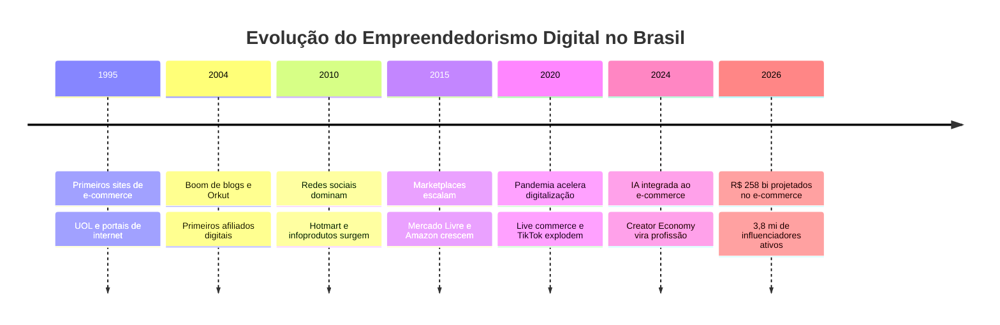
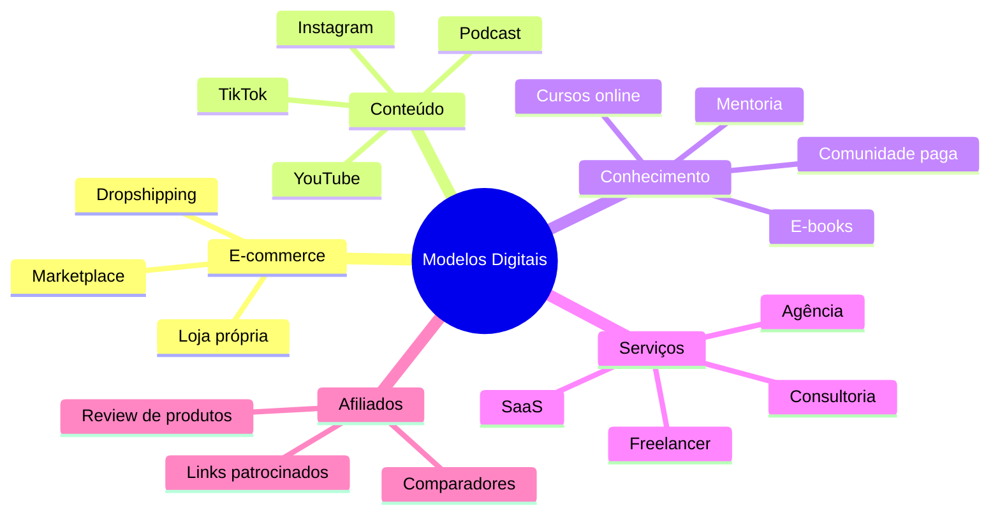
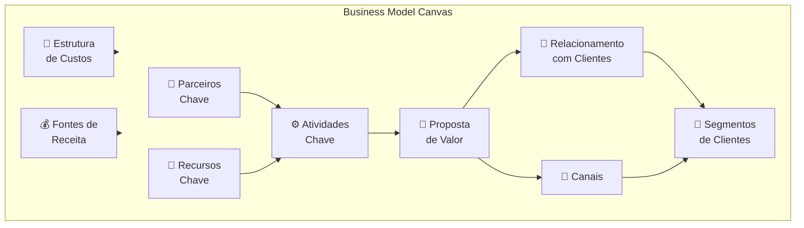
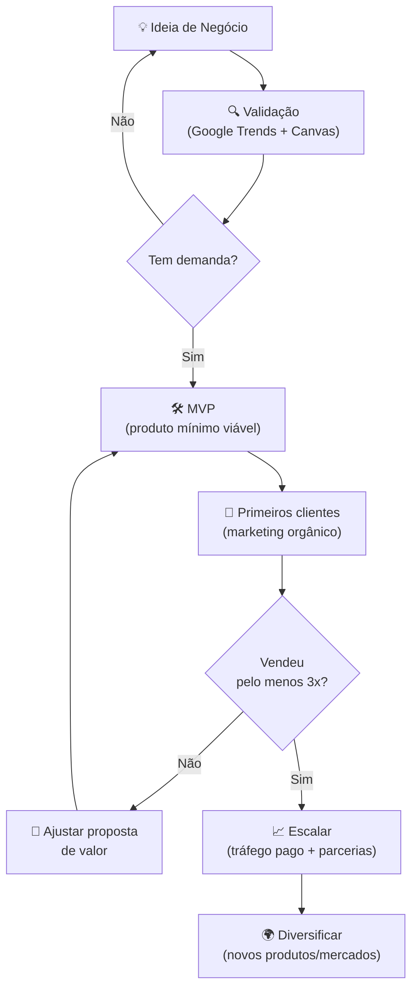

# Empreendedorismo digital

> [!info] 📊 O mercado digital em 2026
> O e-commerce brasileiro faturou mais de **R\$ 200 bilhões em 2025** e projeta **R\$ 258 bilhões em 2026** (ABComm). O Brasil é o **2º maior mercado de criadores de conteúdo do mundo**, com mais de 3,8 milhões de influenciadores ativos. **77,2% dos brasileiros** têm planos reais de empreender online em 2026 (Locaweb).

---

## 1. 🌐 Introdução ao Empreendedorismo Digital

- **Definição:** Negócios criados e operados principalmente através de plataformas digitais
- **História e Evolução:** Do e-commerce inicial às plataformas modernas
- **Importância na Era Tecnológica:** Oportunidades e transformações do mercado digital

> [!quote] Por que agora?
> "Em 2025, o Brasil registrou 3,9 milhões de novas empresas, sendo 97,6% delas micro e pequenos negócios. O canal digital deixou de ser diferencial e virou requisito mínimo." (Fonte: Sebrae / Serasa Experian, 2026)

---

## 2. 🧠 Fundamentos do Empreendedorismo Digital

### Mentalidade Empreendedora

- **Características essenciais:** Adaptabilidade, aprendizado contínuo, resiliência
- **Superando desafios:** Lidar com incerteza, competição e mudanças rápidas

> [!tip] Mindset de crescimento
> Empreendedores digitais de sucesso tratam cada fracasso como dado: o que não funcionou revela onde o mercado realmente está. Teste rápido, aprenda rápido, ajuste.

### Modelos de Negócios Digitais

![[Recursos/Empreendedorismo/Empreendedorismo digital/modelos-negocios-digitais.svg|Modelos de negócios digitais e estratégias de marketing]]

- **E-commerce:** Venda de produtos físicos online
- **Infoprodutos:** Cursos, e-books, consultorias digitais
- **Serviços Online:** SaaS, plataformas, assinaturas
- **Marketplaces:** Conectar compradores e vendedores

| Modelo | Exemplo real | Investimento inicial | Escalabilidade | Risco |
|--------|-------------|---------------------|----------------|-------|
| E-commerce próprio | Loja na Nuvemshop | Baixo (plano grátis) | Alta | Médio (estoque) |
| Marketplace vendedor | Vender no Mercado Livre | Baixíssimo | Média | Baixo |
| Infoproduto | Curso na Hotmart | Baixo (tempo) | Altíssima | Baixo |
| SaaS | App de assinatura | Alto (dev) | Altíssima | Alto |
| Creator Economy | Canal YouTube + afiliados | Baixíssimo | Média | Baixo |
| Freelancer digital | Upwork / 99Freelas | Zero | Baixa | Baixo |
| Afiliado | Indicar produtos de terceiros | Zero | Média | Baixíssimo |

> [!info] Creator Economy em números (2025)
> O mercado brasileiro de creators atingiu **US\$ 5,47 bilhões** em 2025, com projeção de **US\$ 33,5 bilhões até 2034**. Cerca de **9% dos influenciadores** vivem exclusivamente da renda digital. Entre os que faturam acima de R\$ 10.000/mês, a média é de **5 anos de experiência** e múltiplas fontes de receita.

### Análise de Mercado

- **Pesquisa de nicho:** Identificar oportunidades específicas
- **Identificação de público-alvo:** Definir persona e segmentação
- **Análise de concorrência:** Entender o mercado e diferenciação

> [!example] 🧪 Atividade 1: Validar um nicho no Google Trends
> **Ferramenta:** [trends.google.com.br](https://trends.google.com.br)
>
> **O que fazer:**
> 1. Acesse o Google Trends e selecione o país **Brasil**
> 2. Pesquise 3 termos relacionados a uma ideia de negócio sua (ex: "artesanato digital", "curso de culinária online", "pet shop delivery")
> 3. Clique em "Comparar" e adicione os 3 termos juntos
> 4. Filtre por **Últimos 12 meses** e anote:
>    - Qual termo tem maior volume?
>    - Há sazonalidade (picos em algum mês)?
>    - O interesse está crescendo ou caindo?
> 5. Clique em "Tópicos relacionados" e "Consultas relacionadas" e copie as 5 sugestões mais relevantes
>
> **Resultado observável:** Você terá uma tabela comparativa com dados reais de busca, mostrando qual nicho tem mais demanda no Brasil hoje e se essa demanda é crescente.

---

## 3. 📋 Planejamento e Estratégia

### Definição de Objetivos e Metas

Estabelecer objetivos claros e mensuráveis usando metodologias como [[Metodologia do vale do silício (OKR)]].

> [!tip] OKR simplificado para negócios digitais
> **Objetivo:** "Lançar meu primeiro produto digital em 60 dias"
> **Resultados-chave:** (1) Definir nicho validado pelo Google Trends até semana 2, (2) Criar uma landing page com 50 e-mails captados até semana 6, (3) Vender para pelo menos 3 pessoas antes de escalar.

### Plano de Negócios Digital

- **Sumário executivo:** Visão geral do negócio
- **Descrição do negócio:** Modelo e proposta de valor
- **Planejamento financeiro:** Projeções e estrutura de custos

> [!info] Business Model Canvas (BMC)
> O **Canvas** é uma ferramenta visual de 9 blocos criada por Alexander Osterwalder para descrever qualquer modelo de negócio em uma única página. Ferramentas gratuitas para criar o seu: [Canva](https://www.canva.com/pt_br/quadros-brancos/modelos-negocios/), [Miro](https://miro.com/templates/startup-canvas/), [FigJam](https://www.figma.com/templates/business-model-canvas-example/).

> [!example] 🧪 Atividade 2: Montar um Canvas digital no Canva
> **Ferramenta:** [canva.com/pt_br/quadros-brancos/modelos-negocios/](https://www.canva.com/pt_br/quadros-brancos/modelos-negocios/)
>
> **O que fazer:**
> 1. Crie uma conta gratuita no Canva (ou use sua conta do Google)
> 2. Abra o modelo "Business Model Canvas"
> 3. Escolha a ideia de negócio digital que você pesquisou no Google Trends
> 4. Preencha TODOS os 9 blocos com pelo menos 2 itens cada (pode usar post-its coloridos)
> 5. Exporte o resultado como **imagem PNG** ou **PDF**
>
> **Resultado observável:** Um arquivo PNG/PDF do seu Canvas preenchido, pronto para apresentar. Se qualquer bloco ficou em branco, é um sinal de que aquela parte do negócio ainda não foi pensada.

### Estratégias de Marketing Digital

- **SEO (Search Engine Optimization):** Otimização para mecanismos de busca
- **Marketing de Conteúdo:** Criação de conteúdo relevante
- **Redes Sociais:** Presença e engajamento nas plataformas
- **E-mail Marketing:** Comunicação direta com clientes
- **Anúncios Online:** Publicidade paga em plataformas digitais

| Canal | Custo | Tempo para resultado | Melhor para |
|-------|-------|----------------------|-------------|
| SEO | Baixo | Longo (3-12 meses) | Conteúdo evergreen |
| Tráfego pago (Google/Meta Ads) | Alto | Imediato | Produtos com margem boa |
| Instagram/TikTok orgânico | Zero | Médio (1-6 meses) | Creator economy, produtos visuais |
| E-mail marketing | Baixíssimo | Médio | Infoprodutos, recorrência |
| Marketplace (Mercado Livre) | Comissão por venda | Imediato | E-commerce de produtos físicos |

---

## 4. ⚙️ Operações e Gestão

### Criação de Conteúdo Digital

- **Blogs:** Artigos e posts educativos
- **Vídeos:** YouTube, TikTok, Instagram Reels
- **Podcasts:** Áudio para nichos específicos

> [!warning] Atenção: consistência vale mais que perfeição
> Publicar 1 vídeo por semana durante 6 meses supera publicar 10 vídeos num burst e sumir. O algoritmo das plataformas (YouTube, Instagram, TikTok) premia quem permanece ativo de forma consistente.

### Ferramentas e Tecnologias

- **Plataformas de E-commerce:** Shopify, WooCommerce, Mercado Livre
- **Ferramentas de Automação de Marketing:** Mailchimp, HubSpot
- **Sistemas de Pagamento Online:** Stripe, PayPal, PagSeguro

> [!info] Comparativo de plataformas de loja virtual (2026)
> | Plataforma | Plano grátis | Taxa por venda | Melhor para |
> |------------|-------------|----------------|-------------|
> | **Nuvemshop** | Sim (sem limite de produtos) | Não no grátis | Iniciantes no Brasil |
> | **Shopify** | Não (3 dias trial + R\$1/3 meses) | 0,5% a 2% | Escala internacional |
> | **Mercado Livre** | Sim | 12% a 16% | Produtos físicos com tráfego pronto |
> | **Hotmart** | Sim | 9,9% + R\$1/venda | Infoprodutos, cursos |
> | **Kiwify** | Sim | 5% + R\$1/venda | Infoprodutos brasileiros |

> [!example] 🧪 Atividade 3: Abrir uma loja virtual real em 30 minutos
> **Ferramenta:** [nuvemshop.com.br](https://www.nuvemshop.com.br)
>
> **O que fazer:**
> 1. Acesse a Nuvemshop e clique em "Criar loja grátis" (usa apenas CPF ou e-mail)
> 2. Escolha um nome para sua loja e a categoria (ex: "Roupas", "Tecnologia", "Artesanato")
> 3. Adicione pelo menos **3 produtos fictícios** com: foto (pode ser do Google), nome, descrição e preço
> 4. Configure a aparência: escolha um tema, defina cor e logo (pode ser texto)
> 5. Acesse a URL pública da sua loja (ex: `sualoja.lojavirtual.com.br`) e faça uma **captura de tela** da vitrine
>
> **Resultado observável:** Uma URL real e pública de uma loja virtual funcionando, com vitrine navegável, sem gastar R\$ 0,00. A captura de tela comprova que a loja está no ar.

### Gestão de Clientes

- **Atendimento ao Cliente:** Canais de suporte e resposta rápida
- **Feedback e Melhoria Contínua:** Coleta e análise de dados do cliente

> [!tip] Métrica essencial: NPS (Net Promoter Score)
> Pergunte ao cliente: "De 0 a 10, você recomendaria nosso produto a um amigo?" Promotores (9-10), Neutros (7-8), Detratores (0-6). NPS = % Promotores - % Detratores. Negócios digitais de sucesso monitoram isso mensalmente.

---

## 5. 🚀 Crescimento e Escala

- **Expansão de Mercado:** Novos segmentos e geografias
- **Parcerias Estratégicas:** Colaborações e alianças
- **Diversificação de Produtos e Serviços:** Ampliar ofertas
- **Internacionalização:** Expansão para mercados globais

> [!success] Escalabilidade: o superpoder do digital
> Um produto físico exige fabricar 1 unidade para cada cliente. Um curso online, um e-book ou um software escala para 100.000 clientes sem custo adicional de produção. Isso é a essência da escalabilidade digital.

> [!info] 500 mil novos vendedores no Mercado Livre em 2024
> Segundo dados do próprio Mercado Livre, mais de **500 mil novos vendedores** entraram na plataforma em 2024, muitos sem experiência prévia. Marketplace é a porta de entrada mais rápida para testar e-commerce com tráfego pronto.

---

## 6. ⚠️ Desafios e Soluções

- **Lidar com a Saturação do Mercado:** Diferenciação e inovação
- **Manutenção da Inovação:** Cultura de experimentação
- **Gestão de Riscos:** Planejamento e mitigação
- **Adaptação a Mudanças Tecnológicas:** Aprendizado contínuo

> [!warning] Cuidados essenciais para quem está começando
> - **Não investir antes de validar:** Muita gente cria o produto e só depois testa se alguém quer comprar. Valide primeiro (Google Trends, Canvas, conversa com potenciais clientes).
> - **Evitar o "shiny object syndrome":** Trocar de ideia toda semana é o maior inimigo do empreendedor iniciante.
> - **Separar pessoa física de jurídica:** Abra um MEI (gratuito em [gov.br/mei](https://www.gov.br/empresas-e-negocios/pt-br/empreendedor)) assim que começar a vender. Faturamento anual até R\$ 81.000.
> - **Cuidado com tráfego pago antes da hora:** Anúncio em produto não validado queima dinheiro. Orgânico primeiro.

| Desafio | Solução prática | Ferramenta |
|---------|----------------|------------|
| Não saber se tem demanda | Pesquisa Google Trends | trends.google.com.br |
| Produto sem diferenciação | Análise de concorrentes | Ubersuggest, SimilarWeb |
| Sem público inicial | Grupos e comunidades de nicho | Facebook Groups, Reddit, Discord |
| Tráfego caro | SEO + conteúdo orgânico | WordPress, Substack, YouTube |
| Abandono de carrinho (e-commerce) | E-mail de recuperação automática | Mailchimp (grátis até 500 contatos) |

---

## 7. 🏆 Estudos de Caso e Exemplos de Sucesso

- **Empreendedores Digitais de Destaque:** Casos reais de sucesso
- **Lições Aprendidas:** Insights e aprendizados
- **Estratégias Vencedoras:** Padrões de sucesso

> [!success] Casos reais brasileiros (2025-2026)
> **Hotmart:** Plataforma brasileira de infoprodutos que hoje processa bilhões em transações anuais. Criadores na plataforma que faturam mais de R\$ 10.000/mês têm em média **5 anos de experiência** e múltiplas fontes de receita.
>
> **Mercado Livre (vendedores):** Mais de **500 mil novos vendedores** entraram em 2024. Vendedores consistentes com nicho definido alcançam renda extra de R\$ 2.000-8.000/mês no primeiro ano.
>
> **Creator Economy:** O Brasil é o 2º maior mercado mundial de creators. Quem monetiza com múltiplas fontes (afiliados + UGC + infoproduto + patrocínio) tem receita mais estável do que quem depende só de uma plataforma.

> [!example] 🧪 Atividade 4: Analisar a presença digital real de uma marca
> **Ferramentas:** [similarweb.com](https://www.similarweb.com) (grátis, versão limitada) e Instagram
>
> **O que fazer:**
> 1. Escolha uma empresa digital brasileira que você admire (ex: Nubank, Nuvemshop, um influencer, uma loja do Mercado Livre)
> 2. No **SimilarWeb**, cole o domínio do site e anote:
>    - Visitas mensais estimadas
>    - Principais canais de tráfego (orgânico, pago, social, direto)
>    - País de origem do tráfego
> 3. No **Instagram** da mesma marca, anote: número de seguidores, frequência de posts, taxa de engajamento estimada (curtidas + comentários / seguidores × 100)
> 4. Escreva 3 observações sobre o que essa empresa faz bem no digital
>
> **Resultado observável:** Uma ficha de análise com dados reais (números de visitas, canais, engajamento) de uma empresa real, que você pode comparar com a ideia de negócio que está desenvolvendo.

---

## Trabalho prático

> [!TIP] Objetivo do trabalho
> Escolher um projeto digital que você goste para planejar uma fonte de renda com isso.

### Exemplos de projetos digitais

1. **Criar e vender cursos online:** Compartilhe seu conhecimento em programação, redes de computadores e empreendedorismo em plataformas como Udemy ou Teachable.
2. **YouTube:** Continue expandindo seu canal com conteúdo sobre produtividade e minimalismo, monetizando através de anúncios, patrocínios e superchats.
3. **Consultoria online:** Ofereça consultoria em suas áreas de especialização, como tecnologia e produtividade, através de plataformas como Zoom ou Skype.
4. **Escrever e vender e-books:** Elabore e-books sobre produtividade, minimalismo ou tecnologia e venda-os em plataformas como Amazon Kindle.
5. **Marketing de afiliados:** Promova produtos ou serviços de terceiros em seu canal do YouTube ou blog e ganhe comissões por vendas.
6. **Desenvolvimento de software:** Crie e venda seu próprio software ou ofereça seus serviços como freelancer em plataformas como Upwork ou Freelancer.
7. **Criação de conteúdo para redes sociais:** Produza conteúdo para empresas ou marcas, gerenciando suas contas de redes sociais.
8. **Blogs:** Crie um blog sobre produtividade e minimalismo, monetizando com anúncios, posts patrocinados e afiliados.
9. **Podcasts:** Inicie um podcast sobre temas que você domina e monetize com patrocínios, doações ou conteúdo exclusivo para assinantes.
10. **Venda de fotografias:** Se você tem habilidade com fotografia, venda suas imagens em bancos de imagens ou crie seu próprio site para vendê-las.

### Etapas do trabalho

1. Escolher e organizar seu computador (laboratório).
2. Escolher a ferramenta de gerenciamento do trabalho (sugiro o Notion).
3. Escolher o tema do projeto.
4. Fazer um rascunho do seu projeto. Tema, metas e objetivos. (usar chat gpt)
5. Faça uma lista dos 10 principais concorrentes ou inspirações para o projeto que você escolheu
6. Crie o planejamento do seu projeto. (utilize o chat gpt)
7. Crie uma lista de tarefas, incluindo a divisão da equipe (o que cada um irá fazer)

---

> [!note] 📚 Fontes (2026)
> - [E-commerce no Brasil 2026: dados e cenário atual (edrone)](https://edrone.me/br/blog/dados-ecommerce-brasil)
> - [Empreendedorismo digital é destaque em 2026 (Terra/Locaweb)](https://www.terra.com.br/economia/meu-negocio/brasileiros-encontram-no-empreendedorismo-digital-o-caminho-para-recomecar-em-2026,814a507e608f90565547a84111908cf2ehjyqh76.html)
> - [8 tipos de negócios digitais para investir em 2026 (Serasa Experian)](https://www.serasaexperian.com.br/conteudos/negocios-digitais/)
> - [Dados do e-commerce: tendências para 2026 (Nuvemshop)](https://www.nuvemshop.com.br/blog/dados-ecommerce/)
> - [Brasil: 2º maior mercado de creators do mundo (Report 360)](https://report360.com.br/brasil-se-firma-como-potencia-da-creator-economy-e-ja-e-o-segundo-maior-mercado-de-criadores-de-conteudo-no-mundo/)
> - [Creator Economy projeta US\$ 33,5 bi no Brasil até 2034 (Mundo do Marketing)](https://mundodomarketing.com.br/creator-economy-entra-em-fase-de-institucionalizacao-e-projeta-us-33-5-bilhoes-no-brasil-ate-2034/)
> - [Como usar Google Trends para validar nichos (Shopify Brasil)](https://www.shopify.com/br/blog/como-encontrar-produtos-com-o-google-trends)
> - [Como criar loja virtual na Nuvemshop: passo a passo 2026](https://www.nuvemshop.com.br/blog/como-criar-sua-loja-virtual-nuvemshop/)
> - [7 Tendências de Infoprodutos para 2025 (Panda Video)](https://www.pandavideo.com/br/blog/tendencias-do-mercado-digital)
> - [Tendências de empreendedorismo 2026 (Sebrae RS)](https://digital.sebraers.com.br/blog/empreendedorismo/tendencias-de-empreendedorismo-2026-para-ficar-de-olho/)
