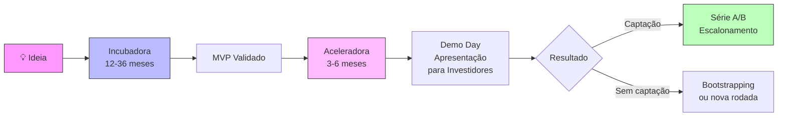
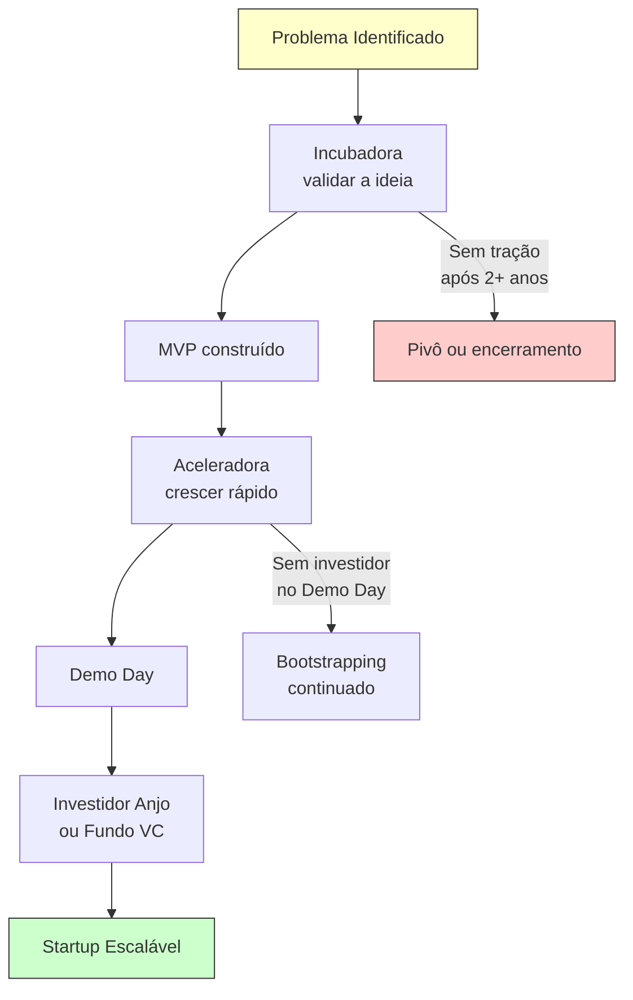

# Incubadora e aceleradora (o que é)

> [!info] Diferença Principal
> **Incubadoras** apoiam negócios nos estágios iniciais (ideia ou protótipo). **Aceleradoras** trabalham com startups que já têm progresso (MVP, primeiros clientes) e precisam de crescimento rápido.

![[Recursos/Empreendedorismo/Incubadora e aceleradora (o que é)/incubadora-vs-aceleradora.svg|Comparativo entre Incubadora e Aceleradora]]

---

## 🏗️ Incubadora

### Características
- **Estágio ideal**: ideia ou protótipo, muitas vezes sem produto ainda
- **Duração**: flexível, de 12 meses a vários anos
- **Foco**: estruturar a ideia, validar modelo, desenvolver produto
- **Seleção**: menos competitiva, aceita ideias com menos maturidade
- **Financiamento**: nem sempre oferece investimento direto
- **Suporte**: espaço físico, mentoria menos intensiva, adaptação ao ritmo

### Benefícios
- Espaços físicos compartilhados
- Networking local
- Suporte cuidado e personalizado
- Menor pressão para escalonamento rápido

### 🇧🇷 Exemplo real: CIETEC (USP/IPEN, São Paulo)
- Considerada a maior incubadora tecnológica do Brasil
- Fica no Campus do IPEN (Cidade Universitária, SP), com cerca de 25.000 m²
- Funciona por ciclos: **Descoberta** (até 12 meses), **Negócio** (até 36 meses) e **Aceleração** (até 36 meses)
- Em 2025, o programa **DNA CIETEC Batch 3** selecionou 15 startups deep tech em parceria com FIESP
- Critérios de seleção: grau de inovação, perfil empreendedor, potencial de mercado e impacto
- Não exige equity: o suporte é gratuito para empresas incubadas
- Mais informações: [cietec.org.br](https://cietec.org.br)

---

## 🚀 Aceleradora

### Características
- **Estágio ideal**: já tem MVP ou tração inicial
- **Duração**: programas formais de 3 a 6 meses
- **Foco**: crescimento rápido, preparação para investimento, escalonamento
- **Seleção**: altamente seletiva, avalia potencial de crescimento
- **Financiamento**: geralmente oferece capital seed em troca de equity
- **Suporte**: mentoria intensa, workshops, mentor individual, metas claras

### Benefícios
- Rápido acesso a investidores
- Mentores de alto impacto
- Oportunidade de visibilidade
- Crescimento acelerado

### 🌎 Exemplo real: Y Combinator (EUA, desde 2005)
- Considerada a aceleradora mais influente do mundo
- Batches **W26** (Winter 2026) e **Spring 2026** contaram com 196 startups lançadas
- O batch Spring 2026 foi descrito como "o mais focado em agentes de IA" da história do YC
- Taxa de aceite: cerca de 1% dos candidatos
- Investimento: YC investe capital seed em troca de participação societária (equity)
- As startups participam presencialmente em San Francisco por aprox. 3 meses
- Prazo para o Fall 2026 batch: **27 de julho de 2026**, resposta até 28 de agosto
- Exemplos de empresas graduadas: Airbnb, Dropbox, Stripe, Reddit, DoorDash
- Mais informações: [ycombinator.com/apply](https://www.ycombinator.com/apply)

### 🇧🇷 Exemplo real: InovAtiva Brasil (governo federal, gratuita)
- Programa de aceleração gratuito vinculado ao Ministério do Desenvolvimento, Indústria, Comércio e Serviços (MDIC)
- Ciclo 2025: selecionou até **90 startups** no InovAtiva Brasil e até **30 no InovAtiva de Impacto Socioambiental**
- Duração: 21 semanas de imersão
- Requisitos: startup formalizada como PJ, com até 10 anos de inscrição, em fase de validação, operação ou tração
- **Não exige equity**: é 100% gratuito e sem participação societária
- Oferece: mentorias especializadas, conexão com investidores, acesso a conteúdos de empreendedorismo e novas tecnologias
- Mais informações: [inovativa.online](https://www.inovativa.online/inovativa-brasil/)

### 🇧🇷 Exemplo real: ACE Ventures (Brasil, São Paulo)
- Fundada em 2012, uma das mais ativas do país
- Mais de 150 investimentos realizados, com 32 exits registrados
- Investe entre R$ 500 mil e R$ 2 milhões por startup
- Participação societária (equity): entre 8% e 15%, conforme estágio e negociação
- Em 2026, abriu trilha específica para startups de **Inteligência Artificial**
- Em parceria com a aceleradora americana **Gener8tor**, passou a atrair startups dos EUA para o mercado brasileiro
- Mais informações: [aceventures.com.br](https://aceventures.com.br)

### 🇧🇷 Exemplo real: Darwin Startups (Florianópolis, SC)
- Eleita a melhor aceleradora do Brasil por quatro anos consecutivos (dado de 2021)
- Especializada em **fintech, big data/analytics e IT/telecom**
- Parceiros corporativos: B3, Grupo J. Safra, RTM, Sinqia, Transunion
- Duração: 3 meses de aceleração em Florianópolis
- Investimento: R$ 200.000 por startup em troca de 7% de equity (pode variar por maturidade)
- Pacote total de benefícios pode alcançar R$ 500.000 (cloud, CRM, ferramentas de marketing)
- Mais informações: [darwinstartups.com](https://www.darwinstartups.com)

---

> [!tip] Jornada Completa
> Um empreendedor pode passar primeiro por uma incubadora e, depois, por uma aceleradora. Não são mutuamente exclusivas.

---

## 📊 Comparativo: Incubadora vs. Aceleradora

| Critério | Incubadora | Aceleradora |
|---|---|---|
| Estágio da startup | Ideia/protótipo | MVP com tração inicial |
| Duração | 12 meses a vários anos | 3 a 6 meses (programa fixo) |
| Ritmo | Flexível, adaptado | Intensivo, metas semanais |
| Seleção | Menos competitiva | Altamente seletiva (1% no YC) |
| Equity | Geralmente não exige | Geralmente exige (7% a 15%) |
| Espaço físico | Frequentemente oferece | Nem sempre (muitos são remotos) |
| Investimento financeiro | Raramente | Frequentemente (capital seed) |
| Foco | Estruturar e validar | Crescer e captar investimento |
| Exemplo BR | CIETEC (USP/SP) | InovAtiva Brasil, ACE, Darwin |
| Exemplo mundial | Tecnopuc (RS), Incamp (Unicamp) | Y Combinator (EUA), Techstars |

---

## 🗺️ O Ecossistema no Brasil (2025)

> [!abstract] Números do Ecossistema Brasileiro
> Segundo dados da Anprotec e fontes setoriais:
> - Aproximadamente **384 incubadoras** ativas no Brasil
> - Mais de **2.600 startups** atualmente incubadas
> - Mais de **2.500 empresas já graduadas**
> - Geração de mais de **45 mil empregos diretos**
> - Faturamento anual superior a **R$ 4 bilhões**
> - Cerca de **65 aceleradoras** atuando no país
> - Total de empresas inovadoras envolvidas: **ordem de 10 mil**

---

## 🔄 Fluxo: Do Ideia ao Investidor

---

## 🔁 Ciclo de Vida de uma Startup no Ecossistema

---

## 🧪 Atividades Mão na Massa

> [!example] 🧪 Atividade 1: Explore um batch real do Y Combinator
>
> **Objetivo:** Conhecer startups reais que passaram por uma das aceleradoras mais prestigiadas do mundo.
>
> **O que fazer:**
> 1. Acesse [ycombinator.com/companies?batch=Spring+2026](https://www.ycombinator.com/companies?batch=Spring+2026)
> 2. Escolha 3 startups do Spring 2026 batch que chamem sua atenção
> 3. Para cada uma, registre: nome, setor, problema que resolve, estágio quando entrou no YC
> 4. Compare: qual das três você considera com maior potencial? Por quê?
>
> **Resultado observável:** Uma tabela com 3 startups reais, seus setores e uma justificativa de escolha escrita pelo próprio aluno. A comparação revela padrões de quais problemas estão recebendo investimento em 2026.

---

> [!example] 🧪 Atividade 2: Compare uma incubadora e uma aceleradora reais
>
> **Objetivo:** Entender na prática as diferenças de modelo, requisitos e benefícios entre os dois tipos de suporte.
>
> **O que fazer:**
> 1. Acesse o site da **InovAtiva Brasil** ([inovativa.online](https://www.inovativa.online)) e leia os requisitos de inscrição e o que a aceleradora oferece
> 2. Acesse o site da **CIETEC** ([cietec.org.br](https://cietec.org.br)) e leia como funciona a incubação e quais são as etapas
> 3. Monte uma tabela com pelo menos 4 critérios comparativos (ex: duração, equity, quem pode se inscrever, o que oferecem)
> 4. Responda: se você tivesse uma ideia de startup hoje (mas sem produto), qual dos dois escolheria? Se tivesse um MVP com 10 clientes pagantes, qual escolheria?
>
> **Resultado observável:** Uma tabela comparativa preenchida com dados reais dos dois sites + dois parágrafos de decisão pessoal fundamentados. Não vale chutar: os dados precisam vir dos sites.

---

> [!example] 🧪 Atividade 3: Simule uma inscrição na InovAtiva Brasil
>
> **Objetivo:** Compreender quais critérios uma aceleradora real usa para avaliar uma startup.
>
> **O que fazer:**
> 1. Acesse o regulamento 2025 da InovAtiva Brasil (disponível em [inovativa.online](https://www.inovativa.online/inovativa-brasil/))
> 2. Invente uma startup fictícia (pode ser simples: ex. app de carona rural, plataforma de troca de livros, sistema de gestão para feirantes)
> 3. Preencha mentalmente os critérios: a startup é elegível? (PJ formalizada? Até 10 anos? Fase de validação/operação/tração?)
> 4. Liste 3 pontos fortes e 3 pontos fracos da sua startup fictícia segundo os critérios do programa
>
> **Resultado observável:** Uma ficha da startup fictícia com: nome, problema resolvido, estágio atual, elegibilidade (sim/não + justificativa), 3 pontos fortes e 3 pontos fracos para a inscrição. Exercício prepara para o mundo real de captação de recursos.

---

> [!note] 📚 Fontes (2026)
>
> - [Y Combinator: Apply](https://www.ycombinator.com/apply): requisitos e informações do programa (Fall 2026 deadline: 27/jul/2026)
> - [Y Combinator Spring 2026 Cohort](https://www.ycombinator.com/companies?batch=Spring+2026): lista das 196 startups do batch Spring 2026
> - [InovAtiva Brasil: Programa](https://www.inovativa.online/inovativa-brasil/): aceleradora gratuita do governo federal (ciclo 2025: 90 startups)
> - [InovAtiva: Regulamento 2025 (PDF)](https://www.inovativa.online/wp-content/uploads/2025/03/Regulamento-2025.pdf): critérios e regras oficiais
> - [ACE Ventures](https://aceventures.com.br): aceleradora privada BR, R$500k-2M por startup, 8-15% equity
> - [Darwin Startups](https://www.darwinstartups.com): fintech/analytics, R$200k seed, 7% equity, Florianópolis
> - [CIETEC: Incubadora SP](https://cietec.org.br/incubadora-sp/): maior incubadora tecnológica do Brasil (USP/IPEN)
> - [Anprotec: Sobre](https://anprotec.org.br/site/sobre/): dados do ecossistema brasileiro de incubadoras
> - [Guia de Aceleradoras 2026: Baita](https://baita.ac/tudo-sobre/aceleradora-startups): panorama das principais aceleradoras do Brasil
