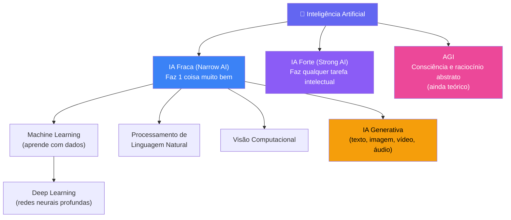
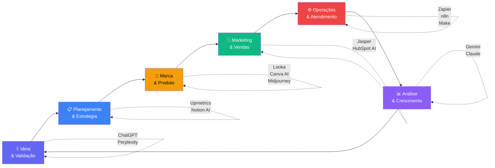
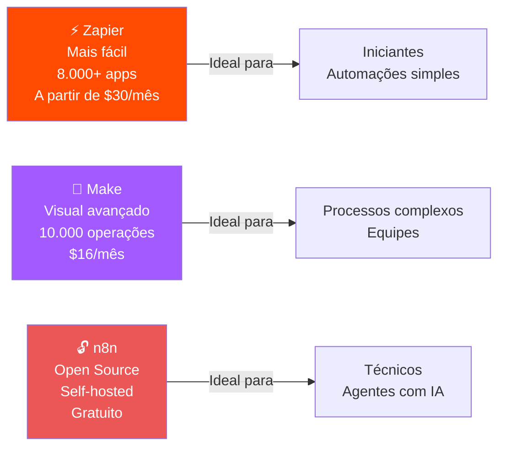

# Inteligência Artificial

---

## 🧠 Introdução à Inteligência Artificial

### Definições básicas

> [!INFO] Definição
> Inteligência Artificial (IA) é a capacidade de sistemas computacionais realizarem tarefas que normalmente requerem inteligência humana, como reconhecimento de padrões, tomada de decisões e processamento de linguagem natural.

> [!quote] Por que isso importa para empreendedores?
> O mercado global de IA deve ultrapassar **US$ 300 bilhões em 2025**. A Y Combinator estima que mais de **300 unicórnios** (empresas avaliadas em mais de US$ 1 bilhão) surgirão no setor de IA vertical nesta década. Em média, ferramentas de IA economizam **13 horas por semana** para pequenos empresários.

### Tipos de IA

![[Recursos/Empreendedorismo/Inteligência Artificial/tipos-ia.svg|Tipos de IA e principais subáreas]]

- **IA Fraca (Narrow AI):** Especializada em tarefas específicas (ex: assistentes virtuais, reconhecimento facial)
- **IA Forte (General AI):** Capacidade de realizar qualquer tarefa intelectual que um humano pode fazer
- **IA Geral (AGI):** Nível teórico de IA com consciência e capacidade de raciocínio abstrato



### Principais subáreas

- **Machine Learning (Aprendizado de Máquina):** Sistemas que aprendem com dados sem programação explícita
- **Deep Learning (Aprendizado Profundo):** Redes neurais com múltiplas camadas para reconhecimento de padrões complexos
- **Processamento de Linguagem Natural (NLP):** Compreensão e geração de linguagem humana
- **IA Generativa:** Criação de conteúdo novo (texto, imagens, áudio, vídeo) baseado em padrões aprendidos
- **Visão Computacional:** Análise e interpretação de imagens e vídeos
- **Robótica:** Integração de IA em sistemas físicos

---

## 🛠️ Ferramentas e plataformas (2026)

### Ferramentas de texto e conversação

#### Principais Assistentes de IA

- **ChatGPT** (OpenAI): Assistente conversacional mais popular, versátil em escrita natural e criativa. Versões gratuita e paga (GPT-4)
- **Claude** (Anthropic): Foco em segurança, controle de dados e análise de documentos longos. Boa para tarefas que exigem precisão
- **Gemini** (Google): Integração com ecossistema Google, experiência multimodal (texto, imagem, vídeo). Versão gratuita robusta
- **Perplexity AI**: Especializada em pesquisa com respostas baseadas em fontes confiáveis e atualizadas. Ideal para busca informativa
- **DeepSeek**: Alternativa open source com precisão em análises técnicas e programação
- **Microsoft Copilot**: Integrado ao ecossistema Microsoft (Office, Windows). Baseado em modelos da OpenAI

> [!tip] Escolha da Ferramenta
> Não há uma "melhor absoluta". Cada ferramenta se especializa em aspectos diferentes:
> - **Tarefas gerais:** ChatGPT ou Gemini
> - **Pesquisa e fontes:** Perplexity ou DeepSeek
> - **Integração com Google:** Gemini
> - **Integração com Microsoft:** Copilot
> - **Análise de documentos longos:** Claude

### Ferramentas de geração de imagens

- **Midjourney**: Geração de imagens artísticas de alta qualidade. Acesso via Discord
- **DALL-E 3** (OpenAI): Integrado ao ChatGPT, geração de imagens realistas e artísticas
- **Stable Diffusion**: Modelo open source, disponível em várias plataformas (Stable Diffusion WebUI, DreamStudio)
- **Adobe Firefly**: Integrado ao ecossistema Adobe, focado em profissionais de design
- **Leonardo.ai**: Plataforma com múltiplos modelos e ferramentas de edição
- **Runway ML**: Especializado em geração e edição de vídeos com IA

### Ferramentas de geração de áudio e vídeo

- **Suno AI / Udio**: Geração de música e áudio
- **ElevenLabs**: Síntese de voz natural e clonagem de voz
- **Runway ML**: Edição e geração de vídeo com IA
- **Pika Labs**: Geração de vídeos curtos a partir de texto ou imagens

### Ferramentas para programação

- **Claude Code**: Versão especializada do Claude para programação e análise de código
- **GitHub Copilot**: Assistente de código integrado ao editor
- **Cursor**: Editor de código com IA integrada
- **Codeium**: Alternativa gratuita ao Copilot
- **Tabnine**: Autocompletar de código com IA

> [!TIP] Manter-se atualizado
> O campo da IA evolui rapidamente. Novas ferramentas e atualizações surgem constantemente. É importante experimentar e acompanhar as novidades para identificar as melhores opções para cada necessidade específica.

---

## 🚀 Aplicações no Empreendedorismo

### Automação de processos
- Atendimento ao cliente com chatbots
- Geração de conteúdo para marketing
- Análise de dados e relatórios

### Criação de produtos e serviços
- Desenvolvimento de software assistido por IA
- Design e criação visual
- Personalização de experiências

### Análise e tomada de decisão
- Análise de mercado e tendências
- Geração de insights a partir de dados
- Planejamento estratégico assistido

---

## 🗺️ IA no Ciclo de Vida de um Negócio

A IA não serve apenas para uma etapa do negócio. O diagrama abaixo mostra como ela pode ser aplicada em cada fase:



---

## 🎯 IA para Validar e Planejar um Negócio

Uma das aplicações mais imediatas da IA para empreendedores é **acelerar a etapa de ideação e planejamento**. Ferramentas como ChatGPT conseguem estruturar um plano de negócios completo em menos de 5 minutos, incluindo diagnóstico de mercado, proposta de valor e projeções iniciais.

> [!warning] Cuidado com respostas genéricas
> A qualidade da resposta da IA depende diretamente da qualidade do prompt. Pedir "me faça um plano de negócio" dá resultado fraco. O segredo é **co-criar**, fornecendo dados reais do seu contexto.

### Prompt modelo para plano de negócio

```
Aja como um consultor de negócios experiente.
Vou te dar informações sobre minha ideia e você vai me ajudar
a criar um plano de negócio estruturado.

Minha ideia: [descreva em 2-3 frases]
Público-alvo: [quem vai comprar]
Diferenciais: [por que é melhor que o que já existe]
Recursos disponíveis: [dinheiro, tempo, habilidades]

Com base nisso, gere:
1. Sumário executivo
2. Proposta de valor
3. Análise de concorrentes
4. Canais de venda
5. Projeção de receita (cenário conservador e otimista)
```

> [!example] 🧪 Atividade: Plano de Negócio em 10 Minutos
> **Site:** [chat.openai.com](https://chat.openai.com) ou [claude.ai](https://claude.ai)
> 
> 1. Pense em um negócio que você abriria (pode ser fictício, mas realista)
> 2. Preencha o prompt modelo acima com os dados do seu negócio
> 3. Cole o prompt no ChatGPT ou Claude e gere o plano
> 4. Leia o resultado e identifique: **1 ponto forte** e **1 ponto que a IA errou ou deixou vago**
> 5. Faça uma pergunta de acompanhamento para melhorar o ponto fraco
> 
> **Resultado esperado:** um documento com 5 seções preenchidas + aprendizado sobre como refinar prompts

---

## 🎨 IA para Criar a Identidade Visual da Marca

A identidade visual (logo, cores, tipografia) costumava exigir um designer caro. Com IA, qualquer empreendedor consegue criar uma marca profissional em minutos.

| Ferramenta | Destaque | Plano gratuito | Link |
|-----------|---------|----------------|------|
| **Canva AI** | Integrado ao design, fácil de usar | Sim | canva.com |
| **Looka** | Gera logo + kit completo de marca | Parcial (preview) | looka.com |
| **LogoAI** | Foca em consistência da marca | Não | logoai.com |
| **Leonardo.ai** | Alta qualidade artística, múltiplos estilos | Sim (créditos) | leonardo.ai |
| **Midjourney** | Melhor qualidade artística geral | Não | midjourney.com |

> [!example] 🧪 Atividade: Crie o Logo do Seu Negócio
> **Site:** [canva.com/ai-logo-generator](https://www.canva.com/ai-logo-generator/) (gratuito) ou [looka.com](https://looka.com) (gratuito para preview)
> 
> 1. Use o negócio criado na atividade anterior (ou escolha um novo)
> 2. Acesse o gerador de logo do Canva ou Looka
> 3. Descreva o negócio, escolha o estilo visual e as cores
> 4. Gere pelo menos **3 opções diferentes**
> 5. Escolha a melhor e exporte (ou salve um screenshot)
> 
> **Resultado esperado:** um logo digital pronto para uso em apresentações, cartão de visita ou redes sociais

---

## 🔍 Descobrindo Ferramentas para Qualquer Objetivo

Para qualquer problema de negócio, provavelmente já existe uma IA resolvendo. O site [There's An AI For That](https://theresanaiforthat.com) cataloga **mais de 5.000 ferramentas de IA** organizadas por categoria e tarefa.

### Categorias mais úteis para empreendedores

| Categoria | Exemplos de ferramentas | Para quê usar |
|-----------|------------------------|---------------|
| **Escrita e marketing** | Jasper, Copy.ai, Writesonic | Posts, emails, copies de venda |
| **Design e imagem** | Canva AI, Midjourney, Adobe Firefly | Logos, banners, fotos de produto |
| **Atendimento ao cliente** | Tidio, Intercom AI, ManyChat | Chatbots no site e WhatsApp |
| **Planejamento** | Notion AI, Upmetrics, Bizplanr | Planos de negócio, organização |
| **Automação** | Zapier, Make, n8n | Conectar apps, eliminar tarefas manuais |
| **Análise de dados** | Tableau AI, Power BI Copilot | Relatórios e dashboards automáticos |
| **Vídeo e apresentação** | Synthesia, Tome, Gamma | Vídeos e slides gerados por IA |

> [!example] 🧪 Atividade: Caça às Ferramentas
> **Site:** [theresanaiforthat.com](https://theresanaiforthat.com)
> 
> 1. Pense em uma tarefa **repetitiva e chata** que existe em qualquer negócio (ex: responder emails, criar relatórios, postar nas redes sociais)
> 2. Acesse o site e pesquise por essa tarefa na barra de busca (em inglês, ex: "email", "social media", "invoice")
> 3. Escolha **2 ferramentas** que pareçam resolver o problema
> 4. Para cada uma, anote: nome, o que faz, tem plano gratuito (sim/não), e em qual negócio você usaria
> 
> **Resultado esperado:** uma mini-lista pessoal de ferramentas de IA úteis para o seu contexto

---

## ⚙️ Automação de Tarefas com IA

Automatizar processos repetitivos é uma das maiores vantagens competitivas que a IA oferece para pequenas empresas. As principais plataformas de automação (sem necessidade de programar) são:



### Exemplos práticos de automação para pequenas empresas

- **Loja online:** novo pedido no site aciona automaticamente email de confirmação + planilha de controle + notificação para o estoque
- **Prestador de serviços:** cliente preenche formulário e o sistema agenda reunião, envia contrato e cria tarefa no Trello
- **Criador de conteúdo:** post publicado no Instagram gera automaticamente tweet + salva na pasta do Google Drive
- **Restaurante:** avaliação negativa no Google é detectada e gera notificação imediata no WhatsApp do dono

> [!example] 🧪 Atividade: Projete uma Automação
> **Site:** [zapier.com](https://zapier.com) (plano gratuito disponível) ou [make.com](https://make.com)
> 
> 1. Escolha um processo repetitivo de um negócio real (seu, da família ou fictício)
> 2. Acesse o Zapier e clique em "Create Zap"
> 3. Defina o **Trigger** (gatilho, ex: "novo email recebido") e a **Action** (ação, ex: "adicionar linha no Google Sheets")
> 4. Conecte suas contas e teste a automação com um dado real
> 5. Se o plano gratuito não cobrir, **mapeie no papel** o fluxo: Gatilho → Condição → Ação(ões)
> 
> **Resultado esperado:** uma automação funcionando (ou um fluxograma no papel) com estimativa de quantas horas por semana ela economizaria

---

## 📊 Comparativo: IA Generativa para Empreendedores

| Tarefa | Melhor ferramenta gratuita | Melhor ferramenta paga |
|--------|---------------------------|----------------------|
| Rascunhar plano de negócio | ChatGPT (free) | Claude Pro / ChatGPT Plus |
| Criar logo | Canva AI | Looka / Adobe Firefly |
| Escrever post para redes sociais | Gemini / ChatGPT | Jasper |
| Criar apresentação de pitch | Gamma.app | Tome.app |
| Pesquisar concorrentes e mercado | Perplexity AI | Perplexity Pro |
| Automatizar processos | Zapier (free, 100 tasks/mês) | Make / n8n |
| Criar vídeo de produto | Runway ML (free tier) | Synthesia |
| Gerar música para vídeo | Suno AI (free tier) | Udio Pro |

> [!tip] Dica de Ouro: Comece Gratuito
> Toda ferramenta desta tabela tem versão gratuita para testar. **Só pague quando a ferramenta já estiver gerando resultado para o seu negócio.** A barreira de entrada para usar IA hoje é praticamente zero.

---

> [!note] 📚 Fontes (2026)
> - [Inteligência Artificial em 2026: Oportunidades e Desafios no Empreendedorismo Digital](https://chatgptbrasil.com.br/2026/04/11/inteligencia-artificial-em-2026-oportunidades-e-desafios-que-estao-transformando-o-empreendedorismo-digital/)
> - [Três ferramentas de IA que todo empreendedor deveria conhecer em 2026 (Exame)](https://exame.com/carreira/tres-ferramentas-de-ia-que-todo-empreendedor-deveria-conhecer-em-2026/)
> - [Top 9 AI Tools for Startups in 2026 (Pipedrive)](https://www.pipedrive.com/en/blog/ai-tools-for-startups)
> - [30+ Best AI Tools for Entrepreneurs in 2026 (Reply.io)](https://reply.io/blog/best-ai-tools-for-entrepreneurs/)
> - [Make vs n8n vs Zapier: comparativo 2026](https://blog.ibe.ia.br/blog/make-vs-n8n-vs-zapier-2/)
> - [Top 11 AI Logo Generators 2026](https://www.conceptbeans.com/11-ai-logo-generators-2025/)
> - [Pedimos ao ChatGPT para montar um plano de negócios em 5 minutos (Exame)](https://exame.com/inteligencia-artificial/pedimos-ao-chatgpt-para-montar-um-plano-de-negocios-em-5-minutos-e-esse-foi-o-resultado-2/)
> - [Inteligência artificial para pequenos negócios em 2026: guia prático (Sebrae-RN)](https://blog.rn.sebrae.com.br/inteligencia-artificial-pequenos-negocios/)
> - [There's An AI For That: diretório de ferramentas de IA](https://theresanaiforthat.com)
