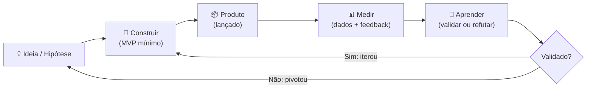
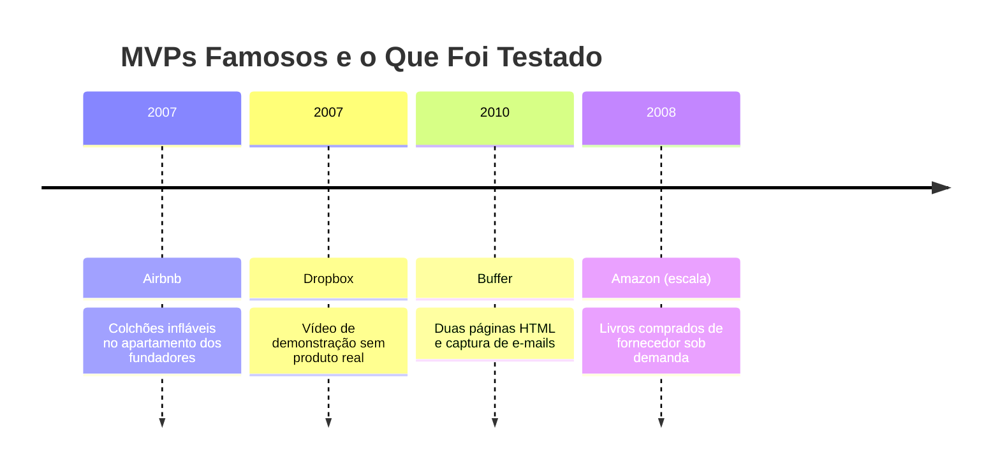
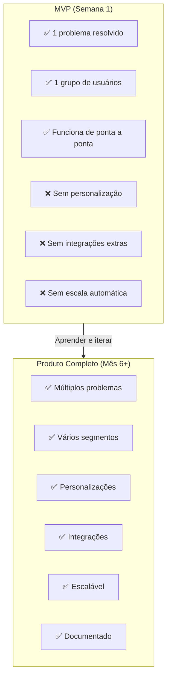

# MVP

> [!info] Definição
> **MVP** (Minimum Viable Product) é a versão mais simples de um produto que já entrega valor real ao usuário, mas com o mínimo de funcionalidades suficientes para testar hipóteses de negócio.

![[Recursos/Empreendedorismo/MVP/ciclo-mvp.svg|Ciclo de validação MVP - Construir, Medir, Aprender]]

## 🎯 Características

- **Funcional e usável**: não é protótipo descartável nem produto inacabado
- **Entrega solução**: resolve um problema real, ainda que de forma limitada
- **Foco em aprendizado**: permite validar hipóteses rapidamente

---

## 💡 Por que Usar MVP

- **Reduz custos**: foca só nas funcionalidades críticas
- **Rapidez no aprendizado**: feedbacks precoces para correções ou pivôs
- **Validação de mercado**: confirma se há demanda e se usuários pagariam
- **Atração de investidores**: mostra aprendizado e tração

---

## 🗺️ Ciclo Construir, Medir, Aprender

O coração do MVP é o ciclo proposto por Eric Ries no **Lean Startup** (2011): ao invés de planejar longamente, você constrói o mínimo necessário, coleta dados reais e aprende para a próxima iteração.

> [!tip] Filosofia Lean Startup
> MVP é central na filosofia Lean Startup: aprender rápido, cometer menos riscos, evitar gastar muito com algo que o mercado pode rejeitar.

---

## 🛠️ Tipos de MVP

Não existe um só formato de MVP. Escolha o tipo conforme o que você quer validar:

| Tipo | O que é | Quando usar | Exemplo |
|------|---------|-------------|---------|
| **Concierge** | Entrega manual, sem automatização | Validar se o problema existe e se o cliente paga | Airbnb: fundadores hospedavam pessoalmente |
| **Fake Door** | Botão/link para recurso que ainda não existe | Medir interesse antes de construir | Botão "Assinar plano Pro" que leva a "Em breve" |
| **Landing Page** | Página que descreve o produto e captura e-mails | Validar proposta de valor e demanda | Dropbox: vídeo + lista de espera |
| **Mágico de Oz** | Parece automatizado, mas humanos fazem por trás | Simular produto complexo sem código | Amazon nos primeiros anos: Jeff comprava e enviava manualmente |
| **Protótipo Clicável** | Mockup interativo, sem backend real | Testar fluxo e UX | Figma navegável apresentado a usuários |
| **Single Feature** | Produto com apenas 1 funcionalidade | Testar o núcleo do valor | Buffer: só agendava tweets |
| **Pré-venda** | Vender antes de construir | Validar disposição a pagar | Crowdfunding, lista de espera com pagamento |

---

## 🏆 Exemplos Famosos de MVP

### Airbnb: colchões infláveis no apartamento
Os fundadores Brian Chesky e Joe Gebbia precisavam pagar o aluguel. Criaram um site simples anunciando que alugariam colchões infláveis em seu apartamento durante um congresso em San Francisco (2007). O MVP: uma página web + colchões físicos. Aprenderam que pessoas pagariam por hospedagem em casa alheia, algo que hotéis não conseguiam oferecer.

> "Não construímos um marketplace. Fomos nós mesmos os anfitriões primeiro." Brian Chesky

### Dropbox: apenas um vídeo de 3 minutos
Drew Houston não construiu o produto antes de validá-lo. Em 2007, gravou um vídeo de demonstração mostrando como o Dropbox funcionaria, como se já existisse. Do dia para a noite, a lista de espera saltou de 5.000 para 75.000 pessoas. O MVP custou praticamente zero e validou a demanda antes de uma linha de código de infraestrutura ser escrita.

### Buffer: duas páginas e um tweet
Joel Gascoigne queria criar uma ferramenta para agendar posts no Twitter. Antes de construir qualquer coisa, criou duas páginas: a primeira descrevia o produto e tinha um botão "Planos e Preços". A segunda dizia "Ainda não está pronto, mas deixe seu e-mail". Quem clicava estava disposto a pagar. Em semanas tinha clientes reais e validação suficiente para construir o produto.

---

## ⚙️ Como Fazer um MVP

1. **Identifique o problema real**: converse com potenciais usuários
2. **Defina proposta de valor mínima**: quais funcionalidades realmente importam?
3. **Projete para aprendizado**: estabeleça métricas-chave e colete feedback
4. **Use versões "manuais" se possível**: simule o produto sem construir tudo
5. **Teste o mercado**: landing page, campanhas, pré-venda
6. **Itere ou pivote**: avalie resultados e decida o próximo passo

---

## 🔧 Ferramentas No-Code e IA para Criar MVPs (2026)

Em 2026, construir um MVP funcional não exige saber programar. Ferramentas de IA e no-code permitem criar, testar e publicar em horas:

| Ferramenta | Para quê | Custo | Link |
|-----------|---------|-------|------|
| **Carrd** | Landing page simples e rápida | Grátis / USD 9/ano | carrd.co |
| **Lovable** | App completo por IA (chat, banco de dados) | Grátis com limite | lovable.dev |
| **Bolt.new** | App com integração GitHub/Firebase por prompt | Grátis com limite | bolt.new |
| **Google Forms** | Validar demanda, coletar e-mails, fake door | Grátis | forms.google.com |
| **Figma** | Protótipo clicável sem código | Grátis | figma.com |
| **Typeform** | Formulários mais ricos, onboarding simulado | Grátis | typeform.com |
| **Notion** | Landing page simples + CMS | Grátis | notion.so |
| **Make (Integromat)** | Automatizar resposta de formulários | Grátis | make.com |

> [!tip] Lovable vs Bolt
> **Lovable** é melhor para landing pages bonitas com menor esforço. **Bolt** é melhor quando você precisa de integrações técnicas (GitHub, Firebase). Para um MVP de sala de aula, comece pelo Lovable ou Carrd.

---

## ⚠️ Cuidados

- ❌ Não adicionar funcionalidades demais logo no primeiro MVP
- ❌ Não usar MVP como desculpa para qualidade ruim
- ❌ Não testar com público errado
- ❌ Não demorar demais para lançar

> [!warning] MVP não é produto beta ruim
> Um MVP deve ser "viável": funciona, resolve o problema e não envergonha. A diferença entre MVP e produto inacabado é que o MVP entrega valor real, mesmo que limitado.

---

## 🧪 Atividades Práticas

> [!example] 🧪 Atividade 1: Crie uma Landing Page MVP em 30 minutos
>
> **Cenário:** Você tem uma ideia de produto. Antes de construir, valide se alguém se interessa.
>
> **Ferramenta:** [Carrd](https://carrd.co) (gratuito, sem cadastro de cartão) ou [Lovable](https://lovable.dev)
>
> **Passos:**
> 1. Escolha uma ideia de produto ou serviço (pode ser fictícia, mas realista)
> 2. Acesse o Carrd e use um template de "Coming Soon" ou "Landing Page"
> 3. Escreva: título com a proposta de valor, 3 benefícios concretos, um formulário de captura de e-mail ("Quero ser avisado quando lançar")
> 4. Publique com o link gratuito do Carrd (ex: `seuproduto.carrd.co`)
> 5. Compartilhe o link com 3 pessoas fora da sala e colete feedback
>
> **Resultado observável:** URL pública funcionando + pelo menos 1 resposta de formulário preenchida por pessoa externa à sala.
>
> **Reflexão:** Quantas pessoas preencheram o formulário? Esse número já é uma métrica de interesse real.

---

> [!example] 🧪 Atividade 2: Fake Door, Teste de Fumaça com Google Forms
>
> **Cenário:** Você quer saber se as pessoas pagariam por uma funcionalidade antes de construí-la.
>
> **Ferramenta:** [Google Forms](https://forms.google.com) + [Carrd](https://carrd.co)
>
> **Passos:**
> 1. Escolha uma funcionalidade que custaria tempo para construir (ex: "Gerador de roteiros de vídeo com IA")
> 2. Crie um Google Forms com as perguntas: "Você pagaria R\$ X por mês por isso?", "Com que frequência usaria?", "Qual é seu maior problema hoje nessa área?"
> 3. No Carrd, crie uma página descrevendo o recurso como se já existisse, com um botão "Quero acessar agora" que redireciona para o Forms
> 4. Publique e envie o link para pelo menos 5 pessoas do público-alvo
> 5. Analise: quantos clicaram? Quantos responderam? Qual percentual disse que pagaria?
>
> **Resultado observável:** Relatório do Google Forms com taxa de clique no botão e percentual de disposição a pagar.
>
> **Critério de validação:** Se mais de 20% dos visitantes preencherem o form, a hipótese tem sinal positivo suficiente para investir mais.

---

> [!example] 🧪 Atividade 3: Pesquise um MVP Famoso e Identifique o Mínimo
>
> **Cenário:** Entender o que foi de fato "mínimo" em MVPs que viraram bilhões.
>
> **Ferramenta:** Navegador + Google (pesquisa livre)
>
> **Passos:**
> 1. Escolha um dos três: Airbnb, Dropbox ou Buffer
> 2. Pesquise: "MVP do [empresa] o que foi testado", "história do [empresa] no início"
> 3. Preencha a ficha abaixo para o MVP escolhido:
>
> | Campo | Sua resposta |
> |-------|-------------|
> | Qual era o problema que tentavam resolver? | |
> | O que foi construído no MVP (descreva em 1 frase)? | |
> | Quanto custou construir o MVP? | |
> | Qual foi a primeira métrica de validação? | |
> | O que mudou do MVP para o produto atual? | |
>
> 4. Apresente para a turma em 2 minutos: o que foi o mínimo testado e por que funcionou.
>
> **Resultado observável:** Ficha preenchida + apresentação oral de 2 minutos.

---

## 📊 MVP vs Produto Completo

> [!warning] Armadilha comum
> Muitos empreendedores tentam construir o "Produto Completo" diretamente, gastando meses e recursos em algo que o mercado pode não querer. O MVP existe para evitar exatamente isso.

---

> [!note] 📚 Fontes (2026)
> - [Como Criar um MVP Passo a Passo em 2026 - Shinier](https://shinier.com.br/blog/como-criar-um-mvp-passo-a-passo)
> - [Tipos de MVP: 8 modelos para validar ideias - Softdesign](https://www.softdesign.com.br/blog/tipos-de-mvp/)
> - [7 Exemplos de MVP que se Tornaram Negócios Milionários - Polijunior](https://polijunior.com.br/blog/exemplos-mvps-milionarios/)
> - [Lovable ou Bolt: Qual escolher para MVP com IA - Empresa 1P](https://empresa1p.com.br/lovable-ou-bolt-qual-escolher-para-criar-seu-app-ou-mvp-com-ia/)
> - [Fake Door: Como validar uma funcionalidade - UX Collective Brasil](https://brasil.uxdesign.cc/fake-door-como-validar-uma-funcionalidade-no-seu-produto-33ed96bbc6de)
> - [Smoke test: validar demanda com landing page + ads - 49Educacao](https://49educacao.com.br/smoke-test-validacao-startup/)
> - [O MVP do Airbnb: de hospedagem a caixas de cereais - LinkedIn](https://pt.linkedin.com/pulse/o-mvp-do-airbnb-de-hospedagem-caixas-cereais-renato-furtado)
> - [Ferramentas gratuitas para testar e validar MVP em 2025 - Guilds](https://blog.guilds.com.br/post/ferramentas-gratuitas-testar-validar-mvp-2025)
