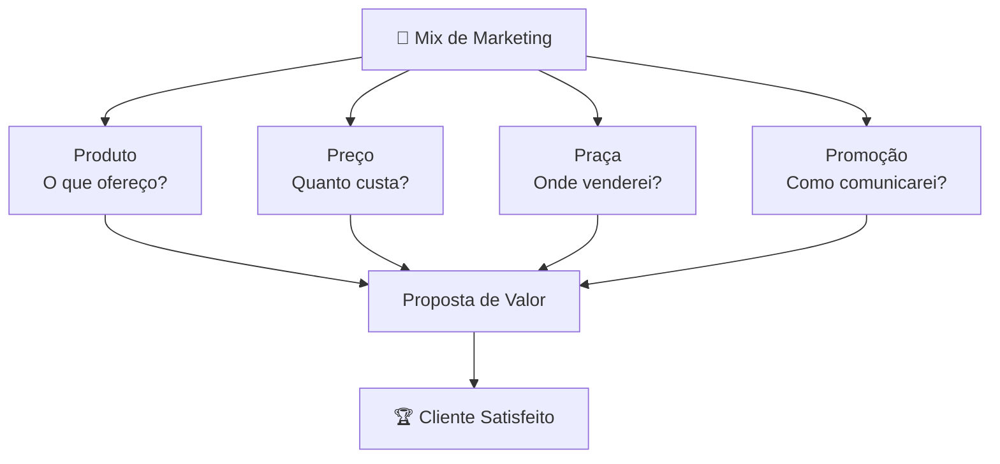
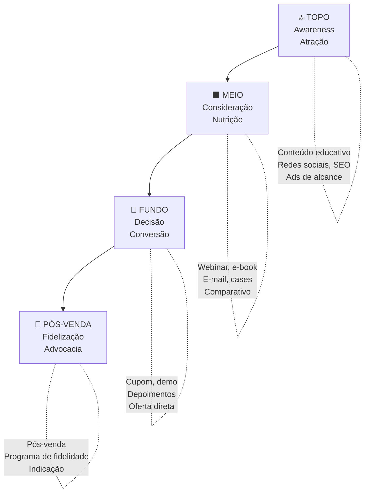
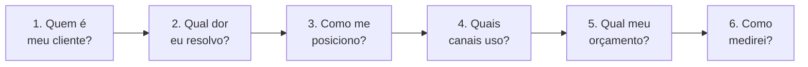

# Marketing

> [!info] Definição
> Marketing é o conjunto de atividades que visam criar, comunicar, entregar e trocar ofertas que tenham valor para clientes, parceiros e sociedade em geral.

---

## 🎯 Os 4 Ps do Marketing Mix

![[Recursos/Empreendedorismo/Marketing/4ps-marketing.svg|Os 4 Ps do Marketing Mix]]

### 1. Produto (Product)
Tudo que você oferece: características, design, qualidade, embalagem, serviço agregado.

**Impacto:** Define a proposta de valor a ser comunicada. Bons atributos aumentam fidelização.

### 2. Preço (Price)
Quanto o cliente paga: preço base, descontos, condições, política de pagamento.

**Impacto:** Influencia posicionamento (premium vs. acessível) e facilita negociações de vendas.

### 3. Praça/Distribuição (Place)
Onde, como e quando o produto chega ao cliente: canais de venda, logística, cobertura geográfica.

**Impacto:** Importante para visibilidade e conveniência. A venda multicanal exige coerência de mensagem.

### 4. Promoção (Promotion)
Formas de comunicar e persuadir: publicidade, marketing digital, relações públicas, vendas pessoais.

**Impacto:** Alavanca que impulsiona consciência, interesse e ação. Essencial para gerar leads e converter clientes.

> [!tip] Dos 4 Ps para os 4 Cs
> Com a digitalização e o empoderamento do consumidor, surgiu uma visão complementar proposta por Robert Lauterborn. Cada P tem um C correspondente orientado ao cliente:
> | 4 Ps (visão empresa) | 4 Cs (visão cliente) |
> |---|---|
> | Produto | **C**liente (solução para o cliente) |
> | Preço | **C**usto (custo total para o cliente) |
> | Praça | **C**onveniência (facilidade de acesso) |
> | Promoção | **C**omunicação (diálogo, não monólogo) |

> [!example] 🧪 Atividade: Analisar os 4 Ps de uma marca real no Instagram
> **Ferramenta:** Instagram (instagram.com) + Biblioteca de Anúncios da Meta (facebook.com/ads/library)
>
> 1. Escolha uma marca que você consome (roupa, lanche, app, serviço).
> 2. Acesse o perfil no Instagram e identifique os pilares de conteúdo: o que eles postam mais? (produto, bastidores, depoimentos, promoções, humor?)
> 3. Acesse **facebook.com/ads/library**, busque o nome da marca e veja os anúncios ativos: qual mensagem eles estão pagando para espalhar agora?
> 4. Monte uma tabela com os 4 Ps da marca baseada no que você observou (não no site oficial, mas no que está sendo comunicado nas redes).
>
> **Resultado esperado:** Uma tabela preenchida + 1 insight sobre o que o anúncio revela que o Instagram orgânico não mostra.

---

## 🔭 Estratégias Fundamentais

1. **Pesquisa de mercado**: entender necessidades, desejos e dores do cliente
2. **Posicionamento claro**: proposta de valor consistente entre Produto, Preço e Promoção
3. **Canais alinhados**: integrar loja física, e-commerce, marketplaces com consistência
4. **Comunicação integrada**: mensagens coerentes em todos os canais
5. **Precificação estratégica**: usar preços como ferramenta de segmentação
6. **Testes e ajustes**: monitorar métricas e fazer ajustes contínuos

---

## 📢 Marketing Digital e Redes Sociais

Marketing digital é o conjunto de estratégias aplicadas em canais online: redes sociais, e-mail, mecanismos de busca (SEO/SEM), sites, aplicativos e conteúdo.

### Principais Canais Digitais

| Canal | Objetivo Principal | Exemplo de Ação |
|---|---|---|
| Instagram / TikTok | Awareness e engajamento | Reels, Stories, UGC |
| Google (SEO/Ads) | Captura de demanda ativa | Blog, anúncios de busca |
| E-mail marketing | Nutrição e fidelização | Newsletter, sequência de boas-vindas |
| WhatsApp Business | Conversão e atendimento | Catálogo, listas de transmissão |
| YouTube | Educação e autoridade | Tutoriais, reviews, vlogs |

> [!warning] Atenção: alcance orgânico caindo
> Conteúdo em vídeo curto (Reels, TikTok) tem até **3 vezes mais alcance orgânico** do que imagens estáticas em 2025-2026. Ignorar o formato é abdicar da maior parte da visibilidade gratuita disponível.

### Métricas Essenciais de Marketing Digital

- **Alcance**: quantas pessoas únicas viram seu conteúdo
- **Engajamento**: curtidas + comentários + compartilhamentos / alcance (%)
- **CTR (Click-Through Rate)**: % de pessoas que clicaram num link
- **CAC (Custo de Aquisição de Cliente)**: quanto você gasta para conquistar 1 cliente
- **LTV (Lifetime Value)**: quanto um cliente gera de receita ao longo do tempo
- **ROI**: retorno sobre o investimento em marketing

> [!example] 🧪 Atividade: Validar demanda com Google Trends
> **Ferramenta:** Google Trends (trends.google.com.br)
>
> 1. Pense num produto ou serviço que você quer vender (ou que alguém da turma quer criar).
> 2. Acesse **trends.google.com.br** e pesquise o termo principal do produto.
> 3. Configure: Brasil, últimos 12 meses.
> 4. Observe: a procura está crescendo, estável ou caindo? Há sazonalidade (picos no Natal, Dia das Mães)?
> 5. Use a aba "Tópicos relacionados" e "Consultas relacionadas" para encontrar variações de nicho com menos concorrência.
>
> **Resultado esperado:** Um gráfico salvo/printado + decisão justificada: "vale ou não vale entrar nesse mercado agora, com base na tendência de busca".

---

## 🔽 Funil de Marketing (Jornada do Cliente)

O funil de marketing representa as etapas que um potencial cliente percorre desde o primeiro contato com a marca até a compra (e além: fidelização).

### Detalhando as Etapas do Funil

| Etapa | Pergunta do Cliente | Objetivo da Empresa | Ferramentas |
|---|---|---|---|
| Topo (TOFU) | "Tenho um problema?" | Gerar consciência | Blog, Reels, Ads de alcance |
| Meio (MOFU) | "Qual a melhor solução?" | Nutrir e qualificar | E-mail, webinar, e-book, cases |
| Fundo (BOFU) | "Por que comprar desta empresa?" | Converter | Cupom, demo, depoimentos, oferta |
| Pós-venda | "Valeu a pena?" | Fidelizar e gerar indicações | Suporte, programa de pontos, comunidade |

> [!example] 🧪 Atividade: Montar um funil simples para um produto real
> **Ferramenta:** Papel e caneta (ou Canva, miro.com, ou qualquer editor de apresentação)
>
> **Contexto:** Você quer vender um curso online de culinária caseira por R\$ 97.
>
> 1. **Topo:** defina 2 conteúdos gratuitos para atrair quem nunca ouviu falar de você (ex.: "5 receitas fáceis para a semana" no TikTok).
> 2. **Meio:** defina 1 ação para capturar o contato da pessoa interessada (ex.: e-book gratuito "Cardápio Semanal com R\$ 150" em troca do e-mail).
> 3. **Fundo:** defina a oferta de conversão (ex.: e-mail com depoimento de aluno + link de compra com desconto por 48h).
> 4. **Pós-venda:** defina 1 ação para fidelizar (ex.: grupo de WhatsApp exclusivo com receitas novas toda semana).
>
> **Resultado esperado:** Um funil desenhado (pode ser simples, à mão) com conteúdo, canal e CTA definidos para cada etapa.

---

## 🤖 Inteligência Artificial no Marketing (2025-2026)

O mercado de IA aplicada ao marketing atingiu **US\$ 47,3 bilhões em 2025**, com projeção de US\$ 64,6 bilhões em 2026. A IA deixou de ser diferencial e passou a ser infraestrutura básica de marketing.

### O que a IA já faz no Marketing hoje

| Aplicação | Exemplo Prático | Ferramenta |
|---|---|---|
| Geração de conteúdo | Textos para redes sociais, e-mails, descrições | ChatGPT, Claude, Gemini |
| Análise de concorrentes | Monitorar anúncios, palavras-chave, posicionamento | Semrush, Ahrefs |
| Personalização | E-mails e anúncios com nome, histórico e preferências | RD Station, ActiveCampaign |
| Automação de fluxos | Sequências de e-mail disparadas por comportamento | Kommo, Mailchimp |
| Análise preditiva | Prever quais leads têm mais chance de comprar | HubSpot, Salesforce Einstein |
| Criação de imagens | Artes para posts, anúncios e materiais | DALL-E, Midjourney, Firefly |

### GEO: Generative Engine Optimization

> [!info] Novo conceito (2025-2026)
> Com a ascensão de buscadores com IA (Google SGE, ChatGPT, Perplexity), surgiu o **GEO (Generative Engine Optimization)**: otimizar conteúdo para ser citado por IAs, não apenas ranqueado no Google tradicional. O conteúdo precisa ser claro, estruturado, factual e com autoridade reconhecível.

### Ética e Limites da IA no Marketing

- Transparência: indicar quando o conteúdo foi gerado ou auxiliado por IA
- Privacidade: uso de dados de clientes deve seguir a LGPD (Lei Geral de Proteção de Dados)
- Autenticidade: IA é ferramenta, não substituto da voz e dos valores da marca
- Cuidado com desinformação: revisar sempre o que a IA gera antes de publicar

---

## 📊 Marketing de Conteúdo

Marketing de conteúdo é a estratégia de criar e distribuir material valioso e relevante para atrair, engajar e converter o público-alvo, sem abordar diretamente o produto/serviço logo de início.

### Pilares de Conteúdo

Um perfil de marca no Instagram, por exemplo, geralmente organiza o conteúdo em 3 a 5 "pilares" (temas recorrentes):

| Pilar | Objetivo | Exemplo |
|---|---|---|
| Educação | Gerar autoridade | "Como escolher o tênis certo para corrida" |
| Entretenimento | Gerar engajamento | Meme relacionado ao nicho, challenge |
| Bastidores | Gerar conexão humana | Como o produto é feito, dia a dia da equipe |
| Depoimentos | Gerar prova social | Print de avaliação positiva de cliente |
| Promoção | Gerar conversão | Anúncio direto de oferta, lançamento |

> [!tip] Regra prática de conteúdo
> Para cada post de venda direta, publique ao menos **4 posts de valor** (educação + entretenimento + bastidores + depoimento). Perfis que só "empurram produto" perdem seguidores e alcance.

---

## 🗺️ Plano de Marketing Simplificado

Para um empreendedor iniciante, um plano de marketing não precisa ter 50 páginas. Precisa responder seis perguntas:

| Pergunta | Ferramenta Útil |
|---|---|
| Quem é meu cliente? | Persona (mapa de empatia, canvas de persona) |
| Qual dor eu resolvo? | Proposta de Valor Canvas |
| Como me posiciono? | Análise dos concorrentes, brand voice |
| Quais canais uso? | Onde o cliente já está (pesquisa, teste) |
| Qual meu orçamento? | Regra: 5-15% do faturamento esperado |
| Como medirei? | KPIs definidos antes de começar (não depois) |

---

> [!note] 📚 Fontes (2026)
> - [Os 4 Ps do Marketing Mix: guia completo 2026 (Asana)](https://asana.com/pt/resources/4-ps-of-marketing)
> - [Tendências de Marketing para 2026 (Conversion)](https://www.conversion.com.br/blog/tendencias-de-marketing/)
> - [O que mudou no Marketing Digital em 2026 para PMEs (B Orange)](https://www.borange.pt/tendencias-marketing-digital-2025/)
> - [Marketing dos 4 Ps aos 4 Cs (Rubeus)](https://rubeus.com.br/blog/marketing-dos-4-ps-aos-4-cs/)
> - [Funil de Vendas no Marketing Digital: Guia Definitivo (Adlocal)](https://www.adlocal.com.br/blog/funil-de-venda-no-marketing-digital-o-guia-definitivo/)
> - [Topo, Meio e Fundo de Funil: guia completo (OnFlag)](https://www.onflag.com.br/marketing-digital/topo-meio-e-fundo-de-funil)
> - [Automação de Marketing com IA: Guia Completo 2026 (Kaizen)](https://agenciakaizen.com.br/automacao-marketing-ia-guia-2026/)
> - [Inteligência Artificial Aplicada ao Marketing 2026 (Novo Foco)](https://agencianovofoco.com.br/inteligencia-artificial-aplicada-ao-marketing-resultados-reais-alem-do-hype-em-2026/)
> - [15 Ferramentas de IA para Marketing Digital 2026 (Marfin)](https://blog.marfin.co/ferramentas-de-ia-para-marketing-digital-15-melhores-de-2026-testadas)
> - [Inteligência Artificial no Marketing Digital 2026 (Alura)](https://www.alura.com.br/artigos/inteligencia-artificial-no-marketing-digital)
