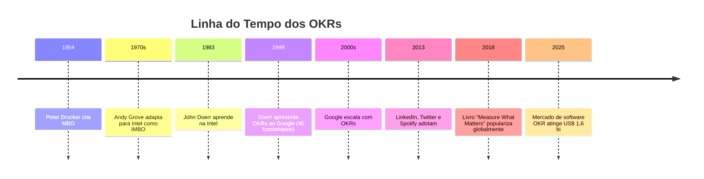
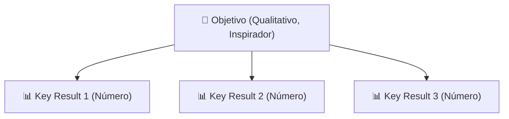
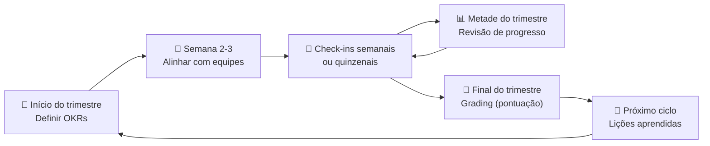

# Metodologia do vale do silício (OKR)

> [!info] O que são OKRs
> **OKR** (Objectives and Key Results) é uma metodologia de gestão usada no Vale do Silício para alinhar equipes e medir resultados de forma eficiente.

---

## 🕰️ Origem e História

A história dos OKRs começa com **Peter Drucker** em 1954, quando ele formulou o conceito de *Management by Objectives* (MBO): gerir pessoas pelo que elas entregam, não pelo esforço que empregam.

Nos anos 1970, **Andy Grove**, CEO da Intel, pegou o MBO de Drucker, cortou a burocracia e acrescentou a peça que faltava: os *Key Results*, indicadores quantitativos que revelam se o objetivo foi de fato alcançado. Grove chamou o sistema de *iMBOs* (Intel MBOs). O princípio de **meta aspiracional** nasceu aqui: se você atinge 100% sempre, o alvo estava baixo demais.

Em 1999, o investidor **John Doerr** (que aprendeu o método na Intel) apresentou os OKRs ao Google, então uma startup de 40 pessoas. Larry Page e Sergey Brin adotaram na hora. O sistema escalou com a empresa e, décadas depois, o Google ainda o usa em todos os níveis, do estagiário ao CEO. O mercado de software de OKR atingiu **US\$ 1,6 bilhão em 2025** (crescimento de 17% em relação a 2024), confirmando a adoção global do método.

---

## 🏗️ Estrutura

![[Recursos/Empreendedorismo/Metodologia do vale do silício (OKR)/estrutura-okr.svg|Estrutura do OKR - Objetivos e Resultados-Chave]]

### Objective (Objetivo)
- Meta **qualitativa**, clara e inspiradora
- Responde: "Onde queremos chegar?"
- Deve motivar e engajar

### Key Results (Resultados-chave)
- Métricas ou indicadores **quantitativos** que medem o progresso
- Responde: "Como saberemos se alcançamos?"
- Geralmente de 2 a 5 por objetivo

> [!warning] Atenção: OKR não é lista de tarefas
> Key Results medem **resultados**, não atividades. "Realizar 5 reuniões de feedback" é uma tarefa. "Aumentar o índice de satisfação da equipe de 60% para 80%" é um Key Result.

---

## ♻️ Ciclo Trimestral de OKRs

O Google e a maioria das empresas trabalham com **ciclos de 90 dias** (um trimestre). Isso cria um ritmo de revisão constante sem travar a estratégia anual.

### Como pontuar (grading)

| Pontuação | Interpretação |
|-----------|---------------|
| 0.0 a 0.3 | Pouco ou nenhum progresso |
| 0.4 a 0.6 | Progresso significativo, mas objetivo não atingido |
| 0.7 | **Meta ideal** para OKRs aspiracionais |
| 1.0 | Atingiu 100% (pode indicar meta conservadora) |

> [!tip] Meta Ideal
> Alvo de ~70% de acerto para OKRs aspiracionais. Se atingir sempre 100%, pode não estar desafiando o time.

---

## ✅ Por que Funciona

- **Adaptável e ágil**: permite ajustar metas rapidamente
- **Alinhamento**: promove transparência e conexão com a estratégia
- **Objetivos ambiciosos**: metas desafiadoras geram crescimento e inovação

---

## 📋 Boas Práticas

### Objetivos
- Qualitativos, inspiradores, de alto impacto
- Devem trazer clareza

### Resultados-chave
- Quantitativos, mensuráveis, específicos, com prazo
- Evitar confundir com tarefas ou iniciativas

### Periodicidade
- Ciclos curtos (trimestral ou menos)
- Revisões frequentes (check-ins semanais ou quinzenais)

### Alinhamento
- OKRs visíveis para todos
- Decomposição top-down + bottom-up

---

## 💡 Exemplos de OKRs por Contexto

A tabela abaixo mostra exemplos reais de Objetivos e Key Results. Observe que os KRs têm sempre um número e um prazo implícito no ciclo.

| Contexto | Objetivo | Key Result 1 | Key Result 2 | Key Result 3 |
|----------|----------|--------------|--------------|--------------|
| Startup de produto | Tornar nosso app indispensável para os usuários | Aumentar DAU (usuários ativos diários) de 500 para 2.000 | Reduzir churn mensal de 8% para 3% | Atingir NPS de 50 ou mais |
| Equipe de vendas | Conquistar o mercado regional | Fechar 15 novos contratos no trimestre | Aumentar ticket médio de R\$ 2.000 para R\$ 3.500 | Reduzir ciclo de vendas de 45 para 25 dias |
| Educação (turma) | Aprender a criar produtos digitais do zero | 80% da turma entrega protótipo funcional até a semana 12 | Todos os grupos apresentam pesquisa com mínimo 5 usuários entrevistados | Média de avaliação dos projetos acima de 7,0 |
| Google (exemplo público) | Alcançar liderança no mercado de busca | Aumentar participação de mercado de 80% para 85% | Reduzir tempo médio de resposta de 0,5s para 0,3s | Lançar 3 novos recursos de busca avançada |
| Intel (histórico) | Conquistar o segmento de microprocessadores corporativos | Fechar contratos com as 10 maiores montadoras | Reduzir defeitos de fabricação em 30% | Aumentar margem bruta de 42% para 50% |

---

## 🚫 Erros Comuns

> [!danger] Armadilhas frequentes de OKR

1. **KR como tarefa**: "Fazer 3 reuniões de planejamento" não é um resultado, é uma atividade.
2. **Objetivo com número**: Se o objetivo contém um percentual ("Crescer 20%"), ele virou KR. O objetivo precisa ser qualitativo e inspirador.
3. **Muitos OKRs ao mesmo tempo**: Mais de 5 objetivos paralelos dilui o foco. O Google recomenda 3 a 5 por ciclo.
4. **OKRs isolados**: Cada equipe define seus OKRs sem conversar com as outras. O resultado é desalinhamento.
5. **Nunca revisar**: Criar OKRs no início do trimestre e abrir apenas no final. Check-ins semanais são obrigatórios.
6. **Confundir OKR com avaliação de desempenho**: OKRs aspiracionais que pontuam 70% não significam "desempenho ruim".

---

## 📝 Exemplo Prático

**Objetivo:** Melhorar a experiência do cliente

**Key Results:**
- Aumentar NPS em 20% no trimestre
- Reduzir tempo médio de atendimento de 5 para 2 minutos
- Atingir 80% de avaliações "excelente" em pesquisa pós-venda

---

## 🧪 Atividades Práticas

> [!example] 🧪 Atividade 1: Escreva seu OKR do Semestre
>
> **Ferramenta:** Google Sheets ou Notion (template de OKR)
>
> **Passos:**
> 1. Acesse um template de OKR (sugestão: clonar a planilha pública do Google re:Work em `rework.withgoogle.com`)
> 2. Escreva 1 Objetivo para o seu semestre letivo (qualitativo, 1 frase, inspirador)
> 3. Crie exatamente 3 Key Results para esse objetivo (cada um com: indicador + valor atual + meta + prazo)
> 4. Preencha o campo "score inicial" com 0% para todos
>
> **Resultado observável:** Planilha ou página Notion com 1 Objetivo e 3 KRs preenchidos, todos com número, valor de partida e prazo. Apresentar para um colega e verificar se ele consegue entender o que será medido sem fazer perguntas.

---

> [!example] 🧪 Atividade 2: Caçada de OKRs Públicos
>
> **Ferramenta:** Navegador + planilha de classificação
>
> **Passos:**
> 1. Busque na web "OKR examples [empresa]" para 3 empresas à sua escolha (sugestão: Google, Spotify, uma startup brasileira)
> 2. Para cada Key Result encontrado, classifique em uma tabela com 3 colunas: KR encontrado | Tem número? (S/N) | Tem prazo? (S/N)
> 3. Some a pontuação: KR com número E prazo = mensurável de verdade
>
> **Resultado observável:** Tabela preenchida com mínimo 9 KRs classificados e uma conclusão escrita em 2 frases sobre qual empresa escreve os KRs mais mensuráveis e por que.

---

> [!example] 🧪 Atividade 3: Acompanhe seu OKR por 1 Semana
>
> **Ferramenta:** Planilha criada na Atividade 1 + registro diário de 2 linhas
>
> **Passos:**
> 1. Durante 7 dias corridos, reserve 5 minutos ao final de cada dia para responder: "O que fiz hoje que move algum dos meus KRs?"
> 2. Atualize o percentual de cada KR ao final da semana (ex.: KR1 saiu de 0% para 15%)
> 3. Na aula seguinte, traga a planilha com o histórico de progresso
>
> **Resultado observável:** Planilha com 7 registros de check-in diário e percentual atualizado em cada KR. Pelo menos 1 KR deve ter progresso diferente de zero para validar que o objetivo é acionável no cotidiano.

---

> [!note] 📚 Fontes (2026)
>
> - [Who invented OKRs? A complete OKR history from Intel to the AI era (2026) (Tability)](https://www.tability.io/odt/articles/a-complete-okr-history-from-intel-to-the-modern-workplace)
> - [OKR Guide 2026: Complete Framework and Implementation (DevOKR)](https://devokr.com/en/blog/okr-guide)
> - [Google re:Work: Set goals with OKRs (Google)](https://rework.withgoogle.com/intl/en/guides/set-goals-with-okrs)
> - [OKR Examples: 15 Real-World Goals from Google, Netflix and More (Christian Strunk)](https://www.christianstrunk.com/blog/okr-examples)
> - [Quais os erros mais comuns na adoção dos OKRs? (Vanzolini)](https://vanzolini.org.br/blog/erros-mais-comuns-okrs/)
> - [OKRs: Implementação e alinhamento estratégico em 2025 (Actio)](https://actiosoftware.com/blog/okrs-como-alinhar-objetivos-e-estrategias/)
> - [What are OKRs? Objectives & Key Results Guide (Asana)](https://asana.com/resources/okr-meaning)
> - [Objectives and key results (Wikipedia)](https://en.wikipedia.org/wiki/Objectives_and_key_results)
