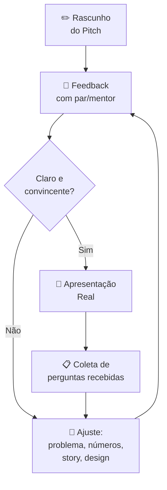

# Pitch (como fazer um Pitch - apresentação)

> [!info] O que é um Pitch
> Pitch é uma apresentação concisa e persuasiva de uma ideia de negócio para investidores, clientes ou parceiros. Deve despertar curiosidade e gerar interesse em um encontro futuro.

---

## 🎯 Tipos de Pitch

Nem todo pitch é igual. A duração e o contexto moldam o formato ideal:

| Tipo | Duração | Contexto | Objetivo |
|---|---|---|---|
| **One-sentence pitch** | 1 frase | Qualquer conversa | Curiosidade imediata |
| **Elevator pitch** | 30s a 2 min | Evento, corredor, reunião improvisada | Marcar próxima conversa |
| **Pitch de captação** | 5 a 15 min | Reunião agendada com investidor | Conseguir aporte |
| **Pitch deck completo** | 20 a 40 min (com Q&A) | Demo day, aceleradora, banca | Fechar rodada ou aprovação |

> [!tip] 💡 Regra de Ouro
> Prepare sempre o pitch mais curto primeiro. Se você não consegue explicar sua ideia em 1 frase, você ainda não entendeu bem o próprio negócio.

---

## 📋 Estrutura Básica do Pitch Deck (10-15 slides)

![[Recursos/Empreendedorismo/Pitch (como fazer um Pitch - apresentação)/estrutura-pitch.svg|Estrutura completa do Pitch Deck]]

1. **Capa/Introdução**: nome da empresa, logo e frase de efeito (elevator pitch)
2. **O Problema**: qual dor ou necessidade existe no mercado? Torne palpável com história ou estatísticas
3. **Sua Solução**: o que seu produto/serviço oferece? Destaque o diferencial competitivo
4. **Mercado-alvo**: quem são seus clientes ideais? Tamanho de mercado total
5. **Modelo de Negócio**: como você vai ganhar dinheiro? Preço, margens, canais
6. **Tração e Validação**: MVP, clientes, receita, métricas de uso, aprendizados
7. **Concorrência**: quem está no mercado? Como você se diferencia?
8. **Equipe**: apresente fundadores/equipe-chave. Por que vocês são as pessoas certas?
9. **Projeções Financeiras**: previsões de receita, custos, margens, break-even (3-5 anos)
10. **Uso do Investimento**: quanto busca, para que vai usar, o que está em troca
11. **Fechamento/Call to Action**: recapitulação e próximos passos

---

## 🗺️ Anatomia de um Pitch: do Problema ao Pedido

O diagrama abaixo mostra o fluxo lógico que todo pitch bem estruturado segue. Cada etapa prepara o terreno para a próxima:

> [!note] Por que esse fluxo?
> Cada bloco responde uma pergunta na cabeça do investidor. Se você pular etapas ou trocar a ordem, o raciocínio se perde e a confiança cai.

---

## ✅ Boas Práticas

- **Tempo**: 5 a 15 minutos de apresentação; seja objetivo
- **Visualidade**: slides limpos, sem excesso de texto. Use gráficos e imagens
- **Storytelling**: comece com uma história que conecte com o problema
- **Preparação**: antecipe perguntas sobre riscos, desafios e concorrência
- **Honestidade**: seja transparente sobre o estágio atual e o que precisa desenvolver

> [!warning] Foco no Investidor
> Investidores não investem só na ideia, mas em soluções validadas que resolvem problemas reais, geram retorno e estão nas mãos de uma equipe capaz.

---

## 🧠 Erros Fatais no Pitch

Baseados nos critérios reais avaliados no Shark Tank Brasil e em aceleradoras:

> [!danger] ❌ O que derruba um pitch
> - Não saber as métricas financeiras básicas: margem, CAC (Custo de Aquisição de Cliente), LTV (Lifetime Value)
> - Valuation sem embasamento (pedir R\$ 1 milhão por 5% sem justificar por que a empresa vale R\$ 20 milhões)
> - Mercado mal definido: "todo mundo é meu cliente" não convence ninguém
> - Ideia sem validação: os investidores querem prova de que alguém já pagou pelo produto
> - Equipe incompleta: fundador solo sem sócios técnicos gera dúvida sobre execução
> - Slides com paredes de texto e sem visuais

---

## 🛠️ Ferramentas Gratuitas para Montar seu Pitch Deck

| Ferramenta | Link | Destaques |
|---|---|---|
| **Canva** | [canva.com/pt_br/apresentacoes/pitch-deck](https://www.canva.com/pt_br/apresentacoes/pitch-deck/) | Maior biblioteca de templates grátis, fácil de usar |
| **Gamma** | [gamma.app](https://gamma.app) | IA gera rascunho do deck em menos de 1 minuto a partir de um texto |
| **Pitch.com** | [pitch.com](https://pitch.com) | Colaborativo em tempo real, muito usado por startups |
| **Google Slides** | [slides.google.com](https://slides.google.com) | Sem instalação, salva automático, compartilhamento simples |

> [!tip] Dica Gamma (2025)
> O Gamma tem um "Agent Mode" que permite construir o deck inteiro por conversa com a IA. Dê o contexto da sua startup e peça para gerar cada slide separadamente. Depois edite o conteúdo gerado, nunca use o texto padrão da IA sem revisar.

---

## 🎬 Como Avaliar um Pitch Real: Checklist Shark Tank

Use este checklist ao assistir qualquer pitch (Shark Tank Brasil, Y Combinator, WSET, etc.):

| Critério | O que observar | Nota (1-5) |
|---|---|---|
| Clareza do problema | Dá para entender em 30 segundos quem sofre e por quê? | |
| Originalidade da solução | A solução é diferente do que já existe? | |
| Evidência de mercado | Trouxe número de mercado, pesquisa ou cliente real? | |
| Modelo de negócio | Explicou claramente como ganha dinheiro? | |
| Tração | Tem vendas, usuários ou protótipo validado? | |
| Credibilidade da equipe | A equipe tem experiência ou conexão com o problema? | |
| Projeções realistas | Os números fazem sentido ou são "sonho"? | |
| Postura e confiança | Transmitiu segurança sem arrogância? | |
| Resposta a perguntas | Soube lidar com perguntas difíceis? | |

---

## 🧪 Atividades Mão na Massa

> [!example] 🧪 Atividade 1: Grave seu Elevator Pitch de 60 segundos
>
> **Ferramenta:** câmera do celular (app de câmera nativo)
>
> **O que fazer:**
> 1. Escolha uma ideia de negócio real ou hipotética.
> 2. Escreva um roteiro de no máximo 5 linhas cobrindo: quem você é, qual problema resolve, para quem, como e o que você quer do interlocutor.
> 3. Grave um vídeo de exatamente 60 segundos falando para a câmera como se fosse para um investidor.
> 4. Assista ao vídeo inteiro sem parar.
> 5. Anote 3 melhorias específicas (ex.: "falei rápido demais na parte do problema", "não expliquei o modelo de negócio", "não olhei para a câmera").
> 6. Grave uma segunda versão incorporando as 3 melhorias.
>
> **Resultado observável:** dois vídeos no celular + lista escrita das 3 melhorias identificadas. Compartilhe o segundo vídeo com um colega e peça feedback antes de mostrar ao professor.

---

> [!example] 🧪 Atividade 2: Monte um Pitch Deck de 5 Slides no Canva ou Gamma
>
> **Ferramenta:** [Canva](https://www.canva.com/pt_br/apresentacoes/pitch-deck/) (template "Pitch Deck Minimalista") ou [Gamma](https://gamma.app) (criar a partir de texto)
>
> **O que fazer:**
> 1. Acesse a ferramenta e escolha um template de pitch deck.
> 2. Crie exatamente 5 slides com este conteúdo:
>    - **Slide 1:** Nome do negócio + frase de efeito (1 linha)
>    - **Slide 2:** Problema (1 estatística ou história real de 2 linhas)
>    - **Slide 3:** Solução + diferencial (imagem ou ícone obrigatório)
>    - **Slide 4:** Mercado-alvo + modelo de receita (uma tabela ou número de TAM)
>    - **Slide 5:** Equipe + pedido (o que você quer: investimento, parceiro, cliente)
> 3. Exporte como PDF.
> 4. Apresente para a turma em exatamente 3 minutos.
>
> **Resultado observável:** arquivo PDF exportado + apresentação oral cronometrada. A turma avalia usando o Checklist Shark Tank acima.

---

> [!example] 🧪 Atividade 3: Avalie um Pitch Real do Shark Tank Brasil
>
> **Ferramenta:** YouTube (buscar "Shark Tank Brasil pitch" + nome de produto de interesse)
>
> **O que fazer:**
> 1. Acesse o YouTube e busque um episódio do Shark Tank Brasil com o produto que mais te interessa (sugestão: buscar "Shark Tank Brasil melhores pitches").
> 2. Assista ao pitch completo (normalmente 5 a 10 minutos).
> 3. Preencha o Checklist Shark Tank (tabela da seção anterior) para este pitch, dando nota de 1 a 5 em cada critério.
> 4. Calcule a média das notas.
> 5. Escreva um parágrafo de 5 linhas respondendo: o negócio conseguiu aporte? Se sim, o que convenceu os investidores? Se não, o que falhou segundo seus critérios?
>
> **Resultado observável:** checklist preenchido com notas + parágrafo de análise escrito. Traga para a aula e compare com a análise de um colega que assistiu a um pitch diferente.

---

## 📌 Exemplos Reais de Pitch Decks Lendários

Algumas das startups mais valiosas do mundo começaram com pitch decks simples:

| Empresa | Ano | O que pediam | Resultado |
|---|---|---|---|
| **Airbnb** | 2009 | US\$ 600 mil | Captou com Y Combinator; empresa vale >US\$ 70 bi hoje |
| **YouTube** | 2005 | Série A | Adquirida pelo Google por US\$ 1,65 bi em 2006 |
| **Buffer** | 2011 | US\$ 500 mil | Pitch deck público, tornou-se referência de transparência |
| **Nubank** | 2013 | Seed round | Hoje maior banco digital do mundo fora dos EUA |

> [!note] Lição dos Exemplos
> Todos esses decks tinham em comum: problema claramente definido, solução simples de explicar, e fundadores que conheciam os números de cor. Nenhum tinha mais de 15 slides.

---

## 🔁 Iteração é Parte do Processo

Um pitch raramente fica bom na primeira versão. O ciclo de melhoria é:

> [!tip] Quantas vezes iterar?
> Steve Jobs ensaiava cada apresentação da Apple por semanas. Para um pitch de 10 minutos, o mínimo recomendado é 10 apresentações para públicos diferentes antes do pitch decisivo.

---

> [!note] 📚 Fontes (2026)
> - [FIA: Pitch: o que é, importância, tipos, como fazer e exemplo](https://fia.com.br/blog/pitch-o-que-e-importancia-tipos-como-fazer-e-exemplo/)
> - [FM2S: Modelos de Pitch: estruturas, exemplos e como escolher](https://www.fm2s.com.br/blog/pitch)
> - [Canva: Como fazer um pitch deck (exemplos e dicas)](https://www.canva.com/pt_br/apresentacoes/pitch-deck/)
> - [G4 Educação: Pitch Deck: como fazer passo a passo, dicas e exemplos](https://g4educacao.com/blog/o-que-e-pitch-deck)
> - [Abstartups: 10 Pitch Decks lendários para você se inspirar](https://abstartups.com.br/10-pitch-decks-lendarios-para-voce-se-inspirar/)
> - [Qualifiquei: Pitch de Sucesso em 2025: Guia Completo para Apresentações Irresistíveis](https://qualifiquei.com.br/blog/marketing/domine-a-arte-do-pitch-guia-2025/)
> - [Melhor Investimento: Pitch de Vendas: Reveja os Melhores do Shark Tank Brasil](https://melhorinvestimento.net/empreendedorismo/pitch-de-vendas-reveja-os-melhores-do-shark-tank-brasil)
> - [Sebrae: Pitch Deck: o que é e como estruturar o seu?](https://sebrae.com.br/sites/PortalSebrae/ufs/pe/artigos/pitch-deck-o-que-e-e-como-estruturar-o-seu,4787c413c7fd4710VgnVCM1000004c00210aRCRD)
