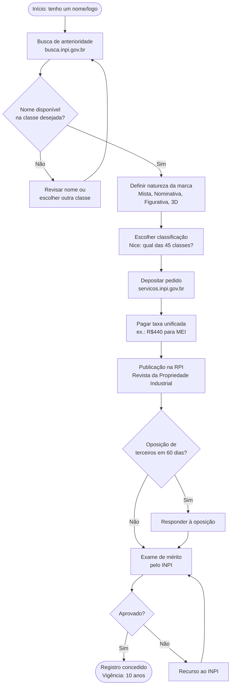
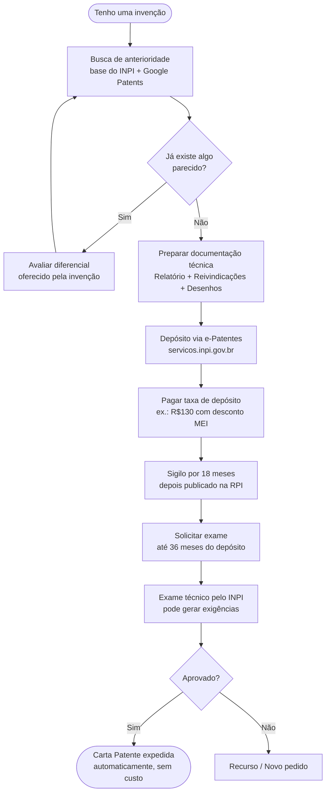

# Registro de propriedade intelectual

> [!info] O que é Propriedade Intelectual
> Propriedade Intelectual é o conjunto de direitos legais relativos à criação do intelecto humano, incluindo Propriedade Industrial (patentes, marcas, desenhos industriais) e Direitos Autorais.

![[Recursos/Empreendedorismo/Registro de propriedade intelectual/tipos-propriedade-intelectual.svg|Tipos de Propriedade Intelectual - Patentes, Marcas e Direitos Autorais]]

> [!tip] Por que proteger sua ideia?
> Sem proteção, um concorrente pode copiar legalmente seu produto, usar seu nome e lucrar com sua criatividade. Registro não é burocracia: é vantagem competitiva.

---

## 🏭 Patentes

### O que é
Título concedido pelo Estado que dá ao inventor o direito exclusivo de exploração comercial de uma invenção ou modelo de utilidade.

### Tipos
- **Patente de Invenção (PI)**: produto ou processo novo, com aplicação industrial e atividade inventiva. Vigência: **20 anos**
- **Modelo de Utilidade (MU)**: melhoria funcional em objeto de uso prático já existente. Vigência: **15 anos**

### O que NÃO pode ser patenteado
- Ideias abstratas, descobertas científicas, processos naturais
- Métodos matemáticos, técnicas cirúrgicas aplicadas diretamente ao corpo

### Processo de Registro (INPI)
1. Busca de anterioridade
2. Preparar documentação técnica (relatório descritivo, reivindicações, desenhos)
3. Depósito digital via plataforma e-Patentes do INPI
4. Pagar taxas (depósito, anuidades)
5. Pedido em sigilo por até 18 meses; depois publicado na RPI

### Taxas de Patente (tabela INPI 2025, Portaria GM/MDIC nº 110/2025)

| Serviço | Valor integral | Com desconto (MEI/MPE/ICT, 50%) |
|---------|---------------|-------------------------------|
| Depósito de Patente de Invenção (eletrônico) | R$ 260 | R$ 130 |
| Solicitação de exame de patente | R$ 1.010 | R$ 505 |
| Depósito de Modelo de Utilidade (eletrônico) | R$ 150 | R$ 75 |

> [!warning] Prazo crítico
> Você tem **36 meses** a partir do depósito para solicitar o exame. Se não solicitar dentro desse prazo, o pedido é **arquivado definitivamente**. A partir de 20/12/2025, a Carta Patente é expedida automaticamente, sem custo adicional.

---

## 🏷️ Marcas

### O que é
Sinal distintivo (nome, logotipo, símbolo) que identifica produtos ou serviços de uma empresa, distinguindo-os dos concorrentes.

### Registro no INPI
- Vigência: **10 anos**, renovável indefinidamente
- Verificar disponibilidade na base do INPI antes de depositar
- Preencher formulário eletrônico indicando natureza e formato gráfico

### Novidades de 2025 no registro de marca

A partir de **20 de setembro de 2025**, o INPI adotou pagamento unificado na entrada: você paga tudo de uma vez ao fazer o pedido, sem nova taxa na concessão.

| Perfil do depositante | Taxa de depósito (1 classe, especificação pré-aprovada) |
|----------------------|--------------------------------------------------------|
| MEI | R$ 440 |
| Pequena empresa / pessoa física | R$ 440 a R$ 860 (conforme especificação) |
| Empresa de médio/grande porte | até R$ 1.720 por classe |
| Baixa renda / PcD | **Isenção total (100%)** |

> [!info] Desconto caiu de 60% para 50%
> Em 2025, o desconto para MEI, MPE e ICT reduziu de 60% para 50%. A isenção total foi criada especificamente para pessoas de baixa renda e PcD.

### Prazo de conclusão
O processo de registro leva em média **12 a 24 meses** do protocolo até a concessão, podendo variar conforme oposições de terceiros ou exigências do INPI.

### Classes de marcas (Classificação de Nice)
O sistema de marcas é dividido em **45 classes**: 34 para produtos e 11 para serviços. A mesma denominação pode coexistir em classes diferentes (ex.: "Apple" na alimentação e na tecnologia são distintas).

---

## 🎨 Desenho Industrial

### O que é
Protege a forma plástica ornamental de um objeto ou conjunto de linhas e cores que confere resultado visual novo e original ao produto. Exemplo: o design de uma garrafa, o formato de um tênis.

### Características
- **Não protege a funcionalidade** (isso é patente), apenas a aparência
- Vigência: **10 anos**, prorrogável por 3 períodos de 5 anos (máximo: **25 anos**)
- Depósito via sistema e-DI do INPI

### Diferença prática: Tênis como exemplo

| O que proteger no tênis | Tipo de PI |
|-------------------------|-----------|
| Nome da marca ("Nike") | Marca |
| Tecnologia da sola (amortecimento específico) | Patente de Invenção |
| Formato visual/design exclusivo do modelo | Desenho Industrial |
| Texto do catálogo / manual / campanha | Direito Autoral |

---

## ✍️ Direitos Autorais

### O que é
Protegem obras literárias, artísticas, científicas ou qualquer expressão intelectual original.

### Características
- Proteção automática ao ser exteriorizada (não depende de registro)
- Registro é **facultativo**, mas reforça prova de autoria em disputas judiciais
- Legislação: Lei nº 9.610/1998

### Registro
- Realizado em órgãos específicos conforme tipo de obra
- Fundação Biblioteca Nacional para obras literárias, desenhos, músicas
- Documentos: cópias da obra, comprovantes de identidade

### Novas taxas do Escritório de Direitos Autorais (EDA/BN, desde jan/2025)

Após **18 anos** sem reajuste, a Fundação Biblioteca Nacional atualizou os valores:

| Serviço | Valor anterior | Valor atual (2025) |
|---------|---------------|-------------------|
| Registro por pessoa física | R$ 20 | R$ 40 |
| Registro por pessoa jurídica | R$ 40 | R$ 80 |
| Certidão de busca de anterioridade | R$ 10 | R$ 40 |
| Certidão de inteiro teor | R$ 10 | R$ 40 |

> [!info] Pagamento
> Desde **novembro de 2025**, o EDA/BN não aceita mais GRU para pedidos feitos pela plataforma Gov.br. O pagamento é feito por Pix ou cartão de crédito.

---

## 📊 Tabela comparativa: tipos de Propriedade Intelectual

| Critério | Marca | Patente de Invenção | Desenho Industrial | Direito Autoral |
|----------|-------|---------------------|--------------------|-----------------|
| O que protege | Nome, logo, símbolo | Invenção/processo novo | Aparência/forma visual | Obra criativa expressa |
| Vigência | 10 anos (renovável indefinidamente) | 20 anos (improrrogável) | 10 a 25 anos | Vida do autor + 70 anos |
| Registro obrigatório? | Sim (INPI) | Sim (INPI) | Sim (INPI) | Não (opcional: BN) |
| Custo inicial (MEI) | R$ 440 | R$ 130 | Consultar INPI | R$ 40 |
| Órgão responsável | INPI | INPI | INPI | Biblioteca Nacional |
| Exemplo | "Havaianas" (marca) | Fórmula do Coca-Cola | Design da garrafa Coca-Cola | Jingle do comercial |

---

## 🔄 Fluxo de registro de marca no INPI

---

## 🔄 Fluxo de depósito de patente no INPI

---

## 🔗 Relação entre PI e domínio de internet

> [!warning] Registrar a marca no INPI não garante o domínio .com.br
> São sistemas independentes. É possível ter a marca registrada e o domínio tomado por outra pessoa (ou vice-versa). Verifique os dois antes de lançar qualquer produto ou empresa.

Os dois sistemas mais importantes para verificar antes de lançar um negócio:

| Sistema | O que verifica | URL |
|---------|---------------|-----|
| INPI | Disponibilidade de marca (por classe) | busca.inpi.gov.br |
| Registro.br | Disponibilidade de domínio .com.br, .br, .net.br | registro.br |

---

> [!example] 🧪 Atividade 1: Busca de marca no INPI
>
> **Objetivo:** verificar se um nome de marca está disponível na base oficial do INPI.
>
> **Ferramenta:** [busca.inpi.gov.br](https://busca.inpi.gov.br) (gratuito, sem cadastro)
>
> **Passos:**
> 1. Acesse [busca.inpi.gov.br](https://busca.inpi.gov.br), clique em "Marca" no menu superior
> 2. No campo de busca, selecione o tipo "Radical" para encontrar variações ortográficas
> 3. Digite o nome de uma marca que você criaria para um produto ou serviço fictício (ex.: nome de uma lanchonete, app ou loja)
> 4. Registre: quantas marcas similares aparecem? Em quais classes estão?
> 5. Tente o mesmo nome com grafia levemente diferente (ex.: com "K" no lugar de "C")
>
> **Resultado observável:** você verá se o nome está livre, parcialmente ocupado (em outras classes) ou totalmente bloqueado, e entenderá por que marcas similares podem coexistir em segmentos diferentes.

---

> [!example] 🧪 Atividade 2: Verificar disponibilidade de domínio no Registro.br
>
> **Objetivo:** checar se o mesmo nome pesquisado no INPI também está disponível como domínio .com.br.
>
> **Ferramenta:** [registro.br](https://registro.br) (gratuito, sem cadastro)
>
> **Passos:**
> 1. Use o mesmo nome fictício da Atividade 1
> 2. Acesse [registro.br](https://registro.br) e use a barra de busca na página inicial
> 3. Pesquise o nome nas extensões: `.com.br`, `.com`, `.app` e `.br`
> 4. Se o domínio estiver **disponível**: veja o preço de registro anual (em geral, R$ 40/ano para .com.br via registrador credenciado)
> 5. Se estiver **ocupado**: use a consulta "Whois" do próprio Registro.br para descobrir quando expira e a quem pertence
>
> **Resultado observável:** você verá que ter a marca aprovada no INPI e ter o domínio disponível são verificações independentes, o que reforça a necessidade de checar os dois sistemas logo no início do planejamento do negócio.

---

> [!example] 🧪 Atividade 3: Mapeamento de PI de um produto real
>
> **Objetivo:** identificar quantas e quais camadas de Propriedade Intelectual protegem um único produto.
>
> **Produto de referência:** qualquer tênis esportivo de marca conhecida (ex.: Nike Air Max, Havaianas, Adidas)
>
> **Passos:**
> 1. Escolha um modelo específico do tênis
> 2. Preencha a tabela abaixo para esse produto:
>
> | Elemento do produto | Qual tipo de PI protege? | Órgão responsável |
> |--------------------|--------------------------|-------------------|
> | Nome da marca (ex.: "Air Max") | Marca | INPI |
> | Logotipo (ex.: swoosh da Nike) | Marca figurativa | INPI |
> | Tecnologia de amortecimento da sola | Patente de Invenção | INPI |
> | Design visual/formato exclusivo do modelo | Desenho Industrial | INPI |
> | Texto e fotos do catálogo oficial | Direito Autoral | Biblioteca Nacional |
> | Música do comercial do produto | Direito Autoral | Biblioteca Nacional |
>
> 3. Pesquise no Google Patents (`patents.google.com`) o nome da tecnologia de amortecimento da sua escolha para ver se encontra a patente real
>
> **Resultado observável:** você perceberá que um único produto comercial pode ter 4 ou mais camadas de PI ativas simultaneamente, cada uma cobrindo um aspecto diferente.

---

> [!tip] INPI
> Instituto Nacional da Propriedade Industrial, autarquia federal responsável pela Propriedade Industrial no Brasil. Registros via sistemas on-line em [servicos.inpi.gov.br](https://servicos.inpi.gov.br) e buscas gratuitas em [busca.inpi.gov.br](https://busca.inpi.gov.br).

---

> [!note] 📚 Fontes (2026)
>
> - [Tabela de Retribuições INPI, Portaria GM/MDIC nº 110/2025](https://www.gov.br/inpi/pt-br/inpi-data/precificacao-dos-servicos/tabela-de-retribuicoes-inpi_portaria-mdic-no110_2025-e-portaria-inpi-no-10_2025.pdf)
> - [Como registrar marca no INPI em 2026 (passo a passo + custos)](https://gaviglia.com/blog/como-registrar-marca-no-inpi-em-2026-passo-a-passo-custos)
> - [Quanto custa registrar uma marca em 2026 (ContaJá)](https://contaja.com.br/blog/quanto-custa-registrar-uma-marca/)
> - [Manual de Marcas do INPI (atualizado nov/2025)](https://manualdemarcas.inpi.gov.br/)
> - [Manual de Desenhos Industriais do INPI](https://manualdedi.inpi.gov.br/projects/manual-de-desenho-industrial/wiki/06_Concess%C3%A3o_manuten%C3%A7%C3%A3o_e_extin%C3%A7%C3%A3o_do_registro)
> - [Biblioteca Nacional, novas taxas de direitos autorais (jan/2025)](https://www.gov.br/bn/pt-br/central-de-conteudos/bn-na-midia/bn-na-midia-biblioteca-nacional-reajustara-tarifas-de-registro-de-direitos-autorais-apos-18-anos)
> - [Registro.br, consulta de disponibilidade de domínio](https://registro.br)
> - [INPI reajusta taxas em 2025: marcas e patentes (NDM Advogados)](https://ndmadvogados.com.br/artigo/inpi-reajuste-2025/)
> - [Custos de Patente 2026, Tabela INPI](https://calculadorabrasil.com.br/custos-patente/)
