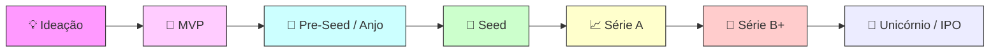
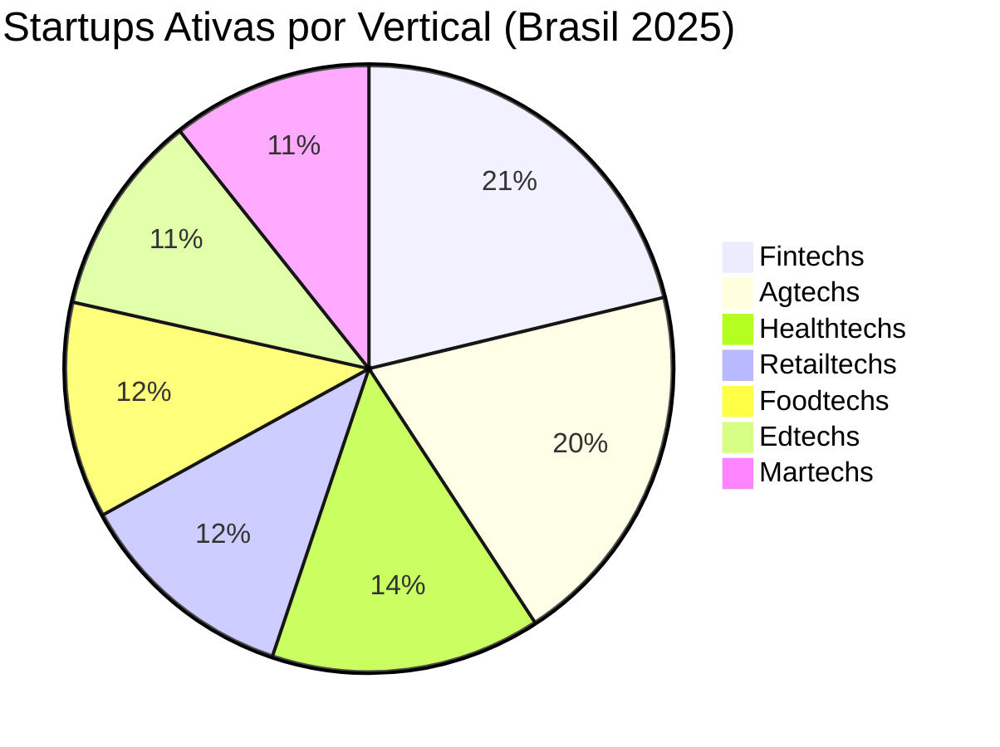
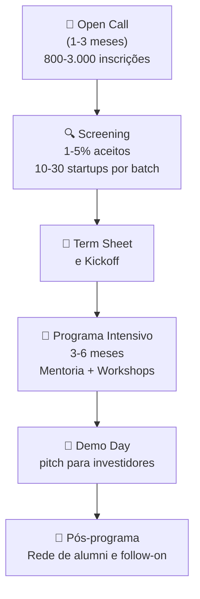
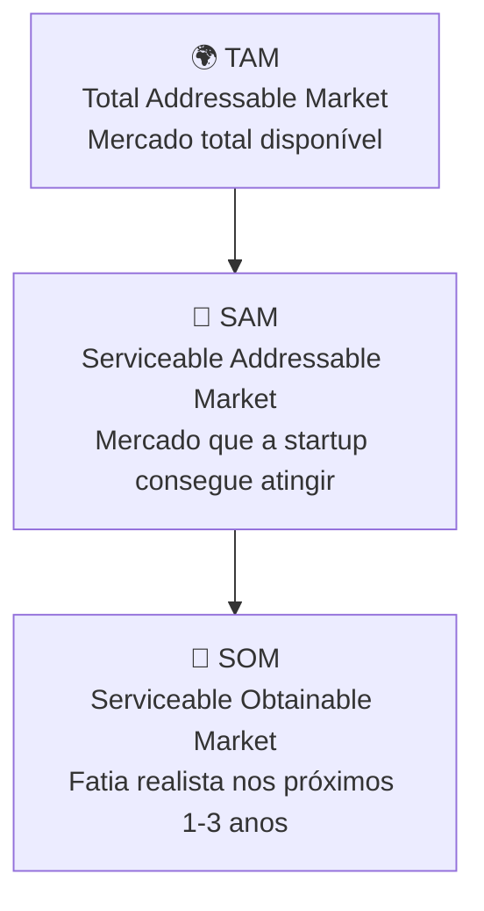

# Startups *

> [!info] Definição
> Startup é uma empresa emergente com base tecnológica que opera sob grande incerteza, busca resolver problemas reais com soluções repetíveis e escaláveis, e funciona com equipes ágeis e adaptativas.

## 🧩 Características Principais

![[Recursos/Empreendedorismo/Startups/caracteristicas-startup.svg|As 5 características principais de uma startup]]

### 1. Inovação
Produto, serviço ou modelo de negócio que traz algo novo ou melhora substancialmente o existente.

### 2. Escalabilidade
Capacidade de crescimento rápido, sem necessidade proporcional de aumento de custos.

### 3. Repetibilidade
O modelo deve permitir entregar valor de forma uniforme para vários clientes.

### 4. Alto Risco
Por trabalhar com inovação e incertezas tecnológicas e mercadológicas; muitos processos são experimentais.

### 5. Agilidade e Adaptabilidade
Capacidade de testar hipóteses, errar, pivotar e iterar rápido. Equipes enxutas e ciclos curtos.

---

## 🌐 Ecossistema de Inovação

![[Recursos/Empreendedorismo/Startups/workspace-empreendedor.jpg|Ambiente de trabalho típico de uma startup - Foto: Microsoft 365/Unsplash]]

### Atores Principais
- **Empreendedores/fundadores**: geram ideias, assumem risco
- **Universidades e centros de pesquisa**: fornecem conhecimento, talentos, infraestrutura
- **Investidores**: anjos, venture capital, fundos públicos
- **Apoiadores**: incubadoras, aceleradoras, parques tecnológicos, coworkings
- **Governo**: regulação, incentivos fiscais, legislação
- **Grandes empresas**: clientes, parceiros, canais de inovação

### Elementos Essenciais
- Acesso a recursos financeiros e estruturais
- Capital humano (talento técnico e gerencial)
- Cultura de inovação (tolerância ao erro, experimentação)
- Rede de conexões (mentores, pares, investidores)
- Políticas e ambiente regulatório favorável

> [!note] Definição no Brasil
> Empresa recente (até 4 anos) para alguns benefícios fiscais ou regulatórios.

---

## 🚀 Estágios de uma Startup: da Ideia ao Scale-up

Toda startup percorre um ciclo de maturidade que vai da ideia inicial até a escala de mercado. Cada estágio tem características, riscos e fontes de capital distintos.

### Detalhamento de Cada Estágio

| Estágio | O que é | Capital típico (2025) | Valuation pós-money |
|---|---|---|---|
| **Ideação** | Problema identificado, sem produto | Bootstrapping / 3Fs (friends, family, fools) | Sem valuation formal |
| **MVP** | Produto mínimo viável testado com usuários reais | Bootstrapping / Aceleradoras | Sem valuation formal |
| **Pre-Seed / Anjo** | Validação inicial, primeiros clientes | US$ 0,5 a 1 M | US$ 2 a 5 M |
| **Seed** | Tração comprovada, modelo de negócio em test | US$ 2,5 a 3,5 M (mediana 2025) | US$ 12 a 15 M |
| **Série A** | Crescimento com foco em escala | US$ 10 a 15 M (mediana 2025) | US$ 40 a 55 M |
| **Série B** | Expansão de mercado, time consolidado | US$ 30 a 40 M (mediana 2025) | US$ 120 a 160 M |
| **Série C+** | Internacionalização, aquisições | US$ 50 M+ | US$ 300 M+ |
| **Unicórnio / IPO** | Valuation acima de US$ 1 bilhão | Mercado de capitais | US$ 1 B+ |

> [!warning] Atenção: Conversão de Rounds
> Em 2025, a taxa de conversão de startups que passam de Seed para Série A caiu de ~50% para ~38%. O capital existe, mas os fundos estão muito mais seletivos do que em 2021.

---

## 🇧🇷 Ecossistema Brasileiro de Startups (2025-2026)

O Brasil é o maior ecossistema de startups da América Latina, com dados expressivos que valem conhecer.

### Números do Mercado (2025)

| Indicador | Dado |
|---|---|
| Total investido em startups BR (2025) | R$ 13 bilhões (US$ 4,5 bilhões) |
| Número de rodadas (2025) | 459 rodadas |
| Parcela em equity (vs crédito) | US$ 1,74 bilhão dos US$ 4,5 bi |
| Startups sem investimento em 2024 | 84,3% (Abstartups) |
| Variação vs 2024 | Queda de ~13 a 16% no volume |

> [!tip] Tendência Estrutural
> O mercado migrou de equity para crédito: em 2025, menos da metade dos investimentos foram em equity. Isso significa que os investidores querem garantias, não só apostas.

### Verticais com Mais Startups Ativas (2025)

### Verticais que Mais Captaram Investimento (2025)

| Vertical | Participação no total captado |
|---|---|
| Fintechs | 40% |
| Retailtechs | 11,7% |
| Healthtechs | 9,7% |
| Agtechs | 6,2% |
| Construtechs | 5,5% |

---

## 🦄 Unicórnios Brasileiros

Startups que atingem valuation de **US$ 1 bilhão** ou mais ganham o título de "unicórnio". O Brasil é líder na América Latina nessa categoria.

> [!success] Brasil em 2026
> O Brasil tem aproximadamente **22 a 25 unicórnios ativos**, sendo a maior concentração da América Latina. O Nubank é o maior, com capitalização de mercado de quase **US$ 67 bilhões** (2025).

### Caso Nubank: Do Seed ao Unicórnio

O Nubank é o caso mais emblemático de startup brasileira. Fundado em 2013, chegou ao status de unicórnio em apenas 5 anos.

| Ano | Evento | Valuation |
|---|---|---|
| 2013 | Fundação + Seed | US$ 5 M |
| 2014 | Série A | US$ 23 M |
| 2015 | Série B | US$ 45 M |
| 2016 | Série C | US$ 118 M |
| 2016 | Série D | US$ 900 M |
| **2018** | **Série E: Unicórnio** | **US$ 1 bilhão** |
| 2019 | Série F | US$ 10 bilhões |
| 2021 | Série G (com Berkshire Hathaway) | US$ 30 bilhões |
| 2021 | IPO na NYSE (ticker: NU) | US$ 41,5 bilhões |
| 2025 | Mercado aberto | US$ ~67 bilhões |

> [!example] 🧪 Atividade 1: Rastreando uma Startup Real no Crunchbase
>
> **Objetivo:** Aprender a mapear a trajetória de financiamento de uma startup real e identificar em qual estágio ela está.
>
> **Ferramenta:** [crunchbase.com](https://www.crunchbase.com) (acesso gratuito com cadastro)
>
> **Passo a passo:**
> 1. Acesse [crunchbase.com](https://www.crunchbase.com) e crie uma conta gratuita (ou use conta Google)
> 2. Pesquise por uma das startups brasileiras: **Nubank**, **iFood**, **Creditas**, **Gympass** ou **Olist**
> 3. Identifique: data de fundação, quem foram os investidores em cada rodada, total captado e valuation (quando disponível)
> 4. Monte uma **linha do tempo simples** com: Fundação → Seed → Série A → (próximas rodadas) → situação atual
> 5. Compare com a tabela de estágios desta aula: em qual estágio a empresa estava em cada ano?
>
> **Resultado observável:** Ao final, você deve ter uma tabela com pelo menos 4 rodadas e conseguir responder: "O valuation cresceu quanto do Seed até o estágio atual?"

---

## 🏢 Aceleradoras e Incubadoras

Aceleradoras são organizações que oferecem programas intensivos (3 a 6 meses) para ajudar startups a validar MVP, escalar vendas e conectar com investidores, geralmente em troca de 5% a 10% de equity.

> [!info] Diferença Básica
> **Incubadora:** suporte de longo prazo (1 a 3 anos), foco em estruturar o negócio, comum em universidades. **Aceleradora:** curto prazo (3 a 6 meses), foco em crescimento acelerado, termina com Demo Day para investidores.

### Como Funciona uma Aceleradora

### Principais Aceleradoras no Brasil (2026)

| Aceleradora | Foco Principal | Onde |
|---|---|---|
| **ACE Ventures** | B2B, SaaS, fintechs | São Paulo |
| **Darwin Startups** | Fintechs, big data, varejo | SP e Florianópolis |
| **Baita** | Generalista, early stage | São Paulo |
| **Cubo Itaú** | Tecnologia financeira | São Paulo |
| **InovAtiva Brasil** | Nacional (MCTI + SEBRAE) | Online (todo BR) |
| **Google for Startups** | Tecnologia, IA | Online |
| **WOW Aceleradora** | Impacto social | São Paulo |

> [!note] Em 2026 há 312 aceleradoras ativas no Brasil, segundo dados do ecossistema. O modelo chegou ao país em 2008, adaptado do Y Combinator (2005, EUA).

### Critérios Típicos de Seleção

As aceleradoras geralmente avaliam:
- **Time:** experiência, complementaridade e comprometimento dos fundadores
- **Problema:** tamanho real do mercado-alvo (TAM, SAM, SOM)
- **Solução:** diferencial e defensibilidade frente a concorrentes
- **Tração:** primeiros usuários, receita ou pilotos validados
- **Sinergia:** alinhamento com a tese de investimento da aceleradora

> [!example] 🧪 Atividade 2: Descobrindo Startups no Product Hunt
>
> **Objetivo:** Explorar como novas startups são lançadas ao mundo e desenvolver olhar crítico para avaliar propostas de valor.
>
> **Ferramenta:** [producthunt.com](https://www.producthunt.com) (acesso gratuito, sem cadastro para visualizar)
>
> **Passo a passo:**
> 1. Acesse [producthunt.com](https://www.producthunt.com) agora mesmo
> 2. A página inicial mostra os produtos lançados **hoje**, ordenados por votos da comunidade
> 3. Escolha **1 produto** lançado nas últimas 24 horas que pareça interessante
> 4. Leia a descrição, veja o vídeo (se houver) e leia pelo menos 3 comentários da comunidade
> 5. Responda por escrito:
>    - Qual é o **problema** que o produto resolve?
>    - Quem é o **público-alvo**?
>    - O modelo parece **gratuito, freemium ou pago**?
>    - Você votaria (upvote) nele? Por quê?
> 6. Compartilhe sua análise com a turma (2 minutos de apresentação oral)
>
> **Resultado observável:** Cada aluno apresenta 1 startup diferente, a turma vê ao vivo a diversidade de ideias sendo lançadas no mundo em um único dia.

---

## 💡 Potenciais Unicórnios Brasileiros para 2026

O relatório "Corrida dos Unicórnios 2026" do Distrito identificou 9 das 12 startups latino-americanas com maior probabilidade de atingir US$ 1 bilhão como brasileiras.

| Startup | Segmento | Por que é candidata |
|---|---|---|
| **Omie** | ERP SaaS para PMEs | Breakeven desde 2023, receita recorrente escalável |
| **Celcoin** | Infraestrutura financeira (APIs) | Enabler do embedded finance, B2B |
| **Flash** | Benefícios corporativos | Evoluiu de vale-refeição para hub de RH, modelo B2B recorrente |
| **Tractian** | Manutenção preditiva industrial | IA aplicada à indústria, expansão global |
| **Mottu** | Gestão financeira para PMEs | Cobrança, pagamentos e crédito integrados |

> [!tip] Tendência 2025-2026
> IA como diferencial competitivo consolidou-se em 2025. Startups AI-first estão captando rodadas proporcionalmente maiores. Fintechs continuam dominando: 7 das 12 finalistas do Distrito são do setor financeiro.

---

## 🧭 Como Avaliar uma Startup: Frameworks Básicos

### TAM, SAM, SOM

Investidores usam esse modelo para avaliar se o mercado justifica o investimento. Uma startup resolvendo um problema de nicho muito pequeno dificilmente atrai venture capital.

### Métricas Essenciais de uma Startup

| Métrica | O que mede |
|---|---|
| **MRR (Monthly Recurring Revenue)** | Receita recorrente mensal |
| **ARR (Annual Recurring Revenue)** | Receita recorrente anual |
| **CAC (Customer Acquisition Cost)** | Custo para adquirir 1 cliente |
| **LTV (Lifetime Value)** | Valor total que 1 cliente gera |
| **Churn Rate** | Taxa de cancelamento/abandono |
| **Runway** | Tempo até o dinheiro acabar |
| **Burn Rate** | Quanto dinheiro a startup gasta por mês |

> [!warning] Regra de Ouro
> **LTV deve ser pelo menos 3x o CAC.** Se custa R$ 100 adquirir um cliente e ele paga apenas R$ 150 durante toda a vida útil, o negócio provavelmente não é sustentável.

---

> [!note] 📚 Fontes (2026)
>
> - [Unicórnios Brasileiros: lista completa (Distrito, 2026)](https://www.distrito.me/blog/lista-dos-unicornios-brasileiros)
> - [Brasil lidera potenciais unicórnios na América Latina (Infomoney, 2026)](https://www.infomoney.com.br/business/startups-brasil-lidera-lista-de-potenciais-unicornios-da-america-latina-em-2026/)
> - [Ecossistema brasileiro de startups: balanço 2025 e tendências 2026 (LinkToLeaders)](https://linktoleaders.com/ecossistema-brasileiro-de-start-ups-balanco-de-2025-e-tendencias-para-2026-daniela-meirelles/)
> - [Startups movimentam R$ 13 bi em 2025 no Brasil (Diário do Comércio)](https://diariodocomercio.com.br/negocios/startups-brasil-investimentos-2025/)
> - [Startup Funding Rounds in 2025: valuations por estágio (ValueAdd VC)](https://valueaddvc.com/blog/startup-funding-rounds-in-2025-whats-normal-at-pre-seed-seed-a-and-b)
> - [Aceleradora de Startups: Guia 2026 (Baita)](https://baita.ac/tudo-sobre/aceleradora-startups)
> - [Nubank: histórico de funding e IPO (Tracxn, 2026)](https://tracxn.com/d/companies/nubank/__kV_SS911WdHxtZSWaKYtJCGXcwUSpLdH2zs_zsu6qKg)
> - [Product Hunt: plataforma de lançamentos](https://www.producthunt.com)
> - [Crunchbase: dados de financiamento de startups](https://www.crunchbase.com)
