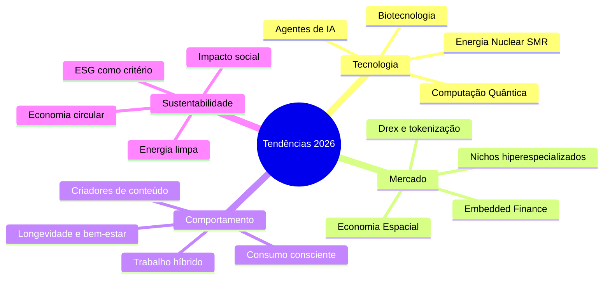

# Tendências do futuro

> [!tip] Transformação Digital
> As tendências do futuro estão moldando o empreendedorismo e os negócios através de tecnologias emergentes, mudanças comportamentais e novas oportunidades de mercado.

![[Recursos/Empreendedorismo/Tendências do futuro/tendencias-futuro.svg|Tendências do futuro para empreendedores]]

---

## 🗺️ Mapa das Tendências (visão geral)

---

## 💡 Tecnologias Emergentes

### Inteligência Artificial e Machine Learning
- Automação de processos e tomada de decisões
- Personalização em escala
- Análise preditiva e insights de dados
- **Novidade 2026:** mais de 60% dos empreendedores planejam usar IA para lançar seu negócio (QuickBooks, 2026)
- Ferramentas generativas (texto, imagem, código, voz) estão disponíveis para qualquer pessoa com acesso à internet

### 🤖 Agentes de IA: a próxima fronteira

> [!info] O que são agentes de IA?
> Diferente de um chatbot que apenas responde perguntas, um **agente** percebe o ambiente, planeja e executa tarefas complexas de forma autônoma. Em 2026, sistemas multi-agentes colaboram para automatizar fluxos inteiros de uma empresa.

- Um empreendedor solo pode operar um portfólio de negócios com equipes mínimas usando agentes
- Empresas funcionais estão sendo criadas em horas, não meses
- Agentes cuidam de: atendimento ao cliente, gestão de estoque, marketing, análise de dados e até contratações

| Uso do Agente de IA | Exemplo Prático | Impacto |
|---|---|---|
| Atendimento automatizado | Responde clientes 24h no WhatsApp | Reduz custo com equipe |
| Gestão de marketing | Cria e publica conteúdo diariamente | Aumenta presença digital |
| Análise financeira | Gera relatórios e alertas em tempo real | Decisão mais rápida |
| Desenvolvimento de produto | Cria protótipos de software | Acelera o lançamento |

### Blockchain e Web3
- Descentralização e transparência
- Criptomoedas e NFTs
- Contratos inteligentes
- **Drex (moeda digital do Banco Central):** previsto para 2026 no Brasil, vai permitir contratos inteligentes e tokenização de ativos. Impacto direto em startups de fintech e serviços financeiros.

### Realidade Aumentada e Virtual
- Experiências imersivas
- Treinamento e educação
- E-commerce virtual
- **Spatial computing:** óculos de realidade mista (Vision Pro, Meta Quest) criam novas interfaces para trabalho e consumo

### Internet das Coisas (IoT)
- Conectividade entre dispositivos
- Cidades inteligentes
- Automação residencial e industrial
- **Exemplo:** sensores em plantações, fábricas e hospitais gerando dados para tomada de decisão em tempo real

### ⚡ Energia Nuclear de Pequeno Porte (SMR)

> [!warning] Tendência emergente
> Os **Small Modular Reactors (SMRs)** reduzem o tempo de construção de usinas nucleares de 15 para apenas 3 anos. O primeiro SMR comercial terrestre do mundo (Linglong One, China) iniciou operações em 2026. Com data centers e IA consumindo cada vez mais energia, energia limpa e constante vira vantagem competitiva.

### 🧬 Biotecnologia e Longevidade
- Terapias gênicas superaram pílulas tradicionais em receita em 2025
- IA acelera o desenvolvimento de novos medicamentos (anos viram meses)
- Mercado de longevidade e saúde preventiva em explosão no Brasil
- Oportunidades: clínicas de medicina preventiva, apps de monitoramento, suplementos, healthtech

---

## 🧠 Mudanças Comportamentais

### Economia Colaborativa
- Compartilhamento de recursos
- Plataformas de consumo colaborativo
- Sustentabilidade e consumo consciente
- **Dado 2026:** 1 em cada 3 adultos nos EUA planeja abrir um negócio ou side hustle (QuickBooks, 2026), crescimento de 94% em relação ao ano anterior

### Trabalho Remoto e Híbrido
- Flexibilidade de localização
- Ferramentas de colaboração digital
- Novos modelos de gestão
- **Tendência:** cidades médias e interioranas ganham empreendedores que migraram dos grandes centros

### Personalização e Experiência
- Produtos e serviços sob medida
- Foco na jornada do cliente
- Valor em experiências, não apenas produtos
- **Regra de ouro 2026:** nichar é essencial. O consumidor quer algo que reflita sua personalidade e contexto específico. Empreender "para todo mundo" é erro crítico.

### 🎨 Economia Criativa e Criadores de Conteúdo
- Criadores independentes (YouTube, Instagram, TikTok, Substack) constroem audiências e negócios próprios
- **Regra dos 1.000 fãs verdadeiros:** com agentes de IA gerenciando operações, um criador com 1.000 fãs comprometidos pode sustentar um negócio
- Marcas buscam co-criação com públicos digitalmente nativos

---

## 🌱 Oportunidades de Mercado

### Sustentabilidade e ESG
- Negócios verdes e sustentáveis
- Responsabilidade social corporativa
- Energia renovável
- **Dado 2026:** negócios com foco em sustentabilidade capturam até 30% mais valor de marca (CNN Brasil, 2026)
- ESG deixou de ser diferencial: virou critério de decisão de investidores e consumidores

### Saúde e Bem-estar
- Tecnologias de saúde digital
- Wellness e qualidade de vida
- Longevidade e envelhecimento ativo
- **Oportunidade BR:** com população envelhecendo, mercado sênior (produtos, cuidado, lazer, tecnologia acessível) está em expansão acelerada

### Educação e Aprendizado Contínuo
- EdTech e plataformas de ensino
- Microlearning e capacitação rápida
- Educação personalizada
- **Contexto:** automação elimina funções rotineiras, criando demanda urgente por requalificação profissional

### 💳 Fintech e Embedded Finance
- **Embedded finance:** serviços financeiros integrados em produtos não-financeiros (ex.: crédito dentro de um app de marketplace)
- Estimativa: R\$ 24 bilhões em receita adicional no Brasil em 2026 (TI Inside, 2026)
- Open Finance e PIX ainda têm muito espaço para inovação
- Embedded finance deve representar 30% de toda receita financeira na América Latina até 2030

### 🚀 Economia Espacial
- Manufatura em órbita e novos materiais
- Índia vai de US\$ 8-9 bi para US\$ 45 bi no setor espacial até meados de 2030
- Satélites de baixa órbita democratizam internet em regiões remotas
- Oportunidades indiretas: logística, dados de sensoriamento remoto, agronegócio de precisão

---

## 📊 Panorama: Tendências em Números (2026)

| Tendência | Dado | Fonte |
|---|---|---|
| IA como ferramenta de lançamento | 60% dos empreendedores usarão IA para abrir negócio | QuickBooks 2026 |
| Mercado global de IA | US\$ 4,8 trilhões até 2033 | UNCTAD |
| Embedded finance no Brasil | R\$ 24 bi de receita adicional em 2026 | TI Inside |
| Sustentabilidade | +30% valor de marca para negócios sustentáveis | CNN Brasil |
| Energia nuclear SMR | Crescimento de \$5 bi para \$25 bi até 2030 | Kaizen/Deloitte |
| Intenção empreendedora EUA | 33% dos adultos querem abrir negócio (alta de 94%) | QuickBooks 2026 |

---

## 🧪 Atividades Mão-na-Massa

> [!example] 🧪 Atividade 1: Caça às tendências no Exploding Topics
> **Objetivo:** encontrar uma tendência em ascensão que ainda não virou mainstream.
>
> **Passos:**
> 1. Acesse [explodingtopics.com](https://explodingtopics.com) (gratuito, sem cadastro)
> 2. Filtre por categoria: **Business**, **Technology** ou **Health**
> 3. Selecione o período **6 meses** ou **1 ano**
> 4. Identifique 1 tendência com crescimento acima de 100% e que você ainda não conhecia
> 5. Pesquise no Google: o que é, quem já está lucrando com isso, existe espaço no Brasil?
>
> **Resultado esperado:** apresentar ao grupo o nome da tendência, o gráfico de crescimento e uma hipótese de negócio viável no mercado brasileiro.

> [!example] 🧪 Atividade 2: Da tecnologia ao negócio em 15 minutos
> **Objetivo:** exercitar o pensamento empreendedor a partir de tecnologias emergentes.
>
> **Passos:**
> 1. Escolha 3 tecnologias desta aula que você ainda não conhecia bem
> 2. Para cada uma, preencha a ficha abaixo (pode ser no papel ou numa ferramenta como [Canva](https://canva.com) ou [Miro](https://miro.com)):
>    - **Tecnologia:** (ex.: agentes de IA)
>    - **Problema que resolve:** (ex.: empresas gastam muito com atendimento humano)
>    - **Ideia de negócio:** (ex.: agência que configura agentes de IA para pequenos comércios)
>    - **Quem pagaria por isso?** (ex.: lojistas, clínicas, restaurantes)
>    - **Quanto cobraria?** (ex.: R\$ 500/mês por cliente)
> 3. Compartilhe 1 ideia com a turma. Vote na mais original.
>
> **Resultado esperado:** ao menos 1 ideia de negócio por participante, com cliente-alvo e modelo de receita esboçados.

> [!example] 🧪 Atividade 3: Batalha de tendências no Google Trends
> **Objetivo:** comparar o interesse real do mercado por duas tecnologias ao longo do tempo.
>
> **Passos:**
> 1. Acesse [trends.google.com.br](https://trends.google.com.br)
> 2. No campo de busca, adicione dois termos que representam tecnologias desta aula (ex.: "inteligência artificial" vs "blockchain" ou "trabalho remoto" vs "trabalho híbrido")
> 3. Configure o período para **2019 a hoje** (5 anos)
> 4. Observe: qual cresceu mais? Houve pico e queda? Qual está em alta agora?
> 5. Mude a região para **Brasil** e compare com os resultados globais
>
> **Resultado esperado:** captura de tela do gráfico comparativo + 3 observações sobre o que os dados dizem para um empreendedor que quer entrar nesse mercado.

---

> [!warning] Adaptação Necessária
> Empreendedores precisam estar atentos a essas tendências para identificar oportunidades, adaptar modelos de negócio e criar soluções relevantes para o futuro.

> [!tip] Convergência é a grande aposta
> A próxima década não será definida por uma tecnologia isolada, mas pela **convergência simultânea** de IA, biotecnologia, energia limpa e robótica. Empreendedores que conectam essas áreas terão vantagem competitiva duradoura. (Saúde Digital News, 2026)

---

> [!note] 📚 Fontes (2026)
> - [CNN Brasil: Tendências de empreendedorismo para 2026](https://www.cnnbrasil.com.br/economia/negocios/empreendedorismo-veja-as-tendencias-do-mercado-para-ficar-de-olho-em-2026/)
> - [QuickBooks: 2026 Entrepreneurship Trends](https://quickbooks.intuit.com/r/small-business-data/entrepreneurship-in-2026/)
> - [Deloitte: Tech Trends 2026](https://www.deloitte.com/us/en/insights/topics/technology-management/tech-trends.html)
> - [Capgemini: Top Tech Trends 2026](https://www.capgemini.com/insights/research-library/top-tech-trends-of-2026/)
> - [TI Inside: Embedded finance no Brasil](https://tiinside.com.br/26/05/2026/embedded-finance-deve-movimentar-us-18-bilhoes-no-brasil-ate-2030/)
> - [FIA: 8 principais tendências de IA para empresas em 2026](https://fia.com.br/blog/tendencias-de-ia-para-empresas-em-2026-2/)
> - [Seu Dinheiro: IA, robótica, biotecnologia e energia nuclear em 2026](https://www.seudinheiro.com/2026/economia/ia-robos-biotecnologia-e-energia-nuclear-como-investir-em-etfs-das-teses-de-2026-mlim/)
> - [Saúde Digital News: Convergência tecnológica 2026](https://saudedigitalnews.com.br/08/01/2026/a-proxima-decada-nao-sera-sobre-uma-tecnologia-mas-sobre-a-convergencia-de-todas/)
> - [Kaizen: Tendências da energia nuclear SMR 2026](https://kaizen.com/insights/nuclear-energy-trends-2026/)
> - [IBM: Business and technology trends 2026](https://www.ibm.com/thought-leadership/institute-business-value/en-us/report/business-trends-2026)
