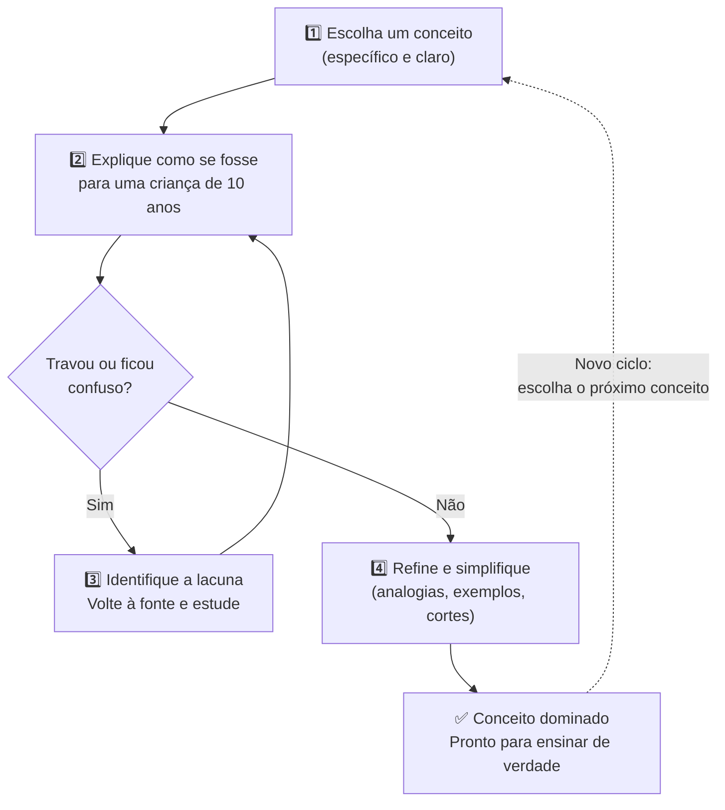
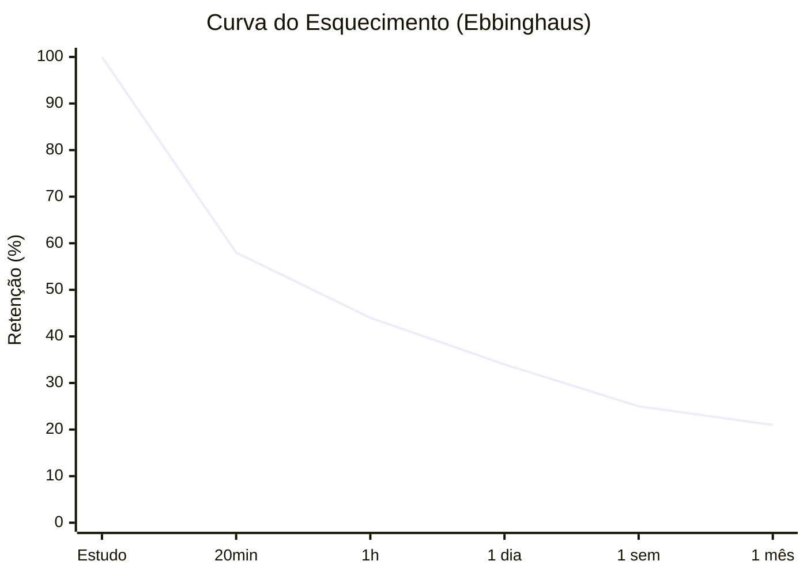
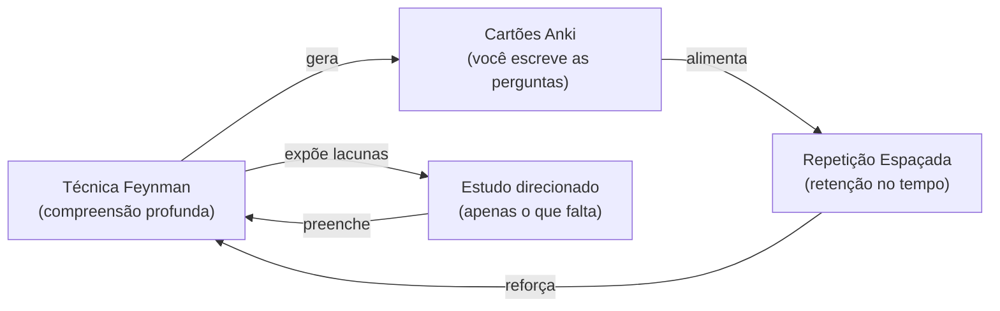

# Técnicas de aprendizagem (Técnica Feynman)

> [!info] Princípio Fundamental
> Se você realmente entende um assunto, consegue explicar para alguém que não sabe nada sobre ele usando termos simples. Se não conseguir, é sinal de que ainda há lacunas no seu entendimento.

## 🎯 Os 4 Passos da Técnica Feynman

![[Recursos/Empreendedorismo/Técnicas de aprendizagem (Técnica Feynman)/tecnica-feynman.svg|Os 4 passos da Técnica Feynman]]

### 1. Escolha um Conceito
Defina claramente o que você quer aprender. Pode ser algo novo ou um conceito que você já viu, mas quer dominar.

### 2. Ensine como se fosse para uma Criança
Imagine que você vai explicar para alguém sem conhecimento prévio. Use linguagem simples, evite termos técnicos ou jargões. Se precisar usar, explique o que significam.

### 3. Identifique Lacunas no seu Conhecimento
Ao ensinar, você vai perceber partes que não controla bem ou que ficou confuso. Anote o que não conseguiu explicar direito. Depois, volte às suas fontes de estudo para preencher essas lacunas.

### 4. Refine e Simplifique
Reescreva sua explicação usando analogias, exemplos concretos, linguagem ainda mais simples. Corte detalhes desnecessários. Se puder, ensine de novo para alguém ou fale em voz alta.

---

## 🧠 Por que Funciona

- **Pensamento ativo**: ensinar algo exige organizar bem o pensamento
- **Revela o que você não sabe**: identificar essas falhas é essencial para aprender de verdade
- **Melhora retenção**: organizar e estruturar o aprendizado facilita a aplicação

> [!tip] Ciência por trás da técnica
> A Técnica Feynman combina dois dos mecanismos de aprendizagem mais validados pela ciência cognitiva: **recall ativo** (recuperar informação da memória, não apenas relê-la) e **auto-explicação** (construir modelos mentais coerentes ao verbalizar). Estudos de 2025 publicados na ScienceDirect confirmam que a combinação de recall ativo com repetição espaçada melhora significativamente o desempenho acadêmico em comparação ao estudo passivo.

---

## 📋 Dicas para Aplicar Bem

- **Escreva**: forçar-se a colocar no papel ajuda a organizar ideias
- **Fale em voz alta**: verbalizar traz à tona onde ainda está inseguro
- **Use analogias**: exemplos do dia a dia tornam o aprendizado mais concreto
- **Revise múltiplas vezes**: cada ciclo de refino aprofunda o entendimento

---

## 🔁 Repetição Espaçada: o Parceiro Natural do Feynman

A Técnica Feynman resolve o problema de **profundidade** do conhecimento. A **repetição espaçada** resolve o problema de **retenção ao longo do tempo**. Usadas juntas, formam o sistema mais poderoso de aprendizagem que a ciência cognitiva conhece hoje.

### O que é repetição espaçada

Em vez de rever um conteúdo várias vezes no mesmo dia (cramming), a repetição espaçada distribui as revisões ao longo do tempo. Cada vez que você revisa com sucesso, o próximo intervalo aumenta. Se errar, o intervalo recua. O algoritmo acompanha sua curva de esquecimento individual.

### A curva do esquecimento de Ebbinghaus

> [!warning] Sem revisão, o cérebro esquece rápido
> Após 24 horas sem revisar, retemos menos de 35% do que estudamos. Após 1 semana, menos de 25%. A repetição espaçada interrompe essa queda ao criar revisões no momento exato em que o cérebro está prestes a esquecer.

### Comparativo: cramming vs. repetição espaçada

| Critério | Cramming (estudar tudo de uma vez) | Repetição Espaçada |
|---|---|---|
| Retenção no dia seguinte | Alta | Alta |
| Retenção após 1 semana | Baixa (queda abrupta) | Alta (curva suave) |
| Retenção após 1 mês | Muito baixa | Moderada a alta |
| Esforço total por ciclo | Alto (sessão longa) | Baixo (sessões curtas) |
| Sensação subjetiva | Fácil e confortável | Difícil (desejável) |
| Resultado real | Ilusão de aprendizado | Aprendizado profundo |

> [!info] Por que a dificuldade é boa
> A ciência chama isso de **dificuldade desejável**: técnicas que parecem mais difíceis no momento produzem retenção muito superior a longo prazo. O cérebro fortalece as conexões neurais exatamente quando precisa se esforçar para recuperar uma informação.

---

## 💼 Conexão com Empreendedorismo

A Técnica Feynman não é só uma estratégia de estudo. É uma habilidade de comunicação essencial para quem empreende.

### Por que empreendedores precisam de clareza radical

| Situação | O que o Feynman treina |
|---|---|
| Pitch para investidor | Explicar o problema e a solução em 2 minutos, sem jargão |
| Apresentação para cliente | Mostrar valor sem assumir conhecimento técnico do outro lado |
| Reunião com sócios e equipe | Alinhar entendimento sobre estratégia e produto |
| Apresentação para banco/fomento | Justificar modelo de negócio de forma simples e convincente |
| Entrevista de emprego ou parceria | Demonstrar domínio real, não decorado |

> [!quote] Richard Feynman
> "O primeiro princípio é que você não deve enganar a si mesmo, e você é a pessoa mais fácil de enganar."

Muitos empreendedores usam jargão para esconder falta de entendimento real do próprio negócio. Investidores experientes percebem isso imediatamente. Quem passou pelo ciclo Feynman sabe exatamente onde seu modelo tem furos, e fala sobre eles com honestidade.

---

## 🧪 Atividades Práticas

> [!example] 🧪 Atividade 1: Feynman no celular
> **Ferramenta:** celular com gravador de voz (app nativo)
>
> **Como fazer:**
> 1. Escolha UM conceito desta disciplina que você estudou recentemente (ex.: canvas de modelo de negócio, validação de hipóteses, proposta de valor).
> 2. Abra o gravador e fale, sem ler nada, como se estivesse explicando para alguém de 10 anos que nunca ouviu falar no assunto. Mínimo de 2 minutos.
> 3. Ouça a gravação completa e marque (com caneta no caderno ou no app de notas) cada momento em que você: (a) travou, (b) usou jargão sem explicar, (c) ficou vago ou inventou algo.
> 4. Para cada ponto marcado, volte ao material e estude essa parte específica.
> 5. Repita a gravação. Compare as duas versões.
>
> **Resultado observável:** você terá uma lista concreta das lacunas reais no seu conhecimento, não uma lista imaginada. A segunda gravação será visivelmente mais fluida e precisa.

---

> [!example] 🧪 Atividade 2: Deck Anki com repetição espaçada
> **Ferramenta:** [Anki](https://apps.ankiweb.net/) (gratuito, disponível para Android, iOS e PC)
>
> **Como fazer:**
> 1. Instale o Anki no celular ou no computador.
> 2. Crie um deck chamado "Empreendedorismo".
> 3. Crie exatamente 5 cartões, um para cada conceito abaixo, VOCÊ escrevendo a resposta (não copiar da internet):
>    - Frente: "O que é proposta de valor?" / Verso: sua explicação em 1-2 frases simples.
>    - Frente: "Qual a diferença entre receita e lucro?" / Verso: sua explicação com exemplo.
>    - Frente: "O que valida uma hipótese de negócio?" / Verso: critério concreto que você escolher.
>    - Frente: "Para que serve o MVP?" / Verso: explicação sem jargão.
>    - Frente: "O que é mercado-alvo?" / Verso: definição com exemplo do seu entorno.
> 4. Estude o deck pelo Anki todos os dias por 5 minutos durante 2 semanas. O algoritmo vai ajustar os intervalos automaticamente.
>
> **Resultado observável:** após 2 semanas, você vai conseguir responder esses 5 conceitos de memória, sem consultar material, com retenção comprovada pelo próprio algoritmo do Anki.

---

> [!example] 🧪 Atividade 3: Ensinar e colher perguntas
> **Ferramenta:** caderno ou app de notas + 1 pessoa (colega, familiar, amigo)
>
> **Como fazer:**
> 1. Escolha 1 conceito do seu projeto empreendedor atual (ou de um negócio que você admira).
> 2. Explique esse conceito para alguém fora da sala de aula, presencialmente ou por mensagem de voz. A pessoa não precisa saber nada sobre o assunto.
> 3. Peça que ela faça perguntas livremente enquanto você explica.
> 4. Anote as 3 perguntas que você não soube responder bem (ou que te pegaram de surpresa).
> 5. Para cada uma dessas 3 perguntas, escreva uma resposta clara no caderno após pesquisar.
>
> **Resultado observável:** você vai descobrir as suposições ocultas que estava fazendo sobre o seu próprio conhecimento. As perguntas de quem não sabe nada são as mais reveladoras.

---

## 🔗 Feynman, Anki e o Ciclo Completo de Aprendizagem

> [!tip] Como integrar na rotina
> - **Antes de uma aula nova:** use Feynman para revisar o conteúdo anterior (2-3 minutos falando em voz alta).
> - **Após uma aula:** crie 2 a 3 cartões Anki com os conceitos centrais, com você escrevendo as respostas.
> - **Diariamente:** 5 a 10 minutos de revisão no Anki (pode ser no ônibus, na fila, antes de dormir).
> - **Antes de uma prova ou apresentação:** aplique a Atividade 3 (ensinar alguém) para fechar lacunas restantes.

---

> [!note] 📚 Fontes (2025-2026)
> - [Feynman Technique vs Active Recall, Mindomax (2025)](https://www.mindomax.com/feynman-technique-vs-active-recall)
> - [Active Recall + Feynman Technique: The Ultimate Study Method, Intellecs.ai (2025)](https://www.intellecs.ai/blog/active-recall-feynman-technique-the-ultimate-study-method)
> - [Spaced repetition and active recall improves academic performance among pharmacy students, ScienceDirect (2025)](https://www.sciencedirect.com/science/article/abs/pii/S187712972500231X)
> - [Anki Use and Academic Performance: A Systematic Review, Springer Nature (2026)](https://link.springer.com/article/10.1007/s40670-026-02643-5)
> - [Mastering Learning with the Feynman Technique and Active Spaced Repetition, Medium/IntelliBoosters (2025)](https://medium.com/intelliboosters/mastering-learning-with-the-feynman-technique-and-active-spaced-repetition-f3f1edbf3b85)
> - [Técnica Feynman, conexão com empreendedorismo, Exame Carreira (2025)](https://exame.com/carreira/guia-de-carreira/como-usar-a-tecnica-feynman-para-estudar-e-aprender-materias-dificeis/)
> - [The Feynman Technique: Comprehensive Breakdown, Noji.io (2025)](https://noji.io/blog/the-feynman-technique/)
