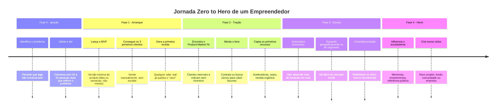
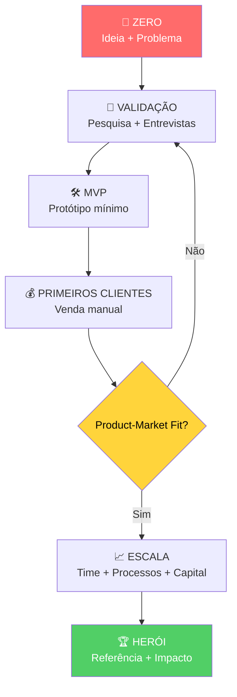

# Zero to hero (o que é)

> [!info] Jornada de Transformação
> "Zero to hero" é a jornada de desenvolvimento de habilidades do iniciante ao especialista, transformando-se de alguém sem conhecimento para um mestre em determinada área.

---

## 🗺️ O Que Significa "Zero to Hero"?

O conceito nasce da ideia simples de que **todo especialista já foi um iniciante completo**. No empreendedorismo, isso significa partir do zero: sem produto, sem cliente, sem receita, e construir algo relevante passo a passo.

Não é magia. É um processo com etapas identificáveis, obstáculos previsíveis e ferramentas concretas para cada fase.

> [!quote] Ideia Central
> "Cada fundador de sucesso que você admira já teve um momento em que não sabia nada e não tinha nada. A diferença é que eles não pararam no zero."

---

## 📊 Modelo de Aquisição de Habilidades (Dreyfus)

![[Recursos/Empreendedorismo/Zero to hero (o que é)/modelo-dreyfus.svg|Modelo Dreyfus - Jornada do Novato ao Especialista]]

### 1. Novato (Iniciante)
- Depende de regras e instruções
- Executa tarefas simples
- Pouco contexto

**Ações para evoluir:**
- Buscar cursos básicos ou tutoriais
- Estudar fundamentos e princípios
- Usar instruções guiadas

### 2. Iniciante Avançado
- Reconhece padrões
- Aplica regras em novos contextos

**Ações para evoluir:**
- Praticar em diversos cenários
- Adaptar técnicas a situações diferentes
- Solicitar feedback estruturado

### 3. Competente
- Analisa problemas e prioriza tarefas
- Atua de forma deliberada

**Ações para evoluir:**
- Trabalhar em projetos reais completos
- Gerenciar desafios maiores com autonomia
- Usar autoavaliação e revisão crítica

### 4. Proficiente
- Intuição maior, decisões guiadas pela experiência
- Fluência na área

**Ações para evoluir:**
- Dominar ferramentas avançadas e técnicas emergentes
- Compartilhar conhecimento (mentoria, palestras, blogs)
- Continuar inovando em contextos variáveis

### 5. Especialista/Mestre
- Automação do pensamento
- Cria novos métodos
- Modelo para outros

**Ações:**
- Criar estilo ou abordagem única
- Contribuir de forma original para o campo
- Continuar experimentando e reinventando

---

## ⚡ Técnicas que Aceleram o Progresso

- **Prática Deliberada**: focar em aspectos específicos que precisam melhoria
- **Feedback constante**: de mentores, colegas ou comunidade
- **Projetos concretos**: demonstram aplicação real e fixam aprendizado
- **Ensinar outros**: explicar algo solidifica seu próprio entendimento
- **Aprender em comunidade**: fóruns, grupos, conferências

---

## 📐 Modelo 70-20-10 de Aprendizado

- **70%** com experiência prática (resolvendo problemas reais)
- **20%** com aprendizagem social (mentoria, feedback)
- **10%** com cursos, leituras e estudo formal

> [!tip] Obstáculos Comuns
> Frustração com progresso lento, sobrecarregar-se com múltiplos objetivos e estagnação. Solução: escolher um objetivo de cada vez, variar contextos de aprendizado e enfrentar desafios novos.

---

## 🏆 Casos Reais: de Zero a Herói no Brasil

O conceito não é abstrato. Há casos concretos e verificáveis de fundadores brasileiros (e com atuação no Brasil) que partiram do zero absoluto:

### Nubank: de frustrante experiência bancária a US$ 41 bilhões 🟣

| Marco | Ano | O que aconteceu |
|-------|-----|-----------------|
| Ideia nasce | 2012 | David Vélez chega ao Brasil e sofre com burocracia bancária para abrir uma conta |
| Fundação | 2013 | Co-funda o Nubank com Cristina Junqueira e Edward Wible em São Paulo |
| Primeiro produto | Set/2014 | Lança o "roxinho": cartão de crédito sem anuidade, 100% digital |
| Crescimento | 2014-2019 | Cresce via indicação, sem agência física |
| Expansão | 2020 | Entra em Argentina, México e Colômbia |
| IPO na NYSE | Dez/2021 | Avaliação de US$ 41,48 bi, superando Itaú no dia do lançamento |
| Presente | 2026 | Mais de 131 milhões de clientes na América Latina |

**A lacuna que David viu:** o sistema bancário brasileiro cobrava tarifas abusivas e tinha burocracia extrema. Ninguém tinha criado uma alternativa digital de escala. Ele não era banqueiro; era engenheiro com experiência em venture capital.

> [!example] Zero identificado por David Vélez
> "Eu fui abrir uma conta no Brasil e levei semanas, passei por detector de metal, trouxe documentos. Fui a cinco reuniões. Achei absurdo."

---

### Caito Maia (Chilli Beans): de estande em feira a maior rede de óculos do Brasil 🕶️

- **Zero:** estande improvisado em feiras de São Paulo nos anos 1990, vendendo óculos importados
- **Herói:** fundou a Chilli Beans, que hoje tem mais de 1.000 pontos de venda em 40 países
- **Chave:** apostou em produto acessível, design e ponto de venda diferenciado (quiosques)

---

### Bruna Vasconi (Peça Rara Brechó): de empréstimo de R$ 7 mil a negócio reconhecido 👗

- **Zero:** emprestou R$ 7 mil da avó para abrir um brechó com peças em consignação ainda adolescente
- **Herói:** hoje CEO de empresa de moda circular com relevância nacional
- **Chave:** identificou uma tendência (sustentabilidade + moda) antes de virar mainstream

---

## 🔄 A Jornada Zero to Hero no Empreendedorismo: Diagrama

---

## 🗂️ Fases da Jornada e Habilidades por Estágio

> [!warning] O Loop de Validação é Normal
> Voltar da fase MVP para validação não é fracasso: é aprendizado. A maioria dos grandes produtos passou por 2 a 5 pivôs antes de encontrar o Product-Market Fit.

---

## 📋 Habilidades por Fase da Jornada

| Fase | Habilidade-chave | Ferramenta Prática |
|------|-----------------|-------------------|
| Zero (Ideia) | Observação + empatia | Entrevistas com clientes potenciais |
| Validação | Pesquisa de mercado rápida | Google Forms, conversas diretas |
| MVP | Execução mínima | Nocode (Notion, Glide, Bubble) |
| Primeiros clientes | Vendas e comunicação | WhatsApp, email direto, redes sociais |
| Tração | Análise de dados | Planilhas, Google Analytics |
| Escala | Liderança e gestão | OKRs, ferramentas de gestão de time |
| Herói | Visão estratégica e influência | Comunidade, conteúdo, mentoria |

---

## 🌐 O Cenário Atual: Por Que "Agora" é um Bom Momento para Começar do Zero?

Dados de 2025-2026 mostram que o ambiente empreendedor brasileiro está em transformação:

- **3,9 milhões de novas empresas** abertas no Brasil em 2025, sendo 97,6% micro e pequenas
- **78% das startups brasileiras** já integram IA em seu core business (dado de 2026)
- **47% das micro e pequenas empresas** já usam ferramentas com inteligência artificial
- **22 unicórnios brasileiros** existentes em 2026, incluindo a Enter (IA jurídica), que se tornou unicórnio em maio de 2026
- Tendência de **interiorização**: franquias e startups expandindo para cidades médias e pequenas, o que cria oportunidade real para quem está fora de São Paulo e Rio

> [!success] Oportunidade para Quem Está em Cidades do Interior
> Campos dos Goytacazes e municípios similares entram exatamente na onda de interiorização do empreendedorismo brasileiro. Conhecer profundamente o contexto local é uma vantagem competitiva real frente a fundadores de grandes centros.

---

## 🧭 O Roadmap de Habilidades para o Empreendedor Zero

O site [roadmap.sh](https://roadmap.sh) oferece mapas visuais de aprendizado para diversas áreas técnicas. Um empreendedor de tecnologia pode usar esses roadmaps para identificar exatamente **onde está no espectro zero-to-hero** em habilidades como desenvolvimento web, IA, ou gestão de produto.

A lógica é a mesma do modelo Dreyfus: identificar em qual estágio você está em cada habilidade necessária, e escolher deliberadamente a próxima lacuna a fechar.

---

## 🧪 Atividades Mão na Massa

> [!example] 🧪 Atividade 1: Meu Roadmap Zero to Hero Pessoal
> **Objetivo:** construir seu próprio mapa de evolução com marcos concretos.
>
> **Passos:**
> 1. Acesse [trello.com](https://trello.com) ou [notion.so](https://notion.so) e crie um quadro gratuito
> 2. Crie 5 colunas: **Zero**, **Aprendendo**, **Competente**, **Proficiente**, **Herói**
> 3. Escolha **uma habilidade empreendedora** que você quer desenvolver (ex.: vender, programar, criar conteúdo)
> 4. Crie ao menos **5 cards** com marcos verificáveis (ex.: "fazer minha primeira venda de R$ 1", "publicar meu primeiro post sobre meu negócio", "conseguir 3 feedbacks de clientes reais")
> 5. Mova os cards conforme avança
>
> **Resultado observável:** ao final você terá um roadmap pessoal com pelo menos 5 marcos mensuráveis para a habilidade escolhida, e saberá exatamente em que estágio Dreyfus se encontra hoje.

---

> [!example] 🧪 Atividade 2: Arqueologia de Fundador (linha do tempo real)
> **Objetivo:** mapear os marcos reais da jornada de um fundador que começou do zero.
>
> **Passos:**
> 1. Escolha um fundador brasileiro ou mundial que partiu do zero (sugestões: David Vélez/Nubank, Caito Maia/Chilli Beans, Bruna Vasconi/Peça Rara Brechó)
> 2. Acesse a **Wikipédia** da empresa ou o **site oficial** do fundador
> 3. Pesquise também no YouTube por entrevistas do fundador no Roda Viva, Sharks Brasil, ou podcasts como Primo Cast e StartSe
> 4. Crie uma **linha do tempo** no Trello/Notion com pelo menos **6 marcos** reais: fundação, primeiro cliente, primeiro pivô, primeira crise, primeiro grande investimento, referência de herói
> 5. Identifique: em qual fase (Dreyfus ou diagrama da aula) o fundador estava em cada marco?
>
> **Resultado observável:** você terá uma linha do tempo documentada de um caso real, conseguirá nomear ao menos 2 momentos em que o fundador estava claramente em fase de "zero", e conectará esses momentos a uma das fases do diagrama mermaid da aula.

---

> [!example] 🧪 Atividade 3: Mapa de Lacunas com roadmap.sh
> **Objetivo:** identificar, com base em um roadmap real, onde exatamente você está no espectro zero-to-hero para uma habilidade do seu objetivo.
>
> **Passos:**
> 1. Defina um objetivo empreendedor seu (ex.: lançar uma loja virtual, criar um app, montar um serviço de freelance)
> 2. Acesse [roadmap.sh](https://roadmap.sh) e escolha o roadmap mais próximo da habilidade técnica necessária (ex.: Frontend, Backend, IA, UX Design)
> 3. Percorra o roadmap e marque mentalmente (ou numa cópia impressa): verde = já sei, amarelo = conheço superficialmente, vermelho = zero
> 4. Identifique os **3 itens vermelhos mais críticos** para o seu objetivo específico
> 5. Para cada um, pesquise e anote: qual curso gratuito ou recurso você usaria para sair do vermelho para o amarelo?
>
> **Resultado observável:** ao final você terá um diagnóstico honesto de 3 lacunas prioritárias com um plano de ação concreto (recurso + prazo estimado) para cada uma.

---

## 💡 Por Que a Maioria Para no "Zero"?

Pesquisas sobre comportamento empreendedor apontam alguns padrões recorrentes de paralisia:

| Razão para parar | Resposta prática |
|-----------------|-----------------|
| "Não tenho capital" | MVP não precisa de capital: valide com conversa antes de construir |
| "Não tenho ideia" | Observe um problema que você mesmo tem ou que alguém próximo tem |
| "Não sei programar / não sei o mercado" | Lacuna de habilidade = oportunidade de aprendizado deliberado |
| "Já existe alguém fazendo isso" | Execução e contexto local valem mais que ideia inédita |
| "Não é o momento certo" | O momento certo é uma ilusão: o aprendizado só começa ao agir |

> [!tip] A Regra do "1% melhor a cada semana"
> Se você melhorar 1% por semana em uma habilidade empreendedora, em 1 ano você é **67% melhor** do que era. Consistência supera intensidade esporádica em qualquer jornada zero to hero.

---

## 🔗 Conexões com Outros Conceitos da Disciplina

- **Lean Startup:** compreender o ciclo Build-Measure-Learn como mecanismo de sair do zero
- [[MVP]] a ferramenta central da Fase 1 da jornada
- [[Design thinking]] a mentalidade de empatia que guia a fase de validação
- [[Business Model Canvas]] a estrutura que dá forma à ideia em estágio avançado
- [[Pitch (como fazer um Pitch - apresentação)]] a habilidade de comunicar a jornada e o estágio atual da sua startup

---

> [!note] 📚 Fontes (2026)
> - [Histórias de Sucesso: 5 Empreendedores Brasileiros (RioPreCont, 2025)](https://rioprecont.com.br/2025/06/17/historias-de-sucesso-5-empreendedores-brasileiros-que-comecaram-do-zero/)
> - [Lista dos Unicórnios Brasileiros 2026 (Distrito)](https://www.distrito.me/blog/lista-dos-unicornios-brasileiros)
> - [David Vélez: história do fundador do Nubank (Renova Invest)](https://renovainvest.com.br/blog/david-velez-conheca-a-historia-do-fundador-e-ceo-do-nubank/)
> - [Nubank: Uma viagem de dez anos (Blog oficial)](https://international.nubank.com.br/pt-br/companhia/uma-viagem-de-dez-anos-por-david-velez/)
> - [7 Tendências de Empreendedorismo 2026 (Vanquish)](https://blog.vanquish.com.br/blog/tendencias-empreendedorismo-2026)
> - [Startups: 6 tendências para 2026 (ABStartups via Empreendedor.com.br)](https://empreendedor.com.br/tecnologia/startups/startups-6-tendencias-que-vao-guiar-o-ecossistema-em-2026-segundo-a-abstartups/)
> - [Empreendedores que começaram do zero (Empreendedor.com.br)](https://empreendedor.com.br/empreendedorismo/7-empreendedores-que-comecaram-do-zero-e-conquistaram-o-mercado-brasileiro/)
> - [5 habilidades para empreender em 2025 (Contabeis.com.br)](https://www.contabeis.com.br/noticias/68911/5-habilidades-indispensaveis-para-empreender-com-sucesso-em-2025/)
> - [Roadmap Startup: guia completo (Yapay)](https://www.formasdepagamento.com/artigo/roadmap-startup/)
> - [roadmap.sh: Developer Roadmaps](https://roadmap.sh/)
