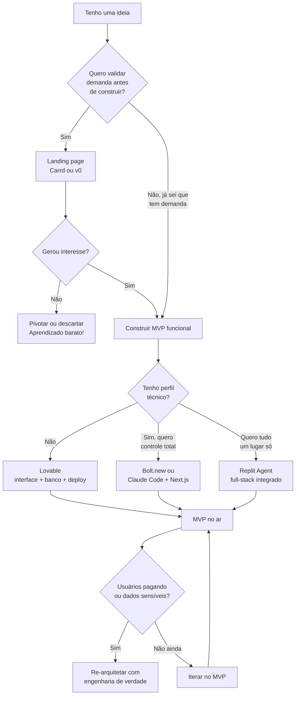

# Criação Rápida de MVPs

> [!quote] A regra de ouro do produto
> *"Se você não tem vergonha da primeira versão do seu produto, você lançou tarde demais."* Reid Hoffman (fundador do LinkedIn)

---

## 1. O que é um MVP 💡

> [!INFO] Definição
> **MVP (Minimum Viable Product / Produto Mínimo Viável)** é a versão mais simples de um produto que permite **aprender com usuários reais** com o mínimo de esforço. O objetivo do MVP não é ser um produto pequeno: é ser um **experimento** que valida (ou derruba) uma hipótese de negócio.

Conceito central do **Lean Startup** (Eric Ries, 2011):

```
   IDEIA → CONSTRUIR → produto → MEDIR → dados → APRENDER → nova ideia
            (build)               (measure)        (learn)
                    ↻ repetir o ciclo o mais rápido possível
```

### A pergunta que o MVP responde

Não é *"consigo construir isso?"* (com IA, quase sempre sim).
É **"alguém quer isso a ponto de usar/pagar?"**

### Erros clássicos

- Construir 6 meses em segredo e lançar o produto "completo" que ninguém pediu
- Confundir MVP com produto malfeito (mínimo não é quebrado)
- Validar com amigos que elogiam por educação em vez de usuários reais
- Pular a métrica: lançar e não medir nada

---

## 2. O que a IA mudou no jogo 🤖

| | Antes (até ~2023) | Agora (2026) |
|--|-------------------|--------------|
| Custo de construir um MVP | Semanas/meses, time técnico | **Horas/dias**, 1 pessoa |
| Gargalo | Programar | **Escolher o problema certo** |
| Quem consegue lançar | Devs ou quem paga devs | Qualquer pessoa (63% dos usuários de app builders não são devs) |
| Vantagem competitiva | Saber construir | **Velocidade de aprendizado** |

> [!tip] Consequência estratégica
> Quando todo mundo consegue construir, construir deixa de ser diferencial. O diferencial vira: **encontrar o problema certo, falar com usuários e iterar mais rápido que os outros.** O ciclo build-measure-learn ficou 100x mais rápido, para todos.

---

## 3. Tipos de MVP (do mais barato ao mais caro) 🗂️

1. **Landing page + lista de espera**: descreve o produto e mede quem se cadastra (valida interesse antes de existir produto)
2. **MVP "Mágico de Oz"**: por fora parece automático; por trás, um humano faz o trabalho (valida demanda sem construir a automação)
3. **MVP concierge**: você entrega o serviço manualmente para poucos clientes (aprende o processo antes de automatizar)
4. **Protótipo navegável**: telas clicáveis sem back-end (Figma, v0)
5. **Produto funcional mínimo**: 1 a 3 funcionalidades de verdade, no ar. Com IA, este ficou quase tão barato quanto os anteriores.

---

## 4. O fluxo: da ideia ao MVP no ar em 1 dia 🗓️

### Etapa 0: Validar antes de construir (a mais importante!)

- Descrever o problema em 1 frase: *quem* sofre *o quê* e *quando*
- Conversar com 5+ pessoas do público-alvo (sem vender: perguntar sobre o problema)
- Conferir alternativas existentes (concorrente ruim é bom sinal: mercado existe)

### Etapa 1: Especificar (30 a 60 min)

Escrever uma **mini-spec** (ver [[Engenharia de Contexto e Spec-Driven Development]]):

> [!example] Mini-spec de MVP
> - **Problema:** professores perdem horas montando listas de exercícios personalizadas
> - **Usuário:** professor de ensino médio
> - **Hipótese:** se gerar listas em 1 minuto, professores usarão semanalmente
> - **Funcionalidades (só 3!):** (1) escolher tema e dificuldade, (2) gerar lista com gabarito, (3) exportar PDF
> - **Fora do escopo v1:** login, pagamento, banco de questões próprio, app mobile
> - **Métrica de sucesso:** 20 professores gerarem 3+ listas na primeira semana

### Etapa 2: Construir com IA (1 a 4 horas)

Dois caminhos:

**Caminho A: App builder (sem código):** colar a spec no **Lovable**, **Bolt.new** ou **v0** → ajustar conversando → publicar no domínio. *Tempo típico medido em 2026: cerca de 47 a 60 min para um protótipo funcional.*

**Caminho B: Agente + stack própria (com código):** usar **Claude Code** ou **Cursor** com uma stack padrão de MVP:

| Camada | Escolha típica 2026 | Por quê |
|--------|---------------------|---------|
| Front+Back | **Next.js** (React) | Um framework só, deploy trivial |
| Banco + Auth | **Supabase** (Postgres) | Gratuito no início, auth pronta |
| Deploy | **Vercel** | Git push = produção, HTTPS automático |
| Pagamento | **Stripe** (ou Mercado Pago no BR) | Checkout em minutos |
| E-mail | Resend | API simples |

> Caminho A = mais rápido para validar. Caminho B = você é dono do código e escala melhor. Começar no A e migrar pro B é um caminho comum.

### Etapa 3: Medir (desde o primeiro dia)

- Analytics de eventos (o que as pessoas *fazem*, não o que dizem)
- Funil mínimo: visitou → testou → voltou → pagou
- Canal de feedback direto (botão de WhatsApp ou formulário)

### Etapa 4: Aprender e iterar

- Toda semana: olhar métricas → falar com usuários → decidir **persistir, pivotar ou matar**
- Matar um MVP que ninguém usa é **sucesso** (aprendizado barato), não fracasso

---

## 5. Ferramentas de 2026: comparativo completo 🛠️

> [!info] Como ler a tabela
> Cada ferramenta tem seu ponto forte. Escolha pela sua situação: nível técnico, tipo de MVP e se precisa de código exportável ou deploy rápido.

| Ferramenta | Melhor para | Plano gratuito | Preço inicial pago | Gera código exportável | Deploy integrado | Banco de dados | Ponto forte |
|------------|-------------|----------------|--------------------|------------------------|-----------------|----------------|-------------|
| **Lovable** | SaaS MVP completo, fundadores não-técnicos | Sim (créditos limitados) | ~$25/mês | Sim (GitHub) | Sim (automático) | Supabase integrado | Onboarding mais suave, integração Supabase nativa |
| **Bolt.new** | Protótipos rápidos para descartar | Sim | ~$25/mês | Sim | Sim (Netlify/Cloudflare) | Externo | Maior controle de framework (React, Vue, Svelte, Astro, Expo) |
| **v0 (Vercel)** | Componentes de UI dentro de projeto existente | Sim | ~$20/mês | Sim (Next.js/shadcn) | Via Vercel | Não incluso | Qualidade de frontend React/Tailwind sem rival |
| **Replit Agent** | Full-stack com banco, hospedagem e deploy unificados | Sim (limitado) | ~$25/mês | Sim | Sim (Replit hosting) | Postgres integrado | Mais autônomo (Agent 3, set/2025): 50+ linguagens, testes em browser real |
| **Carrd** | Landing page de validação (1 página) | Sim (3 sites) | $9/ano (Pro Lite) | Não | Sim | Não | Mais barato de todos; pronto em menos de 30 min; 800 mil usuários |

### Quando usar cada um



---

## 6. Técnica extra: o Fake Door Test 🚪

> [!info] O que é Fake Door (ou Painted Door)
> Uma **porta falsa** é um anúncio ou botão de uma funcionalidade que ainda não existe. O usuário clica, vê uma mensagem como "em breve, deixe seu e-mail" e você mede o interesse real sem construir nada. Foi a técnica usada pelo **Buffer** antes de lançar: criaram uma landing page com botão "Planos e Preços" que levava a uma página de "ainda estamos construindo, cadastre seu e-mail". Quando centenas se cadastraram em dias, sabiam que havia demanda real antes de escrever uma linha de código.

**Quando usar:**
- Você tem dúvida se uma funcionalidade nova vale o esforço de construir
- Quer número real de cliques antes de decidir prioridade de backlog
- Custo de construir é alto e custo de medir é quase zero

**Como montar um Fake Door em 30 min:**
1. Criar página no Carrd ou formulário no Google Forms com descrição clara do produto/feature
2. Adicionar chamada para ação (botão "Quero ser o primeiro a testar")
3. Redirecionar o clique para mensagem de "em breve" + campo de e-mail
4. Divulgar nos grupos certos (WhatsApp, Reddit, LinkedIn) por 3 a 5 dias
5. Medir: taxa de clique no botão e taxa de cadastro no e-mail
6. Decidir: acima de 5 a 10% de conversão indica demanda suficiente para continuar

> [!warning] Ética no Fake Door
> Seja transparente na mensagem pós-clique: o usuário precisa entender que o produto ainda está em desenvolvimento e que o e-mail dele serve para ser notificado. Nunca cobrar antes de entregar nem usar os dados para outra finalidade.

---

## 7. Atividades mão-na-massa 🧪

> [!example] 🧪 Atividade 1: MVP em 30 min com Lovable ou Bolt.new
>
> **Ferramenta:** Lovable (lovable.dev) ou Bolt.new (bolt.new), conta gratuita.
>
> **Roteiro:**
> 1. Escolha um problema real: app de lista de presença para clube esportivo, cardápio digital para cantina, agendador de sala de estudo.
> 2. Escreva uma mini-spec de 5 linhas (problema, usuário, 3 funcionalidades, 1 métrica).
> 3. Cole a spec no chat da ferramenta escolhida e itere em 3 turnos no máximo.
> 4. Publique no link gerado automaticamente pela ferramenta.
> 5. Compartilhe a URL no grupo da turma com 1 frase descrevendo a hipótese que o app testa.
>
> **Resultado observável:** URL pública funcionando com pelo menos 2 das 3 funcionalidades planejadas, gerada em até 30 min. O grupo acessa e reporta o que conseguiu ou não fazer (feedback de usuário real em sala).

> [!example] 🧪 Atividade 2: Fake Door com Carrd + Google Forms
>
> **Ferramenta:** Carrd (carrd.co, plano gratuito) para a landing page + Google Forms para capturar e-mails.
>
> **Roteiro:**
> 1. Escolha uma ideia que ainda NÃO está construída (é o ponto).
> 2. Crie um site Carrd com: nome do produto, 3 benefícios em bullets, imagem ou ícone representativo, botão "Quero testar grátis".
> 3. Conecte o botão a um Google Forms com campos: Nome, E-mail, "Por que você clicaria nesse produto?".
> 4. Compartilhe o link no grupo da turma e em pelo menos 1 grupo externo (família, amigos, comunidade online).
> 5. Após 48 horas: registre quantas visitas (Carrd mostra o contador) e quantos formulários preenchidos.
> 6. Apresente em 3 min: taxa de conversão (preencheu / visitou), as 3 respostas mais interessantes do campo aberto e sua conclusão: continua construindo ou pivota?
>
> **Resultado observável:** planilha do Google Forms com pelo menos 5 respostas de fora da turma + análise de conversão com decisão fundamentada em dado, não em opinião.

> [!example] 🧪 Atividade 3: batalha de builders (mesma tela em duas ferramentas)
>
> **Ferramenta:** Lovable (lovable.dev) vs Bolt.new (bolt.new), em duplas.
>
> **Roteiro:**
> 1. A turma decide juntos 1 tela a construir (ex.: tela de cadastro de produto com nome, preço, foto e botão de salvar).
> 2. Cada dupla escolhe uma ferramenta (metade da turma no Lovable, metade no Bolt.new).
> 3. Todas as duplas recebem o mesmo prompt base: descrever a tela em texto livre.
> 4. Em 20 min: gerar a tela, tirar screenshot, anotar o que o builder fez bem e o que faltou.
> 5. Apresentação rápida (2 min por dupla): mostrar resultado + 1 ponto forte e 1 limitação encontrada.
> 6. A turma vota em qual resultado ficou mais próximo do que foi pedido.
>
> **Resultado observável:** dois screenshots comparáveis da mesma tela gerada por ferramentas diferentes, com análise qualitativa de facilidade de uso, fidelidade ao prompt e qualidade do código exportado.

---

## 8. Do MVP ao produto de verdade 🏗️

> [!warning] A dívida do MVP
> MVP construído por vibe coding carrega **dívida técnica proposital**. Isso é certo, desde que você saiba que ela existe. Sinais de que chegou a hora de re-arquitetar com engenharia de verdade:
> - Usuários pagantes e dados sensíveis no sistema
> - Bugs recorrentes que ninguém sabe consertar
> - Toda mudança quebra outra coisa
> - Precisa de time (mais de uma pessoa no código)
>
> Nesse ponto: auditoria de segurança, testes automatizados, CI/CD e provavelmente reescrever os módulos críticos com **[[Vibe Coding e Engenharia Agêntica]]** disciplinada. Falência por sucesso é evitável.

### Checklist mínimo de segurança (mesmo em MVP!)

- [ ] Nenhuma chave de API/secret no código do front-end
- [ ] Banco de dados com regras de acesso (não aberto pro mundo)
- [ ] Senhas com hash (nunca em texto puro): use auth pronta (Supabase ou Clerk)
- [ ] HTTPS sempre
- [ ] Dados pessoais: o mínimo necessário (LGPD vale para MVP também!)

---

## 9. Estudo de caso da disciplina 🎯

> [!example] Desafio prático
> Em duplas: escolher um problema real do campus → escrever a mini-spec → construir o MVP com um app builder ou agente → publicar → conseguir **10 usuários reais** → apresentar **os dados** (não o app!) em 10 min: o que a métrica disse? A hipótese sobreviveu?
> Detalhes em [[Trabalhos e Projetos de Engenharia de Software]].

➡️ **Próxima aula:** [[Boas Práticas e Riscos da IA no Desenvolvimento]]: o que pode dar (muito) errado e como se proteger.

---

> [!note] 📚 Fontes (2026)
> - [Lovable: Best AI App Builders in 2026 (comparativo geral)](https://lovable.dev/guides/best-ai-app-builders)
> - [Digital Applied: comparativo AI App Builders v0, Lovable, Bolt, Replit](https://www.digitalapplied.com/blog/ai-app-builders-v0-lovable-bolt-replit-comparison)
> - [Vibe Coding Academy: Lovable vs Bolt vs Replit, comparativo honesto 2026](https://www.vibecodingacademy.ai/blog/lovable-vs-bolt-vs-replit-comparison-2026)
> - [Getmocha: Best AI App Builder 2026, comparativo Lovable, Bolt, v0, Mocha](https://getmocha.com/blog/best-ai-app-builder-2026)
> - [Pasquale Pillitteri: Lovable, Bolt, Base44, v0, Replit e Claude Code Compared (2026)](https://pasqualepillitteri.it/en/news/591/ai-app-builders-comparison-2026)
> - [No Code MBA: Carrd Pricing 2026, plano Free vs Pro comparados](https://www.nocode.mba/articles/carrd-pricing)
> - [Userpilot: Fake Door Testing, como validar demanda antes de construir](https://userpilot.com/blog/fake-door-testing/)
> - [Amplitude: What Is Fake Door Testing, métodos e boas práticas](https://amplitude.com/explore/experiment/fake-door-testing)
> - [Kromatic (Real Startup Book): Fake Door e Smoke Test](https://kromatic.com/real-startup-book/4-evaluative-market-experiment/fake-door-smoke-test/)
> - [Anna Arteeva (Medium): Choosing your AI prototyping stack, Lovable, v0, Bolt, Replit, Cursor e Magic Patterns comparados](https://annaarteeva.medium.com/choosing-your-ai-prototyping-stack-lovable-v0-bolt-replit-cursor-magic-patterns-compared-9a5194f163e9)
