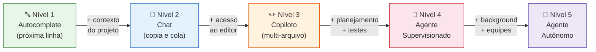
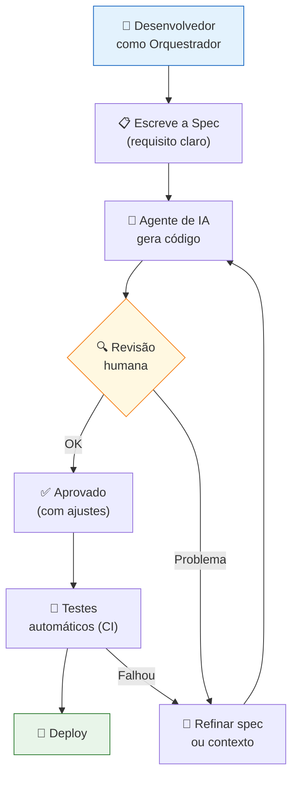

# Desenvolvimento de Software com IA

> [!quote] A maior mudança da história do desenvolvimento
> *Em 60 anos de engenharia de software, nenhuma tecnologia mudou o trabalho do desenvolvedor tão rápido quanto os modelos de linguagem. O que era ficção em 2021 virou rotina profissional em 2026.*

---

## 1. 📅 Linha do tempo da revolução

| Ano | Marco |
|-----|-------|
| 2021 | **GitHub Copilot**: primeiro autocomplete com IA em massa |
| 2022 | **ChatGPT**: programar conversando vira mainstream |
| 2023 | LLMs passam a resolver problemas reais de código; explosão de assistentes |
| 2024 | Primeiros **agentes** (Devin, Claude + tool use, benchmark SWE-bench) e o protocolo **MCP** |
| 2025 | **"Vibe coding"** (Karpathy) vira fenômeno; agentes de terminal (Claude Code, Codex CLI); IDEs nativas de IA (Cursor, Windsurf) dominam |
| 2026 | **Engenharia agêntica**: agentes de longa duração, equipes de agentes, spec-driven development e context engineering viram prática profissional padrão |

### Números de 2026 (para dimensionar)

- O mercado de "vibe coding"/app builders chega a **US$ 4,7 bilhões**, com **63% de usuários não-desenvolvedores**
- Stripe mantém agentes ("Minions") produzindo **mais de 1.000 PRs aceitos por semana**
- O protocolo MCP ultrapassa **97 milhões de downloads mensais** de SDK, com 10.000+ servidores públicos
- Grandes empresas relatam que a **maioria do código novo** já é escrita com assistência de IA

### Dados de adoção (Stack Overflow Developer Survey 2025)

| Métrica | Valor |
|---------|-------|
| Devs que usam ou planejam usar IA no trabalho | **84%** |
| Devs que usam IA diariamente | **51%** |
| Times de engenharia com uso diário de ferramentas de IA (2026) | **73%** |
| Código gerado por GitHub Copilot sobre total escrito pelos seus usuários | **46%** |
| GitHub Copilot: assinantes pagantes (jan/2026) | **4,7 milhões** (alta de 75% ano a ano) |
| Empresas Fortune 100 que adotaram Copilot | **90%** |

> [!info] 📈 Velocidade de adoção
> Em 2023, apenas **18%** dos times de engenharia usavam IA diariamente. Em 2026, esse número chegou a **73%**, um crescimento de 4x em três anos.

---

## 2. 🤖 Os 5 níveis de autonomia

Assim como carros autônomos, ferramentas de IA para código têm níveis crescentes de autonomia:

| Nível | Nome | Como funciona | Exemplo |
|-------|------|---------------|---------|
| 1 | **Autocomplete** | Sugere a próxima linha enquanto você digita | Copilot clássico |
| 2 | **Chat** | Você pergunta, copia e cola a resposta | ChatGPT, Gemini |
| 3 | **Copiloto no editor** | IA lê o projeto e edita múltiplos arquivos sob seu comando | Cursor, Windsurf, Copilot Edits |
| 4 | **Agente supervisionado** | Recebe uma tarefa, planeja, edita, roda testes e itera; você revisa checkpoints | Claude Code, Codex, Kiro |
| 5 | **Agente autônomo / equipes** | Trabalha em background, abre PRs sozinho, vários agentes em paralelo | Background agents, Devin, "AI teams" |



### Evolução dos agentes em números (Q1 2025 vs Q1 2026)

| Métrica | Q1 2025 | Q1 2026 |
|---------|---------|---------|
| Duração média de sessão de agente de código | 4 minutos | **23 minutos** |
| Sessões com edição de múltiplos arquivos (Claude Code) | 34% | **78%** |

> [!warning] Autonomia não é confiança cega
> Quanto maior o nível, maior a alavancagem (e maior o estrago possível). Por isso os níveis 4 e 5 exigem as redes de segurança da engenharia clássica: testes, CI/CD, code review e permissões controladas. Ver [[Boas Práticas e Riscos da IA no Desenvolvimento]].

> [!example] 🧪 Atividade: Classifique o seu nível de autonomia
> **Ferramenta:** Claude, ChatGPT ou Cursor (qualquer um disponível)
>
> 1. Abra a ferramenta e peça: *"Escreva uma função Python que recebe uma lista de números e retorna apenas os números primos."*
> 2. Observe o que você fez: digitou, aceitou, editou arquivos, só copiou?
> 3. Classifique sua interação na tabela de 5 níveis acima.
> 4. Tente repetir a mesma tarefa subindo UM nível (ex.: se usou Chat, tente agora com Cursor apontando para um arquivo real).
>
> **Resultado esperado:** Código funcionando + anotação escrita de qual nível você usou e por que classificou assim.

---

## 3. 👨‍💻 O novo papel do desenvolvedor

### O que mudou

| Antes (até ~2023) | Agora (2026) |
|-------------------|--------------|
| Escrever código linha a linha | **Especificar, orquestrar e revisar** código gerado |
| Digitar era o gargalo | **Decidir** é o gargalo |
| Saber sintaxe de cor | Saber **arquitetura, requisitos e trade-offs** |
| Debugar manualmente | Dirigir agentes que debugam em loop |
| Um dev = uma tarefa por vez | Um dev = vários agentes em paralelo |

### A pirâmide de habilidades de 2026

```
        / Julgamento \        ← avaliar se a solução está CERTA (arquitetura, segurança, negócio)
       /  Orquestração \      ← dirigir agentes: specs, contexto, revisão de PRs
      /   Fundamentos    \    ← algoritmos, redes, banco, testes: base para ENTENDER o que a IA faz
```

> [!tip] O paradoxo do iniciante
> A IA escreve o código fácil, justamente o código que formava os júniors. Em 2026, quem entra na área precisa **acelerar os fundamentos** (não pulá-los): o mercado paga por quem sabe julgar o que a IA produz. Quem só sabe aceitar sugestões compete com a própria ferramenta.

### O novo fluxo de trabalho do desenvolvedor



### O que NÃO mudou

- Requisito mal entendido continua gerando produto errado (agora mais rápido 😅)
- Sistemas continuam precisando de arquitetura, segurança e manutenção
- A responsabilidade pelo que vai pra produção é **sempre humana**
- Comunicação e trabalho em equipe continuam decidindo o sucesso do projeto

> [!example] 🧪 Atividade: Humano vs IA, medir a diferença
> **Ferramenta:** Claude, ChatGPT ou Copilot + um timer (celular ou site stopwatch)
>
> **Parte 1: manualmente**
> 1. Sem IA, implemente no papel ou no editor: uma função que verifica se uma string é um palíndromo (ex.: "arara" retorna True).
> 2. Anote o tempo total, desde começar a pensar até o código funcionar.
>
> **Parte 2: com IA**
> 1. Peça para a IA a mesma função.
> 2. Cole o resultado, rode os testes e anote o tempo.
>
> **Parte 3: revisão crítica**
> 1. Leia o código gerado pela IA com atenção.
> 2. Encontre pelo menos UM problema ou limitação (ex.: trata espaços? Letras maiúsculas? Edge cases?).
> 3. Corrija o problema encontrado.
>
> **Resultado esperado:** tabela com tempos das duas partes + anotação do problema encontrado no código da IA.

---

## 4. 🔄 Como a IA entra em cada fase do ciclo de vida

| Fase clássica | Com IA em 2026 |
|---------------|----------------|
| Requisitos | IA entrevista, resume conversas, gera user stories e specs estruturadas |
| Design | IA propõe arquiteturas, gera diagramas, compara trade-offs |
| Implementação | Agentes geram e refatoram código em múltiplos arquivos |
| Testes | IA gera suítes de teste, dados de teste e roda em loop até passar |
| Code review | IA faz a primeira passada; humano decide |
| Deploy | Pipelines CI/CD acionados e corrigidos por agentes |
| Manutenção | Agentes de background triam issues, propõem correções e abrem PRs |
| Documentação | Gerada e atualizada automaticamente a partir do código |

---

## 5. 📊 Benchmarks: o quanto a IA realmente resolve?

O **SWE-bench** é o principal benchmark para medir a capacidade de agentes de IA em resolver problemas reais de engenharia de software (bugs reais de repositórios GitHub famosos).

| Benchmark | Melhor modelo (jun/2026) | Score |
|-----------|--------------------------|-------|
| SWE-bench Verified | Claude Fable 5 (Anthropic) | **95,0%** |
| SWE-bench Pro (mais difícil) | Claude Fable 5 (Anthropic) | **80,3%** |

> [!info] 🧪 O que o score significa na prática?
> Um score de 80% no SWE-bench Pro significa que, em 8 de cada 10 issues reais de projetos open source, o agente consegue propor uma solução que passa nos testes automatizados. Isso **não** significa que o código vai para produção sem revisão: o agente é um colaborador altamente produtivo com supervisão humana.

> [!warning] O "ressaco do vibe coding" (Fast Company, set/2025)
> Engenheiros sênior relataram "development hell" ao trabalhar com código gerado por IA sem revisão rigorosa: testes passando sem cobrir os casos reais, acoplamento excessivo, dívida técnica acumulada rápido. A produtividade de curto prazo pode virar problema de longo prazo se os fundamentos de engenharia forem ignorados.

---

## 6. 🗺️ Os termos-chave do momento (mapa da Parte 2)

- **[[Vibe Coding e Engenharia Agêntica|Vibe coding]]**: programar descrevendo em linguagem natural, sem revisar tudo
- **[[Vibe Coding e Engenharia Agêntica|Engenharia agêntica]]**: a evolução profissional, dirigir agentes com método
- **[[Engenharia de Contexto e Spec-Driven Development|Context engineering]]**: a habilidade nº 1, montar o contexto certo para o agente
- **[[Engenharia de Contexto e Spec-Driven Development|Spec-driven development]]**: a especificação como centro do desenvolvimento
- **[[Ferramentas de IA para Desenvolvimento|Agentes e ferramentas]]**: Claude Code, Cursor, Copilot, app builders
- **[[Criação Rápida de MVPs|MVP com IA]]**: da ideia ao produto no ar em horas

➡️ **Próxima aula:** [[Vibe Coding e Engenharia Agêntica]]

---

> [!note] 📚 Fontes (2026)
> - [AI in Software Development Statistics 2026 (All About AI)](https://www.allaboutai.com/resources/ai-statistics/ai-in-software-development/)
> - [GitHub Copilot Statistics 2026 (GetPanto)](https://www.getpanto.ai/blog/github-copilot-statistics)
> - [AI Copilot Adoption and Developer Productivity 2026 (KORE1)](https://www.kore1.com/ai-copilot-developer-productivity-2026/)
> - [The State of AI Coding Agents 2026 (Dave Patten, Medium)](https://medium.com/@dave-patten/the-state-of-ai-coding-agents-2026-from-pair-programming-to-autonomous-ai-teams-b11f2b39232a)
> - [SWE-bench Pro Leaderboard 2026 (MorphLLM)](https://www.morphllm.com/swe-bench-pro)
> - [SWE-bench Leaderboard 2026: All Model Scores (CodeAnt)](https://www.codeant.ai/blogs/swe-bench-scores)
> - [State of AI Agents 2026: 200+ Data Points (Digital Applied)](https://www.digitalapplied.com/blog/state-of-ai-agents-2026-200-data-points)
> - [AI in Software Development Trends and Statistics 2026 (Modall)](https://modall.ca/blog/ai-in-software-development-trends-statistics)
> - [The AI Revolution in 2026: Top Trends Every Developer Should Know (DEV Community)](https://dev.to/jpeggdev/the-ai-revolution-in-2026-top-trends-every-developer-should-know-18eb)
> - [Best AI Coding Agents for 2026 (Faros AI)](https://www.faros.ai/blog/best-ai-coding-agents-2026)
