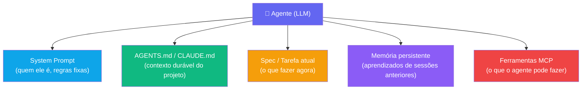
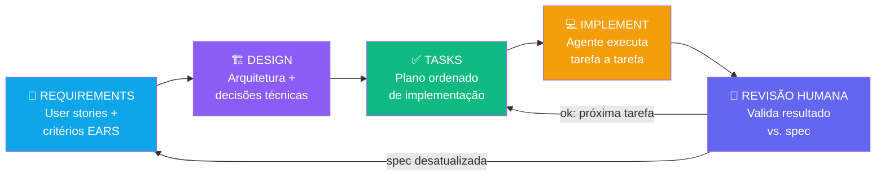
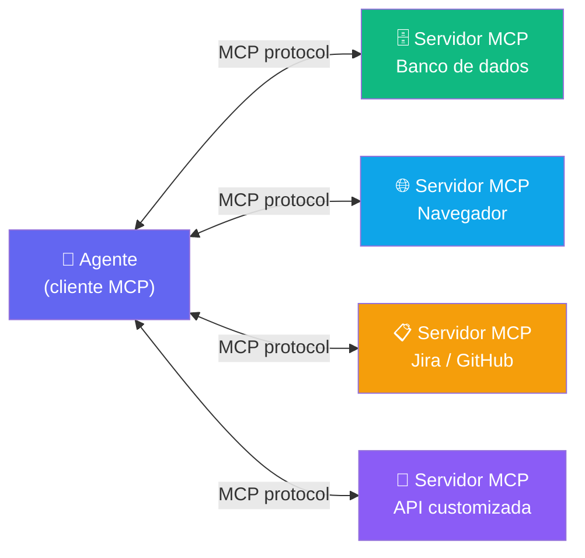
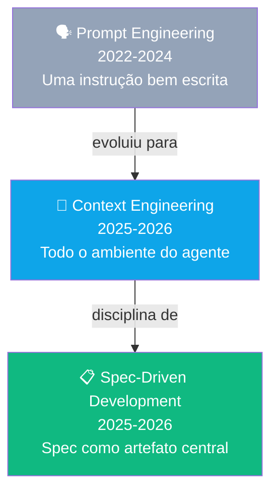
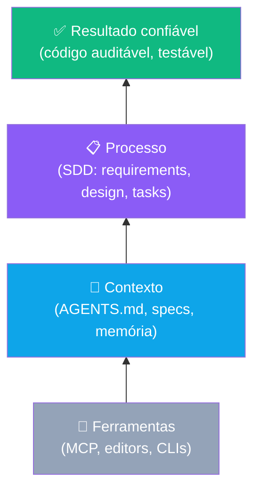

# Engenharia de Contexto e Spec-Driven Development

> [!quote] A habilidade que define quem domina IA
> *Em 2026, a habilidade mais importante do desenvolvimento com IA não é escrever prompts bonitos: é montar o **contexto** certo. O modelo é o mesmo para todo mundo; o contexto é o seu diferencial.*

---

## 1. Prompt Engineering (o começo da história) 📝

> [!INFO] Definição
> **Prompt engineering** é a técnica de escrever instruções (prompts) que maximizam a qualidade da resposta de um LLM.

### Técnicas clássicas que ainda valem

| Técnica | O que é | Exemplo |
|---------|---------|---------|
| **Zero-shot** | Pedir direto, sem exemplos | "Converta este JSON para CSV" |
| **Few-shot** | Dar 2-3 exemplos do formato esperado | "Entrada: X, Saída: Y. Agora faça com Z" |
| **Chain-of-thought** | Pedir raciocínio passo a passo | "Pense passo a passo antes de responder" |
| **Papel (role)** | Definir persona e critérios | "Você é um revisor de segurança rigoroso..." |
| **Restrições explícitas** | Delimitar formato, escopo e proibições | "Apenas SQL padrão, sem extensões; não altere o schema" |

### Regras de ouro para prompts de código

1. **Especifique o resultado, não o caminho** (deixe o "como" para o modelo, valide o "o quê")
2. **Dê o contexto mínimo suficiente** (a função, o erro, o stack trace, não o projeto inteiro colado)
3. **Defina critérios de aceitação** ("deve passar nestes testes", "deve manter a API pública")
4. **Itere:** prompt é conversa, não bala de prata

---

## 2. Context Engineering (a evolução) 🧠

> [!INFO] Definição
> **Context engineering** é a disciplina de **selecionar, estruturar e gerenciar tudo que entra na janela de contexto** do modelo: instruções, código relevante, documentação, exemplos, ferramentas disponíveis e memória. O prompt é só a última frase de uma conversa que você inteira projetou.

### Por que superou o prompt engineering?

- Agentes modernos trabalham com **projetos inteiros**, não trechos colados
- A janela de contexto é grande (até 1M tokens) mas **não infinita**: qualidade supera quantidade
- Contexto irrelevante **piora** o resultado ("context rot"): o modelo se distrai com ruído
- O mesmo prompt com contexto diferente produz resultados opostos

> [!warning] O que é "context rot"?
> **Context rot** é a degradação progressiva da qualidade das respostas à medida que a janela de contexto se enche de informação irrelevante ou desatualizada. É o equivalente de ter uma reunião com 30 pessoas onde só 3 realmente importam: o sinal se perde no barulho. Bom contexto é **denso e relevante**, não volumoso.

### As camadas de contexto de um agente

| Camada | Conteúdo | Vida útil |
|--------|----------|-----------|
| **System prompt** | Quem o agente é, regras inegociáveis | Fixa |
| **Contexto durável do projeto** | `AGENTS.md` / `CLAUDE.md`: arquitetura, convenções, comandos | Versionada no repo |
| **Contexto da tarefa** | A spec, os arquivos relevantes, o erro atual | Por sessão |
| **Memória acumulada** | O que o agente aprendeu em sessões passadas | Cresce com o uso |
| **Ferramentas** | O que o agente pode *fazer* (rodar testes, buscar na web, MCP) | Configurável |

### Diagrama: camadas de contexto de um agente moderno



### AGENTS.md e CLAUDE.md

Arquivos Markdown **na raiz do repositório** que ensinam o agente sobre o projeto:

- Como buildar e rodar os testes
- Convenções de código e arquitetura do projeto
- O que nunca fazer (ex: "não tocar na pasta `legacy/`")
- **`AGENTS.md`** é o padrão aberto (criado em 2025 por OpenAI, Google, Cursor, Sourcegraph e outros; hoje governado por fundação ligada à Linux Foundation)
- **`CLAUDE.md`** é o formato do Claude Code (mesma ideia)

> [!example] Trecho de um AGENTS.md real
> ```markdown
> # Projeto: API de Biblioteca
> ## Comandos
> - Testes: `pytest -x` | Lint: `ruff check .`
> ## Convenções
> - FastAPI + SQLAlchemy; schemas Pydantic em `schemas/`
> - Toda rota nova exige teste de integração
> ## Nunca
> - Commitar credenciais; alterar migrations antigas
> ```

### Boas práticas para um AGENTS.md eficaz

| Seção | O que incluir | Exemplo |
|-------|--------------|---------|
| **Comandos** | Como buildar, testar, rodar | `pytest -x`, `npm run dev` |
| **Arquitetura** | Pastas, padrões, frameworks | "Controllers em `src/routes/`, lógica em `src/services/`" |
| **Convenções** | Estilo, nomenclatura, idiomas | "Variáveis em snake_case, classes em PascalCase" |
| **Proibições** | O que jamais mudar | "Nunca alterar migrations já aplicadas em produção" |
| **Contexto de domínio** | Regras de negócio críticas | "Pedido CANCELADO não pode voltar para ATIVO" |

---

## 3. Spec-Driven Development (SDD) 📋

> [!INFO] Definição
> **Spec-Driven Development** é a metodologia em que a **especificação escrita** (não o código) é o artefato central do desenvolvimento. Humanos escrevem e refinam specs; agentes geram implementação, testes e documentação **a partir delas**.

É a resposta profissional ao vibe coding: em vez de "vibes", um documento que diz exatamente o que construir.

> [!note] O que é "vibe coding"?
> Termo criado por Andrej Karpathy em fevereiro de 2025 (Collins Word of the Year 2025): desenvolver aceitando código gerado por IA sem revisão rigorosa, guiado apenas pela "vibe" de que parece certo. Funciona para protótipos; falha em sistemas que precisam de confiabilidade, rastreabilidade e manutenção.

### O fluxo SDD (popularizado por Kiro/AWS e GitHub Spec Kit)

```
1. REQUIREMENTS  →  o que o sistema deve fazer
   (user stories + critérios de aceitação testáveis)
2. DESIGN        →  como será construído
   (arquitetura, dados, trade-offs, decisões)
3. TASKS         →  plano de implementação
   (tarefas pequenas, ordenadas, verificáveis)
4. IMPLEMENT     →  agentes executam tarefa a tarefa
   (com testes; humano revisa cada etapa)
```

### Diagrama: fluxo completo Spec-Driven Development



### Por que funciona

- **Mudança barata:** corrigir uma frase na spec custa segundos; corrigir código gerado errado custa horas
- **A spec vira memória persistente** do agente: o projeto "lembra" suas decisões
- **Auditável:** dá para rastrear cada linha de código a um requisito
- **Paralelizável:** tarefas independentes permitem vários agentes simultâneos

> [!tip] Déjà vu?
> Requisitos, design, implementação... é o **[[Engenharia de Software Clássica|ciclo de vida clássico]]** da Engenharia de Software! A diferença: o ciclo que levava meses agora roda em horas, e a documentação que ninguém atualizava agora é **executável**: ela literalmente gera o sistema. A engenharia clássica não morreu; ela virou a linguagem de comando dos agentes.

### 3.1 Kiro (AWS): SDD com notação aeroespacial 🚀

**Kiro** é o IDE agêntico da AWS lançado em 2026, que adotou a notação **EARS** (Easy Approach to Requirements Syntax), criada originalmente pela Rolls-Royce para requisitos de certificação aeronáutica (Airbus, NASA, Intel).

#### Estrutura de um requisito EARS

```
WHEN [condição/evento]
THE SYSTEM SHALL [comportamento esperado]
```

**Exemplos:**

| Requisito EARS | O que especifica |
|----------------|-----------------|
| `WHEN the user submits an empty form THE SYSTEM SHALL display a validation error for each empty required field` | Validação de formulário |
| `WHEN payment fails THE SYSTEM SHALL retry up to 3 times before notifying the user` | Resiliência de pagamento |
| `WHEN a file exceeds 10MB THE SYSTEM SHALL reject the upload and return HTTP 413` | Limite de upload |

> [!note] Por que EARS funciona bem com IA?
> A estrutura `WHEN... THE SYSTEM SHALL...` é não ambígua e **diretamente testável**: cada requisito vira automaticamente um caso de teste. O Kiro gera property-based tests extraindo as propriedades diretamente dos requisitos EARS. Requisito ruim, teste ruim.

#### Recursos principais do Kiro

| Recurso | O que faz |
|---------|-----------|
| **Specs** | Gera `requirements.md`, `design.md` e `tasks.md` a partir de uma descrição |
| **Steering** | Equivalente ao AGENTS.md: define convenções do projeto |
| **Hooks** | Ações automáticas disparadas por eventos (ex: ao salvar, rodar lint) |
| **Property-based tests** | Testes gerados a partir dos requisitos EARS |

### 3.2 GitHub Spec Kit: SDD open source 📦

**GitHub Spec Kit** (MIT, lançado em 2025) é o toolkit open source do GitHub que transforma SDD em workflow executável dentro de qualquer agente de código.

- CLI chamado `specify` com sete slash commands
- Compatível com Claude Code, Copilot, Gemini e Cursor
- Fluxo: `/specify`, `/plan`, `/tasks` e depois o agente implementa
- Mais de 90 mil estrelas no GitHub (jun/2026)

#### Os sete comandos do Spec Kit

| Comando | O que faz |
|---------|-----------|
| `/specify` | Define o projeto, gera spec inicial |
| `/requirements` | Adiciona/refina requisitos |
| `/design` | Gera arquitetura e decisões técnicas |
| `/plan` | Cria plano de implementação |
| `/tasks` | Quebra o plano em tarefas pequenas e ordenadas |
| `/implement` | Agente executa tarefa a tarefa |
| `/review` | Valida implementação contra spec |

---

## 4. MCP: Model Context Protocol 🔌

> [!INFO] Definição
> **MCP (Model Context Protocol)** é o protocolo aberto que padroniza como modelos de IA se conectam a **ferramentas e fontes de dados externas**, apelidado de **"USB-C da IA"**. Criado pela Anthropic (2024), adotado por OpenAI, Google, Microsoft e Amazon.

### O que ele resolve

Antes: cada integração (IA com banco de dados, IA com Jira, IA com navegador) era um código sob medida.
Com MCP: o serviço expõe um **servidor MCP** padrão; qualquer agente compatível o usa.

```
Agente (cliente MCP) ⇄ Servidor MCP ⇄ Serviço real
                                       (GitHub, banco, browser, Slack...)
```

### Diagrama: arquitetura MCP



### Em números (2026)

- **97+ milhões** de downloads mensais dos SDKs
- **10.000+ servidores MCP públicos**: bancos de dados, navegadores, nuvens, APIs de pagamento...

### O que isso significa na prática

Um agente com MCP pode: consultar seu banco de produção (read-only), abrir o navegador e testar a UI que ele mesmo gerou, ler o Figma do designer, atualizar o ticket no Jira, tudo na mesma sessão.

### Comparação: antes vs. depois do MCP

| Cenário | Antes do MCP | Com MCP |
|---------|-------------|---------|
| IA acessa banco de dados | Código sob medida para cada integração | Servidor MCP padrão; qualquer agente usa |
| IA abre navegador | API proprietária do IDE | `browser-mcp` padrão aberto |
| IA cria ticket no Jira | Plugin específico por IDE | `jira-mcp` funciona em Claude, Copilot, Cursor |
| IA lê design no Figma | Impossível em 2023 | `figma-mcp` com contexto visual completo |

---

## 5. O arsenal de contexto do desenvolvedor moderno 🛠️

| Mecanismo | Para quê |
|-----------|----------|
| `AGENTS.md` / `CLAUDE.md` | Contexto durável do projeto |
| **Specs** (`specs/`) | O que construir, com critérios verificáveis |
| **Skills / slash commands** | Workflows reutilizáveis empacotados (`/deploy`, `/review`) |
| **Subagentes** | Delegar pesquisa/execução sem poluir o contexto principal |
| **Servidores MCP** | Conectar o agente ao mundo real |
| **Memória persistente** | O agente aprende o projeto com o tempo |

### Comparação: prompt engineering vs. context engineering vs. SDD



---

## 6. Atividades Mão na Massa 🔨

> [!example] 🧪 Atividade 1: Escreva um AGENTS.md e dê para a IA seguir
>
> **Objetivo:** criar um `AGENTS.md` para um projeto existente e verificar se o agente segue as regras automaticamente.
>
> **Ferramenta:** Claude Code ou Cursor (com um projeto em Python ou JavaScript já iniciado)
>
> **Passo a passo:**
> 1. Na raiz do seu projeto, crie `AGENTS.md` com estas seções mínimas:
>    - `## Comandos` (como rodar e testar)
>    - `## Convenções` (nomenclatura, estrutura de pastas)
>    - `## Nunca` (pelo menos 2 proibições explícitas, ex: "nunca usar print() no lugar de logging")
> 2. Abra o Claude Code (ou Cursor) no projeto e peça: *"Adicione uma função que valida e-mail ao arquivo `validators.py`."*
> 3. Renomeie temporariamente o `AGENTS.md` para `_AGENTS.md` (desativando-o) e repita o mesmo pedido em uma nova sessão.
>
> **Resultado observável:** na versão com `AGENTS.md`, o agente usa os imports corretos, nomeia conforme a convenção e evita as proibições. Sem o arquivo, o resultado varia por sessão. Registre as diferenças.

---

> [!example] 🧪 Atividade 2: Contexto bom vs. contexto ruim
>
> **Objetivo:** medir o impacto do contexto na qualidade da resposta do modelo com a mesma tarefa.
>
> **Ferramenta:** Claude.ai ou ChatGPT (qualquer modelo atual)
>
> **Passo a passo:**
> 1. Escolha um bug ou feature do seu projeto atual (pode ser fictício: um carrinho de compras em Python com desconto por cupom).
> 2. **Sessão A (contexto pobre):** envie apenas: *"Corrija o bug no desconto do cupom."*
>    - Registre: o modelo entendeu o que corrigir? Qual foi o resultado?
> 3. **Sessão B (contexto rico):** envie:
>    - A função com bug completa
>    - O erro exato (stack trace ou comportamento errado)
>    - A regra de negócio ("cupom só vale para pedidos acima de R$ 100")
>    - O critério de aceitação ("após a correção, `test_cupom_invalido()` deve passar")
>    - Repita o pedido: *"Corrija o bug no desconto do cupom."*
> 4. Compare as respostas A e B lado a lado.
>
> **Resultado observável:** A sessão B produz um patch cirúrgico e correto. A sessão A gera código genérico que pode introduzir novos bugs. Quantifique: quantas perguntas o modelo fez na sessão A vs. B? Qual delas gerou código que passou nos testes?

---

> [!example] 🧪 Atividade 3: Fluxo Spec-Driven com GitHub Spec Kit
>
> **Objetivo:** vivenciar o ciclo completo requirements, design, tasks, implement em um mini projeto.
>
> **Ferramenta:** Claude Code com GitHub Spec Kit instalado (`npm install -g specify-cli`) ou Kiro (IDE da AWS, disponível em kiro.dev)
>
> **Cenário:** criar uma API REST simples para gerenciar uma lista de tarefas (to-do list) com autenticação básica.
>
> **Passo a passo:**
> 1. Inicie: `/specify "API de to-do list com autenticação JWT, CRUD completo, persistência em SQLite"`
> 2. Revise o `requirements.md` gerado. Reescreva pelo menos 2 requisitos no formato EARS: `WHEN [condição] THE SYSTEM SHALL [comportamento]`. Exemplo: `WHEN an unauthenticated user accesses /tasks THE SYSTEM SHALL return HTTP 401`.
> 3. Execute `/design` e revise a arquitetura proposta. Adicione uma decisão técnica explícita (ex: "Usar bcrypt para hash de senha, não MD5").
> 4. Execute `/tasks` e observe a lista de tarefas geradas. Ordene-as se necessário.
> 5. Peça ao agente para implementar apenas a **primeira tarefa** e valide manualmente antes de continuar.
>
> **Resultado observável:** ao final, você terá um projeto onde cada arquivo de código rastreia a um requisito específico. Tente modificar um requisito na spec e veja o quanto o agente consegue propagar a mudança automaticamente.

---

## 7. Síntese: a pirâmide do desenvolvedor com IA 🔺



> [!summary] O que mudou em 2026
> - **Antes:** você escrevia código; a IA ajudava.
> - **Agora:** você escreve specs e contexto; a IA escreve código.
> - **O que não mudou:** engenharia de requisitos, boas práticas de arquitetura e testes rigorosos continuam sendo o que separa um sistema confiável de um protótipo que quebra em produção.

---

➡️ **Próxima aula:** [[Ferramentas de IA para Desenvolvimento]]: o panorama 2026 das ferramentas e como escolher.

---

> [!note] 📚 Fontes (2026)
> - [Spec-Driven Development: Unpacking 2025's key new AI-assisted engineering practice (Thoughtworks)](https://www.thoughtworks.com/en-us/insights/blog/agile-engineering-practices/spec-driven-development-unpacking-2025-new-engineering-practices)
> - [The New Engineering Stack: Specs, Context, and Agents (Dave Patten, Medium)](https://medium.com/@dave-patten/the-new-engineering-stack-specs-context-and-agents-f3454529768e)
> - [Spec-Driven Development: The Definitive 2026 Guide (BCMS)](https://thebcms.com/blog/spec-driven-development)
> - [AWS Summit New York 2026: Kiro Brings Aerospace Spec Standards to AI Coding (TechTimes)](https://www.techtimes.com/articles/318546/20260617/aws-summit-new-york-2026-kiro-brings-aerospace-spec-standards-ai-coding.htm)
> - [What Is Spec-Driven Development and How to Implement It with Kiro (AWS in Plain English)](https://aws.plainenglish.io/what-is-spec-driven-development-and-how-to-implement-it-with-kiro-b5846bd55869)
> - [GitHub Spec Kit: Toolkit for Spec-Driven Development with AI Coding Agents (MarkTechPost)](https://www.marktechpost.com/2026/05/08/meet-github-spec-kit-an-open-source-toolkit-for-spec-driven-development-with-ai-coding-agents/)
> - [Spec-driven development with AI: open source toolkit (GitHub Blog)](https://github.blog/ai-and-ml/generative-ai/spec-driven-development-with-ai-get-started-with-a-new-open-source-toolkit/)
> - [Kiro Feature Specs Docs (kiro.dev)](https://kiro.dev/docs/specs/feature-specs/)
> - [EARS Format Complete Guide (Kiro Directory)](https://kiro.directory/tips/ears-format)
> - [Spec-Driven Development Tutorial using GitHub Spec Kit (Scalable Path)](https://www.scalablepath.com/machine-learning/spec-driven-development-workflow)
> - [AWS re:Invent 2025: Spec-driven development with Kiro DEV314 (YouTube)](https://www.youtube.com/watch?v=4qcWgPb-8Fk)
