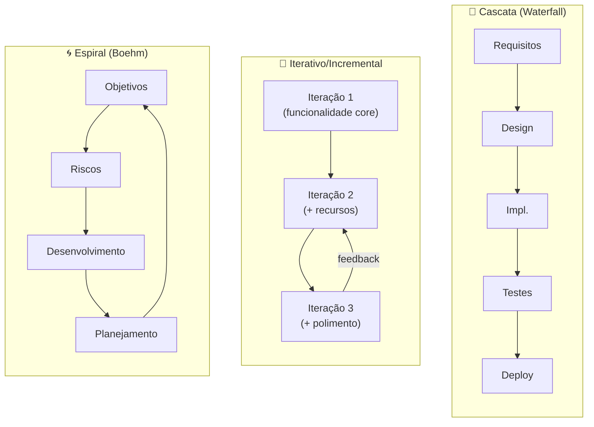
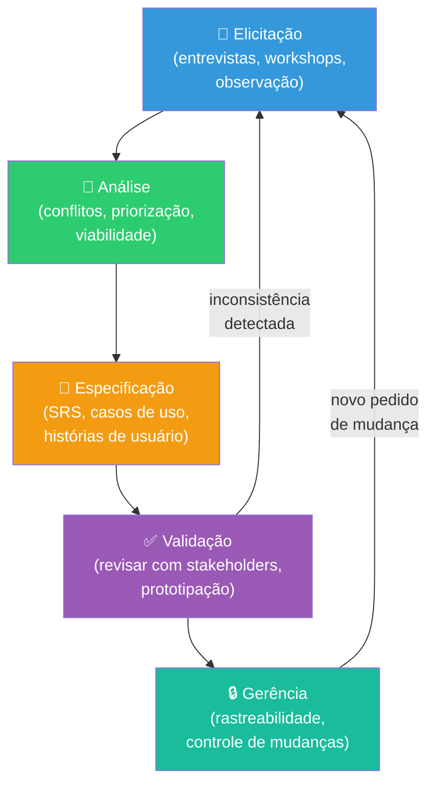
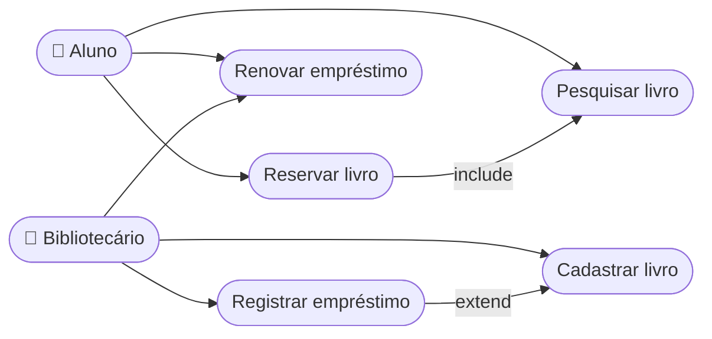
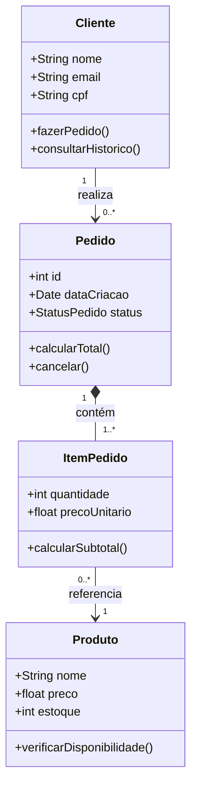
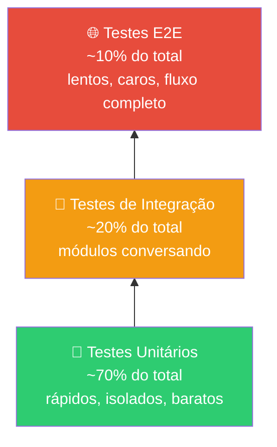
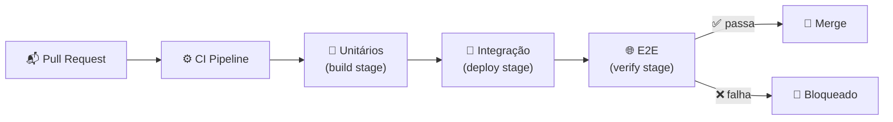
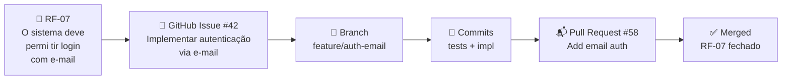
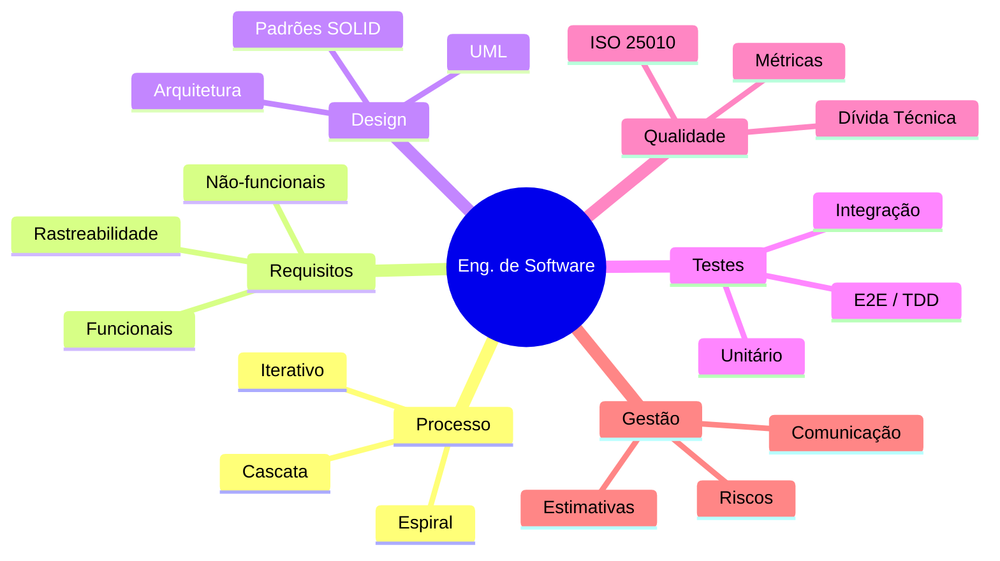

# Engenharia de Software Clássica

> [!quote] Por que existe essa disciplina?
> *Programar é escrever código. Engenharia de Software é construir sistemas que funcionam, podem ser mantidos por anos e são feitos por equipes, dentro do prazo e do orçamento.*

> [!info] Como esta aula se encaixa na disciplina
> Esta aula é um **resumo panorâmico** do que é ensinado tradicionalmente em Engenharia de Software nas universidades. Esses conceitos continuam valendo, mas hoje são executados com ajuda massiva de IA. Entender a base clássica é o que diferencia quem **orquestra** a IA de quem apenas **aceita** o que ela gera.

---

## 1. 🏗️ O que é Engenharia de Software

> [!INFO] Definição
> Engenharia de Software é a aplicação de uma abordagem **sistemática, disciplinada e quantificável** ao desenvolvimento, operação e manutenção de software (IEEE).

### A Crise do Software (anos 1960)

O termo nasceu na conferência da OTAN de **1968**, em resposta à "crise do software":

- Projetos estouravam prazo e orçamento sistematicamente
- Software entregue com baixa qualidade e cheio de defeitos
- Código impossível de manter e evoluir
- Demanda crescia mais rápido que a capacidade de produzir

**Conclusão da época:** escrever software em escala precisa de *engenharia*, não só de programação. Essa tensão (velocidade × qualidade) existe até hoje, e voltou com força na era da IA.

### Software x Programa

| Programa | Software (produto de engenharia) |
|----------|----------------------------------|
| Código que funciona na sua máquina | Código + documentação + testes + configuração |
| Feito por uma pessoa | Feito e mantido por equipes |
| Resolve um problema pontual | Evolui por anos atendendo usuários reais |

> [!tip] Dado atual (2025)
> Um relatório da Forrester (2025) indica que **95% dos profissionais** de TI afirmam que práticas estruturadas de desenvolvimento são críticas para o sucesso das operações, independente de usarem IA ou não.

---

## 2. 🔄 Ciclo de Vida do Software (SDLC)

Todo software passa pelas mesmas grandes fases, independente da metodologia:

1. **Levantamento de Requisitos**: entender o que o cliente precisa
2. **Análise**: modelar o problema
3. **Projeto (Design)**: decidir como o sistema será construído
4. **Implementação**: escrever o código
5. **Testes**: verificar se funciona e valida o que foi pedido
6. **Implantação (Deploy)**: colocar em produção
7. **Manutenção**: corrigir, adaptar e evoluir (a fase mais longa e cara!)

> [!warning] O dado mais importante do SDLC
> **60-80% do custo total** de um software está na **manutenção**, não na construção inicial. Por isso código legível, testado e bem arquitetado importa tanto.

### Visão geral do SDLC em diagrama


> [!note] Leitura do diagrama
> As setas mostram o fluxo clássico (linear). Na prática, há retornos entre fases: descobrir um bug nos testes pode voltar para design; feedback da manutenção gera novos requisitos. O ciclo **nunca para** enquanto o sistema estiver vivo.

---

## 3. 📋 Modelos de Processo

Como organizar as fases acima no tempo:

### Cascata (Waterfall)

- Fases executadas **em sequência**: uma só começa quando a anterior termina
- Documentação pesada, contrato fechado
- **Problema:** o cliente só vê o software no final; mudanças custam caro
- Ainda usado em contextos regulados (aviação, área médica, governo)

### Modelo V

- Variação da cascata: cada fase de construção tem uma fase de teste correspondente
- Ênfase em **verificação e validação**

### Incremental e Iterativo

- Software entregue em **versões parciais funcionais** (incrementos)
- Cada iteração refina o produto com feedback real
- Base conceitual dos métodos ágeis

### Espiral (Boehm)

- Iterações guiadas por **análise de riscos**
- Cada volta da espiral: objetivos → riscos → desenvolvimento → planejamento

### Prototipação

- Construir rápido uma versão descartável para validar entendimento
- Ancestral direto do conceito moderno de **MVP** (ver [[Criação Rápida de MVPs]])

### Comparação visual: Cascata vs. Iterativo vs. Espiral



> [!info] Quando usar cada modelo?
>
> | Modelo | Use quando... |
> |--------|---------------|
> | Cascata | Requisitos estáveis, contrato fixo, regulação exige documentação completa |
> | Iterativo | Requisitos evoluem, feedback do cliente é frequente |
> | Espiral | Projeto de alto risco, inovação técnica, custo de falha é alto |
> | Prototipação | Incerteza sobre o que o usuário quer, validação rápida necessária |

---

## 4. 📝 Engenharia de Requisitos

> [!INFO] Definição
> Requisito é uma **condição ou capacidade que o sistema deve atender**. Errar requisito é o erro mais caro de todos: descobrir um requisito errado em produção custa até **100x mais** do que na fase de levantamento.

### Tipos de Requisitos

- **Funcionais (RF):** o que o sistema *faz* (ex: "o sistema deve emitir boleto")
- **Não-funcionais (RNF):** *como* o sistema deve ser (desempenho, segurança, usabilidade, disponibilidade) (ex: "responder em menos de 2s com 1000 usuários simultâneos")
- **Regras de negócio:** políticas da organização que o sistema deve respeitar

### Técnicas de Elicitação

- Entrevistas e questionários
- Observação do usuário (etnografia)
- Workshops e brainstorming
- Análise de documentos e sistemas existentes
- Casos de uso e histórias de usuário

### Características de um bom requisito

Claro, **verificável** (dá pra testar), completo, consistente, rastreável e priorizado.

> [!tip] Conexão com 2026
> Escrever bons requisitos virou a habilidade central da era da IA: no **Spec-Driven Development**, a especificação é literalmente o que o agente de IA usa para gerar o sistema. Quem nunca aprendeu a especificar, não consegue orquestrar IA. Ver [[Engenharia de Contexto e Spec-Driven Development]].

### Processo de Engenharia de Requisitos (fluxo detalhado)



### Normas de referência para requisitos

| Norma | Foco |
|-------|------|
| **IEEE 830** | Especificação de Requisitos de Software (SRS), estrutura do documento |
| **ISO/IEC/IEEE 29148** | Processos de engenharia de requisitos ao longo do ciclo de vida |

> [!note] Estrutura básica de um SRS (IEEE 830)
> 1. Introdução (propósito, escopo, glossário)
> 2. Descrição geral (perspectiva, funções, usuários, restrições)
> 3. Requisitos específicos (funcionais, não-funcionais, restrições de interface)
> 4. Apêndices e índice

> [!example] 🧪 Atividade 1: Escrevendo um Documento de Requisitos real
>
> **Ferramenta:** editor de texto ou Google Docs (gratuito, sem instalação)
>
> **O que fazer:**
> 1. Escolha um app que você usa no dia a dia (ex: app de delivery, sistema de notas, cadastro de alunos).
> 2. Abra o template de SRS disponível em: [Asana SRS Template](https://asana.com/pt/resources/software-requirement-document-template)
> 3. Preencha ao menos:
>    - 3 requisitos **funcionais** (RF01, RF02, RF03) com critério de aceitação verificável
>    - 2 requisitos **não-funcionais** (RNF01, RNF02) com métrica mensurável (ex: "tempo de resposta < 2 s")
>    - 1 regra de negócio
> 4. Troque o documento com um colega e verifique: algum requisito é ambíguo? Não-verificável? Conflitante?
>
> **Resultado observável:** documento SRS com no mínimo 6 requisitos formatados, revisados por par, com pelo menos 1 problema encontrado e corrigido.

---

## 5. 🧩 Análise e Projeto (Design)

### UML, Unified Modeling Language

Linguagem visual padrão para modelar sistemas. Diagramas mais usados:

| Diagrama | Mostra |
|----------|--------|
| **Casos de Uso** | Funcionalidades sob o ponto de vista do usuário |
| **Classes** | Estrutura: classes, atributos, métodos e relações |
| **Sequência** | Troca de mensagens entre objetos ao longo do tempo |
| **Atividades** | Fluxo de um processo (tipo fluxograma) |
| **Estados** | Estados possíveis de um objeto e transições |

### Diagrama de Casos de Uso (exemplo: sistema de biblioteca)



### Diagrama de Classes simplificado (exemplo: sistema de pedidos)



> [!example] 🧪 Atividade 2: Modelando um sistema real em UML
>
> **Ferramenta:** [draw.io](https://app.diagrams.net/) (gratuito, sem conta) ou [PlantUML Online Editor](https://www.plantuml.com/plantuml/uml/)
>
> **O que fazer:**
> 1. Escolha um sistema simples que você conhece bem: sistema de notas do IFF, app de pedidos, sistema de reservas de sala.
> 2. Crie um **Diagrama de Casos de Uso** com: pelo menos 2 atores, 5 casos de uso, 1 relação `include` ou `extend`.
> 3. Crie um **Diagrama de Classes** com: 3 classes, atributos com tipos, ao menos 1 método em cada classe, relações de associação ou composição com multiplicidade.
> 4. Exporte como PNG ou SVG.
>
> **Resultado observável:** 2 diagramas UML exportados com nome `uc-<sistema>.png` e `classes-<sistema>.png`, prontos para inserir em documentação.

### Ferramentas modernas de modelagem

| Ferramenta | Tipo | Acesso |
|------------|------|--------|
| [draw.io](https://app.diagrams.net/) | Visual drag-and-drop, integra com GitHub/Drive | Gratuito, online |
| [PlantUML](https://plantuml.com/) | Texto vira diagrama (como código), versionável no Git | Gratuito, open source |
| [Lucidchart](https://lucidchart.com/) | Colaborativo em tempo real | Freemium |
| [Mermaid](https://mermaid.js.org/) | Diagrama dentro de Markdown (GitHub, Obsidian) | Gratuito, integrado |

> [!tip] PlantUML é código: vá para ele
> PlantUML (versão 1.2025.4) permite criar diagramas UML escrevendo texto simples. O diagrama fica no Git junto com o código, evolui com o projeto e não vira uma imagem desatualizada esquecida em alguma pasta. Exemplo de diagrama de classes em PlantUML:
> ```
> @startuml
> class Cliente {
>   +String nome
>   +fazerPedido()
> }
> class Pedido {
>   +int id
>   +calcularTotal()
> }
> Cliente "1" --> "0..*" Pedido : realiza
> @enduml
> ```

### Arquitetura de Software

Decisões estruturais de alto nível:

- **Monolito:** todo o sistema em uma única aplicação (simples de começar)
- **Camadas (Layered):** apresentação → negócio → dados
- **MVC:** Model-View-Controller, padrão dominante em aplicações web
- **Cliente-Servidor / APIs REST:** separação entre front-end e back-end
- **Microsserviços:** sistema dividido em serviços pequenos e independentes (complexidade alta, só vale em escala)

### Princípios de Projeto

- **Coesão alta** (cada módulo faz uma coisa bem feita) e **acoplamento baixo** (módulos pouco dependentes entre si)
- **SOLID:** cinco princípios de design orientado a objetos
- **DRY** (Don't Repeat Yourself) e **KISS** (Keep It Simple)
- **Padrões de Projeto (Design Patterns):** soluções catalogadas para problemas recorrentes (Singleton, Factory, Observer, Strategy...): catálogo clássico do "Gang of Four" (1994)

---

## 6. 🧪 Testes de Software

> [!INFO] Verificação × Validação
> **Verificação:** estamos construindo o produto *corretamente*? (sem defeitos)
> **Validação:** estamos construindo o produto *correto*? (o que o cliente precisa)

### Pirâmide de Testes

```
        /  E2E  \        ← poucos, lentos, caros (testam o sistema inteiro)
       /Integração\      ← médios (testam módulos conversando)
      /  Unitários  \    ← muitos, rápidos, baratos (testam funções isoladas)
```

- **Unitário:** testa a menor unidade (função/método) isoladamente
- **Integração:** testa módulos trabalhando juntos
- **Sistema / E2E:** testa o fluxo completo como o usuário usaria
- **Aceitação:** cliente valida que o software atende aos requisitos
- **Regressão:** garante que mudanças novas não quebraram o que já funcionava

### Pirâmide de testes em diagrama



> [!note] Distribuição recomendada (2025)
> A proporção clássica é: **70% unitários, 20% integração, 10% E2E**. Esses percentuais não são regras rígidas: ajuste conforme arquitetura, tamanho do time e criticidade. O princípio que não muda: **testes unitários devem ser a maioria**, pois são os mais rápidos de rodar e os mais baratos de manter.

### TDD, Test-Driven Development

Ciclo: **Red → Green → Refactor** (escreva o teste que falha → faça passar com o mínimo de código → melhore o código).

> [!tip] Conexão com 2026
> Testes viraram a **rede de segurança nº 1** do desenvolvimento com IA: são eles que provam que o código gerado por um agente realmente funciona. Agentes modernos rodam os testes em loop até passar.

### Tipos de cobertura de testes

| Técnica | O que mede |
|---------|-----------|
| **Caixa Branca** | Lógica interna do código (caminhos, condições) |
| **Caixa Preta** | Comportamento externo (entradas e saídas esperadas) |
| **Cobertura de código** | % de linhas/branches do código exercitados pelos testes |

### Integração dos testes com CI/CD



---

## 7. 📊 Qualidade, Métricas e Manutenção

### Qualidade (ISO/IEC 25010)

Atributos: adequação funcional, desempenho, compatibilidade, usabilidade, confiabilidade, **segurança**, **manutenibilidade**, portabilidade.

### ISO/IEC 25010: Características de qualidade em detalhe

| Característica | O que avalia |
|----------------|-------------|
| Adequação funcional | O sistema faz o que deve fazer? |
| Eficiência de desempenho | Tempo de resposta, uso de recursos |
| Compatibilidade | Coexistência com outros sistemas |
| Usabilidade | Quão fácil é usar |
| Confiabilidade | Disponibilidade, tolerância a falhas |
| Segurança | Confidencialidade, integridade, rastreabilidade |
| **Manutenibilidade** | Quão fácil é modificar |
| Portabilidade | Facilidade de mover para outro ambiente |

### Dívida Técnica

> [!warning] Conceito essencial
> **Dívida técnica** é o custo futuro de escolhas rápidas e malfeitas no presente ("depois eu arrumo"). Como dívida financeira: tem juros. Quanto mais tempo passa, mais caro fica consertar. A IA pode tanto *pagar* dívida técnica (refatorando) quanto *gerar* dívida em escala industrial (código aceito sem revisão).

### Tipos de Manutenção

- **Corretiva:** consertar defeitos
- **Adaptativa:** adaptar a mudanças de ambiente (nova lei, nova plataforma)
- **Evolutiva (perfectiva):** novas funcionalidades
- **Preventiva:** refatorar para facilitar o futuro

### Métricas de código mais usadas

| Métrica | O que mede | Bom valor |
|---------|-----------|-----------|
| **Complexidade Ciclomática** | Número de caminhos independentes no código | < 10 por função |
| **Cobertura de testes** | % do código coberto por testes | > 80% |
| **Acoplamento Eferente (Ce)** | Quantos módulos este depende | Baixo |
| **Coesão (LCOM)** | Quão relacionados são os métodos de uma classe | Alto |
| **Dívida técnica (SonarQube)** | Tempo estimado para corrigir problemas | Monitorar tendência |

### Gerência de Configuração

- **Controle de versão** (Git): histórico de todas as mudanças
- Branches, merges, pull requests e code review
- Versionamento semântico (v2.4.1 = major.minor.patch)

---

## 8. 🗂️ Gerência de Projetos de Software

- **Estimativas:** prazo e esforço (pontos de função, story points)
- **Gestão de riscos:** identificar, analisar e mitigar
- **Pessoas:** o "Mítico Homem-Mês" (Brooks): *adicionar pessoas a um projeto atrasado o atrasa ainda mais*
- **Comunicação:** a maior causa de fracasso em projetos não é técnica

### Do requisito ao código: rastreabilidade com GitHub Issues



> [!example] 🧪 Atividade 3: Do requisito ao código no GitHub
>
> **Ferramenta:** GitHub (conta gratuita em [github.com](https://github.com))
>
> **O que fazer:**
> 1. Abra a aba **Issues** de qualquer projeto open source ativo no GitHub (sugestão: [github.com/public-apis/public-apis](https://github.com/public-apis/public-apis) ou qualquer projeto com issues abertas).
> 2. Escolha 1 issue existente que represente um requisito funcional (ex: "Add support for X", "Fix bug in Y").
> 3. Preencha um mini-documento com: a) qual **requisito funcional** (RF) essa issue representa, b) qual seria o **critério de aceitação** verificável, c) quais **testes** seriam necessários antes de marcar como concluído.
> 4. Se o projeto permitir contribuição, crie um fork, leia o arquivo `CONTRIBUTING.md` e identifique como um desenvolvedor seguiria o fluxo até o merge.
>
> **Resultado observável:** mini-documento de 1 página mapeando issue real → requisito funcional → critérios de aceitação → tipos de teste necessários, entregue em PDF.

---

## Resumo da Parte Clássica

| Pilar | Pergunta que responde |
|-------|----------------------|
| Requisitos | O que construir? |
| Processo | Em que ordem e ritmo? |
| Design/Arquitetura | Como estruturar? |
| Implementação | Como escrever bem? |
| Testes | Como provar que funciona? |
| Qualidade/Manutenção | Como manter vivo por anos? |

### Diagrama integrador: os pilares se conectam



➡️ **Próxima aula:** [[Metodologias Ágeis e DevOps]]: a revolução que substituiu a cascata e preparou o terreno para a era da IA.

---

> [!note] 📚 Fontes (2025-2026)
>
> - [SDLC Methodologies Guide (Netguru, 2025)](https://www.netguru.com/blog/sdlc-methodologies): comparativo atualizado de modelos de processo
> - [Software Testing Pyramid Guide 2025 (Devzery)](https://www.devzery.com/post/software-testing-pyramid-guide-2025): distribuição recomendada de testes com dados atuais
> - [Testing Pyramid: Strategy & Best Practices 2026 (Testomat.io)](https://testomat.io/blog/testing-pyramid-role-in-modern-software-testing-strategies/): integração com CI/CD moderno
> - [UML Class Diagrams (draw.io, 2025)](https://www.drawio.com/blog/uml-class-diagrams): tutorial oficial draw.io atualizado
> - [PlantUML Language Reference Guide v1.2025.0](https://pdf.plantuml.net/PlantUML_Language_Reference_Guide_en.pdf): referência oficial PlantUML
> - [PlantUML: Use Case Diagram Syntax](https://plantuml.com/use-case-diagram): sintaxe atualizada casos de uso
> - [SRS Template (Asana, 2026)](https://asana.com/pt/resources/software-requirement-document-template): template gratuito de documento de requisitos
> - [ISO/IEC/IEEE 29148: Redação de Requisitos (Udemy)](https://www.udemy.com/course/redacao-de-requisitos-isoiecieee-29148/): curso sobre a norma de requisitos
> - [Requirements Engineering (Wikipedia, EN)](https://en.wikipedia.org/wiki/Requirements_engineering): visão consolidada do processo
> - [SDLC Waterfall vs Agile vs Spiral (Devtron, 2025)](https://devtron.ai/blog/waterfall-vs-agile-vs-spiral-sdlc-methodologies-compared/): comparativo prático dos modelos
> - [9 SDLC Models Visualized (ScienceSoft)](https://www.scnsoft.com/software-development/software-development-models): diagramas visuais de todos os modelos
> - [Atlassian SDLC Guide](https://www.atlassian.com/agile/software-development/sdlc): referência de mercado sobre SDLC
