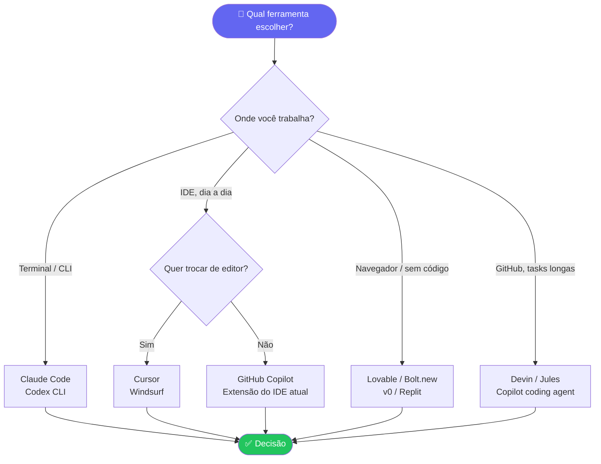

# Ferramentas de IA para Desenvolvimento

> [!quote] Não existe "a melhor ferramenta"
> *Existe a melhor ferramenta para cada tarefa : e o desenvolvedor profissional de 2026 normalmente combina duas ou três.*

---

## 1. O mapa das categorias (2026) 🗺️

| Categoria | O que faz | Exemplos |
|-----------|-----------|----------|
| **Agentes de terminal** | Agente autônomo no terminal, lê o projeto inteiro, edita, roda e testa | **Claude Code**, OpenAI Codex CLI, Gemini CLI |
| **IDEs nativas de IA** | Editor completo redesenhado em torno da IA | **Cursor**, Windsurf, Google Antigravity, AWS Kiro |
| **Extensões de IDE** | IA dentro do editor que você já usa | **GitHub Copilot** (VS Code, JetBrains...) |
| **App builders (vibe coding)** | Da descrição ao app publicado, no navegador | **Lovable, Bolt.new, v0, Replit** |
| **Agentes em background** | Trabalham na nuvem ligados ao repositório, abrem PRs | Devin, Codex cloud, Jules, Copilot coding agent |
| **Review com IA** | Primeira passada de code review automática | CodeRabbit, Copilot code review |
| **Chats generalistas** | Tirar dúvidas, planejar, aprender | ChatGPT, Claude, Gemini |

---

## 2. Níveis de autonomia 🤖

Entender o **nível de autonomia** de uma ferramenta é mais importante do que a marca. Quanto maior a autonomia, mais o desenvolvedor atua como *revisor* e menos como *digitador*.


> [!note] Por que isso importa para o engenheiro?
> Ferramentas de baixa autonomia exigem mais atenção contínua, mas oferecem mais controle imediato. Ferramentas de alta autonomia liberam tempo, mas exigem **infraestrutura de verificação** (testes, CI/CD, revisão de PR) para serem seguras. A escolha do nível certo depende do estágio do projeto e da maturidade da equipe.

---

## 3. Os três líderes de mercado 🥇

### GitHub Copilot : o padrão corporativo

- **O que é:** extensão multi-IDE (VS Code, JetBrains, etc.) + agente no GitHub
- **Força:** integração total com o ecossistema GitHub; adoção empresarial; preço de entrada (US\$ 10/mês)
- **Perfil:** times que vivem no GitHub e querem IA "ligada por padrão" pra todo mundo
- **Benchmark:** 56% no SWE-bench Verified (fev/2026, com GPT-4o como motor)
- **Limitação conhecida:** modo agente tem dificuldade com mudanças que cruzam mais de 10 arquivos

### Cursor : o favorito dos desenvolvedores

- **O que é:** IDE completa (fork do VS Code) com IA em todos os fluxos
- **Força:** experiência de edição : o **Composer** propõe mudanças em múltiplos arquivos numa passada; tab-completion excelente; contexto do projeto inteiro
- **Benchmark:** 51,7% no SWE-bench Verified; 72% de taxa de aceitação no autocomplete (Supermaven)
- **Perfil:** quem passa o dia editando código e quer a IA na ponta dos dedos (US\$ 20/mês)
- **Novidade 2026:** Bugbot (disponível desde fev/2026) revisa PRs automaticamente e propõe correções com ~80% de resolução em issues simples

### Claude Code : o teto de capacidade

- **O que é:** agente **nativo de terminal** (Anthropic); também em IDE, web e desktop
- **Força:** raciocínio profundo em tarefas complexas; contexto de até **1 milhão de tokens** (codebases inteiras sem perder o fio); autonomia longa; subagentes, skills e MCP
- **Benchmark:** 88,6% no SWE-bench Verified com Claude Opus 4.8, segundo melhor resultado público em jun/2026
- **Adoção:** 41% dos desenvolvedores profissionais usam Claude Code (fev/2026); em empresas com menos de 200 funcionários, esse número sobe para 75%
- **Perfil:** tarefas grandes e multi-arquivo, refatorações profundas, automação agêntica (US\$ 20 a US\$ 200/mês)

> [!tip] O stack combinado mais comum em 2026
> **Cursor (ou VS Code+Copilot) para o dia a dia** + **Claude Code para tarefas pesadas/agênticas**. Ferramentas deixaram de ser excludentes: são camadas.

---

## 4. Comparativo rápido dos três líderes 📊

| Critério | GitHub Copilot | Cursor | Claude Code |
|----------|---------------|--------|-------------|
| **Tipo** | Extensão IDE | IDE completa | Agente de terminal |
| **Preço mínimo** | US\$ 10/mês | US\$ 20/mês | US\$ 20/mês |
| **SWE-bench (jun/2026)** | 56% | 51,7% | 88,6% |
| **Autonomia** | Média | Alta | Muito alta |
| **Contexto do projeto** | Parcial | Projeto inteiro | Projeto inteiro (1M tokens) |
| **Melhor para** | Times GitHub | Edição diária | Tarefas complexas |
| **Multi-arquivo** | Limitado (agente) | Sim (Composer) | Sim (nativo) |
| **Suporte multi-IDE** | VS Code, JetBrains, Neovim, Xcode... | VS Code (fork) | Qualquer terminal |

---

## 5. App builders : software pelo navegador 🌐

Para MVPs e protótipos (detalhes em [[Criação Rápida de MVPs]]):

| Ferramenta | Destaque | Típico para |
|------------|----------|-------------|
| **Lovable** | Código React limpo; o mais amigável para não-devs | SaaS MVP de founder não-técnico |
| **Bolt.new** | Prompt para app full-stack rodando no navegador | Validação rápida de ideia |
| **v0 (Vercel)** | UIs Next.js bonitas; integração com o deploy da Vercel | Front-ends e landing pages |
| **Replit Agent** | IDE online + agente + banco + hosting no mesmo lugar | Híbrido: prompt + codar junto |

Mercado em 2026: **US\$ 4,7 bi**, com **63% de usuários não-desenvolvedores**. Lovable atingiu US\$ 300M+ de ARR e captou US\$ 330M em dez/2025. Replit cresceu de US\$ 10M para US\$ 100M ARR em 9 meses após lançar o Agent mode, com 35 milhões de usuários cadastrados.

> [!warning] Vibe coding tem limites
> App builders são excelentes para prototipagem rápida, mas o código gerado muitas vezes carece de testes automatizados, segurança adequada e escalabilidade. Em produção, o engenheiro precisa auditar o que a IA entregou antes de publicar.

---

## 6. Agentes em background : a fronteira 🔬

Trabalham **sem você na frente da tela**, ligados ao repositório:

- Você atribui uma issue ao agente e ele abre um **PR pronto** com testes
- Triagem automática de bugs; atualização de dependências; pequenas features
- Exemplos: **Devin**, **OpenAI Codex (cloud)**, **Google Jules**, **Copilot coding agent**
- Caso real: os "Minions" da Stripe geram **mais de 1.300 PRs aceitos por semana**, todos sem linha de código escrita por humano

> [!warning] Pré-requisito
> Agente em background sem **CI forte + suíte de testes + code review obrigatório** = fábrica de incidentes. A infraestrutura de **DevOps** é o que torna isso seguro.

---

## 7. Os modelos por trás das ferramentas ⚙️

As ferramentas são "carrocerias"; o motor são os LLMs:

- **Anthropic Claude** (Opus, Sonnet) : referência em código e agentes de longa duração
- **OpenAI GPT / Codex** : generalistas fortes, ecossistema gigante
- **Google Gemini** : multimodal, contexto enorme, integração Google
- **Modelos abertos** (DeepSeek, Qwen, Llama...) : rodam localmente, privacidade e custo

**Como se mede?** Benchmarks como **SWE-bench** (resolver issues reais do GitHub) e **Terminal-Bench** avaliam a capacidade dos modelos em tarefas de engenharia de software. Em jun/2026, Claude Opus 4.8 atinge 88,6% no SWE-bench Verified, só atrás do GPT-5.5 (88,7%).

---

## 8. Como escolher (critérios de engenheiro) 🧭



Os seis critérios para avaliar qualquer ferramenta:

1. **Nível de autonomia necessário:** autocomplete? chat? agente?
2. **Onde você trabalha:** terminal, IDE, navegador, GitHub?
3. **Tamanho do contexto:** projetos grandes pedem janelas grandes
4. **Privacidade:** código pode sair da máquina? Há opção enterprise/local?
5. **Custo vs. valor:** US\$ 10 a US\$ 200/mês versus horas economizadas
6. **Ecossistema:** suporta MCP? AGENTS.md? Skills? CI?

> [!example] Regra prática para a disciplina
> - Aprender/explorar: chat (Claude, ChatGPT, Gemini)
> - Editar código todo dia: Cursor ou VS Code + Copilot
> - Tarefa grande, multi-arquivo: Claude Code
> - MVP de produto: Lovable/Bolt/v0 (ver [[Criação Rápida de MVPs]])

---

## 9. Atividades práticas 🧪

> [!example] 🧪 Atividade 1: Instalar e testar uma ferramenta de IA
>
> **Ferramenta:** GitHub Copilot (gratuito para estudantes via GitHub Education) ou Cursor (trial gratuito)
>
> **Passo a passo:**
> 1. Instale a extensão GitHub Copilot no VS Code (ou baixe o Cursor em cursor.com)
> 2. Abra um projeto vazio e crie um arquivo `calculadora.py`
> 3. Digite apenas o comentário: `# função que recebe dois números e retorna a soma, subtração, multiplicação e divisão`
> 4. Pressione Enter e observe a sugestão da IA (Tab para aceitar)
> 5. Repita com `# função que valida se um CPF brasileiro é válido`
>
> **Resultado observável:** duas funções completas geradas, com tratamento de erro, sem que você tenha escrito o corpo delas. Registre: quantas linhas foram geradas? Houve alguma linha incorreta que precisou de correção?
>
> **Discussão:** compare o tempo que levaria para escrever manualmente versus o tempo gasto com a IA (incluindo a revisão do código gerado).

> [!example] 🧪 Atividade 2: Comparar duas ferramentas na mesma tarefa
>
> **Ferramentas:** GitHub Copilot Chat vs. Claude (claude.ai, gratuito)
>
> **Tarefa:** pedir para cada ferramenta gerar uma API REST simples em Python (Flask ou FastAPI) com dois endpoints: `GET /usuarios` e `POST /usuarios`. O banco de dados pode ser um dicionário em memória.
>
> **Roteiro de anotação:**
> | Critério | Copilot Chat | Claude |
> |----------|-------------|--------|
> | Linhas de código geradas | | |
> | Inclui tratamento de erros? | Sim/Não | Sim/Não |
> | Inclui exemplos de uso? | Sim/Não | Sim/Não |
> | O código rodou de primeira? | Sim/Não | Sim/Não |
> | Precisou de correções? Quantas? | | |
>
> **Resultado observável:** tabela preenchida com diferenças concretas entre as ferramentas na mesma tarefa, mostrando que ferramentas distintas têm pontos fortes distintos mesmo para pedidos idênticos.

> [!example] 🧪 Atividade 3: Medir aceleração com autocomplete de IA
>
> **Ferramenta:** Cursor ou VS Code + Copilot
>
> **Parte A (sem IA):** implemente manualmente a função abaixo em Python, medindo o tempo:
> ```python
> def contar_palavras(texto: str) -> dict:
>     # retorna um dicionário com cada palavra e quantas vezes aparece no texto
>     # ignorar maiúsculas/minúsculas e pontuação
> ```
>
> **Parte B (com IA):** abra uma nova sessão, desative/ignore as sugestões anteriores, e implemente a MESMA função deixando o autocomplete da IA agir. Aceite sugestões quando fizerem sentido.
>
> **Resultado observável:** dois tempos anotados (com e sem IA) + avaliação de qualidade: qual versão tem mais casos cobertos? Qual precisou de menos correção? O ganho de velocidade compensa a necessidade de revisão?

---

## 10. Panorama de adoção em 2026 📈

Dados de mercado que contextualizam a relevância do tema:

- **92%** dos desenvolvedores norte-americanos usam alguma ferramenta de IA diariamente (2026)
- **41%** de todo o código escrito globalmente é gerado ou co-gerado por IA
- **Claude Code** lidera entre profissionais com 41% de adoção, seguido por Copilot (38%)
- Em empresas pequenas (menos de 200 funcionários), Claude Code chega a 75% de adoção
- O mercado de "vibe coding" (app builders) atingiu US\$ 4,7 bi em 2026
- A Stripe processa mais de 1.300 PRs por semana gerados 100% por agentes, sem código humano

> [!info] Impacto na carreira
> Saber *usar* ferramentas de IA não é o diferencial de 2026: isso já é commodity. O diferencial é saber **quando confiar**, **quando revisar com cuidado** e **como montar a infraestrutura** (testes, CI/CD, revisão) que torna o uso de agentes seguro em produção.

---

## 11. Próximos passos e leituras recomendadas 📚

➡️ **Próxima aula:** [[Criação Rápida de MVPs]] : usar essas ferramentas para colocar um produto no ar.

> [!note] 📚 Fontes (2026)
> - [AI Coding Agents 2026: Cursor, Copilot, Claude Code, Kiro : Lushbinary](https://lushbinary.com/blog/ai-coding-agents-comparison-cursor-windsurf-claude-copilot-kiro-2026/)
> - [Claude Code vs GitHub Copilot vs Cursor (2026): Honest Comparison : CosmicJS](https://www.cosmicjs.com/blog/claude-code-vs-github-copilot-vs-cursor-which-ai-coding-agent-should-you-use-2026)
> - [Best AI Coding Agents for 2026: Real-World Developer Reviews : Faros AI](https://www.faros.ai/blog/best-ai-coding-agents-2026)
> - [AI Coding Tools Landscape 2026: From Copilot to the Agent Era : EastonDev](https://eastondev.com/blog/en/posts/ai/ai-coding-tools-panorama-2026/)
> - [Claude Code vs GitHub Copilot 2026: SWE-bench, Pricing : Tech Insider](https://tech-insider.org/claude-code-vs-github-copilot-2026/)
> - [GitHub Copilot vs Cursor 2026: 56% vs 51.7% SWE-bench : Tech Insider](https://tech-insider.org/github-copilot-vs-cursor-2026-2/)
> - [How Stripe's Minions Ship 1,300 PRs a Week : ByteByteGo](https://blog.bytebytego.com/p/how-stripes-minions-ship-1300-prs)
> - [Lovable vs Bolt vs Replit: Honest 2026 Comparison : Vibe Coding Academy](https://www.vibecodingacademy.ai/blog/lovable-vs-bolt-vs-replit-comparison-2026)
> - [Vibecoding Statistics: 2026 Data and Trends : Kristian Larsen](https://www.kristian-larsen.com/info/vibecoding-statistics/)
> - [Devin AI Guide 2026 : AI Tools DevPro](https://aitoolsdevpro.com/ai-tools/devin-guide/)
