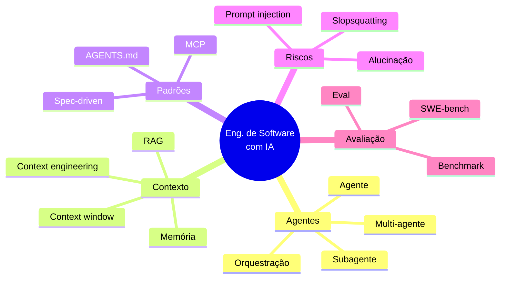

# Glossário de Engenharia de Software com IA

> [!tip] Como usar
> Referência rápida de **todos os termos modernos** vistos na disciplina (e os que você vai encontrar em vagas, artigos e comunidades). Termos em inglês são mantidos: é assim que o mercado usa.

---

## 🗺️ Mapa dos conceitos

> [!abstract] Como os termos se conectam
> O glossário é A-Z, mas as ideias se agrupam em famílias. Use este mapa para enxergar o todo antes de mergulhar nos termos.

| Categoria | Termos-chave |
|---|---|
| 🤖 **Agentes** | Agente, Agentic coding, Multi-agente, Subagente, Background agent, Orquestração, Workflow agêntico |
| 🧠 **Contexto** | Context engineering, Context window, Context rot, RAG, Memória, Embedding |
| 🔌 **Padrões e protocolos** | MCP, AGENTS.md, CLAUDE.md, Spec, Spec-driven development |
| ⚠️ **Riscos e segurança** | Alucinação, Slopsquatting, Prompt injection, Slop, Guardrails, Sandbox, Jailbreak |
| 📊 **Modelos e avaliação** | LLM, Reasoning model, Frontier model, Benchmark, SWE-bench, Eval, Token |
| 🛠️ **Prática de dev** | Vibe coding, Pair programming, TDD, Refactoring, Scaffolding, Diff, PR, Worktree |

---

## 📖 Glossário A-Z

### A

- **Agente (AI agent):** LLM rodando em **loop** com acesso a ferramentas (editar arquivos, rodar comandos, navegar). Planeja → executa → observa → corrige, até concluir a tarefa.
- **Agentic coding / Agentic engineering:** desenvolvimento profissional dirigindo agentes: specs claras, contexto curado, checkpoints de revisão e testes como contrato. Sucessor do vibe coding. Ver [[Vibe Coding e Engenharia Agêntica]].
- **AGENTS.md:** padrão aberto (2025) de arquivo Markdown na raiz do repositório com instruções para agentes: comandos de build/teste, convenções, restrições. Governado por fundação ligada à Linux Foundation.
- **AI-assisted development:** termo guarda-chuva para qualquer uso de IA no desenvolvimento (do autocomplete ao agente autônomo).
- **AI-native:** projeto/equipe/produto desenhado **desde o início** assumindo IA no fluxo (em oposição a "adicionamos IA depois").
- **Alucinação (hallucination):** o modelo gera informação falsa com aparência confiável: APIs inexistentes, parâmetros inventados, fatos errados.
- **Autocomplete (code completion):** nível 1 de autonomia, sugestão de código enquanto você digita (Copilot clássico, Cursor Tab).

### B

- **Background agent:** agente que trabalha **na nuvem, sem supervisão em tempo real**, ligado ao repositório: pega issues, abre PRs prontos (Devin, Codex cloud, Jules).
- **Benchmark:** medida padronizada de capacidade de modelos. Para código, os mais citados: **SWE-bench** (resolver issues reais do GitHub) e **Terminal-Bench** (tarefas de terminal).
- **Boilerplate:** código repetitivo de estrutura (configurações, CRUD básico), o primeiro tipo de código que a IA eliminou do trabalho manual.

### C

- **Chain-of-thought (CoT):** técnica de fazer o modelo "pensar em voz alta", em passos, antes de responder. Melhora muito problemas de lógica, código e matemática.
- **Checkpoint / Human-in-the-loop (HITL):** ponto do fluxo agêntico em que o humano **revisa e aprova** antes do agente continuar. A prática central da engenharia agêntica.
- **CLAUDE.md:** arquivo de contexto durável do Claude Code (mesma ideia do AGENTS.md): regras, comandos e convenções que o agente lê em toda sessão.
- **Code review com IA:** primeira passada de revisão automática em PRs (CodeRabbit, Copilot review). Complementa, não substitui, o review humano.
- **Context engineering (engenharia de contexto):** a disciplina de **selecionar e estruturar tudo que entra na janela de contexto** do modelo (instruções, código, docs, ferramentas, memória). Considerada a habilidade nº 1 do desenvolvimento com IA em 2026. Ver [[Engenharia de Contexto e Spec-Driven Development]].
- **Context rot:** degradação da qualidade das respostas quando a janela de contexto enche de informação irrelevante ou conversa longa demais.
- **Context window (janela de contexto):** quantidade máxima de tokens que o modelo "enxerga" de uma vez (em 2026: de ~128k a 1M+ tokens, codebases inteiras).
- **Prompt caching (cache de contexto):** reaproveitar partes fixas do contexto (system prompt, docs) entre chamadas para reduzir custo e latência.

### D-E

- **Destilação (distillation):** treinar um modelo menor a partir de um maior, para ter qualidade parecida com custo e latência muito menores.
- **Diff:** a diferença entre versões de código. Revisar o diff (não o arquivo inteiro) é como se revisa trabalho de agente.
- **Dívida técnica:** custo futuro de decisões rápidas no presente. A IA pode pagar (refatorando) ou multiplicar (gerando código aceito sem revisão). Ver [[Boas Práticas e Riscos da IA no Desenvolvimento]].
- **Embedding:** representação numérica (vetor) de texto/código que captura significado, base de buscas semânticas e RAG.
- **Eval:** teste automatizado **do comportamento da IA** (não do software): mede se o modelo/agente resolve um conjunto de tarefas. "Escrever evals" virou trabalho de engenheiro.

### F-H

- **Few-shot / Zero-shot:** prompting com alguns exemplos / sem exemplos.
- **Fine-tuning:** re-treinar um modelo base com dados específicos para especializá-lo. Caro; em geral RAG ou contexto resolvem antes.
- **Frontier model (modelo de fronteira):** os modelos mais capazes do momento, no limite do estado da arte (a "linha de frente" que define o que é possível).
- **Function calling / Tool use:** capacidade do modelo de **chamar ferramentas** (funções, APIs) em vez de só gerar texto, o mecanismo que torna agentes possíveis.
- **Guardrails:** restrições técnicas que limitam o que o agente pode fazer (permissões, sandboxes, listas de comandos bloqueados).

### I-L

- **Inferência (inference):** o ato de executar o modelo para gerar uma resposta (em oposição ao treinamento).
- **Jailbreak:** truque de prompt que tenta burlar as regras de segurança do modelo para fazê-lo produzir o que não deveria. Parente do prompt injection.
- **LLM (Large Language Model):** modelo de linguagem de grande escala treinado para prever texto, a tecnologia base de tudo nesta disciplina (Claude, GPT, Gemini, DeepSeek...).
- **Lock-in:** dependência de um fornecedor. Padrões abertos (MCP, AGENTS.md) existem para reduzi-lo.
- **LoRA (Low-Rank Adaptation):** técnica de fine-tuning **barata**, que ajusta só uma fração dos pesos do modelo em vez de re-treinar tudo.
- **Low-code / No-code:** plataformas de desenvolvimento com pouco/nenhum código. Os app builders de IA (Lovable, Bolt) são a geração 2026 dessa ideia.

### M-O

- **MCP (Model Context Protocol):** protocolo aberto que padroniza a conexão entre modelos e ferramentas/dados externos, o "USB-C da IA". Ver [[Engenharia de Contexto e Spec-Driven Development]].
- **Memória (de agente):** mecanismo de persistir aprendizados entre sessões (arquivos de memória, bancos vetoriais), o agente "lembra" do projeto.
- **Mixture of Experts (MoE):** arquitetura em que só uma parte do modelo (alguns "especialistas") é ativada por consulta, dando modelos enormes com custo de execução menor.
- **Multi-agente:** arquitetura com vários agentes cooperando: orquestrador + especialistas (pesquisa, implementação, teste, review), possivelmente em paralelo.
- **MVP (Minimum Viable Product):** versão mínima de um produto que permite aprender com usuários reais. Ver [[Criação Rápida de MVPs]].
- **One-shot:** gerar o resultado completo em uma única interação ("one-shotei o app" = saiu de primeira).
- **Open-weight / Open-source model:** modelo cujos pesos são públicos (Llama, DeepSeek, Qwen), você pode rodar localmente (ver [[Ollama - gerenciamento de modelos de IA]]) e adaptar.
- **Orquestração:** coordenar múltiplos agentes/etapas num fluxo de trabalho, o novo trabalho do desenvolvedor sênior.

### P-R

- **Pair programming com IA:** trabalhar lado a lado com a IA como par (o "navegador" que nunca cansa). Evolução do pair programming do XP.
- **Prompt:** a instrução dada ao modelo.
- **Prompt engineering:** técnica de escrever prompts eficazes (zero-shot, few-shot, chain-of-thought...). Continua útil, mas foi superada em importância pelo context engineering.
- **Prompt injection:** ataque em que instruções maliciosas escondidas **nos dados** que o agente lê tentam sequestrar seu comportamento. O risco de segurança nº 1 da era agêntica (OWASP LLM01). Ver [[Boas Práticas e Riscos da IA no Desenvolvimento]].
- **PR (Pull Request):** proposta de mudança de código para revisão, a unidade de entrega dos agentes modernos.
- **Quantização (quantization):** reduzir a precisão numérica dos pesos do modelo (ex.: de 16 para 4 bits) para ele rodar em máquinas modestas, com pequena perda de qualidade.
- **RAG (Retrieval-Augmented Generation):** arquitetura em que o sistema **busca** informação relevante (docs, código, base de conhecimento) e a injeta no contexto antes de gerar a resposta. Como construir produtos de IA que conhecem seus dados.
- **ReAct (Reasoning + Acting):** padrão em que o agente alterna entre **raciocinar** e **agir** (usar ferramentas), passo a passo, a base de muitos agentes.
- **Reasoning model (modelo de raciocínio):** geração de modelos (2024+) que "pensam" antes de responder, gastando mais computação em problemas difíceis, muito mais fortes em código e matemática.
- **Red teaming:** testar um sistema de IA de propósito, tentando quebrá-lo (jailbreaks, injections, abusos), para achar falhas antes do atacante.
- **Refactoring (refatoração):** melhorar a estrutura do código sem mudar seu comportamento, tarefa em que agentes brilham (com testes como rede).

### S

- **Sandbox:** ambiente isolado onde o agente pode executar código sem riscos ao sistema real.
- **Scaffolding:** gerar a estrutura inicial de um projeto (pastas, configs, esqueleto), trabalho de segundos para um agente.
- **Semantic search (busca semântica):** buscar por **significado**, não por palavra exata, usando embeddings. O motor de busca do RAG.
- **Skill / Slash command:** workflow reutilizável empacotado que o agente executa sob demanda (`/deploy`, `/review-pr`).
- **Slop (AI slop):** conteúdo/código gerado por IA em massa, verboso e de baixa qualidade, aceito sem revisão.
- **Slopsquatting:** ataque de supply chain que registra pacotes com nomes que LLMs costumam alucinar, esperando devs instalarem. Ver [[Boas Práticas e Riscos da IA no Desenvolvimento]].
- **Spec (especificação):** documento que define o que construir, com critérios verificáveis.
- **Spec-driven development (SDD):** metodologia em que a spec é o artefato central: requirements → design → tasks → implementação por agentes (Kiro, GitHub Spec Kit). Ver [[Engenharia de Contexto e Spec-Driven Development]].
- **Structured output (saída estruturada / JSON mode):** forçar o modelo a responder num formato fixo (JSON com esquema), essencial para integrar IA com código de verdade.
- **Subagente:** agente auxiliar disparado por outro agente para uma subtarefa isolada (pesquisar, explorar código), preservando o contexto principal.
- **SWE-bench:** o benchmark mais citado para agentes de código: resolver issues reais de repositórios do GitHub.
- **System prompt:** as instruções fixas que definem identidade e regras do modelo/agente, a primeira camada de contexto.

### T-Z

- **TDD (Test-Driven Development):** testes antes do código. Na era da IA, virou modo de **dirigir** agentes: você escreve os testes (o contrato), o agente implementa até passar.
- **Temperatura (temperature):** parâmetro que controla o quão "criativa" ou aleatória é a resposta. Baixa = previsível e factual; alta = variada e inventiva.
- **Token:** unidade mínima de texto para o modelo (~3/4 de uma palavra). Define custos e limites de contexto.
- **Tool use:** ver *Function calling*.
- **Vector database (banco vetorial):** banco de dados que guarda embeddings e acha os mais parecidos rapidamente (Pinecone, Chroma, pgvector). A memória de longo prazo do RAG.
- **Vibe coding:** programar descrevendo em linguagem natural e aceitando o código gerado sem revisar tudo (Karpathy, fev/2025). Ótimo para protótipos; perigoso em produção. Ver [[Vibe Coding e Engenharia Agêntica]].
- **Workflow agêntico:** sequência estruturada de etapas executadas por agentes com pontos de verificação (determinístico onde importa, autônomo onde é seguro).
- **Worktree:** cópia isolada do repositório Git que permite a vários agentes trabalharem em paralelo sem conflito.

---

> [!example] 🧪 Atividade: ache os termos no mundo real
> 1. Abra uma **vaga de desenvolvedor** (LinkedIn, Gupy) ou o **README** de um projeto de IA no GitHub.
> 2. Marque **5 termos** deste glossário que aparecem lá.
> 3. Pegue **1 termo que você não conhecia**, leia a definição e explique em voz alta (pra alguém ou pra você mesmo) sem olhar.
> 4. Resultado observável: sua lista dos 5 termos + a frase explicando o novo.

> [!note] 📚 Fontes e referências oficiais
> - [Model Context Protocol (site oficial)](https://modelcontextprotocol.io/)
> - [AGENTS.md (padrão aberto)](https://agents.md/)
> - [SWE-bench (benchmark)](https://www.swebench.com/)
> - [OWASP Top 10 for LLM Applications](https://genai.owasp.org/llm-top-10/)

---

> [!info] Termo novo apareceu por aí?
> Este glossário é vivo: a área cria termos novos a cada semestre. Encontrou um que não está aqui? Traga para a aula: pesquisar e definir termos novos vale pontos extras. 😉
