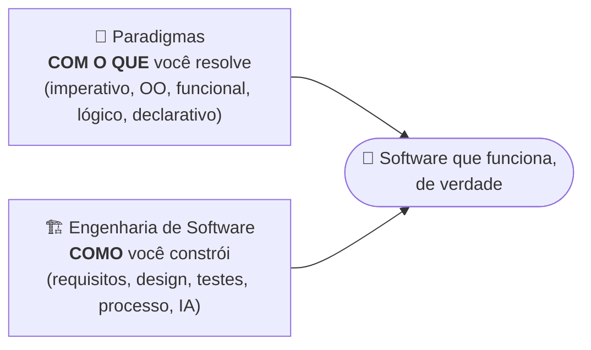
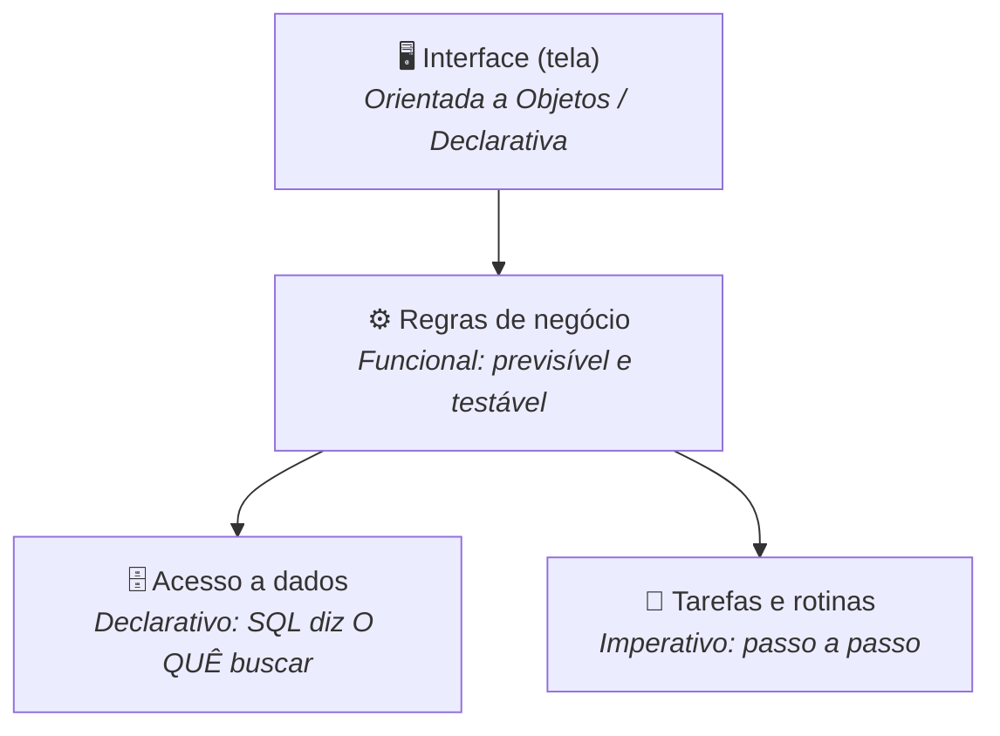
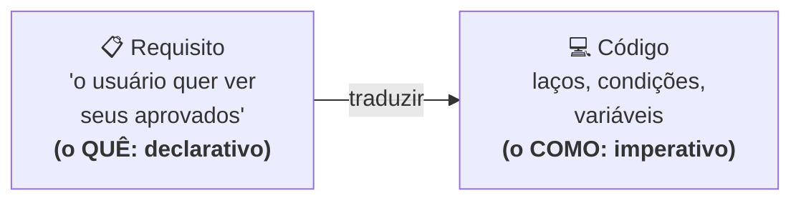
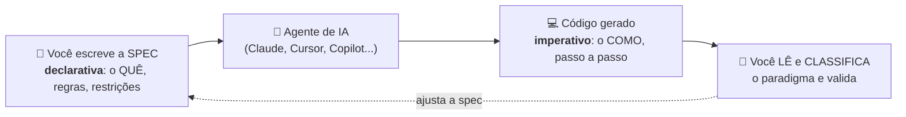
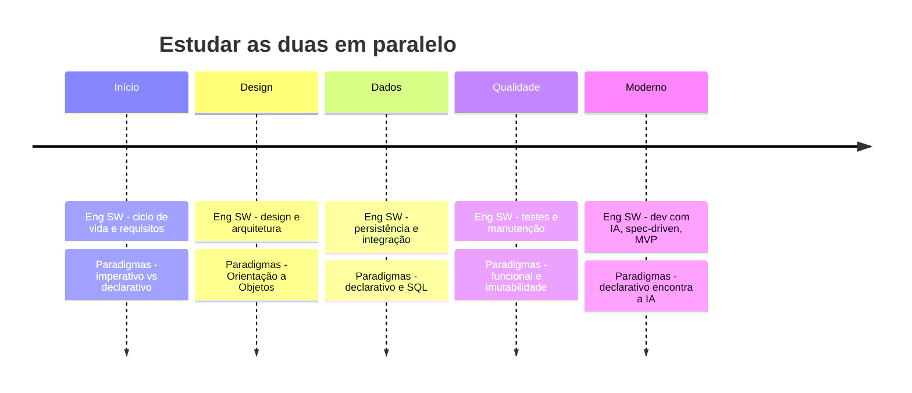

# Integração: Engenharia de Software e Paradigmas

> [!quote] Por que esta página existe
> *Você está cursando duas disciplinas que parecem separadas, mas são as duas metades da mesma história: construir software de verdade. **Paradigmas** te dá os moldes pra resolver um problema. **Engenharia de Software** te ensina a transformar isso em produto. Esta página mostra como as duas se encaixam, e como estudá-las juntas faz cada uma render mais.*

> [!info] Vale pra você mesmo cursando só uma das duas
> Esta aula foi escrita pra fazer sentido mesmo se você está só em Paradigmas **ou** só em Engenharia de Software. Cada disciplina anda sozinha; aqui mostramos a ponte entre elas.



> [!abstract] O que você vai levar desta aula
> - O que cada disciplina realmente é, em uma frase
> - Três pontes concretas que ligam as duas
> - O elo de 2026: por que escrever uma **spec** ou um **prompt** é programação declarativa
> - Um **roteiro de estudo integrado** pra cursar as duas em sintonia

---

## 🧩 O que é cada disciplina (em uma frase)

| Disciplina | A pergunta que ela responde | Foco |
|---|---|---|
| **[[Paradigmas de programação\|Paradigmas de Programação]]** | *Com qual molde eu resolvo este problema?* | Imperativo vs declarativo: estruturado, procedural, OO, funcional, lógico |
| **[[Engenharia de Software\|Engenharia de Software]]** | *Como eu transformo uma ideia em um produto confiável?* | Requisitos, design, testes, qualidade, processo, e desenvolvimento com IA |

> [!tip] A metáfora da cozinha
> Paradigmas são as **técnicas de corte e cocção** (refogar, grelhar, fermentar): cada uma resolve melhor um tipo de ingrediente. Engenharia de Software é **administrar o restaurante inteiro**: planejar o cardápio, organizar a cozinha, garantir que o prato chega bom e no horário. Um bom chef precisa das duas coisas.

Veja o mapa dos paradigmas que você estuda em Paradigmas. Guarde essa árvore: cada ramo vai reaparecer dentro de um sistema real na próxima seção.

![[arvore-paradigmas-programacao.png|Árvore dos paradigmas de programação: o grande corte entre imperativo e declarativo e seus ramos]]

> [!example] 🧪 Atividade 1: As duas disciplinas no seu dia
> 1. Abra qualquer app que você usou hoje (banco, iFood, Instagram).
> 2. Escreva **uma** funcionalidade dele (ex: "transferir dinheiro", "buscar restaurante perto de mim").
> 3. Acesse o repositório **[Flask no GitHub](https://github.com/pallets/flask)** (um framework web real) e abra a pasta `src/flask/`. Abra **2 arquivos `.py` diferentes** e ache, em cada um, um trecho que seja claramente **orientado a objetos** (uma `class`) e outro que seja **funcional** (um `map`, `filter` ou *list comprehension*). Anote arquivo + número da linha de cada um.
> 4. Resultado observável: uma mini-tabela `arquivo : linha : paradigma`. Você acabou de ver, em código de produção, paradigmas (Paradigmas) **dentro** de um projeto organizado (Engenharia de Software).

---

## 🔗 Como as duas se conectam

Não é só que "andam juntas". Existem três pontes concretas.

### Ponte 1: Todo sistema real é multiparadigma

Em 2026, as linguagens mais usadas (Python, Java, JavaScript, C#, Kotlin, Swift, TypeScript) são todas **multiparadigma**. Ou seja: no mesmo sistema, você escolhe um paradigma diferente pra cada camada, de propósito.



> [!info] Onde Engenharia de Software entra
> Escolher o paradigma **errado** para uma camada gera código difícil de manter, testar e evoluir, exatamente os problemas que a Engenharia de Software tenta evitar. Logo: **boa escolha de paradigma é uma decisão de engenharia.**

> [!example] 🧪 Atividade 2: O mesmo problema em 3 moldes
> 1. Abra o **[Python Tutor](https://pythontutor.com/visualize.html)** (visualizador de execução, roda no navegador).
> 2. Cole e rode as três versões do mesmo problema (somar uma lista):
> ```python
> nums = [10, 20, 30, 40]
> # 1. Imperativo
> soma = 0
> for n in nums:
>     soma += n
> # 2. Declarativo
> soma2 = sum(nums)
> # 3. Funcional
> from functools import reduce
> soma3 = reduce(lambda a, b: a + b, nums)
> print(soma, soma2, soma3)
> ```
> 3. Use o botão **"Visualize Execution"** e avance passo a passo.
> 4. Resultado observável: responda em uma linha: **qual das três criou uma variável intermediária (`soma`) e escancarou o "como"? Qual escondeu o "como" e só disse o "o quê"?** Essa diferença é o coração de Paradigmas.

### Ponte 2: Requisito é "o quê"; código é "o como"

Engenharia de Software começa perguntando **o que** o sistema precisa fazer (requisitos). Isso é pensamento **declarativo**. Depois, alguém escreve **como** fazer, em código geralmente **imperativo**. A distância entre essas duas coisas é onde mora o trabalho do desenvolvedor.



> [!example] 🧪 Atividade 3: Do requisito ao código, num projeto real
> 1. Vá ao repositório do **[VS Code no GitHub](https://github.com/microsoft/vscode/issues)** e abra a aba **Issues**.
> 2. Ache **uma issue fechada** que descreva uma funcionalidade (o "o quê"). Copie o título.
> 3. Dentro dela, ache o link do **Pull Request** que a resolveu e abra a aba **"Files changed"** (o "como": o código de verdade).
> 4. Resultado observável: anote **issue (o quê) → PR (o como)** e diga se o código mudado é mais imperativo ou declarativo. Você acabou de ver o pipeline da Engenharia de Software (requisito vira código) com os paradigmas dentro dele.

### Ponte 3: O elo de 2026: programar com IA é declarativo

Esta é a conexão mais atual entre as duas disciplinas. No desenvolvimento moderno (**spec-driven** e **engenharia agêntica**), você **descreve o que quer** (uma *spec*, um *prompt*) e um **agente de IA gera o como** (o código). Repare: isso é, na veia, a distinção **imperativo × declarativo** de Paradigmas, subida um nível. **Escrever uma boa spec é programar a IA de forma declarativa.**



> [!tip] Por que isso conecta as duas disciplinas de verdade
> O profissional de Engenharia de Software de 2026 passa menos tempo digitando código e mais tempo **escrevendo specs e revisando** o que a IA gerou. Pra revisar bem, ele precisa **reconhecer paradigmas** no código gerado e julgar se foi a melhor escolha. Sem Paradigmas, você aceita qualquer coisa que a IA cospe. Com Paradigmas, você é o engenheiro no controle.

> [!example] 🧪 Atividade 4: Vire o "programador declarativo" de uma IA
> 1. Abra um assistente de IA (**[Claude](https://claude.ai/)**, ChatGPT, Gemini ou Cursor).
> 2. Escreva uma **spec declarativa**, sem dizer como fazer: *"Crie uma função Python que receba uma lista de notas e retorne a média apenas dos aprovados (nota maior ou igual a 6), ignorando valores nulos."*
> 3. Leia o código gerado e responda: **qual paradigma a IA escolheu?** (laço imperativo? `filter`/comprehension funcional?)
> 4. Agora **reescreva sua spec** forçando o outro paradigma: *"...usando estilo funcional, sem laços e sem variáveis mutáveis."* Gere de novo.
> 5. Resultado observável: as **duas versões** lado a lado + uma frase dizendo qual você acha mais fácil de manter e por quê. Parabéns: você usou Engenharia de Software (especificar e avaliar) e Paradigmas (classificar e escolher) na mesma tarefa.

---

## 🗺️ Roteiro de estudo integrado

Uma forma de cursar as duas em sintonia: cada tema de uma disciplina "conversa" com um tema da outra na mesma época.



| Quando | Em Engenharia de Software | Em Paradigmas | A ponte |
|---|---|---|---|
| Início | Ciclo de vida, requisitos | Imperativo × declarativo | Requisito é o "o quê"; código é o "como" |
| Design | Design e arquitetura | Orientação a Objetos | Modelar o domínio é escolher o molde do núcleo |
| Dados | Persistência, integração | Declarativo / SQL | SQL diz o "o quê"; o banco resolve o "como" |
| Qualidade | Testes, manutenção | Funcional | Função pura é mais fácil de testar e raciocinar |
| Moderno | Dev com IA, spec-driven, MVP | Declarativo, de novo | Spec/prompt = programar a IA de forma declarativa |

> [!success] A grande ideia pra levar pra casa
> **Paradigmas te ensina a pensar em moldes. Engenharia de Software te ensina a entregar um produto. Juntas, elas formam o desenvolvedor que escolhe a ferramenta certa e ainda guia a IA em vez de ser guiado por ela.**

---

## 🎓 Quiz de fixação

> [!question] Teste seu entendimento (sem rodar nada, só pra fixar)
> 1. Em uma frase: qual a diferença entre o que Paradigmas responde e o que Engenharia de Software responde?
> 2. Por que dizer "escrever um prompt é declarativo" conecta as duas disciplinas?
> 3. Cite uma camada de um sistema e o paradigma que costuma encaixar melhor nela.
> 4. Por que um engenheiro que conhece paradigmas revisa melhor o código gerado por IA?

---

## 📚 Fontes (2026)

> [!note] Para se aprofundar
> - [Spec-Driven Development and AI-Assisted Software Engineering (Built In)](https://builtin.com/articles/spec-driven-development-ai-assisted-software-engineering)
> - [From Vibe Coding to Spec-Driven Development (Towards Data Science)](https://towardsdatascience.com/from-vibe-coding-to-spec-driven-development/)
> - [An Introductory Guide to Different Programming Paradigms (DataCamp)](https://www.datacamp.com/blog/introduction-to-programming-paradigms)
> - [Three Ways to Program with LLMs (declarativo vs imperativo)](https://opencui.medium.com/three-ways-to-program-with-llms-b8d3027fbd63)
> - [PDL: A Declarative Prompt Programming Language (arXiv)](https://arxiv.org/pdf/2410.19135)

---

## 🔎 Continue por aqui

- [[Engenharia de Software|Disciplina: Engenharia de Software]]
- [[Paradigmas de programação|Tópico: Paradigmas de Programação]]
- [[Programação|Disciplina: Programação]]
