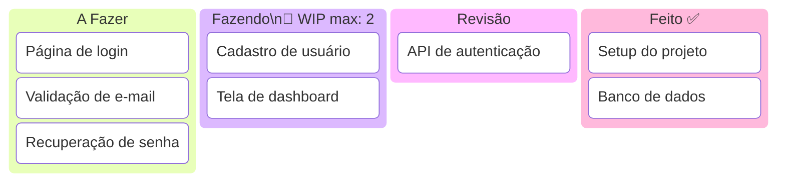
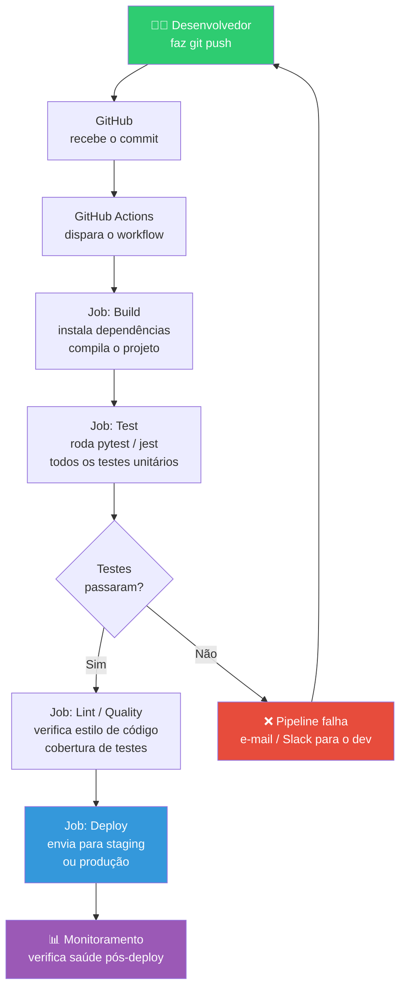
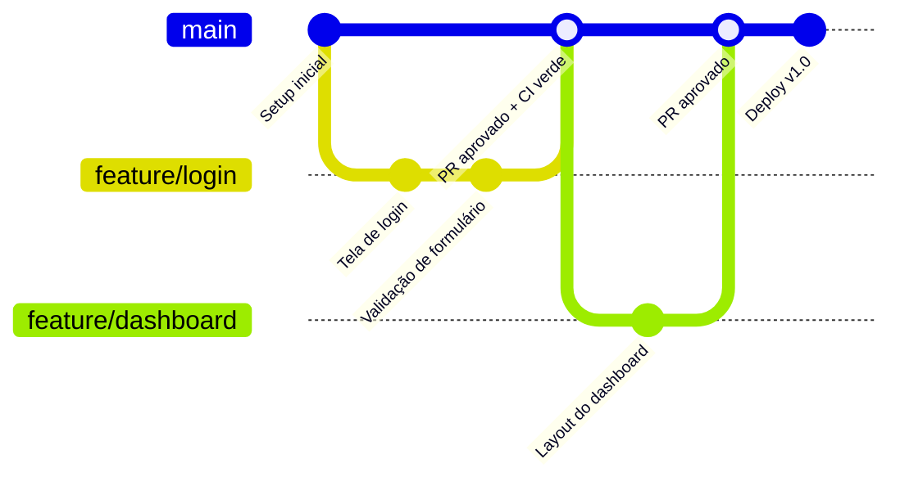
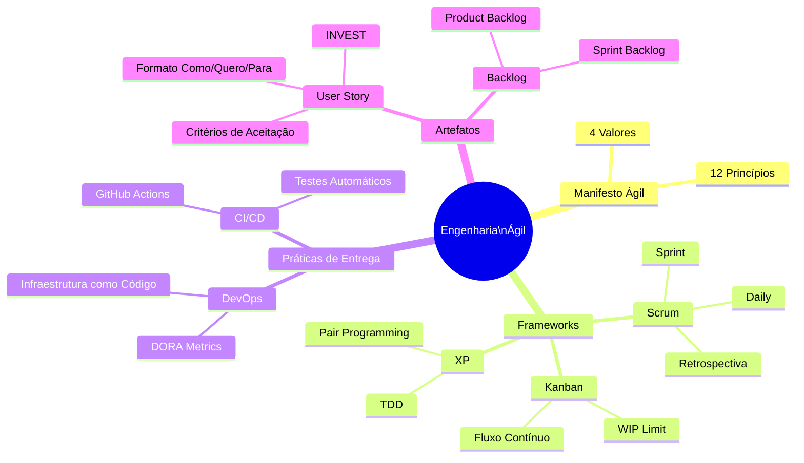

# Metodologias Ágeis e DevOps

> [!quote] A virada de chave
> *Em 2001, dezessete programadores cansados de burocracia se reuniram numa estação de esqui em Utah e escreveram um manifesto de 68 palavras que mudou a indústria inteira.*

---

## 1. 📜 O Manifesto Ágil (2001)

> [!INFO] Os 4 valores
> - **Indivíduos e interações** mais que processos e ferramentas
> - **Software funcionando** mais que documentação abrangente
> - **Colaboração com o cliente** mais que negociação de contratos
> - **Responder a mudanças** mais que seguir um plano
>
> *"Ou seja, embora haja valor nos itens à direita, valorizamos mais os itens à esquerda."*

### Por que o ágil venceu a cascata?

| Cascata | Ágil |
|---------|------|
| Cliente vê o software só no final | Entrega funcional a cada 1 a 4 semanas |
| Mudança de requisito = problema | Mudança = oportunidade (esperada) |
| Aposta tudo num grande plano inicial | Aprende e corrige a rota continuamente |
| Feedback tardio (caro) | Feedback constante (barato) |

### Os 12 princípios por trás do Manifesto

O Manifesto vai além dos 4 valores: ele tem 12 princípios que guiam o comportamento de um time ágil. Os mais importantes para entender na prática:

1. **Entrega contínua e frequente**: satisfazer o cliente por meio de entrega adiantada e contínua de software com valor.
2. **Mudança é bem-vinda**: até mesmo em estágios avançados do desenvolvimento.
3. **Colaboração diária**: pessoas de negócio e desenvolvedores devem trabalhar juntos diariamente.
4. **Equipes autogeridas**: os melhores requisitos emergem de times motivados e com autonomia.
5. **Comunicação face a face**: a forma mais eficiente de comunicação (ou, no mundo remoto de 2026: vídeo curto em vez de documento longo).
6. **Software funcionando** é a medida primária de progresso.
7. **Sustentabilidade**: ritmo constante indefinidamente, sem "corrida de última hora".
8. **Excelência técnica e bom design** aumentam a agilidade.
9. **Simplicidade**: maximizar a quantidade de trabalho NÃO feito.
10. **Reflexão e adaptação periódica**: o time ajusta seu comportamento a cada ciclo.

> [!tip] Número vivo: 86% em 2025
> Segundo o 17º Relatório State of Agile (Digital.ai, 2025), **86% das organizações** já aplicam Ágil em algum nível. Em 2026, o modelo híbrido, misturando Scrum com Kanban e Lean, é a norma nas equipes de alta performance.

---

## 2. 🏃 Scrum: o framework ágil mais usado

### Papéis

- **Product Owner (PO):** dono da visão do produto; prioriza o backlog
- **Scrum Master:** facilita o processo e remove impedimentos
- **Time de Desenvolvimento:** constrói o produto (multidisciplinar, auto-organizado)

### Eventos (cerimônias)

| Evento | Duração | Para quê |
|--------|---------|----------|
| **Sprint** | 1 a 4 semanas | Ciclo de trabalho com objetivo definido |
| **Sprint Planning** | Início da sprint | Selecionar o que será feito |
| **Daily** | 15 min/dia | Sincronizar o time (fiz / farei / impedimentos) |
| **Sprint Review** | Fim da sprint | Demonstrar o incremento ao cliente |
| **Retrospectiva** | Fim da sprint | Melhorar o *processo* do time |

### Artefatos

- **Product Backlog:** lista priorizada de tudo que o produto precisa
- **Sprint Backlog:** itens selecionados para a sprint atual
- **Incremento:** software funcionando entregue ao fim da sprint

### Diagrama: fluxo de uma Sprint Scrum

```mermaid
flowchart LR
    PB[Product Backlog\nprioritizado] --> SP[Sprint Planning\n2h por semana de sprint]
    SP --> SB[Sprint Backlog\nitens selecionados]
    SB --> D1[Daily 1\n15 min]
    D1 --> D2[Daily 2\n15 min]
    D2 --> D3[...\nDailys]
    D3 --> SR[Sprint Review\nDemo ao cliente]
    SR --> RET[Retrospectiva\nMelhoria do processo]
    RET --> PB2[Product Backlog\natualizado]
    PB2 --> SP2[Próxima Sprint]
    style PB fill:#4A90D9,color:#fff
    style SB fill:#E67E22,color:#fff
    style SR fill:#27AE60,color:#fff
    style RET fill:#8E44AD,color:#fff
```



> [!example] 🧪 Atividade: Mini Sprint com GitHub Projects
> **Ferramenta:** GitHub Projects (aba Projects em qualquer repositório seu no GitHub)
>
> **O que fazer:**
> 1. Crie um repositório público no GitHub chamado `mini-sprint-[seunome]`.
> 2. Acesse a aba **Projects** e crie um projeto do tipo **Board** (quadro Kanban).
> 3. Adicione as colunas: `Backlog`, `Sprint Atual`, `Em Progresso`, `Revisão`, `Feito`.
> 4. Crie **3 issues** no repositório representando 3 tarefas de um sistema simples (ex: tela de login, cadastro de usuário, validação de formulário). Cada issue é uma user story (use o formato "Como [usuário] quero [ação] para [benefício]").
> 5. Mova os 3 cards para `Sprint Atual` (isso simula o Sprint Planning).
> 6. Implemente a primeira tarefa (pode ser um arquivo HTML simples), faça commit e mova o card para `Feito`.
>
> **Resultado observável:** ao final, você tem um quadro com pelo menos 1 card em `Feito`, 1 commit no repo e a sensação real de como o fluxo Scrum funciona na prática, com rastreabilidade total entre tarefa e código.

---

## 3. 📋 Kanban e XP

### Kanban

- Quadro visual: **A Fazer → Fazendo → Feito** (colunas adaptáveis)
- **Limite de WIP** (work in progress): pouca coisa em andamento ao mesmo tempo = mais foco e fluxo
- Sem sprints: fluxo contínuo. Ótimo para manutenção e suporte

### Kanban vs. Scrum: quando usar cada um?

| Critério | Scrum | Kanban |
|----------|-------|--------|
| Natureza do trabalho | Projetos com escopo definível por ciclo | Fluxo contínuo, suporte, manutenção |
| Planejamento | Sprint Planning fixo | Puxar novo item quando há capacidade |
| Papéis definidos | Sim (PO, SM, Dev) | Não obrigatório |
| Entrega | Ao fim de cada sprint | Contínua, conforme cada item termina |
| Melhor para | Novos produtos, funcionalidades | Operações, bugs, atendimento |

> [!tip] Híbrido em 2026
> A maioria das empresas maduras usa **Scrumban**: sprints do Scrum com limites de WIP do Kanban. Você planeja por ciclo, mas não "trava" o fluxo de itens urgentes que aparecem no meio da sprint.

### Diagrama: quadro Kanban com WIP limit



> [!warning] WIP limit na prática
> Se a coluna "Fazendo" tem limite 2 e já tem 2 cards, NINGUÉM pega um card novo antes de concluir um. Isso parece lento, mas na verdade aumenta o fluxo total: itens chegam ao "Feito" mais rápido porque o time foca em terminar, não em começar.

> [!example] 🧪 Atividade: Quadro Kanban no Trello com WIP limit
> **Ferramenta:** Trello (trello.com, gratuito) ou GitHub Projects
>
> **O que fazer:**
> 1. Crie uma conta gratuita no Trello e um quadro chamado `Kanban [seunome]`.
> 2. Crie as listas: `Backlog`, `Fazendo (max 2)`, `Revisão (max 1)`, `Feito`.
> 3. Adicione 5 cards no `Backlog`, cada um com um título de tarefa de desenvolvimento (ex: "Criar formulário de contato", "Conectar ao banco de dados", "Escrever testes unitários", "Documentar API", "Fazer deploy no Render.com").
> 4. Mova 2 cards para `Fazendo`. Tente mover um terceiro: perceba que viola o WIP limit (o limite é visual, você mesmo aplica a disciplina).
> 5. "Conclua" um card movendo-o para `Feito` e só então puxe o próximo do `Backlog`.
> 6. Adicione uma etiqueta colorida em cada card indicando a prioridade (Vermelho = urgente, Amarelo = normal, Verde = pode esperar).
>
> **Resultado observável:** você experimenta na pele o motivo pelo qual o WIP limit existe: forçar o foco em terminar antes de começar algo novo. Tire um screenshot do quadro para entregar.

### Extreme Programming (XP)

Práticas técnicas que o Scrum não cobre:

- **Pair programming:** dois devs, um teclado (hoje: você + IA é o novo par)
- **TDD:** testes antes do código
- **Refatoração contínua:** melhorar o design sem mudar o comportamento
- **Integração contínua:** integrar o código várias vezes ao dia
- **Releases pequenos e frequentes**

---

## 4. 📝 Histórias de Usuário

Formato padrão para expressar requisitos no mundo ágil:

> [!example] Template
> **Como** [tipo de usuário], **quero** [ação] **para** [benefício].
>
> *Ex: Como aluno, quero receber notificação quando uma nota for lançada, para acompanhar meu desempenho sem precisar checar o sistema toda hora.*

- **Critérios de aceitação:** condições objetivas que definem "pronto"
- **INVEST:** boa história é Independente, Negociável, Valiosa, Estimável, Pequena (Small) e Testável
- **Priorização MoSCoW:** Must / Should / Could / Won't

### O que faz uma user story ruim?

| Problema | Exemplo ruim | Exemplo corrigido |
|----------|--------------|-------------------|
| Muito vaga | "O sistema deve ser rápido" | "Como usuário, quero que a busca retorne resultados em menos de 1 segundo para não perder o foco na tarefa" |
| Técnica demais | "Refatorar o ORM de acesso ao banco" | "Como administrador, quero que o relatório carregue em menos de 3 segundos para não atrasar reuniões" |
| Grande demais (épico) | "Como usuário, quero me cadastrar e gerenciar minha conta completa" | Dividir em histórias menores: cadastro, edição de perfil, troca de senha |
| Sem critério de aceitação | "Como cliente, quero pagar online" | Adicionar: "Dado que o carrinho tem itens, quando clico em Pagar, então vejo as opções PIX e cartão e recebo confirmação por e-mail" |

> [!example] 🧪 Atividade: Escreva sua primeira User Story com critérios de aceitação
> **Ferramenta:** qualquer editor de texto ou card no Trello/GitHub
>
> **O que fazer:**
> 1. Escolha um sistema que você usa no dia a dia (SIGAA, iFood, WhatsApp, Spotify).
> 2. Identifique uma funcionalidade que poderia ser melhorada ou que ainda não existe.
> 3. Escreva 1 user story no formato: "Como [tipo de usuário] quero [ação] para [benefício]."
> 4. Escreva pelo menos 3 critérios de aceitação no formato: "Dado que [contexto], quando [ação], então [resultado esperado]."
> 5. Classifique a história usando INVEST: ela é Independente? Negociável? Valiosa? Estimável? Pequena? Testável? Anote quais critérios ela passa e o que precisaria mudar para passar nos demais.
>
> **Resultado observável:** um card ou documento com 1 user story completa + 3 critérios de aceitação + análise INVEST. Leve para discussão em sala.

> [!tip] Conexão com 2026
> História de usuário + critérios de aceitação é exatamente o formato que evoluiu para as **specs** que agentes de IA consomem no [[Engenharia de Contexto e Spec-Driven Development|Spec-Driven Development]].

---

## 5. ♾️ DevOps: desenvolvimento + operações

> [!INFO] Definição
> DevOps é a **cultura** que une desenvolvimento (Dev) e operações (Ops) para entregar software com velocidade e confiabilidade, automatizando tudo que for possível entre o commit e a produção.

### O ciclo infinito do DevOps

```mermaid
flowchart LR
    PLAN[🗂️ Planejar\nbacklog, sprints] --> CODE[💻 Codificar\ngit commit, PR]
    CODE --> BUILD[🔨 Compilar\nbuild automatizado]
    BUILD --> TEST[🧪 Testar\ntestes automáticos]
    TEST --> RELEASE[📦 Empacotar\ndocker image, artefato]
    RELEASE --> DEPLOY[🚀 Implantar\nCD para produção]
    DEPLOY --> OPERATE[⚙️ Operar\nservidores, escala]
    OPERATE --> MONITOR[📊 Monitorar\nlogs, métricas, alertas]
    MONITOR --> PLAN
    style PLAN fill:#3498DB,color:#fff
    style CODE fill:#2ECC71,color:#fff
    style BUILD fill:#E67E22,color:#fff
    style TEST fill:#9B59B6,color:#fff
    style RELEASE fill:#1ABC9C,color:#fff
    style DEPLOY fill:#E74C3C,color:#fff
    style OPERATE fill:#F39C12,color:#fff
    style MONITOR fill:#34495E,color:#fff
```



> O ciclo nunca para: monitorar gera novas ideias de melhoria, que voltam ao planejamento. É por isso que o logo do DevOps é um símbolo de infinito (∞).

### CI/CD: o coração do DevOps

- **CI (Integração Contínua):** a cada push, o sistema automaticamente compila o código e roda todos os testes. Quebrou? O time é avisado em minutos.
- **CD (Entrega/Implantação Contínua):** se tudo passou, o software vai para produção automaticamente (ou com um clique).

```
commit → build → testes automáticos → análise de qualidade → deploy → monitoramento
```

Ferramentas típicas: **GitHub Actions**, GitLab CI, Jenkins.

### Diagrama: pipeline CI/CD com GitHub Actions



> [!example] 🧪 Atividade: Observe um pipeline CI rodando no GitHub Actions
> **Ferramenta:** GitHub (github.com, gratuito)
>
> **O que fazer:**
> 1. Acesse qualquer repositório público que você conhece, ou use um famoso como `facebook/react`, `django/django` ou `tiangolo/fastapi`.
> 2. Clique na aba **Actions**.
> 3. Clique em uma das execuções mais recentes (escolha uma que terminou, seja com sucesso ou falha).
> 4. Explore os **Jobs**: veja os nomes dos jobs (ex: build, test, lint, deploy).
> 5. Clique num job e expanda os **Steps**: veja exatamente o que o computador fez, linha a linha (instalar pacotes, rodar testes, publicar artefato).
> 6. Abra o arquivo `.github/workflows/` do repositório e leia o arquivo `.yml` que define o pipeline. Identifique: qual evento dispara o workflow (`on:`)? Quais jobs existem? Quais comandos cada step roda?
>
> **Resultado observável:** você consegue responder por escrito: (a) qual evento dispara o pipeline; (b) quantos jobs tem; (c) o que acontece quando um teste falha. Anote o nome do repo e o arquivo `.yml` lido.

### Práticas complementares

- **Infraestrutura como Código (IaC):** servidores definidos em arquivos versionados (Terraform, Docker)
- **Containers (Docker):** o app roda igual em qualquer máquina
- **Monitoramento e observabilidade:** logs, métricas e alertas em produção
- **Feature flags:** ligar/desligar funcionalidades sem novo deploy

### DORA Metrics: como saber se o DevOps está funcionando?

O grupo de pesquisa DORA (DevOps Research and Assessment), adquirido pelo Google, criou 4 métricas que separam times de elite de times medianos:

| Métrica | O que mede | Time Elite (2025) |
|---------|------------|------------------|
| **Deployment Frequency** | Com que frequência vai para produção | Múltiplas vezes por dia |
| **Lead Time for Changes** | Tempo entre commit e produção | Menos de 1 hora |
| **Mean Time to Restore** | Quanto tempo para recuperar de uma falha | Menos de 1 hora |
| **Change Failure Rate** | % de deploys que causam incidente | Menos de 5% |

> [!tip] DORA em 2025
> O relatório DORA 2025 focou inteiramente em IA no desenvolvimento. Quase 90% dos times já usam IA no trabalho diário, principalmente para geração de código, debugging e testes. Times com cultura DevOps forte adotaram IA muito mais rápido.

---

## 6. 🌿 Git e GitHub no fluxo profissional

1. Criar **branch** para a tarefa
2. Commits pequenos e frequentes
3. Abrir **Pull Request (PR)**
4. **Code review** por outro dev (hoje, frequentemente por IA também)
5. CI roda os testes automaticamente
6. Merge na branch principal e deploy

### Diagrama: Git Flow simplificado



---

## 7. 🤖 Por que essa aula importa na era da IA

> [!tip] O ágil preparou o terreno para a IA
> - **Iteração rápida:** agentes de IA iteram em segundos, não em sprints
> - **Testes automatizados:** é o que permite confiar em código gerado por IA
> - **CI/CD:** é o que permite que um agente faça deploy com segurança
> - **Histórias e critérios de aceitação:** viraram as specs que a IA consome
> - **Code review:** virou a habilidade humana mais importante de todas
>
> Times que já eram ágeis e automatizados absorveram IA em semanas. Times presos na cascata manual ainda estão tentando.

### IA nos times ágeis em 2026

As práticas ágeis evoluíram para acomodar a IA como membro do time:

- **Pair programming com IA:** GitHub Copilot, Cursor e Claude Code são o "par" de todo desenvolvedor. XP previu isso em 1999.
- **Retrospectivas com análise de dados:** ferramentas de IA analisam o histórico de sprints e apontam padrões (o que costuma travar no "Fazendo", quais tipos de task excedem a estimativa).
- **Geração de testes:** IA gera casos de teste a partir dos critérios de aceitação das user stories.
- **CI inteligente:** pipelines que identificam automaticamente quais testes rodar com base nos arquivos modificados, reduzindo o tempo de feedback de minutos para segundos.

> [!warning] O que a IA não substitui (ainda)
> - A **conversa com o cliente** para entender o problema real
> - A **decisão de prioridade** do Product Owner
> - O **julgamento humano** no code review sobre impactos de segurança e arquitetura
> - A **retrospectiva honesta**: o time precisa sentir psicologicamente seguro para apontar o que está errado

---

## 8. 📊 Resumo Visual: Ágil, Scrum, Kanban e DevOps



---

> [!note] 📚 Fontes (2026)
> - [Manifesto para Desenvolvimento Ágil de Software (oficial)](https://agilemanifesto.org/iso/ptbr/manifesto.html)
> - [Kanban vs. Scrum: qual escolher? (Atlassian, 2026)](https://www.atlassian.com/agile/kanban/kanban-vs-scrum)
> - [Agile Trends: The 2026 Guide (Agilemania)](https://agilemania.com/agile-trends-2025)
> - [Why Agile, CI/CD, and DevOps Work Better Together (Devtron)](https://devtron.ai/blog/agile-ci-cd-devops/)
> - [Build a CI/CD Pipeline with GitHub Actions (Tech Insider, 2026)](https://tech-insider.org/github-actions-ci-cd-pipeline-tutorial-2026/)
> - [DORA 2025: Faster, But Are We Any Better? (DevOps.com)](https://devops.com/dora-2025-faster-but-are-we-any-better/)
> - [2025 DORA State of AI-Assisted Software Development (Google Cloud)](https://cloud.google.com/resources/content/2025-dora-ai-assisted-software-development-report)
> - [DORA Metrics: How to measure DevOps Success (Atlassian)](https://www.atlassian.com/devops/frameworks/dora-metrics)
> - [Melhores Práticas de CI/CD com GitHub Actions em 2026 (gabrieldevs.com.br)](https://www.gabrieldevs.com.br/2026/02/melhores-praticas-de-cicd-com-github.html)
> - [Software Development Methodologies: Complete 2026 Guide (Riseup Labs)](https://riseuplabs.com/software-development-methodologies/)
> - [Trello para Ágil: guia completo de Kanban (CodeLucky)](https://codelucky.com/trello-for-agile-kanban/)
> - [Quickstart para GitHub Actions (Documentação oficial)](https://docs.github.com/en/actions/get-started/quickstart)

➡️ **Próxima aula:** [[Desenvolvimento de Software com IA]]: a maior mudança da história da engenharia de software.
