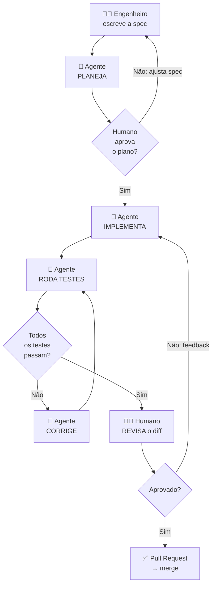
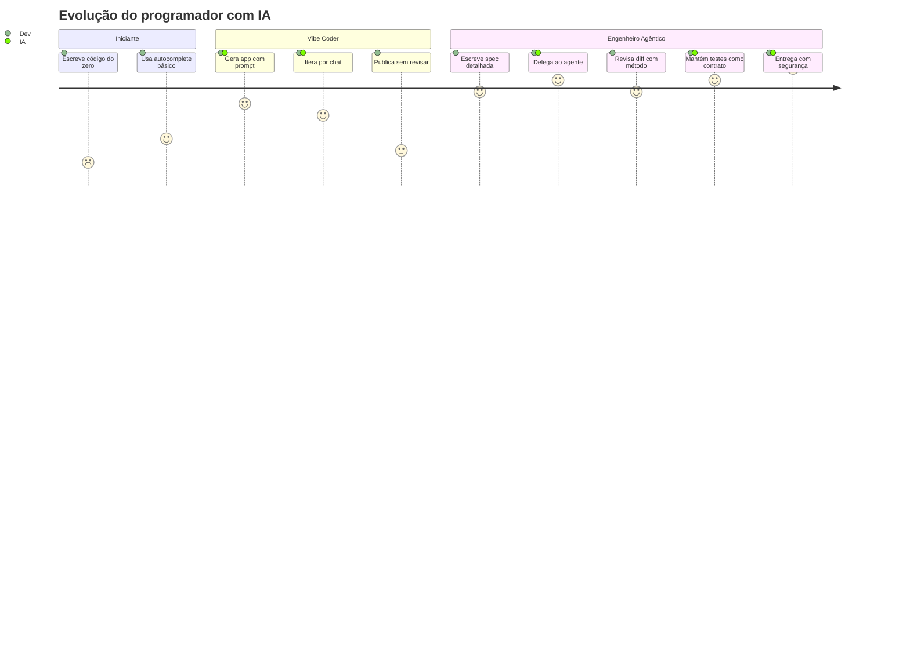
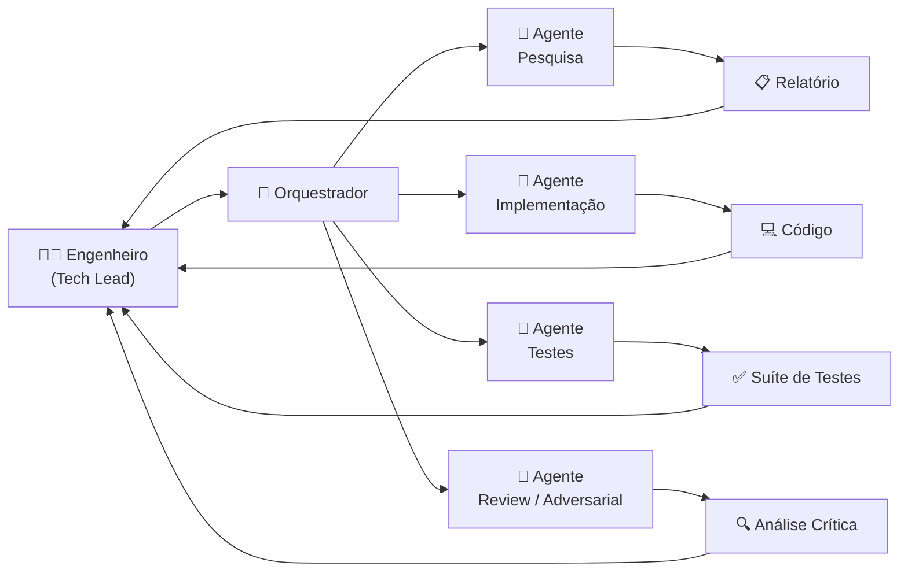
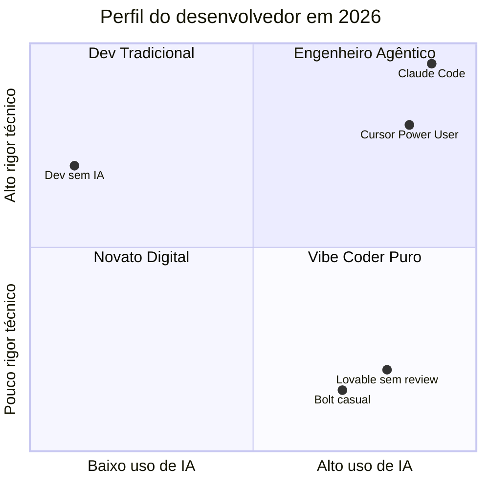

# Vibe Coding e Engenharia Agêntica

> [!quote] Andrej Karpathy (fev/2025)
> *"Existe um novo tipo de programação que eu chamo de 'vibe coding', onde você se entrega totalmente às vibes, abraça os exponenciais e esquece que o código existe."*

---

## 1. Vibe Coding 🎨

> [!INFO] Definição
> **Vibe coding** é programar **descrevendo o que você quer em linguagem natural** e aceitando o código que a IA gera, muitas vezes sem ler tudo. O foco está no *resultado* (o app funcionando), não no código em si.

O termo foi cunhado por **Andrej Karpathy** (cofundador da OpenAI, ex-diretor de IA da Tesla) em fevereiro de 2025 e virou a palavra do ano no desenvolvimento de software, sendo eleito pelo Collins English Dictionary como *Word of the Year 2025*.

### O fluxo típico

1. Descrever a ideia: *"faz um app de lista de tarefas com login e tema escuro"*
2. A IA gera o projeto inteiro
3. Testar clicando no resultado
4. Pedir ajustes em linguagem natural: *"o botão tá feio, deixa arredondado"*
5. Repetir até ficar bom
6. Publicar

### Onde o vibe coding brilha ✅

- **Protótipos e MVPs:** validar uma ideia em horas (ver [[Criação Rápida de MVPs]])
- **Projetos pessoais e automações:** "software descartável" feito sob medida
- **Aprendizado:** ver código funcionando e perguntar "por quê?"
- **Não-programadores:** em 2026, 63% dos usuários de app builders não são devs

### Onde o vibe coding quebra ❌

- **Produção com dados reais de usuários:** segurança não pode ser "vibe"
- **Sistemas que crescem:** sem arquitetura, o castelo de cartas desaba
- **Código que ninguém entende:** se quebrar às 3h da manhã, quem conserta?
- **Times:** código sem padrão e sem review não escala para equipes

> [!warning] A ressaca do vibe coding
> 2025-2026 encheu a internet de apps vazando chaves de API, bancos de dados abertos e código impossível de manter. O mercado aprendeu: vibe coding é ótimo para *começar*, péssimo como *método profissional*. A resposta da indústria foi a **engenharia agêntica**.

---

## 2. O Mercado em Números 📊

> [!INFO] Contexto de mercado (2025-2026)
> Em dois anos, o vibe coding deixou de ser curiosidade e virou infraestrutura de criação de software.

### Adoção e escala

| Indicador | Valor | Ano |
|-----------|-------|-----|
| Desenvolvedores usando ou planejando usar IA | 82 a 84% | Mar/2026 |
| Código global gerado por IA | 46% | 2026 |
| Crescimento de adoção enterprise | +340% | 2025/2026 |
| Crescimento de adoção por não-técnicos | +520% ano a ano | 2025/2026 |
| Tamanho do mercado vibe coding | US$ 4,7 bilhões | 2026 |
| Projeção do mercado low-code/no-code | US$ 48,9 bilhões | 2026 |

### As principais ferramentas

| Ferramenta | Perfil | Destaque 2026 |
|------------|--------|---------------|
| **Lovable** | Full-stack no browser, iniciantes | Avaliação de US$ 6,6 bi; US$ 200 milhões de ARR |
| **Bolt.new** | Protótipos rápidos no browser | Do prompt ao app em 20 minutos |
| **v0 (Vercel)** | Componentes React/UI | 2 milhões de usuários em Q1/2026 |
| **Cursor** | IDE com IA, para devs | Avaliação de US$ 9,2 bi; lider em IDE-based |
| **Replit** | Ambiente completo no browser | Execução + deploy integrados |
| **Claude Code** | Agente de terminal profissional | 87,6% no SWE-bench Verified |

> [!tip] Escolhendo a ferramenta certa
> Não há uma "melhor" ferramenta universal. A escolha depende do seu perfil: **Lovable** para quem não programa e quer subir algo rápido; **Cursor** para quem já programa e quer acelerar; **v0** para quem precisa de UI React; **Claude Code** para projetos profissionais em repositórios reais.

---

## 3. O Problema de Segurança do Vibe Coding 🔐

> [!danger] Alerta real: segurança de código gerado por IA
> Um estudo da Carnegie Mellon University mostrou que 61% do código gerado por IA *funciona*, mas apenas 10,5% *passa em revisão de segurança*. Menos de 11 em cada 100 snippets atende padrões básicos de segurança.

### Vulnerabilidades comuns no código gerado por IA

1. **Chaves de API hard-coded:** a IA reproduz padrões sem entender que aquilo é sensível
2. **Autenticação fraca:** "faça login" sem especificar os requisitos gera sistemas inseguros
3. **SSRF (Server-Side Request Forgery):** presente em 100% dos apps testados em estudo de 2025
4. **Ausência de proteção CSRF:** igualmente presente em todos os apps do mesmo estudo
5. **Zero security headers:** configurações básicas de HTTP simplesmente omitidas
6. **Dependências vulneráveis:** o modelo instala pacotes sem verificar versões seguras

### Caso real: o colapso do Moltbook (jan/2026)

O fundador do Moltbook lançou uma rede social afirmando não ter "escrito uma única linha de código". Em três dias: 1,5 milhão de tokens de autenticação expostos, 35 mil endereços de e-mail vazados e mensagens privadas acessíveis. Em março/2026 já havia 35 CVEs registrados diretamente atribuídos a código gerado por IA (contra apenas 6 em janeiro).

> [!warning] A lição
> Vibe coding sem revisão é débito de segurança automatizado. A velocidade de geração supera em muito a velocidade de auditoria manual. Por isso, a engenharia agêntica inclui *testes de segurança automatizados* como parte do loop.

---

## 4. Engenharia Agêntica (Agentic Engineering) 🤖

> [!INFO] Definição
> **Engenharia agêntica** é o uso profissional de **agentes de IA** no desenvolvimento: a IA não apenas sugere código, ela **planeja, executa, testa e itera em loop**, enquanto o humano define objetivos, fornece contexto e **revisa com método**. O próprio Karpathy reconheceu em 2026: a era do vibe coding deu lugar à era da engenharia agêntica.

### O que é um agente?

Um **agente** é um LLM rodando em loop com acesso a ferramentas:

```
        ┌──────────────────────────────┐
        │  1. Recebe a tarefa (spec)   │
        │  2. PLANEJA os passos        │
        │  3. EXECUTA (edita arquivos, │
        │     roda comandos e testes)  │
        │  4. OBSERVA o resultado      │
        │  5. Erro? → corrige e volta  │
        │     ao passo 3               │
        │  6. Sucesso? → entrega       │
        └──────────────────────────────┘
```

A diferença para o chat: você não copia e cola. O agente **age** no projeto de verdade (lê o código, executa, vê o erro, conserta).

### Vibe coding × Engenharia agêntica

| | Vibe Coding | Engenharia Agêntica |
|--|-------------|---------------------|
| Spec | "Vibes", descrições soltas | Especificação escrita e versionada |
| Código | Ignorado ("esqueça que existe") | Revisado nos pontos críticos |
| Testes | Clicar e ver se funciona | Suíte automatizada que o agente roda em loop |
| Contexto | O que couber no chat | Engenharia de contexto deliberada (AGENTS.md, docs) |
| Escala | Um app pequeno | Codebases reais, times, produção |
| Quem usa | Qualquer pessoa | Profissionais |

### Práticas centrais

1. **Plan first:** pedir o plano antes do código; aprovar o plano é mais barato que corrigir a execução
2. **Checkpoints (human-in-the-loop):** o agente para em pontos críticos para revisão humana
3. **Testes como contrato:** o agente só "termina" quando a suíte passa
4. **Tarefas pequenas e bem delimitadas:** agente com escopo gigante = desastre garantido
5. **Contexto persistente:** arquivos como `AGENTS.md`/`CLAUDE.md` ensinam o agente sobre o projeto (ver [[Engenharia de Contexto e Spec-Driven Development]])
6. **Review como gate final:** nada vai para produção sem julgamento humano

---

## 5. O Loop do Agente em Detalhe 🔄

O ciclo de vida de uma tarefa agêntica profissional segue o padrão **PDAR** (Plan, Do, Assess, Review):



> [!tip] Por que o humano aparece nos dois extremos?
> O humano define o *objetivo* (spec) e valida o *resultado* (review). Tudo no meio é execução do agente. Esse é o contrato central da engenharia agêntica: você não precisa entender cada linha, mas precisa entender o que pediu e o que recebeu.

---

## 6. Do Vibe Coding ao Agêntico: a Jornada 🗺️



---

## 7. Fronteira 2026: longa duração e multi-agentes 🌐

### Agentes de longa duração (long-running)

A grande virada de 2026: agentes que não respondem a *um* prompt, mas **trabalham por horas** em uma tarefa, mantendo um loop de execução com replanejamento. Você delega de manhã, revisa o PR à tarde.

### Agentes em background

Rodam fora da sua máquina (na nuvem), ligados ao repositório:

- Triagem automática de issues
- Correção de bugs simples com PR pronto
- Atualização de dependências
- Exemplo real: os "Minions" da Stripe produzem **1.000+ PRs aceitos por semana**

### Benchmarks: o quanto os agentes já resolvem

O benchmark **SWE-Bench Verified** testa agentes contra issues reais do GitHub. O progresso foi vertiginoso:

| Período | Taxa de resolução |
|---------|------------------|
| Out/2023 | 1,96% |
| Abr/2026 | 78,4%+ |
| Claude Code (mai/2026) | 87,6% |

> [!warning] Cuidado com benchmarks
> O scaffold (a "casca" em torno do modelo) importa tanto quanto o modelo em si. Em fevereiro/2026, três frameworks rodando o mesmo modelo base tiveram resultados 17 issues apart em 731 problemas. Benchmark alto não garante que o agente funcione bem no seu projeto específico.

### Multi-agentes e equipes de agentes

- **Subagentes:** um agente "orquestrador" divide a tarefa entre agentes especializados (um pesquisa, outro implementa, outro testa, outro revisa)
- **Paralelismo:** várias frentes de trabalho simultâneas no mesmo projeto (em worktrees/branches isoladas)
- **Adversarial:** um agente gera, outro tenta achar defeitos no que o primeiro fez



> [!tip] A metáfora que define 2026
> O desenvolvedor virou **tech lead de uma equipe de agentes**: distribui tarefas, define padrões, cobra qualidade e decide o que entra. Quem nunca aprendeu a liderar/revisar trabalho dos outros está aprendendo agora, com estagiários infinitamente rápidos e ocasionalmente alucinados.

---

## 8. Na prática: o mesmo pedido nos dois mundos 🔬

> [!example] Tarefa: "adicionar recuperação de senha por e-mail"
>
> **Vibe coder:** *"adiciona recuperação de senha"* → aceita tudo → testa clicando → funcionou → commit. (Token sem expiração? E-mail revelando se a conta existe? Nunca saberá.)
>
> **Engenheiro agêntico:**
> 1. Pede o **plano** ao agente e revisa (fluxo, expiração do token, mensagens neutras)
> 2. Agente implementa **com testes** (token expira, e-mail não vaza existência de conta)
> 3. Roda a suíte completa + linter de segurança
> 4. Revisa o diff nos pontos críticos (geração do token, queries)
> 5. PR → CI → merge
>
> O segundo gastou 20 minutos a mais. O primeiro vai gastar um fim de semana quando vazarem as contas.

---

## 9. Atividades Mão na Massa 🧪

> [!example] 🧪 Atividade 1: Construir e Publicar com Vibe Coding
>
> **Ferramenta:** [Lovable](https://lovable.dev) ou [Bolt.new](https://bolt.new) (gratuitos, no browser, sem instalar nada)
>
> **O que fazer:**
> 1. Acesse Lovable (recomendado para iniciantes) ou Bolt.new
> 2. Use este prompt exato: *"Crie um app de lista de tarefas com as funcionalidades: adicionar tarefa com texto, marcar como concluída, deletar tarefa. Visual limpo com fundo branco e azul. Sem login necessário."*
> 3. Observe o app gerado. Clique em todos os botões. Anote o que funciona e o que não funciona.
> 4. Peça um ajuste em linguagem natural: *"Adicione um contador mostrando quantas tarefas estão pendentes."*
> 5. Clique em "Deploy" / "Publish" e compartilhe o link no chat da turma.
>
> **Resultado observável:** URL pública de um app funcional criado sem escrever código, em menos de 15 minutos.
>
> **Reflexão pós-atividade:** Quanto do código gerado você consegue ler e entender? Em que partes você simplesmente "confiou"?

---

> [!example] 🧪 Atividade 2: Auditar o Código Gerado (caça ao problema)
>
> **Ferramenta:** Lovable ou Bolt.new (continuação da Atividade 1) + qualquer editor de texto
>
> **O que fazer:**
> 1. No app que você criou na Atividade 1, clique em "Code" / "View source" / "Export to GitHub" para ver o código gerado.
> 2. Copie o código para um editor (VS Code, Notepad++, ou o próprio editor do Lovable).
> 3. Procure por **um** de cada um destes itens:
>    - Uma variável com nome genérico (ex: `data`, `result`, `temp`) que dificulta entendimento
>    - Uma função que faz mais de uma coisa (ex: busca E salva ao mesmo tempo)
>    - Uma string de texto em inglês que deveria estar em português (ou vice-versa)
>    - Qualquer coisa que você não entenderia se precisasse corrigir às 3h da manhã
> 4. Documente: copie o trecho problemático, explique em uma frase o que é o problema e como corrigiria.
>
> **Resultado observável:** Um relatório de 1 página (pode ser um arquivo .txt) com o trecho de código + diagnóstico + sugestão de melhoria. Entregar no Classroom.
>
> **Conexão com o tema:** Este exercício simula o *code review*, etapa obrigatória na engenharia agêntica. O problema que você achou é exatamente o que um agente profissional geraria e um desenvolvedor sênior capturaria no review.

---

> [!example] 🧪 Atividade 3: Engenharia Agêntica na Prática (spec → agente → revisão)
>
> **Ferramenta:** [Cursor](https://cursor.com) (versão gratuita) ou [Claude.ai](https://claude.ai) (conta gratuita) em modo de "conversa longa com contexto"
>
> **O que fazer:**
> 1. Escreva uma **spec** (especificação) antes de pedir qualquer código. A spec deve ter:
>    - O que o programa faz (1 parágrafo)
>    - Quem vai usar (persona)
>    - Pelo menos 3 regras de negócio numeradas (ex: "Regra 1: o campo de e-mail deve rejeitar endereços sem @")
>    - O que o programa NÃO faz (limites explícitos)
> 2. Com a spec em mãos, peça ao agente (Cursor ou Claude): *"Leia esta spec e me diga o plano de implementação passo a passo ANTES de gerar qualquer código."*
> 3. Revise o plano. Corrija se necessário. Só depois diga: *"Pode implementar conforme o plano aprovado."*
> 4. Receba o código. Para cada regra de negócio da spec, verifique se existe código correspondente.
> 5. Crie um checklist: `[ ] Regra 1 implementada?`, `[ ] Regra 2 implementada?`, etc. Marque cada uma com evidência (linha de código ou explicação do porquê não está).
>
> **Resultado observável:** A spec original + o checklist preenchido com evidências. Pelo menos 1 item deve ter sido identificado como "não implementado" ou "implementado de forma incompleta" pelo agente.
>
> **A lição central:** A qualidade da saída do agente é proporcional à qualidade da spec de entrada. "Vibe" na entrada = "surpresa" na saída.

---

## 10. Síntese: onde você está nessa jornada? 🧭



> [!tip] O caminho profissional
> O objetivo não é abandonar as ferramentas de vibe coding, mas combinar a **velocidade delas** com o **rigor da engenharia agêntica**: spec bem escrita, revisão com método, testes como contrato. Velocidade sem rigor é dívida técnica. Rigor sem velocidade é obsolescência.

---

➡️ **Próxima aula:** [[Engenharia de Contexto e Spec-Driven Development]], como alimentar agentes com o contexto e as especificações certas.

---

> [!note] 📚 Fontes (2026)
>
> - [Vibecoding Statistics: 2026 Data and Trends (Kristian Larsen)](https://www.kristian-larsen.com/info/vibecoding-statistics/): adoção, mercado e perfil de usuários
> - [Vibe Coding in 2026: $9.2B Cursor, 92% HumanEval (DEV Community)](https://dev.to/pooyagolchian/vibe-coding-in-2026-92b-cursor-92-humaneval-and-the-end-of-boilerplate-161h): valuations e benchmarks de mercado
> - [Best AI Coding Agents in 2026: Harness, Cost, and Accuracy (Firecrawl)](https://www.firecrawl.dev/blog/best-ai-coding-agents): comparativo de agentes e SWE-Bench
> - [SWE-Bench Coding Agent Leaderboard 2026 (Awesome Agents)](https://awesomeagents.ai/leaderboards/swe-bench-coding-agent-leaderboard/): rankings de agentes por benchmark
> - [Vibe Coding Security: Why 62% Of AI-Generated Code Ships With Vulnerabilities (OX Security)](https://www.ox.security/blog/vibe-coding-security/): riscos de segurança e estatísticas de vulnerabilidade
> - [The 4 Most Common Security Risks When Vibe Coding (Evil Martians)](https://evilmartians.com/chronicles/four-most-common-security-risks-when-vibe-coding-your-app): análise técnica das vulnerabilidades mais comuns
> - [The Reality of Vibe Coding: AI Agents and the Security Debt Crisis (Towards Data Science)](https://towardsdatascience.com/the-reality-of-vibe-coding-ai-agents-and-the-security-debt-crisis/): débito de segurança e o caso Moltbook
> - [From Vibe Coding to Spec-Driven Development (Towards Data Science)](https://towardsdatascience.com/from-vibe-coding-to-spec-driven-development/): transição para engenharia agêntica
> - [Humans and Agents in Software Engineering Loops (Martin Fowler)](https://martinfowler.com/articles/exploring-gen-ai/humans-and-agents.html): padrões de human-in-the-loop
> - [Agentic SDLC: Strategic Reading List for CTOs and Tech Leads H1/2026 (Medium)](https://medium.com/data-science-collective/agentic-sdlc-strategic-reading-list-for-ctos-tech-leads-and-engineers-in-h1-2026-29fe06630e72): visão executiva do SDLC agêntico
> - [Best Vibe Coding Platforms in 2026: Full Comparison (Vibe Coding Academy)](https://www.vibecodingacademy.ai/blog/vibe-coding-platforms-compared): comparativo detalhado de plataformas
> - [Claude Code vs SWE-Agent: Research Agent vs Production Agent (Lowcode Agency)](https://www.lowcode.agency/blog/claude-code-vs-swe-agent): diferenças entre agentes acadêmicos e de produção
